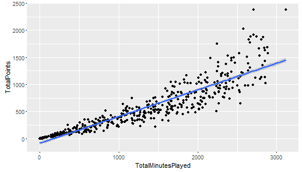

資料探勘
========================================================
author: 曾意儒 Yi-Ju Tseng
date: 2017/05/22
autosize: true
font-family: 'Microsoft JhengHei'
navigation: slide


對應書本章節
========================================================
[10 資料探勘](http://yijutseng.github.io/DataScienceRBook/datamining.html)

大綱
====================================
type:sub-section 

- 什麼是資料探勘
- Regression 迴歸
- Decision Trees 決策樹

什麼是資料探勘
====================================

**資料探勘（Data mining）**是用人工智慧、機器學習、統計學的交叉方法，在相對較大型的資料集中發現模式的計算過程。使用資料探勘技術可以建立從**輸入資料**學習新資訊，變成智慧的**演算法**或**資料模式**，用來**預測事件**或**協助決策**。所以，當資料太`少`或`太髒`的時候，資料探勘的效力會被影響。

資料探勘要派上用場，必須有以下條件：

- 有一些模式/模型可`學`
- 很難定義這些模式/模型
- 有資料可`學`這些模式/模型

資料探勘可應用在
====================================

- 天氣預測
- 搜尋建議、購物建議
- 股市預測
- 臉部辨識、指紋辨識
- 垃圾郵件標記
- 尿布啤酒

資料探勘的分類
====================================

資料探勘可分為**監督式**學習與**非監督式**學習，監督式學習的特點是訓練資料中有**正確答案**，由輸入物件和預期輸出所組成，而演算法可以由訓練資料中學到或建立一個模式，並依此模式推測新的實例；非監督式學習則不用提供**正確答案**，也就是不需要人力來輸入標籤，單純利用訓練資料的特性，將資料分群分組。

此兩種學習可解決不同的問題，條列如下：

- Supervised learning 監督式學習
    - Regression 迴歸：真實的'值'（股票、氣溫）
    - Classification 分類：分兩類（P/N, Yes/No, M/F, Sick/Not sick）/分多類 (A/B/C/D)

- Unsupervised learning 非監督式學習
    - Clustering 分群
    - Association Rules 關聯式規則

監督式學習
====================================

在**監督式**學習中常見的資料探勘演算法如下： 
  - Linear Regression 線性迴歸
  - Logistic Regression 羅吉斯迴歸、邏輯迴歸
  - Support Vector Machines 支持向量機
  - Decision Trees 決策樹
  - K-Nearest Neighbor
  - Neural Networks 神經網路
  - Deep Learning 深度學習

非監督式學習
====================================

在**非監督式**學習中常見的資料探勘演算法如下： 
  - Hierarchical clustering 階層式分群
  - K-means clustering
  - Neural Networks 神經網路
  - Deep Learning 深度學習


Regression 迴歸
====================================

Regression Analysis 迴歸分析主要用在了解兩個或多個變數間`是否相關`、`相關方向與強度`，並建立`數學模型`以便觀察特定變數來預測研究者感興趣的變數，常見的迴歸分析演算法包括：

- Linear Regression 線性迴歸
- Logistic Regression 羅吉斯迴歸、邏輯迴歸

Linear Regression 線性迴歸
====================================

首先，嘗試將Linear Regression 線性迴歸用在NBA的資料看看，做NBA`得分`與`上場分鐘數`的線性迴歸觀察

```r
#讀入SportsAnalytics package
library(SportsAnalytics)
#擷取2015-2016年球季球員資料
NBA1516<-fetch_NBAPlayerStatistics("15-16")
```

迴歸線作圖
====================================

```r
library(ggplot2)
ggplot(NBA1516,aes(x=TotalMinutesPlayed,y=TotalPoints))+
    geom_point()+geom_smooth(method = "glm")
```



lm()
====================================

在R中，最基本的簡單線性迴歸分析為`lm()`，使用方法為`lm(formula,data=資料名稱)`，搭配formula使用，formula的撰寫方法為：依變項~自變項1＋自變項2＋....

```r
lm(TotalPoints~TotalMinutesPlayed,data =NBA1516)
```

```

Call:
lm(formula = TotalPoints ~ TotalMinutesPlayed, data = NBA1516)

Coefficients:
       (Intercept)  TotalMinutesPlayed  
          -85.9071              0.4931  
```

TotalPoints = `0.4931` * TotalMinutesPlayed `-85.9071`

glm()
====================================
更被廣泛使用的是廣義線性迴歸模型generalized linear models (glm)，函數為`glm()`，使用方法與`lm()`類似，包括了線性迴歸模型和邏輯迴歸模型。
如果需要修改預設模型，可設定family參數：
    - `family="gaussian"` 線性模型模型
    - `family="binomial"` 邏輯迴歸模型
    - `family="poisson"` 卜瓦松迴歸模型
    
Gaussian distribution
====================================
Gaussian distribution高斯函數是`常態分布`的密度函數

Binomial distribution
====================================
Binomial distribution二項分布是`n個獨立的是/非試驗中成功的次數`的離散機率分布

Poisson distribution
====================================
Poisson distribution`次數`分佈：

- 某一服務設施在一定時間內受到的服務請求的次數
- 公車站的候客人數
- 機器故障數
- 自然災害發生的次數
- DNA序列的變異數.....

glm()與NBA
====================================
以下為使用多變量線性迴歸來分析`得分`與`上場分鐘數`和`兩分球出手數`的關係範例


```r
# e+01: 10^1 / e-04: 10^(-4)
glm(TotalPoints~TotalMinutesPlayed+FieldGoalsAttempted,
    data =NBA1516)
```

```

Call:  glm(formula = TotalPoints ~ TotalMinutesPlayed + FieldGoalsAttempted, 
    data = NBA1516)

Coefficients:
        (Intercept)   TotalMinutesPlayed  FieldGoalsAttempted  
         -1.799e+01           -2.347e-04            1.256e+00  

Degrees of Freedom: 475 Total (i.e. Null);  473 Residual
Null Deviance:	    99360000 
Residual Deviance: 2160000 	AIC: 5367
```

TotalPoints = `-0.0002347` * TotalMinutesPlayed + `1.255794` *FieldGoalsAttempted  `-17.99`

glm()與NBA
====================================
如需使用多變量線性迴歸來分析`得分`與`上場分鐘數`和`兩分球出手數`和`守備位置`的關係，可修改formula


```r
glm(TotalPoints~TotalMinutesPlayed+FieldGoalsAttempted+Position,
    data =NBA1516)
```

```

Call:  glm(formula = TotalPoints ~ TotalMinutesPlayed + FieldGoalsAttempted + 
    Position, data = NBA1516)

Coefficients:
        (Intercept)   TotalMinutesPlayed  FieldGoalsAttempted  
          22.852223            -0.006537             1.275721  
         PositionPF           PositionPG           PositionSF  
         -39.416327           -65.034646           -38.522299  
         PositionSG  
         -52.175144  

Degrees of Freedom: 474 Total (i.e. Null);  468 Residual
  (1 observation deleted due to missingness)
Null Deviance:	    99080000 
Residual Deviance: 1975000 	AIC: 5322
```

```r
# e+01: 10^1 / e-04: 10^(-4)
```

TotalPoints = `-0.0065` * TotalMinutesPlayed + `1.28` *FieldGoalsAttempted  `+22.85` + `22.85` * PositionPF + `-65.03` * PositionPG + `-38.52` * PositionSF + `-52.18` * PositionSG

虛擬變項 Dummy Variable
====================================
由上述結果可發現，`守備位置`的變項被轉為**虛擬變項 Dummy Variable**：PositionPF、PositionPG、PositionSF、PositionSG，如果是控球後衛（PG），會得到：

  - PositionPF=0
  - PositionPG=1
  - PositionSF=0
  - PositionSG=0
  
中鋒去哪了？
====================================
其實中鋒被當作基準項，也就是當守備位置是中鋒(C)時，會得到：

  - PositionPF=0
  - PositionPG=0
  - PositionSF=0
  - PositionSG=0

線性迴歸總結
====================================
總結以上，多變量線性迴歸分析有下列特色：

- 假設：各變數相互獨立！
- 若自變項X是類別變項，需要建立`虛擬變項`
- 在R裡，`類別變項`請記得轉成factor，R會自動建立`虛擬變項`
- 用在`依變數為連續變數`，`自變數為連續變數或虛擬變數`的場合


Logistic Regression 羅吉斯迴歸
====================================

Logistic Regression 羅吉斯迴歸常用在`依變數為二元變數（非0即1）`的場合，如：
  - 生病/沒生病
  - 錄取/不錄取
  - `family="binomial"` 邏輯迴歸模型

分析為什麼錄取/不錄取？
====================================

```r
mydata <- read.csv("http://www.ats.ucla.edu/stat/data/binary.csv")
```

```r
# GRE:某考試成績, GPA:在校平均成績, rank:學校聲望
head(mydata)
```

|X..DOCTYPE.html.                                                                                                                           |
|:------------------------------------------------------------------------------------------------------------------------------------------|
|<html lang=en-US prefix=og: http://ogp.me/ns#>                                                                                             |
|<head >                                                                                                                                    |
|<meta charset=UTF-8 />                                                                                                                     |
|<title>Statistics - Institute for Digital Research and Education</title><meta name=viewport content=width=device-width, initial-scale=1 /> |
|<meta name=viewport content=width=device-width, initial-scale=1.0/><script>                                                                |
|jQuery(function($) {                                                                                                                       |

分析為什麼錄取/不錄取？
====================================


```
Error in `$<-.data.frame`(`*tmp*`, "rank", value = integer(0)) : 
  replacement has 0 rows, data has 526
```
