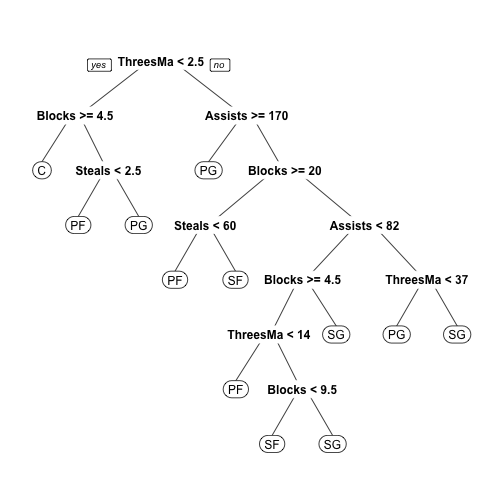
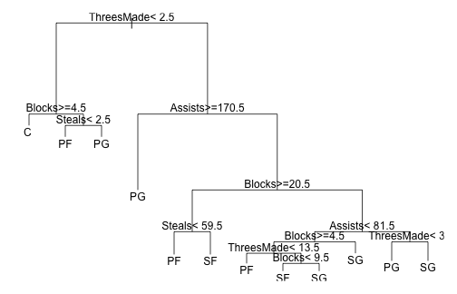
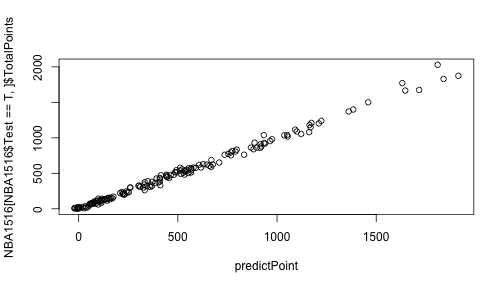

資料探勘
========================================================
author: 曾意儒 Yi-Ju Tseng
autosize: true
font-family: 'Microsoft JhengHei'
navigation: slide


對應書本章節
========================================================
[10 資料探勘](http://yijutseng.github.io/DataScienceRBook/datamining.html)

大綱
====================================
type:sub-section 

- 什麼是資料探勘
- Regression 迴歸
- Decision Trees 決策樹
- 模型驗證
- 效能指標

什麼是資料探勘
====================================

建立從**輸入資料**學習新資訊，變成智慧的**演算法**或**資料模式**，用來**預測事件**或**協助決策**

- 用人工智慧、機器學習、統計學等方法
- 在相對較大型的資料集中發現模式的計算過程
- 當資料太`少`或`太髒`的時候，資料探勘的效力會被影響。

資料探勘條件
====================================
資料探勘要派上用場，必須有以下條件：

- 有一些模式/模型可`學`
- 很難定義這些模式/模型
- 有資料可`學`這些模式/模型

資料探勘可應用在
====================================

- 天氣預測
- 搜尋建議、購物建議
- 股市預測
- 臉部辨識、指紋辨識
- 垃圾郵件標記
- 尿布啤酒

資料探勘的分類
====================================

- **監督式**學習與**非監督式**學習
- 監督式學習的特點是訓練資料中有**正確答案**，由輸入物件和預期輸出所組成，而演算法可以由訓練資料中學到或建立一個模式，並依此模式推測新的實例
- 非監督式學習則不用提供**正確答案**，也就是不需要人力來輸入標籤，單純利用訓練資料的特性，將資料分群分組。

資料探勘的分類
====================================

- Supervised learning 監督式學習
    - Regression 迴歸：真實的'值'（股票、氣溫）
    - Classification 分類：分兩類（P/N, Yes/No, M/F, Sick/Not sick）/分多類 (A/B/C/D)

- Unsupervised learning 非監督式學習
    - Clustering 分群
    - Association Rules 關聯式規則

監督式學習
====================================

在**監督式**學習中常見的資料探勘演算法如下： 
  - Linear Regression 線性迴歸
  - Logistic Regression 羅吉斯迴歸、邏輯迴歸
  - Support Vector Machines 支持向量機
  - Decision Trees 決策樹
  - K-Nearest Neighbor
  - Neural Networks 神經網路
  - Deep Learning 深度學習

非監督式學習
====================================

在**非監督式**學習中常見的資料探勘演算法如下： 
  - Hierarchical clustering 階層式分群
  - K-means clustering
  - Neural Networks 神經網路
  - Deep Learning 深度學習


Regression 迴歸
====================================

- 用在了解兩個或多個變數間`是否相關`、`相關方向與強度`
- 建立`數學模型`以便觀察特定變數來預測研究者感興趣的變數

常見的迴歸分析演算法包括：

- Linear Regression 線性迴歸
- Logistic Regression 羅吉斯迴歸、邏輯迴歸

Linear Regression 線性迴歸
====================================

- 嘗試將Linear Regression 線性迴歸用在NBA的資料
- 做NBA`得分`與`上場分鐘數`的線性迴歸觀察

```r
#讀入SportsAnalytics package
library(SportsAnalytics)
#擷取2015-2016年球季球員資料
NBA1516<-fetch_NBAPlayerStatistics("15-16")
```

迴歸線作圖
====================================

```r
library(ggplot2)
ggplot(NBA1516,
       aes(x=TotalMinutesPlayed,
           y=TotalPoints))+
  geom_point()+
  geom_smooth(method = "glm")
```


lm()
====================================

- 在R中，最基本的簡單線性迴歸分析為`lm()`
- `lm(formula,data=資料名稱)`，搭配formula使用
- formula的撰寫方法為：依變項~自變項1＋自變項2＋....

```r
lm(TotalPoints~TotalMinutesPlayed,
   data =NBA1516)
```

```

Call:
lm(formula = TotalPoints ~ TotalMinutesPlayed, data = NBA1516)

Coefficients:
       (Intercept)  TotalMinutesPlayed  
          -85.9071              0.4931  
```

TotalPoints = `0.4931` * TotalMinutesPlayed `-85.9071`

glm()
====================================
- 更被廣泛使用的是廣義線性迴歸模型generalized linear models (glm)，`glm()`
- 使用方法與`lm()`類似
- 包括線性迴歸模型和邏輯迴歸模型
- 如果需要修改預設模型，可設定family參數：
    - `family="gaussian"` 線性模型模型
    - `family="binomial"` 邏輯迴歸模型
    - `family="poisson"` 卜瓦松迴歸模型
    
Gaussian distribution
====================================
Gaussian distribution高斯函數是`常態分布`的密度函數


Binomial distribution
====================================
Binomial distribution二項分布是`n個獨立的是/非試驗中成功的次數`的離散機率分布


Poisson distribution
====================================
Poisson distribution`次數`分佈：

- 某一服務設施在一定時間內受到的服務請求的次數
- 公車站的候客人數
- 自然災害發生的次數


廣義線性迴歸與NBA
====================================
分析`得分`與`上場分鐘數`和`兩分球出手數`的關係範例

```r
# e+01: 10^1 / e-04: 10^(-4)
glm(TotalPoints ~ 
      TotalMinutesPlayed+FieldGoalsAttempted,
    data =NBA1516)
```

```

Call:  glm(formula = TotalPoints ~ TotalMinutesPlayed + FieldGoalsAttempted, 
    data = NBA1516)

Coefficients:
        (Intercept)   TotalMinutesPlayed  FieldGoalsAttempted  
         -1.799e+01           -2.347e-04            1.256e+00  

Degrees of Freedom: 475 Total (i.e. Null);  473 Residual
Null Deviance:	    99360000 
Residual Deviance: 2160000 	AIC: 5367
```

廣義線性迴歸與NBA
====================================

```

Call:  glm(formula = TotalPoints ~ TotalMinutesPlayed + FieldGoalsAttempted, 
    data = NBA1516)

Coefficients:
        (Intercept)   TotalMinutesPlayed  FieldGoalsAttempted  
         -1.799e+01           -2.347e-04            1.256e+00  

Degrees of Freedom: 475 Total (i.e. Null);  473 Residual
Null Deviance:	    99360000 
Residual Deviance: 2160000 	AIC: 5367
```
TotalPoints = `-0.0002347` * TotalMinutesPlayed + `1.255794` *FieldGoalsAttempted  `-17.99`

廣義線性迴歸與NBA
====================================
如需使用多變量線性迴歸來分析`得分`與`上場分鐘數`和`兩分球出手數`和`守備位置`的關係，可修改formula


```r
glm(TotalPoints~
      TotalMinutesPlayed+FieldGoalsAttempted+Position,
    data =NBA1516)
```

```

Call:  glm(formula = TotalPoints ~ TotalMinutesPlayed + FieldGoalsAttempted + 
    Position, data = NBA1516)

Coefficients:
        (Intercept)   TotalMinutesPlayed  FieldGoalsAttempted  
          22.852223            -0.006537             1.275721  
         PositionPF           PositionPG           PositionSF  
         -39.416327           -65.034646           -38.522299  
         PositionSG  
         -52.175144  

Degrees of Freedom: 474 Total (i.e. Null);  468 Residual
  (1 observation deleted due to missingness)
Null Deviance:	    99080000 
Residual Deviance: 1975000 	AIC: 5322
```

```r
# e+01: 10^1 / e-04: 10^(-4)
```

廣義線性迴歸與NBA
====================================
TotalPoints = `-0.0065` * TotalMinutesPlayed + `1.28` *FieldGoalsAttempted  `+22.85` + `22.85` * PositionPF + `-65.03` * PositionPG + `-38.52` * PositionSF + `-52.18` * PositionSG

```

Call:  glm(formula = TotalPoints ~ TotalMinutesPlayed + FieldGoalsAttempted + 
    Position, data = NBA1516)

Coefficients:
        (Intercept)   TotalMinutesPlayed  FieldGoalsAttempted  
          22.852223            -0.006537             1.275721  
         PositionPF           PositionPG           PositionSF  
         -39.416327           -65.034646           -38.522299  
         PositionSG  
         -52.175144  

Degrees of Freedom: 474 Total (i.e. Null);  468 Residual
  (1 observation deleted due to missingness)
Null Deviance:	    99080000 
Residual Deviance: 1975000 	AIC: 5322
```


虛擬變項 Dummy Variable
====================================
- `守備位置`的變項被轉為**虛擬變項 Dummy Variable**
- PositionPF、PositionPG、PositionSF、PositionSG
- 如果是控球後衛（PG），會得到：

  - PositionPF=0
  - PositionPG=1
  - PositionSF=0
  - PositionSG=0
  
中鋒去哪了？
====================================
- 中鋒被當作基準項
- 當守備位置是中鋒( C )時，會得到：

  - PositionPF=0
  - PositionPG=0
  - PositionSF=0
  - PositionSG=0
  
線性迴歸練習
====================================
type:alert
- 用[BostonHousing](https://archive.ics.uci.edu/ml/datasets/Housing)資料
  - install.packages("mlbench")
  - library(mlbench)
  - data(BostonHousing)
- 使用crim、tax、dis欄位預測medv(Median value of owner-occupied homes in $1000's)
  - glm()廣義線性迴歸

線性迴歸總結
====================================
總結以上，多變量線性迴歸分析有下列特色：

- 假設：各變數相互獨立！
- 若自變項X是類別變項，需要建立`虛擬變項`
- 在R裡，`類別變項`請記得轉成factor，R會自動建立`虛擬變項`
- 用在`依變數為連續變數`，`自變數為連續變數或虛擬變數`的場合


Logistic Regression 羅吉斯迴歸
====================================

常用在`依變數為二元變數（非0即1）`的場合，如：
  - 生病/沒生病
  - 錄取/不錄取
  - `family="binomial"` 邏輯迴歸模型

分析為什麼錄取/不錄取？
====================================

```r
mydata <- read.csv("https://raw.githubusercontent.com/CGUIM-BigDataAnalysis/BigDataCGUIM/master/binary.csv")
```

```r
# GRE:某考試成績, GPA:在校平均成績, rank:學校聲望
head(mydata)
```

| admit| gre|  gpa| rank|
|-----:|---:|----:|----:|
|     0| 380| 3.61|    3|
|     1| 660| 3.67|    3|
|     1| 800| 4.00|    1|
|     1| 640| 3.19|    4|
|     0| 520| 2.93|    4|
|     1| 760| 3.00|    2|

分析為什麼錄取/不錄取？
====================================

```r
mydata$rank <- factor(mydata$rank)
mylogit <- glm(admit ~ gre + gpa + rank,
               data = mydata, 
               family = "binomial")
sum<-summary(mylogit)
```

```r
sum$coefficients
```

|            |   Estimate| Std. Error|   z value| Pr(>&#124;z&#124;)|
|:-----------|----------:|----------:|---------:|------------------:|
|(Intercept) | -3.9899791|  1.1399509| -3.500132|          0.0004650|
|gre         |  0.0022644|  0.0010940|  2.069863|          0.0384651|
|gpa         |  0.8040375|  0.3318193|  2.423119|          0.0153879|
|rank2       | -0.6754429|  0.3164897| -2.134171|          0.0328288|
|rank3       | -1.3402039|  0.3453064| -3.881202|          0.0001039|
|rank4       | -1.5514637|  0.4178316| -3.713131|          0.0002047|

羅吉斯迴歸練習
====================================
type:alert
- 用[PimaIndiansDiabetes](https://archive.ics.uci.edu/ml/datasets/Pima+Indians+Diabetes)資料
  - install.packages("mlbench")
  - library(mlbench)
  - data(PimaIndiansDiabetes)
- 使用pregnant、glucose、triceps、mass欄位預測diabetes
  - glm()廣義線性迴歸
  - family = "binomial"

最佳模型篩選
====================================

到底該用哪個模型來預測，會得到最準確的結果？在迴歸模型中，常用的判斷準則包括：

  - Akaike’s Information Criterion (AIC)
  - Bayesian Information Criterion (BIC)

AIC
====================================
AIC和BIC都是數值越小越好，以下建立三個模型，並比較其AIC

```r
OneVar<-glm(TotalPoints~
              TotalMinutesPlayed,
            data =NBA1516)
TwoVar<-glm(TotalPoints~
              TotalMinutesPlayed+
              FieldGoalsAttempted,
            data =NBA1516)
ThreeVar<-glm(TotalPoints~
                TotalMinutesPlayed+
                FieldGoalsAttempted+Position,
              data =NBA1516)
```
AIC
====================================

```r
c(OneVar$aic,TwoVar$aic,ThreeVar$aic)
```

```
[1] 6338.913 5366.763 5321.972
```
所有參數都有用嗎？
====================================
- 在建立迴歸模型時，常會遇到的問題：到底該放多少參數？
- 所有參數都有用嗎？
- 藉由觀察coefficients來判斷參數在模型中的"實用程度"

```r
sum2<-summary(TwoVar)
sum2$coefficients
```

|                    |    Estimate| Std. Error|    t value| Pr(>&#124;t&#124;)|
|:-------------------|-----------:|----------:|----------:|------------------:|
|(Intercept)         | -17.9885533|  5.6597583| -3.1783254|          0.0015783|
|TotalMinutesPlayed  |  -0.0002347|  0.0094746| -0.0247733|          0.9802462|
|FieldGoalsAttempted |   1.2557937|  0.0222395| 56.4668275|          0.0000000|

所有參數都有用嗎？
====================================

```r
sum3<-summary(ThreeVar)
sum3$coefficients
```

|                    |    Estimate| Std. Error|    t value| Pr(>&#124;t&#124;)|
|:-------------------|-----------:|----------:|----------:|------------------:|
|(Intercept)         |  22.8522227|  9.0147144|  2.5349913|          0.0115696|
|TotalMinutesPlayed  |  -0.0065369|  0.0092000| -0.7105322|          0.4777281|
|FieldGoalsAttempted |   1.2757212|  0.0216472| 58.9324535|          0.0000000|
|PositionPF          | -39.4163267|  9.9365417| -3.9668053|          0.0000843|
|PositionPG          | -65.0346462| 10.2692504| -6.3329497|          0.0000000|
|PositionSF          | -38.5222989| 10.4881704| -3.6729284|          0.0002675|
|PositionSG          | -52.1751437|  9.9853312| -5.2251791|          0.0000003|

Decision Trees 決策樹
====================================
- 在`樹狀目錄`中建立一系列分割，以建立模型
- 這些分割會表示成`「節點」(Node)`
- 每次發現輸入資料行與可預測資料行有明顯地相互關聯時，此演算法就會在模型中加入一個`節點`
- 演算法決定分岔的方式不同



Classification And Regression Tree (CART)
====================================
- 常見的Classification And Regression Tree (CART)
- 使用前須先安裝`rpart` packages


```r
install.packages("rpart")
```

CART
====================================
- 嘗試用用籃板/三分/助攻/抄截數據來判斷守備位置
- 建立決策樹的函數為`rpart()`
- 使用方式為`rpart(formula, data)`

```r
library(rpart)
DT<-rpart(Position~
            Blocks+ThreesMade+Assists+Steals,
          data=NBA1516)
DT
```

```
n=475 (1 observation deleted due to missingness)

node), split, n, loss, yval, (yprob)
      * denotes terminal node

  1) root 475 364 PF (0.15 0.23 0.21 0.18 0.23)  
    2) ThreesMade< 2.5 132  74 C (0.44 0.35 0.098 0.053 0.061)  
      4) Blocks>=4.5 89  37 C (0.58 0.38 0.011 0.011 0.011) *
      5) Blocks< 4.5 43  31 PF (0.14 0.28 0.28 0.14 0.16)  
       10) Steals< 2.5 29  19 PF (0.17 0.34 0.14 0.21 0.14) *
       11) Steals>=2.5 14   6 PG (0.071 0.14 0.57 0 0.21) *
    3) ThreesMade>=2.5 343 242 SG (0.035 0.19 0.25 0.23 0.29)  
      6) Assists>=170.5 96  39 PG (0.031 0.052 0.59 0.15 0.18) *
      7) Assists< 170.5 247 163 SG (0.036 0.24 0.12 0.26 0.34)  
       14) Blocks>=20.5 80  42 PF (0.062 0.48 0 0.26 0.2)  
         28) Steals< 59.5 58  21 PF (0.069 0.64 0 0.14 0.16) *
         29) Steals>=59.5 22   9 SF (0.045 0.045 0 0.59 0.32) *
       15) Blocks< 20.5 167  99 SG (0.024 0.13 0.17 0.26 0.41)  
         30) Assists< 81.5 110  68 SG (0.027 0.18 0.091 0.32 0.38)  
           60) Blocks>=4.5 63  39 SF (0.032 0.29 0.016 0.38 0.29)  
            120) ThreesMade< 13.5 19   9 PF (0.11 0.53 0 0.26 0.11) *
            121) ThreesMade>=13.5 44  25 SF (0 0.18 0.023 0.43 0.36)  
              242) Blocks< 9.5 17   7 SF (0 0.18 0.059 0.59 0.18) *
              243) Blocks>=9.5 27  14 SG (0 0.19 0 0.33 0.48) *
           61) Blocks< 4.5 47  23 SG (0.021 0.043 0.19 0.23 0.51) *
         31) Assists>=81.5 57  31 SG (0.018 0.035 0.33 0.16 0.46)  
           62) ThreesMade< 37 17   5 PG (0 0.12 0.71 0.059 0.12) *
           63) ThreesMade>=37 40  16 SG (0.025 0 0.17 0.2 0.6) *
```

CART
====================================

```r
par(mfrow=c(1,1), mar = rep(1,4)) #下,左,上,右
plot(DT)
text(DT, use.n=F, all=F, cex=1)
```



決策樹圖
====================================
改用`rpart.plot` package 裡面的`prp()`

```r
#第一次使用前須先安裝
install.packages("rpart.plot") 
```

```r
library(rpart.plot)
prp(DT)	
```


決策樹 節點
====================================
決策樹演算法決定`節點`的方式如下：

- Gini impurity
- Information gain
- Variance reduction

細節可參考[維基百科](https://en.wikipedia.org/wiki/Decision_tree_learning)


決策樹 練習
====================================
type:alert
- 用[PimaIndiansDiabetes](https://archive.ics.uci.edu/ml/datasets/Pima+Indians+Diabetes)資料
  - install.packages("mlbench")
  - library(mlbench)
  - data(PimaIndiansDiabetes)
- 使用所有欄位預測diabetes
  - diabetes~.
- 使用rpart.plot套件畫出決策樹
  - prp()


模型驗證
====================================
- 在完成模型訓練後，為了驗證模型訓練的好不好，需要用一組**獨立**的測試資料，來做模型的驗證
- 在訓練模型前，必須特別留意是否有保留一份**獨立的資料**，並確保在訓練模型時都不用到此獨立資料集。

因此，資料集可分為以下兩種：

- **訓練組** Training set, Development set: 讓演算法`學`到`知識`
- **測試組** Test set, Validation set: 驗證`學`的怎麼樣

模型驗證
====================================
- Training set和Test set通常會比例分配
  - 如2/3的資料設為`Training set`
  - 剩下的1/3做驗證`Test set`
- 以下圖的監督式學習流程圖為例，可以注意到綠色箭頭的資料集在訓練過程中從未被使用。

模型驗證
====================================


模型驗證
====================================
- 以Training set來`選看起來最好的模型`
- 用Test set來`驗證模型是不是真的很好`
- 想像.....訓練出來題庫答得好的學生，寫到新題目不一定會寫！？
- 訓練模型時，只能看Training set，用Training set來選一個最好的模型
- 訓練模型時，不能偷看Test set，才是真正的驗證


Regression 迴歸驗證
====================================

以NBA資料為例，首先先將資料讀入

```r
#讀入SportsAnalytics package
if (!require('SportsAnalytics')){
    install.packages("SportsAnalytics")
    library(SportsAnalytics)
}
#擷取2015-2016年球季球員資料
NBA1516<-fetch_NBAPlayerStatistics("15-16")
#只保留完整的資料
NBA1516<-NBA1516[complete.cases(NBA1516),]
```

Regression 迴歸驗證：資料分組
====================================
為分出訓練組與測試組，需使用隨機抽樣的方式

```r
sample(1:10,3) # 從1到10，隨機取三個數字
```

```
[1] 6 7 8
```

```r
sample(1:nrow(NBA1516),nrow(NBA1516)/3) #從第一列到最後一列，隨機取1/3列數
```

```
  [1] 217 363 153 429 313  85  83 241  43 178 347 137  95 372 260 455  29
 [18] 119 358 282  94 169 191 397  93 138 248 367 368 319 471  30  66 277
 [35] 177  53 369  35 182   7 414 192 450 187 255 381 406 132 216 125 220
 [52] 448  14 472 346 254  87 215  25 312 194 437 280 339 354 264 207 112
 [69] 444 171 155 185  67 190 274 292 370   3 253  19  92 445 209 361 229
 [86] 362 338 311 378 305 452 423 156 285 382 238  97  22  73 435 322 453
[103] 293 388 233 210 157 371 100 464 239 466 431 237 392 103  18 184 252
[120]  34 415 446  11 118  46 411 424 174  69  84 386 299 257 250 342 106
[137] 440 222  33 408 439 321 172 390 304 335 433 243  82 176 376 235  24
[154] 212 150 398 302 434
```

Regression 迴歸驗證：資料分組
====================================
使用隨機抽樣法，選出1/3的元素位置，把NBA的資料分成Training 和 Test set

```r
NBA1516$Test<-F #新增一個參數紀錄分組
#隨機取1/3當Test set
NBA1516[sample(1:nrow(NBA1516),
               nrow(NBA1516)/3),]$Test<-T
# Training set : Test set球員數
c(sum(NBA1516$Test==F),sum(NBA1516$Test==T))
```

```
[1] 317 158
```

Regression 迴歸驗證：模型訓練
====================================
並用訓練組的資料（NBA1516$Test==F），訓練一個多變數線性迴歸模型

```r
fit<-glm(TotalPoints~TotalMinutesPlayed+
             FieldGoalsAttempted+Position+
             ThreesAttempted+
             FreeThrowsAttempted,
         data =NBA1516[NBA1516$Test==F,])
summary(fit)$coefficients
```

```
                        Estimate  Std. Error    t value      Pr(>|t|)
(Intercept)          23.88307019 8.083742451  2.9544571  3.373674e-03
TotalMinutesPlayed   -0.00606794 0.007501636 -0.8088823  4.192072e-01
FieldGoalsAttempted   0.99867492 0.023086786 43.2574250 6.746537e-133
PositionPF          -28.15503610 8.607657450 -3.2709290  1.193529e-03
PositionPG          -53.03896499 9.067613610 -5.8492749  1.260371e-08
PositionSF          -31.27245026 9.263192988 -3.3759904  8.297842e-04
PositionSG          -44.91117337 9.342047686 -4.8074228  2.394387e-06
ThreesAttempted       0.19544407 0.029477317  6.6303209  1.500820e-10
FreeThrowsAttempted   0.73189944 0.037561383 19.4854230  1.159595e-55
```

Regression 迴歸驗證：逐步選擇模型
====================================
逐步選擇模型 stepwise 後退學習：一開始先將所有參數加到模型裡，再一個一個拿掉

```r
library(MASS)
##根據AIC，做逐步選擇, 預設倒退學習 direction = "backward"
##trace=FALSE: 不要顯示步驟
finalModel_B<-
    stepAIC(fit,
            direction = "backward",
            trace=FALSE)
summary(finalModel_B)$coefficients
```

```
                       Estimate Std. Error   t value      Pr(>|t|)
(Intercept)          21.3377362 7.44197238  2.867215  4.425605e-03
FieldGoalsAttempted   0.9856299 0.01651085 59.695908 1.063403e-171
PositionPF          -27.4935700 8.56393022 -3.210392  1.465013e-03
PositionPG          -51.8691546 8.94653317 -5.797682  1.660035e-08
PositionSF          -30.9059140 9.24692589 -3.342291  9.329944e-04
PositionSG          -44.1050266 9.28353794 -4.750886  3.106518e-06
ThreesAttempted       0.1950276 0.02945633  6.620905  1.579922e-10
FreeThrowsAttempted   0.7320239 0.03754005 19.499812  9.009966e-56
```

Regression 迴歸驗證：逐步選擇模型
====================================
逐步選擇模型 stepwise 雙向學習：參數加加減減

```r
##根據AIC，做逐步選擇, 雙向學習 direction = "both"
finalModel_Both<-
    stepAIC(fit,
            direction = "both",
            trace=FALSE)
summary(finalModel_Both)$coefficients
```

```
                       Estimate Std. Error   t value      Pr(>|t|)
(Intercept)          21.3377362 7.44197238  2.867215  4.425605e-03
FieldGoalsAttempted   0.9856299 0.01651085 59.695908 1.063403e-171
PositionPF          -27.4935700 8.56393022 -3.210392  1.465013e-03
PositionPG          -51.8691546 8.94653317 -5.797682  1.660035e-08
PositionSF          -30.9059140 9.24692589 -3.342291  9.329944e-04
PositionSG          -44.1050266 9.28353794 -4.750886  3.106518e-06
ThreesAttempted       0.1950276 0.02945633  6.620905  1.579922e-10
FreeThrowsAttempted   0.7320239 0.03754005 19.499812  9.009966e-56
```

Regression 迴歸驗證：模型驗證
====================================
用Test set來評估模型好不好，使用predict函數，將測試組資料（NBA1516$Test==T）放入預測模型中，預測測試組的結果

```r
predictPoint<-
    predict(finalModel_Both, #Test==T, test data
            newdata = NBA1516[NBA1516$Test==T,])
cor(x=predictPoint,
    y=NBA1516[NBA1516$Test==T,]$TotalPoints) #相關係數
```

```
[1] 0.9965234
```

Regression 迴歸驗證：模型驗證
====================================
用Test set來評估模型好不好，使用predict函數，將測試組資料（NBA1516$Test==T）放入預測模型中，預測測試組的結果

```r
plot(x=predictPoint,
     y=NBA1516[NBA1516$Test==T,]$TotalPoints)
```



邏輯迴歸驗證
====================================
- 先把入學資料分成Training 和 Test set

```r
mydata <- read.csv("https://raw.githubusercontent.com/CGUIM-BigDataAnalysis/BigDataCGUIM/master/binary.csv")
# 類別變項要轉為factor
mydata$admit <- factor(mydata$admit) 
mydata$rank <- factor(mydata$rank) 
mydata$Test<-F #新增一個參數紀錄分組
#隨機取1/3當Test set
mydata[sample(1:nrow(mydata),
              nrow(mydata)/3),]$Test<-T 
```

邏輯迴歸驗證
====================================
- 當答案有正反兩面時，建議`Level 2 放正面答案`-->有病/錄取...

```r
# Training set : Test set學生數
c(sum(mydata$Test==F),sum(mydata$Test==T)) 
```

```
[1] 267 133
```

```r
#修改一下factor的level: 改成Level 2為錄取，1為不錄取-->Level 2 放正面答案
mydata$admit<-factor(mydata$admit,levels=c(0,1))
```

邏輯迴歸驗證：訓練
====================================
逐步選擇最好的模型

```r
# GRE:某考試成績, GPA:在校平均成績, rank:學校聲望
mylogit <- 
    glm(admit ~ gre + gpa + rank,
        data = mydata[mydata$Test==F,], 
        family = "binomial")
# 雙向逐步選擇模型
finalFit<-stepAIC(mylogit,
                  direction = "both",
                  trace=FALSE) 
```
邏輯迴歸驗證：訓練
====================================

```r
summary(finalFit)
```

```

Call:
glm(formula = admit ~ gre + gpa + rank, family = "binomial", 
    data = mydata[mydata$Test == F, ])

Deviance Residuals: 
    Min       1Q   Median       3Q      Max  
-1.5172  -0.8561  -0.6686   1.1419   2.0499  

Coefficients:
             Estimate Std. Error z value Pr(>|z|)   
(Intercept) -4.107615   1.430787  -2.871  0.00409 **
gre          0.002459   0.001333   1.844  0.06517 . 
gpa          0.733298   0.406845   1.802  0.07148 . 
rank2       -0.553140   0.380467  -1.454  0.14599   
rank3       -1.106823   0.409576  -2.702  0.00688 **
rank4       -1.141914   0.471160  -2.424  0.01537 * 
---
Signif. codes:  0 '***' 0.001 '**' 0.01 '*' 0.05 '.' 0.1 ' ' 1

(Dispersion parameter for binomial family taken to be 1)

    Null deviance: 326.03  on 266  degrees of freedom
Residual deviance: 304.84  on 261  degrees of freedom
AIC: 316.84

Number of Fisher Scoring iterations: 4
```

邏輯迴歸驗證：驗證
====================================
用預測組預測新學生可不可以錄取，並驗證答案

```r
#finalFit 用Training set做的模型
#newdata Test==T, test data
#type 結果為每個人被錄取的機率
AdmitProb<-
    predict(finalFit, 
            newdata = mydata[mydata$Test==T,], 
            type="response") 
head(AdmitProb)
```

```
        3         4         5         6         7        10 
0.3632196 0.3616153 0.3405919 0.1275502 0.3247918 0.1810674 
```

邏輯迴歸驗證：驗證
====================================
用預測組預測新學生可不可以錄取，並驗證答案

```r
table(AdmitProb>0.5,
      mydata[mydata$Test==T,]$admit) 
```

```
       
         0  1
  FALSE 87 38
  TRUE   2  6
```

效能指標
====================================
當答案是二元時：效能指標

- Sensitivity 敏感性
- Specificity 特異性
- Positive Predictive Value (PPV) 陽性預測值
- Negative Predictive Value (NPV) 陰性預測值

效能指標名詞解釋
====================================


- TP: 有病且預測也有病    FP: 沒病但是預測有病
- TN: 沒病且預測也沒病    FN: 有病但預測沒病

效能指標名詞解釋
====================================


效能指標公式
====================================
當答案是二元時：效能指標公式
 
- Sensitivity 敏感性：所有`真的有病`的人，被`預測有病`的比例
- Specificity 特異性：所有`真的沒病`的人，被`預測沒病`的比例
- Positive Predictive Value (PPV) 陽性預測值：所有被`預測有病`的人，`真的有病`的比例
- Negative Predictive Value (NPV) 陰性預測值：所有被`預測沒病`的人，`真的沒病`的比例

效能指標
====================================
 回想一下剛剛的驗證結果

```r
table(AdmitProb>0.5,
      mydata[mydata$Test==T,]$admit) # row,column
```

```
       
         0  1
  FALSE 87 38
  TRUE   2  6
```


效能指標
====================================
 計算預測效能參數

```r
#Test==T, test data
#結果為每個人被錄取的機率
AdmitProb<-predict(finalFit,
                   newdata = mydata[mydata$Test==T,], 
                   type="response") 
AdmitAns<-factor(ifelse(AdmitProb>0.5,1,0),levels=c(0,1))
str(AdmitAns)
```

```
 Factor w/ 2 levels "0","1": 1 1 1 1 1 1 1 1 1 1 ...
 - attr(*, "names")= chr [1:133] "3" "4" "5" "6" ...
```

效能指標
====================================
 計算預測效能參數

```r
# install.packages("caret") #計算參數的packages
library(caret)
sensitivity(AdmitAns,
            mydata[mydata$Test==T,]$admit,
            positive="1")
```

```
[1] 0.1363636
```

```r
specificity(AdmitAns,
            mydata[mydata$Test==T,]$admit,
            negative="0")
```

```
[1] 0.9775281
```

效能指標
====================================
 計算預測效能參數

```r
posPredValue(AdmitAns,
             mydata[mydata$Test==T,]$admit,
             positive="1")
```

```
[1] 0.75
```

```r
negPredValue(AdmitAns,
             mydata[mydata$Test==T,]$admit,
             negative="0")
```

```
[1] 0.696
```

預測模型建立與驗證綜合練習
====================================
type:alert

- Sonar資料記載礦物與石頭接受各個不同角度的聲波撞擊後，接收到的回聲數值
- 一共有60個參數，代表使用一特別角度的聲波撞擊礦石所得回聲
- 分類結果為二元分類，包括礦物 (M) 與石頭 (R) 
- 將資料隨機分為訓練組(2/3)與測試組(1/3)
- 訓練模型並驗證！

library(mlbench)
data(Sonar) 
