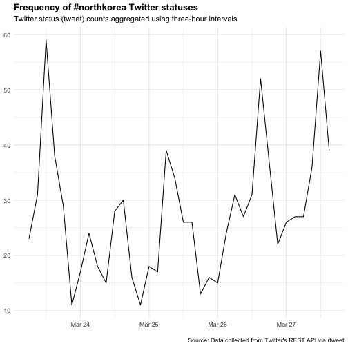

資料讀取與匯出
========================================================
author: 曾意儒 Yi-Ju Tseng
autosize: true
font-family: 'Microsoft JhengHei'
navigation: slide

對應書本章節
========================================================
[5 資料讀取與匯出](http://yijutseng.github.io/DataScienceRBook/io.html)

大綱
====================================
- 從檔案匯入
- 從網路匯入
- 從Facebook匯入
- 從Twitter匯入
- 從YouTube匯入
- 資料匯出

資料分析步驟
====================================
- **資料匯入** <-----本章！
- **資料清洗處理**並轉換為Tidy data
- **資料分析**
- **資料呈現與視覺化**

從檔案匯入
====================================
type:section
- Import Dataset功能 (RStudio)
- 分隔文字檔 .txt
- CSV檔案 .csv
- Excel檔案 .xls
- R物件 .rds
- R程式 .R
- 純文字資料 (無分隔)
- 其他格式

Import Dataset功能 (RStudio)
====================================
選取RStudio四分割視窗右上角的Environment標籤，選擇**Import Dataset**


Import Dataset功能 (RStudio)
====================================
- 選取`From CSV` or `From text (readr)` or `From text (base)`
- 點選`Browse`按鈕開啟檔案選取器


Import Dataset功能 (RStudio)
====================================
- 利用下方`Import Options`的選項微調參數
    - `Delimiter`分隔符號
    - `First Row as Names`首列是否為欄位名稱
    


Import Dataset功能 (RStudio)
====================================
type:alert
incremental:true

- 操作[範例檔案](https://raw.githubusercontent.com/CGUIM-BigDataAnalysis/BigDataCGUIM/master/104/POLIO_Incidence.csv)
- 若匯入的檔案為**tab分隔文字檔**? 該如何調整參數？

分隔文字檔 .txt
====================================
type:sub-section

- `readr` package提供完整的文字檔讀取功能
- 各讀取函數的第一個參數通常為**檔案路徑與名稱**
- `read_delim()`函數：用分隔符號分隔的文字檔案
    - `delim`=`\t`，tab分隔檔案
    - `col_names`：TRUE代表資料內有包含欄位名稱(首列)
        - 如果為FALSE，欄位名稱則會被設定為 X1, X2, X3 ...
    
TAB分隔文字檔 .txt
====================================

```r
library(readr) 
#第一次使用前需要安裝 install.packages("readr")
dataset <- read_delim("檔案路徑與名稱", delim="\t")
```

CSV檔案 .csv
====================================
type:sub-section
- `readr` package
- `read_csv()`

```r
library(readr)
#第一次使用前需要安裝 install.packages("readr")
dataset <- read_csv("檔案路徑與名稱")
```


Excel檔案 .xls
====================================
type:sub-section
- `readxl` package
- `read_excel()`函數
    - `col_names`參數
    - `sheet`參數設定要讀取的工作表(sheet)

```r
library(readxl)
#第一次使用前需要安裝 install.packages("readxl")
dataset <- read_excel("檔案路徑與名稱")
```

檔案匯入練習
====================================
type:alert
incremental:true

- 下載[範例CSV檔案](https://raw.githubusercontent.com/yijutseng/BigDataCGUIM/master/files/opendata10401.csv)，並在RStudio匯入
    - 方法一
    - 方法二
- 匯入後，**檢查**匯入的資料，資料內有幾筆觀察值？每筆觀察值中有幾個欄位？

R物件 .rds
====================================
type:sub-section
如果在R程式內處理完資料後，必須儲存一份資料以供後續分析，使用**R物件**儲存是最佳的方式

- 檔案小
- 讀取快速
- 推薦使用`readRDS()`函數讀取RDS檔案
- [A better way of saving and loading objects in R](http://www.fromthebottomoftheheap.net/2012/04/01/saving-and-loading-r-objects/)

```r
dataset <- readRDS("檔案路徑與名稱")
```

R程式 .R
====================================
type:sub-section
- `source`函數
- 讀R的Obejct or script, 並**執行**
- **實際操作範例**
    - 有一份example.R檔在工作環境中
    - 一次執行檔案內所有R指令

```r
source("example.R") 
```

純文字資料 (無分隔)
====================================
type:sub-section
`readLines`, 逐行讀取文字資料

其他格式 (透過載入套件)
====================================
type:sub-section

- MySQL `RMySQL`
- Weka `foreign`
- Stata `foreign`
- SPSS `Hmisc`
- SAS `Hmisc`
- GIS `rgdal`
- Images `jpeg`
- Music `tuneR`


其他讀檔注意事項
====================================
type:sub-section

讀檔的時候R會自動:

- 判斷要讀幾行
- 判斷每個列（Column）的類別
- 把欄位包起來的符號

如果讀取時已指定**Column類別**以及**把欄位包起來的符號**，讀取速度會快很多。

從網路匯入
====================================
type:section

- Open Data
- XML 可延伸標記式語言
- 網頁爬蟲 Webscraping
- API (Application programming interfaces)
- JSON格式檔案


Open Data 開放資料
====================================
type:sub-section
- 2011年推動開放政府與開放資料 ([維基百科](https://zh.wikipedia.org/wiki/%E9%96%8B%E6%94%BE%E8%B3%87%E6%96%99))
- 不受著作權、專利權，以及其他管理機制所限制，任何人都可以自由出版使用
- 常見的儲存方式為: 
    - `CSV`
    - `JSON`
    - `XML`
    
Open Data 開放資料常見平台
====================================
- [政府資料開放平台](http://data.gov.tw/)
- [Data Taipei](http://data.taipei/)
- [開放資料 x 開放桃園](http://data.tycg.gov.tw/)
- [內政資料開放平台](http://data.moi.gov.tw/)

API
====================================
type:sub-section
- 應用程式介面
- **A**pplication **P**rogramming **I**nterfaces
- 為了讓第三方的開發者可以額外開發應用程式來強化他們的產品，推出可以與系統溝通的介面
- 有API輔助可將資料擷取過程自動化
    -  以下載Open Data為例，若檔案更新頻繁，使用手動下載相當耗時
- [維基百科](https://zh.wikipedia.org/zh-tw/%E5%BA%94%E7%94%A8%E7%A8%8B%E5%BA%8F%E6%8E%A5%E5%8F%A3)

XML 可延伸標記式語言
====================================
type:sub-section

- E**x**tensible **m**arkup **l**anguage
- 描述**結構化**資料的語言
- 處理XML檔案是網頁**Html**爬蟲的基礎
- Components
    - Markup 標記 - labels that give the text structure
    - Content 內文 - the actual text of the document
- [XML Wiki](https://zh.wikipedia.org/wiki/XML)

XML 可延伸標記式語言
====================================
Tags, elements and attributes

- Tags correspond to general labels
    - Start tags `<breakfast_menu>`, `<price>`
    - End tags `</breakfast_menu>`,`</price>`
    - Empty tags `<line-break />`
- Elements are specific examples of tags
    - `<name>Belgian Waffles</name>`
- Attributes are components of the label
    - `<book category="web">`
    
XML 可延伸標記式語言-讀取
====================================
- [臺北市水質監測資訊](http://data.taipei/opendata/datalist/datasetMeta/download?id=961ca397-4a59-45e8-b312-697f26b059dc&rid=190796c8-7c56-42e0-8068-39242b8ec927)
- 安裝`XML` package（只需安裝一次）
- 載入`XML` package
- `xmlParse()`函數將XML檔案匯入


```r
library(XML)
waterURL<-"http://data.taipei/opendata/datalist/datasetMeta/download?id=961ca397-4a59-45e8-b312-697f26b059dc&rid=190796c8-7c56-42e0-8068-39242b8ec927"
waterQ <- xmlParse(waterURL)
```

XML 可延伸標記式語言-讀取
====================================
- 若出現`Error: 1: Unknown IO error2: failed to load external entity`，是因為`XML套件`處理http轉https的功能的不好
- 載入`httr`套件後，先使用`GET()`功能取用網址，再放入`xmlParse()`就不會有問題

```r
library(XML)
library(httr)
waterURL<-"http://data.taipei/opendata/datalist/datasetMeta/download?id=961ca397-4a59-45e8-b312-697f26b059dc&rid=190796c8-7c56-42e0-8068-39242b8ec927"
waterQ <- xmlParse(GET(waterURL))
```

XPath?
====================================
- XML路徑語言（XML Path Language）
- 基於XML的樹狀結構，提供在資料結構樹中找尋節點的能力
- [維基百科](https://zh.wikipedia.org/wiki/XPath)
- [中文教學](http://tech-marsw.logdown.com/blog/2016/01/11/parsing-lxml-xpath-sheet)
- [W3C教學](https://www.w3schools.com/xml/xpath_syntax.asp)


列舉XPath常用的語法
====================================
```
// : 子結點資料
```
如所有連結標籤 //a

```
@ : 屬性資料
```
如所有連結標籤內的連結網址 //a/@href

XML 可延伸標記式語言-解析
====================================
使用`xpathSApply()`函數取得指定標籤內的資料

```r
#取得所有"code_name"標籤內的資料
xpathSApply(waterQ,"//code_name",xmlValue)[1:10]
```

```
 [1] "雙溪淨水場"               "衛理女中"                
 [3] "雙溪國小                " "華興加壓站"              
 [5] "長興淨水場"               "市政大樓"                
 [7] "市議會"                   "捷運忠孝復興站"          
 [9] "南港高工"                 "南港加壓站"              
```

XML 可延伸標記式語言-解析
====================================
使用`xpathSApply()`函數取得指定標籤內的資料

```r
#取得各監測站的經度
xpathSApply(waterQ,"//longitude",xmlValue)[1:10]
```

```
 [1] "121.569433" "121.55231"  "121.563886" "121.544384" "121.547873"
 [6] "121.563997" "121.561975" "121.54342"  "121.607462" "121.616217"
```

xpathSApply vs. xpathApply
====================================
- xpathSApply: 回傳的物件是Vector 向量
- xpathApply: 回傳的物件是List 列表
- 延伸閱讀: [apply家族介紹](http://blog.bryanbigdata.com/2014/06/r-applysapplylapply.html)

XML檔案匯入練習
====================================
type:alert
incremental:true
- 載入[桃園捷運車站出入口基本資料](http://data.tycg.gov.tw/opendata/datalist/datasetMeta/download?id=b2653545-9425-46df-9a50-74ade59ab0cf&rid=f6362ce8-719b-4752-bec6-7fd995b623fd)
- 嘗試取得各站出入口敘述(LocationDescription)與經緯度(PositionLon,PositionLat)
- 參考剛剛的水站範例

```r
library(XML)
waterURL<-"http://data.taipei/opendata/datalist/datasetMeta/download?id=961ca397-4a59-45e8-b312-697f26b059dc&rid=190796c8-7c56-42e0-8068-39242b8ec927"
waterQ <- xmlParse(waterURL)
xpathSApply(waterQ,"//longitude",xmlValue)[1:10]
```

XML 可延伸標記式語言-讀取 xml2套件
====================================
- [臺北市水質監測資訊](http://data.taipei/opendata/datalist/datasetMeta/download?id=961ca397-4a59-45e8-b312-697f26b059dc&rid=190796c8-7c56-42e0-8068-39242b8ec927)
- 安裝`xml2` package
- `read_xml()`函數將XML檔案匯入


```r
library(xml2)
waterURL<-"http://data.taipei/opendata/datalist/datasetMeta/download?id=961ca397-4a59-45e8-b312-697f26b059dc&rid=190796c8-7c56-42e0-8068-39242b8ec927"
waterQ <- read_xml(waterURL)
```

XML 可延伸標記式語言-解析 xml2套件
====================================
使用`xml_find_all()`以及`xml_text()`函數取得指定標籤內的資料

```r
#取得所有"code_name"標籤內的資料
code_name_xml<-xml_find_all(waterQ, ".//code_name")
code_name<-xml_text(code_name_xml)
code_name[1:10]
```

```
 [1] "雙溪淨水場"               "衛理女中"                
 [3] "雙溪國小                " "華興加壓站"              
 [5] "長興淨水場"               "市政大樓"                
 [7] "市議會"                   "捷運忠孝復興站"          
 [9] "南港高工"                 "南港加壓站"              
```

XML 可延伸標記式語言-解析 xml2套件
====================================
使用`xml_find_all()`以及`xml_text()`函數取得指定標籤內的資料

```r
#取得各監測站的經度longitude
longitude_xml<-xml_find_all(waterQ, ".//longitude")
longitude<-xml_text(longitude_xml)
longitude[1:10]
```

```
 [1] "121.569433" "121.55231"  "121.563886" "121.544384" "121.547873"
 [6] "121.563997" "121.561975" "121.54342"  "121.607462" "121.616217"
```

JSON格式檔案
====================================
type:sub-section

- JSON (**J**ava**s**cript **O**bject **N**otation)
- 輕量級的資料交換語言
- From **a**pplication **p**rogramming **i**nterfaces (APIs)
- JavaScript、Java、Node.js應用
- 一些NoSQL資料庫用JSON儲存資料：**MongoDB**
- [Wiki](http://en.wikipedia.org/wiki/JSON)

JSON資料儲存格式
====================================
- Numbers (double)
- Strings (double quoted)
- Boolean (_true_ or _false_)
- Array (ordered, comma separated enclosed in square brackets _[]_)
- Object (unorderd, comma separated collection of **key:value** pairs in curley brackets _{}_)

[JSON檔案範例](https://api.github.com/users/yijutseng/repos)


API
====================================
type:sub-section
- 應用程式介面
- **A**pplication **P**rogramming **I**nterfaces
- 為了讓第三方的開發者可以額外開發應用程式來強化他們的產品，推出可以與系統溝通的介面
- 有API輔助可將資料擷取過程自動化
    -  以下載Open Data為例，若檔案更新頻繁，使用手動下載相當耗時
- [維基百科](https://zh.wikipedia.org/zh-tw/%E5%BA%94%E7%94%A8%E7%A8%8B%E5%BA%8F%E6%8E%A5%E5%8F%A3)

API - Open Data
====================================
- [桃園公共自行車即時服務資料](http://data.tycg.gov.tw/opendata/datalist/datasetMeta?oid=5ca2bfc7-9ace-4719-88ae-4034b9a5a55c)資料
- 即時更新
- 不可能手動下載
- 提供透過**API**下載的服務
- 透過API下載的資料格式: **JSON格式**

***

- [桃園公共自行車即時服務資料API資訊](http://data.tycg.gov.tw/opendata/datalist/datasetMeta/outboundDesc?id=5ca2bfc7-9ace-4719-88ae-4034b9a5a55c&rid=a1b4714b-3b75-4ff8-a8f2-cc377e4eaa0f)
    - **資料集ID**: 紀錄資料的基本參數，如包含欄位、更新頻率等
    - **資料RID**: 資料集


JSON檔案匯入
====================================
- `jsonlite` package (套件使用前必須安裝)
- `fromJSON()`函數載入JSON資料
- 如果API網址為**https**，則需使用 `httr` package
    - 使用`GET()`函數處理資料擷取網址
- API網址參考[桃園公共自行車即時服務資料API資訊](http://data.tycg.gov.tw/opendata/datalist/datasetMeta/outboundDesc?id=5ca2bfc7-9ace-4719-88ae-4034b9a5a55c&rid=a1b4714b-3b75-4ff8-a8f2-cc377e4eaa0f)

```r
library(jsonlite)
library(RCurl)
APIData<-fromJSON("http://data.tycg.gov.tw/api/v1/rest/datastore/a1b4714b-3b75-4ff8-a8f2-cc377e4eaa0f?format=json")
```

JSON檔案匯入
====================================
- 轉存為`列表list`的型態
- 兩個子元素(success, result)
- result中records子元素的類別為資料框data.frame

```r
str(APIData)
```

```
List of 2
 $ success: logi TRUE
 $ result :List of 6
  ..$ resource_id: chr "a1b4714b-3b75-4ff8-a8f2-cc377e4eaa0f"
  ..$ fields     :'data.frame':	15 obs. of  2 variables:
  .. ..$ type: chr [1:15] "int4" "text" "text" "text" ...
  .. ..$ id  : chr [1:15] "_id" "sno" "sna" "tot" ...
  ..$ records    :'data.frame':	100 obs. of  15 variables:
  .. ..$ _id    : int [1:100] 1 2 3 4 5 6 7 8 9 10 ...
  .. ..$ sarea  : chr [1:100] "中壢區" "中壢區" "中壢區" "中壢區" ...
  .. ..$ sareaen: chr [1:100] "Zhongli Dist." "Zhongli Dist." "Zhongli Dist." "Zhongli Dist." ...
  .. ..$ sna    : chr [1:100] "中央大學圖書館" "中壢高中" "中正公園(中美路)" "中壢火車站(前站)" ...
  .. ..$ aren   : chr [1:100] "No.300, Zhongda Rd." "No.215, Sec. 2, Zhongyang W. Rd. (opposite)" "No.101 to No.113, Zhongmei Rd. (opposite)" "No.139, Zhonghe Rd. (opposite)" ...
  .. ..$ sno    : chr [1:100] "2001" "2002" "2003" "2004" ...
  .. ..$ tot    : chr [1:100] "60" "52" "54" "114" ...
  .. ..$ snaen  : chr [1:100] "National Central University Library" "Jhungli Senior High School" "Zhongzheng Park" "TRA Zhongli Station (Front)" ...
  .. ..$ bemp   : chr [1:100] "41" "28" "10" "96" ...
  .. ..$ ar     : chr [1:100] "中大路300號(中央大學校內圖書館前)" "中央西路二段215號對面人行道" "中美路101號-113號對面人行道" "中和路139號對面圓環" ...
  .. ..$ act    : chr [1:100] "1" "1" "1" "1" ...
  .. ..$ lat    : chr [1:100] "24.968128" "24.960815" "24.959113" "24.953874" ...
  .. ..$ lng    : chr [1:100] "121.194666" "121.212038" "121.224805" "121.2256" ...
  .. ..$ sbi    : chr [1:100] "19" "23" "43" "17" ...
  .. ..$ mday   : chr [1:100] "20190328005336" "20190328005344" "20190328005334" "20190328005317" ...
  ..$ offset     : int 0
  ..$ total      : int 285
  ..$ limit      : int 100
```

JSON檔案解析
====================================
- 使用`$`符號截取元素與子元素

```r
head(APIData$result$records)
```

| _id|sarea  |sareaen       |sna              |aren                                             |sno  |tot |snaen                                    |bemp |
|---:|:------|:-------------|:----------------|:------------------------------------------------|:----|:---|:----------------------------------------|:----|
|   1|中壢區 |Zhongli Dist. |中央大學圖書館   |No.300, Zhongda Rd.                              |2001 |60  |National Central University Library      |41   |
|   2|中壢區 |Zhongli Dist. |中壢高中         |No.215, Sec. 2, Zhongyang W. Rd. (opposite)      |2002 |52  |Jhungli Senior High School               |28   |
|   3|中壢區 |Zhongli Dist. |中正公園(中美路) |No.101 to No.113, Zhongmei Rd. (opposite)        |2003 |54  |Zhongzheng Park                          |10   |
|   4|中壢區 |Zhongli Dist. |中壢火車站(前站) |No.139, Zhonghe Rd. (opposite)                   |2004 |114 |TRA Zhongli Station (Front)              |96   |
|   5|中壢區 |Zhongli Dist. |中原大學         |No.200, Zhongbei Rd.                             |2005 |82  |Chung Yuan Christian University          |25   |
|   6|中壢區 |Zhongli Dist. |銀河廣場         |No.48, Jiuhe 1st St. (opposite)                  |2006 |58  |Galaxy Square                            |6    |
|   7|中壢區 |Zhongli Dist. |中壢區公所       |No.380, Huanbei Rd.                              |2007 |40  |Civil Affairs Office of Zhongli District |9    |
|   8|中壢區 |Zhongli Dist. |新明橋           |No.269 to No.373, Sec. 2, Yuanhua Rd. (opposite) |2008 |58  |Xinming Bridge                           |45   |

JSON檔案解析
====================================
分析各項**地區**車站數

```r
table(APIData$result$records$sarea)
```

|Var1   | Freq|
|:------|----:|
|中壢區 |   35|
|八德區 |    5|
|大園區 |    2|
|大溪區 |    2|
|平鎮區 |    7|
|桃園區 |   32|
|蘆竹區 |    7|
|龜山區 |   10|
分析可知中壢區車站較多

JSON檔案匯入練習
====================================
type:alert
incremental:true

- 練習用資料：[「臺北市今日施工資訊」API存取](http://data.taipei/opendata/datalist/datasetMeta/outboundDesc?id=4d29818c-a3ee-425d-b88a-22ac0c24c712&rid=201d8ae8-dffc-4d17-ae1f-e58d8a95b162)
- 使用檔案匯入**範例**，將資料匯入R中
    - 提示：**fromJSON**
- 使用str()函數觀察匯入的資料
- 請問今日施工資料有幾筆觀察值？幾個欄位？

將資料框轉為JSON格式
====================================
- `jsonlite` package
- `toJSON()` 函數

```r
myjson <- toJSON(iris, pretty=TRUE)
str(myjson)
```

```
Class 'json'  chr "[\n  {\n    \"Sepal.Length\": 5.1,\n    \"Sepal.Width\": 3.5,\n    \"Petal.Length\": 1.4,\n    \"Petal.Width\":"| __truncated__
```

網頁爬蟲 Webscraping
====================================
type:sub-section

- 不是每個網站都提供API
- 人工複製貼上?!
- 程式化的方式擷取網頁資料: **網頁爬蟲（Webscraping）**（[Webscraping Wiki](http://en.wikipedia.org/wiki/Web_scraping)）
- 可能耗費很多網頁流量和資源 －很可能被鎖IP
- 在R的處理辦法
    - 當作XML檔案處理分析
    - 使用`rvest` package輔助


網頁爬蟲 Webscraping-逐行讀取
====================================

- 直接逐行讀取 `readLines()`


```r
con <- url("http://im.cgu.edu.tw/bin/home.php")
htmlCode <-readLines(con)
close(con)
htmlCode[3:5]
```

```
[1] "<head>"                                                                                                                                       
[2] "<meta http-equiv=\"Content-Type\" content=\"text/html; charset=utf-8\" />"                                                                    
[3] "<meta http-equiv=\"X-UA-Compatible\" content=\"IE=EmulateIE7\" /><meta name=\"keywords\" content=\"請填寫網站關鍵記事，用半角逗號(,)隔開\" />"
```

網頁爬蟲 Webscraping-XML工具
====================================
或是使用XML工具分析擷取網頁 (`XML` package)


```r
html <- htmlParse("http://im.cgu.edu.tw/bin/home.php")
xpathSApply(html, "//title", xmlValue)
```

```
[1] "長庚大學 資訊管理學系 "
```

網頁爬蟲 Webscraping-逐行讀取
====================================
讀取完網頁後，使用用XML工具與xpath分析擷取網頁 (`XML` package)

```r
xpathSApply(html, "//span[@class='ptname ']", xmlValue)
```

```
 [1] "大數據資料科學與產業應用學程"      
 [2] "資訊與醫療安全學程"                
 [3] "物聯網產業創新應用學程"            
 [4] "機器人智能互動與創新應用(暑期)學程"
 [5] "校務資訊系統"                      
 [6] "人事教育訓練資訊網"                
 [7] "畢業校友登錄系統"                  
 [8] "碩博士論文網"                      
 [9] "資管系導師名單"                    
[10] "國內資管系所"                      
[11] "資管系分機表"                      
[12] "資管系學會"                        
[13] "管理學院"                          
[14] "醫務管理學系"                      
[15] "工商管理學系"                      
[16] "工業設計學系"                      
[17] "企業管理研究所博士班"              
[18] "商管專業學院"                      
[19] "長庚大學行事曆"                    
```

網頁爬蟲 Webscraping-rvest
====================================

載入[rvest](https://github.com/hadley/rvest)套件後，經由以下步驟進行網站解析：

- 使用`read_html(“欲擷取的網站網址”)`函數讀取網頁
- 使用`html_nodes()`函數擷取所需內容 (條件為CSS或xpath標籤)
- 使用`html_text()`函數處理/清洗擷取內容，留下需要的資料
- 使用`html_attr()`函數擷取資料參數（如連結url）

CSS Selector 語法介紹
====================================
- [參考資料](https://www.w3schools.com/cssref/css_selectors.asp)
    - **.**xxx：select elements with class="xxx"
    - **#**xxx：select elements with id="xxx"
    - **[**yyy**]**：select elements with attribute yyy
    - **[**yyy=zzz**]**：select elements with attribute yyy="zzz"
    
網頁爬蟲 Webscraping-rvest
====================================
CSS標籤會因網站更新變化，若下列程式碼執行有問題，可自行使用SelectorGadget找尋適當的CSS標籤

```r
library(rvest) ##載入
Repoterurl<-"https://www.twreporter.org/"
Repoterhtml<-read_html(Repoterurl)
news_title <- Repoterhtml %>% 
    html_nodes(".kOkdzB") %>% html_text()
news_url <- Repoterhtml %>% 
    html_nodes(".WwRvZ a") %>% html_attr("href")
news <- data.frame(title = news_title, url=news_url)
head(news,2)
```

```
                                         title
1           何榮幸／用一千天看見台灣的石化傷痕
2 修法髮夾彎：違章農地工廠無限續命的關鍵與荒誕
                                                    url
1                        /a/bookreview-a-smoking-island
2 /a/illegal-factory-on-agricultural-land-sunset-clause
```


網頁爬蟲 Webscraping-rvest
====================================
- 擷取條件的撰寫會因網頁語法不同或更新而有差異
- 使用**Google Chrome開發工具**輔助觀察擷取資料的條件
    - 或使用**SelectorGadget**輔助
    - 或使用**xpath-helper**輔助xpath標籤的擷取
- 觀察需要擷取的資料所在HTML片段
    - css class為`latest-section__ItemFrame-keac6x-1 hsSyKH`

```
<div class="latest-section__ItemFrame-keac6x-1 hsSyKH"><a href="/a/opinion-new-southbound-talent-development-program-intern-problem"><div class="hover-effect__HoverEffect-sc-10n0hry-0 iRkkRY"><div class="latest-section__ImageFrame-keac6x-2 dyFjYc"><div class="img-wrapper__ImgObjectFit-clvi31-0 cprQrJ"></div></div><div class="latest-section__ContentFrame-keac6x-3 nhxeb">
....
```

網頁爬蟲 DCard實作 -1
====================================

```r
library(rvest) ##(爬蟲結果不代表本人意見)
DCardCGU<-"https://www.dcard.tw/f/cgu"
DCardContent<-read_html(DCardCGU)
post_title <- DCardContent %>% 
    html_nodes(".PostEntry_title_H5o4dj") %>% 
    html_text()
post_contentShort<- DCardContent %>% 
    html_nodes(".PostEntry_excerpt_2eHlNn") %>% 
    html_text()
post_author<- DCardContent %>% 
    html_nodes(".PostAuthor_root_3vAJfe") %>% 
    html_text()
```

網頁爬蟲 DCard實作 -2
====================================

```r
##(爬蟲結果不代表本人意見)
post_like<- DCardContent %>% 
    html_nodes(".hlvyVg") %>% html_text()
post_url <- DCardContent %>% 
    html_nodes(".PostEntry_root_V6g0rd") %>% html_attr("href")
DCardCGU_posts <- 
    data.frame(title = post_title,
               author=post_author, 
               likeN=post_like,
               url=paste0("https://www.dcard.tw",post_url))
```

網頁爬蟲 DCard實作 -3
====================================

```r
DCardCGU_posts
```

|title                                |author                            |likeN |url                                                                           |
|:------------------------------------|:---------------------------------|:-----|:-----------------------------------------------------------------------------|
|請別把滾燙熱油直接倒馬桶             |長庚大學                          |54    |https://www.dcard.tw/f/cgu/p/230961859-請別把滾燙熱油直接倒馬桶               |
|長庚水準？？？                       |長庚大學                          |19    |https://www.dcard.tw/f/cgu/p/230963074-長庚水準？？？                         |
|讓大家驚呆的新番上線啦！！           |長庚大學                          |9     |https://www.dcard.tw/f/cgu/p/230972374-讓大家驚呆的新番上線啦！！             |
|藴德5樓洗衣機越洗越髒 超噁心         |長庚大學 護理學系                 |7     |https://www.dcard.tw/f/cgu/p/230971087-藴德5樓洗衣機越洗越髒-超噁心           |
|uber進學校                           |長庚大學                          |7     |https://www.dcard.tw/f/cgu/p/230968920-uber進學校                             |
|「甲級動員」看電影兼抽獎             |學生會廢文機器                    |7     |https://www.dcard.tw/f/cgu/p/230962861-「甲級動員」看電影兼抽獎               |
|卡住沒發的權益問題反應表單           |學生會廢文機器                    |6     |https://www.dcard.tw/f/cgu/p/230963472-卡住沒發的權益問題反應表單             |
|教室冷氣也太強                       |長庚大學                          |4     |https://www.dcard.tw/f/cgu/p/230968119-教室冷氣也太強                         |
|選擇題答案唸25分鐘?                  |長庚大學 電子工程學系             |21    |https://www.dcard.tw/f/cgu/p/230960543-選擇題答案唸25分鐘？                   |
|校務系統不能請假                     |長庚大學                          |7     |https://www.dcard.tw/f/cgu/p/230959324-校務系統不能請假                       |
|機車場未拔鑰匙的你                   |長庚大學 護理學系                 |10    |https://www.dcard.tw/f/cgu/p/230957862-機車場未拔鑰匙的你                     |
|「填問卷，就有機會獲得7-11禮卷喔」   |長庚大學 商管專業學院碩士學位學程 |9     |https://www.dcard.tw/f/cgu/p/230957702-「填問卷，就有機會獲得7-11禮卷喔」     |
|皮夾遺失                             |長庚大學                          |5     |https://www.dcard.tw/f/cgu/p/230956973-皮夾遺失                               |
|電梯黑暗期                           |長庚大學                          |14    |https://www.dcard.tw/f/cgu/p/230956440-電梯黑暗期                             |
|據德6樓正在打麻將的人                |長庚大學 醫學系                   |16    |https://www.dcard.tw/f/cgu/p/230953012-據德6樓正在打麻將的人                  |
|他媽的吸菸仔                         |長庚大學                          |22    |https://www.dcard.tw/f/cgu/p/230952613-他媽的吸菸仔                           |
|到底誰叫我把孩子顧好                 |長庚大學                          |9     |https://www.dcard.tw/f/cgu/p/230952291-到底誰叫我把孩子顧好                   |
|據德萊爾富男店員                     |長庚大學                          |19    |https://www.dcard.tw/f/cgu/p/230951779-據德萊爾富男店員                       |
|crypto tab挖礦                       |長庚大學                          |18    |https://www.dcard.tw/f/cgu/p/230949663-crypto-tab挖礦                         |
|我以為這在長庚很常發生？             |長庚大學                          |69    |https://www.dcard.tw/f/cgu/p/230938792-我以為這在長庚很常發生？               |
|深耕志工招募內容異動                 |長庚大學                          |2     |https://www.dcard.tw/f/cgu/p/230937649-深耕志工招募內容異動                   |
|熱音社484不會關門啊                  |長庚大學                          |21    |https://www.dcard.tw/f/cgu/p/230936784-熱音社484不會關門啊                    |
|耳環掉了                             |長庚大學                          |4     |https://www.dcard.tw/f/cgu/p/230935148-耳環掉了                               |
|請益畢旅金典旅行社                   |長庚大學                          |17    |https://www.dcard.tw/f/cgu/p/230933158-請益畢旅金典旅行社                     |
|拔鬍子拔很爽？（有圖慎入）           |長庚大學 醫學系                   |12    |https://www.dcard.tw/f/cgu/p/230929628-拔鬍子拔很爽？（有圖慎入）             |
|耳機遺失                             |長庚大學 電子工程學系             |5     |https://www.dcard.tw/f/cgu/p/230926754-耳機遺失                               |
|有一個小生命在藴德樓走丟#附圖#已找到 |長庚大學                          |43    |https://www.dcard.tw/f/cgu/p/230925176-有一個小生命在藴德樓走丟＃附圖＃已找到 |
|健身房奇聞                           |長庚大學 職能治療學系             |36    |https://www.dcard.tw/f/cgu/p/230924556-健身房奇聞                             |
|鑰匙協尋                             |長庚大學 生物醫學系               |4     |https://www.dcard.tw/f/cgu/p/230924136-鑰匙協尋                               |
|禪學社他媽坑我錢啊                   |長庚大學 電子工程學系             |27    |https://www.dcard.tw/f/cgu/p/230919046-禪學社他媽坑我錢啊                     |
|幫宣傳不妥刪                         |長庚大學                          |36    |https://www.dcard.tw/f/cgu/p/230917887-幫宣傳不妥刪                           |
|明德樓 晚上吹樂器                    |長庚大學                          |24    |https://www.dcard.tw/f/cgu/p/230917488-明德樓-晚上吹樂器                      |
|深耕志工招募                         |長庚大學                          |3     |https://www.dcard.tw/f/cgu/p/230916483-深耕志工招募                           |
|蘊德14警報                           |長庚大學                          |9     |https://www.dcard.tw/f/cgu/p/230915935-蘊德14警報                             |
|建議珍鮮                             |長庚大學                          |63    |https://www.dcard.tw/f/cgu/p/230911679-建議珍鮮                               |
|資工資演作業問題                     |長庚大學                          |9     |https://www.dcard.tw/f/cgu/p/230911511-資工資演作業問題                       |
|神人 求各位大大幫忙                  |長庚大學                          |38    |https://www.dcard.tw/f/cgu/p/230908623-神人-求各位大大幫忙                    |
|明德電子                             |長庚大學                          |16    |https://www.dcard.tw/f/cgu/p/230907952-明德電子                               |


進階爬蟲
====================================
- 瀑布式網頁爬蟲
    - 觀察Google Chrome 開發者工具，在Network內找到api呼叫方式
    - 搭配使用RSelenium 模擬瀏覽狀態
    - 操作範例 [爬DCard實作R Code](https://github.com/CGUIM-BigDataAnalysis/BigDataCGUIM/blob/master/105/RSelenium_rvest.md)


爬蟲練習
====================================
type:alert

- [Ptt Tech_Job 版](https://www.ptt.cc/bbs/Tech_Job/index.html)
- 試著爬出所有**標題**
- 爬出的第三個標題是？


網頁爬蟲 再想想？
====================================
incremental:true

- 如何爬評論跟內文呢？
- 其實...DCard是有API的
    - https://www.dcard.tw/_api/forums/cgu/posts
    - https://www.dcard.tw/_api/posts/228454694
    - https://www.dcard.tw/_api/posts/228454694/comments
- 隱私問題 （2016年的OkCupid事件）
    - [70,000 OkCupid Users Just Had Their Data Published](https://motherboard.vice.com/en_us/article/70000-okcupid-users-just-had-their-data-published)

其他爬蟲相關參考資源
====================================
- [網路爬蟲實作 - 用 r 語言打造自己的爬蟲程式](https://www.slideshare.net/secret/mdfHLPgvIW1kPR)
- [rvest GitHub](https://github.com/hadley/rvest)
- R Bloggers 有很多[爬蟲範例](http://www.r-bloggers.com/?s=Web+Scraping)（英文）
- [Ptt爬蟲實作](http://bryannotes.blogspot.tw/2014/08/r-ptt-wantedsocial-network-analysis.html)
- [大數學堂 網頁爬蟲課程](http://www.largitdata.com/course_list/1)


從Facebook匯入
====================================
type:section
- Graph API in R
- Rfacebook package

Graph API in R
====================================
type:sub-section

- 在2018年的風波後，Graph API若要用在爬取公開粉專，須經過FB審核
- [Graph API](https://developers.facebook.com/docs/graph-api?locale=zh_TW)
    - 根據篩選條件，回傳JSON格式的資料
- [Graph API Explorer](https://developers.facebook.com/tools/explorer/)
    - 測試資料撈取方法和結果
- 必須要取得自己的**access token** (存取權杖)
    - 可在[Graph API Explorer](https://developers.facebook.com/tools/explorer/)視窗右上角的**Get Token**按鈕取得
    - [官方文件](https://developers.facebook.com/docs/facebook-login/access-tokens/?locale=zh_TW)


Rfacebook package
====================================
type:sub-section
在2018年的風波後，Graph API若要用在爬取公開粉專，須經過FB審核，因此本課程目前無法示範粉絲專頁爬取

使用 Rfacebook 取得 `tsaiingwen` 粉絲頁的資料

```r
library(Rfacebook) #初次使用須先安裝
token<-"your token" #將token複製到此處
getPage("tsaiingwen", token,n = 5)
```
若經過審核，可得下列結果

```
4 posts       from_id           from_name
1 46251501064 蔡英文 Tsai Ing-wen
2 46251501064 蔡英文 Tsai Ing-wen
3 46251501064 蔡英文 Tsai Ing-wen
4 46251501064 蔡英文 Tsai Ing-wen
```

從Twitter匯入
====================================
type:section
- Twitter API
- rtweet package

Twitter API
====================================
- https://developer.twitter.com/en/apps
- 需有Twitter帳號並通過開發者審核

rtweet package
====================================

```r
## install rtweet from CRAN
install.packages("rtweet")
## load rtweet package
library(rtweet)
```

rtweet package - token 設定
====================================

```r
library(rtweet)
create_token(
  app = "teach0309",
  consumer_key = "Wbba6ysyPKGstGAqohmtyWZOE",
  consumer_secret = "GJweDzVvXGrbjz26bHTr3d6dFI7q9gFCH98f3Ct2yk3APPWigc",
  access_token = "216362944-VbXiYOjGtENwSI6eJ9AoDK5OVvoQWlj7yIeXraGt",
  access_secret = "jnfDCvuMdxdmxswUUPPi3gomxIWZq3BTdumykLJb7GW5A")
```

```
<Token>
<oauth_endpoint>
 request:   https://api.twitter.com/oauth/request_token
 authorize: https://api.twitter.com/oauth/authenticate
 access:    https://api.twitter.com/oauth/access_token
<oauth_app> teach0309
  key:    Wbba6ysyPKGstGAqohmtyWZOE
  secret: <hidden>
<credentials> oauth_token, oauth_token_secret
---
```

rtweet package - 搜尋hashtag
====================================

```r
## search for 1000 tweets using the northkorea hashtag
rt <- search_tweets(
  "#northkorea", n = 1000, include_rts = FALSE
)
head(rt)
```

|user_id    |status_id           |created_at          |screen_name |
|:----------|:-------------------|:-------------------|:-----------|
|22151966   |1110954988677795841 |2019-03-27 17:21:24 |leeferran   |
|1932287118 |1110953377070866433 |2019-03-27 17:15:00 |koogle_tv   |
|1932287118 |1110228606511251459 |2019-03-25 17:15:01 |koogle_tv   |
|1932287118 |1110606088708067329 |2019-03-26 18:15:00 |koogle_tv   |
|1932287118 |1110949603606695936 |2019-03-27 17:00:00 |koogle_tv   |
|1932287118 |1110247478501273600 |2019-03-25 18:30:00 |koogle_tv   |

rtweet package - 搜尋hashtag
====================================


rtweet package - 取得趨勢
====================================

```r
sf <- get_trends("Japan")
head(sf)
```

|trend                                 |url                                                                                                                                                                                               |promoted_content |query                                                                                                                                                                 |
|:-------------------------------------|:-------------------------------------------------------------------------------------------------------------------------------------------------------------------------------------------------|:----------------|:---------------------------------------------------------------------------------------------------------------------------------------------------------------------|
|#死ぬからの予測変換で生き返ってみせる |http://twitter.com/search?q=%23%E6%AD%BB%E3%81%AC%E3%81%8B%E3%82%89%E3%81%AE%E4%BA%88%E6%B8%AC%E5%A4%89%E6%8F%9B%E3%81%A7%E7%94%9F%E3%81%8D%E8%BF%94%E3%81%A3%E3%81%A6%E3%81%BF%E3%81%9B%E3%82%8B |NA               |%23%E6%AD%BB%E3%81%AC%E3%81%8B%E3%82%89%E3%81%AE%E4%BA%88%E6%B8%AC%E5%A4%89%E6%8F%9B%E3%81%A7%E7%94%9F%E3%81%8D%E8%BF%94%E3%81%A3%E3%81%A6%E3%81%BF%E3%81%9B%E3%82%8B |
|#ナカイの窓                           |http://twitter.com/search?q=%23%E3%83%8A%E3%82%AB%E3%82%A4%E3%81%AE%E7%AA%93                                                                                                                      |NA               |%23%E3%83%8A%E3%82%AB%E3%82%A4%E3%81%AE%E7%AA%93                                                                                                                      |
|ケムリ                                |http://twitter.com/search?q=%E3%82%B1%E3%83%A0%E3%83%AA                                                                                                                                           |NA               |%E3%82%B1%E3%83%A0%E3%83%AA                                                                                                                                           |
|YOSHIKI                               |http://twitter.com/search?q=YOSHIKI                                                                                                                                                               |NA               |YOSHIKI                                                                                                                                                               |

rtweet package - 取得timeline
====================================

```r
tmls <- get_timelines(c("realDonaldTrump", "BarackObama"), n = 1000)
head(tmls)
```

|user_id  |screen_name     |text                                                                                                                                                                                                                                                                                    |source             |
|:--------|:---------------|:---------------------------------------------------------------------------------------------------------------------------------------------------------------------------------------------------------------------------------------------------------------------------------------|:------------------|
|25073877 |realDonaldTrump |The Fake News Media has lost tremendous credibility with its corrupt coverage of the illegal Democrat Witch Hunt of your all time favorite duly elected President, me! T.V. ratings of CNN &amp; MSNBC tanked last night after seeing the Mueller Report statement. @FoxNews up BIG!    |Twitter for iPhone |
|25073877 |realDonaldTrump |https://t.co/Ing9BhBQGi                                                                                                                                                                                                                                                                 |Twitter for iPhone |
|25073877 |realDonaldTrump |https://t.co/P46CNUBicX                                                                                                                                                                                                                                                                 |Twitter for iPhone |
|25073877 |realDonaldTrump |“I think this is probably the most consequential media screwup of the last 25 to 50 years. It is difficult to comprehend or overstate the damage that the media did to the Country, to their own reputation or to the Constitution. An absolute catastrophe” Sean Davis  @TuckerCarlson |Twitter for iPhone |
|25073877 |realDonaldTrump |“Proclamation on Recognizing the Golan Heights as Part of the State of Israel” https://t.co/yAAyR2Hxe4 https://t.co/VccUpjMJqZ                                                                                                                                                          |Twitter for iPhone |
|25073877 |realDonaldTrump |Thank you to the House Republicans for sticking together and the BIG WIN today on the Border. Today’s vote simply reaffirms Congressional Democrats are the party of Open Borders, Drugs and Crime!                                                                                     |Twitter for iPhone |

rtweet package - 取得timeline
====================================


rtweet package - 取得followers
====================================

```r
## get user IDs of accounts following 蔡英文 Tsai Ing-wen
iingwen_flw <- get_followers("iingwen", n = 1000)
## lookup data on those accounts
iingwen_flw_data <- lookup_users(iingwen_flw$user_id)
head(iingwen_flw_data)
```


rtweet package練習
====================================
type:alert
incremental:true
- 複製老師的Twitter access token
- 使用rtweet package取得**蔡英文 Tsai Ing-wen**(iingwen)的timeline，共50筆tweets
- 第一筆資料的retweet_count是多少?
- 第二筆資料的favorite_count是多少?

參考資料
====================================

[rtweet官網](https://rtweet.info/)


從YouTube匯入
====================================
type:section
- YouTube API
- tuber package


YouTube API 
====================================
- 參考[Google Developer Console](https://developers.google.com/youtube/v3/getting-started) 說明申請使用API的權限
- 開啟**YouTube Data API v3**的功能
- 設定API金鑰
- 設定OAuth 2.0 用戶端 ID

tuber package - 用R爬取YouTube資料
====================================
- 建議從GitHub安裝開發版本
- 在R中，可利用`devtools`套件輕鬆安裝GitHub上的開發版套件
- 安裝後，仍須載入
- 使用中若出現`Error: HTTP failure: 403`，表示今日API使用上限已到，明天請早

```r
#devtools::install_github("soodoku/tuber")
library(tuber)
```

tuber package - 用R爬取YouTube資料
====================================
- 至[Google Developer Console](https://developers.google.com/youtube/v3/getting-started)複製**用戶端ID**以及**用戶端密碼**（此密碼已失效，請自行申請）
- `yt_oauth()`函數會開瀏覽器，透過網頁授權

```r
clientID<-"172472044544-e7t61pjh2s27nelkm9k2hd4ug9848og9.apps.googleusercontent.com"
clientKey<-"ALwGxLRX2592fSrxdviLKPCa"
yt_oauth(clientID, clientKey,token = "")
```

tuber package - 取得單一影片統計數據
====================================
- 需至YouTube頁面複製**影片ID**

```r
stat<-get_stats(video_id = "GZ7EaieAXJ0")
data.frame(stat)
```
|id          |viewCount |likeCount |dislikeCount |favoriteCount |commentCount |
|:-----------|:---------|:---------|:------------|:-------------|:------------|
|GZ7EaieAXJ0 |1899787   |51272     |1163         |0             |2125         |

tuber package - 取得單一影片資訊
====================================
- 需至YouTube頁面複製**影片ID**

```r
detail<-get_video_details(video_id = "GZ7EaieAXJ0")
str(detail$items[[1]]$snippet)
```
```
List of 9
 $ publishedAt         : chr "2019-01-17T04:02:27.000Z"
 $ channelId           : chr "UCHfY_EOzB1i57hYLSw_rYMg"
 $ title               : chr "蔡康永 x 理科太太 - 讀書人與理科人的情商對談"
 $ description         : chr "把情緒完整吐露，就是個性直率？\n把情緒隱藏起來，就是社會化的表現？\n今天很榮幸與 蔡康永 上了一堂情商課\n快看讀"| __truncated__
 $ thumbnails          :List of 5
  ..$ default :List of 3
  .. ..$ url   : chr "https://i.ytimg.com/vi/GZ7EaieAXJ0/default.jpg"
  .. ..$ width : int 120
  .. ..$ height: int 90
  ..$ medium  :List of 3
  .. ..$ url   : chr "https://i.ytimg.com/vi/GZ7EaieAXJ0/mqdefault.jpg"
  .. ..$ width : int 320
  .. ..$ height: int 180
  ..$ high    :List of 3
  .. ..$ url   : chr "https://i.ytimg.com/vi/GZ7EaieAXJ0/hqdefault.jpg"
  .. ..$ width : int 480
  .. ..$ height: int 360
  ..$ standard:List of 3
  .. ..$ url   : chr "https://i.ytimg.com/vi/GZ7EaieAXJ0/sddefault.jpg"
  .. ..$ width : int 640
  .. ..$ height: int 480
  ..$ maxres  :List of 3
  .. ..$ url   : chr "https://i.ytimg.com/vi/GZ7EaieAXJ0/maxresdefault.jpg"
  .. ..$ width : int 1280
  .. ..$ height: int 720
 $ channelTitle        : chr "理科太太 Li Ke Tai Tai"
 $ categoryId          : chr "27"
 $ liveBroadcastContent: chr "none"
 $ localized           :List of 2
  ..$ title      : chr "蔡康永 x 理科太太 - 讀書人與理科人的情商對談"
  ..$ description: chr "把情緒完整吐露，就是個性直率？\n把情緒隱藏起來，就是社會化的表現？\n今天很榮幸與 蔡康永 上了一堂情商課\n快看讀"| __truncated__
```

tuber package - 取得單一影片留言
====================================
- 需至YouTube頁面複製**影片ID**

```r
comm<-get_all_comments(video_id = "GZ7EaieAXJ0")
comm
```

|authorDisplayName |textDisplay                                        |likeCount |
|:-----------------|:--------------------------------------------------|:---------|
|羽晨怡珊          |其實大家所說的情緒化意思是所有事情都是用情緒來解決 |0         |
|Chad X            |看到这集跟蔡康永商业吹捧~~感觉这个频道不用再看了   |1         |
|Jenny Chan        |好好奇怎麼跟小孩解釋什麼是情緒                     |0         |

tuber package - 搜尋相關影片
====================================
- 輸入關鍵字搜尋相關影片

```r
search<-yt_search("理科太太",max_results = 10)
```


tuber package - 取得頻道內的影片清單
====================================
- 需至YouTube頁面複製**頻道ID**

```r
LiKe <- list_channel_resources(
    filter = c(channel_id = 
                   "UCHfY_EOzB1i57hYLSw_rYMg"))
playlist_id<-LiKe$items[[1]]$contentDetails$relatedPlaylists$uploads
vids <- get_playlist_items(filter= c(playlist_id=playlist_id)) 
```
|contentDetails.videoId |contentDetails.videoPublishedAt |
|:----------------------|:-------------------------------|
|_YDD_kHCuCg            |2019-03-26T04:03:59.000Z        |
|n_zK5PPg6bw            |2019-03-20T13:00:15.000Z        |
|O3gpNqYVoj0            |2019-03-21T04:00:00.000Z        |
|cN0ZiHneU4Q            |2019-03-24T13:00:12.000Z        |
|gDuI8N36leQ            |2019-03-15T13:00:07.000Z        |
|lcP9Gbh8hKs            |2019-03-16T13:00:15.000Z        |
|QuoowVlITaw            |2019-03-14T04:00:03.000Z        |
|xHxOqJ5EM3Q            |2019-03-12T04:00:01.000Z        |
|yvsj6C0w0Ec            |2019-03-05T13:09:35.000Z        |
|W75u4Tt8Ra4            |2019-03-25T04:03:14.000Z        |
|YLQcKZd-d5k            |2019-03-02T10:05:41.000Z        |
|vHyV83OZKOE            |2019-02-28T10:00:12.000Z        |
|xQlVjj_20Gg            |2019-02-26T04:00:03.000Z        |
|esrV9pM7YQ8            |2019-02-23T13:00:05.000Z        |
|KaWkYsVZaz8            |2019-02-19T13:00:03.000Z        |
|Ni8fE-HzGi4            |2019-02-16T13:00:03.000Z        |
|mBkq_poiAd0            |2019-02-21T04:00:05.000Z        |
|TtnluzLGxgk            |2019-02-14T04:00:02.000Z        |
|n9Nuy2FWcqI            |2019-02-12T04:00:02.000Z        |
|FTmw_8cAIek            |2019-02-04T04:00:00.000Z        |
|Uur1dnJ9UZY            |2019-02-02T13:00:03.000Z        |
|I3irjNKci7I            |2019-02-05T04:00:00.000Z        |
|rfuN7LUtjRk            |2019-02-01T04:00:03.000Z        |
|3QONDGuO3n0            |2019-02-07T04:00:00.000Z        |
|QxO1GBXv1Rw            |2019-01-28T13:00:04.000Z        |
|rDHuy_CW_fc            |2019-01-29T04:05:32.000Z        |
|NPy-GuVy5J4            |2019-01-31T04:00:00.000Z        |
|qo9gLmpgO4I            |2019-01-26T13:00:14.000Z        |
|AvS5wIovCuQ            |2019-01-22T04:00:02.000Z        |
|GZ7EaieAXJ0            |2019-01-17T04:02:27.000Z        |
|yF2tLzQWyDg            |2019-01-19T04:00:02.000Z        |
|ySRR4UE0bYo            |2019-01-15T04:00:59.000Z        |
|BsDJWlSzH8U            |2019-01-12T13:00:02.000Z        |
|gU3MYK0UtOQ            |2019-01-08T09:32:29.000Z        |
|AXvd8ZteF5A            |2019-01-10T03:45:00.000Z        |
|23KqaSIib9k            |2019-01-08T03:45:00.000Z        |
|iIE43YlU4NE            |2019-01-06T13:00:11.000Z        |
|yN30ndv6_eo            |2019-01-03T03:45:00.000Z        |
|DW26tEKCEJ0            |2019-01-01T03:45:00.000Z        |
|d72TqqXQ4sU            |2018-12-29T03:45:00.000Z        |
|af8Q97JrgJk            |2018-12-27T13:00:02.000Z        |
|QQfiNNwpIwI            |2018-12-25T03:13:10.000Z        |
|0GtFuUrTf50            |2018-12-26T04:00:01.000Z        |
|0z4s-wxGnUA            |2018-12-20T03:45:02.000Z        |
|Q3BECUdgqy4            |2018-12-22T03:45:00.000Z        |
|tTPDv7TGvbA            |2018-12-18T03:45:00.000Z        |
|aRRlxfm2GvU            |2018-12-12T13:00:01.000Z        |
|AE4R4rPBUJQ            |2018-12-11T03:45:01.000Z        |
|Wl8CVBwDlRU            |2018-12-13T03:45:00.000Z        |
|FOAKxPbTNKA            |2018-12-04T03:45:00.000Z        |


tuber package - 取得頻道內的影片清單
====================================
- 需至YouTube頁面複製**頻道ID**

```r
vid_ids <- 
    vids$contentDetails.videoId
vid_ids
```
```
 [1] "_YDD_kHCuCg" "n_zK5PPg6bw" "O3gpNqYVoj0" "cN0ZiHneU4Q" "gDuI8N36leQ"
 [6] "lcP9Gbh8hKs" "QuoowVlITaw" "xHxOqJ5EM3Q" "yvsj6C0w0Ec" "W75u4Tt8Ra4"
[11] "YLQcKZd-d5k" "vHyV83OZKOE" "xQlVjj_20Gg" "esrV9pM7YQ8" "KaWkYsVZaz8"
[16] "Ni8fE-HzGi4" "mBkq_poiAd0" "TtnluzLGxgk" "n9Nuy2FWcqI" "FTmw_8cAIek"
[21] "Uur1dnJ9UZY" "I3irjNKci7I" "rfuN7LUtjRk" "3QONDGuO3n0" "QxO1GBXv1Rw"
[26] "rDHuy_CW_fc" "NPy-GuVy5J4" "qo9gLmpgO4I" "AvS5wIovCuQ" "GZ7EaieAXJ0"
[31] "yF2tLzQWyDg" "ySRR4UE0bYo" "BsDJWlSzH8U" "gU3MYK0UtOQ" "AXvd8ZteF5A"
[36] "23KqaSIib9k" "iIE43YlU4NE" "yN30ndv6_eo" "DW26tEKCEJ0" "d72TqqXQ4sU"
[41] "af8Q97JrgJk" "QQfiNNwpIwI" "0GtFuUrTf50" "0z4s-wxGnUA" "Q3BECUdgqy4"
[46] "tTPDv7TGvbA" "aRRlxfm2GvU" "AE4R4rPBUJQ" "Wl8CVBwDlRU" "FOAKxPbTNKA"
```

tuber package - 使用purrr套件實現for迴圈概念
====================================
- `map_df(影片編號向量,函數名稱)`意指將所有影片的資料內容逐一抓回

```r
library(purrr)
res<-map_df(vid_ids,get_stats)
head(res)
```

|id          |viewCount |likeCount |dislikeCount |favoriteCount |commentCount |
|:-----------|:---------|:---------|:------------|:-------------|:------------|
|_YDD_kHCuCg |57672     |2963      |69           |0             |214          |


tuber package練習
====================================
type:alert
incremental:true
- 取得YouTube API用戶端ID與密碼
- 使用tuber package取得**理科太太**(UCHfY_EOzB1i57hYLSw_rYMg)的影片清單
- 擷取資料中，留言數最多的影片ID是?
- 擷取資料中，觀看數最多的影片ID是?
- 試著擷取留言數最多的影片的所有留言內容

參考資料
====================================

[:sweet_potato: tuber](http://soodoku.github.io/tuber/)

資料匯出
====================================
type:section
- 文字檔 .txt
- CSV檔 .csv
- R物件 .rds


文字檔 .txt write.table()
====================================
type:sub-section


```r
write.table(iris,file="iris.txt",sep=",",
            row.names = F,col.names = T)
```
- 要匯出的資料
- `file` 檔案名稱
- `append` T/F T:在檔案後加字，F:直接覆蓋檔案 (預設F)
- `quote` 是否需要用雙引號將字串包起 (預設T)
- `sep` 分隔符號 (預設空白)
- `row.names` T/F 是否需要輸出row names
- `col.names` T/F 是否需要輸出column names
- `fileEncoding` 編碼設定

write.table() 練習
====================================
type:alert
incremental:true

- 將剛剛擷取的**理科太太影片評論資料**存成tab分隔的.txt檔案

CSV檔 .csv
====================================
type:sub-section

與`write.table()`類似，使用`write.csv()`函數寫入檔案

```r
write.csv(iris,file="iris.csv",row.names = F)
```

R物件 .rds
====================================
type:sub-section

若是要在R的環境繼續使用，建議匯出成R物件檔案(.rds)

```r
saveRDS(iris,"iris.rds")
```

saveRDS() 練習
====================================
type:alert
incremental:true

- 將剛剛擷取的**理科太太影片評論資料**存成R物件檔案(.rds)
- 比較與txt檔案大小的差異

