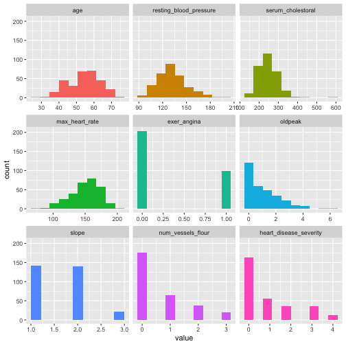

探索式資料分析
========================================================
author: 曾意儒 Yi-Ju Tseng
autosize: true
font-family: 'Microsoft JhengHei'
navigation: slide


對應書本章節
========================================================
[7 探索式資料分析](http://yijutseng.github.io/DataScienceRBook/eda.html)

大綱
====================================
type:sub-section 

- 什麼是探索式資料分析
- 量化的分析方式
- dplyr
- data.table


什麼是探索式資料分析
====================================
type:sub-section 

- 探索式資料分析 (**E**xploratory **D**ata **A**nalysis)
- 在資料量 大/雜/髒 的時候，探索式資料分析非常重要
- 運用**視覺化**、**基本的統計**等工具，反覆的探索**資料特性**，獲取資料所包含的資訊、結構和特點
- 在進行複雜或嚴謹的分析之前，必須要對資料有更多認識，才能訂定**對的資料分析方向**
- 通常**不需要**嚴謹的假設和細節呈現


探索式資料分析
====================================
- 分析各變數間的**關聯性**，看是否有預料之外的有趣發現
- 觀察資料內容是否符合預期，若否，檢查資料**是否有誤**
- 檢查資料是否符合分析前的假設

透過探索性分析來**調整分析的方向**，減少因分析方向錯誤所造成的時間浪費。


探索式資料分析 - 快速查看
====================================
首先安裝`funModeling`套件

```r
install.packages("funModeling")
```
並載入

```r
library(funModeling)
```

探索式資料分析 - 快速查看
====================================
用`df_status()`快速查看資料的完整程度，以內建的`heart_disease`資料為例：

```r
df_status(heart_disease)
```

|variable               | q_zeros| p_zeros| q_na| p_na| q_inf| p_inf|type    | unique|
|:----------------------|-------:|-------:|----:|----:|-----:|-----:|:-------|------:|
|age                    |       0|    0.00|    0| 0.00|     0|     0|integer |     41|
|gender                 |       0|    0.00|    0| 0.00|     0|     0|factor  |      2|
|chest_pain             |       0|    0.00|    0| 0.00|     0|     0|factor  |      4|
|resting_blood_pressure |       0|    0.00|    0| 0.00|     0|     0|integer |     50|
|serum_cholestoral      |       0|    0.00|    0| 0.00|     0|     0|integer |    152|
|fasting_blood_sugar    |     258|   85.15|    0| 0.00|     0|     0|factor  |      2|
|resting_electro        |     151|   49.83|    0| 0.00|     0|     0|factor  |      3|
|max_heart_rate         |       0|    0.00|    0| 0.00|     0|     0|integer |     91|
|exer_angina            |     204|   67.33|    0| 0.00|     0|     0|integer |      2|
|oldpeak                |      99|   32.67|    0| 0.00|     0|     0|numeric |     40|
|slope                  |       0|    0.00|    0| 0.00|     0|     0|integer |      3|
|num_vessels_flour      |     176|   58.09|    4| 1.32|     0|     0|integer |      4|
|thal                   |       0|    0.00|    2| 0.66|     0|     0|factor  |      3|
|heart_disease_severity |     164|   54.13|    0| 0.00|     0|     0|integer |      5|
|exter_angina           |     204|   67.33|    0| 0.00|     0|     0|factor  |      2|
|has_heart_disease      |       0|    0.00|    0| 0.00|     0|     0|factor  |      2|

探索式資料分析 - 快速查看
====================================
用`plot_num()`快速畫直方圖，查看數值資料的分佈

```r
plot_num(heart_disease)
```



探索式資料分析 - 快速查看
====================================
用`profiling_num()`快速查看資料的統計數字

```r
profiling_num(heart_disease)
```

|variable               |   mean| std_dev| variation_coef| p_01| p_05| p_25|  p_50|  p_75|  p_95|  p_99| skewness| kurtosis|  iqr|range_98        |range_80       |
|:----------------------|------:|-------:|--------------:|----:|----:|----:|-----:|-----:|-----:|-----:|--------:|--------:|----:|:---------------|:--------------|
|age                    |  54.44|    9.04|           0.17|   35|   40|   48|  56.0|  61.0|  68.0|  71.0|    -0.21|      2.5| 13.0|[35, 71]        |[42, 66]       |
|resting_blood_pressure | 131.69|   17.60|           0.13|  100|  108|  120| 130.0| 140.0| 160.0| 180.0|     0.70|      3.9| 20.0|[100, 180]      |[110, 152]     |
|serum_cholestoral      | 246.69|   51.78|           0.21|  149|  175|  211| 241.0| 275.0| 326.9| 406.7|     1.13|      7.4| 64.0|[149, 406.74]   |[188.8, 308.8] |
|max_heart_rate         | 149.61|   22.88|           0.15|   95|  108|  134| 153.0| 166.0| 181.9| 192.0|    -0.53|      2.9| 32.5|[95.02, 191.96] |[116, 176.6]   |
|exer_angina            |   0.33|    0.47|           1.44|    0|    0|    0|   0.0|   1.0|   1.0|   1.0|     0.74|      1.6|  1.0|[0, 1]          |[0, 1]         |
|oldpeak                |   1.04|    1.16|           1.12|    0|    0|    0|   0.8|   1.6|   3.4|   4.2|     1.26|      4.5|  1.6|[0, 4.2]        |[0, 2.8]       |
|slope                  |   1.60|    0.62|           0.38|    1|    1|    1|   2.0|   2.0|   3.0|   3.0|     0.51|      2.4|  1.0|[1, 3]          |[1, 2]         |
|num_vessels_flour      |   0.67|    0.94|           1.39|    0|    0|    0|   0.0|   1.0|   3.0|   3.0|     1.18|      3.2|  1.0|[0, 3]          |[0, 2]         |
|heart_disease_severity |   0.94|    1.23|           1.31|    0|    0|    0|   0.0|   2.0|   3.0|   4.0|     1.05|      2.8|  2.0|[0, 4]          |[0, 3]         |

探索式資料分析 - 快速查看
====================================
用`cross_plot()`快速查看某欄位（類別）與某連續變項（年齡）的關係

```r
cross_plot(heart_disease, 
           input=c("age"),
           target="has_heart_disease")
```


探索式資料分析 - 快速查看
====================================
用`plotar()`快速查看某欄位（類別）與某連續變項（年齡）的關係

```r
plotar(data=heart_disease, input = c("age"),
       target="has_heart_disease", 
       plot_type="boxplot")
```


探索式資料分析
====================================

- 圖形化Graphical
    - 單變量Univariate
    - 雙變量Bivariate
    - 多變量Multivariate
    
- 量化Quantitative
    - 單變量Univariate
    - 雙變量Bivariate
    - 多變量Multivariate

圖形化的分析
====================================
包括做圖與列表，將會在下章節介紹，本章節著重於量化的分析方式。


量化的分析方式: 單變量
====================================
資料初步統計，量化的分析方式可包含

- 計算集中趨勢
    - 平均值 Mean `mean()`
    - 中位數 Median `median()`
    - 眾數 Mode，R無內建函數，可直接用`table()`找出現次數最多的資料
    
量化的分析方式: 單變量-集中趨勢
====================================

```r
mean(iris$Sepal.Length)
```

```
[1] 5.8
```

```r
median(iris$Sepal.Length)
```

```
[1] 5.8
```

```r
table(iris$Species)
```

```

    setosa versicolor  virginica 
        50         50         50 
```
    
量化的分析方式: 單變量
====================================
資料初步統計，量化的分析方式可包含

- 計算資料分散程度
    - 最小值 Min `min()`
    - 最大值 Max `max()`
    - 範圍 Range `range()`
    - 四分位差 Quartiles `quantile()`
    - 變異數 Variance `var()`
    - 標準差 Standard deviation `sd()`
    
量化的分析方式: 單變量-分散程度
====================================

```r
min(iris$Sepal.Length)
```

```
[1] 4.3
```

```r
max(iris$Sepal.Length)
```

```
[1] 7.9
```

```r
range(iris$Sepal.Length)
```

```
[1] 4.3 7.9
```

量化的分析方式: 單變量
====================================

```r
quantile(iris$Sepal.Length)
```

```
  0%  25%  50%  75% 100% 
 4.3  5.1  5.8  6.4  7.9 
```

```r
var(iris$Sepal.Length)
```

```
[1] 0.69
```

```r
sd(iris$Sepal.Length)
```

```
[1] 0.83
```

單變量分析練習
====================================
type:alert
incremental:true

- 在mtcars資料集中，車子馬力(hp)的平均值？標準差？
- 在mtcars資料集中，幾個汽缸(cyl)的車子最多？
- 在mtcars資料集中，油耗(mpg)的四分位數是多少？

量化的分析方式: 雙變量
====================================
- 列聯表 Crosstabs `table()`, `prop.table()`
- 共變異數 Covariance `cov()` 用於衡量兩個變量的總體誤差，[維基百科](https://zh.wikipedia.org/wiki/%E5%8D%8F%E6%96%B9%E5%B7%AE)
- 相關性 Correlation `cor()`

量化的分析方式: 雙變量-列聯表
====================================
汽缸的數目與自手排的關係

```r
table(mtcars$cyl,mtcars$am)
```

```
   
     0  1
  4  3  8
  6  4  3
  8 12  2
```

量化的分析方式: 雙變量-列聯表
====================================

```r
mtTable<-table(mtcars$cyl,mtcars$am)
prop.table(mtTable)
```

```
   
        0     1
  4 0.094 0.250
  6 0.125 0.094
  8 0.375 0.062
```

量化的分析方式: 雙變量-列聯表
====================================

```r
prop.table(mtTable,margin = 1)
```

```
   
       0    1
  4 0.27 0.73
  6 0.57 0.43
  8 0.86 0.14
```

```r
prop.table(mtTable,margin = 2)
```

```
   
       0    1
  4 0.16 0.62
  6 0.21 0.23
  8 0.63 0.15
```

量化的分析方式: 雙變量-共變異數
====================================

```r
cov(mtcars)
```

|     |  mpg|   cyl|  disp|   hp|  drat|    wt|  qsec|    vs|    am|  gear| carb|
|:----|----:|-----:|-----:|----:|-----:|-----:|-----:|-----:|-----:|-----:|----:|
|mpg  |   36|  -9.2|  -633| -321|   2.2|  -5.1|   4.5|   2.0|   1.8|   2.1| -5.4|
|cyl  |   -9|   3.2|   200|  102|  -0.7|   1.4|  -1.9|  -0.7|  -0.5|  -0.6|  1.5|
|disp | -633| 199.7| 15361| 6721| -47.1| 107.7| -96.1| -44.4| -36.6| -50.8| 79.1|
|hp   | -321| 101.9|  6721| 4701| -16.5|  44.2| -86.8| -25.0|  -8.3|  -6.4| 83.0|
|drat |    2|  -0.7|   -47|  -16|   0.3|  -0.4|   0.1|   0.1|   0.2|   0.3| -0.1|
|wt   |   -5|   1.4|   108|   44|  -0.4|   1.0|  -0.3|  -0.3|  -0.3|  -0.4|  0.7|
|qsec |    4|  -1.9|   -96|  -87|   0.1|  -0.3|   3.2|   0.7|  -0.2|  -0.3| -1.9|
|vs   |    2|  -0.7|   -44|  -25|   0.1|  -0.3|   0.7|   0.3|   0.0|   0.1| -0.5|
|am   |    2|  -0.5|   -37|   -8|   0.2|  -0.3|  -0.2|   0.0|   0.2|   0.3|  0.0|
|gear |    2|  -0.6|   -51|   -6|   0.3|  -0.4|  -0.3|   0.1|   0.3|   0.5|  0.3|
|carb |   -5|   1.5|    79|   83|  -0.1|   0.7|  -1.9|  -0.5|   0.0|   0.3|  2.6|

量化的分析方式: 雙變量-相關性
====================================
油耗跟馬力的關聯性（相關係數）

```r
cor(mtcars$mpg,mtcars$hp)
```

```
[1] -0.8
```

雙變量分析練習
====================================
type:alert
incremental:true

- 在airquality資料集中，氣溫Temp和臭氧濃度Ozone的相關係數是多少？
- 在mtcars資料集中，各汽缸數cyl中，各類前進檔數gear的比例是多少

量化的分析方式 w/ R
====================================
- 大多可用R的內建函數完成計算
- 但是在探索式分析時，常常需要**資料分組**
    - 觀察**男性**和**女性**的血壓差異
    - **A隊**與**B隊**的三分球命中率差異
    - **中鋒**和**後衛**的助攻次數
    - ...等
- 若只用基本的內建函數計算，相當耗時
    - `data.table`和`dplyr` packages可以快速完成**分組分析**!


dplyr
====================================
type:sub-section 

- [Hadley Wickham](http://hadley.nz/)開發
- 使用以下函數分析整理資料：
    - `select()`: 選要分析的欄位，欄位子集 (Column)
    - `filter()`: 選要分析的觀察值，觀察值子集 (Row)
    - `mutate()`: 增加新欄位
    - `summarise()`: 計算統計值

dplyr
====================================
type:sub-section 

- 使用以下函數分析整理資料：
    - `group_by()`: 分組依據
    - `arrange()`: 觀察值排序
    - `rename()`: 欄位重新命名
    - `%>%`: the “pipe” operator 連結上數函式，將所有函式計算串在一起執行

dplyr
====================================

如要使用必須安裝並載入`dplyr` package

```r
install.packages("dplyr") ##安裝
```

```r
library(dplyr) ##載入
```

以上述NBA資料為例，首先先讀入資料

```r
library(SportsAnalytics)
NBA1516<-fetch_NBAPlayerStatistics("15-16")
```

欄位(Column)子集 select() 
====================================
- 針對欄位 (Column)做子集
- `select(資料名稱,欄位條件1,欄位條件2,...)`
- 條件1與條件2是使用**或**的連結概念


欄位(Column)子集 select() 
====================================
- `dplyr`提供幾個方便篩選名稱的函式：
    - `starts_with()`
    - `ends_with()`
    - `contains()`
    - `matches()`: matches a regular expression
    - `num_range()`: num_range("x", 8:11).
    - `one_of()`: variables in character vector
    - `everything()`

詳細說明可在R執行視窗中輸入`?select_helpers`查看。

欄位(Column)子集 select() 
====================================
篩選欄位名稱為`Name`、開頭是`Threes`或是開頭是`FieldGoals`的欄位

```r
##等於NBA1516[,c("Name","ThreesMade","ThreesAttempted",
##   "FieldGoalsMade","FieldGoalsAttempted")]
select1<-
    select(NBA1516,Name,starts_with("Threes"),
            starts_with("FieldGoals"))
head(select1)
```

|Name       | ThreesMade| ThreesAttempted| FieldGoalsMade| FieldGoalsAttempted|
|:----------|----------:|---------------:|--------------:|-------------------:|
|Quincy Acy |         19|              49|            119|                 214|

欄位(Column)子集 select() 
====================================

若想篩選欄位`Name`到欄位`FieldGoalsMade`間的所有欄位，可用`:`串連欄位名稱

```r
##等同於NBA1516[,2:7]
select2<-select(NBA1516,Name:FieldGoalsMade)
head(select2,3)
```

|Name         |Team |Position | GamesPlayed| TotalMinutesPlayed| FieldGoalsMade|
|:------------|:----|:--------|-----------:|------------------:|--------------:|
|Quincy Acy   |SAC  |SF       |          59|                877|            119|
|Jordan Adams |MEM  |SG       |           2|                 15|              2|
|Steven Adams |OKL  |C        |          80|               2019|            261|

欄位(Column)子集 select() 
====================================

若想篩選欄位`Name`到欄位`FieldGoalsMade`間的所有欄位，但不想要`GamesPlayed`欄位
- 用`:`串連欄位名稱
- 用`-`去除不要的欄位

```r
##等同於NBA1516[,c(2:4,612)]
select3<-
    select(NBA1516,Name:FieldGoalsMade,-GamesPlayed)
head(select3,3)
```

|Name         |Team |Position | TotalMinutesPlayed| FieldGoalsMade|
|:------------|:----|:--------|------------------:|--------------:|
|Quincy Acy   |SAC  |SF       |                877|            119|
|Jordan Adams |MEM  |SG       |                 15|              2|
|Steven Adams |OKL  |C        |               2019|            261|

觀察值(Row)子集 filter()
====================================
- 是針對列 (Row)做子集
- `filter(資料名稱,篩選條件1,篩選條件2)`篩選條件們是用**且**的邏輯串連
- **出場分鐘數超過2850分鐘**的球員資料，可輸入下列指令

```r
##等於NBA1516[NBA1516$TotalMinutesPlayed>2850,]
filter(NBA1516,TotalMinutesPlayed>2850)
```

|League |Name            |Team |Position | GamesPlayed| TotalMinutesPlayed| FieldGoalsMade| FieldGoalsAttempted| ThreesMade| ThreesAttempted| FreeThrowsMade| FreeThrowsAttempted| OffensiveRebounds| TotalRebounds| Assists| Steals| Turnovers| Blocks| PersonalFouls| Disqualifications| TotalPoints| Technicals| Ejections| FlagrantFouls| GamesStarted|
|:------|:---------------|:----|:--------|-----------:|------------------:|--------------:|-------------------:|----------:|---------------:|--------------:|-------------------:|-----------------:|-------------:|-------:|------:|---------:|------:|-------------:|-----------------:|-----------:|----------:|---------:|-------------:|------------:|
|NBA    |Trevor Ariza    |HOU  |SF       |          81|               2860|            357|                 858|        185|             497|            126|                 161|                67|           366|     188|    161|       113|     26|           177|                 0|        1025|          2|         0|             0|           81|
|NBA    |James Harden    |HOU  |SG       |          82|               3121|            710|                1617|        236|             656|            720|                 837|                63|           502|     612|    138|       374|     51|           229|                 1|        2376|          2|         0|             0|           82|
|NBA    |Gordon Hayward  |UTA  |SG       |          80|               2889|            521|                1202|        143|             410|            393|                 477|                61|           397|     296|     95|       202|     27|           183|                 0|        1578|          0|         0|             0|           80|
|NBA    |Kyle Lowry      |TOR  |PG       |          77|               2853|            512|                1198|        212|             546|            398|                 491|                55|           365|     494|    158|       225|     34|           211|                 1|        1634|          9|         0|             0|           77|
|NBA    |Khris Middleton |MIL  |SF       |          79|               2855|            507|                1144|        143|             362|            277|                 312|                45|           301|     331|    131|       180|     19|           204|                 1|        1434|          5|         0|             0|           79|
|NBA    |Marcus Morris   |DET  |SF       |          80|               2852|            410|                 945|        108|             297|            203|                 271|                91|           404|     201|     67|       140|     23|           170|                 1|        1131|         11|         0|             0|           80|
|NBA    |Kemba Walker    |CHA  |PG       |          81|               2885|            568|                1332|        182|             490|            371|                 438|                56|           358|     421|    127|       171|     39|           111|                 0|        1689|          5|         0|             0|           81|

觀察值(Row)子集 filter()
====================================
也可選擇隊伍名稱為"BOS"或"SAN"的球員資料

```r
##等於NBA1516[NBA1516$Team %in% c("BOS","SAN"),]
filter(NBA1516,Team %in% c("BOS","SAN"))
```

|League |Name             |Team |Position | GamesPlayed| TotalMinutesPlayed| FieldGoalsMade| FieldGoalsAttempted| ThreesMade| ThreesAttempted| FreeThrowsMade| FreeThrowsAttempted| OffensiveRebounds| TotalRebounds| Assists| Steals| Turnovers| Blocks| PersonalFouls| Disqualifications| TotalPoints| Technicals| Ejections| FlagrantFouls| GamesStarted|
|:------|:----------------|:----|:--------|-----------:|------------------:|--------------:|-------------------:|----------:|---------------:|--------------:|-------------------:|-----------------:|-------------:|-------:|------:|---------:|------:|-------------:|-----------------:|-----------:|----------:|---------:|-------------:|------------:|
|NBA    |Lamarcu Aldridge |SAN  |PF       |          74|               2260|            536|                1045|          0|              16|            259|                 302|               175|           631|     110|     38|        99|     81|           151|                 0|        1331|          0|         0|             0|           74|
|NBA    |Kyle Anderson    |SAN  |SF       |          78|               1247|            138|                 296|         12|              37|             62|                  83|                25|           245|     123|     60|        59|     29|            97|                 0|         350|          0|         0|             0|           11|
|NBA    |Matt Bonner      |SAN  |C        |          30|                210|             29|                  58|         15|              35|              3|                   4|                 3|            27|       9|      6|         3|      1|            16|                 0|          76|          0|         0|             0|            2|
|NBA    |Avery Bradley    |BOS  |PG       |          76|               2536|            456|                1018|        147|             406|             96|                 123|                48|           220|     158|    117|       109|     19|           164|                 2|        1155|          0|         0|             0|           72|
|NBA    |Rasual Butler    |SAN  |SF       |          46|                432|             49|                 105|         15|              49|             11|                  16|                 3|            56|      24|     13|         8|     23|            11|                 0|         124|          0|         0|             0|            0|
|NBA    |Coty Clarke      |BOS  |NA       |           4|                  8|              2|                   4|          2|               2|              0|                   0|                 0|             1|       0|      0|         1|      0|             0|                 0|           6|          0|         0|             0|            0|

觀察值(Row)子集 filter()
====================================
在`filter()`函式中可**直接做變數計算**後再篩選

```r
filter(NBA1516,
       FieldGoalsMade/FieldGoalsAttempted>0.7)
```

|League |Name             |Team |Position | GamesPlayed| TotalMinutesPlayed| FieldGoalsMade| FieldGoalsAttempted| ThreesMade| ThreesAttempted| FreeThrowsMade| FreeThrowsAttempted| OffensiveRebounds| TotalRebounds| Assists| Steals| Turnovers| Blocks| PersonalFouls| Disqualifications| TotalPoints| Technicals| Ejections| FlagrantFouls| GamesStarted|
|:------|:----------------|:----|:--------|-----------:|------------------:|--------------:|-------------------:|----------:|---------------:|--------------:|-------------------:|-----------------:|-------------:|-------:|------:|---------:|------:|-------------:|-----------------:|-----------:|----------:|---------:|-------------:|------------:|
|NBA    |Th Antetokounmpo |NYK  |SF       |           3|                  7|              3|                   4|          0|               1|              0|                   0|                 0|             1|       0|      0|         0|      0|             2|                 0|           6|          0|         0|             0|            0|
|NBA    |Rakeem Christmas |IND  |PF       |           1|                  6|              2|                   2|          0|               0|              0|                   0|                 1|             1|       0|      0|         0|      0|             1|                 0|           4|          0|         0|             0|            0|
|NBA    |Deandre Jordan   |LAC  |C        |          77|               2600|            357|                 507|          0|               1|            266|                 619|               267|          1059|      90|     52|       107|    176|           207|                 1|         980|         10|         0|             0|           77|
觀察值(Row)子集 filter()
====================================
也可使用 `&` 和 `|`等符號串連邏輯

```r
filter(NBA1516,
       FieldGoalsMade/FieldGoalsAttempted>0.7
           &GamesPlayed>30)
```

|League |Name           |Team |Position | GamesPlayed| TotalMinutesPlayed| FieldGoalsMade| FieldGoalsAttempted| ThreesMade| ThreesAttempted| FreeThrowsMade| FreeThrowsAttempted| OffensiveRebounds| TotalRebounds| Assists| Steals| Turnovers| Blocks| PersonalFouls| Disqualifications| TotalPoints| Technicals| Ejections| FlagrantFouls| GamesStarted|
|:------|:--------------|:----|:--------|-----------:|------------------:|--------------:|-------------------:|----------:|---------------:|--------------:|-------------------:|-----------------:|-------------:|-------:|------:|---------:|------:|-------------:|-----------------:|-----------:|----------:|---------:|-------------:|------------:|
|NBA    |Deandre Jordan |LAC  |C        |          77|               2600|            357|                 507|          0|               1|            266|                 619|               267|          1059|      90|     52|       107|    176|           207|                 1|         980|         10|         0|             0|           77|

dplyr 子集練習
====================================
type:alert
incremental:true

- 讀入NBA資料

```r
library(SportsAnalytics)
library(dplyr)
NBA1516<-fetch_NBAPlayerStatistics("15-16")
```
- 試著用dplyr語法篩選出所有**助攻數(Assists)超過100**且**抄截數大於20**的球員資料
- 只留下Name Team Position GamesPlayed TotalMinutesPlayed Assists Steals 七個欄位
- 用data.table寫出一樣的功能


增加新欄位 mutate()
====================================
- 新增新欄位`FGRate`，欄位值為`FieldGoalsMade/FieldGoalsAttempted`

```r
mutate1<-
    mutate(NBA1516,
           FGRate=FieldGoalsMade/FieldGoalsAttempted)
mutate1$FGRate[1:5]
```

```
[1] 0.6 0.3 0.6 0.4 0.5
```

計算統計值 summarise() 
====================================
- **球員個數**、**不重複的隊伍數**以及**不重複的守備位置數**等
- n(), n_distinct()

```r
summarise(NBA1516,
          nPlayer=n(),
          nTeam=n_distinct(Team),
          nPos=n_distinct(Position))
```

```
  nPlayer nTeam nPos
1     476    31    6
```

計算統計值 summarise() 
====================================
- 通常會與其他功能合併使用
- 計算**出場分鐘數大於2500分鐘**的**球員個數**、**平均投進的兩分球數**以及**平均投出的兩分球數**

```r
filter1<-filter(NBA1516,TotalMinutesPlayed>2500)
summarise(filter1,
          nPlayer=n(),
          meanFGMade=mean(FieldGoalsMade),
          meanFGAtt=mean(FieldGoalsAttempted))
```

```
  nPlayer meanFGMade meanFGAtt
1      40        512      1121
```

dplyr filter()+summarise() 練習
====================================
type:alert
incremental:true

- 讀入NBA資料

```r
library(SportsAnalytics)
library(dplyr)
NBA1516<-fetch_NBAPlayerStatistics("15-16")
```
- 試著用dplyr語法篩選出所有**助攻數(Assists)超過100**且**抄截數大於20**的球員資料
- 計算這些球員的**平均出場數GamesPlayed**，**平均出場分鐘數TotalMinutesPlayed**

pipe %>%
====================================
- 直接用**pipe**符號`%>%`將指令串連，減少暫存物件（filter1）的生成

```r
filter(NBA1516,TotalMinutesPlayed>2500) %>%
    summarise(nPlayer=n(),
        meanFGMade=mean(FieldGoalsMade),
        meanFGAtt=mean(FieldGoalsAttempted))
```

```
  nPlayer meanFGMade meanFGAtt
1      40        512      1121
```

dplyr pipe %>% 練習
====================================
type:alert
incremental:true

- 讀入NBA資料

```r
library(SportsAnalytics)
NBA1516<-fetch_NBAPlayerStatistics("15-16")
library(dplyr)
```
- 試著用dplyr語法篩選出所有**助攻數(Assists)超過100**且**抄截數大於20**的球員資料
- 計算這些球員的**平均出場數GamesPlayed**，**平均出場分鐘數TotalMinutesPlayed**
- 用pipe **%>%**

分組 group_by()
====================================
- 設定分組依據
- 與`summarise()`函式合併使用
- 計算各**隊**（以Team作為分組依據）的**球員數**、**平均投進的兩分球數**以及**平均投出的兩分球數**

```r
group_by(NBA1516,Team)%>%
    summarise(nPlayer=n(),
        meanFGMade=mean(FieldGoalsMade),
        meanFGAtt=mean(FieldGoalsAttempted))
```

|Team | nPlayer| meanFGMade| meanFGAtt|
|:----|-------:|----------:|---------:|
|ATL  |      15|        215|       471|
|BOS  |      15|        209|       475|
|BRO  |      16|        181|       396|
|CHA  |      14|        199|       451|

分組 group_by()
====================================
- 可設定**多個**分組依據
- 計算各**隊**各**守備位置**（以Team和Position作為分組依據）的**球員數**、**平均投進的兩分球數**以及**平均投出的兩分球數**

```r
group_by(NBA1516,Team,Position)%>%
  summarise(nPlayer=n(),
        meanFGMade=mean(FieldGoalsMade),
        meanFGAtt=mean(FieldGoalsAttempted))
```

|Team |Position | nPlayer| meanFGMade| meanFGAtt|
|:----|:--------|-------:|----------:|---------:|
|ATL  |C        |       1|         11|        19|
|ATL  |PF       |       6|        247|       516|
|ATL  |PG       |       2|        382|       884|

排序 arrange()
====================================
排序功能，預設為**遞增排序**

```r
arrange(NBA1516,TotalMinutesPlayed)
```

|League |Name             |Team |Position | GamesPlayed| TotalMinutesPlayed| FieldGoalsMade| FieldGoalsAttempted| ThreesMade| ThreesAttempted| FreeThrowsMade| FreeThrowsAttempted| OffensiveRebounds| TotalRebounds| Assists| Steals| Turnovers| Blocks| PersonalFouls| Disqualifications| TotalPoints| Technicals| Ejections| FlagrantFouls| GamesStarted|
|:------|:----------------|:----|:--------|-----------:|------------------:|--------------:|-------------------:|----------:|---------------:|--------------:|-------------------:|-----------------:|-------------:|-------:|------:|---------:|------:|-------------:|-----------------:|-----------:|----------:|---------:|-------------:|------------:|
|NBA    |J.j. O'brien     |UTA  |SF       |           1|                  2|              0|                   1|          0|               0|              0|                   0|                 0|             0|       0|      0|         0|      0|             0|                 0|           0|          0|         0|             0|            0|
|NBA    |Rakeem Christmas |IND  |PF       |           1|                  6|              2|                   2|          0|               0|              0|                   0|                 1|             1|       0|      0|         0|      0|             1|                 0|           4|          0|         0|             0|            0|
|NBA    |Th Antetokounmpo |NYK  |SF       |           3|                  7|              3|                   4|          0|               1|              0|                   0|                 0|             1|       0|      0|         0|      0|             2|                 0|           6|          0|         0|             0|            0|
|NBA    |Sam Dekker       |HOU  |SF       |           3|                  7|              0|                   0|          0|               0|              0|                   0|                 0|             1|       0|      1|         0|      0|             0|                 0|           0|          0|         0|             0|            0|
|NBA    |Coty Clarke      |BOS  |NA       |           4|                  8|              2|                   4|          2|               2|              0|                   0|                 0|             1|       0|      0|         1|      0|             0|                 0|           6|          0|         0|             0|            0|
|NBA    |Jordan Adams     |MEM  |SG       |           2|                 15|              2|                   6|          0|               1|              3|                   5|                 0|             2|       3|      3|         2|      0|             2|                 0|           7|          0|         0|             0|            0|

遞減排序 arrange()
====================================
使用`desc()`將要**遞減排序**的變數包起來，就可以遞減排序

```r
arrange(NBA1516,
        desc(TotalMinutesPlayed),
        desc(GamesPlayed))
```

|League |Name           |Team |Position | GamesPlayed| TotalMinutesPlayed| FieldGoalsMade| FieldGoalsAttempted| ThreesMade| ThreesAttempted| FreeThrowsMade| FreeThrowsAttempted| OffensiveRebounds| TotalRebounds| Assists| Steals| Turnovers| Blocks| PersonalFouls| Disqualifications| TotalPoints| Technicals| Ejections| FlagrantFouls| GamesStarted|
|:------|:--------------|:----|:--------|-----------:|------------------:|--------------:|-------------------:|----------:|---------------:|--------------:|-------------------:|-----------------:|-------------:|-------:|------:|---------:|------:|-------------:|-----------------:|-----------:|----------:|---------:|-------------:|------------:|
|NBA    |James Harden   |HOU  |SG       |          82|               3121|            710|                1617|        236|             656|            720|                 837|                63|           502|     612|    138|       374|     51|           229|                 1|        2376|          2|         0|             0|           82|
|NBA    |Gordon Hayward |UTA  |SG       |          80|               2889|            521|                1202|        143|             410|            393|                 477|                61|           397|     296|     95|       202|     27|           183|                 0|        1578|          0|         0|             0|           80|
|NBA    |Kemba Walker   |CHA  |PG       |          81|               2885|            568|                1332|        182|             490|            371|                 438|                56|           358|     421|    127|       171|     39|           111|                 0|        1689|          5|         0|             0|           81|

dplyr綜合範例
====================================
- 結合`group_by()`、`summarise()`、`arrange()`，可完成一連串的資料分析
- 計算各**隊**各**守備**位置（以Team和Position作為分組依據）的球員數、平均投進的兩分球數以及平均投出的兩分球數，並依平均投進的兩分球數**由大到小排序**

```r
group_by(NBA1516,Team,Position) %>%
  summarise(nPlayer=n(),
    meanFGMade=mean(FieldGoalsMade),
    meanFGAtt=mean(FieldGoalsAttempted)) %>%
  arrange(desc(meanFGMade))
```

|Team |Position | nPlayer| meanFGMade| meanFGAtt|
|:----|:--------|-------:|----------:|---------:|
|GSW  |PG       |       2|        504|       988|
|CLE  |SF       |       2|        440|       864|
|ORL  |SG       |       1|        425|       969|


修改欄位名稱 rename()
====================================
`新名稱=舊名稱`

```r
rename1<-rename(NBA1516,Po=Position)
rename1[1:5,1:5]
```

```
  League          Name Team Po GamesPlayed
1    NBA    Quincy Acy  SAC SF          59
2    NBA  Jordan Adams  MEM SG           2
3    NBA  Steven Adams  OKL  C          80
4    NBA Arron Afflalo  NYK SG          71
5    NBA Alexis Ajinca  NOR  C          59
```

dplyr 綜合練習
====================================
type:alert
incremental:true

- 讀入NBA資料

```r
library(SportsAnalytics)
library(dplyr)
NBA1516<-fetch_NBAPlayerStatistics("15-16")
```
- 試著用dplyr語法篩選出所有**助攻數(Assists)超過100**且**抄截數大於20**的球員資料
- 依**守備位置**Position分組，計算球員的平均**出場數**GamesPlayed，平均**出場分鐘數**TotalMinutesPlayed
- 依平均出場數GamesPlayed**由大到小**排序
- 用pipe **%>%**

dplyr 參考文件與資源
====================================
- [Introduction to dplyr](https://cran.rstudio.com/web/packages/dplyr/vignettes/introduction.html)
- DataCamp互動式教學課程 [Data Manipulation in R with dplyr](https://www.datacamp.com/courses/dplyr-data-manipulation-r-tutorial)


data.table
====================================
type:sub-section 

- 讀大型資料快
    - 效能比較可參考[Benchmarks : Grouping](https://github.com/Rdatatable/data.table/wiki/Benchmarks-%3A-Grouping)
- 分組計算方便

data.table
====================================
- data.frame資料框型別的延伸
- 比使用資料框快上數倍
- 必須安裝並載入data.table package

```r
install.packages("data.table")#第一次使用需安裝
```

```r
library(data.table) ##載入
```

讀取資料的函數為`fread()`

```r
fread("檔案名稱")
```

data.frame轉data.table
====================================
- 使用`data.table()`函數將data.frame轉為data.table格式
- data.table的資料型態為`data.table`以及`data.frame`
    - data.table是data.frame資料框型別的延伸


```r
library(SportsAnalytics)
##讀取15-16球季的資料
NBA1516<-fetch_NBAPlayerStatistics("15-16") 

library(data.table)
##轉換成data.table
NBA1516DT<-data.table(NBA1516) 
class(NBA1516DT)
```

```
[1] "data.table" "data.frame"
```

SportsAnalytics提供的NBA資料
====================================

```r
str(NBA1516DT)
```

```
Classes 'data.table' and 'data.frame':	476 obs. of  25 variables:
 $ League             : Factor w/ 1 level "NBA": 1 1 1 1 1 1 1 1 1 1 ...
 $ Name               : chr  "Quincy Acy" "Jordan Adams" "Steven Adams" "Arron Afflalo" ...
 $ Team               : Factor w/ 31 levels "ATL","BOS","BRO",..: 27 15 22 20 19 13 28 26 12 15 ...
 $ Position           : Factor w/ 5 levels "C","PF","PG",..: 4 5 1 5 1 1 2 2 2 5 ...
 $ GamesPlayed        : int  59 2 80 71 59 60 74 9 79 64 ...
 $ TotalMinutesPlayed : int  877 15 2019 2359 863 802 2260 37 1601 1622 ...
 $ FieldGoalsMade     : int  119 2 261 354 150 134 536 5 191 215 ...
 $ FieldGoalsAttempted: int  214 6 426 799 314 225 1045 10 370 469 ...
 $ ThreesMade         : int  19 0 0 91 0 0 0 0 0 15 ...
 $ ThreesAttempted    : int  49 1 0 238 1 0 16 0 0 42 ...
 $ FreeThrowsMade     : int  50 3 114 110 52 60 259 0 46 90 ...
 $ FreeThrowsAttempted: int  68 5 196 131 62 84 302 0 73 138 ...
 $ OffensiveRebounds  : int  65 0 218 23 75 86 175 2 162 104 ...
 $ TotalRebounds      : int  188 2 531 266 269 288 631 6 424 297 ...
 $ Assists            : int  27 3 61 145 32 50 110 0 76 70 ...
 $ Steals             : int  29 3 42 25 19 47 38 1 26 109 ...
 $ Turnovers          : int  27 2 84 82 54 64 99 1 69 78 ...
 $ Blocks             : int  24 0 89 10 36 68 81 2 42 18 ...
 $ PersonalFouls      : int  103 2 223 142 134 139 151 1 147 175 ...
 $ Disqualifications  : int  0 0 2 1 0 1 0 0 1 1 ...
 $ TotalPoints        : int  307 7 636 909 352 328 1331 10 428 535 ...
 $ Technicals         : int  3 0 2 1 2 0 0 0 0 1 ...
 $ Ejections          : int  0 0 0 0 0 0 0 0 0 0 ...
 $ FlagrantFouls      : int  0 0 0 0 0 0 0 0 0 0 ...
 $ GamesStarted       : int  29 0 80 57 17 5 74 0 28 56 ...
 - attr(*, ".internal.selfref")=<externalptr> 
```

data.table 語法設計
====================================
`data.table`資料型態的特殊結構和語法設計，便於後續資料分析處理

**DT[**`i`**,**`j`**,**`by`**=]**

- `i` 觀察值 (Row) 篩選邏輯
- `j` 所需欄位 (Column)
- `by` 分組依據

data.table 注意事項
====================================

- 各參數間需要以逗號 `,` 區隔
- 但若只需使用前方參數，後方的 **,** 可省略
    - 如只需使用 **i** 和 **j** 兩個參數，可以寫成 **DT[ i , j ]**。
- 若只需使用後方參數，前方的 **,** 不可省略
    - 如只需使用 **j** 一個參數，可以寫成 **DT[ , j ]**。


i 觀察值篩選邏輯
====================================
- 篩選**觀察值**，也就是針對列(Row)做子集
- 透過**布林值**的向量或是**元素索引(index)**向量指定篩選條件

擷取球員**姓名包含James字串**的資料

```r
NBA1516DT[grepl('James',Name)]
```

|League |Name           |Team |Position | GamesPlayed| TotalMinutesPlayed| FieldGoalsMade| FieldGoalsAttempted| ThreesMade| ThreesAttempted| FreeThrowsMade| FreeThrowsAttempted| OffensiveRebounds| TotalRebounds| Assists| Steals| Turnovers| Blocks| PersonalFouls| Disqualifications| TotalPoints| Technicals| Ejections| FlagrantFouls| GamesStarted|
|:------|:--------------|:----|:--------|-----------:|------------------:|--------------:|-------------------:|----------:|---------------:|--------------:|-------------------:|-----------------:|-------------:|-------:|------:|---------:|------:|-------------:|-----------------:|-----------:|----------:|---------:|-------------:|------------:|
|NBA    |James Anderson |SAC  |SG       |          51|                721|             67|                 178|         23|              86|             22|                  29|                13|            86|      41|     21|        42|     14|            54|                 0|         179|          0|         0|             0|           15|
|NBA    |James Ennis    |NOR  |SF       |          22|                329|             54|                 113|         26|              58|             25|                  34|                21|            42|      21|     16|        19|      5|            28|                 1|         159|          0|         0|             0|            5|
|NBA    |James Harden   |HOU  |SG       |          82|               3121|            710|                1617|        236|             656|            720|                 837|                63|           502|     612|    138|       374|     51|           229|                 1|        2376|          2|         0|             0|           82|
|NBA    |Lebron James   |CLE  |SF       |          76|               2710|            737|                1416|         87|             282|            359|                 491|               111|           565|     512|    104|       249|     49|           143|                 0|        1920|          3|         0|             0|           76|
|NBA    |James Johnson  |TOR  |PF       |          57|                924|            114|                 240|         20|              66|             39|                  68|                28|           126|      67|     29|        54|     33|            84|                 0|         287|          0|         0|             0|           32|
|NBA    |James Jones    |CLE  |SG       |          48|                466|             59|                 143|         41|             104|             21|                  26|                 8|            50|      14|     11|        13|     10|            50|                 0|         180|          1|         0|             0|            0|
|NBA    |James Mcadoo   |GSW  |SG       |          41|                265|             45|                  84|          1|               2|             26|                  49|                30|            58|      17|     10|        16|      8|            39|                 0|         117|          0|         0|             0|            1|
|NBA    |James Young    |BOS  |SG       |          29|                200|             11|                  36|          6|              26|              1|                   4|                 4|            26|       9|      6|         5|      1|            17|                 0|          29|          0|         0|             0|            0|

複習：字串搜尋函數grepl
====================================
grepl(**欲搜尋的字串模板**,**字串向量**)，回傳T or F向量

```r
grepl('James',NBA1516DT$Name)
```

```
  [1] FALSE FALSE FALSE FALSE FALSE FALSE FALSE FALSE FALSE FALSE FALSE
 [12] FALSE FALSE FALSE  TRUE FALSE FALSE FALSE FALSE FALSE FALSE FALSE
 [23] FALSE FALSE FALSE FALSE FALSE FALSE FALSE FALSE FALSE FALSE FALSE
 [34] FALSE FALSE FALSE FALSE FALSE FALSE FALSE FALSE FALSE FALSE FALSE
 [45] FALSE FALSE FALSE FALSE FALSE FALSE FALSE FALSE FALSE FALSE FALSE
 [56] FALSE FALSE FALSE FALSE FALSE FALSE FALSE FALSE FALSE FALSE FALSE
 [67] FALSE FALSE FALSE FALSE FALSE FALSE FALSE FALSE FALSE FALSE FALSE
 [78] FALSE FALSE FALSE FALSE FALSE FALSE FALSE FALSE FALSE FALSE FALSE
 [89] FALSE FALSE FALSE FALSE FALSE FALSE FALSE FALSE FALSE FALSE FALSE
[100] FALSE FALSE FALSE FALSE FALSE FALSE FALSE FALSE FALSE FALSE FALSE
[111] FALSE FALSE FALSE FALSE FALSE FALSE FALSE FALSE FALSE FALSE FALSE
[122] FALSE FALSE FALSE FALSE FALSE FALSE FALSE FALSE FALSE FALSE  TRUE
[133] FALSE FALSE FALSE FALSE FALSE FALSE FALSE FALSE FALSE FALSE FALSE
[144] FALSE FALSE FALSE FALSE FALSE FALSE FALSE FALSE FALSE FALSE FALSE
[155] FALSE FALSE FALSE FALSE FALSE FALSE FALSE FALSE FALSE FALSE FALSE
[166] FALSE FALSE FALSE FALSE FALSE FALSE FALSE FALSE FALSE FALSE FALSE
[177] FALSE  TRUE FALSE FALSE FALSE FALSE FALSE FALSE FALSE FALSE FALSE
[188] FALSE FALSE FALSE FALSE FALSE FALSE FALSE FALSE FALSE FALSE FALSE
[199] FALSE FALSE FALSE FALSE FALSE FALSE FALSE FALSE FALSE FALSE FALSE
[210] FALSE FALSE FALSE FALSE FALSE FALSE FALSE FALSE FALSE FALSE FALSE
[221] FALSE  TRUE FALSE FALSE FALSE FALSE FALSE FALSE FALSE FALSE  TRUE
[232] FALSE FALSE FALSE FALSE FALSE FALSE FALSE  TRUE FALSE FALSE FALSE
[243] FALSE FALSE FALSE FALSE FALSE FALSE FALSE FALSE FALSE FALSE FALSE
[254] FALSE FALSE FALSE FALSE FALSE FALSE FALSE FALSE FALSE FALSE FALSE
[265] FALSE FALSE FALSE FALSE FALSE FALSE FALSE FALSE FALSE FALSE FALSE
[276] FALSE FALSE FALSE FALSE FALSE FALSE FALSE FALSE FALSE FALSE  TRUE
[287] FALSE FALSE FALSE FALSE FALSE FALSE FALSE FALSE FALSE FALSE FALSE
[298] FALSE FALSE FALSE FALSE FALSE FALSE FALSE FALSE FALSE FALSE FALSE
[309] FALSE FALSE FALSE FALSE FALSE FALSE FALSE FALSE FALSE FALSE FALSE
[320] FALSE FALSE FALSE FALSE FALSE FALSE FALSE FALSE FALSE FALSE FALSE
[331] FALSE FALSE FALSE FALSE FALSE FALSE FALSE FALSE FALSE FALSE FALSE
[342] FALSE FALSE FALSE FALSE FALSE FALSE FALSE FALSE FALSE FALSE FALSE
[353] FALSE FALSE FALSE FALSE FALSE FALSE FALSE FALSE FALSE FALSE FALSE
[364] FALSE FALSE FALSE FALSE FALSE FALSE FALSE FALSE FALSE FALSE FALSE
[375] FALSE FALSE FALSE FALSE FALSE FALSE FALSE FALSE FALSE FALSE FALSE
[386] FALSE FALSE FALSE FALSE FALSE FALSE FALSE FALSE FALSE FALSE FALSE
[397] FALSE FALSE FALSE FALSE FALSE FALSE FALSE FALSE FALSE FALSE FALSE
[408] FALSE FALSE FALSE FALSE FALSE FALSE FALSE FALSE FALSE FALSE FALSE
[419] FALSE FALSE FALSE FALSE FALSE FALSE FALSE FALSE FALSE FALSE FALSE
[430] FALSE FALSE FALSE FALSE FALSE FALSE FALSE FALSE FALSE FALSE FALSE
[441] FALSE FALSE FALSE FALSE FALSE FALSE FALSE FALSE FALSE FALSE FALSE
[452] FALSE FALSE FALSE FALSE FALSE FALSE FALSE FALSE FALSE FALSE FALSE
[463] FALSE FALSE FALSE FALSE FALSE FALSE FALSE FALSE  TRUE FALSE FALSE
[474] FALSE FALSE FALSE
```


i 觀察值篩選邏輯
====================================
篩選所有**中鋒**，且**姓名包含"A"字串**的球員資料 (條件用**&**運算子串連)

```r
NBA1516DT[grepl('A',Name)&Position=="C"]
```

|League |Name             |Team |Position | GamesPlayed| TotalMinutesPlayed| FieldGoalsMade| FieldGoalsAttempted| ThreesMade| ThreesAttempted| FreeThrowsMade| FreeThrowsAttempted| OffensiveRebounds| TotalRebounds| Assists| Steals| Turnovers| Blocks| PersonalFouls| Disqualifications| TotalPoints| Technicals| Ejections| FlagrantFouls| GamesStarted|
|:------|:----------------|:----|:--------|-----------:|------------------:|--------------:|-------------------:|----------:|---------------:|--------------:|-------------------:|-----------------:|-------------:|-------:|------:|---------:|------:|-------------:|-----------------:|-----------:|----------:|---------:|-------------:|------------:|
|NBA    |Steven Adams     |OKL  |C        |          80|               2019|            261|                 426|          0|               0|            114|                 196|               218|           531|      61|     42|        84|     89|           223|                 2|         636|          2|         0|             0|           80|
|NBA    |Alexis Ajinca    |NOR  |C        |          59|                863|            150|                 314|          0|               1|             52|                  62|                75|           269|      32|     19|        54|     36|           134|                 0|         352|          2|         0|             0|           17|
|NBA    |Cole Aldrich     |LAC  |C        |          60|                802|            134|                 225|          0|               0|             60|                  84|                86|           288|      50|     47|        64|     68|           139|                 1|         328|          0|         0|             0|            5|
|NBA    |Joel Anthony     |DET  |C        |          19|                 95|              6|                  10|          0|               0|              6|                   8|                 8|            21|       1|      2|         2|     12|            15|                 0|          18|          0|         0|             0|            0|
|NBA    |Omer Asik        |NOR  |C        |          68|               1181|            104|                 196|          0|               0|             61|                 112|               119|           413|      26|     21|        60|     23|           124|                 0|         269|          0|         0|             0|           64|
|NBA    |Andrea Bargnani  |BRO  |C        |          46|                634|            127|                 278|          3|              15|             47|                  57|                28|            97|      18|      4|        26|      9|            61|                 0|         304|          0|         0|             0|            0|
|NBA    |Andrew Bogut     |GSW  |C        |          70|               1452|            175|                 279|          1|               1|             24|                  50|               121|           491|     162|     32|        83|    113|           221|                 4|         375|          0|         0|             0|           66|
|NBA    |Andre Drummond   |DET  |C        |          81|               2664|            552|                1061|          2|               6|            208|                 586|               395|          1198|      67|    119|       154|    112|           245|                 2|        1314|          7|         0|             0|           81|
|NBA    |Al Jefferson     |CHA  |C        |          47|               1096|            245|                 505|          0|               0|             72|                 111|                57|           301|      70|     30|        34|     41|           117|                 1|         562|          0|         0|             0|           18|
|NBA    |Alex Len         |PHO  |C        |          78|               1820|            264|                 623|          1|               7|            174|                 239|               178|           594|      97|     38|       145|     62|           230|                 3|         703|          1|         0|             0|           46|
|NBA    |Anderson Varejao |GSW  |C        |          53|                494|             53|                 124|          0|               1|             32|                  50|                37|           141|      35|     16|        22|     10|            70|                 0|         138|          1|         0|             0|            0|
|NBA    |Alan Williams    |PHO  |C        |          10|                 67|             10|                  24|          0|               0|              9|                  14|                14|            38|       5|      4|         6|      5|            15|                 0|          29|          0|         0|             0|            0|

i 觀察值篩選邏輯
====================================
篩選各隊**出場數超過80場**的球員資料

```r
NBA1516DT[GamesPlayed>80]
```

|League |Name             |Team |Position | GamesPlayed| TotalMinutesPlayed| FieldGoalsMade| FieldGoalsAttempted| ThreesMade| ThreesAttempted| FreeThrowsMade| FreeThrowsAttempted| OffensiveRebounds| TotalRebounds| Assists| Steals| Turnovers| Blocks| PersonalFouls| Disqualifications| TotalPoints| Technicals| Ejections| FlagrantFouls| GamesStarted|
|:------|:----------------|:----|:--------|-----------:|------------------:|--------------:|-------------------:|----------:|---------------:|--------------:|-------------------:|-----------------:|-------------:|-------:|------:|---------:|------:|-------------:|-----------------:|-----------:|----------:|---------:|-------------:|------------:|
|NBA    |Al-farouq Aminu  |POR  |SF       |          82|               2342|            299|                 719|        126|             349|            115|                 156|                98|           498|     138|     72|       120|     53|           171|                 0|         839|          3|         0|             0|           82|
|NBA    |Trevor Ariza     |HOU  |SF       |          81|               2860|            357|                 858|        185|             497|            126|                 161|                67|           366|     188|    161|       113|     26|           177|                 0|        1025|          2|         0|             0|           81|
|NBA    |Will Barton      |DEN  |SG       |          82|               2355|            426|                 984|        112|             324|            216|                 268|                60|           477|     204|     71|       139|     39|           147|                 0|        1180|          2|         0|             0|            1|
|NBA    |Aron Baynes      |DET  |PF       |          81|               1241|            194|                 384|          0|               2|            126|                 165|               140|           384|      51|     21|        67|     52|           151|                 0|         514|          0|         0|             0|            1|
|NBA    |Bismack Biyombo  |TOR  |PF       |          82|               1810|            156|                 288|          0|               1|            142|                 226|               182|           655|      29|     19|        71|    133|           225|                 2|         454|          3|         0|             0|           22|
|NBA    |Corey Brewer     |HOU  |SG       |          82|               1670|            212|                 552|         61|             225|            105|                 140|                42|           199|     109|     84|        78|     19|           168|                 1|         590|          0|         0|             0|           12|
|NBA    |Allen Crabbe     |POR  |SF       |          81|               2111|            312|                 678|        112|             284|             98|                 113|                27|           216|      99|     63|        64|     16|           192|                 2|         834|          0|         0|             0|            8|
|NBA    |Ed Davis         |POR  |PF       |          81|               1684|            206|                 337|          0|               0|            114|                 204|               224|           599|      88|     57|        64|     72|           202|                 2|         526|          2|         0|             0|            0|
|NBA    |Gorgui Dieng     |MIN  |C        |          82|               2222|            308|                 578|          6|              20|            205|                 248|               156|           584|     143|     94|       140|     96|           219|                 0|         827|          1|         0|             0|           39|
|NBA    |Andre Drummond   |DET  |C        |          81|               2664|            552|                1061|          2|               6|            208|                 586|               395|          1198|      67|    119|       154|    112|           245|                 2|        1314|          7|         0|             0|           81|
|NBA    |Jared Dudley     |WAS  |SG       |          81|               2098|            233|                 487|        100|             239|             72|                  98|                54|           286|     170|     75|        80|     18|           190|                 1|         638|          1|         0|             0|           41|
|NBA    |Monta Ellis      |IND  |PG       |          81|               2733|            436|                1021|         87|             281|            162|                 206|                42|           272|     382|    149|       203|     38|           174|                 0|        1121|          1|         0|             0|           81|
|NBA    |Randy Foye       |OKC  |SG       |          81|               1640|            168|                 481|         75|             250|             61|                  74|                24|           156|     160|     39|        86|     29|           131|                 0|         472|          0|         0|             0|            8|
|NBA    |Langsto Galloway |NYK  |PG       |          82|               2032|            231|                 588|         77|             224|             86|                 114|                43|           288|     207|     77|        61|     22|           177|                 2|         625|          0|         0|             0|            7|
|NBA    |Paul George      |IND  |SF       |          81|               2828|            605|                1448|        210|             565|            454|                 528|                79|           563|     329|    152|       265|     29|           230|                 1|        1874|          6|         0|             0|           81|
|NBA    |Draymond Green   |GSW  |SF       |          81|               2807|            401|                 819|        100|             258|            229|                 329|               130|           765|     597|    118|       259|    111|           240|                 2|        1131|         11|         0|             0|           81|
|NBA    |James Harden     |HOU  |SG       |          82|               3121|            710|                1617|        236|             656|            720|                 837|                63|           502|     612|    138|       374|     51|           229|                 1|        2376|          2|         0|             0|           82|
|NBA    |Roy Hibbert      |LAL  |C        |          81|               1881|            182|                 411|          0|               2|            117|                 145|               131|           398|      95|     32|        76|    110|           252|                 3|         481|          2|         0|             0|           81|
|NBA    |Al Horford       |ATL  |PF       |          82|               2638|            529|                1049|         88|             257|            103|                 129|               148|           597|     263|     67|       107|    122|           163|                 0|        1249|          1|         0|             0|           82|
|NBA    |Joe Ingles       |UTA  |SF       |          81|               1241|            124|                 291|         81|             210|             13|                  18|                19|           151|      96|     55|        65|      4|            98|                 0|         342|          1|         0|             0|            2|
|NBA    |Joe Johnson      |MIA  |SF       |          81|               2703|            377|                 859|        120|             313|            118|                 142|                49|           292|     318|     61|       160|      4|           146|                 0|         992|          1|         0|             0|           81|
|NBA    |Frank Kaminsky   |CHA  |PF       |          81|               1713|            215|                 525|         68|             202|            108|                 148|                69|           336|      97|     37|        58|     43|           126|                 0|         606|          0|         0|             0|            3|
|NBA    |Enes Kanter      |OKL  |C        |          82|               1721|            415|                 720|         10|              21|            200|                 251|               250|           665|      33|     26|       115|     33|           166|                 1|        1040|          2|         0|             0|            1|
|NBA    |Zach Lavine      |MIN  |PG       |          82|               2295|            433|                 960|        123|             316|            161|                 203|                28|           229|     252|     69|       155|     17|           193|                 1|        1150|          0|         0|             0|           33|
|NBA    |Robin Lopez      |NYK  |C        |          82|               2213|            357|                 662|          0|               1|            128|                 161|               268|           602|     114|     16|       133|    129|           182|                 2|         842|          3|         0|             0|           82|
|NBA    |T.j. Mcconnell   |PHI  |PG       |          81|               1609|            218|                 464|         31|              89|             26|                  41|                43|           250|     367|     95|       140|     10|           114|                 0|         493|          0|         0|             0|           17|
|NBA    |Doug Mcdermott   |CHI  |SF       |          81|               1860|            291|                 644|        110|             259|             72|                  84|                37|           195|      59|     14|        52|      6|           127|                 0|         764|          0|         0|             0|            4|
|NBA    |Patty Mills      |SAN  |PG       |          81|               1659|            260|                 612|        123|             320|             47|                  58|                27|           158|     226|     59|        76|      6|           102|                 0|         690|          0|         0|             0|            3|
|NBA    |Paul Millsap     |ATL  |PF       |          81|               2640|            501|                1067|         74|             232|            309|                 408|               197|           733|     264|    148|       191|    140|           237|                 2|        1385|          4|         0|             0|           81|
|NBA    |Shabazz Muhammad |MIN  |SF       |          82|               1678|            317|                 681|         44|             152|            185|                 242|               100|           267|      52|     24|        70|      7|            94|                 0|         863|          0|         0|             0|            0|
|NBA    |Raul Neto        |UTA  |PG       |          81|               1501|            180|                 418|         64|             162|             52|                  70|                17|           120|     173|     62|       109|      2|           122|                 1|         476|          0|         0|             0|           53|
|NBA    |Mason Plumlee    |POR  |PF       |          82|               2087|            267|                 517|          0|               4|            215|                 335|               201|           628|     226|     68|       154|     82|           253|                 4|         749|          1|         0|             0|           82|
|NBA    |Julius Randle    |LAL  |PF       |          81|               2287|            358|                 835|         10|              36|            193|                 270|               172|           830|     144|     53|       149|     29|           242|                 2|         919|          0|         0|             0|           60|
|NBA    |Ramon Sessions   |WAS  |PG       |          82|               1667|            280|                 592|         36|             111|            214|                 283|                26|           204|     240|     47|       115|      5|           102|                 0|         810|          0|         0|             0|            5|
|NBA    |Jared Sullinger  |BOS  |PF       |          81|               1917|            351|                 807|         29|             104|            103|                 161|               194|           673|     187|     75|       102|     47|           209|                 2|         834|          2|         0|             0|           73|
|NBA    |Isaiah Thomas    |BOS  |PG       |          82|               2647|            591|                1382|        167|             465|            474|                 544|                46|           243|     509|     91|       220|      9|           167|                 1|        1823|          9|         0|             0|           79|
|NBA    |Tristan Thompson |CLE  |C        |          82|               2269|            247|                 420|          0|               0|            149|                 242|               268|           738|      63|     38|        61|     51|           202|                 0|         643|          1|         0|             0|           34|
|NBA    |Karl-antho Towns |MIN  |C        |          82|               2621|            625|                1152|         30|              88|            223|                 275|               226|           854|     161|     58|       183|    138|           245|                 1|        1503|          2|         0|             0|           82|
|NBA    |P.j. Tucker      |PHO  |SF       |          82|               2540|            239|                 582|         68|             206|            106|                 142|               165|           512|     177|    106|       111|     20|           202|                 3|         652|          4|         0|             0|           80|
|NBA    |Evan Turner      |BOS  |SG       |          81|               2270|            343|                 753|         20|              83|            148|                 179|                50|           397|     359|     80|       169|     28|           139|                 0|         854|          2|         0|             0|           12|
|NBA    |Kemba Walker     |CHA  |PG       |          81|               2885|            568|                1332|        182|             490|            371|                 438|                56|           358|     421|    127|       171|     39|           111|                 0|        1689|          5|         0|             0|           81|
|NBA    |Andrew Wiggins   |MIN  |SF       |          81|               2844|            594|                1294|         57|             190|            430|                 565|               107|           294|     164|     78|       182|     46|           165|                 1|        1675|          1|         0|             0|           81|
|NBA    |Marvin Williams  |CHA  |PF       |          81|               2339|            338|                 747|        152|             379|            120|                 144|               127|           520|     110|     58|        62|     77|           133|                 1|         948|          0|         0|             0|           81|

data.table DT[i] 練習
====================================
type:alert
incremental:true

- 讀入NBA資料

```r
library(SportsAnalytics) #如果沒安裝過，要先安裝
NBA1516<-fetch_NBAPlayerStatistics("15-16")
```
- 轉成data.table

```r
library(data.table) #如果沒安裝過，要先安裝
NBA1516DT<-data.table(NBA1516)
```
- 試著用data.table語法篩選出所有助攻數(Assists)超過100的球員資料
- 有多少名球員符合條件? (篩選出幾筆觀察值?)

data.table 與 data.frame
====================================
type:alert

觀察值的篩選，用法有點像，又有點不像，到底差在哪裡？

```r
NBA1516DT[GamesPlayed>80]
NBA1516[NBA1516$GamesPlayed>80,]
```

j 欄位選擇運算:決定輸出欄位
====================================
- 來決定輸出**欄位**
- 可以是原始欄位
- 也可以是**計算後**的欄位

以計算所有球員的**平均出場數**為例：

```r
##因沒有篩選需求， , 前方留空
NBA1516DT[,mean(GamesPlayed)]
```

```
[1] 55
```

j 欄位選擇運算:計算多個數值
====================================
- 也可以一次計算多個數值
- 同時計算平均出場數、平均犯規次數以及平均抄截次數
- 此時第二個欄位`j`需要使用**.()**或是**list()**包起來

```r
NBA1516DT[,.(mean(GamesPlayed),
             mean(PersonalFouls),mean(Steals))]
```

```
   V1  V2 V3
1: 55 105 41
```

j 欄位選擇運算:計算多個數值
====================================
- 也可以一次計算多個數值
- 同時計算平均出場數、平均犯規次數以及平均抄截次數
- 此時第二個欄位`j`需要使用**.()**或是**list()**包起來

```r
NBA1516DT[,list(mean(GamesPlayed),
                mean(PersonalFouls),mean(Steals))]
```

```
   V1  V2 V3
1: 55 105 41
```

j 欄位選擇運算:計算多個數值
====================================
- 自動被加上欄位名稱V1, V2, V3，可能會造成數據判別錯誤
- 在新欄位定義的前方加上`欄位名稱=`，替欄位取名字

```r
NBA1516DT[,.(GPlayedMean=mean(GamesPlayed),
             PFoulsMean=mean(PersonalFouls),
             StealsMean=mean(Steals))]
```

```
   GPlayedMean PFoulsMean StealsMean
1:          55        105         41
```

j 欄位選擇運算:計算多個數值
====================================
不是只能算**平均值**，也可帶入其他函式做各式各樣的運算

```r
NBA1516DT[,
    .(GPlayedMax=max(GamesPlayed), #最大值
      TMadeMin=min(ThreesMade), #最小值
      FGoalsMadeSD=sd(FieldGoalsMade))] #標準差
```

```
   GPlayedMax TMadeMin FGoalsMadeSD
1:         82        0          166
```

DT[i,j]
====================================
- 配合第一個參數一起使用
- 計算出所有**出場數大於70**的球員，**平均投進幾顆三分球與兩分球**

```r
NBA1516DT[GamesPlayed>70,
          .(TMadeMean=mean(ThreesMade), 
            FGMadeMean=mean(FieldGoalsMade))]
```

```
   TMadeMean FGMadeMean
1:        76        335
```

data.table DT[i,j] 練習
====================================
type:alert
incremental:true

- 讀入NBA資料，轉成data.table

```r
library(SportsAnalytics)
NBA1516<-fetch_NBAPlayerStatistics("15-16")
library(data.table)
NBA1516DT<-data.table(NBA1516)
```
- 篩選出所有**助攻數(Assists)超過100**的球員資料
- 計算這些球員的**平均抄截數Steals**與**平均籃板數TotalRebounds**


by 分組依據
====================================
- 分組計算的依據
- 計算**NBA各隊**的**球員數**與**平均助攻數**
- 球員個數的計算在`data.table`內可使用`.N`指令
- 平均使用`mean()`函數
- `by=`後方加上分組依據(各隊Team)


```r
NBA1516DT[,.(.N,AssistsMean=mean(Assists)),
          by=Team]
```

|Team |  N| AssistsMean|
|:----|--:|-----------:|
|SAC  | 15|         134|
|MEM  | 22|          74|
|OKL  | 14|         126|

DT[i,j,by]
====================================
- 三個參數結合使用
- **NBA各隊**的**中鋒**，**球員數**和他們的**平均三分球出手次數**


```r
NBA1516DT[Position=="C",
          .(.N,
            TAttMean=mean(ThreesAttempted)),
          by=Team]
```

|Team |  N| TAttMean|
|:----|--:|--------:|
|OKL  |  3|      7.0|
|NOR  |  4|      0.2|
|LAC  |  2|      0.5|
|DET  |  2|      3.0|
|BRO  |  3|     10.0|

data.table 綜合練習
====================================
type:alert
incremental:true

- 讀入NBA資料

```r
library(SportsAnalytics)
NBA1516<-fetch_NBAPlayerStatistics("15-16")
```
- 轉成data.table

```r
library(data.table)
NBA1516DT<-data.table(NBA1516)
```
- 篩選出所有助攻數(Assists)超過100的球員資料
- 計算這些球員的平均抄截數Steals與籃板數TotalRebounds
- 以球隊做分組Team


data.table 參考文件與資源
====================================
- [官網](https://github.com/Rdatatable/data.table/wiki)
- 指令全集[The data.table R package cheat sheet](https://s3.amazonaws.com/assets.datacamp.com/img/blog/data+table+cheat+sheet.pdf)
- [A data.table R tutorial by DataCamp](https://www.datacamp.com/community/tutorials/data-table-r-tutorial#gs.vzMYa_k)
- DataCamp [互動式教學課程](https://www.datacamp.com/courses/data-table-data-manipulation-r-tutorial)


