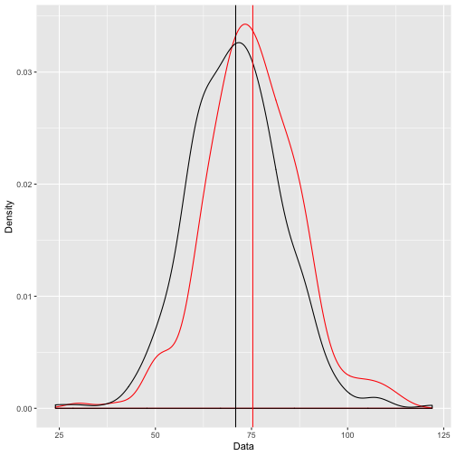
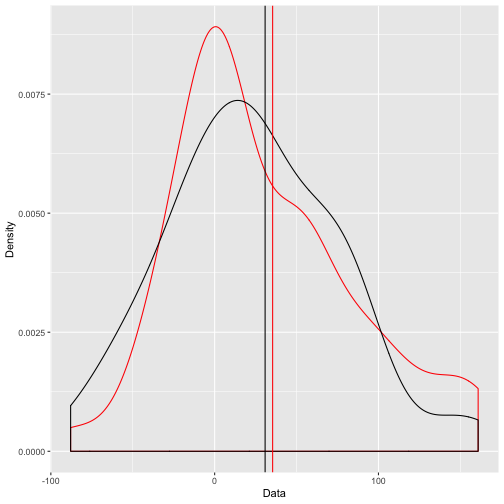

Learning Statistics with R
========================================================
author: 曾意儒 Yi-Ju Tseng
autosize: true
font-family: 'Microsoft JhengHei'
navigation: slide


Main Objective
========================================================

- Are blood pressure of diabetes patients higher than non-diabetes patients?
- Are BMI of diabetes patients higher than non-diabetes patients?
- Compare all the variables in the data between diabettes and non-diabetes patients.


Data
========================================================

PimaIndiansDiabetes2: A data frame with 768 observations on 9 variables

```r
library(mlbench)
data(PimaIndiansDiabetes2)
dplyr::glimpse(PimaIndiansDiabetes2)
```

```
Observations: 768
Variables: 9
$ pregnant <dbl> 6, 1, 8, 1, 0, 5, 3, 10, 2, 8, 4, 10, 10, 1, 5, 7, 0, 7…
$ glucose  <dbl> 148, 85, 183, 89, 137, 116, 78, 115, 197, 125, 110, 168…
$ pressure <dbl> 72, 66, 64, 66, 40, 74, 50, NA, 70, 96, 92, 74, 80, 60,…
$ triceps  <dbl> 35, 29, NA, 23, 35, NA, 32, NA, 45, NA, NA, NA, NA, 23,…
$ insulin  <dbl> NA, NA, NA, 94, 168, NA, 88, NA, 543, NA, NA, NA, NA, 8…
$ mass     <dbl> 33.6, 26.6, 23.3, 28.1, 43.1, 25.6, 31.0, 35.3, 30.5, N…
$ pedigree <dbl> 0.627, 0.351, 0.672, 0.167, 2.288, 0.201, 0.248, 0.134,…
$ age      <dbl> 50, 31, 32, 21, 33, 30, 26, 29, 53, 54, 30, 34, 57, 59,…
$ diabetes <fct> pos, neg, pos, neg, pos, neg, pos, neg, pos, pos, neg, …
```

Data
========================================================

- Diabetes: diabetes = 'pos'
- Non-Diabetes: diabetes = 'neg'

```r
head(PimaIndiansDiabetes2)
```

| pregnant| glucose| pressure| triceps| insulin| mass| pedigree| age|diabetes |
|--------:|-------:|--------:|-------:|-------:|----:|--------:|---:|:--------|
|        6|     148|       72|      35|      NA| 33.6|    0.627|  50|pos      |
|        1|      85|       66|      29|      NA| 26.6|    0.351|  31|neg      |
|        8|     183|       64|      NA|      NA| 23.3|    0.672|  32|pos      |
|        1|      89|       66|      23|      94| 28.1|    0.167|  21|neg      |
|        0|     137|       40|      35|     168| 43.1|    2.288|  33|pos      |
|        5|     116|       74|      NA|      NA| 25.6|    0.201|  30|neg      |


Blood pressure: diabetes vs. non-diabetes
========================================================

Are blood pressure of diabetes patients higher than non-diabetes patients?

```r
library(dplyr)
BPDM<-PimaIndiansDiabetes2 %>% 
    filter(diabetes=="pos") %>% 
    pull(pressure)
BPNonDM<-PimaIndiansDiabetes2 %>% 
    filter(diabetes=="neg") %>% 
    pull(pressure)
```


Blood pressure: diabetes vs. non-diabetes
========================================================

Are blood pressure of diabetes patients higher than non-diabetes patients?

- Central tendency: `Mean`
- Variability: `SD`

Blood pressure: Mean and SD
========================================================


```r
mean(BPDM,na.rm=T)
```

```
[1] 75.32143
```

```r
mean(BPNonDM,na.rm=T)
```

```
[1] 70.87734
```

```r
sd(BPDM,na.rm=T)
```

```
[1] 12.29987
```

```r
sd(BPNonDM,na.rm=T)
```

```
[1] 12.16122
```

Blood pressure: diabetes vs. non-diabetes
========================================================

75.32 (red) > 70.88 (black)?! Is it real? Visualization!


Blood pressure: diabetes vs. non-diabetes
========================================================

75.32 (red) > 70.88 (black)?! Is it real? Visualization!


Blood pressure: diabetes vs. non-diabetes
========================================================
Use **statistical test** to check if 75.32 (red) > 70.88 (black), **parametric test**

[T-test](https://zh.wikipedia.org/zh-tw/%E5%AD%B8%E7%94%9Ft%E6%AA%A2%E9%A9%97)
- if P<0.05: Blood pressure: diabetes and non-diabetes are different
- if P>=0.05: No statistically significant difference bewteen diabetes and non-diabetes

Blood pressure: T-test
========================================================

```r
t.test(BPDM,BPNonDM)
```

```

	Welch Two Sample t-test

data:  BPDM and BPNonDM
t = 4.6643, df = 504.72, p-value = 3.972e-06
alternative hypothesis: true difference in means is not equal to 0
95 percent confidence interval:
 2.572156 6.316023
sample estimates:
mean of x mean of y 
 75.32143  70.87734 
```

Blood pressure: diabetes vs. non-diabetes
========================================================
Can we use **parametric test**? 

[Shapiro–Wilk test](https://en.wikipedia.org/wiki/Shapiro%E2%80%93Wilk_test)
- if P<0.05: Non-normal distribution
- if P>=0.05: Normal distribution

Blood pressure: Shapiro–Wilk test
========================================================

```r
shapiro.test(BPDM)
```

```

	Shapiro-Wilk normality test

data:  BPDM
W = 0.98547, p-value = 0.01154
```

```r
shapiro.test(BPNonDM)
```

```

	Shapiro-Wilk normality test

data:  BPNonDM
W = 0.98994, p-value = 0.002243
```

Blood pressure: diabetes vs. non-diabetes
========================================================
The blood pressure of diabetes and non-diabetes patients are non-normal distribution.
We need to use: 

- Central tendency: `Median`
- Variability: `IQR`

Blood pressure: Median and IQR
========================================================

```r
median(BPDM,na.rm=T)
```

```
[1] 74.5
```

```r
median(BPNonDM,na.rm=T)
```

```
[1] 70
```

```r
IQR(BPDM,na.rm=T)
```

```
[1] 16
```

```r
IQR(BPNonDM,na.rm=T)
```

```
[1] 16
```


Blood pressure: diabetes vs. non-diabetes
========================================================
The blood pressure of diabetes and non-diabetes patients are non-normal distribution.
We need to use **non-parametric test**! 

[Mann-Whitney U test](https://en.wikipedia.org/wiki/Mann%E2%80%93Whitney_U_test)
- if P<0.05: Blood pressure: diabetes and non-diabetes are different
- if P>=0.05: No statistically significant difference bewteen diabetes and non-diabetes

Blood pressure: Mann-Whitney U test
========================================================

```r
wilcox.test(BPDM,BPNonDM)
```

```

	Wilcoxon rank sum test with continuity correction

data:  BPDM and BPNonDM
W = 73646, p-value = 1.629e-06
alternative hypothesis: true location shift is not equal to 0
```

Are blood pressure of diabetes patients higher than non-diabetes patients?
========================================================

The blood pressure of diabetes patients (74.5, IQR:16) are higher than non-diabetes patients (70, IQR:16) (P<0.001).


BMI: diabetes vs. non-diabetes
========================================================

Are BMI of diabetes patients higher than non-diabetes patients?

```r
library(dplyr)
BMIDM<-PimaIndiansDiabetes2 %>% 
    filter(diabetes=="pos") %>% 
    pull(mass)
BMINonDM<-PimaIndiansDiabetes2 %>% 
    filter(diabetes=="neg") %>% 
    pull(mass)
```


BMI: diabetes vs. non-diabetes
========================================================

Are BMI of diabetes patients higher than non-diabetes patients?

- Central tendency: `Mean`
- Variability: `SD`

BMI: Mean and SD
========================================================

```r
mean(BMIDM,na.rm=T)
```

```
[1] 35.40677
```

```r
mean(BMINonDM,na.rm=T)
```

```
[1] 30.85967
```

```r
sd(BMIDM,na.rm=T)
```

```
[1] 6.614982
```

```r
sd(BMINonDM,na.rm=T)
```

```
[1] 6.560737
```

BMI: diabetes vs. non-diabetes
========================================================

35.4 (red) > 30.8 (black)?! Is it real? Visualization!


BMI: diabetes vs. non-diabetes
========================================================

75.32 (red) > 70.88 (black)?! Is it real? Visualization!


BMI: diabetes vs. non-diabetes
========================================================
Use **statistical test** to check if 35.4 (red) > 30.8 (black), **parametric test**

[T-test](https://zh.wikipedia.org/zh-tw/%E5%AD%B8%E7%94%9Ft%E6%AA%A2%E9%A9%97)
- if P<0.05: BMI: diabetes and non-diabetes are different
- if P>=0.05: No statistically significant difference bewteen diabetes and non-diabetes


BMI: T-test
========================================================

```r
t.test(BMIDM,BMINonDM)
```

```

	Welch Two Sample t-test

data:  BMIDM and BMINonDM
t = 9.055, df = 539.79, p-value < 2.2e-16
alternative hypothesis: true difference in means is not equal to 0
95 percent confidence interval:
 3.560659 5.533527
sample estimates:
mean of x mean of y 
 35.40677  30.85967 
```

BMI: diabetes vs. non-diabetes
========================================================
Can we use **parametric test**? 

[Shapiro–Wilk test](https://en.wikipedia.org/wiki/Shapiro%E2%80%93Wilk_test)
- if P<0.05: Non-normal distribution
- if P>=0.05: Normal distribution

BMI: Shapiro–Wilk test
========================================================

```r
shapiro.test(BMIDM)
```

```

	Shapiro-Wilk normality test

data:  BMIDM
W = 0.94938, p-value = 5.738e-08
```

```r
shapiro.test(BMINonDM)
```

```

	Shapiro-Wilk normality test

data:  BMINonDM
W = 0.98054, p-value = 3.858e-06
```

BMI: diabetes vs. non-diabetes
========================================================
The BMI of diabetes and non-diabetes patients are **non-normal distribution**.
We need to use: 

- Central tendency: `Median`
- Variability: `IQR`

BMI: Median and IQR
========================================================

```r
median(BMIDM,na.rm=T)
```

```
[1] 34.3
```

```r
median(BMINonDM,na.rm=T)
```

```
[1] 30.1
```

```r
IQR(BMIDM,na.rm=T)
```

```
[1] 8.025
```

```r
IQR(BMINonDM,na.rm=T)
```

```
[1] 9.7
```

BMI: diabetes vs. non-diabetes
========================================================
The BMI of diabetes and non-diabetes patients are non-normal distribution.
We need to use **non-parametric test**! 

[Mann-Whitney U test](https://en.wikipedia.org/wiki/Mann%E2%80%93Whitney_U_test)
- if P<0.05: BMI: diabetes and non-diabetes are different
- if P>=0.05: No statistically significant difference bewteen diabetes and non-diabetes

BMI: Mann-Whitney U test
========================================================

```r
wilcox.test(BMIDM,BMINonDM)
```

```

	Wilcoxon rank sum test with continuity correction

data:  BMIDM and BMINonDM
W = 89731, p-value < 2.2e-16
alternative hypothesis: true location shift is not equal to 0
```


Are BMI of diabetes patients higher than non-diabetes patients?
========================================================

The BMI of diabetes patients (34.3, IQR:8) are higher than non-diabetes patients (30.1, IQR:9.7) (P<0.001).


Main Results
========================================================

- The blood pressure of diabetes patients (74.5, IQR:16) are higher than non-diabetes patients (70, IQR:16) (P<0.001).

- The BMI of diabetes patients (34.3, IQR:8) are higher than non-diabetes patients (30.1, IQR:9.7) (P<0.001).

All Variables: diabetes vs. non-diabetes
========================================================
How to compare all the variables in the data between diabettes and non-diabetes patients?

Analyze the variable separately?

We can use `tableone` package

`tableone` package 
========================================================
[tableone package](https://cran.r-project.org/web/packages/tableone/vignettes/introduction.html) 

```r
#install.packages("tableone")
library(tableone)
```


The First Try
========================================================
`CreateTableOne()`

- data


```r
CreateTableOne(data = PimaIndiansDiabetes2)
```

|                     |Overall         |
|:--------------------|:---------------|
|n                    |768             |
|pregnant (mean (SD)) |3.85 (3.37)     |
|glucose (mean (SD))  |121.69 (30.54)  |
|pressure (mean (SD)) |72.41 (12.38)   |
|triceps (mean (SD))  |29.15 (10.48)   |
|insulin (mean (SD))  |155.55 (118.78) |
|mass (mean (SD))     |32.46 (6.92)    |
|pedigree (mean (SD)) |0.47 (0.33)     |
|age (mean (SD))      |33.24 (11.76)   |
|diabetes = pos (%)   |268 (34.9)      |

Group the Data into Diabetes and Non-Diabetes
========================================================
`CreateTableOne()`

- data
- strata: Stratifying (grouping) variable name(s)


```r
CreateTableOne(data = PimaIndiansDiabetes2,
               strata="diabetes")
```

|                     |neg             |pos             |p      |test |
|:--------------------|:---------------|:---------------|:------|:----|
|n                    |500             |268             |       |     |
|pregnant (mean (SD)) |3.30 (3.02)     |4.87 (3.74)     |<0.001 |     |
|glucose (mean (SD))  |110.64 (24.78)  |142.32 (29.60)  |<0.001 |     |
|pressure (mean (SD)) |70.88 (12.16)   |75.32 (12.30)   |<0.001 |     |
|triceps (mean (SD))  |27.24 (10.03)   |33.00 (10.33)   |<0.001 |     |
|insulin (mean (SD))  |130.29 (102.48) |206.85 (132.70) |<0.001 |     |
|mass (mean (SD))     |30.86 (6.56)    |35.41 (6.61)    |<0.001 |     |
|pedigree (mean (SD)) |0.43 (0.30)     |0.55 (0.37)     |<0.001 |     |
|age (mean (SD))      |31.19 (11.67)   |37.07 (10.97)   |<0.001 |     |
|diabetes = pos (%)   |0 (0.0)         |268 (100.0)     |<0.001 |     |

Use non-parametric test
========================================================
`CreateTableOne()`

- data
- strata: Stratifying (grouping) variable name(s)
- nonnormal: The variables that need to use **non-parametric test**

```r
table1<-CreateTableOne(data = PimaIndiansDiabetes2,
               strata="diabetes")
print(table1,
      nonnormal=c("mass","pressure"))
```

```
                         Stratified by diabetes
                          neg                   pos                  
  n                          500                   268               
  pregnant (mean (SD))      3.30 (3.02)           4.87 (3.74)        
  glucose (mean (SD))     110.64 (24.78)        142.32 (29.60)       
  pressure (median [IQR])  70.00 [62.00, 78.00]  74.50 [68.00, 84.00]
  triceps (mean (SD))      27.24 (10.03)         33.00 (10.33)       
  insulin (mean (SD))     130.29 (102.48)       206.85 (132.70)      
  mass (median [IQR])      30.10 [25.60, 35.30]  34.30 [30.90, 38.92]
  pedigree (mean (SD))      0.43 (0.30)           0.55 (0.37)        
  age (mean (SD))          31.19 (11.67)         37.07 (10.97)       
  diabetes = pos (%)           0 (0.0)             268 (100.0)       
                         Stratified by diabetes
                          p      test   
  n                                     
  pregnant (mean (SD))    <0.001        
  glucose (mean (SD))     <0.001        
  pressure (median [IQR]) <0.001 nonnorm
  triceps (mean (SD))     <0.001        
  insulin (mean (SD))     <0.001        
  mass (median [IQR])     <0.001 nonnorm
  pedigree (mean (SD))    <0.001        
  age (mean (SD))         <0.001        
  diabetes = pos (%)      <0.001        
```

Use non-parametric test
========================================================

```r
print(table1,
      nonnormal=c("mass","pressure"))
```

|                        |neg                  |pos                  |p      |test    |
|:-----------------------|:--------------------|:--------------------|:------|:-------|
|n                       |500                  |268                  |       |        |
|pregnant (mean (SD))    |3.30 (3.02)          |4.87 (3.74)          |<0.001 |        |
|glucose (mean (SD))     |110.64 (24.78)       |142.32 (29.60)       |<0.001 |        |
|pressure (median [IQR]) |70.00 [62.00, 78.00] |74.50 [68.00, 84.00] |<0.001 |nonnorm |
|triceps (mean (SD))     |27.24 (10.03)        |33.00 (10.33)        |<0.001 |        |
|insulin (mean (SD))     |130.29 (102.48)      |206.85 (132.70)      |<0.001 |        |
|mass (median [IQR])     |30.10 [25.60, 35.30] |34.30 [30.90, 38.92] |<0.001 |nonnorm |
|pedigree (mean (SD))    |0.43 (0.30)          |0.55 (0.37)          |<0.001 |        |
|age (mean (SD))         |31.19 (11.67)        |37.07 (10.97)        |<0.001 |        |
|diabetes = pos (%)      |0 (0.0)              |268 (100.0)          |<0.001 |        |


Final Outputs
========================================================

```r
table1CSV <- 
    print(table1,
          nonnormal = c("mass","pressure"),
          printToggle = FALSE)
write.csv(table1CSV, file = "myTable1.csv")
```

參考資料
========================================================

- [Statistics and R - Harvard@edX](https://www.edx.org/course/statistics-and-r)
- [Data Analysis for the Life Sciences](https://leanpub.com/dataanalysisforthelifesciences)
- [tableone package](https://cran.r-project.org/web/packages/tableone/vignettes/introduction.html) 
