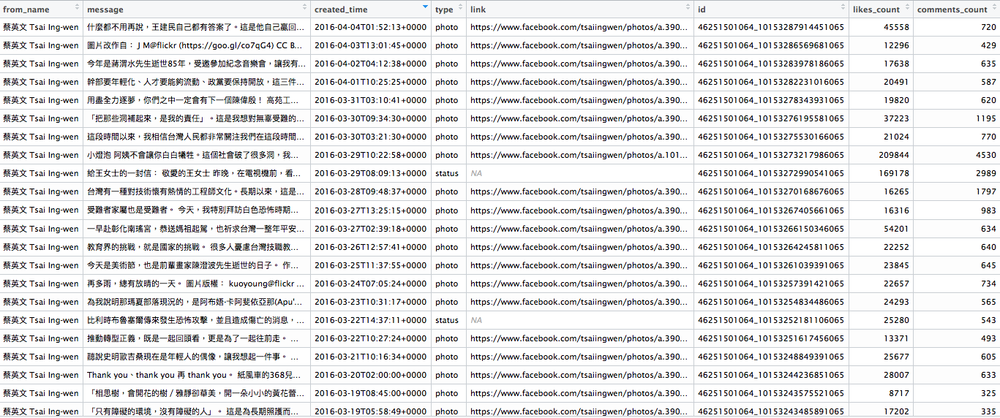
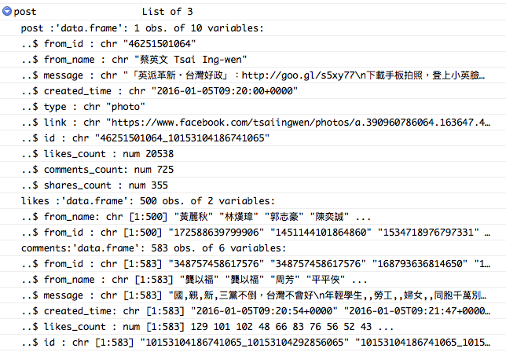
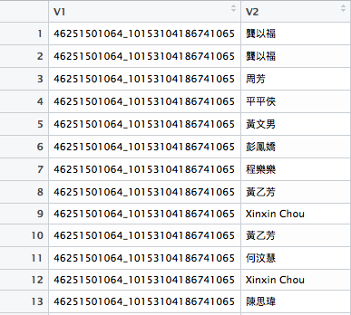
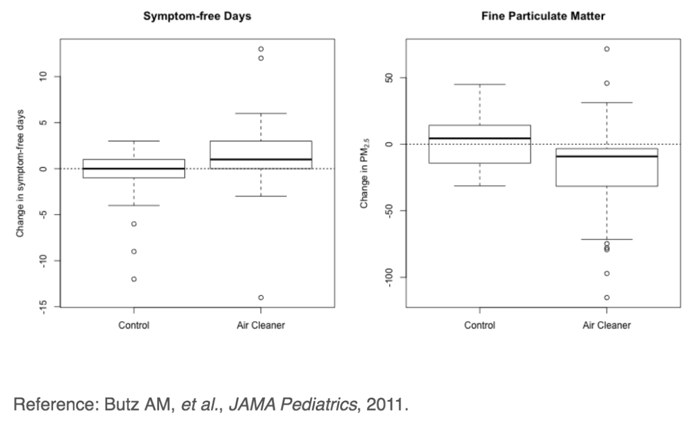
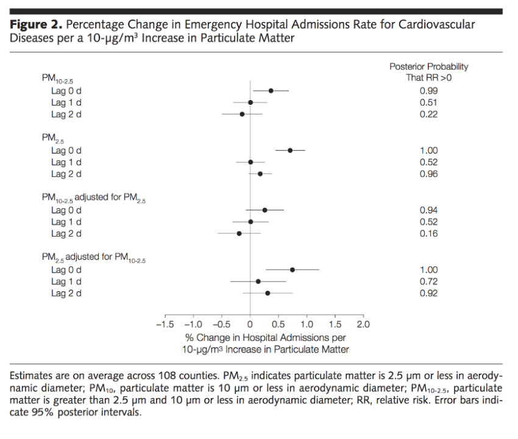

## 複習
- 將.csv檔案讀入R
```{r}
data <- read.csv('open.csv')
data
```


## 複習
- 將XML檔案讀入R
    - `XML`

```{r warning=FALSE,message=FALSE}
library(XML)
fileUrl <- "http://www.w3schools.com/xml/simple.xml"
doc <- xmlTreeParse(fileUrl,useInternal=TRUE)
rootNode <- xmlRoot(doc)
rootNode
```


## 複習
- 將XML檔案讀入R
- 針對某個tag取值
```{r explore4}
xpathSApply(rootNode,"//name",xmlValue)#取得所有"name"標籤內的資料
xpathSApply(rootNode,"//price",xmlValue)#取得所有"price"標籤內的資料
```

## 複習
- 使用APIs讀取檔案
- 將JSON檔案讀入R
    - `jsonlite`
    - `RCurl`
    - URL: "http://data.taipei/opendata/datalist/apiAccess?scope=resourceAquire&rid=190796c8-7c56-42e0-8068-39242b8ec927"
```{r message=FALSE,warning=FALSE}
library(jsonlite)
library(RCurl)
WaterData<-fromJSON(
    getURL("http://data.taipei/opendata/datalist/apiAccess?scope=resourceAquire&rid=190796c8-7c56-42e0-8068-39242b8ec927"))
head(WaterData$result$results)
```

## 複習
- 使用APIs讀取檔案, 將JSON檔案讀入R
```{r message=FALSE,warning=FALSE}
WaterData<-fromJSON(
    getURL("http://data.taipei/opendata/datalist/apiAccess?scope=resourceAquire&rid=190796c8-7c56-42e0-8068-39242b8ec927"))
head(WaterData$result$results)
```

## 作業範例
```{r eval=FALSE}
if (!require('Rfacebook')){
    install.packages("Rfacebook")
    library(Rfacebook)
}
token <- "Your token"
totalPage<-NULL ##重要
lastDate<-Sys.Date()
DateVector<-seq(as.Date("2016-01-01"),lastDate,by="5 days")
DateVectorStr<-as.character(DateVector)
for(i in 1:(length(DateVectorStr)-1)){
    tempPage<-getPage("tsaiingwen", token,since = DateVectorStr[i],
                      until = DateVectorStr[i+1])
    totalPage<-rbind(totalPage,tempPage)
}
```

## 作業執行結果 totalPage


## 加分題-粉絲留言頻率
先把每篇留言的人找出來
```{r eval=FALSE}
totalComment<-NULL
for(i in 1:nrow(totalPage)){ ##會跑很久.....建議先跑十筆就好(1:10)
    post<-getPost(totalPage$id[i],token,
                  n.comments = totalPage$comments_count)
    tempComment<-cbind(post$post$id,post$comments$from_name)
    totalComment<-rbind(totalComment,tempComment)
}
```


## totalComment

```
可能會出現There were 50 or more warnings 
(use warnings() to see the first 50)

50: In if (n.comments < 500) { ... :
  the condition has length > 1 and only the first element will be used
```


## 分析
```{r eval=FALSE}
totalComment<-data.frame(totalComment)
colnames(totalComment)<-c("postID","commentName")
NameCount<-aggregate(postID~commentName,totalComment,FUN=length)
head(NameCount[order(NameCount$postID,decreasing = T),],10)
```
```
      commentName postID
31055      李雲方   1001
5349     Gao Gary    879
13282    Pin Chen    617
1295     Ben  Hsu    480
21142      余國鋒    443
29199      曾景釗    413
23378      吳志豐    384
21428        偲歆    347
2471   Cheng Teng    343
6654  Hui Mei Lin    335
```

## 誰啊？...


## 誰啊？......


## 誰啊？...........


## 歐！？！


## 參考資源

- R Bloggers 有很多[爬蟲範例](http://www.r-bloggers.com/?s=Web+Scraping)（英文）
- [Ptt爬蟲實作](http://bryannotes.blogspot.tw/2014/08/r-ptt-wantedsocial-network-analysis.html) 
- [大數學堂 網頁爬蟲課程](http://www.largitdata.com/course_list/1)


##Other Data
- MySQL `RMySQL`
- HDF5 `rhdf5`
- Weka `foreign`
- Stata `foreign`
- SPSS `Hmisc`
- SAS `Hmisc`
- GIS `rgdal`
- Images `jpeg`
- Music `tuneR`


##每次開始前
- 打開GitHub桌面版
- 打GitHub帳密與Git config資料
- **Clone**上次交的作業回本機端(存到桌面)
+ 提示：左上角的+號，選**Clone**
- 點兩下*Clone回來的資料夾*裡面的**.Rproj**
- 下載[今天要用的R Code](https://github.com/yijutseng/BigDataCGUIM/blob/master/BigData20160411.Rmd)

# Data Manipulation

## Start with reshaping
[http://www.statmethods.net/management/reshape.html](http://www.statmethods.net/management/reshape.html)
```{r results='hide',message=FALSE, warning=FALSE}
if (!require('reshape2')){
    install.packages("reshape2")
    library(reshape2)
}
```
```{r reshape2}
head(mtcars)
```


## Melting data frames
[http://www.statmethods.net/management/reshape.html](http://www.statmethods.net/management/reshape.html)

```{r mtcars}
mtcars$carname <- rownames(mtcars)
carMelt <- melt(mtcars,id=c("carname","gear","cyl"),
                measure.vars=c("mpg","hp"))
head(carMelt,n=3)
tail(carMelt,n=3)
```

## Casting data frames -1
[http://www.statmethods.net/management/reshape.html](http://www.statmethods.net/management/reshape.html)

```{r }
cylData <- dcast(carMelt, cyl ~ variable)
cylData
```

## Casting data frames -2
[http://www.statmethods.net/management/reshape.html](http://www.statmethods.net/management/reshape.html)

```{r }
cylData <- dcast(carMelt, cyl ~ variable,mean)
cylData
```


## More information
- `reshape` [教學](http://www.slideshare.net/jeffreybreen/reshaping-data-in-r)
- `data.table` [教學](https://www.datacamp.com/community/tutorials/data-table-r-tutorial)


# 圖形分析

## Principles of Analytic Graphics

- 比較，呈現差異
    - 比較什麼？誰跟誰比較？

## 比較，呈現差異
```{r message=FALSE,warning=FALSE}
library(SportsAnalytics) #install.packages("SportsAnalytics")
NBA1415<-fetch_NBAPlayerStatistics("14-15")
boxplot(Blocks~Position,data=NBA1415)
```

## Principles of Analytic Graphics

- 比較，呈現差異
    - 比較什麼？誰跟誰比較？

- 呈現因果關係（causality）,機制（mechanism）,結果解釋（explanation）,系統化的結構（systematic structure）
    - 因果模型？為什麼你想要做這樣的比較

## 呈現因果關係（causality）


## Principles of Analytic Graphics

- 比較，呈現差異
    - 比較什麼？誰跟誰比較？

- 呈現因果關係（causality）,機制（mechanism）,結果解釋（explanation）,系統化的結構（systematic structure）
    - 因果模型？為什麼你想要做這樣的比較

- 呈現多變數（Multivariate）資料
    - 多變數（Multivariate）：超過兩個變數就叫多變數
    - 所有真實事件都是多變數的


## 呈現多變數（Multivariate）資料
```{r message=FALSE, warning=FALSE,fig.height=3.5}
library(ggplot2) #install.packages("ggplot2")
qplot(TotalPoints, TotalMinutesPlayed,
      facets = .~Position, data = NBA1415)+
    stat_smooth(method="glm")
```

## 呈現多變數（Multivariate）資料
```{r message=FALSE, warning=FALSE,fig.height=3.5}
#library(ggplot2) #install.packages("ggplot2")
qplot(TotalRebounds, TotalMinutesPlayed,
      facets = .~Position, data = NBA1415)+
    stat_smooth(method="glm")
```

## Principles of Analytic Graphics
- 將證據整合呈現
    - 在同一個畫面呈現文字、數字、影像、圖表
    - 盡量用圖形呈現資料

## 將證據整合呈現


## Principles of Analytic Graphics
- 將證據整合呈現
    - 在同一個畫面呈現文字、數字、影像、圖表
    - 盡量用圖形呈現資料

- 將圖表做適當的標記與說明，包括xy軸名稱、單位、資料來源等
    - 資料圖表必須可以呈現你想說的故事


## Principles of Analytic Graphics
- 將證據整合呈現
    - 在同一個畫面呈現文字、數字、影像、圖表
    - 盡量用圖形呈現資料

- 將圖表做適當的標記與說明，包括xy軸名稱、單位、資料來源等
    - 資料圖表必須可以呈現你想說的故事
  
- 內容才是最重要的
    - 資料不好，分析不好，圖表再美也沒有用
  
Edward Tufte (2006). *Beautiful Evidence*, Graphics Press LLC. [www.edwardtufte.com](http://www.edwardtufte.com)


## 為什麼要畫圖？

* To understand data properties
* To find patterns in data
* To suggest modeling strategies
* To "debug" analyses
* To communicate results

1~4: 探索圖 (Exploratory graphs)

5: 結果圖 (Final graphs)

## 探索圖的特色

* They are made quickly
* A large number are made
* The goal is for personal understanding
* Axes/legends are generally cleaned up (later)
* Color/size are primarily used for information

# 用R畫圖的常用Packages

## 用R畫圖的Packages

- Base: plot()
- lattice: `library(lattice)`
- ggplot: `library(ggplot2)`

## 用R畫圖101: Base

* "Artist's palette" model
* Start with blank canvas and build up from there
* Start with plot function (or similar)
* Use annotation functions to add/modify (`text`, `lines`, `points`,
  `axis`)


## 用R畫圖101: Base

* 方便，跟人類想像的畫圖方法一樣，一步一步畫

* 畫上去就不能反悔，如果想改只能從頭來（跟在紙上畫圖一樣）

* code有時蠻難看懂

* 用一連串的單一指令，將圖片的要件堆疊上去


## Base Plot() ?plot

```{r,fig.height=3,fig.width=8}
if (!require('datasets')){
    install.packages("datasets")
    library(datasets)
}
data(cars)
plot(cars$speed, cars$dist)
```


## The Lattice System

* 單一個函數（function）作圖 (`xyplot`, `bwplot`,etc.)

* 在呈現三個變數的關係時很好用: Looking at how y changes with x across levels of z

* 圖形參數（邊緣、空白）等都自動調好了

* 一次要放多張圖在同一畫面上很好用


## The Lattice System

* 因為是單函數畫圖，一次就要想好所有設定

* 在圖上做標記有點難

* 不能再圖上堆疊任何想加的東西

## Lattice Plot

```{r,message=FALSE,warning=FALSE}
if (!require('lattice')){
    install.packages("lattice")
    library(lattice)
}
state <- data.frame(state.x77, region = state.region)
state
```

## Lattice Plot
Need `library(lattice)`
```{r,fig.height=2,fig.width=8}
xyplot(Life.Exp ~ Income | region, data = state, layout = c(4, 1))
```

- `Life.Exp ~ Income | region`: y ~ x | block
- `data`: data frame
- `layout = c(4, 1)`: 4 columns, 1 row

## Lattice Plot
Need `library(lattice)`
```{r,warning=FALSE,fig.height=2.5,fig.width=8}
xyplot(Life.Exp ~ Income | region, data = state, layout = c(2, 2))
```
- `layout = c(2, 2)`: 2 columns, 2 rows


## The ggplot2 System

* 整合base和lattice兩種畫圖方法的特色

* 和lattice一樣自動調整空白和文字，但也和base一樣可以一層一層加文字和點


## ggplot2 Plot
```{r, message=FALSE,warning=FALSE,fig.height=3,fig.width=6}
if (!require('ggplot2')){
    install.packages("ggplot2")
    library(ggplot2)
}
qplot(Life.Exp, Income,facets = .~region, data = state)
```

## ggplot2 Example 2
Need `library(ggplot2)`
```{r, message=FALSE,fig.height=3.5,fig.width=6}
data(mpg)
qplot(displ, hwy, data = mpg)
```


## Summary

* Base: 一層疊一層，醜醜醜

* Lattice: 用一個指令畫完整張圖，有多種功能，方便一次畫多個圖

* ggplot2: 可以以一層疊一層，也能一次畫完。推薦！


## References
- Roger D. Peng & Elizabeth Matsui (2015) *The Art of Data Science*, Leanpub
- Paul Murrell (2011). *R Graphics*, CRC Press.
- Hadley Wickham (2009). *ggplot2*, Springer.
- 王亮博 [R Visualization - Using ggplot2](https://blog.liang2.tw/2013-RConf-ggplot2-intro/)

# Plotting System--Base

## Plotting System--Base

- *graphics*: contains plotting functions for the "base" graphing
   systems, including `plot`, `hist`, `boxplot` and many others.

- *grDevices*: contains all the code implementing the various graphics
   devices, including X11, PDF, PostScript, PNG, etc.


## 作圖步驟

作圖前，先想想:

- 圖要呈現在哪裡？螢幕上？還是存成檔案？

- 圖形會怎麼被使用
  - Is the plot for viewing `temporarily` on the screen?  
  - Will it be presented in a `web browser`?
  - Will it eventually end up in a `paper` that might be `printed`? 
  - Are you using it in a `presentation`?

- 圖上會有很多資料點嗎？還是只有一些資料？


## Base Graphics

- 作圖兩階段
  - Initializing a new plot
  - Annotating (adding to) an existing plot

- 用 `plot(x, y)` or `hist(x)` 建立新的圖

- `plot`其實有很多參數，但都有預設值

- 用`?par`去看這些餐度的意義，還有怎麼設定


## Simple Base Graphics: Histogram

```{r,fig.height=3.5}
library(datasets)
hist(airquality$Ozone)  ## Draw a new plot
```


## Simple Base Graphics: Scatterplot

```{r,fig.height=3.5}
library(datasets)
with(airquality, plot(Wind, Ozone))
```


## Simple Base Graphics: Boxplot

```{r,fig.height=3.5}
library(datasets)
airquality <- transform(airquality, Month = factor(Month))
boxplot(Ozone ~ Month, airquality, xlab = "Month", ylab = "Ozone (ppb)")
```


## 畫圖重要參數- Base

- `pch`: the plotting symbol (default is open circle)
- `lty`: the line type (default is solid line), can be dashed, dotted, etc.
- `lwd`: the line width, integer 
- `col`: the plotting color,  用`colors()` 來看有哪些顏色可用
- `xlab`: character string for the x-axis label
- `ylab`: character string for the y-axis label


## 畫圖重要參數- Base

用 `par()` function 來設定畫圖的參數們

- `las`: the orientation of the axis labels on the plot
- `bg`: the background color
- `mar`: the margin size
- `oma`: the outer margin size (default is 0 for all sides)
- `mfrow`: number of plots per row, column (plots are filled row-wise) 
- `mfcol`: number of plots per row, column (plots are filled column-wise)


## 畫圖重要參數- Base

Default values for global graphics parameters

```{r}
par("lty")
par("col")
par("pch")
```


## 畫圖重要參數- Base

Default values for global graphics parameters

```{r}
par("bg")
par("mar")
par("mfrow")
```


## Base Plotting Functions

- `plot`: 畫散佈圖或是其他類型的圖，看資料型態自動決定

- `lines`: 在圖上加線
- `points`: 在圖上加點
- `text`: 在圖上加字
- `title`: add annotations to x, y axis labels, title, subtitle, outer margin 
- `mtext`: add arbitrary text to the margins (inner or outer) of the plot 
- `axis`: adding axis ticks/labels


## Base Plot with Annotation

```{r,fig.height=3.5}
library(datasets)
with(airquality, plot(Wind, Ozone))
## Add a title
title(main = "Ozone and Wind in New York City")  
```


## Base Plot with Annotation

```{r,fig.height=3}
with(airquality, plot(Wind, Ozone, 
                      main = "Ozone and Wind in NYC"))
with(subset(airquality, Month == 5), 
     points(Wind, Ozone, col = "blue"))
```


## Base Plot with Annotation

```{r,fig.height=3}
with(airquality, plot(Wind, Ozone, main = "Ozone and Wind in NYC", type = "n"))
with(subset(airquality, Month == 5), points(Wind, Ozone, col = "blue"))
with(subset(airquality, Month != 5), points(Wind, Ozone, col = "red"))
legend("topright", pch = 1, col = c("blue", "red"), 
       legend = c("May", "Other Months"))
```


## Base Plot with Regression Line

```{r,fig.height=3}
with(airquality, plot(Wind, Ozone, 
                      main = "Ozone and Wind in NYC", pch = 20))
model <- lm(Ozone ~ Wind, airquality)
abline(model, lwd = 2)
```


## Multiple Base Plots

```{r,fig.height=3,fig.width=8}
par(mfrow = c(1, 2))
with(airquality, {
	plot(Wind, Ozone, main = "Ozone and Wind")
	plot(Solar.R, Ozone, main = "Ozone and Solar Radiation")
})
```


## Multiple Base Plots

```{r,fig.height=3,fig.width=8}
par(mfrow = c(1, 3), mar = c(4, 4, 2, 1), oma = c(0, 0, 2, 0))
with(airquality, {
	plot(Wind, Ozone, main = "Ozone and Wind")
	plot(Solar.R, Ozone, main = "Ozone and Solar Radiation")
	plot(Temp, Ozone, main = "Ozone and Temperature")
	mtext("Ozone and Weather in New York City", outer = TRUE)
})
```


## Summary

* Plots in the base plotting system are created by calling successive R functions to "build up" a plot

* Plotting occurs in two stages:
    - Creation of a plot
    - Annotation of a plot (adding lines, points, text, legends)

* The base plotting system is very flexible and offers a high degree of control over plotting


## 探索圖範例：又是大家熟悉的NBA...

```{r message=FALSE,warning=FALSE}
if (!require('SportsAnalytics')){
    install.packages("SportsAnalytics")
    library(SportsAnalytics)
}
NBA1415<-fetch_NBAPlayerStatistics("14-15")
```


## Simple Summaries of Data - 1

One dimension

* Five-number summary
* Boxplots 箱型圖
* Histograms 直方圖
* Density plot 密度圖
* Barplot 條狀圖


## Five Number Summary

```{r}
summary(NBA1415$TotalPoints)
```


## Boxplot 箱型圖

```{r}
boxplot(NBA1415$TotalPoints, col = "blue")
```


## Histogram 直方圖

```{r,fig.height=3.5}
hist(NBA1415$TotalPoints, col = "green")
```


## Histogram 直方圖

```{r,fig.height=3.5}
hist(NBA1415$TotalPoints, col = "green")
rug(NBA1415$TotalPoints)
```


## Histogram 直方圖

```{r,fig.height=3.5}
hist(NBA1415$TotalPoints, col = "green", breaks = 100)
rug(NBA1415$TotalPoints)
```


## 層層疊 -1

```{r}
boxplot(NBA1415$TotalPoints, col = "blue")
abline(h = 500)
```


## 層層疊 -1

```{r,fig.height=3.5}
hist(NBA1415$TotalPoints, col = "green")
abline(v = 500, lwd = 2)
abline(v = median(NBA1415$TotalPoints), col = "magenta", lwd = 4)
```


## Barplot 條狀圖

```{r}
barplot(table(NBA1415$Team), 
        col = "wheat", main = "Number of Palyers in Each Team")
```


## Simple Summaries of Data - 2

Two dimensions

* Multiple/overlayed 1-D plots (Lattice/ggplot2)
* Scatterplots
* Smooth scatterplots

$> 2$ dimensions

* Overlayed/multiple 2-D plots; coplots
* Use color, size, shape to add dimensions
* Spinning plots
* Actual 3-D plots (not that useful)


## Multiple Boxplots

```{r,fig.width=8,fig.height=3.5}
boxplot(TotalPoints ~ Team, data = NBA1415, col = "red")
```


## Multiple Histograms

```{r,fig.width=8,fig.height=3.5}
par(mfrow = c(2, 1), mar = c(4, 4, 2, 1))
hist(subset(NBA1415, Team == "SAN")$TotalPoints, col = "green")
hist(subset(NBA1415, Team == "GSW")$TotalPoints, col = "green")
```


## Scatterplot

```{r,fig.height=3}
par(mfrow = c(1, 1))
plot(NBA1415$TotalMinutesPlayed, NBA1415$TotalPoints)
abline(h = 500, lwd = 2, lty = 2)
```


## Scatterplot - Using Color

```{r,fig.height=3}
plot(NBA1415$TotalMinutesPlayed, NBA1415$TotalPoints,col=NBA1415$Team)
abline(h = 500, lwd = 2, lty = 2)
```


## Multiple Scatterplots

```{r,fig.height=3.5,fig.width=8}
par(mfrow = c(1, 2), mar = c(5, 4, 2, 1))
with(subset(NBA1415, Team == "SAN"), plot(TotalMinutesPlayed, TotalPoints, main = "SAN"))
with(subset(NBA1415, Team == "GSW"), plot(TotalMinutesPlayed, TotalPoints, main = "GSW"))
```


## Summary

* Exploratory plots are "quick and dirty"

* Let you summarize the data (usually graphically) and highlight any broad features

* Explore basic questions and hypotheses (and perhaps rule them out)

* Suggest modeling strategies for the "next step"


## Further resources

* [R Graph Gallery](http://gallery.r-enthusiasts.com/)
* [R Graph Gallery](http://www.r-graph-gallery.com/all-graphs/)
* [R Bloggers](http://www.r-bloggers.com/)
* [Interactive visualizations with R](http://ouzor.github.io/blog/2014/11/21/interactive-visualizations.html)


# Plotting System -Lattice

## The Lattice Plotting System
包括以下Packaes:

- *lattice*: 包括畫圖相關的函數functions: `xyplot`, `bwplot`, `levelplot`

- *grid*: *lattice* package 的基礎

- 一個函數畫完圖，不能再加標記和文字等


## Lattice Functions

- `xyplot`: 畫散佈圖 scatterplots 
- `bwplot`: 畫盒鬚圖box-and-whiskers plots (“boxplots”)
- `histogram`: 直方圖 histograms
- `stripplot`: 盒鬚圖＋點
- `dotplot`:  dots on "violin strings"
- `splom`: 散佈圖的矩陣
- `levelplot`, `contourplot`: for plotting "image" data


## Lattice Functions

Lattice functions 通常第一個參數是 formula 
```r
xyplot(y ~ x | f * g, data)
```
- We use the *formula notation* here, hence the `~`.

- `y~x`: y-axis~x-axis

- f,g are _conditioning variables_ 
    — optional
    - `*`:  an interaction between two variables

- 第二個參數是資料`data`

- If no other arguments are passed, there are defaults that can be used.


## Simple Lattice Plot

```{r,fig.height=3.5}
library(lattice)
library(datasets)
## Simple scatterplot
xyplot(Ozone ~ Wind, data = airquality)
```


## Simple Lattice Plot

```{r,fig.width=8,fig.height=3.5}
library(datasets)
library(lattice)
## Convert 'Month' to a factor variable
airquality <- transform(airquality, Month = factor(Month)) 
xyplot(Ozone ~ Wind | Month, data = airquality, layout = c(5, 1))
```

## Lattice Behavior

```{r,fig.height=3.5,fig.width=5}
p <- xyplot(Ozone ~ Wind, data = airquality)  ## Nothing happens!
print(p)  ## Plot appears
```
```{r,eval=FALSE}
xyplot(Ozone ~ Wind, data = airquality)  ## Auto-printing
```


## Lattice Panel Functions

- Lattice functions have a **panel function** which controls what
  happens inside each panel of the plot.

- The *lattice* package comes with default panel functions, but you
  can supply your own if you want to customize what happens in each
  panel

- Panel functions receive the x/y coordinates of the data points
  in their panel (along with any optional arguments)


## Lattice Panel Functions

```{r,fig.height=3.5,fig.width=8}
set.seed(10)
x <- rnorm(100)
f <- rep(0:1, each = 50)
y <- x + f - f * x+ rnorm(100, sd = 0.5)
f <- factor(f, labels = c("Group 1", "Group 2"))
xyplot(y ~ x | f, layout = c(2, 1))  ## Plot with 2 panels
```


## Lattice Panel Functions

```{r,fig.height=3}
## Custom panel function
xyplot(y ~ x | f, panel = function(x, y, ...) {
       panel.xyplot(x, y, ...)  
    ## First call the default panel function for 'xyplot'
       panel.abline(h = median(y), lty = 2) 
       ## Add a horizontal line at the median
})
```


## Lattice Panel Functions: Regression line

```{r,fig.height=3}
## Custom panel function
xyplot(y ~ x | f, panel = function(x, y, ...) {
               panel.xyplot(x, y, ...)  
    ## First call default panel function
               panel.lmline(x, y, col = 2)  
               ## Overlay a simple linear regression line
       })
```


## Many Panel Lattice Plot: Example from MAACS

* Study: Mouse Allergen and Asthma Cohort Study (MAACS)

* Study subjects: Children with asthma living in Baltimore City, many
  allergic to mouse allergen

* Design: Observational study, baseline home visit + every 3 months for a year.

* Question: How does indoor airborne mouse allergen vary over time and
  across subjects?


[Ahluwalia et al., *Journal of Allergy and Clinical Immunology*, 2013](http://www.ncbi.nlm.nih.gov/pubmed/23810154)


## Many Panel Lattice Plot

```{r,echo=FALSE,cache=TRUE,fig.width=8}
library(lattice)
env <- readRDS("maacs_env.rds")
env <- transform(env, MxNum = factor(MxNum))
xyplot(log2(airmus) ~ VisitNum | MxNum, data = env, strip = FALSE, pch = 20, xlab = "Visit Number", ylab = expression(Log[2] * "Airborne Mouse Allergen"), main = "Mouse Allergen and Asthma Cohort Study (Baltimore City)")
```


## Summary

* Lattice plots 用一個單一函數畫圖 (e.g. `xyplot`)

* 空白和邊緣都有預設值

* 想看一種圖在不同情況下的差異的時候，很適合

* 使用Panel functions可以調整圖的細節


