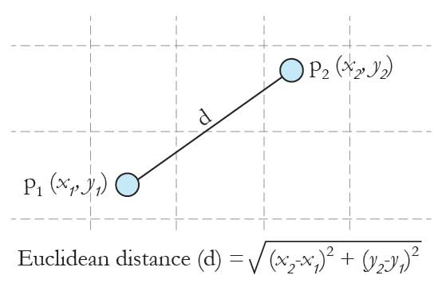
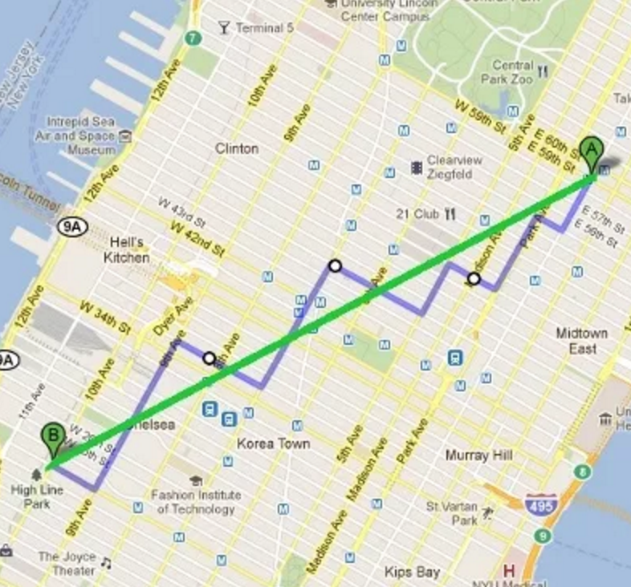

# 期末報告

## 組別/報告日期 -- 大四
- 5/30: 雙北市新興旅店，你就是錢老闆*3 --種類，旅客來源，`影響因子（交通？平台？）`

- 6/6:
    - 臺北市道路速率資料分析 *4 --地理位置/時間/`天氣`
    - 台北市的黃金單車路線 *2 --位置/設施/空汙
    - 台灣交通事故統計資料分析 *4 --時間/車種/嚴重程度/原因/`地理位置`
    - 小老婆汽機車資訊網 機車資訊調查 *3 --FB評論/事故（`輕重、種類...`）
  
    
## 組別/報告日期 -- 照作業繳交時間安排
- 6/13: 
    - Marvel 101 *1 -- 角色能力/出場次數/漫畫章節數（`關連性？影響因子`）
    - 地震與雨量真的有關係嗎? *2 -- 雨量/地震（`地震震源位置/深淺`）
    - 分析教育程度與各行各業的關係 *3 -- 學歷/就業（`主修種類、年紀、性別`）
    - Facebook粉專分析 *3 -- 按讚數/留言數與留言本身的關係（`留言分類？`）
    
## 組別/報告日期 -- 運動組
- 6/20:
    - 台灣人變少了？(台灣人口危機) *5 -- 人口年齡結構/男女比例/遷入遷出（`影響因素：地理位置-就業機會？生育補助？居住成本？`）
    - NBA總覽分析 *4 -- 上場次數 （`薪資？上場時間？得分？實際貢獻？`）
    - Kobe的籃球生涯 *2 -- 年紀/數據（`總教練？隊友？`）
    - MLB職棒分析 *3 -- 球隊隊員薪水/自責分率/上壘率/打擊率（`計算合理薪水？`）
    - CPBL *4 -- 打擊率/上壘率/失誤率/勝率 （`勝利因素，投手？`）
    - [棒球參考](http://www.dailyfantasysports101.com/identify-value-when-drafting/)
    - [籃球參考](http://www.dailyfantasysports101.com/basketball-math-stats-guide/)
    
## 新的資料來源
https://sheethub.com/


## 期末報告規定
- 報告`15-20`分鐘，問問題5分鐘 —> 講重點，嚴格計時

- 整組交一份書面報告
    - 組員與工作分配（會影響成績）
    - 資料分析報告
    - 資料討論/遇到的困難
    - 回答報告時被問的問題
    
## 作業問題
- 若資料的更新頻率是"每五分鐘"，"每天"
    - 請寫程式或人工把需要的時間區間資料取回

    
- 資料格式：表格？圖表？---若已經是圖表，就不用做報告了.....

- 若資料是JSON, XML，請務必要儘速測試資料是否能順利讀取

- 作業的複雜程度與組員人數盡量成正比，會斟酌加減分

# ggplot2 還能畫更多圖

## Choropleth map `面量圖`
`choroplethr` & `choroplethrMaps` packages
```{r, echo=F, warning=F,message=F}
if (!require('choroplethr')){
    install.packages("choroplethr")
    library(choroplethr) ## for state_choropleth()
}
if (!require('choroplethrMaps')){ 
    install.packages("choroplethrMaps") ##上次沒有安裝到這個package
    library(choroplethrMaps) ## for state_choropleth()
}
data(df_pop_state) #記載各州人口數的資料
state_choropleth(df_pop_state) #把各州人口畫在地圖上
```

## Choropleth map
- [面量圖](https://en.wikipedia.org/wiki/Choropleth_map) 
- 把統計資料用顏色畫在對應的地圖上
- `choroplethr` & `choroplethrMaps` packages
- 基於`ggplot2` package所做的專門畫`面量圖`的工具

```{r, warning=F,message=F}
if (!require('choroplethr')){
    install.packages("choroplethr")
    library(choroplethr) ## for state_choropleth()
}
if (!require('choroplethrMaps')){ 
    install.packages("choroplethrMaps") ##上次沒有安裝到這個package
    library(choroplethrMaps) ## for state_choropleth()
}
```

## 美國各州人口分布
用到`choroplethr` & `choroplethrMaps` packages, 記得先讀入
```{r}
data(df_pop_state) #記載各州人口數的資料
state_choropleth(df_pop_state) #把各州人口畫在地圖上
```


## Taiwan的面量圖
- 使用`rgdal`, `rgeos`,`maptools` package處理地圖檔
- 使用`ggplot2` & `RColorBrewer` 畫圖

```{r, echo=F, warning=F,message=F, fig.height=4}
if (!require('rgdal')){#for fortify()
    install.packages("rgdal");library(rgdal)
}
if (!require('rgeos')){#for fortify()
    install.packages("rgeos");library(rgeos) 
}
if (!require('maptools')){#for readShapeSpatial()
    install.packages("maptools");library(maptools) 
}
tw_new <- readShapeSpatial("Taiwan/Town_MOI_1041215.shp") #檔名
library(ggplot2) #for fortify(), ggplot(), ggmap()
tw_new.df <- fortify(tw_new, region = "T_UID") #from ggplot2 package
mydata<-data.frame(NAME_2=tw_new$T_Name, id=tw_new$T_UID,
                   prevalence=rnorm(length(tw_new$T_UID)))
final.plot<-merge(tw_new.df,mydata,by="id",all.x=T)
library(RColorBrewer) #配色用brewer.pal( 9 , "Reds" )
twcmap<-ggplot() +
    geom_polygon(data = final.plot, 
                 aes(x = long, y = lat, group = group, 
                     fill = prevalence), 
                 color = "black", size = 0.25) + 
    coord_map()+#維持地圖比例
    scale_fill_gradientn(colours = brewer.pal(9,"Reds"))+
    theme_void()+
    labs(title="Prevalence of X in Taiwan")
twcmap
```


## Taiwan的面量圖
- 用台灣的Open Data來畫一次
- 還沒有好用的package可用
- 只好自己從頭來了
- 下載台灣的地圖資料 [政府資料開放平台](http://data.gov.tw/node/7441)
- 鄉鎮市區界線(TWD97經緯度)
- 將下載的`資料夾`解壓縮，放到專案資料夾內
- in `shapefile` [Wiki](https://zh.wikipedia.org/zh-tw/Shapefile)
- 空間資料開放格式
- [參考資料](http://www.r-bloggers.com/mapping-with-ggplot-create-a-nice-choropleth-map-in-r/)

## 將shapefile讀入R
使用`maptools` package 的`readShapeSpatial` function
```{r, warning=F,message=F, fig.height=3}
if (!require('rgdal')){#for fortify()
    install.packages("rgdal");library(rgdal)
}
if (!require('rgeos')){#for fortify()
    install.packages("rgeos");library(rgeos) 
}
if (!require('maptools')){#for readShapeSpatial()
    install.packages("maptools");library(maptools) 
}
tw_new <- readShapeSpatial("Taiwan/Town_MOI_1041215.shp") #檔名
names(tw_new)
```

## 處理shapefile-1
- 需要`rgdal`, `rgeos`,`maptools`
- fortify: 將`shapefile`物件轉為`data.frame`
- [參考資料](http://www.r-bloggers.com/mapping-with-ggplot-create-a-nice-choropleth-map-in-r/)
```{r, warning=F,message=F, fig.height=3}
library(ggplot2) #for fortify(), ggplot(), ggmap()
head(tw_new$Town_ID)
tw_new.df <- fortify(tw_new, region = "T_UID") #from ggplot2 package
```

## 處理shapefile-2
- [參考資料](http://www.r-bloggers.com/mapping-with-ggplot-create-a-nice-choropleth-map-in-r/)
```{r, warning=F,message=F, fig.height=3}
head(tw_new.df,10)
```

## 做一個假資料來畫：著色基準檔
```{r, warning=F,message=F, fig.height=3}
#做一個假資料來畫
#prevalence設為亂數rnorm(需要的亂數個數)
mydata<-data.frame(NAME_2=tw_new$T_Name, id=tw_new$T_UID,
                   prevalence=rnorm(length(tw_new$T_UID)))
head(mydata)
```

## 中文編碼
```{r, warning=F,message=F, fig.height=3}
#利用iconv將不知所以然的代碼（\xa6\xa8\xa5\\\xc2\xed）轉為看得懂的中文
#from big5 to utf-8
mydata$NAME_2<-iconv(as.character(mydata$NAME_2), #NAME_2原本是factor
                     from="big5", to = "UTF-8")
head(mydata,10)
```

## 合併的圖檔與著色基準檔
```{r, warning=F,message=F, fig.height=3}
#最後將有prevalence的假數據mydata和經緯度資料tw_new.df合併, 用merge()
final.plot<-merge(tw_new.df,mydata,by="id",all.x=T)
head(final.plot,10)
```

## 畫台灣面量圖-1
```{r, warning=F,message=F, fig.height=3}
library(RColorBrewer) #配色用brewer.pal( 9 , "Reds" )
twcmap<-ggplot() +
    geom_polygon(data = final.plot, 
                 aes(x = long, y = lat, group = group, 
                     fill = prevalence), 
                 color = "black", size = 0.25) + 
    coord_map()+#維持地圖比例
    scale_fill_gradientn(colours = brewer.pal(9,"Reds"))+
    theme_void()+
    labs(title="Prevalence of X in Taiwan")
```


## 畫台灣面量圖-2
```{r, warning=F,message=F, fig.height=5}
twcmap
```


## 使用google map
`ggmap` package
```{r, echo=F,warning=F,message=F, fig.height=5}
if (!require('ggmap')){
    install.packages("ggmap")
    library(ggmap)#for get_map()
}
twmap <- get_map(location = 'Taiwan', zoom = 7,language = "zh-TW")
ggmap(twmap) 
```


## ggmap，把google map載入
```{r, warning=F,message=F, fig.height=3}
if (!require('ggmap')){
    install.packages("ggmap")
    library(ggmap)#for get_map()
}
twmap <- get_map(location = 'Taiwan', zoom = 7,language = "zh-TW")
#location:可以是地名，也可以是經緯度座標
#zoom:放大比例 2-20
#language:地圖語言
```

## ggmap，畫圖
```{r, warning=F,message=F, fig.height=4}
ggmap(twmap) #基於ggplot2物件，可用相同方式處理
```


## ggmap，maptype
```{r, warning=F,message=F, fig.height=3}
#maptype:地圖型態，"terrain", "terrain-background", "satellite",
# "roadmap","hybrid" (google maps), "terrain", "watercolor", 
# "toner" (stamen maps), 
# or a positive integer for cloudmade maps (see ?get_cloudmademap)
TaipeiMap = get_map(location = c(121.43,24.93,121.62,25.19), 
                    zoom = 14, maptype = 'roadmap')
ggmap(TaipeiMap,extent = 'device') #extent = 'device' 滿版
```


## ggmap+面量圖
```{r, warning=F,message=F, fig.height=6}
ggmap(twmap)+ #ggmap
    geom_polygon(data = final.plot,  #面量圖
        aes(x = long, y = lat, group = group, fill = prevalence), 
        color = "grey80", size = 0.1,alpha = 0.5) + 
scale_fill_gradientn(colours = brewer.pal(9,"Reds"))
```


## Density Map? 美國人口密度圖
```{r, echo=F, warning=F,message=F}
StateCenter<-data.frame( #取得美國各州中心座標資料
    region=tolower(state.name),lon=state.center$x,lat=state.center$y)
StatePop<-merge(df_pop_state,StateCenter,by="region") #美國各州人口資料
PopPoint<-NULL #將人口數值，轉為點！重要！
for(i in 1:nrow(StatePop)){
    for(j in 1:(StatePop[i,"value"]/1000000)){
        PopPoint<-rbind(PopPoint,StatePop[i,])   
    }
}
USMap <- get_map(location = "United States", zoom = 4)
densityMap<-ggmap(USMap, extent = "device") + 
    geom_density2d(data = PopPoint, aes(x = lon, y = lat), size = 0.3) + 
    stat_density2d(data = PopPoint, 
            aes(x = lon, y = lat, fill = ..level.., alpha = ..level..), 
                size = 0.01, bins = 16, geom = "polygon") + 
    scale_fill_gradient(low = "green", high = "red", guide = FALSE) + 
    scale_alpha(range = c(0, 0.3), guide = FALSE)
densityMap
```


## 使用 `ggplot2` + `ggmap` 來畫人口密度圖 - 資料前處理1
```{r warning=F,message=F}
#取得美國各州中心座標資料
StateCenter<-data.frame( 
    region=tolower(state.name),lon=state.center$x,lat=state.center$y)
head(StateCenter,1)
#美國各州人口資料
StatePop<-merge(df_pop_state,StateCenter,by="region") 
head(StatePop,1)
```

## 使用 `ggplot2` + `ggmap` 來畫人口密度圖 - 資料前處理2
```{r warning=F,message=F}
#將人口數值，轉為點！重要！
PopPoint<-NULL 
for(i in 1:nrow(StatePop)){
    #每100萬人轉為1點
    for(j in 1:(StatePop[i,"value"]/1000000)){
        PopPoint<-rbind(PopPoint,StatePop[i,])   
    }
}
head(PopPoint,3)
```

## 使用 `ggplot2` + `ggmap` 來畫人口密度圖 - 作圖
```{r warning=F,message=F}
USMap <- get_map(location = "United States", zoom = 4)
densityMap<-ggmap(USMap, extent = "device") + 
    geom_density2d(data = PopPoint, aes(x = lon, y = lat), size = 0.3) + 
    stat_density2d(data = PopPoint, 
            aes(x = lon, y = lat, fill = ..level.., alpha = ..level..), 
                size = 0.01, bins = 16, geom = "polygon") + 
    scale_fill_gradient(low = "green", high = "red", guide = FALSE) + 
    scale_alpha(range = c(0, 0.3), guide = FALSE)
```

## 美國人口密度圖 Density Map
```{r warning=F,fig.height=5.5}
densityMap
```

## ggmap參考資料
- [ggmap package source code](https://github.com/dkahle/ggmap)
- [ggmap cheat sheet](https://www.nceas.ucsb.edu/~frazier/RSpatialGuides/ggmap/ggmapCheatsheet.pdf)
- [ggmap doc](https://dl.dropboxusercontent.com/u/24648660/ggmap%20useR%202012.pdf)


##Heatmap 先將資料讀入
[參考資料](http://flowingdata.com/2010/01/21/how-to-make-a-heatmap-a-quick-and-easy-solution/)
```{r message=FALSE,warning=F}
#讀.csv檔案
nba <- read.csv("http://datasets.flowingdata.com/ppg2008.csv")
head(nba)
```

##Heatmap 資料處理，寬表轉長表
```{r message=FALSE,warning=F}
library(reshape2) #for melt()
nba.m <- melt(nba,id.vars = "Name") #寬表轉長表,以名字作依據
head(nba.m,10)
```

##Heatmap geom_tile()
```{r message=FALSE,warning=F,fig.height=4}
library(ggplot2) #for ggplot()
ggplot(nba.m, aes(variable, Name)) + #aes(x,y)
    geom_tile(aes(fill = value),colour = "white")+ #geom_tile: 區塊著色
    scale_fill_gradient(low = "white",high = "steelblue") #數值低：白色
```


##Heatmap 資料前處理：scale
```{r message=FALSE,warning=F,fig.height=4}
head(nba,2)
nba[,2:21]<-apply(nba[,2:21], 2, scale) #scale處理，將數值轉為平均=0
head(nba,2)
```

## apply() 還記得嗎....
有類似for迴圈的功能

- apply(Data, MARGIN, FUN,…)
    - Data：矩陣（Matrix），Data Frame
    - MARGIN：1=row, 2=column
    - FUN：函數
    - …：函數要用的參數

```{r}
 #針對nba的各column做scale處理-->將數值轉為平均=0
apply(nba[,2:21], 2, scale)
```

##Heatmap 資料前處理：scale
```{r message=FALSE,warning=F,fig.height=4}
nba.m <- melt(nba)
ggplot(nba.m, aes(variable, Name)) + #aes(x,y)
    geom_tile(aes(fill = value),colour = "white")+ #geom_tile: 區塊著色
    scale_fill_gradient(low = "white",high = "steelblue") #數值低：白色
```


##Treemap
需要`treemapify` packages
```{r echo=F, message=FALSE,warning=F,fig.height=4}
if (!require('treemapify')){
    library(devtools) #install.packages("devtools") 沒安裝過記得先裝
    install_github("wilkox/treemapify") #從GitHub安裝測試版Packages,需要安裝devtools
    library(treemapify)
}
data(G20)#範例資料
treeMapCoordinates <- treemapify(data=G20, #data=資料來源(G20)
    area = "Nom.GDP.mil.USD",fill = "HDI",
    label = "Country",group = "Region")
ggplotify(treeMapCoordinates)+ 
    scale_fill_gradient(low = "white",high = "steelblue") #指定高低顏色
```

##Treemap -資料處理
- 需要`treemapify` packages
- [參考資料](https://github.com/wilkox/treemapify)
- [G20 Dataset](https://en.wikipedia.org/wiki/G-20_major_economies)

```{r message=FALSE,warning=F,fig.height=4}
if (!require('treemapify')){
    library(devtools) #install.packages("devtools") 沒安裝過記得先裝
    install_github("wilkox/treemapify") #從GitHub安裝測試版Packages,需要安裝devtools
    library(treemapify)
}
data(G20)#範例資料
head(G20)
```

##Treemap -設定Treemap參數
```{r message=FALSE,warning=F,fig.height=4}
#treemapify: 將資料轉為treemap所需格式
#area:面積來源(GDP)
#fill:著色來源(HDI)
#label:每個方塊分類依據(Country)
#group:方塊群組(Region)
treeMapCoordinates <- treemapify(data=G20, #data=資料來源(G20)
    area = "Nom.GDP.mil.USD",fill = "HDI",
    label = "Country",group = "Region")
head(treeMapCoordinates)
```

##Treemap -作圖1
```{r message=FALSE,warning=F,fig.height=4}
ggplotify(treeMapCoordinates)
```

##Treemap -作圖2
好像數字越大顏色越深比較合理？
```{r message=FALSE,warning=F,fig.height=4}
ggplotify(treeMapCoordinates)+ 
    scale_fill_gradient(low = "white",high = "steelblue") #指定高低顏色
```

##Homework 6 -1
- Data from `Project Tycho®`
- University of Pittsburgh
- Advance the availability and use of public health data for science and policy making
- Data from all weekly notifiable disease reports for the US dating back to `1888`
- Download @ Course Website `POLIO_Incidence.csv`
- 題目：請用圖表呈現1928-1969間，小兒麻痺在美國各州的發生率變化
- 注意：`1955`年開始有小兒麻痺疫苗

##Homework 6 -2
- 題目：請用圖表呈現1928-1969間，小兒麻痺在美國各州的發生率變化
- 預計會遇到的問題：
    - 下載的資料，沒有資料是用`-`表示，畫圖時必須注意（轉為NA）
    - 資料以每週/每州呈現，需依各州各年度加總，計算該年度的總發生率
    - 資料屬於`寬版表格`，必須改成`長版表格`處理
    - >50個州與>20年的資料，如何呈現？

##Homework 6 -3
- 題目：請用圖表呈現1928-1969間，小兒麻痺在美國各州的發生率變化
- 要求：
    - 用`ggplot2` package做圖（或其他衍伸的packages）
    - 呈現各州，各年，發生率的變化
    
- 圖形格式不限
- 5/16(一) 11:59pm 繳交

##Homework 6 -4
- Title：1928-1969間，小兒麻痺在美國各州的發生率變化 (`5 pt`)
- 次標題1：資料前處理 (`20 pt`)
    - 把資料讀進來 (`5 pt`)
    - 將寬表格轉為長表格 (`5 pt`)
    - 處理缺值 (`5 pt`)
    - 計算年度發生率 (`5 pt`)
    
- 次標題2：視覺畫呈現 (`80 pt`)
    - 解釋如何選擇圖形種類 (`10 pt`)
    - 程式碼 (`20 pt`)
    - 圖形呈現 (`40 pt`)，按照是否可以輕易看懂圖形給分
    - 解釋圖形 (`10 pt`)


##Homework 6 -提示1
```{r}
#讀csv資料
polio<-read.csv("POLIO_Incidence.csv",stringsAsFactors = F)
head(polio)
```
   
##Homework 6 -提示2
```{r}
#將寬表格轉為長表格，以年(YEAR)/週(WEEK)為基準，各州名column打散變長
polio.m<-melt(polio,id.vars = c('YEAR','WEEK'))
head(polio.m)
```

##Homework 6 -提示3
```{r}
polio.m[polio.m$value=="-",]$value<-NA #處理缺值,將"-"轉為NA
polio.m$value<-as.numeric(polio.m$value) #將value欄位轉為數字
polio.sumYear<- #各州各年度加總，計算該年度的總發生率
    aggregate(value~YEAR+variable,data=polio.m,FUN=sum,na.rm=F)
head(polio.sumYear)
```

##Homework 6 -錯誤示範，不要這樣畫！
```{r,fig.height=4}
ggplot(polio.sumYear)+ #資料為polio.sumYear
    geom_line(aes(x=YEAR,y=value,color=variable))+ #geom_line:畫折線圖
    geom_vline(xintercept = 1955,colour="black", linetype = "longdash")#疫苗
```


## Error bar 誤差線
- 終於要扯一點所謂的統計
- 通常使用在bar chart, line chart
- 比較多組資料的平均值高低時，務必加上Error bar 誤差線
- 誤差線計算
    - Standard deviation (SD) 標準差：呈現資料本質時使用
    - Standard error (SE) 標準誤差：呈現預估平均值的可能誤差時使用
    - Confidence interval (CI) 信賴區間：呈現預估平均值的信心時使用
    
## Bar Chart without Error Bar in ggplot2
```{r,fig.height=3.5}
library(datasets)
airquality$Month<-as.factor(airquality$Month) #將Month轉為因子變項
airquality.mean<-aggregate(Ozone~Month,airquality,mean) #計算每月Ozone平均mean
ggplot()+geom_bar(data=airquality.mean,aes(x=Month,y=Ozone),
                  stat = "identity") #stat = "identity" 直接畫數字
```

## Bar Chart with Error Bar in ggplot2
```{r,fig.height=3}
airquality.sd<-aggregate(Ozone~Month,airquality,sd) #計算每月Ozone標準差sd
airquality.eb<-merge(airquality.mean,airquality.sd,by="Month")
ggplot(data=airquality.eb)+ #資料airquality.eb
    geom_bar(aes(x=Month,y=Ozone.x),stat = "identity")+
    geom_errorbar( #ymin低點, ymax高點, Ozone.x=mean, Ozone.y=sd標準差
        aes(x=Month,ymin=Ozone.x-Ozone.y,ymax=Ozone.x+Ozone.y), width=.1)
```

# Clustering

## 汽車基本資料

```{r randomData,fig.height=4,fig.width=3}
mtcars.mx<-as.matrix(mtcars)
mtcars.mxs<-scale(mtcars.mx)
#[, 1]	mpg	Miles/(US) gallon
#[, 2]	cyl	Number of cylinders 氣缸數
#[, 3]	disp	Displacement (cu.in.) 排氣量
#[, 4]	hp	Gross horsepower 馬力
#[, 5]	drat	Rear axle ratio 後輪軸比
#[, 6]	wt	Weight (1000 lbs)
#[, 7]	qsec	1/4 mile time
#[, 8]	vs	V/S
#[, 9]	am	Transmission (0 = automatic, 1 = manual)
#[,10]	gear	Number of forward gears 前進檔
#[,11]	carb	Number of carburetors 化油器
head(mtcars.mxs,3)
```


## 各汽車/參數間的相似性？ -heatmap()
```{r,fig.height=4.5,fig.width=6}
par(mar=rep(0.2,4),mfrow=c(1,1))
heatmap(mtcars.mxs)
```


## 如何找到相似的物件/事件？

Clustering organizes things that are `close` into groups

- How do we define close?
- How do we group things?
- How do we visualize the grouping? 
- How do we interpret the grouping? 

## Hierarchical clustering

- An agglomerative approach
    - Find closest two things
    - Put them together
    - Find next closest
    
- Requires
    - A defined distance
    - A merging approach
    
- Produces
    - A tree showing how close things are to each other


## Hierarchical clustering

- An agglomerative approach
    - Find closest two things
    - Put them together
    - Find next closest
    
- Requires
    - `A defined distance`
    - A merging approach
    
- Produces
    - A tree showing how close things are to each other


## How do we define close? `distance`

- Most important step
    - Garbage in -> garbage out
    
- Distance or similarity
    - Continuous - euclidean distance
    - Continuous - correlation similarity
    - Binary - manhattan distance
    
- Pick a distance/similarity that makes sense for your problem
  

## Example distances - Euclidean

$$\sqrt{(A_1-A_2)^2 + (B_1-B_2)^2 + \ldots + (Z_1-Z_2)^2}$$



## Example distances - Manhattan

$$|A_1-A_2| + |B_1-B_2| + \ldots + |Z_1-Z_2|$$



Green line: Euclidean, Blue line: Manhattan


## Hierarchical clustering

- An agglomerative approach
    - Find closest two things
    - Put them together
    - Find next closest
    
- Requires
    - A defined distance
    - `A merging approach`
    
- Produces
    - A tree showing how close things are to each other


## Merging apporach
- Agglomerative 聚合
    - Single-linkage：取最小值
    - Complete-linkage：取最大值
    - Average-linkage：取平均值
    


## Hierarchical clustering - hp vs. mpg
```{r, echo=F, fig.height=5.5,fig.width=8}
par(mfrow=c(1,1),mar=rep(2,4))
plot(mtcars$hp, mtcars$mpg, col = "blue", pch = 19, cex = 2)
text(mtcars$hp + 25, mtcars$mpg, 
     labels = as.character(rownames(mtcars)))
```

## Hierarchical clustering - #1

```{r echo=F,message=F,warning=F, fig.height=5,fig.width=8}
x<-scale(mtcars$hp[-1]);y<-scale(mtcars$mpg[-1])
labelCar<-rownames(mtcars)[-1]
#install.packages("fields")
library(fields)
dataFrame <- data.frame(x=x,y=y)
rdistxy <- rdist(dataFrame) #Euclidean distance
diag(rdistxy) <- diag(rdistxy) + 1e5 

# Find the index of the points with minimum distance
ind <- which(rdistxy == min(rdistxy),arr.ind=TRUE)
par(mfrow=c(1,2),mar=rep(1,4))
plot(x,y,col="blue",pch=19,cex=1)
text(x+0.05,y+0.05,labels=labelCar)
points(x[ind[1,]],y[ind[1,]],col="orange",pch=19,cex=1)

# Make a cluster and cut it at the right height
distxy <- dist(dataFrame)
hcluster <- hclust(distxy)
dendro <- as.dendrogram(hcluster)
cutDendro <- cut(dendro,h=(hcluster$height[1]+0.00001) )
plot(cutDendro$lower[[23]],yaxt="n")
```

## Hierarchical clustering - #2
```{r echo=F, fig.height=6,fig.width=8}
# Find the index of the points with minimum distance
ind3 <- which(rdistxy == rdistxy[order(rdistxy)][3],arr.ind=TRUE)
par(mfrow=c(1,1),mar=rep(0.2,4))
# Plot the points with the minimum overlayed
plot(x,y,col="blue",pch=19,cex=1)
text(x+0.05,y+0.05,labels=labelCar)
points(x[ind[1,]],y[ind[1,]],col="orange",pch=19,cex=1)
points(x[ind3[1,]],y[ind3[1,]],col="red",pch=19,cex=1)
```

## Hierarchical clustering - #3

```{r echo=F,fig.height=5,fig.width=8}
# Find the index of the points with minimum distance
ind3 <- which(rdistxy == rdistxy[order(rdistxy)][3],arr.ind=TRUE)
par(mfrow=c(1,3),mar=rep(0.2,4))
# Plot the points with the minimum overlayed
plot(x,y,col="blue",pch=19,cex=1)
text(x+0.05,y+0.05,labels=labelCar)
points(x[ind[1,]],y[ind[1,]],col="orange",pch=19,cex=1)
points(x[ind3[1,]],y[ind3[1,]],col="red",pch=19,cex=1)

# Make dendogram plots
distxy <- dist(dataFrame)
hcluster <- hclust(distxy)
dendro <- as.dendrogram(hcluster)
cutDendro <- cut(dendro,h=(hcluster$height[2]) )
plot(cutDendro$lower[[19]],yaxt="n")
plot(cutDendro$lower[[22]],yaxt="n")

```


## Hierarchical clustering

- An agglomerative approach
    - Find closest two things
    - Put them together
    - Find next closest
    
- `Requires`
    - A defined distance
    - A merging approach
    
- Produces
    - A tree showing how close things are to each other


## Hierarchical Clustering -dist()
用`dist()`函數計算距離，使用method=""設定計算距離的依據
```{r,fig.height=4,fig.width=6}
d<-dist(mtcars.mxs) #預設為euclidean
d
```

## Hierarchical Clustering -dist()
用`dist()`函數計算距離，使用method=""設定計算距離的依據，可用方法包括：
 "euclidean", "maximum", "manhattan", "canberra", "binary" or "minkowski"
```{r,fig.height=4,fig.width=6}
d<-dist(mtcars.mxs, method="manhattan") #計算manhattan距離
d
```


## Hierarchical Clustering -hclust()
用`hclust`函數畫圖，必要參數是個觀察職的距離（可用`dist()`函數計算）
```{r,fig.height=4,fig.width=6}
par(mar=rep(2,4),mfrow=c(1,1))
hc<-hclust(dist(mtcars.mxs)) #可用method參數設定聚合方法，預設為complete
plot(hc)
```

## Hierarchical Clustering -hclust()
用`hclust`函數畫圖，必要參數是個觀察職的距離（可用`dist()`函數計算）
```{r,fig.height=4,fig.width=6}
par(mar=rep(2,4),mfrow=c(1,1))
hc<-hclust(dist(mtcars.mxs),method="average") #聚合方法為計算平均距離
plot(hc)
```

## Hierarchical Clustering -cutree()
```{r,fig.height=4,fig.width=6}
clusterCut <- cutree(hc, k=5) #分5群
sort(clusterCut)
```

## HC- clusters & variables
```{r,fig.height=4,fig.width=6}
ggplot()+geom_point(data=mtcars,
                    aes(x=hp,y=mpg,color=as.factor(clusterCut)))
```

## Hierarchical Clustering -cutree(),2
```{r,fig.height=4,fig.width=6}
clusterCut <- cutree(hc,h =4) #切在高度=4的地方（距離=4）
sort(clusterCut)
```

## Cluster the data -heatmap(),2
```{r,fig.height=4.5,fig.width=6}
par(mar=rep(0.2,4),mfrow=c(1,1))
heatmap(mtcars.mxs)
```


## Hierarchical clustering - hclust

```{r, fig.height=4,fig.width=4}
distxy <- dist(mtcars.mxs)
hClustering <- hclust(distxy)
plot(hClustering)
```


## Hierarchical clustering: summary
- 可快速瀏覽觀察值與各欄位的關係

- 分群結果可能被以下參數影響：
    - 計算距離的方法
    - 分群依據
    - 更改數值的大小
    

- 可能會遇到的問題：
    - 有時會不太清楚要如何切割分群結果
    

## K-means clustering

- 執行步驟
    - 指定要分幾群
    - 計算每一群的中心點
    - 將各個物件/觀察值指定給最近的中心點
    - 依照新的分群計算新的中心點

## K-means clustering

- 輸入
    - 計算距離的資料（數值）
    - 要分成幾群 # of clusters 
    - 預設個群的中間點位置
    

- 產出
    - 計算出每’群‘的中心點
    - 指定每個觀察值所在的’群‘


## K-means clustering -  example


```{r, fig.height=4,fig.width=6}
x<-scale(mtcars$hp[-1]);y<-scale(mtcars$mpg[-1])
plot(x,y,col="blue",pch=19,cex=2)
text(x+0.05,y+0.05,labels=labelCar)
```


## K-means - starting centroids


```{r,echo=FALSE,fig.height=5,fig.width=5}
par(mar=rep(0.2,4))
plot(x,y,col="blue",pch=19,cex=2)
text(x+0.05,y+0.05,labels=labelCar)
cx <- c(-1,0.5,2.5)
cy <- c(2,0,-1)
points(cx,cy,col=c("red","orange","purple"),pch=3,cex=2,lwd=2)
```


## K-means - assign to closest centroid

```{r,echo=FALSE,fig.height=4.5,fig.width=5}
par(mar=rep(0.2,4))
plot(x,y,col="blue",pch=19,cex=2)
cols1 <- c("red","orange","purple")
text(x+0.05,y+0.05,labels=labelCar)
cx <- c(-1,0.5,2.5)
cy <- c(2,0,-1)
points(cx,cy,col=cols1,pch=3,cex=2,lwd=2)
## Find the closest centroid
distTmp <- matrix(NA,nrow=3,ncol=length(x))
distTmp[1,] <- (x-cx[1])^2 + (y-cy[1])^2
distTmp[2,] <- (x-cx[2])^2 + (y-cy[2])^2
distTmp[3,] <- (x-cx[3])^2 + (y-cy[3])^2
newClust <- apply(distTmp,2,which.min)
points(x,y,pch=19,cex=2,col=cols1[newClust])
```


## K-means - recalculate centroids

```{r,echo=FALSE,fig.height=5,fig.width=5}
par(mar=rep(0.2,4))
plot(x,y,col="blue",pch=19,cex=2)
cols1 <- c("red","orange","purple")
text(x+0.05,y+0.05,labels=labelCar)

## Find the closest centroid
points(x,y,pch=19,cex=2,col=cols1[newClust])
newCx <- tapply(x,newClust,mean)
newCy <- tapply(y,newClust,mean)
points(newCx,newCy,col=cols1,pch=3,cex=2,lwd=2)
```


## K-means - reassign values

```{r,echo=FALSE,fig.height=5,fig.width=5}
par(mar=rep(0.2,4))
plot(x,y,col="blue",pch=19,cex=2)
cols1 <- c("red","orange","purple")
text(x+0.05,y+0.05,labels=labelCar)

points(newCx,newCy,col=cols1,pch=3,cex=2,lwd=2)

## Iteration 2
distTmp <- matrix(NA,nrow=3,ncol=length(x))
distTmp[1,] <- (x-newCx[1])^2 + (y-newCy[1])^2
distTmp[2,] <- (x-newCx[2])^2 + (y-newCy[2])^2
distTmp[3,] <- (x-newCx[3])^2 + (y-newCy[3])^2
newClust2 <- apply(distTmp,2,which.min)
points(x,y,pch=19,cex=2,col=cols1[newClust2])

```


## K-means - update centroids

```{r,echo=FALSE,fig.height=5,fig.width=5}
par(mar=rep(0.2,4))
plot(x,y,col="blue",pch=19,cex=2)
cols1 <- c("red","orange","purple")
text(x+0.05,y+0.05,labels=labelCar)

## Final centroids
finalCx <- tapply(x,newClust2,mean)
finalCy <- tapply(y,newClust2,mean)
points(finalCx,finalCy,col=cols1,pch=3,cex=2,lwd=2)
points(x,y,pch=19,cex=2,col=cols1[newClust2])

```


## `kmeans()` -1

- Important parameters: `x`, `centers`, `iter.max`, `nstart`

```{r kmeans}
dataFrame <- data.frame(x,y)
kmeansObj <- kmeans(dataFrame,centers=3)
names(kmeansObj)
kmeansObj$cluster
```


## `kmeans()` -2

```{r,fig.height=4,fig.width=4}
par(mar=rep(0.2,4))
plot(x,y,col=kmeansObj$cluster,pch=19,cex=2)
points(kmeansObj$centers,col=1:3,pch=3,cex=3,lwd=3)
```


## Heatmaps

```{r,fig.height=3,fig.width=8}
set.seed(1234)
dataMatrix <- as.matrix(dataFrame)[sample(1:12),]
kmeansObj <- kmeans(dataMatrix,centers=3)
par(mfrow=c(1,2), mar = c(2, 4, 0.1, 0.1))
image(t(dataMatrix)[,nrow(dataMatrix):1],yaxt="n")
image(t(dataMatrix)[,order(kmeansObj$cluster)],yaxt="n")
```


## K-means注意事項

- 需要決定# of clusters
    - 用眼睛/人工/特殊要求選
    - 用 cross validation/information theory選
    - [Determining the number of clusters](http://en.wikipedia.org/wiki/Determining_the_number_of_clusters_in_a_data_set)
    

- K-means 沒有一定的結果
    - 不同的 # of clusters 
    - 不同的 # of iterations

## Use sum of squared error (SSE) scree plot to optimize the number of clusters
SSE: The sum of the squared distance between each member of a cluster and its cluster centroid.

[參考資料](http://stackoverflow.com/questions/15376075/cluster-analysis-in-r-determine-the-optimal-number-of-clusters)


## SSE scree plot
```{r,fig.height=3,fig.width=8}
par(mfrow=c(1,1), mar = c(4,4,1,1)) #下,左,上,右
wss <- (nrow(dataMatrix)-1)*sum(apply(dataMatrix,2,var))
for (i in 2:(nrow(dataMatrix)-1)) {
    wss[i] <- sum(kmeans(dataMatrix,centers=i)$withinss)
}
plot(1:(nrow(dataMatrix)-1), wss, type="b", xlab="Number of Clusters",
     ylab="Within groups sum of squares")
```


## Missing values

```{r,error=TRUE}
dataMatrix2 <- mtcars.mx
## Randomly insert some missing data
dataMatrix2[sample(1:100,size=10,replace=FALSE)] <- NA
head(dataMatrix2,10)
```


## Imputing {impute}
用knn的方法計算空值可能可以帶入的數值
```{r,fig.height=4,fig.width=8,tidy=FALSE}
#source("https://bioconductor.org/biocLite.R")
#biocLite("impute")
library(impute)
dataMatrix2 <- impute.knn(dataMatrix2)$data
head(dataMatrix2,10)
```


