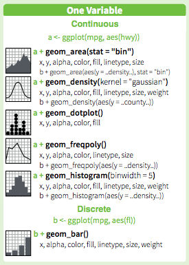
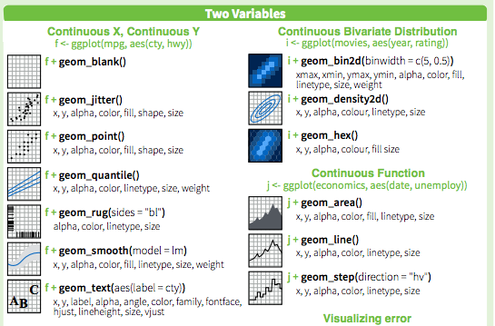
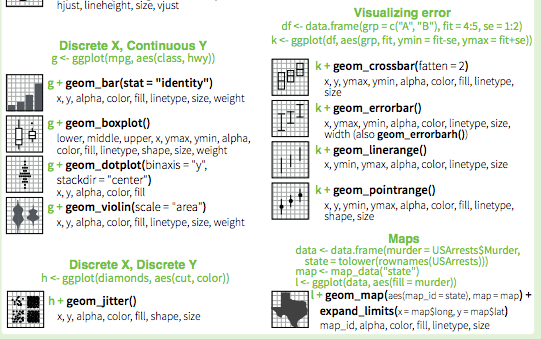
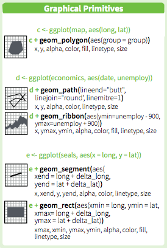
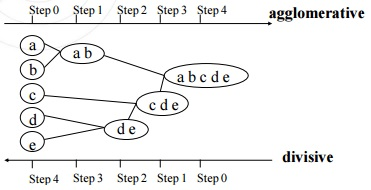
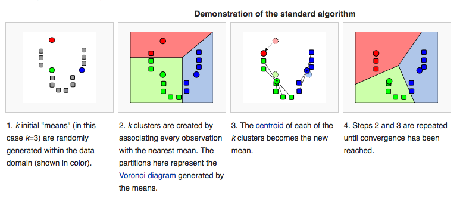
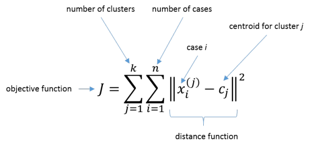
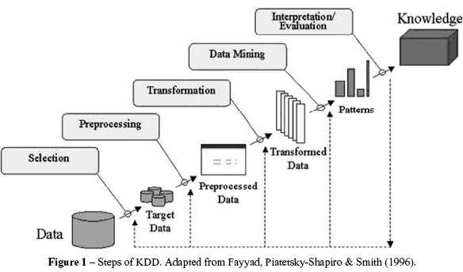

# ggplot2 複習

## 基本架構
- Data `ggplot(Data)`
- Geometries `geom_line()`, `geom_bar()`
- Aesthetic properties `ggplot(Data,aes(x=1, y=1, color='black'))`
- Scale mappings `scale_fill_continuous()`, `scale_fill_grey()`
- Stats `stat_density2d()`

## Geoms: 1 Variable


## Geoms: 2 Variables


## Geoms: 2 Variables


## Geoms: Graphical Primitives


## 參考資料
[ggplot2 Cheat Sheet](https://www.rstudio.com/wp-content/uploads/2015/03/ggplot2-cheatsheet.pdf)

# Clustering

## Clustering
- Hierarchical Clustering 階層式分群法, `dist()`, `hclust()`
- K-means Clustering, `kmeans()`


## Hierarchical Clustering步驟
- 定義距離還有聚合方式
- 計算倆倆觀察職的距離
- 找到距離最小的兩點，合成一組
- 找到距離次小的兩點，合成一組




## K-means Clustering步驟
- 預設中心
- 用預設中心分群
- 用分群重算中心
- 再用中心分群....




## K-means注意事項

- 需要決定# of clusters
    - 用眼睛/人工/特殊要求選
    - 用 cross validation/information theory選
    - [Determining the number of clusters](http://en.wikipedia.org/wiki/Determining_the_number_of_clusters_in_a_data_set)
    

- K-means 沒有一定的結果
    - 不同的 # of clusters 
    - 不同的 # of iterations


## `kmeans()`, k=2

```{r,echo=F,fig.height=5,fig.width=4}
x<-scale(mtcars$hp[-1]);y<-scale(mtcars$mpg[-1])
dataFrame <- data.frame(x,y)
kmeansObj <- kmeans(dataFrame,centers=2)
par(mar=rep(0.2,4),mfrow=c(1,1))
plot(x,y,col=kmeansObj$cluster,pch=19,cex=2)
points(kmeansObj$centers,col=1:2,pch=2,cex=2,lwd=2)
```

## `kmeans()`, k=3

```{r,echo=F,fig.height=5,fig.width=4}
x<-scale(mtcars$hp[-1]);y<-scale(mtcars$mpg[-1])
dataFrame <- data.frame(x,y)
kmeansObj <- kmeans(dataFrame,centers=3)
par(mar=rep(0.2,4),mfrow=c(1,1))
plot(x,y,col=kmeansObj$cluster,pch=19,cex=2)
points(kmeansObj$centers,col=1:3,pch=3,cex=3,lwd=3)
```

## `kmeans()`, k=4

```{r,echo=F,fig.height=5,fig.width=4}
x<-scale(mtcars$hp[-1]);y<-scale(mtcars$mpg[-1])
dataFrame <- data.frame(x,y)
kmeansObj <- kmeans(dataFrame,centers=4)
par(mar=rep(0.2,4),mfrow=c(1,1))
plot(x,y,col=kmeansObj$cluster,pch=19,cex=2)
points(kmeansObj$centers,col=1:4,pch=3,cex=3,lwd=3)
```


## 上課用程式碼
[Rmd下載](https://github.com/yijutseng/BigDataCGUIM/blob/master/BigData20160516.Rmd)

按Raw，右鍵另存新檔

投影片下載：

[Html下載](https://raw.githubusercontent.com/yijutseng/BigDataCGUIM/master/BigData20160516.html)

按右鍵，另存新檔


## Use sum of squared error (SSE) scree plot to optimize the number of clusters

SSE: The sum of the squared distance between each member of a cluster and its cluster centroid.

[參考資料](http://stackoverflow.com/questions/15376075/cluster-analysis-in-r-determine-the-optimal-number-of-clusters)



## SSE scree plot
```{r,fig.height=3,fig.width=8}
par(mfrow=c(1,1), mar = c(4,4,1,1)) #下,左,上,右
wss <- (nrow(dataMatrix)-1)*sum(apply(dataMatrix,2,var))
for (i in 2:(nrow(dataMatrix)-1)) {
    wss[i] <- sum(kmeans(dataMatrix,centers=i)$withinss)
}
plot(1:(nrow(dataMatrix)-1), wss, type="b", xlab="Number of Clusters",
     ylab="Within groups sum of squares")
```


## Missing values

```{r,error=TRUE}
dataMatrix2 <- mtcars.mx
## Randomly insert some missing data
dataMatrix2[sample(1:100,size=10,replace=FALSE)] <- NA
head(dataMatrix2,10)
```


## Imputing {impute}
用knn的方法計算空值可能可以帶入的數值
```{r,fig.height=4,fig.width=8,tidy=FALSE}
#source("https://bioconductor.org/biocLite.R")
#biocLite("impute")
library(impute)
dataMatrix2 <- impute.knn(dataMatrix2)$data
head(dataMatrix2,10)
```


# Machine Learning 機器學習

## 什麼是Machine Learning？
- Learning from data
- `Machine` learning from data


## 什麼是Machine Learning？
- 建立可以從`輸入資料`學習`新資訊`，變成`智慧`的演算法
- 演算法可以基於`輸入資料`，`預測事件`或`協助決策`

- 資料太`少`？`太髒`？-->學不好

## Machine Learning無所不在
- 天氣預測
- 搜尋建議、購物建議
- 股市預測
- 臉部辨識、指紋辨識
- 垃圾郵件標記
- 尿布啤酒

## Machine Learning步驟


## Learning 種類
- Classification 分類
    - 分兩類（P/N, Yes/No, M/F）
    - 分多類 (A/B/C/D)
    
- Regression
    - 真實的'值'（股票、氣溫）
    
- Ranking
    - 排序（Google page rank）
    
- Clustering
    - 分群

## Machine Learning 種類 -2
- Supervised learning 監督式學習
    - Regression
        - Linear Regression
        - Logistic Regression
    - Classification    
        - Support Vector Machines
        - Decision Trees
        - Neural Networks
        - K-Nearest Neighbor
    
- Unsupervised learning 非監督式學習
    - Clustering!
    - Association Rules

## 怎麼選Algorithms?


## 

## 參考資料
- 台大資工林軒田教授（田神）：
    - [Machine Learning Foundations](www.coursera.org/course/ntumlone)
    - [Machine Learning Techniques](www.coursera.org/course/ntumltwo)


