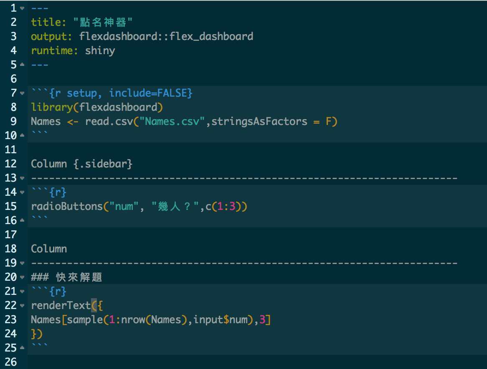
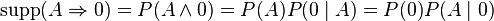
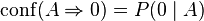
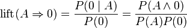

#作業相關

## 成績
已請助教回覆，如果有問題的話可以下課或寫信給我或助教。

## 報告....
- 抄範例也要記得`改錯字`啊....
- 抄範例也要記得拿掉`沒用的Code和註解`啊.....
- 5/30 報告的兩組，如果要畢業典禮前拿到成績，這次的作業要提早交

## 基本的R觀念：`Packages`
R = `主程式`加上一大堆`Packages`

要用特殊的`功能函數`，有時需要另外安裝`packages`，如果出現找不到『Package名稱』的錯誤，可能就是沒安裝過（或是打錯字）。

安裝Packages範例：
```{r eval=F}
install.packages("ggplot2") ##有引號
```

出現找不到『要用的函數名稱』，可能是沒有載入packages（或是打錯字）。

載入Packages範例：
```{r eval=F}
library(ggplot2) ##不用引號
```


## 基本的R Code: subset 子集
```{r eval=F}
Data[選Row,選Column]
Data[選Row,]$選Column
```

選擇方式包括：

1. TRUE or FALSE 向量
2. index（像是只要單數Row，就填入c(1,3,5,7.....)）
3. Row names or Column names向量


## 基本的R Code: subset 子集

選擇方式包括：

1. TRUE or FALSE 向量
2. index（像是只要單數Row，就填入c(1,3,5,7.....)）
3. Row names or Column names向量

```{r eval=F}
Data[c(1:3),c(2:4)] # Data[選Row,選Column], index 向量
Data[Data$Select="AA",]$Score #Data[選Row,]$選Column, T/F 向量
Data[Data$Select="AA","Score"] #Data[選Row,選Column], T/F 向量+Column names
```

## Markdown vs. R Markdown

開GitHub看就知道差別

- Markdown: 在GitHub上呈現成果
- R Markdown: 利用R，製造Markdown文件

`R Markdown`不只能用在製造`Markdown`文件，也可以做`Slides`，或是`網頁`）

比如說... https://yijutseng.shinyapps.io/Name/

## 點名神器原始碼



# ML 複習

## Supervised learning 監督式學習 -1
- Regression 迴歸
    - Linear Regression 線性迴歸 `Y~X1+X2`，Y連續
    - `glm(Y~X1+X2, data=DATA, method='gaussian')`
    - Logistic Regression 邏輯迴歸 `Y~X1+X2`，Y二元
    - `glm(Y~X1+X2, data=DATA, method='binomial')`
    - 若自變項X是類別變項，需要建立`虛擬變項`。`R: 轉成factor`


## Supervised learning 監督式學習 -2
- Classification 分類
    - Support Vector Machines 支持向量機
    - Decision Trees 決策樹 `rpart(Y~X1+X2, data=DATA)`
    - Neural Networks 神經網路
    - K-Nearest Neighbor 
        


## Unsupervised learning 非監督式學習
- Clustering 分群
    - Hierarchical clustering 階層式分群 `hclust()`
    - K-means clustering `kmeans()`
- Association Rules 關聯式規則 `apriori()`, from `arules` package
            


## 上課用程式碼
[Rmd下載](https://github.com/yijutseng/BigDataCGUIM/blob/master/BigData20160523.Rmd)

按Raw，右鍵另存新檔

投影片下載：

[Html下載](https://raw.githubusercontent.com/yijutseng/BigDataCGUIM/master/BigData20160523.html)

按右鍵，另存新檔


#Association Rules 關聯式規則

## 什麼是關聯式規則？ 
- 用於從大量數據中挖掘出有價值的數據項之間的相關關係
- 不考慮項目的次序，而僅考慮其組合
- `購物籃分析 (Market Basket Analysis)`
- Apriori演算法是挖掘`布林關聯規則` (Boolean association rules) 頻繁項集的算法

## Apriori演算法


## 超市資料分析：讀取資料

```{r warning=F,message=F,fig.height=4.5}
# Load the libraries
if (!require('arules')){
    install.packages("arules");library(arules) #for Apriori演算法
}
if (!require('datasets')){
    install.packages("datasets");library(datasets) #for Groceries data
}
data(Groceries) # Load the data set
Groceries@data@Dim #169 種商品，9835筆交易資料
```

## 超市資料長這樣


## 超市資料分析：關聯式分析`apriori()`

```{r warning=F,message=F,fig.height=4.5}
# Get the rules
rules <- apriori(Groceries, # data= Groceries
                 parameter = list(supp = 0.001, conf = 0.8), #參數最低限度
                 control = list(verbose=F)) #不要顯示output
options(digits=2) # Only 2 digits
inspect(rules[1:5]) # Show the top 5 rules
```


## 如何解讀模型
啤酒=>尿布

- `Support`: 一次交易中，包括規則內的物品的機率。買啤酒同時買尿布的機率。交集
- `Confidence`: 包含左邊物品A的交易也會包含右邊物品B的條件機率。在買了啤酒的顧客中，有買尿布的比例。
- `Lift`: 規則的信心比期望值高多少。（買了啤酒以後，有買尿布的機率）/（在所有顧客群中買尿布的機率）
    - `lift`=1: items on the left and right are independent.
    






## 列出最有關連的幾條規則
```{r warning=F,message=F,fig.height=4.5}
rules<-sort(rules, by="confidence", decreasing=TRUE) #按照confidence排序
inspect(rules[1:5]) # Show the top 5 rules
```

## 特別針對某項商品，右邊
買了什麼東西的人，會買`牛奶`呢？
```{r warning=F,message=F,fig.height=4.5}
rulesR<-apriori(data=Groceries, parameter=list(supp=0.001,conf = 0.08), 
        appearance = list(default="lhs",rhs="whole milk"), #設定右邊一定要是牛奶
        control = list(verbose=F)) #不要顯示output
rulesR<-sort(rulesR, decreasing=TRUE,by="confidence") #按照confidence排序
inspect(rulesR[1:5]) # Show the top 5 rules
```

## 特別針對某項商品，左邊
買了`牛奶`的人，會買什麼呢？
```{r warning=F,message=F,fig.height=4.5}
rulesL<-apriori(data=Groceries, parameter=list(supp=0.001,conf = 0.15,minlen=2), 
        appearance = list(default="rhs",lhs="whole milk"), #設定左邊一定要是牛奶
        control = list(verbose=F)) #不要顯示output
rulesL<-sort(rulesL, decreasing=TRUE,by="confidence") #按照confidence排序
inspect(rulesL[1:5]) # Show the top 5 rules
```


## 規則視覺化
```{r eval=F,warning=F,message=F,fig.height=4.5}
if (!require('arulesViz')){
    install.packages("arulesViz"); library(arulesViz)
} 
#Mac->http://planspace.org/2013/01/17/fix-r-tcltk-dependency-problem-on-mac/
plot(rules,method="graph",interactive=TRUE,shading=NA) #會跑一陣子
```

  

## 參考資料
- 台大資工林軒田教授（田神）：
    - [Machine Learning Foundations](www.coursera.org/course/ntumlone)
    - [Machine Learning Techniques](www.coursera.org/course/ntumltwo)
    
- [Market Basket Analysis with R](http://www.salemmarafi.com/code/market-basket-analysis-with-r/)

## 模型驗證？！
- Training set, Development set: 讓演算法`學`到`知識`
- Test set, Validation set: 驗證`學`的怎麼樣
- 通常會比例分配
    - 2/3的資料設為`Training set`
    - 剩下的1/3做驗證`Test set`


## 把NBA的資料讀入
```{r message=FALSE,warning=FALSE}
#讀入SportsAnalytics package
if (!require('SportsAnalytics')){
    install.packages("SportsAnalytics")
    library(SportsAnalytics)
}
#擷取2015-2016年球季球員資料
NBA1516<-fetch_NBAPlayerStatistics("15-16")
NBA1516<-NBA1516[complete.cases(NBA1516),]
```

# Regression 迴歸

## 哪個模型比較好？
```{r warning=F,message=F,fig.height=4.5}
OneVar<-glm(TotalPoints~TotalMinutesPlayed,data =NBA1516)
TwoVar<-glm(TotalPoints~TotalMinutesPlayed+FieldGoalsAttempted,
            data =NBA1516)
ThreeVar<-glm(TotalPoints~TotalMinutesPlayed+FieldGoalsAttempted+Position,
              data =NBA1516)
c(OneVar$aic,TwoVar$aic,ThreeVar$aic)
```

## 好！？
- 以Training set來`選看起來最好的模型`
- 用Test set來`驗證模型是不是真的很好`
- 想像.....訓練出來題庫答得好的學生，寫到新題目不一定會寫！？

## 隨機抽樣？
```{r message=FALSE,warning=FALSE}
sample(1:10,3) # 從1到10，隨機取三個數字
sample(1:nrow(NBA1516),nrow(NBA1516)/3) #從第一行到最後一行，隨機取1/3行數
```

## 把NBA的資料分成Training 和 Test set
```{r message=FALSE,warning=FALSE}
NBA1516$Test<-F #新增一個參數紀錄分組
#隨機取1/3當Test set
NBA1516[sample(1:nrow(NBA1516),nrow(NBA1516)/3),]$Test<-T 
# Training set : Test set球員數
c(sum(NBA1516$Test==F),sum(NBA1516$Test==T)) 
```


## 訓練一個多變數線性迴歸模型
```{r warning=F,message=F,fig.height=4.5}
fit<-glm(TotalPoints~TotalMinutesPlayed+FieldGoalsAttempted+
             Position+ThreesAttempted+FreeThrowsAttempted,
              data =NBA1516[NBA1516$Test==F,])
fit$aic
summary(fit)$coefficients
```

## 逐步選擇模型 stepwise
後退學習：一開始先將所有參數加到模型裡，再一個一個拿掉
```{r warning=F,message=F,fig.height=4.5}
library(MASS)
##根據AIC，做逐步選擇, 預設倒退學習 direction = "backward"
##trace=FALSE: 不要顯示步驟
finalModel_B<-stepAIC(fit,direction = "backward",trace=FALSE) 
summary(finalModel_B)$coefficients
```

## 逐步選擇模型 stepwise
往前學習：一開始先做一個沒有參數的模型，再把參數一個一個加進去
```{r warning=F,message=F,fig.height=4.5}
##根據AIC，做逐步選擇, 往前學習 direction = "forward"
finalModel_F<-stepAIC(fit,direction = "forward",trace=FALSE) 
summary(finalModel_F)$coefficients
```

## 逐步選擇模型 stepwise
雙向學習：參數加加減減
```{r warning=F,message=F,fig.height=4.5}
##根據AIC，做逐步選擇, 雙向學習 direction = "both"
finalModel_Both<-stepAIC(fit,direction = "both",trace=FALSE) 
summary(finalModel_Both)$coefficients
```


## 用Test set來評估模型好不好
```{r warning=F,message=F,fig.height=3}
predictPoint<-predict(finalModel_Both, #Test==T, test data
                      newdata = NBA1516[NBA1516$Test==T,]) 
cor(x=predictPoint,y=NBA1516[NBA1516$Test==T,]$TotalPoints) #相關係數
plot(x=predictPoint,y=NBA1516[NBA1516$Test==T,]$TotalPoints) 
```

# Logistic Regression 邏輯迴歸

## 把入學資料分成Training 和 Test set
注意：當答案有正反兩面時，`Level 1 要放正面答案`-->有病/錄取...
```{r warning=F,message=F,fig.height=4.5}
mydata <- read.csv("http://www.ats.ucla.edu/stat/data/binary.csv")
mydata$admit <- factor(mydata$admit) # 類別變項要轉為factor
mydata$rank <- factor(mydata$rank) # 類別變項要轉為factor
mydata$Test<-F #新增一個參數紀錄分組
mydata[sample(1:nrow(mydata),nrow(mydata)/3),]$Test<-T #隨機取1/3當Test set
c(sum(mydata$Test==F),sum(mydata$Test==T)) # Training set : Test set學生數
#修改一下factor的level: 改成Level 1為錄取，2為不錄取-->Level 1 要放正面答案
mydata$admit<-factor(mydata$admit,levels=c(1,0))
```

## 逐步選擇最好的模型
```{r warning=F,message=F,fig.height=4.5}
# GRE:某考試成績, GPA:在校平均成績, rank:學校聲望
mylogit <- glm(admit ~ gre + gpa + rank, 
               data = mydata[mydata$Test==F,], family = "binomial")
finalFit<-stepAIC(mylogit,direction = "both",trace=FALSE) # 雙向逐步選擇模型
summary(finalFit)
```

## 來預測一下新學生可不可以錄取
```{r warning=F,message=F,fig.height=4.5}
AdmitProb<-predict(finalFit, # 用Training set做的模型
                   newdata = mydata[mydata$Test==T,], #Test==T, test data
                   type="response") #結果為每個人被錄取的機率
head(AdmitProb)
table(AdmitProb<0.5,mydata[mydata$Test==T,]$admit) # row,column
```

## 當答案是二元時：效能指標
- Sensitivity 敏感性
- Specificity 特異性
- Positive Predictive Value (PPV) 陽性預測值
- Negative Predictive Value (NPV) 陰性預測值

## 名詞解釋


- TP: 有病且預測也有病
- TN: 沒病且預測也沒病
- FP: 沒病但是預測有病
- FN: 有病但預測沒病

## 當答案是二元時：效能指標公式


- Sensitivity 敏感性：所有`真的有病`的人，被`預測有病`的比例
- Specificity 特異性：所有`真的沒病`的人，被`預測沒病`的比例
- Positive Predictive Value (PPV) 陽性預測值：所有被`預測有病`的人，`真的有病`的比例
- Negative Predictive Value (NPV) 陰性預測值：所有被`預測沒病`的人，`真的沒病`的比例

## 回想一下剛剛的驗證結果
```{r warning=F,message=F,fig.height=4.5}
table(AdmitProb<0.5,mydata[mydata$Test==T,]$admit) # row,column
```


## 計算預測效能參數
```{r warning=F,message=F,fig.height=4.5}
AdmitProb<-predict(finalFit,
                   newdata = mydata[mydata$Test==T,], #Test==T, test data
                   type="response") #結果為每個人『不』被錄取的機率
AdmitAns<-factor(ifelse(AdmitProb<0.5,1,0),levels=c(1,0))
str(AdmitAns)
```

## 計算預測效能參數
```{r warning=F,message=F,fig.height=4.5}
library(caret) # install.packages("caret") #計算參數的packages
sensitivity(AdmitAns,mydata[mydata$Test==T,]$admit)
specificity(AdmitAns,mydata[mydata$Test==T,]$admit)
posPredValue(AdmitAns,mydata[mydata$Test==T,]$admit)
negPredValue(AdmitAns,mydata[mydata$Test==T,]$admit)
```


## 作業 7
- UCI Machine Learning Repository
- 單號：Pima Indians Diabetes Database [資料來源](https://archive.ics.uci.edu/ml/datasets/Pima+Indians+Diabetes)
- 雙號：Wisconsin Breast Cancer Database [資料來源](https://archive.ics.uci.edu/ml/datasets/Breast+Cancer+Wisconsin+(Original))
- 5/30 11:59pm繳交
- 5/30 報告的同學，如果要畢業典禮前拿到成績，這次的作業要提早在5/29 (日)繳交

## 資料介紹: 糖尿病資料集
- Description: Predict the onset of diabetes in female Pima Indians from medical record data.
    - Type: Binary Classification
    - Dimensions: 768 instances, 9 attributes
    - Inputs: Numeric
    - Output: Categorical, 2 class labels
    

## 資料介紹: 糖尿病資料集
1. Number of times pregnant 
2. Plasma glucose concentration a 2 hours in an oral glucose tolerance test 
3. Diastolic blood pressure (mm Hg) 
4. Triceps skin fold thickness (mm) 
5. 2-Hour serum insulin (mu U/ml) 
6. Body mass index (weight in kg/(height in m)^2) 
7. Diabetes pedigree function 
8. Age (years) 
9. Class variable (0 or 1) 


## 資料介紹: 糖尿病資料集
```{r message=F,warning=F}
#install.packages("mlbench") # 此package內有很多dataset可練習
library(mlbench)
data(PimaIndiansDiabetes)#雙號
str(PimaIndiansDiabetes) #diabetes: pos陽性/neg陰性
```

    
## 資料介紹: 乳癌資料集
- Description: Predict whether a cancer is malignant or benign from biopsy details.
    - Type: Binary Classification
    - Dimensions: 699 instances, 11 attributes
    - Inputs: Integer (Nominal)
    - Output: Categorical, 2 class labels


## 資料介紹: 乳癌資料集
1. Sample code number: id number 
2. Clump Thickness: 1 - 10 皮膚襞厚度
3. Uniformity of Cell Size: 1 - 10 
4. Uniformity of Cell Shape: 1 - 10 
5. Marginal Adhesion: 1 - 10 邊緣粘連
6. Single Epithelial Cell Size: 1 - 10 
7. Bare Nuclei: 1 - 10 
8. Bland Chromatin: 1 - 10 
9. Normal Nucleoli: 1 - 10 
10. Mitoses: 1 - 10 有絲分裂
11. Class: (2 for benign, 4 for malignant)

## 資料介紹: 乳癌資料集
```{r message=F,warning=F}
#install.packages("mlbench") # 此package內有很多dataset可練習
library(mlbench)
data(BreastCancer) #單號
str(BreastCancer) #Class: benign良性/malignant陰性
```

# 作業步驟說明

## 步驟1.1: 讀資料，單號
```{r message=F,warning=F}
#install.packages("mlbench") # 此package內有很多dataset可練習
library(mlbench)
data(BreastCancer) #單號
head(BreastCancer) #Class: benign良性/malignant陰性
```


## 步驟1.1: 讀資料，雙號
```{r message=F,warning=F}
#install.packages("mlbench") # 此package內有很多dataset可練習
library(mlbench)
data(PimaIndiansDiabetes) #雙號
head(PimaIndiansDiabetes) #diabetes: pos陽性/neg陰性
```

## 步驟1.2: 資料前處理
留下沒有缺值的資料，把無關病情的資料拿掉（像是ID）
```{r message=F,warning=F}
# 單號
BreastCancerC<-BreastCancer[complete.cases(BreastCancer), # 選資料完整的row
                            !names(BreastCancer) %in% c("Id")] #把Id拿掉 
c(nrow(BreastCancer),nrow(BreastCancerC))

PimaIndiansDiabetesC<- #雙號
    PimaIndiansDiabetes[complete.cases(PimaIndiansDiabetes),] # 選資料完整的row
c(nrow(PimaIndiansDiabetes),nrow(PimaIndiansDiabetesC))
```


## 步驟2:分成訓練組與測試組
該怎麼分可以自己決定，1/3，1/5...都可以
```{r}
BreastCancerC$Test<-F #新增一個參數紀錄分組
#隨機取1/3當Test set
BreastCancerC[
    sample(1:nrow(BreastCancerC),nrow(BreastCancerC)/3),
     ]$Test<-T 
# 看一下 Training set : Test set 病人數
c(sum(BreastCancerC$Test==F),sum(BreastCancerC$Test==T)) 
```

## 步驟3:訓練模型
- 注意只能用`訓練組`的資料，`Test`參數==F，忘記可以看前面範例

模型選擇建議：

- 糖尿病資料：回歸？ `glm()`
    - formula: diabetes~.    『`.`』代表全部參數
- 乳癌資料：決策樹？ `rpart()` 需要安裝和使用`rpart` package
    - formula: Class~.
- 都試試看？--選一個好的？

提示：要預測的結果，是`二元類別變項` （pos/neg, benign/malignant）

## 步驟4:用測試組驗證模型
計算以下效能指標：

- Sensitivity
- Specificity
- Positive Predictive Value (PPV)
- Negative Predictive Value (NPV)


## 評分標準 1
- Title：乳癌/糖尿病 預測模型 (`5 pt`)
- 次標題1：資料前處理 (`20 pt`)
    - 解釋資料 (`10 pt`) --可參考`資料介紹`
    - 把資料讀進來 (`5 pt`)
    - 分成訓練組跟測試組，並紀錄各組人數 (`5 pt`)
    
- 次標題2：預測模型建立 (`35 pt`)
    - 模型建立、挑選、說明 (`20 pt`)
    - 模型呈現與說明 (`15 pt`)
    
## 評分標準 2
- 次標題3：預測模型驗證，解釋 (`40 pt`) --依效能給分
    - Sensitivity (`10 pt`) 
    - Specificity (`10 pt`) 
    - Positive Predictive Value (PPV) (`10 pt`) 
    - Negative Predictive Value (NPV) (`10 pt`) 

## 作業7範例 - 完整的Rmd & md檔
範例是用`"礦石"`資料，跟作業不同，要參考的話記得要改說明/資料來源....等等等

[Rmd下載](https://github.com/yijutseng/BigDataCGUIM/blob/master/HW7.Rmd)

[md下載](https://github.com/yijutseng/BigDataCGUIM/blob/master/HW7.md)

# Decision Trees 決策樹 

## 阻攻/籃板/三分/助攻/抄截判斷位置-訓練
```{r warning=F,message=F,fig.height=4.5}
if (!require('rpart')){
    install.packages("rpart"); library(rpart)
}
DT<-rpart(Position~Blocks+TotalRebounds+ThreesMade+Assists+Steals,
          data=NBA1516[NBA1516$Test==F,]) #訓練組 Training set
#控球後衛（PG）、得分後衛（SG）、小前鋒（SF）、大前鋒（PF）和中鋒（C）
DT
```

## 阻攻/籃板/三分/助攻/抄截判斷位置-訓練
預設的`plot()`真的太難用，改用`rpart.plot` package的`prp()`
```{r warning=F,message=F,fig.height=4.5}
if (!require('rpart.plot')){
    install.packages("rpart.plot"); library(rpart.plot)
}
prp(DT)	# 把決策樹畫出來
```

## 阻攻/籃板/三分/助攻/抄截判斷位置-訓練
```{r warning=F,message=F,fig.height=5}
prp(DT)
```

## 有批球員沒寫守備位置？--預測
```{r warning=F,message=F,fig.height=5}
posPred<-predict(DT,newdata= NBA1516[NBA1516$Test==T,]) #Test==T, test data
# 預設為class probabilities, type = "prob"
head(posPred)
```


## 有個人沒寫守備位置--對答案
```{r warning=F,message=F,fig.height=5}
result<-cbind(round(posPred,digits = 2),
              NBA1516[NBA1516$Test==T,]$Name,
      as.character(NBA1516[NBA1516$Test==T,]$Position))
head(result)
```


## 有個人沒寫守備位置--預測-2
```{r warning=F,message=F,fig.height=5}
posPredC<-predict(DT,newdata= NBA1516[NBA1516$Test==T,],type = "class") 
# type = "class" 直接預測類別
head(posPredC)
```

## 有個人沒寫守備位置--對答案-2
```{r warning=F,message=F,fig.height=5}
resultC<-cbind(as.character(posPredC),NBA1516[NBA1516$Test==T,]$Name,
      as.character(NBA1516[NBA1516$Test==T,]$Position))
head(resultC)
```


## 模型驗證
- Training set, Development set: 讓演算法`學`到`知識`
- Test set, Validation set: 驗證`學`的怎麼樣
- 通常會比例分配
    - 2/3的資料設為`Training set`
    - 剩下的1/3做驗證`Test set`

- 訓練模型時，只能看Training set，用Training set來選一個最好的模型
- 訓練模型時，不能偷看Test set，才是真正的`驗證`


# 一步一步建立預測模型---範例

## 完整的模型建立步驟範例
- 標題：以聲波撞擊礦石的回聲預測礦石是否為礦物
- 以Sonar, Mines vs. Rocks為例
- 不要直接複製貼上，請按照自己被分配到的資料集寫作業～


## 步驟1.1:讀資料
```{r message=F,warning=F}
#install.packages("mlbench") # 此package內有很多dataset可練習
library(mlbench)
data(Sonar) 
str(Sonar) #看一下資料型別，有沒有缺值，類別變項是不是factor
```

## 在建立模型之前...別忘了基本的資料分析
在這次的作業內不用包含這個部分

`探索性分析 Exploratory data analysis`，看看資料長怎麼樣

要是有一個參數可以完美的把礦物跟石頭分開，那就不用麻煩了...

## 探索性分析 Exploratory data analysis
```{r warning=F,message=F,fig.height=4}
library(ggplot2);library(reshape2) #install.packages(c("ggplot2","reshape2"))
Sonar.m<-melt(Sonar,id.vars = c("Class"))
ggplot(Sonar.m)+geom_boxplot(aes(x=Class,y=value))+ 
    facet_wrap(~variable, nrow=5,scales = "free_y") #投影片太小了
```

## 步驟1.2: 資料前處理
- 缺值？ 
    - 沒有缺值，不需要處理
- 答案種類？
    - 類別變項叫`Class`，M: mine礦-->+, R: rock-->-，不需要處理
- 類別變項的型別是不是factor？
    - 是，不需要處理
- 有沒有無關的參數？
    - 沒有無關的參數，不需要處理

## 步驟2:分成訓練組與測試組
該怎麼分可以自己決定，1/3，1/5...都可以
```{r}
Sonar$Test<-F #新增一個參數紀錄分組
#隨機取1/3當Test set
Sonar[sample(1:nrow(Sonar),nrow(Sonar)/3),]$Test<-T 
# 看一下 Training set : Test set 案例數
c(sum(Sonar$Test==F),sum(Sonar$Test==T)) 
```

## 步驟3:訓練模型
- 注意只能用`訓練組`的資料，`Test`參數==F，忘記可以看前面範例
- 數值自變項X很多，先用迴歸好了～
- 要解釋一下模型
```{r warning=F,message=F}
fit<-glm(Class~., Sonar[Sonar$Test==F,],family="binomial")
finalFit<-stepAIC(fit,direction = "both",trace = F)
summary(finalFit)$coefficients
```


## 步驟4.1:用測試組驗證模型-預測

```{r warning=F,message=F,fig.height=4.5}
MinePred<-predict(finalFit,newdata = Sonar[Sonar$Test==T,])
MineAns<-ifelse(MinePred<0.5,"M","R") #<0.5: Level 1
MineAns<-factor(MineAns,levels = c("M","R"))
MineAns
```


## 步驟4.2:用測試組驗證模型-效能

```{r warning=F,message=F,fig.height=4.5}
library(caret) # install.packages("caret") #計算參數的packages
sensitivity(MineAns,Sonar[Sonar$Test==T,]$Class)
specificity(MineAns,Sonar[Sonar$Test==T,]$Class)
posPredValue(MineAns,Sonar[Sonar$Test==T,]$Class)
negPredValue(MineAns,Sonar[Sonar$Test==T,]$Class)
```

## 解釋範例 - 資料說明
此資料來源為UCI Machine Learning Repository。

記載礦物與石頭接受各個不同角度的聲波撞擊後，接收到的回聲數值，一共有60個參數，代表使用一特別角度的聲波撞擊礦石所得回聲。另外，分類結果為二元分類，包括礦物 (M) 與石頭 (R) 。


## 解釋範例 - 模型說明
使用聲波在不同角度撞擊`礦石`所得到的回聲資料，以邏輯迴歸建立模型預測礦石是否為礦物，經最佳化後，模型使用參數為V1 + V2 + V3 + V4 + V7 + V11 + V12 + V13 + V17 + V18 + V22 + V24 + V25 + V26 + V30 + V31 + V32 + V38 + V39 + V48 + V50 + V52 + V53 + V58 + V59，共25個參數，各參數代表從一特別角度所得的礦石回聲

## 解釋範例 - 預測效能說明
使用聲波在不同角度撞擊`礦石`所得到的回聲資料，以邏輯迴歸模型預測礦石是否為礦物，可得敏感度97%，特異性89%，陽性預測率89%，陰性預測率97%。

## 作業7範例 - 完整的Rmd & md檔
範例是用`"礦石"`資料，跟作業不同，要參考的話記得要改說明/資料來源....等等等

[Rmd下載](https://github.com/yijutseng/BigDataCGUIM/blob/master/HW7.Rmd)

[md下載](https://github.com/yijutseng/BigDataCGUIM/blob/master/HW7.md)

