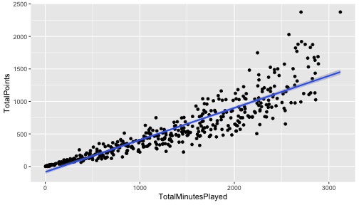
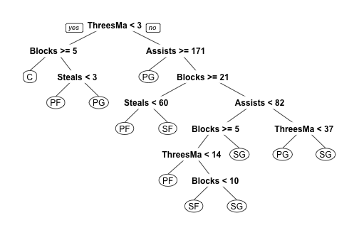
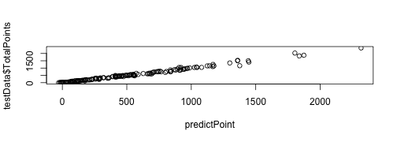

資料探勘101
========================================================
author: 曾意儒 Yi-Ju Tseng
date: 2017/07/01
autosize: true
font-family: 'Microsoft JhengHei'
navigation: slide

大綱
====================================
type:sub-section 

- 什麼是資料探勘
- Regression 迴歸
- Decision Trees 決策樹
- 模型驗證
- 效能指標

什麼是資料探勘
====================================

建立從**輸入資料**學習新資訊，變成智慧的**演算法**或**資料模式**，用來**預測事件**或**協助決策**

- 用人工智慧、機器學習、統計學等方法
- 在相對較大型的資料集中發現模式的計算過程
- 當資料太`少`或`太髒`的時候，資料探勘的效力會被影響。

資料探勘條件
====================================
資料探勘要派上用場，必須有以下條件：

- 有一些模式/模型可`學`
- 很難定義這些模式/模型
- 有資料可`學`這些模式/模型

資料探勘可應用在
====================================

- 天氣預測
- 搜尋建議、購物建議
- 股市預測
- 臉部辨識、指紋辨識
- 垃圾郵件標記
- 尿布啤酒

資料探勘的分類
====================================

- **監督式**學習與**非監督式**學習
- 監督式學習的特點是訓練資料中有**正確答案**，由輸入物件和預期輸出所組成，而演算法可以由訓練資料中學到或建立一個模式，並依此模式推測新的實例
- 非監督式學習則不用提供**正確答案**，也就是不需要人力來輸入標籤，單純利用訓練資料的特性，將資料分群分組。

資料探勘的分類
====================================

- Supervised learning 監督式學習
    - Regression 迴歸：真實的'值'（股票、氣溫）
    - Classification 分類：分兩類（P/N, Yes/No, M/F, Sick/Not sick）/分多類 (A/B/C/D)

- Unsupervised learning 非監督式學習
    - Clustering 分群
    - Association Rules 關聯式規則

監督式學習
====================================

在**監督式**學習中常見的資料探勘演算法如下： 
  - Linear Regression 線性迴歸
  - Logistic Regression 羅吉斯迴歸、邏輯迴歸
  - Support Vector Machines 支持向量機
  - Decision Trees 決策樹
  - K-Nearest Neighbor
  - Neural Networks 神經網路
  - Deep Learning 深度學習

非監督式學習
====================================

在**非監督式**學習中常見的資料探勘演算法如下： 
  - Hierarchical clustering 階層式分群
  - K-means clustering
  - Neural Networks 神經網路
  - Deep Learning 深度學習


Regression 迴歸
====================================

- 用在了解兩個或多個變數間`是否相關`、`相關方向與強度`
- 建立`數學模型`以便觀察特定變數來預測研究者感興趣的變數

常見的迴歸分析演算法包括：

- Linear Regression 線性迴歸
- Logistic Regression 羅吉斯迴歸、邏輯迴歸

Linear Regression 線性迴歸
====================================

- 嘗試將Linear Regression 線性迴歸用在NBA的資料
- 做NBA`得分`與`上場分鐘數`的線性迴歸觀察

```r
options(digits = 3)
#讀入SportsAnalytics package
library(SportsAnalytics)
#擷取2015-2016年球季球員資料
NBA1516<-fetch_NBAPlayerStatistics("15-16")
```

迴歸線作圖
====================================

```r
library(ggplot2)
ggplot(NBA1516,
       aes(x=TotalMinutesPlayed,
           y=TotalPoints))+
  geom_point()+
  geom_smooth(method = "glm")
```



lm()
====================================

- 最基本的簡單線性迴歸分析為`lm()`
- `lm(formula,data=資料名稱)`，搭配formula使用
- formula的撰寫方法為：依變項~自變項1＋自變項2＋....

```r
lm(TotalPoints~TotalMinutesPlayed,
   data =NBA1516)
```

```

Call:
lm(formula = TotalPoints ~ TotalMinutesPlayed, data = NBA1516)

Coefficients:
       (Intercept)  TotalMinutesPlayed  
           -85.907               0.493  
```

TotalPoints = `0.4931` * TotalMinutesPlayed `-85.9071`

glm()
====================================
- 更被廣泛使用的是廣義線性迴歸模型generalized linear models (glm)，`glm()`
- 使用方法與`lm()`類似
- 包括線性迴歸模型和邏輯迴歸模型
- 如果需要修改預設模型，可設定family參數：
    - `family="gaussian"` 線性模型模型
    - `family="binomial"` 邏輯迴歸模型
    - `family="poisson"` 卜瓦松迴歸模型
    
Gaussian distribution
====================================
Gaussian distribution高斯函數是`常態分布`的密度函數


Binomial distribution
====================================
Binomial distribution二項分布是`n個獨立的是/非試驗中成功的次數`的離散機率分布


Poisson distribution
====================================
Poisson distribution`次數`分佈：

- 某一服務設施在一定時間內受到的服務請求的次數
- 公車站的候客人數
- 自然災害發生的次數


廣義線性迴歸與NBA
====================================
分析`得分`與`上場分鐘數`和`兩分球出手數`的關係範例

```r
# e+01: 10^1 / e-04: 10^(-4)
fit<-glm(TotalPoints ~ 
      TotalMinutesPlayed+FieldGoalsAttempted,
    data =NBA1516)
summary(fit)$coefficients
```

|                    | Estimate| Std. Error| t value| Pr(>&#124;t&#124;)|
|:-------------------|--------:|----------:|-------:|------------------:|
|(Intercept)         |   -17.99|      5.660|  -3.178|              0.002|
|TotalMinutesPlayed  |     0.00|      0.009|  -0.025|              0.980|
|FieldGoalsAttempted |     1.26|      0.022|  56.467|              0.000|
TotalPoints = `-0.0002347` * TotalMinutesPlayed + `1.255794` *FieldGoalsAttempted  `-17.99`


廣義線性迴歸與NBA
====================================
如需使用多變量線性迴歸來分析`得分`與`上場分鐘數`和`兩分球出手數`和`守備位置`的關係，可修改formula


```r
fit<-glm(TotalPoints~
         TotalMinutesPlayed+
         FieldGoalsAttempted+Position,
    data =NBA1516)
summary(fit)$coefficients
```

|                    | Estimate| Std. Error| t value| Pr(>&#124;t&#124;)|
|:-------------------|--------:|----------:|-------:|------------------:|
|(Intercept)         |   22.852|      9.015|   2.535|              0.012|
|TotalMinutesPlayed  |   -0.007|      0.009|  -0.711|              0.478|
|FieldGoalsAttempted |    1.276|      0.022|  58.932|              0.000|
|PositionPF          |  -39.416|      9.937|  -3.967|              0.000|
|PositionPG          |  -65.035|     10.269|  -6.333|              0.000|
|PositionSF          |  -38.522|     10.488|  -3.673|              0.000|
|PositionSG          |  -52.175|      9.985|  -5.225|              0.000|


虛擬變項 Dummy Variable
====================================
- `守備位置`的變項被轉為**虛擬變項 Dummy Variable**
- PositionPF、PositionPG、PositionSF、PositionSG
- 如果是控球後衛（PG），會得到：

  - PositionPF=0
  - PositionPG=1
  - PositionSF=0
  - PositionSG=0
  
中鋒去哪了？
====================================
- 中鋒被當作基準項
- 當守備位置是中鋒( C )時，會得到：

  - PositionPF=0
  - PositionPG=0
  - PositionSF=0
  - PositionSG=0
  
線性迴歸練習
====================================
type:alert
- 用[BostonHousing](https://archive.ics.uci.edu/ml/datasets/Housing)資料
  - install.packages("mlbench")
  - library(mlbench)
  - data(BostonHousing)
- 使用crim、tax、dis欄位預測medv(Median value of owner-occupied homes in $1000's)
  - glm()廣義線性迴歸

線性迴歸總結
====================================
總結以上，多變量線性迴歸分析有下列特色：

- 假設：各變數相互獨立！
- 若自變項X是類別變項，需要建立`虛擬變項`
- 在R裡，`類別變項`請記得轉成factor，R會自動建立`虛擬變項`
- 用在`依變數為連續變數`，`自變數為連續變數或虛擬變數`的場合


Logistic Regression 羅吉斯迴歸
====================================

常用在`依變數為二元變數（非0即1）`的場合，如：
  - 生病/沒生病
  - 錄取/不錄取
  - `family="binomial"` 邏輯迴歸模型

分析為什麼錄取/不錄取？
====================================

```r
mydata <- read.csv("https://raw.githubusercontent.com/CGUIM-BigDataAnalysis/BigDataCGUIM/master/binary.csv")
```

```r
# GRE:某考試成績, GPA:在校平均成績, rank:學校聲望
head(mydata)
```

| admit| gre|  gpa| rank|
|-----:|---:|----:|----:|
|     0| 380| 3.61|    3|
|     1| 660| 3.67|    3|
|     1| 800| 4.00|    1|
|     1| 640| 3.19|    4|
|     0| 520| 2.93|    4|
|     1| 760| 3.00|    2|

分析為什麼錄取/不錄取？
====================================

```r
mydata$rank <- factor(mydata$rank)
mylogit <- glm(admit ~ gre + gpa + rank,
               data = mydata, 
               family = "binomial")
sum<-summary(mylogit)
```

```r
sum$coefficients
```

|            | Estimate| Std. Error| z value| Pr(>&#124;z&#124;)|
|:-----------|--------:|----------:|-------:|------------------:|
|(Intercept) |   -3.990|      1.140|   -3.50|              0.000|
|gre         |    0.002|      0.001|    2.07|              0.038|
|gpa         |    0.804|      0.332|    2.42|              0.015|
|rank2       |   -0.675|      0.316|   -2.13|              0.033|
|rank3       |   -1.340|      0.345|   -3.88|              0.000|
|rank4       |   -1.551|      0.418|   -3.71|              0.000|

羅吉斯迴歸練習
====================================
type:alert
- 用[PimaIndiansDiabetes](https://archive.ics.uci.edu/ml/datasets/Pima+Indians+Diabetes)資料
  - install.packages("mlbench")
  - library(mlbench)
  - data(PimaIndiansDiabetes)
- 使用pregnant、glucose、triceps、mass欄位預測diabetes
  - glm()廣義線性迴歸
  - family = "binomial"

最佳模型篩選
====================================

到底該用哪個模型來預測，會得到最準確的結果？在迴歸模型中，常用的判斷準則包括：

  - Akaike’s Information Criterion (AIC)
  - Bayesian Information Criterion (BIC)

AIC
====================================
AIC和BIC都是數值越小越好，以下建立三個模型，並比較其AIC

```r
OneVar<-glm(TotalPoints~
              TotalMinutesPlayed,
            data =NBA1516)
TwoVar<-glm(TotalPoints~
              TotalMinutesPlayed+
              FieldGoalsAttempted,
            data =NBA1516)
ThreeVar<-glm(TotalPoints~
                TotalMinutesPlayed+
                FieldGoalsAttempted+Position,
              data =NBA1516)
```

AIC
====================================

```r
c(OneVar$aic,TwoVar$aic,ThreeVar$aic)
```

```
[1] 6339 5367 5322
```

所有參數都有用嗎？
====================================
- 在建立迴歸模型時，常會遇到的問題：到底該放多少參數？
- 所有參數都有用嗎？
- 藉由觀察coefficients來判斷參數在模型中的"實用程度"

```r
sum2<-summary(TwoVar)
sum2$coefficients
```

|                    | Estimate| Std. Error| t value| Pr(>&#124;t&#124;)|
|:-------------------|--------:|----------:|-------:|------------------:|
|(Intercept)         |   -17.99|      5.660|  -3.178|              0.002|
|TotalMinutesPlayed  |     0.00|      0.009|  -0.025|              0.980|
|FieldGoalsAttempted |     1.26|      0.022|  56.467|              0.000|

所有參數都有用嗎？
====================================

```r
sum3<-summary(ThreeVar)
sum3$coefficients
```

|                    | Estimate| Std. Error| t value| Pr(>&#124;t&#124;)|
|:-------------------|--------:|----------:|-------:|------------------:|
|(Intercept)         |   22.852|      9.015|   2.535|              0.012|
|TotalMinutesPlayed  |   -0.007|      0.009|  -0.711|              0.478|
|FieldGoalsAttempted |    1.276|      0.022|  58.932|              0.000|
|PositionPF          |  -39.416|      9.937|  -3.967|              0.000|
|PositionPG          |  -65.035|     10.269|  -6.333|              0.000|
|PositionSF          |  -38.522|     10.488|  -3.673|              0.000|
|PositionSG          |  -52.175|      9.985|  -5.225|              0.000|

Decision Trees 決策樹
====================================
- 在`樹狀目錄`中建立一系列分割，以建立模型
- 這些分割會表示成`「節點」(Node)`
- 每次發現輸入資料行與可預測資料行有明顯地相互關聯時，此演算法就會在模型中加入一個`節點`
- 演算法決定分岔的方式不同


Classification And Regression Tree (CART)
====================================
- 常見的Classification And Regression Tree (CART)
- 使用前須先安裝`rpart` packages


```r
install.packages("rpart")
```

CART
====================================
- 嘗試用用籃板/三分/助攻/抄截數據來判斷守備位置
- 建立決策樹的函數為`rpart()`
- 使用方式為`rpart(formula, data)`

```r
library(rpart)
DT<-rpart(Position~
            Blocks+ThreesMade+Assists+Steals,
          data=NBA1516)
DT
```

```
n=475 (1 observation deleted due to missingness)

node), split, n, loss, yval, (yprob)
      * denotes terminal node

  1) root 475 364 PF (0.15 0.23 0.21 0.18 0.23)  
    2) ThreesMade< 2.5 132  74 C (0.44 0.35 0.098 0.053 0.061)  
      4) Blocks>=4.5 89  37 C (0.58 0.38 0.011 0.011 0.011) *
      5) Blocks< 4.5 43  31 PF (0.14 0.28 0.28 0.14 0.16)  
       10) Steals< 2.5 29  19 PF (0.17 0.34 0.14 0.21 0.14) *
       11) Steals>=2.5 14   6 PG (0.071 0.14 0.57 0 0.21) *
    3) ThreesMade>=2.5 343 242 SG (0.035 0.19 0.25 0.23 0.29)  
      6) Assists>=170 96  39 PG (0.031 0.052 0.59 0.15 0.18) *
      7) Assists< 170 247 163 SG (0.036 0.24 0.12 0.26 0.34)  
       14) Blocks>=20.5 80  42 PF (0.062 0.48 0 0.26 0.2)  
         28) Steals< 59.5 58  21 PF (0.069 0.64 0 0.14 0.16) *
         29) Steals>=59.5 22   9 SF (0.045 0.045 0 0.59 0.32) *
       15) Blocks< 20.5 167  99 SG (0.024 0.13 0.17 0.26 0.41)  
         30) Assists< 81.5 110  68 SG (0.027 0.18 0.091 0.32 0.38)  
           60) Blocks>=4.5 63  39 SF (0.032 0.29 0.016 0.38 0.29)  
            120) ThreesMade< 13.5 19   9 PF (0.11 0.53 0 0.26 0.11) *
            121) ThreesMade>=13.5 44  25 SF (0 0.18 0.023 0.43 0.36)  
              242) Blocks< 9.5 17   7 SF (0 0.18 0.059 0.59 0.18) *
              243) Blocks>=9.5 27  14 SG (0 0.19 0 0.33 0.48) *
           61) Blocks< 4.5 47  23 SG (0.021 0.043 0.19 0.23 0.51) *
         31) Assists>=81.5 57  31 SG (0.018 0.035 0.33 0.16 0.46)  
           62) ThreesMade< 37 17   5 PG (0 0.12 0.71 0.059 0.12) *
           63) ThreesMade>=37 40  16 SG (0.025 0 0.17 0.2 0.6) *
```


決策樹圖
====================================
改用`rpart.plot` package 裡面的`prp()`

```r
#第一次使用前須先安裝
install.packages("rpart.plot") 
```

```r
library(rpart.plot)
prp(DT)	
```



決策樹 節點
====================================
決策樹演算法決定`節點`的方式如下：

- Gini impurity
- Information gain
- Variance reduction

細節可參考[維基百科](https://en.wikipedia.org/wiki/Decision_tree_learning)


決策樹 練習
====================================
type:alert
- 用[PimaIndiansDiabetes](https://archive.ics.uci.edu/ml/datasets/Pima+Indians+Diabetes)資料
  - install.packages("mlbench")
  - library(mlbench)
  - data(PimaIndiansDiabetes)
- 使用所有欄位預測diabetes
  - diabetes~.
- 使用rpart.plot套件畫出決策樹
  - prp()


模型驗證
====================================
- 在完成模型訓練後，為了驗證模型訓練的好不好，需要用一組**獨立**的測試資料，來做模型的驗證
- 在訓練模型前，必須特別留意是否有保留一份**獨立的資料**，並確保在訓練模型時都不用到此獨立資料集。

因此，資料集可分為以下兩種：

- **訓練組** Training set, Development set: 讓演算法`學`到`知識`
- **測試組** Test set, Validation set: 驗證`學`的怎麼樣
- Training set和Test set通常會比例分配
  - 如2/3的資料設為`Training set`
  - 剩下的1/3做驗證`Test set`

模型驗證 （監督式學習）
====================================
可以注意到綠色箭頭的資料集在訓練過程中從未被使用。


模型驗證
====================================
- 以Training set來`選看起來最好的模型`
- 用Test set來`驗證模型是不是真的很好`
- 想像.....訓練出來題庫答得好的學生，寫到新題目不一定會寫！？
- 訓練模型時，只能看Training set，用Training set來選一個最好的模型
- 訓練模型時，不能偷看Test set，才是真正的驗證


Regression 迴歸驗證
====================================

以NBA資料為例，首先先將資料讀入

```r
#讀入SportsAnalytics package
if (!require('SportsAnalytics')){
    install.packages("SportsAnalytics")
    library(SportsAnalytics)
}
#擷取2015-2016年球季球員資料
NBA1516<-fetch_NBAPlayerStatistics("15-16")
#只保留完整的資料
NBA1516<-NBA1516[complete.cases(NBA1516),]
```

Regression 迴歸驗證：資料分組
====================================
為分出訓練組與測試組，需使用隨機抽樣的方式

```r
# 從1到10，隨機取三個數字
sample(1:10,3)
```

```
[1]  9 10  7
```

```r
#從第一列到最後一列，隨機取1/3列數
sample(1:nrow(NBA1516),nrow(NBA1516)/3) 
```

```
  [1]  41 352 360 407 373 286 283 295  26  56 284  64 184 134 390 419 412
 [18] 156 289 268 357 279 300 108 389 199  13  55 340 258 116   9 387 186
 [35] 315  49  30 270 416 423  58 138 230 422 453 464 438 139  39  32 326
 [52] 252 358 322 372 121  84 187 400 329 331 202 385 272 182 327 434 262
 [69] 313 224 374 112 287 271 236 260 376 397 380 219 312  85  11 463 154
 [86]  69 375 347 425  38   8 293 170 310 254 216 328 266 240 110 165 106
[103]  68 149  63 444 196 274 178 302 366 307 142 471 122 160 135 148 393
[120] 117 450 337 176  72 193 152 168 411 355 325 171  47 316 403 449 227
[137] 427  54 100  22 137 321 348 206 359 442  16   6  70 235 338 370 101
[154]  34 190 417  37 399
```

Regression 迴歸驗證：資料分組
====================================
使用隨機抽樣法，選出1/3的元素位置，把NBA的資料分成Training 和 Test set

```r
#新增一個參數紀錄分組
NBA1516$Test<-F 
#隨機取1/3當Test set
testIndex<-
    sample(1:nrow(NBA1516),nrow(NBA1516)/3)
NBA1516[testIndex,]$Test<-T
trainData<-NBA1516[NBA1516$Test==F,]
testData<-NBA1516[NBA1516$Test==T,]
# Training set : Test set球員數
c(sum(NBA1516$Test==F),sum(NBA1516$Test==T))
```

```
[1] 317 158
```

Regression 迴歸驗證：模型訓練
====================================
並用訓練組的資料（NBA1516$Test==F），訓練一個多變數線性迴歸模型

```r
fit<-glm(TotalPoints~TotalMinutesPlayed+
            FieldGoalsAttempted+Position+
            ThreesAttempted+
            FreeThrowsAttempted,
              data =trainData)
summary(fit)$coefficients
```

|                    | Estimate| Std. Error| t value| Pr(>&#124;t&#124;)|
|:-------------------|--------:|----------:|-------:|------------------:|
|(Intercept)         |   14.476|      8.009|   1.807|              0.072|
|TotalMinutesPlayed  |   -0.004|      0.008|  -0.496|              0.620|
|FieldGoalsAttempted |    0.985|      0.024|  41.188|              0.000|
|PositionPF          |  -19.090|      8.840|  -2.160|              0.032|
|PositionPG          |  -43.817|      9.395|  -4.664|              0.000|
|PositionSF          |  -26.331|      9.363|  -2.812|              0.005|
|PositionSG          |  -29.605|      9.515|  -3.111|              0.002|
|ThreesAttempted     |    0.214|      0.032|   6.776|              0.000|
|FreeThrowsAttempted |    0.734|      0.040|  18.426|              0.000|

Regression 迴歸驗證：逐步選擇模型
====================================
逐步選擇模型 stepwise 雙向學習：參數加加減減

```r
##根據AIC做逐步選擇, 雙向direction = "both"
library(MASS)
finalModel_Both<-
    stepAIC(fit,direction = "both",
            trace=FALSE)
summary(finalModel_Both)$coefficients
```

|                    | Estimate| Std. Error| t value| Pr(>&#124;t&#124;)|
|:-------------------|--------:|----------:|-------:|------------------:|
|(Intercept)         |   13.035|      7.454|    1.75|              0.081|
|FieldGoalsAttempted |    0.977|      0.018|   54.19|              0.000|
|PositionPF          |  -18.722|      8.798|   -2.13|              0.034|
|PositionPG          |  -43.255|      9.315|   -4.64|              0.000|
|PositionSF          |  -26.230|      9.349|   -2.81|              0.005|
|PositionSG          |  -29.241|      9.475|   -3.09|              0.002|
|ThreesAttempted     |    0.213|      0.031|    6.77|              0.000|
|FreeThrowsAttempted |    0.733|      0.040|   18.45|              0.000|


Regression 迴歸驗證：模型驗證
====================================
用Test set來評估模型，使用predict函數

```r
predictPoint<-predict(finalModel_Both,
                      newdata = testData)
plot(x=predictPoint,y=testData$TotalPoints)
```



```r
cor(x=predictPoint,y=testData$TotalPoints)
```

```
[1] 0.995
```

邏輯迴歸驗證
====================================
- 先把[入學資料](https://raw.githubusercontent.com/CGUIM-BigDataAnalysis/BigDataCGUIM/master/binary.csv)載入

```r
mydata <- read.csv("https://raw.githubusercontent.com/CGUIM-BigDataAnalysis/BigDataCGUIM/master/binary.csv")
# 類別變項轉為factor
#mydata$admit <- factor(mydata$admit,levels = c(0,1)) 
mydata$rank <- factor(mydata$rank) 
```


邏輯迴歸驗證
====================================
- 把[入學資料](https://raw.githubusercontent.com/CGUIM-BigDataAnalysis/BigDataCGUIM/master/binary.csv)分成Training 和 Test set

```r
mydata$Test<-F #新增一個參數紀錄分組
#隨機取1/3當Test set
testIndex<-sample(1:nrow(mydata),nrow(mydata)/3)
mydata[testIndex,]$Test<-T 
testData<-mydata[mydata$Test==T,]
trainData<-mydata[mydata$Test==F,]
```


邏輯迴歸驗證：訓練
====================================

```r
# GRE, GPA:在校成績, rank:學校聲望
mylogit <- glm(admit ~ gre + gpa + rank,
               data = trainData, 
               family = "binomial")
finalFit<-stepAIC(mylogit,direction = "both",
                  trace=FALSE) # 雙向逐步
```

```r
summary(finalFit)$coefficients
```

|            | Estimate| Std. Error| z value| Pr(>&#124;z&#124;)|
|:-----------|--------:|----------:|-------:|------------------:|
|(Intercept) |   -4.737|      1.430|   -3.31|              0.001|
|gre         |    0.003|      0.001|    2.16|              0.031|
|gpa         |    0.965|      0.410|    2.35|              0.019|
|rank2       |   -0.583|      0.396|   -1.47|              0.141|
|rank3       |   -1.386|      0.428|   -3.24|              0.001|
|rank4       |   -1.588|      0.493|   -3.22|              0.001|

邏輯迴歸驗證：驗證
====================================
用預測組預測新學生可不可以錄取，並驗證答案

```r
#結果為每個人被錄取的機率
AdmitProb<-predict(finalFit, # 模型
                   newdata = testData,
                   type="response") 
table(AdmitProb>0.2,testData$admit)
```

```
       
         0  1
  FALSE 24  5
  TRUE  74 30
```

效能指標
====================================
當答案是二元時：效能指標

- Sensitivity 敏感性
- Specificity 特異性
- Positive Predictive Value (PPV) 陽性預測值
- Negative Predictive Value (NPV) 陰性預測值

效能指標名詞解釋
====================================


- TP: 有病且預測也有病
- TN: 沒病且預測也沒病
- FP: 沒病但是預測有病
- FN: 有病但預測沒病

效能指標名詞解釋
====================================


效能指標公式
====================================
當答案是二元時：效能指標公式
 
- Sensitivity 敏感性：所有`真的有病`的人，被`預測有病`的比例
- Specificity 特異性：所有`真的沒病`的人，被`預測沒病`的比例
- Positive Predictive Value (PPV) 陽性預測值：所有被`預測有病`的人，`真的有病`的比例
- Negative Predictive Value (NPV) 陰性預測值：所有被`預測沒病`的人，`真的沒病`的比例

效能指標
====================================

```r
# 回想一下剛剛的驗證結果
table(AdmitProb>0.2,testData$admit) 
```

```
       
         0  1
  FALSE 24  5
  TRUE  74 30
```


效能指標
====================================
 計算預測效能參數

```r
#每個人被錄取的機率
AdmitAns<-factor(ifelse(AdmitProb>0.2,1,0),
                 levels=c(1,0))
GoldAns<-factor(testData$admit,
                levels=c(1,0))
table(AdmitAns,GoldAns)
```

```
        GoldAns
AdmitAns  1  0
       1 30 74
       0  5 24
```

效能指標
====================================
 計算預測效能參數

```r
# install.packages("caret")
library(caret)  #計算參數的packages
sensitivity(AdmitAns,GoldAns)
```

```
[1] 0.857
```

```r
specificity(AdmitAns,GoldAns)
```

```
[1] 0.245
```


