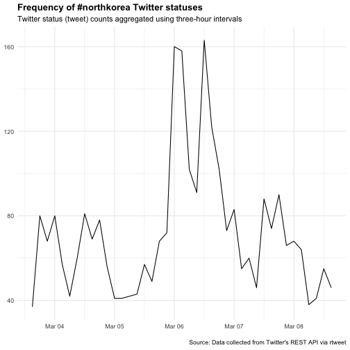
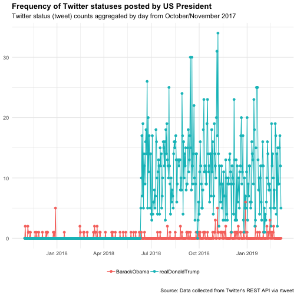

Pipelines For Data Analysis In R, part 2
========================================================
author: 曾意儒 Yi-Ju Tseng
autosize: true
font-family: 'Microsoft JhengHei'
navigation: slide

資料分析步驟
========================================================
- **資料匯入** 
- **資料清洗處理**並轉換為Tidy data
- 資料分析
- 資料呈現與視覺化

資料匯入
====================================
- 從檔案匯入
- 從網路匯入
- 從Facebook匯入
- 從Twitter匯入
- 資料匯出

從檔案匯入
====================================
type:section
- Import Dataset功能 (RStudio)
- R物件 .rds
- R程式 .R
- 純文字資料 (無分隔)
- 其他格式

Import Dataset功能 (RStudio)
====================================
選取RStudio四分割視窗右上角的Environment標籤，選擇**Import Dataset**


Import Dataset功能 (RStudio)
====================================
- 選取`From CSV`
- 點選`Browse`按鈕開啟檔案選取器


Import Dataset功能 (RStudio)
====================================
- 利用下方`Import Options`的選項微調參數
    - `Delimiter`分隔符號
    - `First Row as Names`首列是否為欄位名稱
    


Import Dataset功能 (RStudio)
====================================
type:alert
incremental:true

- 操作[範例檔案](https://raw.githubusercontent.com/CGUIM-BigDataAnalysis/BigDataCGUIM/master/104/POLIO_Incidence.csv)
- 若匯入的檔案為**tab分隔文字檔**? 該如何調整參數？

R物件 .rds
====================================
type:sub-section
如果在R程式內處理完資料後，必須儲存一份以供後續分析，使用R物件儲存是最佳的方式

- 檔案小
- 讀取快速
- 推薦使用`readRDS()`函數讀取RDS檔案
- [A better way of saving and loading objects in R](http://www.fromthebottomoftheheap.net/2012/04/01/saving-and-loading-r-objects/)

```r
dataset <- readRDS("檔案路徑與名稱")
```

R程式 .R
====================================
type:sub-section
- `source`函數
- 讀R的Obejct or script, **執行**
- **實際操作範例**
    - 有一份example.R檔在工作環境中
    - 一次執行檔案內所有R指令

```r
source("example.R") 
```

純文字資料 (無分隔)
====================================
type:sub-section
`readLines`, 逐行讀取文字資料

從網路匯入
====================================
type:section

- Open Data
- XML 可延伸標記式語言
- 網頁爬蟲 Webscraping
- API (Application programming interfaces)
- JSON格式檔案

Open Data 開放資料
====================================
type:sub-section
- 2011年推動開放政府與開放資料 ([維基百科](https://zh.wikipedia.org/wiki/%E9%96%8B%E6%94%BE%E8%B3%87%E6%96%99))
- 不受著作權、專利權，以及其他管理機制所限制，任何人都可以自由出版使用
- 常見的儲存方式為: 
    - `CSV`
    - `JSON`
    - `XML`
    
Open Data 開放資料常見平台
====================================
- [政府資料開放平台](http://data.gov.tw/)
- [Data Taipei](http://data.taipei/)
- [開放資料 x 開放桃園](http://data.tycg.gov.tw/)
- [內政資料開放平台](http://data.moi.gov.tw/)

XML 可延伸標記式語言
====================================
type:sub-section

- E**x**tensible **m**arkup **l**anguage
- 描述**結構化**資料的語言
- 處理XML檔案是網頁**Html**爬蟲的基礎
- Components
    - Markup 標記 - labels that give the text structure
    - Content 內文 - the actual text of the document
- [XML Wiki](https://zh.wikipedia.org/wiki/XML)

XML 可延伸標記式語言
====================================
Tags, elements and attributes

- Tags correspond to general labels
    - Start tags `<breakfast_menu>`, `<price>`
    - End tags `</breakfast_menu>`,`</price>`
    - Empty tags `<line-break />`
- Elements are specific examples of tags
    - `<name>Belgian Waffles</name>`
- Attributes are components of the label
    - `<book category="web">`
    
XML 可延伸標記式語言-讀取
====================================
- [臺北市水質監測資訊](http://data.taipei/opendata/datalist/datasetMeta/download?id=961ca397-4a59-45e8-b312-697f26b059dc&rid=190796c8-7c56-42e0-8068-39242b8ec927)
- 安裝`xml2` package
- `xmlParse()`函數將XML檔案匯入


```r
library(xml2)
waterURL<-"http://data.taipei/opendata/datalist/datasetMeta/download?id=961ca397-4a59-45e8-b312-697f26b059dc&rid=190796c8-7c56-42e0-8068-39242b8ec927"
waterQ <- read_xml(waterURL)
```

xpath?
====================================
- XML路徑語言（XML Path Language）
- 基於XML的樹狀結構，提供在資料結構樹中找尋節點的能力
- [維基百科](https://zh.wikipedia.org/wiki/XPath)
- [常見語法](http://tech-marsw.logdown.com/blog/2016/01/11/parsing-lxml-xpath-sheet)

XML 可延伸標記式語言-解析
====================================
使用`xml_find_all()`以及`xml_text()`函數取得指定標籤內的資料

```r
#取得所有"code_name"標籤內的資料
code_name_xml<-xml_find_all(waterQ, ".//code_name")
code_name<-xml_text(code_name_xml)
code_name[1:10]
```

```
 [1] "雙溪淨水場"               "衛理女中"                
 [3] "雙溪國小                " "華興加壓站"              
 [5] "長興淨水場"               "市政大樓"                
 [7] "市議會"                   "捷運忠孝復興站"          
 [9] "南港高工"                 "南港加壓站"              
```

XML 可延伸標記式語言-解析
====================================
使用`xml_find_all()`以及`xml_text()`函數取得指定標籤內的資料

```r
#取得各監測站的經度longitude
longitude_xml<-xml_find_all(waterQ, ".//longitude")
longitude<-xml_text(longitude_xml)
longitude[1:10]
```

```
 [1] "121.569433" "121.55231"  "121.563886" "121.544384" "121.547873"
 [6] "121.563997" "121.561975" "121.54342"  "121.607462" "121.616217"
```

XML檔案匯入練習
====================================
type:alert
incremental:true
- 載入[桃園捷運車站出入口基本資料](http://data.tycg.gov.tw/opendata/datalist/datasetMeta/download?id=b2653545-9425-46df-9a50-74ade59ab0cf&rid=f6362ce8-719b-4752-bec6-7fd995b623fd)
- 嘗試取得各站出入口敘述(LocationDescription)與經緯度(PositionLon,PositionLat)
- 參考剛剛的水站範例

```r
library(xml2)
waterURL<-"http://data.taipei/opendata/datalist/datasetMeta/download?id=961ca397-4a59-45e8-b312-697f26b059dc&rid=190796c8-7c56-42e0-8068-39242b8ec927"
waterQ <- read_xml(waterURL)
longitude_xml<-xml_find_all(waterQ, ".//longitude")
longitude<-xml_text(longitude_xml)
longitude[1:10]
```


API
====================================
type:sub-section
- 應用程式介面
- **A**pplication **P**rogramming **I**nterfaces
- 為了讓第三方的開發者可以額外開發應用程式來強化他們的產品，推出可以與系統溝通的介面
- 有API輔助可將資料擷取過程自動化
    -  以下載Open Data為例，若檔案更新頻繁，使用手動下載相當耗時
- [維基百科](https://zh.wikipedia.org/zh-tw/%E5%BA%94%E7%94%A8%E7%A8%8B%E5%BA%8F%E6%8E%A5%E5%8F%A3)

API - Open Data
====================================
- [桃園公共自行車即時服務資料](http://data.tycg.gov.tw/opendata/datalist/datasetMeta?oid=5ca2bfc7-9ace-4719-88ae-4034b9a5a55c)資料
- 每日更新
- 不可能每日手動下載
- 提供透過**API**下載的服務
- 透過API下載的資料格式: **JSON格式**

***

- [桃園公共自行車即時服務資料API資訊](http://data.tycg.gov.tw/opendata/datalist/datasetMeta/outboundDesc?id=5ca2bfc7-9ace-4719-88ae-4034b9a5a55c&rid=a1b4714b-3b75-4ff8-a8f2-cc377e4eaa0f)
    - **資料集ID**: 紀錄資料的基本參數，如包含欄位、更新頻率等
    - **資料RID**: 資料集
    - 擷取範例


JSON格式檔案
====================================
type:sub-section

- JSON (**J**ava**s**cript **O**bject **N**otation)
- 輕量級的資料交換語言
- From **a**pplication **p**rogramming **i**nterfaces (APIs)
- JavaScript、Java、Node.js應用
- 一些NoSQL資料庫用JSON儲存資料：**MongoDB**
- [Wiki](http://en.wikipedia.org/wiki/JSON)


JSON檔案匯入
====================================
- `jsonlite` package (套件使用前必須安裝)
- `fromJSON()`函數載入JSON資料
- 如果API網址為**https**，則需使用 `httr` package
    - 使用`GET()`函數處理資料擷取網址
- API網址參考[桃園公共自行車即時服務資料API資訊](http://data.tycg.gov.tw/opendata/datalist/datasetMeta/outboundDesc?id=5ca2bfc7-9ace-4719-88ae-4034b9a5a55c&rid=a1b4714b-3b75-4ff8-a8f2-cc377e4eaa0f)

```r
library(jsonlite)
library(RCurl)
APIData<-fromJSON("http://data.tycg.gov.tw/api/v1/rest/datastore/a1b4714b-3b75-4ff8-a8f2-cc377e4eaa0f?format=json")
```

JSON檔案匯入
====================================
- 轉存為`列表list`的型態
- 兩個子元素(success, result)
- result中records子元素的類別為資料框data.frame

```r
str(APIData)
```

```
List of 2
 $ success: logi TRUE
 $ result :List of 6
  ..$ resource_id: chr "a1b4714b-3b75-4ff8-a8f2-cc377e4eaa0f"
  ..$ fields     :'data.frame':	15 obs. of  2 variables:
  .. ..$ type: chr [1:15] "int4" "text" "text" "text" ...
  .. ..$ id  : chr [1:15] "_id" "sno" "sna" "tot" ...
  ..$ records    :'data.frame':	100 obs. of  15 variables:
  .. ..$ _id    : int [1:100] 1 2 3 4 5 6 7 8 9 10 ...
  .. ..$ sarea  : chr [1:100] "中壢區" "中壢區" "中壢區" "中壢區" ...
  .. ..$ sareaen: chr [1:100] "Zhongli Dist." "Zhongli Dist." "Zhongli Dist." "Zhongli Dist." ...
  .. ..$ sna    : chr [1:100] "中央大學圖書館" "中壢高中" "中正公園(中美路)" "中壢火車站(前站)" ...
  .. ..$ aren   : chr [1:100] "No.300, Zhongda Rd." "No.215, Sec. 2, Zhongyang W. Rd. (opposite)" "No.101 to No.113, Zhongmei Rd. (opposite)" "No.139, Zhonghe Rd. (opposite)" ...
  .. ..$ sno    : chr [1:100] "2001" "2002" "2003" "2004" ...
  .. ..$ tot    : chr [1:100] "60" "52" "54" "114" ...
  .. ..$ snaen  : chr [1:100] "National Central University Library" "Jhungli Senior High School" "Zhongzheng Park" "TRA Zhongli Station (Front)" ...
  .. ..$ bemp   : chr [1:100] "50" "29" "28" "84" ...
  .. ..$ ar     : chr [1:100] "中大路300號(中央大學校內圖書館前)" "中央西路二段215號對面人行道" "中美路101號-113號對面人行道" "中和路139號對面圓環" ...
  .. ..$ act    : chr [1:100] "1" "1" "1" "1" ...
  .. ..$ lat    : chr [1:100] "24.968128" "24.960815" "24.959113" "24.953874" ...
  .. ..$ lng    : chr [1:100] "121.194666" "121.212038" "121.224805" "121.2256" ...
  .. ..$ sbi    : chr [1:100] "9" "22" "26" "26" ...
  .. ..$ mday   : chr [1:100] "20190309005319" "20190309005318" "20190309005330" "20190309005316" ...
  ..$ offset     : int 0
  ..$ total      : int 284
  ..$ limit      : int 100
```

JSON檔案解析
====================================
- 使用`$`符號截取元素與子元素

```r
head(APIData$result$records)
```

| _id|sarea  |sareaen       |sna              |aren                                             |sno  |tot |snaen                                    |bemp |
|---:|:------|:-------------|:----------------|:------------------------------------------------|:----|:---|:----------------------------------------|:----|
|   1|中壢區 |Zhongli Dist. |中央大學圖書館   |No.300, Zhongda Rd.                              |2001 |60  |National Central University Library      |50   |
|   2|中壢區 |Zhongli Dist. |中壢高中         |No.215, Sec. 2, Zhongyang W. Rd. (opposite)      |2002 |52  |Jhungli Senior High School               |29   |
|   3|中壢區 |Zhongli Dist. |中正公園(中美路) |No.101 to No.113, Zhongmei Rd. (opposite)        |2003 |54  |Zhongzheng Park                          |28   |
|   4|中壢區 |Zhongli Dist. |中壢火車站(前站) |No.139, Zhonghe Rd. (opposite)                   |2004 |114 |TRA Zhongli Station (Front)              |84   |
|   5|中壢區 |Zhongli Dist. |中原大學         |No.200, Zhongbei Rd.                             |2005 |82  |Chung Yuan Christian University          |38   |
|   6|中壢區 |Zhongli Dist. |銀河廣場         |No.48, Jiuhe 1st St. (opposite)                  |2006 |58  |Galaxy Square                            |26   |
|   7|中壢區 |Zhongli Dist. |中壢區公所       |No.380, Huanbei Rd.                              |2007 |40  |Civil Affairs Office of Zhongli District |25   |
|   8|中壢區 |Zhongli Dist. |新明橋           |No.269 to No.373, Sec. 2, Yuanhua Rd. (opposite) |2008 |58  |Xinming Bridge                           |30   |

JSON檔案解析
====================================
分析各項**地區**車站數

```r
table(APIData$result$records$sarea)
```

|Var1   | Freq|
|:------|----:|
|中壢區 |   35|
|八德區 |    5|
|大園區 |    2|
|大溪區 |    2|
|平鎮區 |    7|
|桃園區 |   32|
|蘆竹區 |    7|
|龜山區 |   10|
分析可知中壢區車站較多


JSON檔案匯入練習
====================================
type:alert
incremental:true

- 練習用資料：[「臺北市今日施工資訊」API存取](http://data.taipei/opendata/datalist/datasetMeta/outboundDesc?id=4d29818c-a3ee-425d-b88a-22ac0c24c712&rid=201d8ae8-dffc-4d17-ae1f-e58d8a95b162)
- 使用檔案匯入**範例**，將資料匯入R中
    - 提示：**fromJSON**
- 使用str()函數觀察匯入的資料
- 請問今日施工資料有幾筆觀察值？幾個欄位？


網頁爬蟲 Webscraping
====================================
type:sub-section

- 不是每個網站都提供API
- 人工複製貼上?!
- 程式化的方式擷取網頁資料: **網頁爬蟲（Webscraping）**（[Webscraping Wiki](http://en.wikipedia.org/wiki/Web_scraping)）
- 可能耗費很多網頁流量和資源 －很可能被鎖IP
- 在R的處理辦法
    - 當作XML檔案處理分析
    - 使用`rvest` package輔助

網頁爬蟲 Webscraping-rvest
====================================

載入[rvest](https://github.com/hadley/rvest)套件後，經由以下步驟進行網站解析：

- 使用`read_html(“欲擷取的網站網址”)`函數讀取網頁
- 使用`html_nodes()`函數擷取所需內容 (條件為CSS或xpath標籤)
- 使用`html_text()`函數處理/清洗擷取內容，留下需要的資料
- 使用`html_attr()`函數擷取資料參數（如連結url）

網頁爬蟲 Webscraping-rvest
====================================

```r
library(rvest) ##載入
Repoterurl<-"https://www.twreporter.org/"
Repoterhtml<-read_html(Repoterurl)
news_title <- Repoterhtml %>% 
    html_nodes(".iEENPo") %>% html_text()
news_url <- Repoterhtml %>% 
    html_nodes(".hsSyKH a") %>% html_attr("href")
news <- data.frame(title = news_title, url=news_url)
head(news,2)
```

```
                                                       title
1     黃偉翔／陷在招收外生和剝削學工之間，新南向專班錯在哪？
2 在控制中復興，在復興中打壓──普立茲獎得主張彥談中國宗教治理
                                                                      url
1     /a/opinion-new-southbound-talent-development-program-intern-problem
2 /a/interview-ian-johnson-the-soul-of-china-return-of-religion-after-mao
```


網頁爬蟲 Webscraping-rvest
====================================
- 擷取條件的撰寫會因網頁語法不同而有差異
- 使用**Google Chrome開發工具**輔助觀察擷取資料的條件
    - 或使用**SelectorGadget**輔助
    - 或使用**xpath-helper**輔助xpath標籤的擷取
- 觀察需要擷取的資料所在HTML片段
    - css class為`latest-section__ItemFrame-keac6x-1 hsSyKH`

```
<div class="latest-section__ItemFrame-keac6x-1 hsSyKH"><a href="/a/opinion-new-southbound-talent-development-program-intern-problem"><div class="hover-effect__HoverEffect-sc-10n0hry-0 iRkkRY"><div class="latest-section__ImageFrame-keac6x-2 dyFjYc"><div class="img-wrapper__ImgObjectFit-clvi31-0 cprQrJ"></div></div><div class="latest-section__ContentFrame-keac6x-3 nhxeb">
....
```

網頁爬蟲 DCard實作 -1
====================================

```r
library(rvest) ##(爬蟲結果不代表本人意見)
DCardCGU<-"https://www.dcard.tw/f/cgu"
DCardContent<-read_html(DCardCGU)
post_title <- DCardContent %>% 
    html_nodes(".PostEntry_title_H5o4dj") %>% 
    html_text()
post_contentShort<- DCardContent %>% 
    html_nodes(".PostEntry_excerpt_2eHlNn") %>% 
    html_text()
post_author<- DCardContent %>% 
    html_nodes(".PostAuthor_root_3vAJfe") %>% 
    html_text()
```

網頁爬蟲 DCard實作 -2
====================================

```r
##(爬蟲結果不代表本人意見)
post_like<- DCardContent %>% 
    html_nodes(".hlvyVg") %>% html_text()
post_url <- DCardContent %>% 
    html_nodes(".PostEntry_root_V6g0rd") %>% html_attr("href")
DCardCGU_posts <- 
    data.frame(title = post_title,
               author=post_author, 
               content=post_contentShort, 
               likeN=post_like,
               url=paste0("https://www.dcard.tw",post_url))
```

網頁爬蟲 DCard實作 -3
====================================

```r
DCardCGU_posts
```

|title                                                 |author          |content                                                                                                                                                                                                                                        |likeN |url                                                                                          |
|:-----------------------------------------------------|:---------------|:----------------------------------------------------------------------------------------------------------------------------------------------------------------------------------------------------------------------------------------------|:-----|:--------------------------------------------------------------------------------------------|
|是誰掉了排氣管                                        |長庚大學        |哪個施主捨我一根排氣管及一頂安全帽，不是我的喔，失主請自行到停車場後面找，不幫你送學務處  請見諒，慶幸不是見到自己的排氣管...，淦  垃圾不要亂丟，會刮到別人的車子                                                                              |15    |https://www.dcard.tw/f/cgu/p/230841097-是誰掉了排氣管                                        |
|烘焙週預購~3/10號收單                                 |長庚大學        |大家知道3/11~3/15是什麼日子嗎？？沒錯！就是烘焙週拉！！，還記得上次可口的烤布蕾~提拉米蘇嗎！？這次烘焙社的同學們這次又要帶給大家其他好吃的甜點拉！上次因為價格卻步的同學這次千萬不要再錯過拉！                                                 |15    |https://www.dcard.tw/f/cgu/p/230840149-烘焙週預購~3／10號收單                                |
|💓《大明星學堂-小煜》生命教育講座暨白色情人節特別活動💓 |長庚大學        |各位同學大家好～我們是榮耀團契社！，下星期就是白色情人節啦！！，大家準備跟你們心愛的人一起慶祝了嗎><，下星期四的情人節夜晚，我們會邀請棒棒堂的小煜到場，分享他在演藝圈的心得故事，與大家度過溫暖的情人節唷🤗                                    |14    |https://www.dcard.tw/f/cgu/p/230837127-💓《大明星學堂-小煜》生命教育講座暨白色情人節特別活動💓 |
|TED 年會                                              |長庚大學        |想問一下，今年還有TEDxCGU嘛，好像沒看到消息🤔                                                                                                                                                                                                   |11    |https://www.dcard.tw/f/cgu/p/230837080-TED-年會                                              |
|餿掉的販賣機巧克力拿鐵？                              |長庚大學        |有人也遇過一樣的問題嗎嗎嗎嗎嗎嗎嗎？？？？？                                                                                                                                                                                                   |10    |https://www.dcard.tw/f/cgu/p/230833943-餿掉的販賣機巧克力拿鐵？                              |
|湖水綠手機殼的手機                                    |長庚大學        |同學你的手機在管院B0108，面對黑板，從左邊數來第四排第三個位子，的抽屜哦，我也不知道要拿去哪裡 就沒動它了，希望你去的時候它還在哈哈哈                                                                                                           |7     |https://www.dcard.tw/f/cgu/p/230839196-湖水綠手機殼的手機                                    |
|同學你的錢包                                          |長庚大學        |在國會開院會，拾獲一個錢包，明天我同學會拿去學務處放，記得取ㄛ                                                                                                                                                                                 |7     |https://www.dcard.tw/f/cgu/p/230834429-同學你的錢包                                          |
|尋找失物 約5cm的皮卡丘娃娃                            |長庚大學        |大約五公分的皮卡丘娃娃，因為看起來髒髒的怕被認為是垃圾qwq，3/7~3/8在校園內遺失的（｡•́ωก̀｡）…ｸﾞｽ，希望有看到的人能將它帶到失物招領那邊，我很努力祈禱將它帶到學務處失物那邊的人這學期歐趴的٩（ ‘ω’ ）                                              |3     |https://www.dcard.tw/f/cgu/p/230842776-尋找失物-約5cm的皮卡丘娃娃                            |
|（歹罷狼X學生會）幸福路上放映加演講                   |長庚大學        |幸福這條路，踏上ㄌ，跪著也要走完。－改寫自PeterSu，今天是3月8日婦女節，你聽過林淑琪這位女孩嗎？《幸福路上》描繪一位台灣女孩林淑琪的成長故事，也是說著一段台灣的歷史。「那個當初的我現在好嗎？」                                                |2     |https://www.dcard.tw/f/cgu/p/230842884-（歹罷狼X學生會）幸福路上放映加演講                   |
|想請問工商系的大大                                    |長庚大學        |你們有一門課每次上課都要穿西裝那是神麼課啊🤔🤣？？？                                                                                                                                                                                             |2     |https://www.dcard.tw/f/cgu/p/230842105-想請問工商系的大大                                    |
|想請問化材系的同學                                    |長庚大學        |請問有人修過劉繼賢老師開的奈米生醫技術嗎？                                                                                                                                                                                                     |3     |https://www.dcard.tw/f/cgu/p/230832306-想請問化材系的同學                                    |
|萊爾富無法送貨                                        |長庚大學        |長庚萊爾富是不是不能取貨了，求解                                                                                                                                                                                                               |3     |https://www.dcard.tw/f/cgu/p/230832299-萊爾富無法送貨                                        |
|返鄉專車                                              |長庚大學        |科大那邊有開返鄉專車哦！，清明節想回家的同學，快點去報名吧！，報名到明天截止～返鄉專車報名進入最後一個星期，目前各車報名狀況，台中火車站 餘21人發車，彰化火車站 餘7人發車 快發車了，台南火車站 餘24人發車                                      |15    |https://www.dcard.tw/f/cgu/p/230832142-返鄉專車                                              |
|吵死了                                                |長庚大學        |明德七樓走廊在吵屁？？不用睡覺哦吵死了                                                                                                                                                                                                         |5     |https://www.dcard.tw/f/cgu/p/230830088-吵死了                                                |
|075-NEZ                                               |長庚大學        |同學 沒戴安全帽已經被拍下來檢舉囉，爽，又抓到一個                                                                                                                                                                                              |36    |https://www.dcard.tw/f/cgu/p/230828876-075-NEZ                                               |
|大一學弟，拜託先不要                                  |長庚大學        |身為住在明德的老人，真心希望明德樓的學弟們可以在等電梯的時候離門遠一點，拜託裡面的人都還沒出來你也上不去啊...，每次都要貼著門，等到開門看到裡面有人才讓開，拜託不要這樣，蠻困擾的，（而且不是單一個案，遇到好多次了）                          |26    |https://www.dcard.tw/f/cgu/p/230828825-大一學弟，拜託先不要                                  |
|求租套房推薦#長庚醫院#A8捷運站#華亞科學園區           |長庚大學        |大家好，最近畢業在林口找到工作想要在附近租房子，殊不知林口租房的網路資訊真的少的可憐，所以想上來詢問版友們有沒有推薦的租屋資訊可以讓我參考，拜託大家了                                                                                         |7     |https://www.dcard.tw/f/cgu/p/230826850-求租套房推薦＃長庚醫院＃A8捷運站＃華亞科學園區        |
|一醫靠二醫廁所的女生                                  |長庚大學        |可以請妳們安靜一點嗎，一直雅純的喊 教授在上課你們知道嗎，身材很壯的那個女生就是在說你們，有點功德心                                                                                                                                            |12    |https://www.dcard.tw/f/cgu/p/230825754-一醫靠二醫廁所的女生                                  |
|男朋友                                                |長庚大學        |最近身邊的朋友都一個個交到男朋友，要如何才能交到理想的男友勒？                                                                                                                                                                                 |24    |https://www.dcard.tw/f/cgu/p/230822815-男朋友                                                |
|男朋友                                                |長庚大學        |最近身邊的朋友都一個個交到男朋友，要如何才能交到理想的男友勒？                                                                                                                                                                                 |6     |https://www.dcard.tw/f/cgu/p/230822813-男朋友                                                |
|點名 曠課                                             |長庚大學        |上星期為了早點回家翹了課，不巧遇上老師點名。想請問一下老師記曠課在網路上顯示出來大概要多久？因為看了好幾次都沒顯示，不確定到底要不要請假還是老師記自己扣分的。同學是說老師直接在校務資訊系統上登記曠課，我的網頁看起來是這樣的                 |5     |https://www.dcard.tw/f/cgu/p/230822646-點名-曠課                                             |
|大奶子傳奇                                            |長庚大學        |剛剛在院區，對面走過來一群人，其中一個就指著對面的大苑子，大喊，大奶子大奶子大奶子~，其他人也跟著起鬨，都不知道現在長庚學生素質那麼低誒🤨                                                                                                       |43    |https://www.dcard.tw/f/cgu/p/230821401-大奶子傳奇                                            |
|理性                                                  |長庚大學        |首先聲明，我非常喜歡現在的學生會氣氛。我知道這裡是匿名發言，所以等等底下一定會有一堆不理性發言，理性者迴避即可。礙於我的身分我不便直接密粉專或留言，所以用這種最不應該的匿名方式，請見諒。po文目的只是想要學生會能看見，不是要大家筆戰傷感情。 |31    |https://www.dcard.tw/f/cgu/p/230820941-理性                                                  |
|你的學生證                                            |長庚大學 醫學系 |你掉了你的學生證，但我沒空幫你拿去學務處，請自行領回                                                                                                                                                                                           |9     |https://www.dcard.tw/f/cgu/p/230820786-你的學生證                                            |
|通識加簽問題                                          |長庚大學        |乳題，我記得以前通識是可以加簽的，現在聽說不給加簽？！，甚至是如果選課人數未達上限也不給過是嗎，有沒有八卦呀，祭品嘛，附上一隻喵喵                                                                                                             |7     |https://www.dcard.tw/f/cgu/p/230820366-通識加簽問題                                          |
|人在做天在看                                          |長庚大學        |素質這麼低還想騎車出去啊，有沒有摩托車剛好被鎖的掛                                                                                                                                                                                             |25    |https://www.dcard.tw/f/cgu/p/230819860-人在做天在看                                          |
|為什麼學校收信都收那麼久？                            |長庚大學        |呃...如題，為什麼學校每次收到信的時間都比同樣寄出時間不過是寄家裡的還要多至少一個禮拜呢？確定我沒有填宿舍也不是掛號也不是包裹，我固定填：333桃園市龜山區文化一路259號，舉例：同樣2/22從中壢寄出的成績單                                        |4     |https://www.dcard.tw/f/cgu/p/230819457-為什麼學校收信都收那麼久？                            |
|出國讀研                                              |長庚大學        |想請問一下大家，長庚工學院的科系去外國讀研究所的人多嗎？會不會很難申請？我去網路上找基本上都只看到交換學生的心得，然後如果覺得這是伸手文的話很抱歉，但是如果大家知道一些資訊然後願意分享的話我很感激，謝謝                                     |4     |https://www.dcard.tw/f/cgu/p/230819446-出國讀研                                              |
|有人遺失學生證                                        |長庚大學        |請認識他的鄉親父老兄弟姐妹們，提醒他學生證我已拿到教務處                                                                                                                                                                                       |1     |https://www.dcard.tw/f/cgu/p/230819048-有人遺失學生證                                        |
|協尋手機                                              |長庚大學        |如標題  我朋友的手機掉在院區，找不到求如果有好心人撿到，請打這隻手機  0963973209，手機是i6，背殼圖案是上圖黃色的背殼，拜託大家                                                                                                                 |8     |https://www.dcard.tw/f/cgu/p/230818287-協尋手機                                              |
|明德五樓的大棒棒 拜託還我褲子吧                       |長庚大學        |小弟3/4大約凌晨十二點多烘完衣服（右邊那台），一件levis淡藍色的牛仔褲就不見了，拜託那個善心人士把褲子還給我，非常感謝你幫我把衣服拿出來，但你收的費用也太貴了吧                                                                                 |18    |https://www.dcard.tw/f/cgu/p/230813931-明德五樓的大棒棒-拜託還我褲子吧                       |
|線上簽核系統                                          |長庚大學        |因為系上的課程調動所以要另外借教室，可是在系統要選日期的時候都顯示不開放借用，已經確認該日期該時段為空堂了（T＿T），日期也確實是借用日兩天之後，到底是哪裡出問題                                                                               |2     |https://www.dcard.tw/f/cgu/p/230811188-線上簽核系統                                          |
|成績單電子版                                          |長庚大學        |請問學校的成績單可以申請電子版的嗎？還是一定要自己掃描到電腦？                                                                                                                                                                                 |5     |https://www.dcard.tw/f/cgu/p/230809659-成績單電子版                                          |
|同學你的機車鑰匙                                      |長庚大學        |同學你的機車鑰匙沒拔 幫你拔起來放在前面囉（而且還開著電                                                                                                                                                                                        |7     |https://www.dcard.tw/f/cgu/p/230807949-同學你的機車鑰匙                                      |
|請益 陳世忠 溝通技巧與領導統御                        |長庚大學        |星期五才加選到陳世忠老師的溝通技巧，請問各位有修課的同學，前兩個禮拜有什麼上課注意事項或是要買課本做作業分組之類的嗎？祝好心人期末歐趴ʕ•ﻌ•ʔ                                                                                                    |9     |https://www.dcard.tw/f/cgu/p/230806270-請益-陳世忠-溝通技巧與領導統御                        |
|666                                                   |長庚大學        |同學 原來長庚的霧這麼大 傻傻分不清楚                                                                                                                                                                                                           |33    |https://www.dcard.tw/f/cgu/p/230805443-666                                                   |
|為什麼校車都要等超久？                                |長庚大學        |如題 至少半小時是基本 有時候直接等了快一小時都沒車 司機是去吃飯了嗎？                                                                                                                                                                          |19    |https://www.dcard.tw/f/cgu/p/230798848-為什麼校車都要等超久？                                |
|有蛇注意                                              |長庚大學        |早上路過據德球場旁斜坡，大家走路小心注意腳邊                                                                                                                                                                                                   |50    |https://www.dcard.tw/f/cgu/p/230796900-有蛇注意                                              |
|跟大學同學都該聊些什麼                                |長庚大學        |高中時總是特別憧憬大學生活，認為能擁有許多自由，想請問大家在學校都跟大學同學聊些什麼？                                                                                                                                                         |20    |https://www.dcard.tw/f/cgu/p/230794540-跟大學同學都該聊些什麼                                |
|選課快要結束了啊啊啊                                  |長庚大學        |大家可以去看一下課表，確保有忘記推掉的課唷！不然要等期中才能停修囉（像我上次一樣，且只能停一科，還要維持最低大三以下12學分），第十週期中停修後：1.下學期不能超修25學分，2.也不能領當學期的獎學金                                               |23    |https://www.dcard.tw/f/cgu/p/230792348-選課快要結束了啊啊啊                                  |

    
爬蟲練習
====================================
type:alert

- [Ptt Tech_Job 版](https://www.ptt.cc/bbs/Tech_Job/index.html)
- 試著爬出所有**標題**
- 爬出的第三個標題是？


網頁爬蟲 再想想？
====================================
incremental:true

- 如何爬評論跟內文呢？
- 其實...DCard是有API的
    - https://www.dcard.tw/_api/forums/cgu/posts
    - https://www.dcard.tw/_api/posts/225917717
    - https://www.dcard.tw/_api/posts/225917717/comments
- 隱私問題 （OkCupid事件）
    - [70,000 OkCupid Users Just Had Their Data Published](https://motherboard.vice.com/en_us/article/70000-okcupid-users-just-had-their-data-published)

進階爬蟲
====================================
- CSS Selector 語法介紹 [參考資料](https://www.w3schools.com/cssref/css_selectors.asp)
    - **.**xxx：select elements with class="xxx"
    - **#**xxx：select elements with id="xxx"
    - **[**yyy**]**：select elements with attribute yyy
    - **[**yyy=zzz**]**：select elements with attribute yyy="zzz"
    
- 瀑布式網頁爬蟲
    - 觀察Google Chrome 開發者工具，在Network內找到api呼叫方式
    - 搭配使用RSelenium 模擬瀏覽狀態 [DCard實作R Code](https://github.com/CGUIM-BigDataAnalysis/BigDataCGUIM/blob/master/105/RSelenium_rvest.md)


其他爬蟲相關參考資源
====================================
- [網路爬蟲實作 - 用 r 語言打造自己的爬蟲程式](https://www.slideshare.net/secret/mdfHLPgvIW1kPR)
- [rvest GitHub](https://github.com/hadley/rvest)
- R Bloggers 有很多[爬蟲範例](http://www.r-bloggers.com/?s=Web+Scraping)（英文）
- [Ptt爬蟲實作](http://bryannotes.blogspot.tw/2014/08/r-ptt-wantedsocial-network-analysis.html)
- [大數學堂 網頁爬蟲課程](http://www.largitdata.com/course_list/1)


從Facebook匯入
====================================
type:section
- Graph API in R
- Rfacebook package

Graph API in R
====================================
type:sub-section

- 在2018年的風波後，Graph API若要用在爬取公開粉專，須經過FB審核
- [Graph API](https://developers.facebook.com/docs/graph-api?locale=zh_TW)
    - 根據篩選條件，回傳JSON格式的資料
- [Graph API Explorer](https://developers.facebook.com/tools/explorer/)
    - 測試資料撈取方法和結果
- 必須要取得自己的**access token** (存取權杖)
    - 可在[Graph API Explorer](https://developers.facebook.com/tools/explorer/)視窗右上角的**Get Token**按鈕取得
    - [官方文件](https://developers.facebook.com/docs/facebook-login/access-tokens/?locale=zh_TW)


Rfacebook package
====================================
type:sub-section
在2018年的風波後，Graph API若要用在爬取公開粉專，須經過FB審核，因此本課程目前無法示範粉絲專頁爬取

使用 Rfacebook 取得 `tsaiingwen` 粉絲頁的資料

```r
library(Rfacebook) #初次使用須先安裝
token<-"your token" #將token複製到此處
getPage("tsaiingwen", token,n = 5)
```
若經過審核，可得下列結果

```
4 posts       from_id           from_name
1 46251501064 蔡英文 Tsai Ing-wen
2 46251501064 蔡英文 Tsai Ing-wen
3 46251501064 蔡英文 Tsai Ing-wen
4 46251501064 蔡英文 Tsai Ing-wen
```

從Twitter匯入
====================================
type:section
- Twitter API
- rtweet package

Twitter API
====================================
- https://developer.twitter.com/en/apps
- 需有Twitter帳號並通過開發者審核

rtweet package
====================================

```r
## install rtweet from CRAN
install.packages("rtweet")
## load rtweet package
library(rtweet)
```

rtweet package - token 設定
====================================

```r
library(rtweet)
create_token(
  app = "teach0309",
  consumer_key = "Wbba6ysyPKGstGAqohmtyWZOE",
  consumer_secret = "GJweDzVvXGrbjz26bHTr3d6dFI7q9gFCH98f3Ct2yk3APPWigc",
  access_token = "216362944-VbXiYOjGtENwSI6eJ9AoDK5OVvoQWlj7yIeXraGt",
  access_secret = "jnfDCvuMdxdmxswUUPPi3gomxIWZq3BTdumykLJb7GW5A")
```

```
<Token>
<oauth_endpoint>
 request:   https://api.twitter.com/oauth/request_token
 authorize: https://api.twitter.com/oauth/authenticate
 access:    https://api.twitter.com/oauth/access_token
<oauth_app> teach0309
  key:    Wbba6ysyPKGstGAqohmtyWZOE
  secret: <hidden>
<credentials> oauth_token, oauth_token_secret
---
```

rtweet package - 搜尋hashtag
====================================

```r
## search for 3000 tweets using the northkorea hashtag
rt <- search_tweets(
  "#northkorea", n = 3000, include_rts = FALSE
)
head(rt)
```

|user_id    |status_id           |created_at          |screen_name     |
|:----------|:-------------------|:-------------------|:---------------|
|22697810   |1104073627983597568 |2019-03-08 17:37:20 |StimsonCenter   |
|1279628114 |1104073183668260864 |2019-03-08 17:35:34 |Cluelessoracle  |
|1279628114 |1103381604288716800 |2019-03-06 19:47:28 |Cluelessoracle  |
|2845987205 |1104073079951630337 |2019-03-08 17:35:09 |IamJPHogan      |
|14375047   |1103435321562284033 |2019-03-06 23:20:56 |davidbrunnstrom |
|14375047   |1102767558875324416 |2019-03-05 03:07:29 |davidbrunnstrom |

rtweet package - 搜尋hashtag
====================================


rtweet package - 取得趨勢
====================================

```r
sf <- get_trends("Japan")
head(sf)
```

|trend  |url                                                     |promoted_content |query                       |
|:------|:-------------------------------------------------------|:----------------|:---------------------------|
|震度3  |http://twitter.com/search?q=%E9%9C%87%E5%BA%A63         |NA               |%E9%9C%87%E5%BA%A63         |
|カメラ |http://twitter.com/search?q=%E3%82%AB%E3%83%A1%E3%83%A9 |NA               |%E3%82%AB%E3%83%A1%E3%83%A9 |
|震度4  |http://twitter.com/search?q=%E9%9C%87%E5%BA%A64         |NA               |%E9%9C%87%E5%BA%A64         |
|震度2  |http://twitter.com/search?q=%E9%9C%87%E5%BA%A62         |NA               |%E9%9C%87%E5%BA%A62         |

rtweet package - 取得timeline
====================================

```r
tmls <- get_timelines(c("realDonaldTrump", "BarackObama"), n = 3000)
head(tmls)
```

|user_id  |screen_name     |text                                                                                                                                                                                                                                                                                    |source             |
|:--------|:---------------|:---------------------------------------------------------------------------------------------------------------------------------------------------------------------------------------------------------------------------------------------------------------------------------------|:------------------|
|25073877 |realDonaldTrump |Bad lawyer and fraudster Michael Cohen said under sworn testimony that he never asked for a Pardon. His lawyers totally contradicted him. He lied! Additionally, he directly asked me for a pardon. I said NO. He lied again! He also badly wanted to work at the White House. He lied! |Twitter for iPhone |
|25073877 |realDonaldTrump |Heading now to the Great State of Alabama!                                                                                                                                                                                                                                              |Twitter for iPhone |
|25073877 |realDonaldTrump |On International Women’s Day, we honor women worldwide for their vital role in shaping and strengthening our communities, families, governments, and businesses...https://t.co/VVnkuBPmhA                                                                                               |Twitter for iPhone |
|25073877 |realDonaldTrump |Women’s unemployment rate is down to 3.6% - was 7.9% in January, 2011. Things are looking good!                                                                                                                                                                                         |Twitter for iPhone |
|25073877 |realDonaldTrump |We are apprehending record numbers of illegal immigrants - but we need the Wall to help our great Border Patrol Agents!                                                                                                                                                                 |Twitter for iPhone |
|25073877 |realDonaldTrump |“This is as good a time as I can remember to be an American Worker. We have the strongest economy in the world.”  Stuart Varney @foxandfriends  So true!                                                                                                                                |Twitter for iPhone |

rtweet package - 取得timeline
====================================



rtweet package - 取得followers
====================================

```r
## get user IDs of accounts following 蔡英文 Tsai Ing-wen
iingwen_flw <- get_followers("iingwen", n = 1000)
## lookup data on those accounts
iingwen_flw_data <- lookup_users(iingwen_flw$user_id)
head(iingwen_flw_data)
```


rtweet package練習
====================================
type:alert
incremental:true
- 複製老師的Twitter access token
- 使用rtweet package取得**蔡英文 Tsai Ing-wen**(iingwen)的timeline，共50筆tweets
- 第一筆資料的retweet_count是多少?
- 第二筆資料的favorite_count是多少?


資料匯出
====================================
type:section
- 文字檔 .txt
- CSV檔 .csv
- R物件 .rds


文字檔 .txt write.table()
====================================
type:sub-section


```r
write.table(iris,file="iris.txt",sep=",",
            row.names = F,col.names = T)
```
- 要匯出的資料
- `file` 檔案名稱
- `append` T/F T:在檔案後加字，F:直接覆蓋檔案 (預設F)
- `quote` 是否需要用雙引號將字串包起 (預設T)
- `sep` 分隔符號 (預設空白)
- `row.names` T/F 是否需要輸出row names
- `col.names` T/F 是否需要輸出column names
- `fileEncoding` 編碼設定


CSV檔 .csv
====================================
type:sub-section

與`write.table()`類似，使用`write.csv()`函數寫入檔案

```r
write.csv(iris,file="iris.csv",row.names = F)
```

R物件 .rds
====================================
type:sub-section

若是要在R的環境繼續使用，建議匯出成R物件檔案(.rds)

```r
saveRDS(iris,"iris.rds")
```


資料清洗與處理
====================================
- Tidy Data
- 資料型別轉換處理
- 文字字串處理
- 子集Subset
- 排序
- 資料組合
- 長表與寬表

Tidy Data
====================================
type:sub-section 

Each column is a variable. Each row is an observation.

- 一個欄位（Column）內只有一個數值，最好要有凡人看得懂的Column Name
- 不同的觀察值應該要在不同行（Row）
- 一張表裡面，有所有分析需要的資料
- 如果一定要多張表，中間一定要有index可以把表串起來
- One file, one table

資料型別轉換處理
====================================
type:sub-section 
包括**資料型別檢查**與**資料型別轉換**

資料型別:

- 數值 (numeric)
- 字串 (character)
- 布林變數 (logic)
- 日期 (Date)


資料型別檢查 - is.
====================================
使用`is.`函數檢查資料型別，回傳布林變數，若為**真**，回傳**TRUE**

- 是否為**數字** `is.numeric(變數名稱)`
- 是否為**文字** `is.character(變數名稱)`
- 是否為**布林變數** `is.logical(變數名稱)`


```r
num<-100
is.numeric(num)
```

```
[1] TRUE
```

```r
is.character(num)
```

```
[1] FALSE
```

資料型別檢查 - class()
====================================
使用`class(變數名稱)`函數，直接回傳**資料型別**

```r
class(num)
```

```
[1] "numeric"
```

```r
class(Sys.Date())
```

```
[1] "Date"
```


資料型別轉換 - as.
====================================

使用`as.`函數轉換型別

- 轉換為**數字** `as.numeric(變數名稱)`
- 轉換為**文字** `as.character(變數名稱)`
- 轉換為**布林變數** `as.logical(變數名稱)`


```r
cha<-"100"
as.numeric(cha)
```

```
[1] 100
```

資料型別轉換 - as.
====================================

若無法順利完成轉換，會回傳空值`NA`，並出現警告訊息

```r
as.numeric("abc")
```

```
[1] NA
```


資料型別轉換練習
====================================
type:alert
incremental:true
回想起DCard(爬蟲結果不代表本人意見)的資料．．．

```r
library(rvest) ##載入
DCardCGU<-"https://www.dcard.tw/f/cgu"
DCardContent<-read_html(DCardCGU)
post_title <- DCardContent %>% 
    html_nodes(".PostEntry_title_H5o4dj") %>% 
    html_text()
post_author<- DCardContent %>% 
    html_nodes(".PostAuthor_root_3vAJfe") %>% 
    html_text()
post_like<- DCardContent %>% 
    html_nodes(".hlvyVg") %>% html_text()
post_url <- DCardContent %>% 
    html_nodes(".PostEntry_root_V6g0rd") %>% html_attr("href")
DCardCGU_posts <- 
    data.frame(title = post_title,
               author=post_author, 
               likeN=post_like,
               url=paste0("https://www.dcard.tw",post_url),
               stringsAsFactors=F)
```

資料型別轉換練習
====================================
type:alert
評論數和按讚數都是字串型別 (chr)

```r
str(DCardCGU_posts)
```

```
'data.frame':	40 obs. of  4 variables:
 $ title : chr  "是誰掉了排氣管" "烘焙週預購~3/10號收單" "\U0001f493《大明星學堂-小煜》生命教育講座暨白色情人節特別活動\U0001f493" "TED 年會" ...
 $ author: chr  "長庚大學" "長庚大學" "長庚大學" "長庚大學" ...
 $ likeN : chr  "15" "15" "14" "11" ...
 $ url   : chr  "https://www.dcard.tw/f/cgu/p/230841097-是誰掉了排氣管" "https://www.dcard.tw/f/cgu/p/230840149-烘焙週預購~3／10號收單" "https://www.dcard.tw/f/cgu/p/230837127-\U0001f493《大明星學堂-小煜》生命教育講座暨白色情人節特別活動\U0001f493" "https://www.dcard.tw/f/cgu/p/230837080-TED-年會" ...
```
該如何將這兩個欄位轉成數字呢？

文字字串處理
====================================
type:sub-section 

- 基本處理
- 搜尋字串
- [Regular Expression 正規表示式 @ R](https://github.com/CGUIM-BigDataAnalysis/BigDataCGUIM/blob/master/105/RegularExpression.md)

基本處理
====================================

- 切割 `strsplit()` **Split**
- 子集 `substr()` **sub string**
- 大小寫轉換 `toupper()` `tolower()`
- 兩文字連接 `paste()` `paste0()`
- 文字取代 `gsub()` **substitute**
- 前後空白去除 `str_trim()` 需安裝`stringr` package **trim**

基本處理-切割
====================================
strsplit (欲切割的字串,用什麼符號切割)

```r
strsplit ("Hello World"," ")
```

```
[[1]]
[1] "Hello" "World"
```

基本處理-切割（多字元）|
====================================
strsplit (欲切割的字串,切割符號1|切割符號2|...)

```r
strsplit ("Hello World"," |o")
```

```
[[1]]
[1] "Hell" ""     "W"    "rld" 
```

基本處理-子集（切一小段）
====================================
substr(欲做子集的字串,開始位置,結束位置)

```r
substr("Hello World", start=2,stop=4)
```

```
[1] "ell"
```

基本處理-大小寫轉換
====================================

```r
toupper("Hello World")
```

```
[1] "HELLO WORLD"
```

```r
tolower("Hello World")
```

```
[1] "hello world"
```

基本處理-兩文字連接
====================================
paste(欲連接的字串1, 欲連接的字串2, 欲連接的字串3,.... sep=中間用什麼符號分隔)

```r
paste("Hello", "World")
```

```
[1] "Hello World"
```

```r
paste("Hello", "World", sep='')
```

```
[1] "HelloWorld"
```

```r
paste0("Hello", "World")
```

```
[1] "HelloWorld"
```

基本處理-文字取代
====================================
gsub(想要換掉的舊字串,想要換成的新字串,欲作取代的完整字串)

```r
gsub("o","0","Hello World")
```

```
[1] "Hell0 W0rld"
```

基本處理-文字取代（多字元）|
====================================
gsub(想要換掉的舊字串1|想要換掉的舊字串2|...,想要換成的新字串,欲作取代的完整字串)

```r
gsub("o|l","0","Hello World")
```

```
[1] "He000 W0r0d"
```

基本處理-前後空白去除
====================================
str_trim要使用前需要安裝與載入**stringr**套件

```r
library(stringr)
str_trim(" Hello World ")
```

```
[1] "Hello World"
```


搜尋字串
====================================
- 通常使用在**比對文字向量**
- **有分大小寫**
- 依照回傳值的型態不同，有兩種常用函數
    - 回傳符合條件之向量位置(index) `grep(搜尋條件,要搜尋的向量)`
    - 回傳每個向量是否符合條件(TRUE or FALSE) `grepl(搜尋條件,要搜尋的向量)`


```r
##在姓名文字向量中尋找A，回傳包含"A"之元素位置
grep("A",c("Alex","Tom","Amy","Joy","Emma")) 
```

```
[1] 1 3
```

搜尋字串 - grepl()
====================================

```r
##在姓名文字向量中尋找A，回傳各元素是否包含"A"
grepl("A",c("Alex","Tom","Amy","Joy","Emma")) 
```

```
[1]  TRUE FALSE  TRUE FALSE FALSE
```

```r
##在姓名文字向量中尋找a，回傳各元素是否包含"a"
grepl("a",c("Alex","Tom","Amy","Joy","Emma")) 
```

```
[1] FALSE FALSE FALSE FALSE  TRUE
```

搜尋字串 - grep()
====================================

```r
##在姓名文字向量中尋找A，回傳包含"A"的元素位置
grep("A",c("Alex","Tom","Amy","Joy","Emma")) 
```

```
[1] 1 3
```

```r
##在姓名文字向量中尋找a，回傳包含"a"的元素位置
grep("a",c("Alex","Tom","Amy","Joy","Emma")) 
```

```
[1] 5
```

搜尋字串 - grep()
====================================
type:alert
多字元？


子集Subset - 一維資料
====================================
type:sub-section 

之前有介紹使用`[ ]`取出單一或多個元素的方法

```r
letters ##R語言內建資料之一
```

```
 [1] "a" "b" "c" "d" "e" "f" "g" "h" "i" "j" "k" "l" "m" "n" "o" "p" "q"
[18] "r" "s" "t" "u" "v" "w" "x" "y" "z"
```

```r
letters[1] ##取出letters向量的第一個元素
```

```
[1] "a"
```

子集Subset - 一維資料
====================================

也可以用“負號”去掉不要的資料

```r
letters[c(1,3,5)] ##取出letters向量的第1,3,5個元素
```

```
[1] "a" "c" "e"
```

```r
letters[c(-1,-3,-5)] ##取出letters向量除了第1,3,5個元素之外的所有元素
```

```
 [1] "b" "d" "f" "g" "h" "i" "j" "k" "l" "m" "n" "o" "p" "q" "r" "s" "t"
[18] "u" "v" "w" "x" "y" "z"
```

子集Subset - 一維資料
====================================
若想要快速取得一向量的開頭與結尾元素，可使用`head()`和`tail()`函數

```r
head(letters,5) ##取出letters向量的前五個元素
```

```
[1] "a" "b" "c" "d" "e"
```

```r
tail(letters,3) ##取出letters向量的後三個元素
```

```
[1] "x" "y" "z"
```

子集Subset - 二維資料
====================================
type:sub-section 
- 可針對列(Row)和行(Column)做子集
- 使用`[ ]`，但因應二維資料的需求，以`,`分隔列與行的篩選條件
- 資料篩選原則為**前Row,後Column**，**前列,後行**
- 若不想篩選列，則在`,`前方保持**空白**即可。
- 篩選方式可輸入**位置(index)**、**欄位名稱**或輸入**布林變數(TRUE/FALSE)**
    - 輸入位置: `dataFrame[row index,column index]`
    - 輸入布林變數: `dataFrame[c(T,F,T),c(T,F,T)]`
    - 輸入欄位名稱: `dataFrame[row name,column name]`

子集Subset - 二維資料 []
====================================

```r
iris[1,2] ##第一列Row，第二行Column
```

```
[1] 3.5
```

```r
iris[1:3,] ##第1~3列Row，所有的行Column
```

| Sepal.Length| Sepal.Width| Petal.Length| Petal.Width|Species |
|------------:|-----------:|------------:|-----------:|:-------|
|          5.1|         3.5|          1.4|         0.2|setosa  |
|          4.9|         3.0|          1.4|         0.2|setosa  |
|          4.7|         3.2|          1.3|         0.2|setosa  |

子集Subset - 二維資料 []
====================================

```r
iris[1:10,c(T,F,T,F,T)] ##第1~10列Row，第1,3,5行Column (TRUE)
```

| Sepal.Length| Petal.Length|Species |
|------------:|------------:|:-------|
|          5.1|          1.4|setosa  |
|          4.9|          1.4|setosa  |
|          4.7|          1.3|setosa  |
|          4.6|          1.5|setosa  |
|          5.0|          1.4|setosa  |
|          5.4|          1.7|setosa  |
|          4.6|          1.4|setosa  |
|          5.0|          1.5|setosa  |
|          4.4|          1.4|setosa  |
|          4.9|          1.5|setosa  |

子集Subset - 二維資料 []
====================================

```r
iris[,"Species"] ##所有的列Row，名稱為Species的行Column
```

```
  [1] setosa     setosa     setosa     setosa     setosa     setosa    
  [7] setosa     setosa     setosa     setosa     setosa     setosa    
 [13] setosa     setosa     setosa     setosa     setosa     setosa    
 [19] setosa     setosa     setosa     setosa     setosa     setosa    
 [25] setosa     setosa     setosa     setosa     setosa     setosa    
 [31] setosa     setosa     setosa     setosa     setosa     setosa    
 [37] setosa     setosa     setosa     setosa     setosa     setosa    
 [43] setosa     setosa     setosa     setosa     setosa     setosa    
 [49] setosa     setosa     versicolor versicolor versicolor versicolor
 [55] versicolor versicolor versicolor versicolor versicolor versicolor
 [61] versicolor versicolor versicolor versicolor versicolor versicolor
 [67] versicolor versicolor versicolor versicolor versicolor versicolor
 [73] versicolor versicolor versicolor versicolor versicolor versicolor
 [79] versicolor versicolor versicolor versicolor versicolor versicolor
 [85] versicolor versicolor versicolor versicolor versicolor versicolor
 [91] versicolor versicolor versicolor versicolor versicolor versicolor
 [97] versicolor versicolor versicolor versicolor virginica  virginica 
[103] virginica  virginica  virginica  virginica  virginica  virginica 
[109] virginica  virginica  virginica  virginica  virginica  virginica 
[115] virginica  virginica  virginica  virginica  virginica  virginica 
[121] virginica  virginica  virginica  virginica  virginica  virginica 
[127] virginica  virginica  virginica  virginica  virginica  virginica 
[133] virginica  virginica  virginica  virginica  virginica  virginica 
[139] virginica  virginica  virginica  virginica  virginica  virginica 
[145] virginica  virginica  virginica  virginica  virginica  virginica 
Levels: setosa versicolor virginica
```

子集 [ ] 練習
====================================
type:alert
incremental:true

- 取出iris資料集"Species"欄位的前十列(Row)
- 取出iris資料集所有單數列(Row)
- 取出iris資料集最後兩個欄位的所有偶數列(Row)

子集Subset - 二維資料 $
====================================
也可使用`$`符號做**Column的篩選**

```r
# 等同於iris[,"Species"]
iris$Species ##所有的列Row，名稱為Species的行Column
```

```
  [1] setosa     setosa     setosa     setosa     setosa     setosa    
  [7] setosa     setosa     setosa     setosa     setosa     setosa    
 [13] setosa     setosa     setosa     setosa     setosa     setosa    
 [19] setosa     setosa     setosa     setosa     setosa     setosa    
 [25] setosa     setosa     setosa     setosa     setosa     setosa    
 [31] setosa     setosa     setosa     setosa     setosa     setosa    
 [37] setosa     setosa     setosa     setosa     setosa     setosa    
 [43] setosa     setosa     setosa     setosa     setosa     setosa    
 [49] setosa     setosa     versicolor versicolor versicolor versicolor
 [55] versicolor versicolor versicolor versicolor versicolor versicolor
 [61] versicolor versicolor versicolor versicolor versicolor versicolor
 [67] versicolor versicolor versicolor versicolor versicolor versicolor
 [73] versicolor versicolor versicolor versicolor versicolor versicolor
 [79] versicolor versicolor versicolor versicolor versicolor versicolor
 [85] versicolor versicolor versicolor versicolor versicolor versicolor
 [91] versicolor versicolor versicolor versicolor versicolor versicolor
 [97] versicolor versicolor versicolor versicolor virginica  virginica 
[103] virginica  virginica  virginica  virginica  virginica  virginica 
[109] virginica  virginica  virginica  virginica  virginica  virginica 
[115] virginica  virginica  virginica  virginica  virginica  virginica 
[121] virginica  virginica  virginica  virginica  virginica  virginica 
[127] virginica  virginica  virginica  virginica  virginica  virginica 
[133] virginica  virginica  virginica  virginica  virginica  virginica 
[139] virginica  virginica  virginica  virginica  virginica  virginica 
[145] virginica  virginica  virginica  virginica  virginica  virginica 
Levels: setosa versicolor virginica
```

子集Subset - 二維資料subset()
====================================
**Row的篩選**可使用`subset()`函數，使用方法為`subset(資料表,篩選邏輯)`


```r
subset(iris,Species=="virginica") ##Species等於"virginica"的列Row，所有的行Column
```

|    | Sepal.Length| Sepal.Width| Petal.Length| Petal.Width|Species   |
|:---|------------:|-----------:|------------:|-----------:|:---------|
|101 |          6.3|         3.3|          6.0|         2.5|virginica |
|102 |          5.8|         2.7|          5.1|         1.9|virginica |
|103 |          7.1|         3.0|          5.9|         2.1|virginica |
|104 |          6.3|         2.9|          5.6|         1.8|virginica |
|105 |          6.5|         3.0|          5.8|         2.2|virginica |
|106 |          7.6|         3.0|          6.6|         2.1|virginica |
|107 |          4.9|         2.5|          4.5|         1.7|virginica |
|108 |          7.3|         2.9|          6.3|         1.8|virginica |
|109 |          6.7|         2.5|          5.8|         1.8|virginica |
|110 |          7.2|         3.6|          6.1|         2.5|virginica |
|111 |          6.5|         3.2|          5.1|         2.0|virginica |
|112 |          6.4|         2.7|          5.3|         1.9|virginica |
|113 |          6.8|         3.0|          5.5|         2.1|virginica |
|114 |          5.7|         2.5|          5.0|         2.0|virginica |
|115 |          5.8|         2.8|          5.1|         2.4|virginica |
|116 |          6.4|         3.2|          5.3|         2.3|virginica |
|117 |          6.5|         3.0|          5.5|         1.8|virginica |
|118 |          7.7|         3.8|          6.7|         2.2|virginica |
|119 |          7.7|         2.6|          6.9|         2.3|virginica |
|120 |          6.0|         2.2|          5.0|         1.5|virginica |
|121 |          6.9|         3.2|          5.7|         2.3|virginica |
|122 |          5.6|         2.8|          4.9|         2.0|virginica |
|123 |          7.7|         2.8|          6.7|         2.0|virginica |
|124 |          6.3|         2.7|          4.9|         1.8|virginica |
|125 |          6.7|         3.3|          5.7|         2.1|virginica |
|126 |          7.2|         3.2|          6.0|         1.8|virginica |
|127 |          6.2|         2.8|          4.8|         1.8|virginica |
|128 |          6.1|         3.0|          4.9|         1.8|virginica |
|129 |          6.4|         2.8|          5.6|         2.1|virginica |
|130 |          7.2|         3.0|          5.8|         1.6|virginica |
|131 |          7.4|         2.8|          6.1|         1.9|virginica |
|132 |          7.9|         3.8|          6.4|         2.0|virginica |
|133 |          6.4|         2.8|          5.6|         2.2|virginica |
|134 |          6.3|         2.8|          5.1|         1.5|virginica |
|135 |          6.1|         2.6|          5.6|         1.4|virginica |
|136 |          7.7|         3.0|          6.1|         2.3|virginica |
|137 |          6.3|         3.4|          5.6|         2.4|virginica |
|138 |          6.4|         3.1|          5.5|         1.8|virginica |
|139 |          6.0|         3.0|          4.8|         1.8|virginica |
|140 |          6.9|         3.1|          5.4|         2.1|virginica |
|141 |          6.7|         3.1|          5.6|         2.4|virginica |
|142 |          6.9|         3.1|          5.1|         2.3|virginica |
|143 |          5.8|         2.7|          5.1|         1.9|virginica |
|144 |          6.8|         3.2|          5.9|         2.3|virginica |
|145 |          6.7|         3.3|          5.7|         2.5|virginica |
|146 |          6.7|         3.0|          5.2|         2.3|virginica |
|147 |          6.3|         2.5|          5.0|         1.9|virginica |
|148 |          6.5|         3.0|          5.2|         2.0|virginica |
|149 |          6.2|         3.4|          5.4|         2.3|virginica |
|150 |          5.9|         3.0|          5.1|         1.8|virginica |

子集Subset - 二維資料grepl()
====================================
**Row的篩選**也可搭配字串搜尋函數`grepl()`

```r
grepl("color",iris$Species)
iris[grepl("color",iris$Species),] ##Species包含"color"的列，所有的行
```

```
[1] FALSE FALSE FALSE FALSE FALSE FALSE
```


|   | Sepal.Length| Sepal.Width| Petal.Length| Petal.Width|Species    |
|:--|------------:|-----------:|------------:|-----------:|:----------|
|51 |          7.0|         3.2|          4.7|         1.4|versicolor |
|52 |          6.4|         3.2|          4.5|         1.5|versicolor |
|53 |          6.9|         3.1|          4.9|         1.5|versicolor |
|54 |          5.5|         2.3|          4.0|         1.3|versicolor |
|55 |          6.5|         2.8|          4.6|         1.5|versicolor |
|56 |          5.7|         2.8|          4.5|         1.3|versicolor |

子集Subset - head()
====================================

若想要快速取得資料框的前幾列(Row)或後幾列，也可使用`head()`和`tail()`函數

```r
head(iris,5) ##取出iris資料框的前五列
```

| Sepal.Length| Sepal.Width| Petal.Length| Petal.Width|Species |
|------------:|-----------:|------------:|-----------:|:-------|
|          5.1|         3.5|          1.4|         0.2|setosa  |
|          4.9|         3.0|          1.4|         0.2|setosa  |
|          4.7|         3.2|          1.3|         0.2|setosa  |
|          4.6|         3.1|          1.5|         0.2|setosa  |
|          5.0|         3.6|          1.4|         0.2|setosa  |

子集Subset - tail()
====================================

若想要快速取得資料框的前幾列(Row)或後幾列，也可使用`head()`和`tail()`函數

```r
tail(iris,3) ##取出iris資料框的後三列
```

|    | Sepal.Length| Sepal.Width| Petal.Length| Petal.Width|Species   |
|:---|------------:|-----------:|------------:|-----------:|:---------|
|148 |          6.5|         3.0|          5.2|         2.0|virginica |
|149 |          6.2|         3.4|          5.4|         2.3|virginica |
|150 |          5.9|         3.0|          5.1|         1.8|virginica |


子集綜合練習
====================================
type:alert
incremental:true

- 取出內建資料集mtcars中，所有cyl小於等於6的車種資料
    - 方法一 subset()
    - 方法二 [ ]
- 取出內建資料集mtcars中，所有Toyota品牌的車種資料
    - 提示: rownames(), grepl()
    - [ ]


資料組合
====================================
type:sub-section

有時需要在資料框新增一列，或新增一行

- Row 列的組合 `rbind()`
- Column 行的組合 `cbind()`

`rbind()`和`cbind()`的參數可以是向量，也可以是資料框

資料組合 - rbind()
====================================

使用向量做資料整合範例:

```r
rbind(c(1,2,3), #第一列
      c(4,5,6)  #第二列
      ) 
```

```
     [,1] [,2] [,3]
[1,]    1    2    3
[2,]    4    5    6
```

資料組合 - rbind()
====================================

使用資料框與向量做資料整合範例:

```r
irisAdd<-rbind(iris, #資料框
      c(1,1,1,1,"versicolor")  #新增一列
      ) 
```

```r
tail(irisAdd,2)
```

|    |Sepal.Length |Sepal.Width |Petal.Length |Petal.Width |Species    |
|:---|:------------|:-----------|:------------|:-----------|:----------|
|150 |5.9          |3           |5.1          |1.8         |virginica  |
|151 |1            |1           |1            |1           |versicolor |

資料組合 - cbind()
====================================

使用向量做資料整合範例:

```r
cbind(c(1,2,3), #第一行
      c(4,5,6)  #第二行
      ) 
```

```
     [,1] [,2]
[1,]    1    4
[2,]    2    5
[3,]    3    6
```

資料組合 - cbind()
====================================

使用資料框與向量做資料整合範例:

```r
irisAdd<-cbind(iris, #資料框
      rep("Add",nrow(iris))  #新增一行
      ) 
```

```r
tail(irisAdd,1)
```

|    | Sepal.Length| Sepal.Width| Petal.Length| Petal.Width|Species   |rep("Add", nrow(iris)) |
|:---|------------:|-----------:|------------:|-----------:|:---------|:----------------------|
|150 |          5.9|           3|          5.1|         1.8|virginica |Add                    |

    
資料結合 (Join)
====================================

除了按照行列順序的組合外，更常有的情形是依照某個欄位的值作為結合依據，如：

- 用學號把以下兩個資料框結合成一個資料框
    - 學號與姓名資料框
    - 學號與宿舍床位資料框
- 用縣市名稱與年度將人口資料與醫療資源資料結合

資料結合 (Join)
====================================
原生的R環境可以用`merge()`函數將資料框結合，使用方法為`merge(資料框1,資料框2,by="結合依據欄位")`


```r
nameDF<-data.frame(ID=c(1,2,3,4,5),
                  Name=c("Amy","Bob","Chris","David","Emma"))
scoreDF<-data.frame(ID=c(1,2,4),
                  Score=c(60,90,50))
```

資料結合 (Join)
====================================

```r
nameDF
```

| ID|Name  |
|--:|:-----|
|  1|Amy   |
|  2|Bob   |
|  3|Chris |
|  4|David |
|  5|Emma  |
---

```r
scoreDF
```

| ID| Score|
|--:|-----:|
|  1|    60|
|  2|    90|
|  4|    50|

資料結合 (Join) 更有效率的做法
====================================

`dplyr`套件提供更有效率的資料結合方法，包括:

- inner_join()：保留有對應到的資料
- left_join()：保留左邊資料框的所有資料
- right_join()：保留右邊資料框的所有資料
- full_join()：保留所有資料
- semi_join()
- anti_join()

資料結合 - inner_join()
====================================
只保留兩張表都有的列
使用方法 `inner_join(x, y, by = )`


```r
library(dplyr)
inner_join(nameDF,scoreDF,by="ID")
```

```
  ID  Name Score
1  1   Amy    60
2  2   Bob    90
3  4 David    50
```

資料結合 - left_join()
====================================
保留左邊的表所有的列
使用方法 `left_join(x, y, by = )`


```r
library(dplyr)
left_join(nameDF,scoreDF,by="ID")
```

```
  ID  Name Score
1  1   Amy    60
2  2   Bob    90
3  3 Chris    NA
4  4 David    50
5  5  Emma    NA
```

資料結合 - right_join()
====================================
保留右邊的表所有的列
使用方法 `right_join(x, y, by = )`


```r
library(dplyr)
right_join(nameDF,scoreDF,by="ID")
```

```
  ID  Name Score
1  1   Amy    60
2  2   Bob    90
3  4 David    50
```

資料結合 - full_join()
====================================
保留所有的列
使用方法 `full_join(x, y, by = )`


```r
library(dplyr)
full_join(nameDF,scoreDF,by="ID")
```

```
  ID  Name Score
1  1   Amy    60
2  2   Bob    90
3  3 Chris    NA
4  4 David    50
5  5  Emma    NA
```

資料結合 - semi_join()
====================================
留下左邊的ID也有出現在右邊的表的列，右表資料不會輸出
使用方法 `semi_join(x, y, by = )`


```r
library(dplyr)
semi_join(nameDF,scoreDF,by="ID")
```

```
  ID  Name
1  1   Amy
2  2   Bob
3  4 David
```

資料結合練習
====================================
type:alert

- 下載[106各村里教育程度資料](https://data.moi.gov.tw/MoiOD/Data/DataDetail.aspx?oid=EC96FA1A-005C-4801-BBCD-5CD246CC9D80)
- 下載[10612各村（里）戶籍人口統計月報表](https://data.moi.gov.tw/MoiOD/Data/DataDetail.aspx?oid=F4478CE5-7A72-4B14-B91A-F4701758328F)
- 分別讀入兩個csv檔
- 依照區域別與村里名稱，將兩張表格結合，只留下有對應到的資料
- 請問結合後的資料有幾列？


遺漏值處理
====================================
type:sub-section

- 遺漏值(Missing Value)常常出現在真實資料內，在數值運算時常會有問題
- 最簡單的方法是將有缺值的資料移除

遺漏值處理 is.na()
====================================
如資料為向量，可使用`is.na()`來判斷資料是否為空值`NA`，若為真`TRUE`，則將資料移除。

```r
naVec<-c("a","b",NA,"d","e")
is.na(naVec)
```

```
[1] FALSE FALSE  TRUE FALSE FALSE
```

```r
naVec[!is.na(naVec)] ##保留所有在is.na()檢查回傳FALSE的元素
```

```
[1] "a" "b" "d" "e"
```


遺漏值處理 complete.cases()
====================================
若資料型態為資料框，可使用`complete.cases`來選出完整的資料列，如果資料列是完整的，則會回傳真TRUE

```r
head(airquality,5)
```

| Ozone| Solar.R| Wind| Temp| Month| Day|
|-----:|-------:|----:|----:|-----:|---:|
|    41|     190|  7.4|   67|     5|   1|
|    36|     118|  8.0|   72|     5|   2|
|    12|     149| 12.6|   74|     5|   3|
|    18|     313| 11.5|   62|     5|   4|
|    NA|      NA| 14.3|   56|     5|   5|

```r
complete.cases(airquality) 
```

```
  [1]  TRUE  TRUE  TRUE  TRUE FALSE FALSE  TRUE  TRUE  TRUE FALSE FALSE
 [12]  TRUE  TRUE  TRUE  TRUE  TRUE  TRUE  TRUE  TRUE  TRUE  TRUE  TRUE
 [23]  TRUE  TRUE FALSE FALSE FALSE  TRUE  TRUE  TRUE  TRUE FALSE FALSE
 [34] FALSE FALSE FALSE FALSE  TRUE FALSE  TRUE  TRUE FALSE FALSE  TRUE
 [45] FALSE FALSE  TRUE  TRUE  TRUE  TRUE  TRUE FALSE FALSE FALSE FALSE
 [56] FALSE FALSE FALSE FALSE FALSE FALSE  TRUE  TRUE  TRUE FALSE  TRUE
 [67]  TRUE  TRUE  TRUE  TRUE  TRUE FALSE  TRUE  TRUE FALSE  TRUE  TRUE
 [78]  TRUE  TRUE  TRUE  TRUE  TRUE FALSE FALSE  TRUE  TRUE  TRUE  TRUE
 [89]  TRUE  TRUE  TRUE  TRUE  TRUE  TRUE  TRUE FALSE FALSE FALSE  TRUE
[100]  TRUE  TRUE FALSE FALSE  TRUE  TRUE  TRUE FALSE  TRUE  TRUE  TRUE
[111]  TRUE  TRUE  TRUE  TRUE FALSE  TRUE  TRUE  TRUE FALSE  TRUE  TRUE
[122]  TRUE  TRUE  TRUE  TRUE  TRUE  TRUE  TRUE  TRUE  TRUE  TRUE  TRUE
[133]  TRUE  TRUE  TRUE  TRUE  TRUE  TRUE  TRUE  TRUE  TRUE  TRUE  TRUE
[144]  TRUE  TRUE  TRUE  TRUE  TRUE  TRUE FALSE  TRUE  TRUE  TRUE
```

遺漏值處理 complete.cases()
====================================
若資料型態為資料框，可使用`complete.cases`來選出完整的資料列，如果資料列(row)是完整的，則會回傳真TRUE


```r
head(airquality[complete.cases(airquality),]) ##保留所有在complete.cases()檢查回傳TRUE的元素
```

|   | Ozone| Solar.R| Wind| Temp| Month| Day|
|:--|-----:|-------:|----:|----:|-----:|---:|
|1  |    41|     190|  7.4|   67|     5|   1|
|2  |    36|     118|  8.0|   72|     5|   2|
|3  |    12|     149| 12.6|   74|     5|   3|
|4  |    18|     313| 11.5|   62|     5|   4|
|7  |    23|     299|  8.6|   65|     5|   7|
|8  |    19|      99| 13.8|   59|     5|   8|


