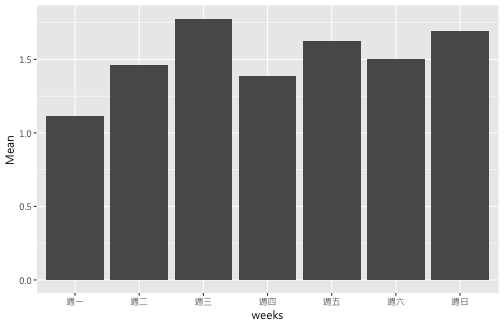
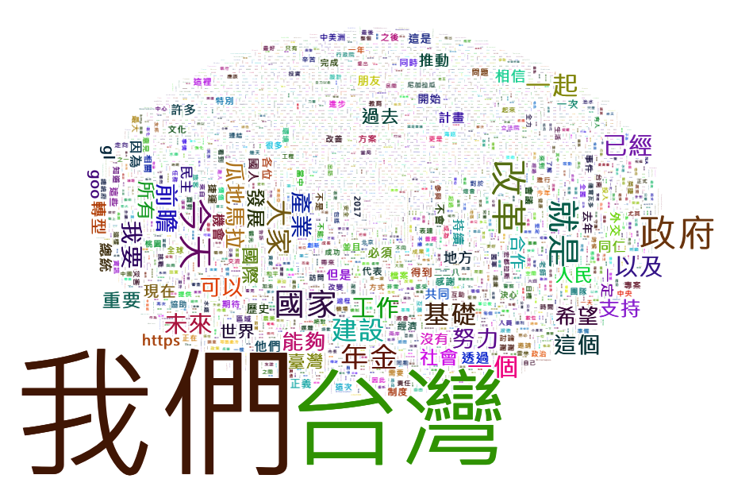

社群網路分析案例
========================================================
author: 曾意儒 Yi-Ju Tseng
date: 2017/07/01
autosize: true
font-family: 'Microsoft JhengHei'
navigation: slide


從Facebook匯入資料的方法
====================================
type:section
- Graph API in R
- Rfacebook package

Graph API in R
====================================
type:sub-section

- [Graph API](https://developers.facebook.com/docs/graph-api?locale=zh_TW)
    - 根據篩選條件，回傳JSON格式的資料
- [Graph API Explorer](https://developers.facebook.com/tools/explorer/)
    - 測試資料撈取方法和結果
- 必須要取得自己的**access token** (存取權杖)
    - 可在[Graph API Explorer](https://developers.facebook.com/tools/explorer/)視窗右上角的**Get Token**按鈕取得
    - [官方文件](https://developers.facebook.com/docs/facebook-login/access-tokens/?locale=zh_TW)


Rfacebook package
====================================
type:sub-section

使用 Rfacebook 取得 `tsaiingwen` 粉絲頁的資料

```r
library(Rfacebook) #初次使用須先安裝
#將token複製到此處 
token<-"EAACEdEose0cBAOedD1g1lEAhVPkpFOMttiKOwt8qkVjSSoPYokrhu4uWfgjuUnM7S0bwGYw9RYhDxpBJnOfT3LQ27pydJjDdEA1YfqeYT1BLFsgrg3tEUXViYLPks2Cc4HowWYOvuktE4fl1SN4s0w3ZBrD1hLh2cfyvjrsvmaDjGb6brE3jOG48rNMYZD" 
getPage("tsaiingwen", token,n = 5)
```

```
5 posts 
```

```
      from_id           from_name
1 46251501064 蔡英文 Tsai Ing-wen
2 46251501064 蔡英文 Tsai Ing-wen
3 46251501064 蔡英文 Tsai Ing-wen
4 46251501064 蔡英文 Tsai Ing-wen
5 46251501064 蔡英文 Tsai Ing-wen
                                                                                                                                                                                                                                                                                                                                                                                                                                                                                                                                                                                                                                                                                                                                                                                                                                                                     message
1                                                                                                                                                                                                                               新竹鄉親等了十幾年的台大醫院新竹生醫分院，新政府上任之後不到一年就開始動工。兩年之後，第一期就會完工。未來的新竹生醫園區，有臨床資源，也有研發能量，將是台灣生醫產業的重鎮。\n\n民間長年呼籲要修正《生技新藥產業發展條例》以及《科學技術基本法》，我們也用最快的速度完成修法，讓法律可以符合產業發展的趨勢，並讓更好的人才與前瞻的研究，運用到產業裡面。\n\n從我們推動生醫產業創新計畫至今，產業投資金額持續增加，新藥進入臨床試驗的數量也在增加。我們更組成拓銷艦隊，用國家隊的方式，爭取全世界的訂單，並輔導國產新藥，取得新南向國家的藥證。\n\n台灣在跟時間賽跑。我們會加速推動政策改革與軟硬體建設，整合跨部會的資源，全力支持產業發展。
2                                                                                                                                                                                                                                                                                                                                                                                                                                                                      台北清真寺昨天晚上宣布，今（25）日就是開齋節，全世界17億穆斯林教友，完成了近一個月的神聖齋戒。\n\n在伊斯蘭傳統裡面，開齋節是一年當中最值得慶祝的日子。在這一天，穆斯林朋友會到清真寺參加會禮，也會和親朋好友歡聚。\n\n台灣是一個擁有多元文化的社會，今天在許多地方都有開齋節慶祝活動。我邀請國人一起來感受開齋節的熱鬧歡慶氣息，也祝福所有穆斯林朋友開齋節快樂！\n\n開齋節介紹：https://goo.gl/RF7ufc
3                                                                                                                                                                                                       台灣很美，但台灣受傷了。這是齊柏林導演和他的夥伴們用生命，要告訴我們的事情。\n\n今天頒給齊導演褒揚令，心情非常不捨與複雜。台灣已經被看見，新政府一上任，我們就開始了「全國國土計畫」的研擬，要讓國土資源永續發展。我們正努力著把國土復育起來，讓我們的土地休養生息，回復生命力。\n\n關於礦場的開發，我們也在規劃改革的方向。未來，不只是整體的礦業發展要做政策環評，在「礦業法」修正之後，過去沒有做過環評的個別礦場，都要重新審查。以後的礦權展限案，也要做環評。\n\n政府會和所有關心環保議題的朋友，持續進行對話，共同合作，保護台灣的自然環境，保護齊導鏡頭記錄下的，每一處美麗的山林、平原、河川和海岸。\n\n再一次向齊柏林導演、陳冠齊先生、張志光先生致上敬意。
4 原鄉長照能夠做好，全國的長照2.0就沒問題。\n\n在原鄉部落推動長照2.0，挑戰性很高。不過，無論是幅員遼闊的交通接送問題，或是空間、資源跟人才的缺乏，這些挑戰我們正著手一一克服。\n\n在桃園復興的山區，就有一群泰雅族工作者，認真地為了長照而付出。現在復興區的衛生所，已經是B級的「複合型服務中心」，可以提供在地泰雅族長輩相當規模的長照服務。而後山的比亞外部落，則透過教會的力量，率先設置C級的「巷弄長照站」，由年輕人返鄉照顧老人家。\n\n公部門要整合所有可用的資源，支持在第一線打拚的工作同仁。原住民族委員會已經在前瞻計畫中編列了10億元，整建部落的照顧據點。加上 衛生福利部的支持，我們希望到2020年，原鄉的照顧據點可以增加超過3倍，以380個為目標。\n\n昨天 鄭文燦市長也當場承諾比亞外部落的族人，要多找2台交通車協助接駁。他還答應我，會用最大的心力，把桃園市的長照2.0，包括桃園原鄉部落的長照，做到全國頂尖。\n\n長照2.0，我們會使命必達。Lokah！（泰雅語：加油）
5                                                                                                                                                                                                                                                                                                                                                                                                           請大家鎖定FM105.9，因為 「講客廣播電臺」正式開播了！\n\n講客廣播電臺的開播，代表我們國家在推廣、傳承客家語言文化的工作上面，又往前邁進一大步。 今天在開播典禮上，我也用客家話，跟所有關心客家的朋友報告：我們的「搶救母語大作戰」，已經開始了！ \n\n接下來，我們會推動客家基本法的修法，把客語列為國家語言。在客家文化重點發展區，公家機關將會逐步提供客語服務、國中小也會把客語列為必修。\n\n客語是客家人與客家文化的根，政府會全力挺客家，絕對不會讓客語消失。
              created_time  type
1 2017-06-27T01:00:00+0000 photo
2 2017-06-25T02:08:39+0000 video
3 2017-06-24T05:07:51+0000 photo
4 2017-06-24T02:00:00+0000 photo
5 2017-06-23T23:33:32+0000 video
                                                                                                         link
1      https://www.facebook.com/tsaiingwen/photos/a.390960786064.163647.46251501064/10154377087236065/?type=3
2                                               https://www.facebook.com/tsaiingwen/videos/10154356986156065/
3 https://www.facebook.com/tsaiingwen/photos/a.10151242056081065.442660.46251501064/10154368960516065/?type=3
4      https://www.facebook.com/tsaiingwen/photos/a.390960786064.163647.46251501064/10154366509951065/?type=3
5                                               https://www.facebook.com/tsaiingwen/videos/10154366710866065/
                             id                                   story
1 46251501064_10154377090176065 蔡英文 Tsai Ing-wen added 4 new photos.
2 46251501064_10154356986156065                                    <NA>
3 46251501064_10154368960686065 蔡英文 Tsai Ing-wen added 4 new photos.
4 46251501064_10154366510416065 蔡英文 Tsai Ing-wen added 5 new photos.
5 46251501064_10154366710866065                                    <NA>
  likes_count comments_count shares_count
1        6410            950          140
2       13222           1932         1182
3       10862           1241          254
4        7049            553          172
5        6891            919          255
```


Rfacebook package練習
====================================
type:alert
incremental:true
- 取得Facebook access token
- 使用Rfacebook package取得**DoctorKoWJ**粉絲頁面的前五筆資料
- 第一筆資料的likes_count是多少?
- 第二筆資料的shares_count是多少?


Rfacebook package
====================================
- 每次擷取資料的比數有上限（大概30筆）
- 如需取得更多資料: 使用迴圈協助
    -  **since** 和 **until**參數，可設定資料擷取區間。
- 先取得日期向量，供後續迴圈做使用

```r
lastDate<-Sys.Date()
DateVector<-
    seq(as.Date("2017-01-01"),
        lastDate,by="10 days")
DateVectorStr<-as.character(DateVector)
DateVectorStr
```

```
 [1] "2017-01-01" "2017-01-11" "2017-01-21" "2017-01-31" "2017-02-10"
 [6] "2017-02-20" "2017-03-02" "2017-03-12" "2017-03-22" "2017-04-01"
[11] "2017-04-11" "2017-04-21" "2017-05-01" "2017-05-11" "2017-05-21"
[16] "2017-05-31" "2017-06-10" "2017-06-20"
```


Rfacebook package
====================================
利用上述日期向量，搭配迴圈，依序設定**since** 和 **until**

```r
totalPage<-NULL
token<-'EAACEdEose0cBAOedD1g1lEAhVPkpFOMttiKOwt8qkVjSSoPYokrhu4uWfgjuUnM7S0bwGYw9RYhDxpBJnOfT3LQ27pydJjDdEA1YfqeYT1BLFsgrg3tEUXViYLPks2Cc4HowWYOvuktE4fl1SN4s0w3ZBrD1hLh2cfyvjrsvmaDjGb6brE3jOG48rNMYZD'
for(i in 1:(length(DateVectorStr)-1)){ 
    tempPage<-getPage("tsaiingwen", token,
                since = DateVectorStr[i],
                until = DateVectorStr[i+1])
    totalPage<-rbind(totalPage,tempPage)
}
```

```
12 posts 13 posts 16 posts 8 posts 8 posts 8 posts 7 posts 6 posts 8 posts 8 posts 5 posts 9 posts 4 posts 13 posts 10 posts 12 posts 7 posts 
```

```r
nrow(totalPage)
```

```
[1] 154
```


FB資料撈下來了...然後呢？
====================================

```r
str(totalPage)
```

```
'data.frame':	154 obs. of  11 variables:
 $ from_id       : chr  "46251501064" "46251501064" "46251501064" "46251501064" ...
 $ from_name     : chr  "蔡英文 Tsai Ing-wen" "蔡英文 Tsai Ing-wen" "蔡英文 Tsai Ing-wen" "蔡英文 Tsai Ing-wen" ...
 $ message       : chr  "台商就像我們台灣嫁出去的女兒，來到海外，一定要來看他們。今天拜訪尼加拉瓜三家台商成衣廠，他們不但為當地的經濟發展有許多貢獻，更"| __truncated__ "離開宏都拉斯之後，我們在當地時間（9日）下午五點左右抵達尼加拉瓜首都馬納瓜。隨即在下午六點半，跟剛剛連任成功的奧德嘉總統會面。整"| __truncated__ "宏都拉斯的葉南德茲總統 Juan Orlando Hernández，是去年一月十六日我確定當選後，第一位向我恭賀的外國元首。就任以來，我已經跟他見了"| __truncated__ "參觀宏京最大的Suyapa大教堂，主教為手足之邦台灣祝禱，祝福這次中美洲訪問順利成功。\n\n他說，願台灣可以不被衝突所困，在對話之中持"| __truncated__ ...
 $ created_time  : chr  "2017-01-10T22:45:09+0000" "2017-01-10T03:30:36+0000" "2017-01-09T21:20:33+0000" "2017-01-09T17:20:21+0000" ...
 $ type          : chr  "photo" "photo" "photo" "photo" ...
 $ link          : chr  "https://www.facebook.com/tsaiingwen/photos/a.390960786064.163647.46251501064/10153933865401065/?type=3" "https://www.facebook.com/tsaiingwen/photos/a.390960786064.163647.46251501064/10153932375696065/?type=3" "https://www.facebook.com/tsaiingwen/photos/a.10151242056081065.442660.46251501064/10153931745141065/?type=3" "https://www.facebook.com/tsaiingwen/photos/a.10151242056081065.442660.46251501064/10153931251691065/?type=3" ...
 $ id            : chr  "46251501064_10153933866916065" "46251501064_10153932411776065" "46251501064_10153931749581065" "46251501064_10153931254146065" ...
 $ story         : chr  "蔡英文 Tsai Ing-wen added 3 new photos." "蔡英文 Tsai Ing-wen added 3 new photos." "蔡英文 Tsai Ing-wen added 6 new photos." "蔡英文 Tsai Ing-wen added 3 new photos." ...
 $ likes_count   : num  15781 19717 18012 14197 19896 ...
 $ comments_count: num  762 985 583 342 722 ...
 $ shares_count  : num  250 395 607 208 411 440 474 310 348 289 ...
```


分析po文時間: 時區轉換
====================================

```r
library(lubridate)
totalPage$created_time<-
    ymd_hms(totalPage$created_time,
            tz = "GMT")
totalPage$created_time<-
    with_tz(totalPage$created_time, 
            "Asia/Taipei")
```


分析po文時間: 跟星期是否有關？
====================================

```r
totalPage$weeks<-weekdays(totalPage$created_time)
#取得星期
totalPage$weeks<-
    factor(totalPage$weeks,
           levels = c("週一","週二","週三",
                "週四","週五","週六","週日"))
#取得日期
totalPage$date<-date(totalPage$created_time)
```

分析po文時間: 跟星期是否有關？
====================================

```r
library(dplyr)
WeekAve<-totalPage %>% 
    group_by(weeks) %>% 
    summarise(N=n(),
              Mean=n()/n_distinct(date))
WeekAve
```

```
# A tibble: 7 × 3
   weeks     N     Mean
  <fctr> <int>    <dbl>
1   週一    19 1.117647
2   週二    19 1.461538
3   週三    16 1.777778
4   週四    25 1.388889
5   週五    26 1.625000
6   週六    27 1.500000
7   週日    22 1.692308
```

分析po文時間: 跟星期是否有關？
====================================

```r
library(ggplot2)
ggplot(WeekAve,aes(x=weeks,y=Mean))+
    geom_bar(stat="identity")+
  theme(text = element_text(family = 'Microsoft JhengHei'))
```



分析po文類別
====================================

```r
totalPage %>% group_by(type) %>% summarise(N=n())
```

```
# A tibble: 4 × 2
    type     N
   <chr> <int>
1   link     7
2  photo   117
3 status     3
4  video    27
```


分析po文文字內內容: 結巴斷詞
====================================

```r
#install.packages("jiebaR")
library(jiebaR)
cutter <- worker()
## 不分行輸出
words<-cutter[totalPage$message] 
words
```

```
    [1] "台商"                                      
    [2] "就"                                        
    [3] "像"                                        
    [4] "我們"                                      
    [5] "台灣"                                      
    [6] "嫁出去"                                    
    [7] "的"                                        
    [8] "女兒"                                      
    [9] "來到"                                      
   [10] "海外"                                      
   [11] "一定"                                      
   [12] "要"                                        
   [13] "來看"                                      
   [14] "他們"                                      
   [15] "今天"                                      
   [16] "拜訪"                                      
   [17] "尼加拉瓜"                                  
   [18] "三家"                                      
   [19] "台商"                                      
   [20] "成衣廠"                                    
   [21] "他們"                                      
   [22] "不但"                                      
   [23] "為"                                        
   [24] "當地"                                      
   [25] "的"                                        
   [26] "經濟"                                      
   [27] "發展"                                      
   [28] "有"                                        
   [29] "許多"                                      
   [30] "貢獻"                                      
   [31] "更"                                        
   [32] "創造"                                      
   [33] "許多"                                      
   [34] "就業機會"                                  
   [35] "也"                                        
   [36] "深化"                                      
   [37] "了"                                        
   [38] "已"                                        
   [39] "簽署"                                      
   [40] "自由"                                      
   [41] "貿易協定"                                  
   [42] "的"                                        
   [43] "台尼"                                      
   [44] "兩國邦誼"                                  
   [45] "為"                                        
   [46] "了"                                        
   [47] "落實"                                      
   [48] "互惠"                                      
   [49] "互助"                                      
   [50] "從今"                                      
   [51] "年"                                        
   [52] "開始"                                      
   [53] "我們"                                      
   [54] "會"                                        
   [55] "每年"                                      
   [56] "定期"                                      
   [57] "協助"                                      
   [58] "企業"                                      
   [59] "擴大"                                      
   [60] "組團"                                      
   [61] "來"                                        
   [62] "中美洲"                                    
   [63] "的"                                        
   [64] "邦交國"                                    
   [65] "實地考察"                                  
   [66] "尋求"                                      
   [67] "更"                                        
   [68] "多"                                        
   [69] "的"                                        
   [70] "合作"                                      
   [71] "機會"                                      
   [72] "一起"                                      
   [73] "創造"                                      
   [74] "雙贏"                                      
   [75] "的"                                        
   [76] "發展"                                      
   [77] "英捷"                                      
   [78] "專案"                                      
   [79] "尼加拉瓜"                                  
   [80] "Nicaragua"                                 
   [81] "離開"                                      
   [82] "宏都拉斯"                                  
   [83] "之後"                                      
   [84] "我們"                                      
   [85] "在"                                        
   [86] "當地"                                      
   [87] "時間"                                      
   [88] "9"                                         
   [89] "日"                                        
   [90] "下午"                                      
   [91] "五點"                                      
   [92] "左右"                                      
   [93] "抵達"                                      
   [94] "尼加拉瓜"                                  
   [95] "首都"                                      
   [96] "馬"                                        
   [97] "納瓜"                                      
   [98] "隨即"                                      
   [99] "在"                                        
  [100] "下午"                                      
  [101] "六點半"                                    
  [102] "跟"                                        
  [103] "剛剛"                                      
  [104] "連任"                                      
  [105] "成功"                                      
  [106] "的"                                        
  [107] "奧德"                                      
  [108] "嘉"                                        
  [109] "總統"                                      
  [110] "會面"                                      
  [111] "整個"                                      
  [112] "會面"                                      
  [113] "過程"                                      
  [114] "尼國"                                      
  [115] "方面"                                      
  [116] "安排"                                      
  [117] "由"                                        
  [118] "多家"                                      
  [119] "官方"                                      
  [120] "媒體"                                      
  [121] "進行"                                      
  [122] "全國"                                      
  [123] "聯播"                                      
  [124] "在"                                        
  [125] "會晤"                                      
  [126] "當中"                                      
  [127] "我"                                        
  [128] "跟"                                        
  [129] "奧德"                                      
  [130] "嘉"                                        
  [131] "總統"                                      
  [132] "針對"                                      
  [133] "國內"                                      
  [134] "和"                                        
  [135] "國際局勢"                                  
  [136] "進行"                                      
  [137] "深入"                                      
  [138] "的"                                        
  [139] "意見"                                      
  [140] "交換"                                      
  [141] "我"                                        
  [142] "邀請"                                      
  [143] "奧德"                                      
  [144] "嘉"                                        
  [145] "總統"                                      
  [146] "訪問"                                      
  [147] "台灣"                                      
  [148] "他"                                        
  [149] "也"                                        
  [150] "答應"                                      
  [151] "願意"                                      
  [152] "認真思考"                                  
  [153] "奧德"                                      
  [154] "嘉"                                        
  [155] "總統"                                      
  [156] "還"                                        
  [157] "告訴"                                      
  [158] "我"                                        
  [159] "基於"                                      
  [160] "公平正義"                                  
  [161] "他"                                        
  [162] "一直"                                      
  [163] "都"                                        
  [164] "非常"                                      
  [165] "支持"                                      
  [166] "台灣"                                      
  [167] "加入"                                      
  [168] "國際"                                      
  [169] "組織"                                      
  [170] "同時"                                      
  [171] "他"                                        
  [172] "也"                                        
  [173] "期待"                                      
  [174] "已經"                                      
  [175] "簽署"                                      
  [176] "自由"                                      
  [177] "貿易協定"                                  
  [178] "的"                                        
  [179] "台灣"                                      
  [180] "和"                                        
  [181] "尼加拉瓜"                                  
  [182] "可以"                                      
  [183] "有"                                        
  [184] "更"                                        
  [185] "密切"                                      
  [186] "的"                                        
  [187] "經貿"                                      
  [188] "往來"                                      
  [189] "我"                                        
  [190] "告訴"                                      
  [191] "他"                                        
  [192] "台灣"                                      
  [193] "正在"                                      
  [194] "全力"                                      
  [195] "推動"                                      
  [196] "經濟"                                      
  [197] "產業"                                      
  [198] "的"                                        
  [199] "升級"                                      
  [200] "轉型"                                      
  [201] "我們"                                      
  [202] "非常"                                      
  [203] "歡迎"                                      
  [204] "尼加拉瓜"                                  
  [205] "跟"                                        
  [206] "台灣"                                      
  [207] "有"                                        
  [208] "更"                                        
  [209] "多"                                        
  [210] "交流"                                      
  [211] "合作"                                      
  [212] "的"                                        
  [213] "計劃"                                      
  [214] "英捷"                                      
  [215] "專案"                                      
  [216] "尼加拉瓜"                                  
  [217] "Nicaragua"                                 
  [218] "宏都拉斯"                                  
  [219] "的"                                        
  [220] "葉"                                        
  [221] "南德"                                      
  [222] "茲"                                        
  [223] "總統"                                      
  [224] "Juan"                                      
  [225] "Orlando"                                   
  [226] "Hern"                                      
  [227] "ndez"                                      
  [228] "是"                                        
  [229] "去年"                                      
  [230] "一月"                                      
  [231] "十六日"                                    
  [232] "我"                                        
  [233] "確定"                                      
  [234] "當選"                                      
  [235] "後"                                        
  [236] "第一位"                                    
  [237] "向"                                        
  [238] "我"                                        
  [239] "恭賀"                                      
  [240] "的"                                        
  [241] "外國"                                      
  [242] "元首"                                      
  [243] "就任"                                      
  [244] "以來"                                      
  [245] "我"                                        
  [246] "已經"                                      
  [247] "跟"                                        
  [248] "他"                                        
  [249] "見"                                        
  [250] "了"                                        
  [251] "三次"                                      
  [252] "面"                                        
  [253] "去年"                                      
  [254] "十月"                                      
  [255] "葉"                                        
  [256] "南德"                                      
  [257] "茲"                                        
  [258] "總統"                                      
  [259] "訪問"                                      
  [260] "台灣時"                                    
  [261] "特別"                                      
  [262] "邀請"                                      
  [263] "我"                                        
  [264] "回訪"                                      
  [265] "這次"                                      
  [266] "的"                                        
  [267] "訪問"                                      
  [268] "因為"                                      
  [269] "行程"                                      
  [270] "緊湊"                                      
  [271] "所以"                                      
  [272] "停留時間"                                  
  [273] "短暫"                                      
  [274] "但葉"                                      
  [275] "南德"                                      
  [276] "茲"                                        
  [277] "總統"                                      
  [278] "和"                                        
  [279] "宏都拉斯"                                  
  [280] "人民"                                      
  [281] "的"                                        
  [282] "熱情接待"                                  
  [283] "和"                                        
  [284] "高度"                                      
  [285] "禮遇"                                      
  [286] "讓"                                        
  [287] "我"                                        
  [288] "印象"                                      
  [289] "深刻"                                      
  [290] "英捷"                                      
  [291] "專案"                                      
  [292] "宏都拉斯"                                  
  [293] "Honduras"                                  
  [294] "參觀"                                      
  [295] "宏京"                                      
  [296] "最大"                                      
  [297] "的"                                        
  [298] "Suyapa"                                    
  [299] "大"                                        
  [300] "教堂"                                      
  [301] "主教"                                      
  [302] "為"                                        
  [303] "手足"                                      
  [304] "之邦"                                      
  [305] "台灣"                                      
  [306] "祝禱"                                      
  [307] "祝福"                                      
  [308] "這次"                                      
  [309] "中美洲"                                    
  [310] "訪問"                                      
  [311] "順利"                                      
  [312] "成功"                                      
  [313] "他"                                        
  [314] "說"                                        
  [315] "願台灣"                                    
  [316] "可以"                                      
  [317] "不"                                        
  [318] "被"                                        
  [319] "衝突"                                      
  [320] "所困"                                      
  [321] "在"                                        
  [322] "對話"                                      
  [323] "之中"                                      
  [324] "持續"                                      
  [325] "前行"                                      
  [326] "持續"                                      
  [327] "走"                                        
  [328] "在"                                        
  [329] "民主"                                      
  [330] "社會"                                      
  [331] "公義"                                      
  [332] "進步"                                      
  [333] "與"                                        
  [334] "發展"                                      
  [335] "的"                                        
  [336] "道路"                                      
  [337] "上"                                        
  [338] "英捷"                                      
  [339] "專案"                                      
  [340] "宏都拉斯"                                  
  [341] "Honduras"                                  
  [342] "推動"                                      
  [343] "踏實"                                      
  [344] "外交"                                      
  [345] "就是"                                      
  [346] "要"                                        
  [347] "親身經歷"                                  
  [348] "親自"                                      
  [349] "體會"                                      
  [350] "在"                                        
  [351] "宏都拉斯"                                  
  [352] "看到"                                      
  [353] "這麼"                                      
  [354] "多"                                        
  [355] "的"                                        
  [356] "外交人員"                                  
  [357] "技術"                                      
  [358] "團"                                        
  [359] "替代"                                      
  [360] "役"                                        
  [361] "以及"                                      
  [362] "僑民"                                      
  [363] "在"                                        
  [364] "爲"                                        
  [365] "台灣"                                      
  [366] "的"                                        
  [367] "外交"                                      
  [368] "打"                                        
  [369] "拚"                                        
  [370] "身為"                                      
  [371] "總統"                                      
  [372] "我要"                                      
  [373] "感謝"                                      
  [374] "他們"                                      
  [375] "也許"                                      
  [376] "我們"                                      
  [377] "的"                                        
  [378] "國際"                                      
  [379] "處境"                                      
  [380] "比較"                                      
  [381] "辛苦"                                      
  [382] "但"                                        
  [383] "我們"                                      
  [384] "從來不"                                    
  [385] "會"                                        
  [386] "因為"                                      
  [387] "辛苦"                                      
  [388] "就"                                        
  [389] "不"                                        
  [390] "去"                                        
  [391] "努力"                                      
  [392] "謝謝"                                      
  [393] "所有"                                      
  [394] "外交"                                      
  [395] "最"                                        
  [396] "前線"                                      
  [397] "的"                                        
  [398] "夥伴"                                      
  [399] "2017"                                      
  [400] "我們"                                      
  [401] "一起"                                      
  [402] "英"                                        
  [403] "捷"                                        
  [404] "專案"                                      
  [405] "宏都拉斯"                                  
  [406] "Honduras"                                  
  [407] "出訪"                                      
  [408] "中美洲"                                    
  [409] "友邦"                                      
  [410] "的"                                        
  [411] "第一站"                                    
  [412] "我們"                                      
  [413] "來到"                                      
  [414] "宏都拉斯"                                  
  [415] "期待"                                      
  [416] "接下來"                                    
  [417] "的"                                        
  [418] "訪問"                                      
  [419] "交流"                                      
  [420] "都"                                        
  [421] "順利"                                      
  [422] "成功"                                      
  [423] "英"                                        
  [424] "捷"                                        
  [425] "專案"                                      
  [426] "宏都拉斯"                                  
  [427] "Honduras"                                  
  [428] "這次"                                      
  [429] "出訪"                                      
  [430] "是"                                        
  [431] "在"                                        
  [432] "宏都拉斯"                                  
  [433] "尼加拉瓜"                                  
  [434] "瓜地馬拉"                                  
  [435] "薩爾瓦多"                                  
  [436] "四國"                                      
  [437] "元首"                                      
  [438] "的"                                        
  [439] "邀請"                                      
  [440] "之下"                                      
  [441] "前往"                                      
  [442] "訪問"                                      
  [443] "並將"                                      
  [444] "參加"                                      
  [445] "尼加拉瓜"                                  
  [446] "奧德"                                      
  [447] "嘉"                                        
  [448] "總統"                                      
  [449] "的"                                        
  [450] "就職典禮"                                  
  [451] "非常感謝"                                  
  [452] "在場"                                      
  [453] "四個"                                      
  [454] "國家"                                      
  [455] "的"                                        
  [456] "大使"                                      
  [457] "及"                                        
  [458] "代表"                                      
  [459] "這次"                                      
  [460] "我們"                                      
  [461] "的"                                        
  [462] "行程"                                      
  [463] "相當"                                      
  [464] "緊湊"                                      
  [465] "飛行"                                      
  [466] "超過"                                      
  [467] "三"                                        
  [468] "萬公里"                                    
  [469] "我要"                                      
  [470] "感謝"                                      
  [471] "所有"                                      
  [472] "參與"                                      
  [473] "準備"                                      
  [474] "工作"                                      
  [475] "的"                                        
  [476] "同仁"                                      
  [477] "這是"                                      
  [478] "去年"                                      
  [479] "五月"                                      
  [480] "我"                                        
  [481] "就職"                                      
  [482] "後"                                        
  [483] "的"                                        
  [484] "第二次"                                    
  [485] "出訪"                                      
  [486] "這段"                                      
  [487] "時間"                                      
  [488] "以來"                                      
  [489] "我們"                                      
  [490] "始終"                                      
  [491] "秉持"                                      
  [492] "踏實"                                      
  [493] "外交"                                      
  [494] "互惠"                                      
  [495] "互助"                                      
  [496] "的"                                        
  [497] "原則"                                      
  [498] "來"                                        
  [499] "推動"                                      
  [500] "外交"                                      
  [501] "工作"                                      
  [502] "採取"                                      
  [503] "共同"                                      
  [504] "協商"                                      
  [505] "合作"                                      
  [506] "互利"                                      
  [507] "的"                                        
  [508] "方式"                                      
  [509] "達到"                                      
  [510] "跟"                                        
  [511] "邦交國"                                    
  [512] "雙贏"                                      
  [513] "發展"                                      
  [514] "的"                                        
  [515] "目標"                                      
  [516] "這"                                        
  [517] "一趟"                                      
  [518] "訪問"                                      
  [519] "有"                                        
  [520] "兩個"                                      
  [521] "重要"                                      
  [522] "的"                                        
  [523] "任務"                                      
  [524] "第一"                                      
  [525] "鞏固"                                      
  [526] "邦誼"                                      
  [527] "讓"                                        
  [528] "台灣"                                      
  [529] "走向"                                      
  [530] "國際"                                      
  [531] "舞台"                                      
  [532] "我們"                                      
  [533] "訪問"                                      
  [534] "的"                                        
  [535] "四個"                                      
  [536] "國家"                                      
  [537] "都"                                        
  [538] "和"                                        
  [539] "中華民國"                                  
  [540] "有"                                        
  [541] "長期"                                      
  [542] "的"                                        
  [543] "友誼"                                      
  [544] "這次"                                      
  [545] "出訪"                                      
  [546] "正是"                                      
  [547] "要"                                        
  [548] "再"                                        
  [549] "一次"                                      
  [550] "肯定"                                      
  [551] "彼此"                                      
  [552] "歷久彌新"                                  
  [553] "的"                                        
  [554] "深厚"                                      
  [555] "友誼"                                      
  [556] "所以"                                      
  [557] "在"                                        
  [558] "這趟"                                      
  [559] "訪問"                                      
  [560] "中"                                        
  [561] "我"                                        
  [562] "不"                                        
  [563] "只將"                                      
  [564] "和"                                        
  [565] "友邦"                                      
  [566] "的"                                        
  [567] "元首"                                      
  [568] "會面"                                      
  [569] "也"                                        
  [570] "會"                                        
  [571] "把握"                                      
  [572] "機會"                                      
  [573] "跟"                                        
  [574] "其他"                                      
  [575] "國家"                                      
  [576] "的"                                        
  [577] "元首"                                      
  [578] "代表"                                      
  [579] "互動"                                      
  [580] "交流"                                      
  [581] "向"                                        
  [582] "國際"                                      
  [583] "社會"                                      
  [584] "展現"                                      
  [585] "台灣"                                      
  [586] "是"                                        
  [587] "一個"                                      
  [588] "有"                                        
  [589] "能力"                                      
  [590] "也"                                        
  [591] "有"                                        
  [592] "責任感"                                    
  [593] "的"                                        
  [594] "合作"                                      
  [595] "夥伴"                                      
  [596] "第二"                                      
  [597] "深化"                                      
  [598] "雙邊"                                      
  [599] "的"                                        
  [600] "合作"                                      
  [601] "方案"                                      
  [602] "為"                                        
  [603] "所有"                                      
  [604] "在"                                        
  [605] "海外"                                      
  [606] "打"                                        
  [607] "拚"                                        
  [608] "的"                                        
  [609] "台灣"                                      
  [610] "人"                                        
  [611] "打氣"                                      
  [612] "中美洲"                                    
  [613] "是"                                        
  [614] "一個"                                      
  [615] "充滿"                                      
  [616] "機會"                                      
  [617] "和"                                        
  [618] "發展潛力"                                  
  [619] "的"                                        
  [620] "市場"                                      
  [621] "我們"                                      
  [622] "將跟"                                      
  [623] "友邦"                                      
  [624] "一"                                        
  [625] "起來"                                      
  [626] "討論"                                      
  [627] "未來"                                      
  [628] "如何"                                      
  [629] "推動"                                      
  [630] "更"                                        
  [631] "符合"                                      
  [632] "彼此"                                      
  [633] "需求"                                      
  [634] "的"                                        
  [635] "合作"                                      
  [636] "方案"                                      
  [637] "我們"                                      
  [638] "的"                                        
  [639] "重點"                                      
  [640] "就是"                                      
  [641] "強化"                                      
  [642] "彼此之間"                                  
  [643] "的"                                        
  [644] "經貿關係"                                  
  [645] "一起"                                      
  [646] "攜手"                                      
  [647] "合作"                                      
  [648] "互惠"                                      
  [649] "互助"                                      
  [650] "把"                                        
  [651] "外交"                                      
  [652] "成果"                                      
  [653] "轉化"                                      
  [654] "為"                                        
  [655] "國家"                                      
  [656] "利益"                                      
  [657] "的"                                        
  [658] "具體"                                      
  [659] "收穫"                                      
  [660] "我"                                        
  [661] "也"                                        
  [662] "希望"                                      
  [663] "趁"                                        
  [664] "這個"                                      
  [665] "機會"                                      
  [666] "鼓勵"                                      
  [667] "第一線"                                    
  [668] "的"                                        
  [669] "外交"                                      
  [670] "工作人員"                                  
  [671] "以及"                                      
  [672] "技術"                                      
  [673] "團的"                                      
  [674] "成員"                                      
  [675] "並且"                                      
  [676] "向"                                        
  [677] "心繫"                                      
  [678] "故鄉"                                      
  [679] "的"                                        
  [680] "僑胞"                                      
  [681] "台商"                                      
  [682] "請益"                                      
  [683] "身為"                                      
  [684] "總統"                                      
  [685] "我要"                                      
  [686] "代表"                                      
  [687] "國家"                                      
  [688] "謝謝"                                      
  [689] "他們"                                      
  [690] "的"                                        
  [691] "努力"                                      
  [692] "也"                                        
  [693] "要"                                        
  [694] "聽聽"                                      
  [695] "他們"                                      
  [696] "的"                                        
  [697] "建議"                                      
  [698] "來"                                        
  [699] "檢視"                                      
  [700] "我們"                                      
  [701] "外交"                                      
  [702] "工作"                                      
  [703] "的"                                        
  [704] "成效"                                      
  [705] "世界"                                      
  [706] "正在"                                      
  [707] "改變"                                      
  [708] "所有"                                      
  [709] "國家"                                      
  [710] "的"                                        
  [711] "領袖"                                      
  [712] "都"                                        
  [713] "在"                                        
  [714] "為"                                        
  [715] "國家"                                      
  [716] "找"                                        
  [717] "新"                                        
  [718] "的"                                        
  [719] "方向"                                      
  [720] "這也"                                      
  [721] "是"                                        
  [722] "我"                                        
  [723] "的"                                        
  [724] "重責大任"                                  
  [725] "台灣"                                      
  [726] "人"                                        
  [727] "有"                                        
  [728] "能力"                                      
  [729] "也"                                        
  [730] "願意"                                      
  [731] "為"                                        
  [732] "國際"                                      
  [733] "社會"                                      
  [734] "做出"                                      
  [735] "更大"                                      
  [736] "的"                                        
  [737] "貢獻"                                      
  [738] "我們"                                      
  [739] "也"                                        
  [740] "有"                                        
  [741] "信心"                                      
  [742] "能夠"                                      
  [743] "在"                                        
  [744] "世界舞台"                                  
  [745] "上"                                        
  [746] "找到"                                      
  [747] "更"                                        
  [748] "多"                                        
  [749] "的"                                        
  [750] "機會"                                      
  [751] "現在"                                      
  [752] "我們"                                      
  [753] "就"                                        
  [754] "出發"                                      
  [755] "NA"                                        
  [756] "恭喜"                                      
  [757] "陳"                                        
  [758] "彥博"                                      
  [759] "獲得"                                      
  [760] "2016"                                      
  [761] "四大"                                      
  [762] "極地"                                      
  [763] "賽"                                        
  [764] "總冠軍"                                    
  [765] "他"                                        
  [766] "的"                                        
  [767] "過人"                                      
  [768] "鬥志"                                      
  [769] "和"                                        
  [770] "毅力"                                      
  [771] "讓"                                        
  [772] "台灣"                                      
  [773] "發光"                                      
  [774] "發熱"                                      
  [775] "彥博"                                      
  [776] "傑出"                                      
  [777] "的"                                        
  [778] "表現"                                      
  [779] "不"                                        
  [780] "只"                                        
  [781] "凝聚"                                      
  [782] "社會"                                      
  [783] "也"                                        
  [784] "振奮人心"                                  
  [785] "讓"                                        
  [786] "我們"                                      
  [787] "一起"                                      
  [788] "為"                                        
  [789] "他"                                        
  [790] "喝采"                                      
  [791] "陳"                                        
  [792] "彥博"                                      
  [793] "Tommy"                                     
  [794] "Chen"                                      
  [795] "維護正義"                                  
  [796] "為"                                        
  [797] "所"                                        
  [798] "當為"                                      
  [799] "謹守"                                      
  [800] "分際"                                      
  [801] "貫徹執行"                                  
  [802] "這是"                                      
  [803] "我"                                        
  [804] "今天"                                      
  [805] "在"                                        
  [806] "法務部"                                    
  [807] "調查局"                                    
  [808] "第"                                        
  [809] "53"                                        
  [810] "期"                                        
  [811] "調查員"                                    
  [812] "結業典禮"                                  
  [813] "中"                                        
  [814] "對"                                        
  [815] "大家"                                      
  [816] "的"                                        
  [817] "期許"                                      
  [818] "我們"                                      
  [819] "的"                                        
  [820] "每"                                        
  [821] "一天"                                      
  [822] "都"                                        
  [823] "是"                                        
  [824] "國軍"                                      
  [825] "戰戰兢兢"                                  
  [826] "的"                                        
  [827] "第一天"                                    
  [828] "2017"                                      
  [829] "我們"                                      
  [830] "一起"                                      
  [831] "和"                                        
  [832] "您"                                        
  [833] "一起"                                      
  [834] "守護"                                      
  [835] "台灣"                                      
  [836] "2017"                                      
  [837] "我們"                                      
  [838] "一起"                                      
  [839] "人權"                                      
  [840] "保障"                                      
  [841] "的"                                        
  [842] "深化"                                      
  [843] "是"                                        
  [844] "新政府"                                    
  [845] "一直"                                      
  [846] "在"                                        
  [847] "努力"                                      
  [848] "的"                                        
  [849] "事"                                        
  [850] "包括"                                      
  [851] "年金"                                      
  [852] "改革"                                      
  [853] "司法"                                      
  [854] "改革"                                      
  [855] "住宅"                                      
  [856] "政策"                                      
  [857] "原"                                        
  [858] "住"                                        
  [859] "民族"                                      
  [860] "的"                                        
  [861] "歷史"                                      
  [862] "和"                                        
  [863] "轉型"                                      
  [864] "正義"                                      
  [865] "都"                                        
  [866] "有"                                        
  [867] "重要"                                      
  [868] "的"                                        
  [869] "人權"                                      
  [870] "意義"                                      
  [871] "今天"                                      
  [872] "早上"                                      
  [873] "第二次"                                    
  [874] "的"                                        
  [875] "兩"                                        
  [876] "公約"                                      
  [877] "國際"                                      
  [878] "審查"                                      
  [879] "順利完成"                                  
  [880] "審查"                                      
  [881] "委員"                                      
  [882] "們"                                        
  [883] "的"                                        
  [884] "結論"                                      
  [885] "意見"                                      
  [886] "我們"                                      
  [887] "會"                                        
  [888] "虛心"                                      
  [889] "檢討"                                      
  [890] "積極"                                      
  [891] "改善"                                      
  [892] "制定"                                      
  [893] "國際"                                      
  [894] "人權"                                      
  [895] "公約"                                      
  [896] "的"                                        
  [897] "施行"                                      
  [898] "法"                                        
  [899] "舉辦"                                      
  [900] "國際"                                      
  [901] "審查"                                      
  [902] "這"                                        
  [903] "就是"                                      
  [904] "台灣"                                      
  [905] "參與"                                      
  [906] "國際"                                      
  [907] "人權"                                      
  [908] "保障體系"                                  
  [909] "獨特"                                      
  [910] "而且"                                      
  [911] "能"                                        
  [912] "有"                                        
  [913] "貢獻"                                      
  [914] "的"                                        
  [915] "方式"                                      
  [916] "世世代代"                                  
  [917] "領"                                        
  [918] "得到"                                      
  [919] "長長"                                      
  [920] "久久"                                      
  [921] "領到"                                      
  [922] "老"                                        
  [923] "為"                                        
  [924] "下一代"                                    
  [925] "改"                                        
  [926] "年金"                                      
  [927] "宏都拉斯"                                  
  [928] "尼加拉瓜"                                  
  [929] "瓜地馬拉"                                  
  [930] "以及"                                      
  [931] "薩爾瓦多"                                  
  [932] "是"                                        
  [933] "我們"                                      
  [934] "的"                                        
  [935] "邦交國"                                    
  [936] "它們"                                      
  [937] "各有"                                      
  [938] "迷人"                                      
  [939] "的"                                        
  [940] "景色"                                      
  [941] "我"                                        
  [942] "期待"                                      
  [943] "因為"                                      
  [944] "我"                                        
  [945] "的"                                        
  [946] "到訪"                                      
  [947] "讓"                                        
  [948] "國人"                                      
  [949] "更"                                        
  [950] "認識"                                      
  [951] "這些"                                      
  [952] "遠方"                                      
  [953] "的"                                        
  [954] "朋友"                                      
  [955] "有"                                        
  [956] "機會"                                      
  [957] "的話"                                      
  [958] "我"                                        
  [959] "希望"                                      
  [960] "更"                                        
  [961] "多"                                        
  [962] "的"                                        
  [963] "國人"                                      
  [964] "可以"                                      
  [965] "到"                                        
  [966] "這些"                                      
  [967] "邦交國"                                    
  [968] "來"                                        
  [969] "投資"                                      
  [970] "或"                                        
  [971] "觀光"                                      
  [972] "讓"                                        
  [973] "我們"                                      
  [974] "與"                                        
  [975] "中美洲"                                    
  [976] "友邦"                                      
  [977] "之間"                                      
  [978] "的"                                        
  [979] "情誼"                                      
  [980] "更加"                                      
  [981] "堅定"                                      
  [982] "這"                                        
  [983] "一趟"                                      
  [984] "出訪"                                      
  [985] "我們"                                      
  [986] "在"                                        
  [987] "九天"                                      
  [988] "之中"                                      
  [989] "訪問"                                      
  [990] "了"                                        
  [991] "宏都拉斯"                                  
  [992] "尼加拉瓜"                                  
  [993] "瓜地馬拉"                                  
  [994] "以及"                                      
  [995] "薩爾瓦多"                                  
  [996] "四個"                                      
  [997] "中美洲"                                    
  [998] "國家"                                      
  [999] "在"                                        
 [1000] "外交部"                                    
 [1001] "駐館"                                      
 [1002] "立法委員"                                  
 [1003] "產業界"                                    
 [1004] "朋友"                                      
 [1005] "及"                                        
 [1006] "全體"                                      
 [1007] "團員"                                      
 [1008] "的"                                        
 [1009] "同心協力"                                  
 [1010] "下"                                        
 [1011] "行程"                                      
 [1012] "已經"                                      
 [1013] "順利"                                      
 [1014] "結束"                                      
 [1015] "我"                                        
 [1016] "首先"                                      
 [1017] "要"                                        
 [1018] "在"                                        
 [1019] "此"                                        
 [1020] "表達"                                      
 [1021] "感謝"                                      
 [1022] "之意"                                      
 [1023] "在"                                        
 [1024] "啟程"                                      
 [1025] "談話"                                      
 [1026] "中"                                        
 [1027] "我"                                        
 [1028] "提到"                                      
 [1029] "這次"                                      
 [1030] "出訪"                                      
 [1031] "有"                                        
 [1032] "兩個"                                      
 [1033] "目標"                                      
 [1034] "第一個"                                    
 [1035] "目標"                                      
 [1036] "是"                                        
 [1037] "鞏固"                                      
 [1038] "邦誼"                                      
 [1039] "讓"                                        
 [1040] "臺灣"                                      
 [1041] "走向"                                      
 [1042] "國際"                                      
 [1043] "舞台"                                      
 [1044] "因此"                                      
 [1045] "我們"                                      
 [1046] "在"                                        
 [1047] "出訪"                                      
 [1048] "期間"                                      
 [1049] "跟"                                        
 [1050] "四位"                                      
 [1051] "元首"                                      
 [1052] "進行"                                      
 [1053] "雙邊會談"                                  
 [1054] "針對"                                      
 [1055] "全球"                                      
 [1056] "趨勢"                                      
 [1057] "以及"                                      
 [1058] "未來"                                      
 [1059] "的"                                        
 [1060] "雙邊合作"                                  
 [1061] "事項"                                      
 [1062] "進行"                                      
 [1063] "對話"                                      
 [1064] "我們"                                      
 [1065] "也"                                        
 [1066] "把握"                                      
 [1067] "在"                                        
 [1068] "美國"                                      
 [1069] "短暫"                                      
 [1070] "過境"                                      
 [1071] "的"                                        
 [1072] "期間"                                      
 [1073] "參訪"                                      
 [1074] "了"                                        
 [1075] "產業"                                      
 [1076] "也"                                        
 [1077] "跟"                                        
 [1078] "美方"                                      
 [1079] "重要"                                      
 [1080] "人士"                                      
 [1081] "晤談"                                      
 [1082] "第二個"                                    
 [1083] "目標"                                      
 [1084] "是"                                        
 [1085] "深化"                                      
 [1086] "雙邊合作"                                  
 [1087] "方案"                                      
 [1088] "並且"                                      
 [1089] "為"                                        
 [1090] "許多"                                      
 [1091] "在"                                        
 [1092] "海外"                                      
 [1093] "打"                                        
 [1094] "拚"                                        
 [1095] "的"                                        
 [1096] "臺灣人"                                    
 [1097] "加油打氣"                                  
 [1098] "這"                                        
 [1099] "一次"                                      
 [1100] "我們"                                      
 [1101] "在"                                        
 [1102] "中美洲"                                    
 [1103] "各國"                                      
 [1104] "看見"                                      
 [1105] "使館"                                      
 [1106] "同仁"                                      
 [1107] "技術"                                      
 [1108] "團"                                        
 [1109] "成員"                                      
 [1110] "台商"                                      
 [1111] "以及"                                      
 [1112] "僑胞"                                      
 [1113] "還有"                                      
 [1114] "替代"                                      
 [1115] "役男"                                      
 [1116] "同心協力"                                  
 [1117] "一起"                                      
 [1118] "為"                                        
 [1119] "外交"                                      
 [1120] "努力"                                      
 [1121] "我們"                                      
 [1122] "透過"                                      
 [1123] "親身經歷"                                  
 [1124] "親自"                                      
 [1125] "體會"                                      
 [1126] "看見"                                      
 [1127] "中美洲"                                    
 [1128] "各國"                                      
 [1129] "走出"                                      
 [1130] "動盪"                                      
 [1131] "對"                                        
 [1132] "繁榮"                                      
 [1133] "發展"                                      
 [1134] "的"                                        
 [1135] "潛力"                                      
 [1136] "跟"                                        
 [1137] "期待"                                      
 [1138] "我"                                        
 [1139] "相信"                                      
 [1140] "這些"                                      
 [1141] "觀察"                                      
 [1142] "對於"                                      
 [1143] "未來"                                      
 [1144] "落實"                                      
 [1145] "更"                                        
 [1146] "深化"                                      
 [1147] "的"                                        
 [1148] "踏實"                                      
 [1149] "外交"                                      
 [1150] "互惠"                                      
 [1151] "互助"                                      
 [1152] "合作"                                      
 [1153] "方案"                                      
 [1154] "都"                                        
 [1155] "是"                                        
 [1156] "重要"                                      
 [1157] "的"                                        
 [1158] "參考"                                      
 [1159] "經過"                                      
 [1160] "這"                                        
 [1161] "一次"                                      
 [1162] "出訪"                                      
 [1163] "我"                                        
 [1164] "也"                                        
 [1165] "對"                                        
 [1166] "未來"                                      
 [1167] "的"                                        
 [1168] "外交"                                      
 [1169] "工作"                                      
 [1170] "有"                                        
 [1171] "兩項"                                      
 [1172] "宣示"                                      
 [1173] "第一"                                      
 [1174] "踏實"                                      
 [1175] "外交"                                      
 [1176] "改變"                                      
 [1177] "過去"                                      
 [1178] "單向"                                      
 [1179] "援助"                                      
 [1180] "採取"                                      
 [1181] "雙邊"                                      
 [1182] "對話"                                      
 [1183] "尋求"                                      
 [1184] "互惠"                                      
 [1185] "互助"                                      
 [1186] "的"                                        
 [1187] "做法"                                      
 [1188] "已經"                                      
 [1189] "獲得"                                      
 [1190] "友邦"                                      
 [1191] "的"                                        
 [1192] "肯定"                                      
 [1193] "未來"                                      
 [1194] "我們"                                      
 [1195] "的"                                        
 [1196] "合作"                                      
 [1197] "計畫"                                      
 [1198] "不會"                                      
 [1199] "減少"                                      
 [1200] "只會"                                      
 [1201] "更"                                        
 [1202] "有效率"                                    
 [1203] "更"                                        
 [1204] "有"                                        
 [1205] "創造"                                      
 [1206] "雙贏"                                      
 [1207] "的"                                        
 [1208] "機會"                                      
 [1209] "第二"                                      
 [1210] "未來"                                      
 [1211] "的"                                        
 [1212] "合作"                                      
 [1213] "方案"                                      
 [1214] "要"                                        
 [1215] "把"                                        
 [1216] "產業"                                      
 [1217] "和"                                        
 [1218] "市場"                                      
 [1219] "的"                                        
 [1220] "發展"                                      
 [1221] "一併"                                      
 [1222] "列入"                                      
 [1223] "考量"                                      
 [1224] "全球"                                      
 [1225] "局勢"                                      
 [1226] "正在"                                      
 [1227] "變化"                                      
 [1228] "臺灣"                                      
 [1229] "產業"                                      
 [1230] "要"                                        
 [1231] "布局"                                      
 [1232] "全球"                                      
 [1233] "中美洲"                                    
 [1234] "是"                                        
 [1235] "具有"                                      
 [1236] "潛力"                                      
 [1237] "的"                                        
 [1238] "一塊"                                      
 [1239] "我們"                                      
 [1240] "要"                                        
 [1241] "讓"                                        
 [1242] "自由"                                      
 [1243] "貿易協定"                                  
 [1244] "的"                                        
 [1245] "效力"                                      
 [1246] "能夠"                                      
 [1247] "發揮出來"                                  
 [1248] "未來"                                      
 [1249] "我們"                                      
 [1250] "會"                                        
 [1251] "請"                                        
 [1252] "專家"                                      
 [1253] "進行"                                      
 [1254] "更"                                        
 [1255] "深入"                                      
 [1256] "的"                                        
 [1257] "考察"                                      
 [1258] "也"                                        
 [1259] "會"                                        
 [1260] "鼓勵"                                      
 [1261] "企業"                                      
 [1262] "針對"                                      
 [1263] "雙方"                                      
 [1264] "可以"                                      
 [1265] "合作"                                      
 [1266] "發展"                                      
 [1267] "的"                                        
 [1268] "項目"                                      
 [1269] "規劃"                                      
 [1270] "出有"                                      
 [1271] "機會"                                      
 [1272] "合作"                                      
 [1273] "雙贏"                                      
 [1274] "的"                                        
 [1275] "策略"                                      
 [1276] "經過"                                      
 [1277] "兩次"                                      
 [1278] "出訪"                                      
 [1279] "外交"                                      
 [1280] "工作"                                      
 [1281] "的"                                        
 [1282] "新"                                        
 [1283] "方向"                                      
 [1284] "更"                                        
 [1285] "清晰"                                      
 [1286] "了"                                        
 [1287] "大家"                                      
 [1288] "務必"                                      
 [1289] "繼續"                                      
 [1290] "努力"                                      
 [1291] "一起"                                      
 [1292] "讓"                                        
 [1293] "臺灣"                                      
 [1294] "走"                                        
 [1295] "出去"                                      
 [1296] "一起"                                      
 [1297] "讓"                                        
 [1298] "臺灣"                                      
 [1299] "把"                                        
 [1300] "能力"                                      
 [1301] "貢獻"                                      
 [1302] "給"                                        
 [1303] "世界"                                      
 [1304] "英捷"                                      
 [1305] "專案"                                      
 [1306] "宏都拉斯"                                  
 [1307] "\xed\xa0\xbc"                              
 [1308] "\xed\xb7\xad"                              
 [1309] "\xed\xa0\xbc"                              
 [1310] "\xed\xb7\xb3"                              
 [1311] "尼加拉瓜"                                  
 [1312] "\xed\xa0\xbc"                              
 [1313] "\xed\xb7\xb3"                              
 [1314] "\xed\xa0\xbc"                              
 [1315] "\xed\xb7\xae"                              
 [1316] "瓜地馬拉"                                  
 [1317] "\xed\xa0\xbc"                              
 [1318] "\xed\xb7\xac"                              
 [1319] "\xed\xa0\xbc"                              
 [1320] "\xed\xb7\xb9"                              
 [1321] "薩爾瓦多"                                  
 [1322] "\xed\xa0\xbc"                              
 [1323] "\xed\xb7\xb8"                              
 [1324] "\xed\xa0\xbc"                              
 [1325] "\xed\xb7\xbb"                              
 [1326] "畫面"                                      
 [1327] "中"                                        
 [1328] "的"                                        
 [1329] "年輕人"                                    
 [1330] "都"                                        
 [1331] "是"                                        
 [1332] "在"                                        
 [1333] "舊金山"                                    
 [1334] "矽谷"                                      
 [1335] "打"                                        
 [1336] "拚"                                        
 [1337] "的"                                        
 [1338] "台灣"                                      
 [1339] "新創"                                      
 [1340] "團隊"                                      
 [1341] "朋友"                                      
 [1342] "為"                                        
 [1343] "了"                                        
 [1344] "鼓勵"                                      
 [1345] "創新"                                      
 [1346] "產業"                                      
 [1347] "的"                                        
 [1348] "全球"                                      
 [1349] "連結"                                      
 [1350] "我們"                                      
 [1351] "在"                                        
 [1352] "這裡"                                      
 [1353] "也"                                        
 [1354] "成立"                                      
 [1355] "了"                                        
 [1356] "亞洲"                                      
 [1357] "矽谷"                                      
 [1358] "辦公室"                                    
 [1359] "希望"                                      
 [1360] "讓"                                        
 [1361] "這個"                                      
 [1362] "辦公室"                                    
 [1363] "成為"                                      
 [1364] "橋樑"                                      
 [1365] "將"                                        
 [1366] "產業"                                      
 [1367] "跟"                                        
 [1368] "政府"                                      
 [1369] "連結起來"                                  
 [1370] "在"                                        
 [1371] "變局"                                      
 [1372] "中"                                        
 [1373] "找出"                                      
 [1374] "更"                                        
 [1375] "多"                                        
 [1376] "機會"                                      
 [1377] "嗨"                                        
 [1378] "Twitter"                                   
 [1379] "在"                                        
 [1380] "大"                                        
 [1381] "航海"                                      
 [1382] "時代"                                      
 [1383] "現在"                                      
 [1384] "基隆"                                      
 [1385] "東北邊"                                    
 [1386] "的"                                        
 [1387] "和平島"                                    
 [1388] "一帶"                                      
 [1389] "有"                                        
 [1390] "一座"                                      
 [1391] "聖薩爾瓦多"                                
 [1392] "城"                                        
 [1393] "而"                                        
 [1394] "今天"                                      
 [1395] "我"                                        
 [1396] "來到"                                      
 [1397] "了"                                        
 [1398] "太平洋"                                    
 [1399] "彼端"                                      
 [1400] "的"                                        
 [1401] "友邦"                                      
 [1402] "薩爾瓦多"                                  
 [1403] "跟"                                        
 [1404] "桑"                                        
 [1405] "契斯"                                      
 [1406] "總統"                                      
 [1407] "會談"                                      
 [1408] "並"                                        
 [1409] "接受"                                      
 [1410] "贈勳"                                      
 [1411] "我們"                                      
 [1412] "將"                                        
 [1413] "繼續"                                      
 [1414] "致力於"                                    
 [1415] "兩國"                                      
 [1416] "的"                                        
 [1417] "合作"                                      
 [1418] "交流"                                      
 [1419] "以及"                                      
 [1420] "推動"                                      
 [1421] "雙邊"                                      
 [1422] "的"                                        
 [1423] "經貿"                                      
 [1424] "投資"                                      
 [1425] "讓"                                        
 [1426] "兩國人民"                                  
 [1427] "共享"                                      
 [1428] "互惠"                                      
 [1429] "互助"                                      
 [1430] "的"                                        
 [1431] "成果"                                      
 [1432] "英捷"                                      
 [1433] "專案"                                      
 [1434] "薩爾瓦多"                                  
 [1435] "ElSalvador"                                
 [1436] "\xed\xa0\xbc"                              
 [1437] "\xed\xb7\xb8"                              
 [1438] "\xed\xa0\xbc"                              
 [1439] "\xed\xb7\xbb"                              
 [1440] "薩爾瓦多"                                  
 [1441] "最"                                        
 [1442] "有名"                                      
 [1443] "的"                                        
 [1444] "農產"                                      
 [1445] "就是"                                      
 [1446] "咖啡"                                      
 [1447] "在"                                        
 [1448] "Santa"                                     
 [1449] "Adelaida"                                  
 [1450] "咖啡"                                      
 [1451] "生產"                                      
 [1452] "合作社"                                    
 [1453] "跟"                                        
 [1454] "我們"                                      
 [1455] "同行"                                      
 [1456] "的"                                        
 [1457] "還有"                                      
 [1458] "來自"                                      
 [1459] "台灣"                                      
 [1460] "由"                                        
 [1461] "中美洲"                                    
 [1462] "貿易"                                      
 [1463] "辦公室"                                    
 [1464] "組團"                                      
 [1465] "來訪"                                      
 [1466] "的"                                        
 [1467] "咖啡"                                      
 [1468] "採購團"                                    
 [1469] "我們"                                      
 [1470] "一起"                                      
 [1471] "看"                                        
 [1472] "了"                                        
 [1473] "當地"                                      
 [1474] "的"                                        
 [1475] "產品"                                      
 [1476] "並且"                                      
 [1477] "參加"                                      
 [1478] "了"                                        
 [1479] "杯測"                                      
 [1480] "我"                                        
 [1481] "也"                                        
 [1482] "期待"                                      
 [1483] "藉"                                        
 [1484] "著"                                        
 [1485] "他們"                                      
 [1486] "推動"                                      
 [1487] "的"                                        
 [1488] "採購"                                      
 [1489] "計畫"                                      
 [1490] "讓"                                        
 [1491] "更"                                        
 [1492] "多台"                                      
 [1493] "灣民眾"                                    
 [1494] "可以"                                      
 [1495] "喝到"                                      
 [1496] "高品質"                                    
 [1497] "好"                                        
 [1498] "價格"                                      
 [1499] "的"                                        
 [1500] "薩爾瓦多"                                  
 [1501] "咖啡"                                      
 [1502] "英捷"                                      
 [1503] "專案"                                      
 [1504] "薩爾瓦多"                                  
 [1505] "ElSalvador"                                
 [1506] "\xed\xa0\xbc"                              
 [1507] "\xed\xb7\xb8"                              
 [1508] "\xed\xa0\xbc"                              
 [1509] "\xed\xb7\xbb"                              
 [1510] "抵達"                                      
 [1511] "中美洲"                                    
 [1512] "訪問"                                      
 [1513] "的"                                        
 [1514] "第四站"                                    
 [1515] "薩爾瓦多"                                  
 [1516] "英捷"                                      
 [1517] "專案"                                      
 [1518] "薩爾瓦多"                                  
 [1519] "ElSalvador"                                
 [1520] "\xed\xa0\xbc"                              
 [1521] "\xed\xb7\xb8"                              
 [1522] "\xed\xa0\xbc"                              
 [1523] "\xed\xb7\xbb"                              
 [1524] "應"                                        
 [1525] "瓜地馬拉"                                  
 [1526] "國會"                                      
 [1527] "邀請"                                      
 [1528] "於"                                        
 [1529] "莊嚴"                                      
 [1530] "會議"                                      
 [1531] "發表演說"                                  
 [1532] "演說"                                      
 [1533] "全文"                                      
 [1534] "首先"                                      
 [1535] "我要"                                      
 [1536] "代表"                                      
 [1537] "中華民國政府"                              
 [1538] "以及"                                      
 [1539] "兩千"                                      
 [1540] "三百萬"                                    
 [1541] "臺灣"                                      
 [1542] "人民"                                      
 [1543] "向"                                        
 [1544] "瓜地馬拉"                                  
 [1545] "國會"                                      
 [1546] "以及"                                      
 [1547] "各位"                                      
 [1548] "國會議員"                                  
 [1549] "的"                                        
 [1550] "邀請"                                      
 [1551] "表達"                                      
 [1552] "誠摯"                                      
 [1553] "的"                                        
 [1554] "感謝"                                      
 [1555] "感謝"                                      
 [1556] "各位"                                      
 [1557] "讓"                                        
 [1558] "我們"                                      
 [1559] "全體"                                      
 [1560] "訪問團"                                    
 [1561] "能夠"                                      
 [1562] "參與"                                      
 [1563] "國會"                                      
 [1564] "的"                                        
 [1565] "莊嚴"                                      
 [1566] "會議"                                      
 [1567] "並且"                                      
 [1568] "讓"                                        
 [1569] "我"                                        
 [1570] "在"                                        
 [1571] "這裡"                                      
 [1572] "發表"                                      
 [1573] "演講"                                      
 [1574] "我要"                                      
 [1575] "藉"                                        
 [1576] "這個"                                      
 [1577] "機會"                                      
 [1578] "代表"                                      
 [1579] "臺灣"                                      
 [1580] "人民"                                      
 [1581] "對"                                        
 [1582] "瓜地馬拉"                                  
 [1583] "人民"                                      
 [1584] "以及"                                      
 [1585] "兩國之間"                                  
 [1586] "堅定"                                      
 [1587] "的"                                        
 [1588] "友誼"                                      
 [1589] "致上"                                      
 [1590] "最高"                                      
 [1591] "的"                                        
 [1592] "敬意"                                      
 [1593] "今天"                                      
 [1594] "還有"                                      
 [1595] "一件"                                      
 [1596] "特別"                                      
 [1597] "值得一提"                                  
 [1598] "的"                                        
 [1599] "事"                                        
 [1600] "議長"                                      
 [1601] "先生"                                      
 [1602] "告訴"                                      
 [1603] "我"                                        
 [1604] "今天"                                      
 [1605] "的"                                        
 [1606] "演講"                                      
 [1607] "會"                                        
 [1608] "透過"                                      
 [1609] "臺灣"                                      
 [1610] "跟"                                        
 [1611] "瓜地馬拉"                                  
 [1612] "合作"                                      
 [1613] "設置"                                      
 [1614] "的"                                        
 [1615] "轉播"                                      
 [1616] "系統"                                      
 [1617] "在"                                        
 [1618] "瓜地馬拉"                                  
 [1619] "的"                                        
 [1620] "國會"                                      
 [1621] "頻道"                                      
 [1622] "播出"                                      
 [1623] "聽說"                                      
 [1624] "這是"                                      
 [1625] "這個"                                      
 [1626] "兩國"                                      
 [1627] "合作"                                      
 [1628] "的"                                        
 [1629] "數位"                                      
 [1630] "直播"                                      
 [1631] "系統"                                      
 [1632] "首次"                                      
 [1633] "啟用"                                      
 [1634] "我"                                        
 [1635] "感到"                                      
 [1636] "非常"                                      
 [1637] "榮幸"                                      
 [1638] "這是"                                      
 [1639] "我"                                        
 [1640] "第一次"                                    
 [1641] "來到"                                      
 [1642] "瓜地馬拉"                                  
 [1643] "無論"                                      
 [1644] "在"                                        
 [1645] "瓜地馬拉"                                  
 [1646] "市"                                        
 [1647] "或者"                                      
 [1648] "安"                                        
 [1649] "地瓜"                                      
 [1650] "瓜地馬拉"                                  
 [1651] "的"                                        
 [1652] "風情"                                      
 [1653] "充滿"                                      
 [1654] "色彩"                                      
 [1655] "的"                                        
 [1656] "建築物"                                    
 [1657] "都"                                        
 [1658] "讓"                                        
 [1659] "我"                                        
 [1660] "印象"                                      
 [1661] "深刻"                                      
 [1662] "昨天"                                      
 [1663] "我"                                        
 [1664] "造訪"                                      
 [1665] "世界"                                      
 [1666] "知名"                                      
 [1667] "的"                                        
 [1668] "聯合國"                                    
 [1669] "文化遺產"                                  
 [1670] "安"                                        
 [1671] "地瓜"                                      
 [1672] "古城"                                      
 [1673] "那裡"                                      
 [1674] "曾經"                                      
 [1675] "遭到"                                      
 [1676] "地震"                                      
 [1677] "的"                                        
 [1678] "損害"                                      
 [1679] "修復"                                      
 [1680] "的"                                        
 [1681] "過程"                                      
 [1682] "中"                                        
 [1683] "臺灣"                                      
 [1684] "的"                                        
 [1685] "重建"                                      
 [1686] "團隊"                                      
 [1687] "也"                                        
 [1688] "很"                                        
 [1689] "榮幸"                                      
 [1690] "一起"                                      
 [1691] "參與"                                      
 [1692] "並且"                                      
 [1693] "付出"                                      
 [1694] "了"                                        
 [1695] "很多"                                      
 [1696] "的"                                        
 [1697] "努力"                                      
 [1698] "我"                                        
 [1699] "相信"                                      
 [1700] "每"                                        
 [1701] "一位"                                      
 [1702] "曾經"                                      
 [1703] "為"                                        
 [1704] "重建"                                      
 [1705] "安"                                        
 [1706] "地瓜"                                      
 [1707] "努力"                                      
 [1708] "的"                                        
 [1709] "臺灣人"                                    
 [1710] "看見"                                      
 [1711] "安"                                        
 [1712] "地瓜"                                      
 [1713] "逐漸"                                      
 [1714] "恢復"                                      
 [1715] "往日"                                      
 [1716] "的"                                        
 [1717] "元氣"                                      
 [1718] "跟"                                        
 [1719] "榮光"                                      
 [1720] "吸引"                                      
 [1721] "無數"                                      
 [1722] "觀光客"                                    
 [1723] "的"                                        
 [1724] "風采"                                      
 [1725] "都"                                        
 [1726] "會"                                        
 [1727] "感到"                                      
 [1728] "驕傲"                                      
 [1729] "我"                                        
 [1730] "希望"                                      
 [1731] "我"                                        
 [1732] "的"                                        
 [1733] "來訪"                                      
 [1734] "能"                                        
 [1735] "讓"                                        
 [1736] "更"                                        
 [1737] "多"                                        
 [1738] "臺灣"                                      
 [1739] "人民"                                      
 [1740] "有"                                        
 [1741] "機會"                                      
 [1742] "看到"                                      
 [1743] "安"                                        
 [1744] "地瓜"                                      
 [1745] "的"                                        
 [1746] "美"                                        
 [1747] "雖然"                                      
 [1748] "臺灣"                                      
 [1749] "跟"                                        
 [1750] "瓜地馬拉"                                  
 [1751] "之間"                                      
 [1752] "的"                                        
 [1753] "距離"                                      
 [1754] "很"                                        
 [1755] "遙遠"                                      
 [1756] "但是"                                      
 [1757] "我們"                                      
 [1758] "兩國之間"                                  
 [1759] "有"                                        
 [1760] "不變"                                      
 [1761] "的"                                        
 [1762] "友誼"                                      
 [1763] "也"                                        
 [1764] "有"                                        
 [1765] "共通"                                      
 [1766] "的"                                        
 [1767] "價值"                                      
 [1768] "持續"                                      
 [1769] "超過"                                      
 [1770] "八十年"                                    
 [1771] "的"                                        
 [1772] "友誼"                                      
 [1773] "絕對"                                      
 [1774] "不"                                        
 [1775] "只有"                                      
 [1776] "外交關係"                                  
 [1777] "和"                                        
 [1778] "官式"                                      
 [1779] "往來"                                      
 [1780] "在"                                        
 [1781] "維繫"                                      
 [1782] "更"                                        
 [1783] "重要"                                      
 [1784] "的"                                        
 [1785] "是"                                        
 [1786] "透過"                                      
 [1787] "實質"                                      
 [1788] "的"                                        
 [1789] "交流"                                      
 [1790] "跟"                                        
 [1791] "合作"                                      
 [1792] "來"                                        
 [1793] "贏得"                                      
 [1794] "人民"                                      
 [1795] "之間"                                      
 [1796] "的"                                        
 [1797] "互信"                                      
 [1798] "與"                                        
 [1799] "友誼"                                      
 [1800] "這"                                        
 [1801] "幾年"                                      
 [1802] "我們"                                      
 [1803] "的"                                        
 [1804] "技術"                                      
 [1805] "團"                                        
 [1806] "在"                                        
 [1807] "瓜地馬拉"                                  
 [1808] "推廣"                                      
 [1809] "竹林"                                      
 [1810] "栽培"                                      
 [1811] "也"                                        
 [1812] "和"                                        
 [1813] "瓜地馬拉"                                  
 [1814] "人民"                                      
 [1815] "分享"                                      
 [1816] "竹材"                                      
 [1817] "的"                                        
 [1818] "多元"                                      
 [1819] "運用"                                      
 [1820] "方式"                                      
 [1821] "包括"                                      
 [1822] "建造"                                      
 [1823] "堅固耐用"                                  
 [1824] "成本"                                      
 [1825] "更"                                        
 [1826] "低"                                        
 [1827] "的"                                        
 [1828] "竹屋"                                      
 [1829] "成為"                                      
 [1830] "偏鄉"                                      
 [1831] "小學"                                      
 [1832] "的"                                        
 [1833] "教室"                                      
 [1834] "協助"                                      
 [1835] "縮短"                                      
 [1836] "教育資源"                                  
 [1837] "落差"                                      
 [1838] "我們"                                      
 [1839] "的"                                        
 [1840] "技術"                                      
 [1841] "團"                                        
 [1842] "也"                                        
 [1843] "和"                                        
 [1844] "瓜地馬拉"                                  
 [1845] "政府"                                      
 [1846] "合作"                                      
 [1847] "執行"                                      
 [1848] "食品"                                      
 [1849] "加工"                                      
 [1850] "計畫"                                      
 [1851] "尤其"                                      
 [1852] "在"                                        
 [1853] "木瓜"                                      
 [1854] "產業"                                      
 [1855] "上"                                        
 [1856] "透過"                                      
 [1857] "臺灣"                                      
 [1858] "團隊"                                      
 [1859] "在"                                        
 [1860] "種植"                                      
 [1861] "技術"                                      
 [1862] "包裝"                                      
 [1863] "跟"                                        
 [1864] "加工"                                      
 [1865] "的"                                        
 [1866] "輔導"                                      
 [1867] "台"                                        
 [1868] "農"                                        
 [1869] "一號"                                      
 [1870] "木瓜"                                      
 [1871] "成為"                                      
 [1872] "瓜地馬拉"                                  
 [1873] "的"                                        
 [1874] "重要"                                      
 [1875] "外銷"                                      
 [1876] "產品"                                      
 [1877] "創造"                                      
 [1878] "大量"                                      
 [1879] "的"                                        
 [1880] "外匯收入"                                  
 [1881] "及"                                        
 [1882] "就業機會"                                  
 [1883] "除了"                                      
 [1884] "實質"                                      
 [1885] "的"                                        
 [1886] "交流"                                      
 [1887] "合作"                                      
 [1888] "臺灣"                                      
 [1889] "跟"                                        
 [1890] "瓜地馬拉"                                  
 [1891] "之間"                                      
 [1892] "還有"                                      
 [1893] "許多"                                      
 [1894] "共同"                                      
 [1895] "的"                                        
 [1896] "價值"                                      
 [1897] "其中"                                      
 [1898] "最"                                        
 [1899] "重要"                                      
 [1900] "的"                                        
 [1901] "就是"                                      
 [1902] "民主"                                      
 [1903] "在"                                        
 [1904] "昨天"                                      
 [1905] "的"                                        
 [1906] "軍禮"                                      
 [1907] "歡迎儀式"                                  
 [1908] "中"                                        
 [1909] "我"                                        
 [1910] "應邀"                                      
 [1911] "更換"                                      
 [1912] "了"                                        
 [1913] "文化宮"                                    
 [1914] "和平"                                      
 [1915] "紀念碑"                                    
 [1916] "內"                                        
 [1917] "的"                                        
 [1918] "和平"                                      
 [1919] "玫瑰"                                      
 [1920] "我"                                        
 [1921] "深深"                                      
 [1922] "感受"                                      
 [1923] "到"                                        
 [1924] "瓜地馬拉"                                  
 [1925] "人民"                                      
 [1926] "在"                                        
 [1927] "追求"                                      
 [1928] "自由"                                      
 [1929] "民主"                                      
 [1930] "及"                                        
 [1931] "和"                                        
 [1932] "平時"                                      
 [1933] "一路"                                      
 [1934] "走來"                                      
 [1935] "的"                                        
 [1936] "艱辛"                                      
 [1937] "以及"                                      
 [1938] "永不"                                      
 [1939] "放棄"                                      
 [1940] "的"                                        
 [1941] "決心"                                      
 [1942] "臺灣"                                      
 [1943] "人民"                                      
 [1944] "也"                                        
 [1945] "是"                                        
 [1946] "一樣"                                      
 [1947] "我們"                                      
 [1948] "同樣"                                      
 [1949] "經歷"                                      
 [1950] "過"                                        
 [1951] "戰爭"                                      
 [1952] "和"                                        
 [1953] "威權"                                      
 [1954] "統治"                                      
 [1955] "才"                                        
 [1956] "爭取"                                      
 [1957] "到"                                        
 [1958] "今日"                                      
 [1959] "的"                                        
 [1960] "民主自由"                                  
 [1961] "我們"                                      
 [1962] "都"                                        
 [1963] "曾經"                                      
 [1964] "走過"                                      
 [1965] "歷史"                                      
 [1966] "上"                                        
 [1967] "艱難"                                      
 [1968] "的"                                        
 [1969] "歲月"                                      
 [1970] "也"                                        
 [1971] "都"                                        
 [1972] "因為"                                      
 [1973] "堅持"                                      
 [1974] "自由"                                      
 [1975] "的"                                        
 [1976] "理想"                                      
 [1977] "才能"                                      
 [1978] "讓"                                        
 [1979] "和平"                                      
 [1980] "跟"                                        
 [1981] "民主"                                      
 [1982] "逐漸"                                      
 [1983] "落實"                                      
 [1984] "在"                                        
 [1985] "人民"                                      
 [1986] "的"                                        
 [1987] "日常生活"                                  
 [1988] "當中"                                      
 [1989] "我們"                                      
 [1990] "都"                                        
 [1991] "堅信"                                      
 [1992] "經歷"                                      
 [1993] "昔日"                                      
 [1994] "苦痛"                                      
 [1995] "的"                                        
 [1996] "人"                                        
 [1997] "必定會"                                    
 [1998] "特別"                                      
 [1999] "珍惜"                                      
 [2000] "眼前"                                      
 [2001] "的"                                        
 [2002] "幸福"                                      
 [2003] "瓜地馬拉"                                  
 [2004] "曾經"                                      
 [2005] "經歷"                                      
 [2006] "的"                                        
 [2007] "過去"                                      
 [2008] "讓"                                        
 [2009] "人"                                        
 [2010] "遺憾"                                      
 [2011] "但"                                        
 [2012] "我們"                                      
 [2013] "也"                                        
 [2014] "都"                                        
 [2015] "相信"                                      
 [2016] "只要"                                      
 [2017] "記取"                                      
 [2018] "歷史"                                      
 [2019] "的"                                        
 [2020] "經驗"                                      
 [2021] "必然"                                      
 [2022] "能夠"                                      
 [2023] "迎"                                        
 [2024] "向光明"                                    
 [2025] "的"                                        
 [2026] "未來"                                      
 [2027] "無論"                                      
 [2028] "在"                                        
 [2029] "價值"                                      
 [2030] "上"                                        
 [2031] "或者"                                      
 [2032] "實質"                                      
 [2033] "合作"                                      
 [2034] "上"                                        
 [2035] "臺灣"                                      
 [2036] "跟"                                        
 [2037] "瓜地馬拉"                                  
 [2038] "的"                                        
 [2039] "友誼"                                      
 [2040] "都"                                        
 [2041] "堅定"                                      
 [2042] "穩固"                                      
 [2043] "長久以來"                                  
 [2044] "瓜地馬拉"                                  
 [2045] "都"                                        
 [2046] "在"                                        
 [2047] "國際"                                      
 [2048] "社會"                                      
 [2049] "中"                                        
 [2050] "屢屢"                                      
 [2051] "為"                                        
 [2052] "臺灣"                                      
 [2053] "發聲"                                      
 [2054] "我要"                                      
 [2055] "代表"                                      
 [2056] "中華民國政府"                              
 [2057] "向"                                        
 [2058] "瓜地馬拉"                                  
 [2059] "表示感謝"                                  
 [2060] "臺灣"                                      
 [2061] "走向世界"                                  
 [2062] "的"                                        
 [2063] "路"                                        
 [2064] "雖然"                                      
 [2065] "曲折"                                      
 [2066] "但"                                        
 [2067] "我們"                                      
 [2068] "非常"                                      
 [2069] "堅定"                                      
 [2070] "去年"                                      
 [2071] "五月"                                      
 [2072] "我"                                        
 [2073] "就任"                                      
 [2074] "總統"                                      
 [2075] "之後"                                      
 [2076] "推出"                                      
 [2077] "了"                                        
 [2078] "踏實"                                      
 [2079] "外交"                                      
 [2080] "互惠"                                      
 [2081] "互助"                                      
 [2082] "的"                                        
 [2083] "外交"                                      
 [2084] "新"                                        
 [2085] "戰略"                                      
 [2086] "我"                                        
 [2087] "希望"                                      
 [2088] "透過"                                      
 [2089] "實質"                                      
 [2090] "的"                                        
 [2091] "合作"                                      
 [2092] "跟"                                        
 [2093] "友邦"                                      
 [2094] "之間"                                      
 [2095] "洽談"                                      
 [2096] "更"                                        
 [2097] "符合"                                      
 [2098] "雙邊"                                      
 [2099] "需求"                                      
 [2100] "的"                                        
 [2101] "互助"                                      
 [2102] "方案"                                      
 [2103] "在"                                        
 [2104] "瓜地馬拉"                                  
 [2105] "過去"                                      
 [2106] "幾年"                                      
 [2107] "來"                                        
 [2108] "我們"                                      
 [2109] "透過"                                      
 [2110] "海外"                                      
 [2111] "工程"                                      
 [2112] "公司"                                      
 [2113] "協助"                                      
 [2114] "推動"                                      
 [2115] "CA"                                        
 [2116] "9"                                         
 [2117] "號"                                        
 [2118] "公路"                                      
 [2119] "拓展"                                      
 [2120] "拓寬"                                      
 [2121] "工程"                                      
 [2122] "我們"                                      
 [2123] "的"                                        
 [2124] "初衷"                                      
 [2125] "是"                                        
 [2126] "因為"                                      
 [2127] "相信"                                      
 [2128] "基礎"                                      
 [2129] "建設"                                      
 [2130] "的"                                        
 [2131] "興建"                                      
 [2132] "有助於"                                    
 [2133] "經濟"                                      
 [2134] "產業"                                      
 [2135] "的"                                        
 [2136] "發展"                                      
 [2137] "及"                                        
 [2138] "社會"                                      
 [2139] "的"                                        
 [2140] "繁榮"                                      
 [2141] "不僅"                                      
 [2142] "是"                                        
 [2143] "協助"                                      
 [2144] "興建"                                      
 [2145] "基礎"                                      
 [2146] "建設"                                      
 [2147] "我們"                                      
 [2148] "也"                                        
 [2149] "致力"                                      
 [2150] "幫助"                                      
 [2151] "瓜地馬拉"                                  
 [2152] "培養人才"                                  
 [2153] "目前"                                      
 [2154] "一共"                                      
 [2155] "有"                                        
 [2156] "51"                                        
 [2157] "位"                                        
 [2158] "瓜地馬拉"                                  
 [2159] "留學生"                                    
 [2160] "透過"                                      
 [2161] "臺灣"                                      
 [2162] "獎學金"                                    
 [2163] "以及"                                      
 [2164] "國合"                                      
 [2165] "會"                                        
 [2166] "的"                                        
 [2167] "支持"                                      
 [2168] "正在"                                      
 [2169] "臺灣"                                      
 [2170] "學習"                                      
 [2171] "我"                                        
 [2172] "相信"                                      
 [2173] "這些"                                      
 [2174] "學生"                                      
 [2175] "都"                                        
 [2176] "會"                                        
 [2177] "是"                                        
 [2178] "深化"                                      
 [2179] "兩國"                                      
 [2180] "友誼"                                      
 [2181] "第一線"                                    
 [2182] "的"                                        
 [2183] "民間"                                      
 [2184] "大使"                                      
 [2185] "為"                                        
 [2186] "了"                                        
 [2187] "協助"                                      
 [2188] "瓜地馬拉"                                  
 [2189] "改善"                                      
 [2190] "教育"                                      
 [2191] "跟"                                        
 [2192] "醫療"                                      
 [2193] "的"                                        
 [2194] "情況"                                      
 [2195] "我們"                                      
 [2196] "不僅"                                      
 [2197] "帶來"                                      
 [2198] "了"                                        
 [2199] "書包"                                      
 [2200] "給"                                        
 [2201] "瓜地馬拉"                                  
 [2202] "的"                                        
 [2203] "小朋友"                                    
 [2204] "更"                                        
 [2205] "帶來"                                      
 [2206] "了"                                        
 [2207] "許多"                                      
 [2208] "藥品"                                      
 [2209] "希望"                                      
 [2210] "改善"                                      
 [2211] "瓜地馬拉"                                  
 [2212] "的"                                        
 [2213] "公衛"                                      
 [2214] "環境"                                      
 [2215] "同時"                                      
 [2216] "我們"                                      
 [2217] "也"                                        
 [2218] "已經"                                      
 [2219] "開始"                                      
 [2220] "評估"                                      
 [2221] "孕產婦"                                    
 [2222] "及"                                        
 [2223] "新生兒"                                    
 [2224] "照護"                                      
 [2225] "功能"                                      
 [2226] "計畫"                                      
 [2227] "希望"                                      
 [2228] "能夠"                                      
 [2229] "降低"                                      
 [2230] "孕婦"                                      
 [2231] "和"                                        
 [2232] "新生兒"                                    
 [2233] "的"                                        
 [2234] "風險"                                      
 [2235] "並且"                                      
 [2236] "提供"                                      
 [2237] "支持"                                      
 [2238] "和"                                        
 [2239] "訓練"                                      
 [2240] "的"                                        
 [2241] "系統"                                      
 [2242] "讓"                                        
 [2243] "瓜地馬拉"                                  
 [2244] "的"                                        
 [2245] "醫療"                                      
 [2246] "人員"                                      
 [2247] "能夠"                                      
 [2248] "跟"                                        
 [2249] "臺灣"                                      
 [2250] "有"                                        
 [2251] "更"                                        
 [2252] "多"                                        
 [2253] "的"                                        
 [2254] "醫療"                                      
 [2255] "合作"                                      
 [2256] "交流"                                      
 [2257] "甚至"                                      
 [2258] "到"                                        
 [2259] "臺灣"                                      
 [2260] "受訓"                                      
 [2261] "在"                                        
 [2262] "貿易"                                      
 [2263] "方面"                                      
 [2264] "在"                                        
 [2265] "臺灣"                                      
 [2266] "和"                                        
 [2267] "瓜地馬拉"                                  
 [2268] "簽署"                                      
 [2269] "自由"                                      
 [2270] "貿易協定"                                  
 [2271] "十年"                                      
 [2272] "之後"                                      
 [2273] "去年"                                      
 [2274] "雙邊"                                      
 [2275] "的"                                        
 [2276] "貿易額"                                    
 [2277] "已"                                        
 [2278] "達到"                                      
 [2279] "將近"                                      
 [2280] "2.5"                                       
 [2281] "億美元"                                    
 [2282] "臺灣"                                      
 [2283] "在"                                        
 [2284] "瓜地馬拉"                                  
 [2285] "的"                                        
 [2286] "投資"                                      
 [2287] "也"                                        
 [2288] "已經"                                      
 [2289] "超過"                                      
 [2290] "1"                                         
 [2291] "億美元"                                    
 [2292] "其中"                                      
 [2293] "最"                                        
 [2294] "重要"                                      
 [2295] "的"                                        
 [2296] "貿易"                                      
 [2297] "產品"                                      
 [2298] "就是"                                      
 [2299] "咖啡"                                      
 [2300] "在"                                        
 [2301] "臺灣"                                      
 [2302] "的"                                        
 [2303] "大街小巷"                                  
 [2304] "當中"                                      
 [2305] "都"                                        
 [2306] "喝"                                        
 [2307] "得到"                                      
 [2308] "來自"                                      
 [2309] "瓜地馬拉"                                  
 [2310] "具有"                                      
 [2311] "世界級"                                    
 [2312] "品質"                                      
 [2313] "的"                                        
 [2314] "咖啡"                                      
 [2315] "這"                                        
 [2316] "幾天"                                      
 [2317] "我"                                        
 [2318] "在"                                        
 [2319] "中美洲"                                    
 [2320] "訪問"                                      
 [2321] "跟"                                        
 [2322] "宏都拉斯"                                  
 [2323] "的"                                        
 [2324] "葉"                                        
 [2325] "南德"                                      
 [2326] "茲"                                        
 [2327] "總統"                                      
 [2328] "尼加拉瓜"                                  
 [2329] "的"                                        
 [2330] "奧德"                                      
 [2331] "嘉"                                        
 [2332] "總統"                                      
 [2333] "還有"                                      
 [2334] "貴國"                                      
 [2335] "的"                                        
 [2336] "莫拉雷"                                    
 [2337] "斯"                                        
 [2338] "總統"                                      
 [2339] "分別"                                      
 [2340] "晤談"                                      
 [2341] "在"                                        
 [2342] "雙邊會談"                                  
 [2343] "當中"                                      
 [2344] "我"                                        
 [2345] "感受"                                      
 [2346] "到"                                        
 [2347] "中美洲"                                    
 [2348] "國家"                                      
 [2349] "對於"                                      
 [2350] "繁榮"                                      
 [2351] "發展"                                      
 [2352] "的"                                        
 [2353] "潛力"                                      
 [2354] "和"                                        
 [2355] "期待"                                      
 [2356] "在"                                        
 [2357] "踏實"                                      
 [2358] "外交"                                      
 [2359] "的"                                        
 [2360] "精神"                                      
 [2361] "下"                                        
 [2362] "臺灣"                                      
 [2363] "希望"                                      
 [2364] "能夠"                                      
 [2365] "和"                                        
 [2366] "瓜地馬拉"                                  
 [2367] "攜手"                                      
 [2368] "持續"                                      
 [2369] "規劃"                                      
 [2370] "出"                                        
 [2371] "互惠"                                      
 [2372] "互助"                                      
 [2373] "的"                                        
 [2374] "方案"                                      
 [2375] "我"                                        
 [2376] "了解"                                      
 [2377] "中美洲"                                    
 [2378] "國家"                                      
 [2379] "對於"                                      
 [2380] "製造業"                                    
 [2381] "製程"                                      
 [2382] "的"                                        
 [2383] "自動化"                                    
 [2384] "農產品"                                    
 [2385] "加工"                                      
 [2386] "綠"                                        
 [2387] "能"                                        
 [2388] "產業"                                      
 [2389] "物流"                                      
 [2390] "產業"                                      
 [2391] "經濟基礎"                                  
 [2392] "建設"                                      
 [2393] "以及"                                      
 [2394] "紡織"                                      
 [2395] "成衣"                                      
 [2396] "產業"                                      
 [2397] "和"                                        
 [2398] "數位"                                      
 [2399] "資訊"                                      
 [2400] "產業"                                      
 [2401] "的"                                        
 [2402] "重視"                                      
 [2403] "這"                                        
 [2404] "幾個"                                      
 [2405] "項目"                                      
 [2406] "也"                                        
 [2407] "都"                                        
 [2408] "是"                                        
 [2409] "現階段"                                    
 [2410] "臺灣"                                      
 [2411] "非常重視"                                  
 [2412] "的"                                        
 [2413] "產業"                                      
 [2414] "這"                                        
 [2415] "一次"                                      
 [2416] "出訪"                                      
 [2417] "我們"                                      
 [2418] "特別"                                      
 [2419] "針對"                                      
 [2420] "這些"                                      
 [2421] "領域"                                      
 [2422] "來"                                        
 [2423] "邀請"                                      
 [2424] "隨團"                                      
 [2425] "的"                                        
 [2426] "企業界"                                    
 [2427] "成員"                                      
 [2428] "我"                                        
 [2429] "一直"                                      
 [2430] "相信"                                      
 [2431] "親身經歷"                                  
 [2432] "親自"                                      
 [2433] "體會"                                      
 [2434] "就是"                                      
 [2435] "踏實"                                      
 [2436] "外交"                                      
 [2437] "最"                                        
 [2438] "重要"                                      
 [2439] "的"                                        
 [2440] "精神"                                      
 [2441] "我"                                        
 [2442] "也"                                        
 [2443] "期待"                                      
 [2444] "在"                                        
 [2445] "大家"                                      
 [2446] "實地考察"                                  
 [2447] "中美洲"                                    
 [2448] "的"                                        
 [2449] "市場"                                      
 [2450] "之後"                                      
 [2451] "能夠"                                      
 [2452] "對"                                        
 [2453] "未來"                                      
 [2454] "產業"                                      
 [2455] "的"                                        
 [2456] "全球"                                      
 [2457] "布局"                                      
 [2458] "有"                                        
 [2459] "更"                                        
 [2460] "完整"                                      
 [2461] "的"                                        
 [2462] "思考"                                      
 [2463] "在"                                        
 [2464] "世界"                                      
 [2465] "的"                                        
 [2466] "變局"                                      
 [2467] "之中"                                      
 [2468] "為"                                        
 [2469] "臺灣"                                      
 [2470] "產業"                                      
 [2471] "找到"                                      
 [2472] "更"                                        
 [2473] "多"                                        
 [2474] "的"                                        
 [2475] "機會"                                      
 [2476] "跟"                                        
 [2477] "出路"                                      
 [2478] "從今"                                      
 [2479] "年"                                        
 [2480] "開始"                                      
 [2481] "我們"                                      
 [2482] "也"                                        
 [2483] "會"                                        
 [2484] "定期"                                      
 [2485] "協助"                                      
 [2486] "臺灣"                                      
 [2487] "的"                                        
 [2488] "企業界"                                    
 [2489] "組成"                                      
 [2490] "以"                                        
 [2491] "投資"                                      
 [2492] "和"                                        
 [2493] "採購"                                      
 [2494] "為"                                        
 [2495] "目的"                                      
 [2496] "的"                                        
 [2497] "考察團"                                    
 [2498] "希望"                                      
 [2499] "能夠"                                      
 [2500] "持續"                                      
 [2501] "強化"                                      
 [2502] "雙邊"                                      
 [2503] "的"                                        
 [2504] "經貿關係"                                  
 [2505] "此外"                                      
 [2506] "我"                                        
 [2507] "也"                                        
 [2508] "期待"                                      
 [2509] "臺灣"                                      
 [2510] "的"                                        
 [2511] "外交"                                      
 [2512] "工作"                                      
 [2513] "可以"                                      
 [2514] "有"                                        
 [2515] "更"                                        
 [2516] "多"                                        
 [2517] "新思維"                                    
 [2518] "在"                                        
 [2519] "互惠"                                      
 [2520] "互助"                                      
 [2521] "的"                                        
 [2522] "方針"                                      
 [2523] "之下"                                      
 [2524] "跟"                                        
 [2525] "我們"                                      
 [2526] "的"                                        
 [2527] "友邦"                                      
 [2528] "進行"                                      
 [2529] "更"                                        
 [2530] "多"                                        
 [2531] "討論"                                      
 [2532] "找出"                                      
 [2533] "更多"                                      
 [2534] "新的"                                      
 [2535] "有助於"                                    
 [2536] "雙方"                                      
 [2537] "互利"                                      
 [2538] "雙贏"                                      
 [2539] "的"                                        
 [2540] "合作項目"                                  
 [2541] "比如"                                      
 [2542] "在"                                        
 [2543] "數位"                                      
 [2544] "資訊"                                      
 [2545] "產業"                                      
 [2546] "我們"                                      
 [2547] "有"                                        
 [2548] "世界"                                      
 [2549] "一流"                                      
 [2550] "的"                                        
 [2551] "產業"                                      
 [2552] "及"                                        
 [2553] "人才"                                      
 [2554] "這"                                        
 [2555] "幾年"                                      
 [2556] "也"                                        
 [2557] "積極"                                      
 [2558] "在"                                        
 [2559] "投入"                                      
 [2560] "縮短"                                      
 [2561] "數位"                                      
 [2562] "落差"                                      
 [2563] "的"                                        
 [2564] "努力"                                      
 [2565] "我"                                        
 [2566] "希望"                                      
 [2567] "能夠"                                      
 [2568] "建立"                                      
 [2569] "一個"                                      
 [2570] "新"                                        
 [2571] "的"                                        
 [2572] "國際"                                      
 [2573] "合作"                                      
 [2574] "模式"                                      
 [2575] "讓"                                        
 [2576] "臺灣"                                      
 [2577] "的"                                        
 [2578] "科技"                                      
 [2579] "發展"                                      
 [2580] "不僅"                                      
 [2581] "有"                                        
 [2582] "機會"                                      
 [2583] "成為"                                      
 [2584] "政府"                                      
 [2585] "合作"                                      
 [2586] "計畫"                                      
 [2587] "的"                                        
 [2588] "一環"                                      
 [2589] "也"                                        
 [2590] "更"                                        
 [2591] "能夠"                                      
 [2592] "在"                                        
 [2593] "合作"                                      
 [2594] "當中"                                      
 [2595] "尋找"                                      
 [2596] "新"                                        
 [2597] "的"                                        
 [2598] "市場"                                      
 [2599] "藍海"                                      
 [2600] "比如"                                      
 [2601] "這"                                        
 [2602] "一次"                                      
 [2603] "的"                                        
 [2604] "訪團"                                      
 [2605] "當中"                                      
 [2606] "有"                                        
 [2607] "臺灣"                                      
 [2608] "的"                                        
 [2609] "科技"                                      
 [2610] "業者"                                      
 [2611] "希望"                                      
 [2612] "能夠"                                      
 [2613] "捐贈"                                      
 [2614] "雲端"                                      
 [2615] "數位"                                      
 [2616] "教學系統"                                  
 [2617] "這套"                                      
 [2618] "系統"                                      
 [2619] "的"                                        
 [2620] "特殊"                                      
 [2621] "之處"                                      
 [2622] "並"                                        
 [2623] "不僅僅"                                    
 [2624] "在於"                                      
 [2625] "硬體"                                      
 [2626] "本身"                                      
 [2627] "更是"                                      
 [2628] "一整套"                                    
 [2629] "有關"                                      
 [2630] "後續"                                      
 [2631] "訓練"                                      
 [2632] "教育"                                      
 [2633] "人力"                                      
 [2634] "的"                                        
 [2635] "合作"                                      
 [2636] "計畫"                                      
 [2637] "臺灣"                                      
 [2638] "正在"                                      
 [2639] "充實"                                      
 [2640] "數位"                                      
 [2641] "教育"                                      
 [2642] "的"                                        
 [2643] "能量"                                      
 [2644] "為"                                        
 [2645] "即將"                                      
 [2646] "上路"                                      
 [2647] "的"                                        
 [2648] "程式"                                      
 [2649] "教育"                                      
 [2650] "打下基礎"                                  
 [2651] "我們"                                      
 [2652] "希望"                                      
 [2653] "透過"                                      
 [2654] "在"                                        
 [2655] "臺灣"                                      
 [2656] "瓜地馬拉"                                  
 [2657] "兩地"                                      
 [2658] "同時"                                      
 [2659] "進行"                                      
 [2660] "的"                                        
 [2661] "師資"                                      
 [2662] "培育"                                      
 [2663] "未來"                                      
 [2664] "能夠"                                      
 [2665] "讓"                                        
 [2666] "接受"                                      
 [2667] "電腦"                                      
 [2668] "教育"                                      
 [2669] "的"                                        
 [2670] "瓜地馬拉"                                  
 [2671] "兒童"                                      
 [2672] "會"                                        
 [2673] "因此"                                      
 [2674] "得到"                                      
 [2675] "學習"                                      
 [2676] "程式設計"                                  
 [2677] "的"                                        
 [2678] "機會"                                      
 [2679] "我"                                        
 [2680] "知道"                                      
 [2681] "這個"                                      
 [2682] "弭"                                        
 [2683] "平"                                        
 [2684] "數位"                                      
 [2685] "落差"                                      
 [2686] "的"                                        
 [2687] "努力"                                      
 [2688] "需要"                                      
 [2689] "時間"                                      
 [2690] "也"                                        
 [2691] "很"                                        
 [2692] "困難"                                      
 [2693] "但是"                                      
 [2694] "對"                                        
 [2695] "的"                                        
 [2696] "事情"                                      
 [2697] "不"                                        
 [2698] "應該"                                      
 [2699] "因為"                                      
 [2700] "有"                                        
 [2701] "困難"                                      
 [2702] "就"                                        
 [2703] "不"                                        
 [2704] "去"                                        
 [2705] "做"                                        
 [2706] "臺灣"                                      
 [2707] "會"                                        
 [2708] "把握"                                      
 [2709] "所有"                                      
 [2710] "為"                                        
 [2711] "國際"                                      
 [2712] "社會"                                      
 [2713] "付出"                                      
 [2714] "貢獻"                                      
 [2715] "的"                                        
 [2716] "機會"                                      
 [2717] "讓"                                        
 [2718] "世界"                                      
 [2719] "看到"                                      
 [2720] "我們"                                      
 [2721] "走"                                        
 [2722] "出去"                                      
 [2723] "的"                                        
 [2724] "決心"                                      
 [2725] "跟"                                        
 [2726] "意志"                                      
 [2727] "最後"                                      
 [2728] "我要"                                      
 [2729] "代表"                                      
 [2730] "臺灣"                                      
 [2731] "人民"                                      
 [2732] "再次"                                      
 [2733] "感謝"                                      
 [2734] "塔拉"                                      
 [2735] "西納"                                      
 [2736] "議長"                                      
 [2737] "閣下"                                      
 [2738] "以及"                                      
 [2739] "在座"                                      
 [2740] "的"                                        
 [2741] "國會議員"                                  
 [2742] "臺灣"                                      
 [2743] "非常"                                      
 [2744] "珍惜"                                      
 [2745] "和"                                        
 [2746] "瓜地馬拉"                                  
 [2747] "的"                                        
 [2748] "友誼"                                      
 [2749] "希望"                                      
 [2750] "在"                                        
 [2751] "瓜地馬拉"                                  
 [2752] "國會"                                      
 [2753] "的"                                        
 [2754] "支持"                                      
 [2755] "下"                                        
 [2756] "讓"                                        
 [2757] "兩國"                                      
 [2758] "持續"                                      
 [2759] "相互"                                      
 [2760] "扶持"                                      
 [2761] "邦誼"                                      
 [2762] "日久"                                      
 [2763] "彌堅"                                      
 [2764] "也"                                        
 [2765] "祝福"                                      
 [2766] "塔拉"                                      
 [2767] "西納"                                      
 [2768] "議長"                                      
 [2769] "閣下"                                      
 [2770] "各位"                                      
 [2771] "國會議員"                                  
 [2772] "以及"                                      
 [2773] "各位"                                      
 [2774] "貴賓"                                      
 [2775] "健康"                                      
 [2776] "如意"                                      
 [2777] "英捷"                                      
 [2778] "專案"                                      
 [2779] "瓜地馬拉"                                  
 [2780] "Guatemala"                                 
 [2781] "今天"                                      
 [2782] "在"                                        
 [2783] "軍禮"                                      
 [2784] "跟"                                        
 [2785] "會晤"                                      
 [2786] "之後"                                      
 [2787] "承蒙"                                      
 [2788] "Jimmy"                                     
 [2789] "Morales"                                   
 [2790] "莫拉雷"                                    
 [2791] "斯"                                        
 [2792] "總統"                                      
 [2793] "的"                                        
 [2794] "邀請"                                      
 [2795] "以及"                                      
 [2796] "全程"                                      
 [2797] "陪伴"                                      
 [2798] "我們"                                      
 [2799] "一起"                                      
 [2800] "來到"                                      
 [2801] "瓜地馬拉"                                  
 [2802] "最"                                        
 [2803] "知名"                                      
 [2804] "的"                                        
 [2805] "古城"                                      
 [2806] "安"                                        
 [2807] "地瓜"                                      
 [2808] "這裡"                                      
 [2809] "被"                                        
 [2810] "聯合國教科文組織"                          
 [2811] "列為"                                      
 [2812] "世界"                                      
 [2813] "文化遺產"                                  
 [2814] "雖然"                                      
 [2815] "曾"                                        
 [2816] "因"                                        
 [2817] "地震"                                      
 [2818] "而"                                        
 [2819] "受損"                                      
 [2820] "但"                                        
 [2821] "在"                                        
 [2822] "瓜地馬拉"                                  
 [2823] "政府"                                      
 [2824] "與"                                        
 [2825] "人民"                                      
 [2826] "的"                                        
 [2827] "努力"                                      
 [2828] "下"                                        
 [2829] "逐漸"                                      
 [2830] "復原"                                      
 [2831] "找回"                                      
 [2832] "了"                                        
 [2833] "過去"                                      
 [2834] "的"                                        
 [2835] "榮光"                                      
 [2836] "在"                                        
 [2837] "修復"                                      
 [2838] "工作"                                      
 [2839] "中"                                        
 [2840] "也"                                        
 [2841] "有"                                        
 [2842] "台灣"                                      
 [2843] "團隊"                                      
 [2844] "的"                                        
 [2845] "身影"                                      
 [2846] "能夠"                                      
 [2847] "參與"                                      
 [2848] "修復"                                      
 [2849] "世界遺產"                                  
 [2850] "是"                                        
 [2851] "我們"                                      
 [2852] "的"                                        
 [2853] "榮幸"                                      
 [2854] "也"                                        
 [2855] "希望"                                      
 [2856] "未來"                                      
 [2857] "有"                                        
 [2858] "更"                                        
 [2859] "多"                                        
 [2860] "的"                                        
 [2861] "台灣"                                      
 [2862] "人"                                        
 [2863] "可"                                        
 [2864] "以來"                                      
 [2865] "一睹"                                      
 [2866] "安"                                        
 [2867] "地瓜"                                      
 [2868] "的"                                        
 [2869] "風采"                                      
 [2870] "英捷"                                      
 [2871] "專案"                                      
 [2872] "瓜地馬拉"                                  
 [2873] "Guatemala"                                 
 [2874] "可以"                                      
 [2875] "拉拉"                                      
 [2876] "畫面"                                      
 [2877] "看"                                        
 [2878] "古城"                                      
 [2879] "來到"                                      
 [2880] "訪問"                                      
 [2881] "中美洲"                                    
 [2882] "的"                                        
 [2883] "第三站"                                    
 [2884] "瓜地馬拉"                                  
 [2885] "感謝"                                      
 [2886] "Jimmy"                                     
 [2887] "Morales"                                   
 [2888] "莫拉雷"                                    
 [2889] "斯"                                        
 [2890] "總統"                                      
 [2891] "代表"                                      
 [2892] "瓜地馬拉"                                  
 [2893] "人民"                                      
 [2894] "以"                                        
 [2895] "隆重"                                      
 [2896] "的"                                        
 [2897] "軍禮"                                      
 [2898] "歡迎"                                      
 [2899] "我們"                                      
 [2900] "英捷"                                      
 [2901] "專案"                                      
 [2902] "瓜地馬拉"                                  
 [2903] "Guatemala"                                 
 [2904] "再見"                                      
 [2905] "尼加拉瓜"                                  
 [2906] "\xed\xa0\xbc"                              
 [2907] "\xed\xb7\xb3"                              
 [2908] "\xed\xa0\xbc"                              
 [2909] "\xed\xb7\xae"                              
 [2910] "英捷"                                      
 [2911] "專案"                                      
 [2912] "尼加拉瓜"                                  
 [2913] "Nicaragua"                                 
 [2914] "雞"                                        
 [2915] "年初三"                                    
 [2916] "發福"                                      
 [2917] "袋"                                        
 [2918] "臺中"                                      
 [2919] "豐原"                                      
 [2920] "慈濟宮"                                    
 [2921] "彰化"                                      
 [2922] "溪湖"                                      
 [2923] "福安"                                      
 [2924] "宮"                                        
 [2925] "雲林"                                      
 [2926] "北港"                                      
 [2927] "朝天宮"                                    
 [2928] "嘉義"                                      
 [2929] "九華山"                                    
 [2930] "地藏庵"                                    
 [2931] "豐原"                                      
 [2932] "的"                                        
 [2933] "鄉親"                                      
 [2934] "大家"                                      
 [2935] "恭喜"                                      
 [2936] "今天"                                      
 [2937] "是"                                        
 [2938] "大年初三"                                  
 [2939] "讓"                                        
 [2940] "我們"                                      
 [2941] "養足"                                      
 [2942] "精神"                                      
 [2943] "迎接"                                      
 [2944] "新年"                                      
 [2945] "改革"                                      
 [2946] "成功"                                      
 [2947] "大年初二"                                  
 [2948] "新年"                                      
 [2949] "恭喜"                                      
 [2950] "謝謝"                                      
 [2951] "大家"                                      
 [2952] "的"                                        
 [2953] "加油"                                      
 [2954] "跟"                                        
 [2955] "打氣"                                      
 [2956] "新"                                        
 [2957] "的"                                        
 [2958] "一年"                                      
 [2959] "我們"                                      
 [2960] "會"                                        
 [2961] "更"                                        
 [2962] "努力"                                      
 [2963] "NA"                                        
 [2964] "車城"                                      
 [2965] "福安"                                      
 [2966] "宮"                                        
 [2967] "屏東"                                      
 [2968] "楓港"                                      
 [2969] "老人"                                      
 [2970] "活動中心"                                  
 [2971] "嘉義"                                      
 [2972] "朴子"                                      
 [2973] "配"                                        
 [2974] "天宮"                                      
 [2975] "安平"                                      
 [2976] "開臺"                                      
 [2977] "天后"                                      
 [2978] "宮"                                        
 [2979] "高雄"                                      
 [2980] "岡山"                                      
 [2981] "壽"                                        
 [2982] "天宮"                                      
 [2983] "高雄"                                      
 [2984] "楠梓"                                      
 [2985] "元帥"                                      
 [2986] "廟"                                        
 [2987] "NA"                                        
 [2988] "年初一"                                    
 [2989] "回到"                                      
 [2990] "屏東"                                      
 [2991] "感受"                                      
 [2992] "故鄉"                                      
 [2993] "的"                                        
 [2994] "溫暖"                                      
 [2995] "也"                                        
 [2996] "祝"                                        
 [2997] "大家"                                      
 [2998] "雞年"                                      
 [2999] "行大運"                                    
 [3000] "NA"                                        
 [3001] "NA"                                        
 [3002] "新年"                                      
 [3003] "希望"                                      
 [3004] "2017"                                      
 [3005] "未來"                                      
 [3006] "一起"                                      
 [3007] "NA"                                        
 [3008] "NA"                                        
 [3009] "大家"                                      
 [3010] "在"                                        
 [3011] "過年"                                      
 [3012] "的"                                        
 [3013] "時候"                                      
 [3014] "為"                                        
 [3015] "了"                                        
 [3016] "讓"                                        
 [3017] "所有"                                      
 [3018] "國人"                                      
 [3019] "都"                                        
 [3020] "能"                                        
 [3021] "平安"                                      
 [3022] "團圓"                                      
 [3023] "前線"                                      
 [3024] "的"                                        
 [3025] "國軍"                                      
 [3026] "弟兄"                                      
 [3027] "姊妹"                                      
 [3028] "們"                                        
 [3029] "缺席"                                      
 [3030] "了"                                        
 [3031] "自己"                                      
 [3032] "家裡"                                      
 [3033] "的"                                        
 [3034] "年夜飯"                                    
 [3035] "今天"                                      
 [3036] "我"                                        
 [3037] "來到"                                      
 [3038] "馬祖"                                      
 [3039] "前線"                                      
 [3040] "為"                                        
 [3041] "堅守崗位"                                  
 [3042] "的"                                        
 [3043] "國軍"                                      
 [3044] "打氣"                                      
 [3045] "也"                                        
 [3046] "要"                                        
 [3047] "請"                                        
 [3048] "大家"                                      
 [3049] "跟"                                        
 [3050] "我"                                        
 [3051] "一起"                                      
 [3052] "向"                                        
 [3053] "新年"                                      
 [3054] "期間"                                      
 [3055] "辛苦"                                      
 [3056] "留守"                                      
 [3057] "的"                                        
 [3058] "國軍"                                      
 [3059] "弟兄"                                      
 [3060] "姊妹"                                      
 [3061] "們"                                        
 [3062] "說"                                        
 [3063] "一聲"                                      
 [3064] "謝謝"                                      
 [3065] "去年"                                      
 [3066] "小年夜"                                    
 [3067] "的"                                        
 [3068] "震災"                                      
 [3069] "造成"                                      
 [3070] "台南"                                      
 [3071] "嚴重"                                      
 [3072] "傷亡"                                      
 [3073] "面對"                                      
 [3074] "重大"                                      
 [3075] "災害"                                      
 [3076] "不"                                        
 [3077] "只是"                                      
 [3078] "市府"                                      
 [3079] "團隊"                                      
 [3080] "不眠不休"                                  
 [3081] "搶救"                                      
 [3082] "也"                                        
 [3083] "有"                                        
 [3084] "來自"                                      
 [3085] "國內外"                                    
 [3086] "各地"                                      
 [3087] "的"                                        
 [3088] "全力"                                      
 [3089] "支援"                                      
 [3090] "那一刻"                                    
 [3091] "大家"                                      
 [3092] "心裡"                                      
 [3093] "想"                                        
 [3094] "的"                                        
 [3095] "只有"                                      
 [3096] "搶救"                                      
 [3097] "只有"                                      
 [3098] "平安"                                      
 [3099] "一年"                                      
 [3100] "過去"                                      
 [3101] "了"                                        
 [3102] "重建"                                      
 [3103] "的"                                        
 [3104] "腳步"                                      
 [3105] "正在"                                      
 [3106] "向前"                                      
 [3107] "邁進"                                      
 [3108] "在"                                        
 [3109] "社會"                                      
 [3110] "的"                                        
 [3111] "支持"                                      
 [3112] "及"                                        
 [3113] "市府"                                      
 [3114] "團隊"                                      
 [3115] "的"                                        
 [3116] "努力"                                      
 [3117] "下"                                        
 [3118] "要"                                        
 [3119] "讓"                                        
 [3120] "受災"                                      
 [3121] "的"                                        
 [3122] "市民"                                      
 [3123] "逐步"                                      
 [3124] "回"                                        
 [3125] "復"                                        
 [3126] "正常"                                      
 [3127] "生活"                                      
 [3128] "也"                                        
 [3129] "恢復元氣"                                  
 [3130] "我"                                        
 [3131] "希望"                                      
 [3132] "很多年"                                    
 [3133] "之後"                                      
 [3134] "當"                                        
 [3135] "回想"                                      
 [3136] "台南"                                      
 [3137] "震災"                                      
 [3138] "時"                                        
 [3139] "就"                                        
 [3140] "像"                                        
 [3141] "賴清德"                                    
 [3142] "市長"                                      
 [3143] "所說"                                      
 [3144] "的"                                        
 [3145] "我們"                                      
 [3146] "記得"                                      
 [3147] "的"                                        
 [3148] "將"                                        
 [3149] "不再"                                      
 [3150] "是"                                        
 [3151] "恐懼"                                      
 [3152] "跟"                                        
 [3153] "傷亡"                                      
 [3154] "而是"                                      
 [3155] "台灣"                                      
 [3156] "社會"                                      
 [3157] "的"                                        
 [3158] "愛"                                        
 [3159] "以及"                                      
 [3160] "台南"                                      
 [3161] "市民"                                      
 [3162] "的"                                        
 [3163] "勇敢"                                      
 [3164] "堅強"                                      
 [3165] "春節"                                      
 [3166] "期間"                                      
 [3167] "許多"                                      
 [3168] "警察"                                      
 [3169] "必須"                                      
 [3170] "犧牲"                                      
 [3171] "陪伴"                                      
 [3172] "家人"                                      
 [3173] "的"                                        
 [3174] "時間"                                      
 [3175] "投入"                                      
 [3176] "治安"                                      
 [3177] "巡邏"                                      
 [3178] "查緝"                                      
 [3179] "竊盜"                                      
 [3180] "和"                                        
 [3181] "交通"                                      
 [3182] "疏導"                                      
 [3183] "等春安"                                    
 [3184] "工作"                                      
 [3185] "今天"                                      
 [3186] "在"                                        
 [3187] "警政署"                                    
 [3188] "署務"                                      
 [3189] "會議"                                      
 [3190] "上"                                        
 [3191] "我"                                        
 [3192] "特別"                                      
 [3193] "向"                                        
 [3194] "同仁"                                      
 [3195] "表達"                                      
 [3196] "嘉許"                                      
 [3197] "和"                                        
 [3198] "感謝"                                      
 [3199] "因為"                                      
 [3200] "各位"                                      
 [3201] "堅守崗位"                                  
 [3202] "人民"                                      
 [3203] "才能"                                      
 [3204] "安心"                                      
 [3205] "過好"                                      
 [3206] "年"                                        
 [3207] "我"                                        
 [3208] "相信"                                      
 [3209] "各位"                                      
 [3210] "都"                                        
 [3211] "知道"                                      
 [3212] "這"                                        
 [3213] "幾天"                                      
 [3214] "副"                                        
 [3215] "總統"                                      
 [3216] "已經"                                      
 [3217] "召開"                                      
 [3218] "記者會"                                    
 [3219] "用"                                        
 [3220] "負責"                                      
 [3221] "任"                                        
 [3222] "的"                                        
 [3223] "態度"                                      
 [3224] "提出"                                      
 [3225] "年金"                                      
 [3226] "改革"                                      
 [3227] "草案"                                      
 [3228] "作為"                                      
 [3229] "國是會議"                                  
 [3230] "討論"                                      
 [3231] "的"                                        
 [3232] "基礎"                                      
 [3233] "這個"                                      
 [3234] "草案"                                      
 [3235] "是"                                        
 [3236] "歷經"                                      
 [3237] "了"                                        
 [3238] "年金"                                      
 [3239] "改革"                                      
 [3240] "委員會"                                    
 [3241] "20"                                        
 [3242] "場的"                                      
 [3243] "會議"                                      
 [3244] "以及"                                      
 [3245] "4"                                         
 [3246] "場"                                        
 [3247] "分區"                                      
 [3248] "會議"                                      
 [3249] "並"                                        
 [3250] "廣泛"                                      
 [3251] "收集"                                      
 [3252] "社會各界"                                  
 [3253] "意見"                                      
 [3254] "之後"                                      
 [3255] "完成"                                      
 [3256] "的"                                        
 [3257] "草案"                                      
 [3258] "所"                                        
 [3259] "體現"                                      
 [3260] "的"                                        
 [3261] "是"                                        
 [3262] "一個"                                      
 [3263] "穩健"                                      
 [3264] "改革"                                      
 [3265] "的"                                        
 [3266] "方案"                                      
 [3267] "不"                                        
 [3268] "強求"                                      
 [3269] "一步到位"                                  
 [3270] "而是"                                      
 [3271] "用"                                        
 [3272] "逐年"                                      
 [3273] "漸進"                                      
 [3274] "的"                                        
 [3275] "方式"                                      
 [3276] "讓"                                        
 [3277] "衝擊"                                      
 [3278] "降到"                                      
 [3279] "最低"                                      
 [3280] "包括"                                      
 [3281] "讓"                                        
 [3282] "18"                                        
 [3283] "優惠"                                      
 [3284] "存款"                                      
 [3285] "走入"                                      
 [3286] "歷史"                                      
 [3287] "調"                                        
 [3288] "降"                                        
 [3289] "公教"                                      
 [3290] "所得"                                      
 [3291] "替代"                                      
 [3292] "率"                                        
 [3293] "訂定"                                      
 [3294] "基本"                                      
 [3295] "生活"                                      
 [3296] "保障"                                      
 [3297] "漸進式"                                    
 [3298] "調整"                                      
 [3299] "費率"                                      
 [3300] "提升"                                      
 [3301] "基金"                                      
 [3302] "管理效率"                                  
 [3303] "以及"                                      
 [3304] "建立"                                      
 [3305] "政府"                                      
 [3306] "挹注"                                      
 [3307] "基金"                                      
 [3308] "財源"                                      
 [3309] "的"                                        
 [3310] "機制"                                      
 [3311] "另外"                                      
 [3312] "黨職"                                      
 [3313] "併"                                        
 [3314] "公職"                                      
 [3315] "政務官"                                    
 [3316] "年資"                                      
 [3317] "併"                                        
 [3318] "計"                                        
 [3319] "事務官"                                    
 [3320] "年資"                                      
 [3321] "等"                                        
 [3322] "不合理"                                    
 [3323] "的"                                        
 [3324] "設計"                                      
 [3325] "也"                                        
 [3326] "要"                                        
 [3327] "做"                                        
 [3328] "處理"                                      
 [3329] "這些"                                      
 [3330] "作為"                                      
 [3331] "有"                                        
 [3332] "一個"                                      
 [3333] "重點"                                      
 [3334] "就是"                                      
 [3335] "要"                                        
 [3336] "讓"                                        
 [3337] "台灣"                                      
 [3338] "的"                                        
 [3339] "年金"                                      
 [3340] "制度"                                      
 [3341] "成為"                                      
 [3342] "政府"                                      
 [3343] "付得起"                                    
 [3344] "退休"                                      
 [3345] "領"                                        
 [3346] "得到"                                      
 [3347] "現在"                                      
 [3348] "領"                                        
 [3349] "得到"                                      
 [3350] "未來"                                      
 [3351] "也領"                                      
 [3352] "得到"                                      
 [3353] "的"                                        
 [3354] "永續"                                      
 [3355] "制度"                                      
 [3356] "我"                                        
 [3357] "很"                                        
 [3358] "期待"                                      
 [3359] "各位"                                      
 [3360] "能夠"                                      
 [3361] "透過"                                      
 [3362] "今天"                                      
 [3363] "的"                                        
 [3364] "會議"                                      
 [3365] "提出"                                      
 [3366] "寶貴意見"                                  
 [3367] "讓"                                        
 [3368] "這個"                                      
 [3369] "制度"                                      
 [3370] "可以"                                      
 [3371] "更加"                                      
 [3372] "的"                                        
 [3373] "健全"                                      
 [3374] "這段"                                      
 [3375] "時間"                                      
 [3376] "以來"                                      
 [3377] "有"                                        
 [3378] "許多"                                      
 [3379] "不實"                                      
 [3380] "的"                                        
 [3381] "消息"                                      
 [3382] "在"                                        
 [3383] "散播"                                      
 [3384] "也"                                        
 [3385] "有"                                        
 [3386] "line"                                      
 [3387] "上面"                                      
 [3388] "的"                                        
 [3389] "謠言"                                      
 [3390] "甚至"                                      
 [3391] "有些"                                      
 [3392] "阻擾"                                      
 [3393] "會議"                                      
 [3394] "進行"                                      
 [3395] "的"                                        
 [3396] "事情"                                      
 [3397] "不過"                                      
 [3398] "這些"                                      
 [3399] "都"                                        
 [3400] "不"                                        
 [3401] "可能"                                      
 [3402] "減緩"                                      
 [3403] "改革"                                      
 [3404] "進程"                                      
 [3405] "改革"                                      
 [3406] "一定"                                      
 [3407] "要"                                        
 [3408] "如期"                                      
 [3409] "的"                                        
 [3410] "進行"                                      
 [3411] "很多"                                      
 [3412] "人會問"                                    
 [3413] "為"                                        
 [3414] "什麼"                                      
 [3415] "改革"                                      
 [3416] "年金"                                      
 [3417] "制度"                                      
 [3418] "要開"                                      
 [3419] "這麼"                                      
 [3420] "多的會"                                    
 [3421] "這是"                                      
 [3422] "因為"                                      
 [3423] "我們"                                      
 [3424] "檢討"                                      
 [3425] "了"                                        
 [3426] "過去"                                      
 [3427] "改革"                                      
 [3428] "失敗"                                      
 [3429] "的"                                        
 [3430] "原因"                                      
 [3431] "過去"                                      
 [3432] "的"                                        
 [3433] "改革"                                      
 [3434] "缺乏"                                      
 [3435] "社會"                                      
 [3436] "討論"                                      
 [3437] "這次"                                      
 [3438] "在"                                        
 [3439] "政府"                                      
 [3440] "正式"                                      
 [3441] "提出"                                      
 [3442] "最後"                                      
 [3443] "方案"                                      
 [3444] "立法院"                                    
 [3445] "審議"                                      
 [3446] "前"                                        
 [3447] "我們"                                      
 [3448] "希望"                                      
 [3449] "透過"                                      
 [3450] "擴大"                                      
 [3451] "參與"                                      
 [3452] "的"                                        
 [3453] "方式"                                      
 [3454] "讓"                                        
 [3455] "社會"                                      
 [3456] "利害相關"                                  
 [3457] "人"                                        
 [3458] "的"                                        
 [3459] "代表"                                      
 [3460] "都"                                        
 [3461] "能夠"                                      
 [3462] "好好"                                      
 [3463] "地"                                        
 [3464] "闡述"                                      
 [3465] "意見"                                      
 [3466] "年金"                                      
 [3467] "破產"                                      
 [3468] "危機"                                      
 [3469] "是"                                        
 [3470] "經過"                                      
 [3471] "數十年"                                    
 [3472] "累積"                                      
 [3473] "而來"                                      
 [3474] "的"                                        
 [3475] "用"                                        
 [3476] "半年"                                      
 [3477] "多"                                        
 [3478] "的"                                        
 [3479] "時間"                                      
 [3480] "歸納"                                      
 [3481] "問題"                                      
 [3482] "提出"                                      
 [3483] "方案"                                      
 [3484] "這樣"                                      
 [3485] "的"                                        
 [3486] "過程"                                      
 [3487] "不僅"                                      
 [3488] "值得"                                      
 [3489] "也"                                        
 [3490] "很"                                        
 [3491] "有"                                        
 [3492] "必要"                                      
 [3493] "我"                                        
 [3494] "相信"                                      
 [3495] "許多年"                                    
 [3496] "以後"                                      
 [3497] "當台灣"                                    
 [3498] "各界"                                      
 [3499] "回過頭來"                                  
 [3500] "看"                                        
 [3501] "這"                                        
 [3502] "幾個"                                      
 [3503] "月"                                        
 [3504] "我們"                                      
 [3505] "會"                                        
 [3506] "慶幸"                                      
 [3507] "自己"                                      
 [3508] "熬過"                                      
 [3509] "這段"                                      
 [3510] "過程"                                      
 [3511] "這樣"                                      
 [3512] "的"                                        
 [3513] "過程"                                      
 [3514] "有"                                        
 [3515] "兩項"                                      
 [3516] "重要"                                      
 [3517] "的"                                        
 [3518] "意義"                                      
 [3519] "第一"                                      
 [3520] "我們"                                      
 [3521] "讓"                                        
 [3522] "社會"                                      
 [3523] "更"                                        
 [3524] "了解"                                      
 [3525] "年金"                                      
 [3526] "改革"                                      
 [3527] "的"                                        
 [3528] "內容"                                      
 [3529] "和"                                        
 [3530] "重要性"                                    
 [3531] "過去"                                      
 [3532] "即使"                                      
 [3533] "多數"                                      
 [3534] "人"                                        
 [3535] "支持"                                      
 [3536] "改革"                                      
 [3537] "但是"                                      
 [3538] "卻"                                        
 [3539] "因為"                                      
 [3540] "制度"                                      
 [3541] "過於"                                      
 [3542] "複雜"                                      
 [3543] "很多"                                      
 [3544] "人並"                                      
 [3545] "不"                                        
 [3546] "了解"                                      
 [3547] "這個"                                      
 [3548] "制度"                                      
 [3549] "所"                                        
 [3550] "潛藏"                                      
 [3551] "的"                                        
 [3552] "種種"                                      
 [3553] "問題"                                      
 [3554] "現在"                                      
 [3555] "年金"                                      
 [3556] "制度"                                      
 [3557] "的"                                        
 [3558] "危機"                                      
 [3559] "終於"                                      
 [3560] "被"                                        
 [3561] "攤"                                        
 [3562] "在"                                        
 [3563] "陽光"                                      
 [3564] "下"                                        
 [3565] "讓"                                        
 [3566] "我們"                                      
 [3567] "更"                                        
 [3568] "了解"                                      
 [3569] "到"                                        
 [3570] "改革"                                      
 [3571] "的"                                        
 [3572] "重要性"                                    
 [3573] "和"                                        
 [3574] "急迫"                                      
 [3575] "性"                                        
 [3576] "同時"                                      
 [3577] "也"                                        
 [3578] "加強"                                      
 [3579] "了"                                        
 [3580] "我們"                                      
 [3581] "改革"                                      
 [3582] "的"                                        
 [3583] "決心"                                      
 [3584] "第二"                                      
 [3585] "是"                                        
 [3586] "要"                                        
 [3587] "讓"                                        
 [3588] "改革"                                      
 [3589] "的"                                        
 [3590] "方案"                                      
 [3591] "更"                                        
 [3592] "具體"                                      
 [3593] "和"                                        
 [3594] "合理"                                      
 [3595] "打"                                        
 [3596] "從"                                        
 [3597] "一"                                        
 [3598] "開始"                                      
 [3599] "我們"                                      
 [3600] "就"                                        
 [3601] "不"                                        
 [3602] "認為"                                      
 [3603] "年金"                                      
 [3604] "改革"                                      
 [3605] "會議"                                      
 [3606] "是"                                        
 [3607] "一言堂"                                    
 [3608] "或是"                                      
 [3609] "政令"                                      
 [3610] "宣導"                                      
 [3611] "不同"                                      
 [3612] "立場"                                      
 [3613] "不同"                                      
 [3614] "主張"                                      
 [3615] "一定"                                      
 [3616] "會"                                        
 [3617] "有所"                                      
 [3618] "爭執"                                      
 [3619] "會議"                                      
 [3620] "過程"                                      
 [3621] "也"                                        
 [3622] "一定"                                      
 [3623] "會"                                        
 [3624] "有些"                                      
 [3625] "吵吵鬧鬧"                                  
 [3626] "但是"                                      
 [3627] "我們"                                      
 [3628] "因此"                                      
 [3629] "聽見"                                      
 [3630] "了"                                        
 [3631] "不同"                                      
 [3632] "的"                                        
 [3633] "聲音"                                      
 [3634] "也"                                        
 [3635] "讓"                                        
 [3636] "各方"                                      
 [3637] "意見"                                      
 [3638] "都"                                        
 [3639] "能"                                        
 [3640] "融入"                                      
 [3641] "改革方案"                                  
 [3642] "裡面"                                      
 [3643] "像是"                                      
 [3644] "軍人"                                      
 [3645] "退休"                                      
 [3646] "制度"                                      
 [3647] "獨立"                                      
 [3648] "處理"                                      
 [3649] "警消"                                      
 [3650] "及"                                        
 [3651] "中小學"                                    
 [3652] "老師"                                      
 [3653] "的"                                        
 [3654] "退休年齡"                                  
 [3655] "的"                                        
 [3656] "例外"                                      
 [3657] "設計"                                      
 [3658] "還有"                                      
 [3659] "目前"                                      
 [3660] "採取"                                      
 [3661] "的"                                        
 [3662] "漸進"                                      
 [3663] "原則"                                      
 [3664] "以及"                                      
 [3665] "設定"                                      
 [3666] "老年"                                      
 [3667] "基本"                                      
 [3668] "生活"                                      
 [3669] "的"                                        
 [3670] "樓"                                        
 [3671] "地板"                                      
 [3672] "保障"                                      
 [3673] "這些"                                      
 [3674] "都"                                        
 [3675] "是"                                        
 [3676] "一次次"                                    
 [3677] "會議"                                      
 [3678] "之後"                                      
 [3679] "所"                                        
 [3680] "得到"                                      
 [3681] "的"                                        
 [3682] "珍貴"                                      
 [3683] "成果"                                      
 [3684] "我"                                        
 [3685] "知道"                                      
 [3686] "今天"                                      
 [3687] "總統府"                                    
 [3688] "外面"                                      
 [3689] "會"                                        
 [3690] "有"                                        
 [3691] "一些"                                      
 [3692] "人"                                        
 [3693] "抗議"                                      
 [3694] "大家"                                      
 [3695] "的"                                        
 [3696] "利益"                                      
 [3697] "受到"                                      
 [3698] "影響"                                      
 [3699] "覺得"                                      
 [3700] "不滿"                                      
 [3701] "這樣"                                      
 [3702] "的"                                        
 [3703] "心情"                                      
 [3704] "我"                                        
 [3705] "可以"                                      
 [3706] "體會"                                      
 [3707] "但是"                                      
 [3708] "只有"                                      
 [3709] "永續"                                      
 [3710] "的"                                        
 [3711] "年金"                                      
 [3712] "制度"                                      
 [3713] "才"                                        
 [3714] "會"                                        
 [3715] "讓"                                        
 [3716] "所有人"                                    
 [3717] "都"                                        
 [3718] "能領"                                      
 [3719] "得到"                                      
 [3720] "年金"                                      
 [3721] "包括"                                      
 [3722] "在"                                        
 [3723] "抗議"                                      
 [3724] "的"                                        
 [3725] "朋友"                                      
 [3726] "還有"                                      
 [3727] "你們"                                      
 [3728] "的"                                        
 [3729] "下一代"                                    
 [3730] "四年"                                      
 [3731] "前"                                        
 [3732] "同樣"                                      
 [3733] "是"                                        
 [3734] "一月"                                      
 [3735] "就"                                        
 [3736] "在"                                        
 [3737] "這個"                                      
 [3738] "地方"                                      
 [3739] "馬"                                        
 [3740] "前"                                        
 [3741] "總統"                                      
 [3742] "向"                                        
 [3743] "社會"                                      
 [3744] "強調"                                      
 [3745] "年金"                                      
 [3746] "改革"                                      
 [3747] "的"                                        
 [3748] "迫切"                                      
 [3749] "他"                                        
 [3750] "說"                                        
 [3751] "年金"                                      
 [3752] "制度"                                      
 [3753] "是"                                        
 [3754] "一個"                                      
 [3755] "自助"                                      
 [3756] "與"                                        
 [3757] "互助"                                      
 [3758] "的"                                        
 [3759] "制度"                                      
 [3760] "並不"                                      
 [3761] "只是"                                      
 [3762] "你"                                        
 [3763] "的"                                        
 [3764] "年金"                                      
 [3765] "或"                                        
 [3766] "我"                                        
 [3767] "的"                                        
 [3768] "年金"                                      
 [3769] "而是"                                      
 [3770] "我們"                                      
 [3771] "的"                                        
 [3772] "年金"                                      
 [3773] "也是"                                      
 [3774] "我們"                                      
 [3775] "子孫"                                      
 [3776] "的"                                        
 [3777] "年金"                                      
 [3778] "更是"                                      
 [3779] "不能"                                      
 [3780] "倒也不會"                                  
 [3781] "倒"                                        
 [3782] "的"                                        
 [3783] "年金"                                      
 [3784] "可見"                                      
 [3785] "年金"                                      
 [3786] "改革"                                      
 [3787] "不是"                                      
 [3788] "藍綠"                                      
 [3789] "的"                                        
 [3790] "問題"                                      
 [3791] "也"                                        
 [3792] "不是"                                      
 [3793] "政治"                                      
 [3794] "的"                                        
 [3795] "競爭"                                      
 [3796] "而是"                                      
 [3797] "為"                                        
 [3798] "了"                                        
 [3799] "國家"                                      
 [3800] "未來"                                      
 [3801] "的"                                        
 [3802] "長治久安"                                  
 [3803] "不分"                                      
 [3804] "黨派"                                      
 [3805] "的"                                        
 [3806] "領導人"                                    
 [3807] "都"                                        
 [3808] "必須"                                      
 [3809] "要"                                        
 [3810] "做"                                        
 [3811] "的"                                        
 [3812] "事情"                                      
 [3813] "就算"                                      
 [3814] "再"                                        
 [3815] "困難"                                      
 [3816] "年金"                                      
 [3817] "改革"                                      
 [3818] "也"                                        
 [3819] "一定"                                      
 [3820] "要做"                                      
 [3821] "這是"                                      
 [3822] "馬"                                        
 [3823] "前"                                        
 [3824] "總統"                                      
 [3825] "的"                                        
 [3826] "宣示"                                      
 [3827] "很"                                        
 [3828] "遺憾"                                      
 [3829] "前"                                        
 [3830] "政府"                                      
 [3831] "的"                                        
 [3832] "年金"                                      
 [3833] "改革"                                      
 [3834] "最後"                                      
 [3835] "沒有"                                      
 [3836] "成功"                                      
 [3837] "但是"                                      
 [3838] "現在"                                      
 [3839] "台灣"                                      
 [3840] "經不起"                                    
 [3841] "再"                                        
 [3842] "一次"                                      
 [3843] "的"                                        
 [3844] "失敗"                                      
 [3845] "我們"                                      
 [3846] "一定"                                      
 [3847] "要"                                        
 [3848] "成功"                                      
 [3849] "越晚"                                      
 [3850] "改"                                        
 [3851] "改"                                        
 [3852] "起來"                                      
 [3853] "就"                                        
 [3854] "越痛"                                      
 [3855] "在"                                        
 [3856] "這裡"                                      
 [3857] "我"                                        
 [3858] "誠懇"                                      
 [3859] "地"                                        
 [3860] "呼籲"                                      
 [3861] "所有"                                      
 [3862] "國人"                                      
 [3863] "同胞"                                      
 [3864] "仔細"                                      
 [3865] "看看"                                      
 [3866] "現在"                                      
 [3867] "所有"                                      
 [3868] "提出"                                      
 [3869] "的"                                        
 [3870] "草案"                                      
 [3871] "我"                                        
 [3872] "相信"                                      
 [3873] "大家"                                      
 [3874] "會"                                        
 [3875] "發現"                                      
 [3876] "這"                                        
 [3877] "不是"                                      
 [3878] "霸凌"                                      
 [3879] "某些"                                      
 [3880] "職業"                                      
 [3881] "別"                                        
 [3882] "更"                                        
 [3883] "不會"                                      
 [3884] "讓"                                        
 [3885] "大家"                                      
 [3886] "活不下去"                                  
 [3887] "這是"                                      
 [3888] "溫和"                                      
 [3889] "漸進"                                      
 [3890] "的"                                        
 [3891] "改革"                                      
 [3892] "是"                                        
 [3893] "各"                                        
 [3894] "退一步"                                    
 [3895] "世代"                                      
 [3896] "互助"                                      
 [3897] "的"                                        
 [3898] "方案"                                      
 [3899] "其實"                                      
 [3900] "社會"                                      
 [3901] "上"                                        
 [3902] "有"                                        
 [3903] "很多"                                      
 [3904] "退休"                                      
 [3905] "的"                                        
 [3906] "軍公教"                                    
 [3907] "長輩"                                      
 [3908] "願意"                                      
 [3909] "犧牲"                                      
 [3910] "小"                                        
 [3911] "我"                                        
 [3912] "共體"                                      
 [3913] "時艱"                                      
 [3914] "也"                                        
 [3915] "有"                                        
 [3916] "年輕"                                      
 [3917] "的"                                        
 [3918] "公務員"                                    
 [3919] "希望"                                      
 [3920] "年金"                                      
 [3921] "制度"                                      
 [3922] "不要"                                      
 [3923] "破產"                                      
 [3924] "能夠"                                      
 [3925] "永續"                                      
 [3926] "我要"                                      
 [3927] "特別感謝"                                  
 [3928] "他們"                                      
 [3929] "對"                                        
 [3930] "年金"                                      
 [3931] "改革"                                      
 [3932] "的"                                        
 [3933] "支持"                                      
 [3934] "全體"                                      
 [3935] "國民"                                      
 [3936] "對"                                        
 [3937] "退休"                                      
 [3938] "後"                                        
 [3939] "生活安定"                                  
 [3940] "的"                                        
 [3941] "期待"                                      
 [3942] "是"                                        
 [3943] "政府"                                      
 [3944] "不能"                                      
 [3945] "迴避"                                      
 [3946] "的"                                        
 [3947] "責任"                                      
 [3948] "改革"                                      
 [3949] "之後"                                      
 [3950] "年金"                                      
 [3951] "制度"                                      
 [3952] "會"                                        
 [3953] "走出"                                      
 [3954] "破產"                                      
 [3955] "危機"                                      
 [3956] "保持"                                      
 [3957] "25"                                        
 [3958] "年"                                        
 [3959] "左右"                                      
 [3960] "的"                                        
 [3961] "財務"                                      
 [3962] "穩健"                                      
 [3963] "我"                                        
 [3964] "也"                                        
 [3965] "要"                                        
 [3966] "再"                                        
 [3967] "一次"                                      
 [3968] "強調"                                      
 [3969] "我"                                        
 [3970] "希望"                                      
 [3971] "未來"                                      
 [3972] "每"                                        
 [3973] "5"                                         
 [3974] "到"                                        
 [3975] "10"                                        
 [3976] "年"                                        
 [3977] "台灣"                                      
 [3978] "就"                                        
 [3979] "定期"                                      
 [3980] "檢討"                                      
 [3981] "一次"                                      
 [3982] "年金"                                      
 [3983] "制度"                                      
 [3984] "這樣"                                      
 [3985] "才"                                        
 [3986] "會"                                        
 [3987] "確保"                                      
 [3988] "世世代代"                                  
 [3989] "台灣"                                      
 [3990] "人"                                        
 [3991] "的"                                        
 [3992] "退休"                                      
 [3993] "安全"                                      
 [3994] "年金"                                      
 [3995] "改革"                                      
 [3996] "現在"                                      
 [3997] "不"                                        
 [3998] "做"                                        
 [3999] "馬上"                                      
 [4000] "就"                                        
 [4001] "會"                                        
 [4002] "後悔"                                      
 [4003] "為"                                        
 [4004] "了"                                        
 [4005] "台灣"                                      
 [4006] "我們"                                      
 [4007] "必須"                                      
 [4008] "一起"                                      
 [4009] "承擔"                                      
 [4010] "會議"                                      
 [4011] "就要"                                      
 [4012] "開始"                                      
 [4013] "了"                                        
 [4014] "希望"                                      
 [4015] "各位"                                      
 [4016] "在"                                        
 [4017] "討論"                                      
 [4018] "的"                                        
 [4019] "時候"                                      
 [4020] "能夠"                                      
 [4021] "聚焦"                                      
 [4022] "因為"                                      
 [4023] "台灣"                                      
 [4024] "的"                                        
 [4025] "未來"                                      
 [4026] "在"                                        
 [4027] "我們"                                      
 [4028] "手上"                                      
 [4029] "我們"                                      
 [4030] "聚焦"                                      
 [4031] "台灣"                                      
 [4032] "的"                                        
 [4033] "未來"                                      
 [4034] "就"                                        
 [4035] "能"                                        
 [4036] "聚焦"                                      
 [4037] "官方"                                      
 [4038] "民間"                                      
 [4039] "一起"                                      
 [4040] "我們"                                      
 [4041] "要"                                        
 [4042] "傾"                                        
 [4043] "全國"                                      
 [4044] "之力"                                      
 [4045] "來"                                        
 [4046] "推動"                                      
 [4047] "觀光"                                      
 [4048] "去年"                                      
 [4049] "來台"                                      
 [4050] "旅客"                                      
 [4051] "達到"                                      
 [4052] "1"                                         
 [4053] "069"                                       
 [4054] "萬人次"                                    
 [4055] "創下"                                      
 [4056] "歷史"                                      
 [4057] "新高"                                      
 [4058] "政府"                                      
 [4059] "會"                                        
 [4060] "再接再厲"                                  
 [4061] "讓"                                        
 [4062] "政策"                                      
 [4063] "更"                                        
 [4064] "貼近"                                      
 [4065] "業界"                                      
 [4066] "需求"                                      
 [4067] "創造"                                      
 [4068] "觀光"                                      
 [4069] "市場"                                      
 [4070] "的"                                        
 [4071] "多樣性"                                    
 [4072] "台灣"                                      
 [4073] "歡迎"                                      
 [4074] "全世界"                                    
 [4075] "寒流"                                      
 [4076] "期間"                                      
 [4077] "中央"                                      
 [4078] "及"                                        
 [4079] "地方"                                      
 [4080] "政府"                                      
 [4081] "已經"                                      
 [4082] "展開"                                      
 [4083] "抗寒"                                      
 [4084] "應變措施"                                  
 [4085] "也"                                        
 [4086] "請"                                        
 [4087] "國人"                                      
 [4088] "要"                                        
 [4089] "注意"                                      
 [4090] "保暖"                                      
 [4091] "更"                                        
 [4092] "多"                                        
 [4093] "訊息"                                      
 [4094] "請"                                        
 [4095] "上"                                        
 [4096] "行政院"                                    
 [4097] "全球"                                      
 [4098] "資訊網"                                    
 [4099] "https"                                     
 [4100] "goo"                                       
 [4101] "gl"                                        
 [4102] "j3gE5N"                                    
 [4103] "2"                                         
 [4104] "月"                                        
 [4105] "11"                                        
 [4106] "日"                                        
 [4107] "元宵節"                                    
 [4108] "當天"                                      
 [4109] "我"                                        
 [4110] "跟"                                        
 [4111] "李進勇"                                    
 [4112] "縣長"                                      
 [4113] "要"                                        
 [4114] "在"                                        
 [4115] "虎尾"                                      
 [4116] "為"                                        
 [4117] "台灣"                                      
 [4118] "燈會"                                      
 [4119] "點燈"                                      
 [4120] "誠摯"                                      
 [4121] "邀請"                                      
 [4122] "大家"                                      
 [4123] "一"                                        
 [4124] "起來"                                      
 [4125] "雲林"                                      
 [4126] "參加"                                      
 [4127] "兼具"                                      
 [4128] "傳統"                                      
 [4129] "創新"                                      
 [4130] "跟"                                        
 [4131] "多元"                                      
 [4132] "正港"                                      
 [4133] "台"                                        
 [4134] "灣"                                        
 [4135] "味"                                        
 [4136] "的"                                        
 [4137] "燈會"                                      
 [4138] "2017"                                      
 [4139] "台灣"                                      
 [4140] "燈會"                                      
 [4141] "在"                                        
 [4142] "雲林"                                      
 [4143] "手機"                                      
 [4144] "下載"                                      
 [4145] "台"                                        
 [4146] "灣"                                        
 [4147] "燈會"                                      
 [4148] "雲遊"                                      
 [4149] "趣"                                        
 [4150] "隨時"                                      
 [4151] "掌握"                                      
 [4152] "最新"                                      
 [4153] "燈會"                                      
 [4154] "資訊"                                      
 [4155] "並可"                                      
 [4156] "抽"                                        
 [4157] "轎車"                                      
 [4158] "等"                                        
 [4159] "大獎"                                      
 [4160] "歡迎"                                      
 [4161] "大家"                                      
 [4162] "賞燈遊"                                    
 [4163] "雲林"                                      
 [4164] "Android"                                   
 [4165] "版"                                        
 [4166] "http"                                      
 [4167] "goo"                                       
 [4168] "gl"                                        
 [4169] "9"                                         
 [4170] "x4LvK"                                     
 [4171] "iOS"                                       
 [4172] "版"                                        
 [4173] "http"                                      
 [4174] "goo"                                       
 [4175] "gl"                                        
 [4176] "ws60qU"                                    
 [4177] "2017"                                      
 [4178] "台灣"                                      
 [4179] "燈會"                                      
 [4180] "官方網站"                                  
 [4181] "http"                                      
 [4182] "2017"                                      
 [4183] "taiwanlantern"                             
 [4184] "net"                                       
 [4185] "影片"                                      
 [4186] "由"                                        
 [4187] "雲林縣"                                    
 [4188] "政府"                                      
 [4189] "提供"                                      
 [4190] "蓄"                                        
 [4191] "視"                                        
 [4192] "待發"                                      
 [4193] "是"                                        
 [4194] "演藝圈"                                    
 [4195] "對"                                        
 [4196] "新"                                        
 [4197] "的"                                        
 [4198] "一年"                                      
 [4199] "最大"                                      
 [4200] "的"                                        
 [4201] "期待"                                      
 [4202] "電視劇"                                    
 [4203] "的"                                        
 [4204] "重要性"                                    
 [4205] "不"                                        
 [4206] "只"                                        
 [4207] "在於"                                      
 [4208] "產值"                                      
 [4209] "更是"                                      
 [4210] "這個"                                      
 [4211] "產業"                                      
 [4212] "能夠"                                      
 [4213] "展現"                                      
 [4214] "台灣"                                      
 [4215] "的"                                        
 [4216] "價值"                                      
 [4217] "今天"                                      
 [4218] "在"                                        
 [4219] "電視劇"                                    
 [4220] "產業"                                      
 [4221] "的"                                        
 [4222] "春酒"                                      
 [4223] "上"                                        
 [4224] "我"                                        
 [4225] "邀請"                                      
 [4226] "所有"                                      
 [4227] "的"                                        
 [4228] "從業人員"                                  
 [4229] "共同"                                      
 [4230] "來"                                        
 [4231] "打"                                        
 [4232] "團體"                                      
 [4233] "戰"                                        
 [4234] "組成"                                      
 [4235] "影劇"                                      
 [4236] "國家隊"                                    
 [4237] "前進"                                      
 [4238] "世界"                                      
 [4239] "各個"                                      
 [4240] "角落"                                      
 [4241] "同時"                                      
 [4242] "政府"                                      
 [4243] "也"                                        
 [4244] "會"                                        
 [4245] "媒合"                                      
 [4246] "民間"                                      
 [4247] "資金"                                      
 [4248] "一起"                                      
 [4249] "投入"                                      
 [4250] "協力"                                      
 [4251] "企劃"                                      
 [4252] "更"                                        
 [4253] "多"                                        
 [4254] "打動"                                      
 [4255] "人心"                                      
 [4256] "的"                                        
 [4257] "文化"                                      
 [4258] "內容"                                      
 [4259] "我"                                        
 [4260] "相信"                                      
 [4261] "電視劇"                                    
 [4262] "產業"                                      
 [4263] "的"                                        
 [4264] "春天"                                      
 [4265] "一定"                                      
 [4266] "很快"                                      
 [4267] "會"                                        
 [4268] "到來"                                      
 [4269] "國"                                        
 [4270] "機"                                        
 [4271] "國"                                        
 [4272] "造"                                        
 [4273] "不是"                                      
 [4274] "夢想"                                      
 [4275] "而是"                                      
 [4276] "一個"                                      
 [4277] "行動"                                      
 [4278] "今天"                                      
 [4279] "啟動"                                      
 [4280] "的"                                        
 [4281] "高級"                                      
 [4282] "教練機"                                    
 [4283] "自"                                        
 [4284] "研"                                        
 [4285] "自"                                        
 [4286] "製"                                        
 [4287] "任務"                                      
 [4288] "是"                                        
 [4289] "國防"                                      
 [4290] "自主"                                      
 [4291] "的"                                        
 [4292] "重要"                                      
 [4293] "里程碑"                                    
 [4294] "我們"                                      
 [4295] "不"                                        
 [4296] "只要"                                      
 [4297] "讓"                                        
 [4298] "戰機"                                      
 [4299] "起飛"                                      
 [4300] "更要"                                      
 [4301] "讓"                                        
 [4302] "產業"                                      
 [4303] "起飛"                                      
 [4304] "國防"                                      
 [4305] "產業"                                      
 [4306] "同樣"                                      
 [4307] "是"                                        
 [4308] "5"                                         
 [4309] "2"                                         
 [4310] "關鍵"                                      
 [4311] "產業"                                      
 [4312] "之一"                                      
 [4313] "所以"                                      
 [4314] "除了"                                      
 [4315] "要"                                        
 [4316] "如期"                                      
 [4317] "如"                                        
 [4318] "質"                                        
 [4319] "完成"                                      
 [4320] "新式"                                      
 [4321] "高教"                                      
 [4322] "機的"                                      
 [4323] "自"                                        
 [4324] "研"                                        
 [4325] "自"                                        
 [4326] "製"                                        
 [4327] "外"                                        
 [4328] "也"                                        
 [4329] "要"                                        
 [4330] "重新"                                      
 [4331] "厚植"                                      
 [4332] "台灣"                                      
 [4333] "的"                                        
 [4334] "航太"                                      
 [4335] "工業"                                      
 [4336] "人才"                                      
 [4337] "鏈"                                        
 [4338] "以及"                                      
 [4339] "加強"                                      
 [4340] "相關"                                      
 [4341] "產業"                                      
 [4342] "的"                                        
 [4343] "連結"                                      
 [4344] "轉型"                                      
 [4345] "和"                                        
 [4346] "升級"                                      
 [4347] "國防"                                      
 [4348] "自主"                                      
 [4349] "沒有"                                      
 [4350] "捷徑"                                      
 [4351] "只有"                                      
 [4352] "努力"                                      
 [4353] "再"                                        
 [4354] "努力"                                      
 [4355] "堅持"                                      
 [4356] "再"                                        
 [4357] "堅持"                                      
 [4358] "今天"                                      
 [4359] "我們"                                      
 [4360] "重新"                                      
 [4361] "跨出"                                      
 [4362] "歷史性"                                    
 [4363] "的"                                        
 [4364] "一步"                                      
 [4365] "今天"                                      
 [4366] "智慧"                                      
 [4367] "機械"                                      
 [4368] "推動"                                      
 [4369] "辦公室"                                    
 [4370] "正式"                                      
 [4371] "啟動"                                      
 [4372] "落實"                                      
 [4373] "產學"                                      
 [4374] "合作"                                      
 [4375] "支持"                                      
 [4376] "創新"                                      
 [4377] "研發"                                      
 [4378] "強化"                                      
 [4379] "行銷"                                      
 [4380] "通路"                                      
 [4381] "是"                                        
 [4382] "辦公室"                                    
 [4383] "的"                                        
 [4384] "三項"                                      
 [4385] "重點"                                      
 [4386] "任務"                                      
 [4387] "智慧"                                      
 [4388] "機械"                                      
 [4389] "是"                                        
 [4390] "5"                                         
 [4391] "2"                                         
 [4392] "關鍵"                                      
 [4393] "產業"                                      
 [4394] "的"                                        
 [4395] "其中"                                      
 [4396] "之一"                                      
 [4397] "政府"                                      
 [4398] "有"                                        
 [4399] "決心"                                      
 [4400] "我"                                        
 [4401] "相信"                                      
 [4402] "所有"                                      
 [4403] "的"                                        
 [4404] "機械"                                      
 [4405] "業者"                                      
 [4406] "無論"                                      
 [4407] "做"                                        
 [4408] "的"                                        
 [4409] "是"                                        
 [4410] "螺桿"                                      
 [4411] "刀庫"                                      
 [4412] "控制器"                                    
 [4413] "或是"                                      
 [4414] "工作母機"                                  
 [4415] "大家"                                      
 [4416] "也"                                        
 [4417] "都"                                        
 [4418] "有"                                        
 [4419] "很強"                                      
 [4420] "的"                                        
 [4421] "決心"                                      
 [4422] "要"                                        
 [4423] "走向"                                      
 [4424] "創新"                                      
 [4425] "走向"                                      
 [4426] "智慧"                                      
 [4427] "化"                                        
 [4428] "走向"                                      
 [4429] "品牌"                                      
 [4430] "我們"                                      
 [4431] "是"                                        
 [4432] "一個"                                      
 [4433] "團隊"                                      
 [4434] "我們"                                      
 [4435] "一起"                                      
 [4436] "加油"                                      
 [4437] "今天"                                      
 [4438] "來"                                        
 [4439] "向"                                        
 [4440] "台商"                                      
 [4441] "拜個"                                      
 [4442] "晚年"                                      
 [4443] "我"                                        
 [4444] "也"                                        
 [4445] "邀請"                                      
 [4446] "台商"                                      
 [4447] "朋友"                                      
 [4448] "們"                                        
 [4449] "共同"                                      
 [4450] "參與"                                      
 [4451] "台灣"                                      
 [4452] "經濟"                                      
 [4453] "轉型"                                      
 [4454] "升級"                                      
 [4455] "的"                                        
 [4456] "世紀"                                      
 [4457] "工程"                                      
 [4458] "無論是"                                    
 [4459] "擴大"                                      
 [4460] "對"                                        
 [4461] "國內"                                      
 [4462] "的"                                        
 [4463] "投資"                                      
 [4464] "或者"                                      
 [4465] "配合"                                      
 [4466] "新"                                        
 [4467] "南向"                                      
 [4468] "政策"                                      
 [4469] "前進"                                      
 [4470] "海外"                                      
 [4471] "深耕"                                      
 [4472] "佈局"                                      
 [4473] "我"                                        
 [4474] "期待"                                      
 [4475] "跟"                                        
 [4476] "台商"                                      
 [4477] "朋友"                                      
 [4478] "們"                                        
 [4479] "一起"                                      
 [4480] "努力"                                      
 [4481] "群策群力"                                  
 [4482] "克服困難"                                  
 [4483] "和"                                        
 [4484] "瓶頸"                                      
 [4485] "為"                                        
 [4486] "台灣"                                      
 [4487] "經濟"                                      
 [4488] "發展"                                      
 [4489] "打開"                                      
 [4490] "全新"                                      
 [4491] "的"                                        
 [4492] "局面"                                      
 [4493] "快"                                        
 [4494] "了"                                        
 [4495] "雞"                                        
 [4496] "年"                                        
 [4497] "通"                                        
 [4498] "機"                                        
 [4499] "捷"                                        
 [4500] "等待"                                      
 [4501] "很"                                        
 [4502] "值得"                                      
 [4503] "大"                                        
 [4504] "年初"                                      
 [4505] "四"                                        
 [4506] "我"                                        
 [4507] "來看"                                      
 [4508] "看"                                        
 [4509] "機場"                                      
 [4510] "捷運"                                      
 [4511] "通車"                                      
 [4512] "前"                                        
 [4513] "的"                                        
 [4514] "準備"                                      
 [4515] "也"                                        
 [4516] "坐"                                        
 [4517] "捷運"                                      
 [4518] "到"                                        
 [4519] "中壢"                                      
 [4520] "跟"                                        
 [4521] "鄉親"                                      
 [4522] "拜年"                                      
 [4523] "問好"                                      
 [4524] "今天"                                      
 [4525] "我"                                        
 [4526] "在"                                        
 [4527] "總統府"                                    
 [4528] "分別"                                      
 [4529] "接見"                                      
 [4530] "對"                                        
 [4531] "婚姻"                                      
 [4532] "平權"                                      
 [4533] "議題"                                      
 [4534] "持"                                        
 [4535] "不同"                                      
 [4536] "意見"                                      
 [4537] "的"                                        
 [4538] "雙方"                                      
 [4539] "傾聽"                                      
 [4540] "各自"                                      
 [4541] "的"                                        
 [4542] "意見"                                      
 [4543] "與"                                        
 [4544] "訴求"                                      
 [4545] "我"                                        
 [4546] "理解"                                      
 [4547] "許多"                                      
 [4548] "宗教團體"                                  
 [4549] "對"                                        
 [4550] "家庭"                                      
 [4551] "的"                                        
 [4552] "重視"                                      
 [4553] "也"                                        
 [4554] "聽到"                                      
 [4555] "許多"                                      
 [4556] "同志"                                      
 [4557] "家庭"                                      
 [4558] "的"                                        
 [4559] "故事"                                      
 [4560] "家庭"                                      
 [4561] "價值"                                      
 [4562] "和"                                        
 [4563] "婚姻"                                      
 [4564] "平權"                                      
 [4565] "之間"                                      
 [4566] "不"                                        
 [4567] "必然"                                      
 [4568] "有"                                        
 [4569] "絕對"                                      
 [4570] "的"                                        
 [4571] "衝突"                                      
 [4572] "今天"                                      
 [4573] "的"                                        
 [4574] "會面"                                      
 [4575] "是"                                        
 [4576] "一個"                                      
 [4577] "解決"                                      
 [4578] "分歧"                                      
 [4579] "的"                                        
 [4580] "開始"                                      
 [4581] "政府"                                      
 [4582] "會"                                        
 [4583] "繼續"                                      
 [4584] "促成"                                      
 [4585] "對話"                                      
 [4586] "新聞稿"                                    
 [4587] "連結"                                      
 [4588] "http"                                      
 [4589] "goo"                                       
 [4590] "gl"                                        
 [4591] "ZrQF14"                                    
 [4592] "今天"                                      
 [4593] "是"                                        
 [4594] "全國"                                      
 [4595] "客家"                                      
 [4596] "日"                                        
 [4597] "這"                                        
 [4598] "一天"                                      
 [4599] "的"                                        
 [4600] "意義"                                      
 [4601] "是"                                        
 [4602] "要"                                        
 [4603] "彰顯"                                      
 [4604] "客家"                                      
 [4605] "族群"                                      
 [4606] "對於"                                      
 [4607] "大地"                                      
 [4608] "萬物"                                      
 [4609] "的"                                        
 [4610] "感恩"                                      
 [4611] "惜福"                                      
 [4612] "的"                                        
 [4613] "美德"                                      
 [4614] "客"                                        
 [4615] "委會"                                      
 [4616] "今年"                                      
 [4617] "也"                                        
 [4618] "推出"                                      
 [4619] "了"                                        
 [4620] "歡迎"                                      
 [4621] "講客"                                      
 [4622] "活動"                                      
 [4623] "鼓勵"                                      
 [4624] "國人"                                      
 [4625] "一起"                                      
 [4626] "學客語"                                    
 [4627] "講"                                        
 [4628] "客"                                        
 [4629] "語"                                        
 [4630] "把"                                        
 [4631] "全國"                                      
 [4632] "客家"                                      
 [4633] "日"                                        
 [4634] "變成"                                      
 [4635] "讓"                                        
 [4636] "國人"                                      
 [4637] "共同"                                      
 [4638] "感受"                                      
 [4639] "體會"                                      
 [4640] "及"                                        
 [4641] "分享"                                      
 [4642] "客家"                                      
 [4643] "文化"                                      
 [4644] "的"                                        
 [4645] "日子"                                      
 [4646] "2017"                                      
 [4647] "全國"                                      
 [4648] "客家"                                      
 [4649] "日"                                        
 [4650] "活動"                                      
 [4651] "https"                                     
 [4652] "goo"                                       
 [4653] "gl"                                        
 [4654] "awc8jP"                                    
 [4655] "5"                                         
 [4656] "2"                                         
 [4657] "產業"                                      
 [4658] "創新"                                      
 [4659] "研發"                                      
 [4660] "計畫"                                      
 [4661] "經濟"                                      
 [4662] "轉型"                                      
 [4663] "加速"                                      
 [4664] "執行"                                      
 [4665] "今天"                                      
 [4666] "晚上"                                      
 [4667] "國道"                                      
 [4668] "發生"                                      
 [4669] "遊覽車"                                    
 [4670] "翻覆"                                      
 [4671] "意外"                                      
 [4672] "造成"                                      
 [4673] "重大"                                      
 [4674] "傷亡"                                      
 [4675] "我們"                                      
 [4676] "會"                                        
 [4677] "全力"                                      
 [4678] "搶救"                                      
 [4679] "受傷"                                      
 [4680] "民眾"                                      
 [4681] "並"                                        
 [4682] "協助"                                      
 [4683] "家屬"                                      
 [4684] "善後"                                      
 [4685] "也"                                        
 [4686] "請"                                        
 [4687] "國人"                                      
 [4688] "一起"                                      
 [4689] "為"                                        
 [4690] "傷者"                                      
 [4691] "祈福"                                      
 [4692] "不管"                                      
 [4693] "是"                                        
 [4694] "交通"                                      
 [4695] "接駁"                                      
 [4696] "環境"                                      
 [4697] "清潔"                                      
 [4698] "導覽"                                      
 [4699] "接待"                                      
 [4700] "還是"                                      
 [4701] "安全"                                      
 [4702] "應變"                                      
 [4703] "靠"                                        
 [4704] "著"                                        
 [4705] "超過"                                      
 [4706] "一萬名"                                    
 [4707] "的"                                        
 [4708] "志工"                                      
 [4709] "警察"                                      
 [4710] "接駁"                                      
 [4711] "車"                                        
 [4712] "司機"                                      
 [4713] "以及"                                      
 [4714] "所有"                                      
 [4715] "工作"                                      
 [4716] "同仁"                                      
 [4717] "的"                                        
 [4718] "付出"                                      
 [4719] "有史以來"                                  
 [4720] "佔地"                                      
 [4721] "最大"                                      
 [4722] "的"                                        
 [4723] "台灣"                                      
 [4724] "燈會"                                      
 [4725] "才能"                                      
 [4726] "成功"                                      
 [4727] "你們"                                      
 [4728] "每"                                        
 [4729] "一位"                                      
 [4730] "都"                                        
 [4731] "是"                                        
 [4732] "燈會"                                      
 [4733] "的"                                        
 [4734] "英雄"                                      
 [4735] "也"                                        
 [4736] "請"                                        
 [4737] "大家"                                      
 [4738] "逛燈"                                      
 [4739] "會時"                                      
 [4740] "記得"                                      
 [4741] "對"                                        
 [4742] "他們"                                      
 [4743] "比個"                                      
 [4744] "讚"                                        
 [4745] "說"                                        
 [4746] "聲"                                        
 [4747] "謝謝"                                      
 [4748] "李進勇"                                    
 [4749] "2017"                                      
 [4750] "台灣"                                      
 [4751] "燈會"                                      
 [4752] "在"                                        
 [4753] "雲林"                                      
 [4754] "相片"                                      
 [4755] "由"                                        
 [4756] "雲林縣"                                    
 [4757] "政府"                                      
 [4758] "提供"                                      
 [4759] "NA"                                        
 [4760] "元宵"                                      
 [4761] "燈會"                                      
 [4762] "原本"                                      
 [4763] "是"                                        
 [4764] "北港"                                      
 [4765] "小鎮"                                      
 [4766] "的"                                        
 [4767] "傳統"                                      
 [4768] "如今"                                      
 [4769] "發展"                                      
 [4770] "成台灣"                                    
 [4771] "一年一度"                                  
 [4772] "的"                                        
 [4773] "大事"                                      
 [4774] "更是"                                      
 [4775] "國際"                                      
 [4776] "觀光"                                      
 [4777] "的"                                        
 [4778] "重要"                                      
 [4779] "品牌"                                      
 [4780] "雖然"                                      
 [4781] "有"                                        
 [4782] "寒流"                                      
 [4783] "但"                                        
 [4784] "今天"                                      
 [4785] "的"                                        
 [4786] "點燈"                                      
 [4787] "儀式"                                      
 [4788] "依然"                                      
 [4789] "熱鬧滾滾"                                  
 [4790] "歡迎"                                      
 [4791] "大家"                                      
 [4792] "把握"                                      
 [4793] "時間"                                      
 [4794] "一"                                        
 [4795] "起來"                                      
 [4796] "欣賞"                                      
 [4797] "精采"                                      
 [4798] "的"                                        
 [4799] "花燈"                                      
 [4800] "看見"                                      
 [4801] "精采"                                      
 [4802] "的"                                        
 [4803] "雲林"                                      
 [4804] "李進勇"                                    
 [4805] "2017"                                      
 [4806] "台灣"                                      
 [4807] "燈會"                                      
 [4808] "在"                                        
 [4809] "雲林"                                      
 [4810] "全國"                                      
 [4811] "商店"                                      
 [4812] "傑出"                                      
 [4813] "店長"                                      
 [4814] "選拔"                                      
 [4815] "活動"                                      
 [4816] "是"                                        
 [4817] "連鎖"                                      
 [4818] "業界"                                      
 [4819] "的"                                        
 [4820] "奧斯卡獎"                                  
 [4821] "不僅"                                      
 [4822] "競爭"                                      
 [4823] "激烈"                                      
 [4824] "還要"                                      
 [4825] "經過"                                      
 [4826] "重重"                                      
 [4827] "考驗"                                      
 [4828] "脫穎而出"                                  
 [4829] "的"                                        
 [4830] "54"                                        
 [4831] "位"                                        
 [4832] "店長"                                      
 [4833] "來自"                                      
 [4834] "包括"                                      
 [4835] "餐飲"                                      
 [4836] "便利商店"                                  
 [4837] "電信"                                      
 [4838] "旅行社"                                    
 [4839] "等"                                        
 [4840] "領域"                                      
 [4841] "因為"                                      
 [4842] "他們"                                      
 [4843] "的"                                        
 [4844] "努力"                                      
 [4845] "我們"                                      
 [4846] "的"                                        
 [4847] "生活"                                      
 [4848] "才"                                        
 [4849] "會"                                        
 [4850] "這麼"                                      
 [4851] "便利"                                      
 [4852] "下"                                        
 [4853] "一次"                                      
 [4854] "到"                                        
 [4855] "這些"                                      
 [4856] "店家"                                      
 [4857] "時"                                        
 [4858] "也"                                        
 [4859] "別忘了"                                    
 [4860] "謝謝"                                      
 [4861] "他們"                                      
 [4862] "的"                                        
 [4863] "優質服務"                                  
 [4864] "喔"                                        
 [4865] "本次"                                      
 [4866] "得獎者"                                    
 [4867] "資訊"                                      
 [4868] "請見"                                      
 [4869] "https"                                     
 [4870] "goo"                                       
 [4871] "gl"                                        
 [4872] "6"                                         
 [4873] "JM2Tl"                                     
 [4874] "今天"                                      
 [4875] "是"                                        
 [4876] "二二八"                                    
 [4877] "事件"                                      
 [4878] "七十"                                      
 [4879] "週年"                                      
 [4880] "這"                                        
 [4881] "幾天"                                      
 [4882] "我"                                        
 [4883] "一直"                                      
 [4884] "想起"                                      
 [4885] "一個"                                      
 [4886] "人"                                        
 [4887] "這個"                                      
 [4888] "人"                                        
 [4889] "就是"                                      
 [4890] "張炎憲"                                    
 [4891] "老師"                                      
 [4892] "我"                                        
 [4893] "今天"                                      
 [4894] "致詞"                                      
 [4895] "的"                                        
 [4896] "開頭"                                      
 [4897] "要"                                        
 [4898] "特別"                                      
 [4899] "獻給"                                      
 [4900] "在"                                        
 [4901] "天上"                                      
 [4902] "的"                                        
 [4903] "他"                                        
 [4904] "張老師"                                    
 [4905] "出生"                                      
 [4906] "在"                                        
 [4907] "1947"                                      
 [4908] "年"                                        
 [4909] "也"                                        
 [4910] "就是"                                      
 [4911] "二二八"                                    
 [4912] "事件"                                      
 [4913] "的"                                        
 [4914] "那"                                        
 [4915] "一年"                                      
 [4916] "他"                                        
 [4917] "生前"                                      
 [4918] "一直"                                      
 [4919] "很"                                        
 [4920] "努力"                                      
 [4921] "想要"                                      
 [4922] "還原"                                      
 [4923] "二二八"                                    
 [4924] "的"                                        
 [4925] "真相"                                      
 [4926] "他"                                        
 [4927] "是"                                        
 [4928] "台灣"                                      
 [4929] "做"                                        
 [4930] "二二八"                                    
 [4931] "事件"                                      
 [4932] "口述"                                      
 [4933] "歷史"                                      
 [4934] "的"                                        
 [4935] "先驅"                                      
 [4936] "他"                                        
 [4937] "也"                                        
 [4938] "花"                                        
 [4939] "了"                                        
 [4940] "相當"                                      
 [4941] "多"                                        
 [4942] "的"                                        
 [4943] "時間"                                      
 [4944] "釐清"                                      
 [4945] "二二八"                                    
 [4946] "的"                                        
 [4947] "責任"                                      
 [4948] "歸屬"                                      
 [4949] "如果"                                      
 [4950] "他"                                        
 [4951] "還沒"                                      
 [4952] "離開"                                      
 [4953] "我們"                                      
 [4954] "我"                                        
 [4955] "相信"                                      
 [4956] "現在"                                      
 [4957] "他"                                        
 [4958] "一定"                                      
 [4959] "是"                                        
 [4960] "坐在"                                      
 [4961] "台下"                                      
 [4962] "跟"                                        
 [4963] "我們"                                      
 [4964] "一起"                                      
 [4965] "紀念"                                      
 [4966] "今天"                                      
 [4967] "這個"                                      
 [4968] "日子"                                      
 [4969] "張老師"                                    
 [4970] "生前"                                      
 [4971] "一直"                                      
 [4972] "盼望"                                      
 [4973] "二二八"                                    
 [4974] "事件"                                      
 [4975] "中"                                        
 [4976] "只有"                                      
 [4977] "受害者"                                    
 [4978] "沒有"                                      
 [4979] "加害者"                                    
 [4980] "的"                                        
 [4981] "狀況"                                      
 [4982] "要"                                        
 [4983] "得到"                                      
 [4984] "改變"                                      
 [4985] "今天"                                      
 [4986] "站"                                        
 [4987] "在"                                        
 [4988] "這裡"                                      
 [4989] "我要"                                      
 [4990] "告訴"                                      
 [4991] "天上"                                      
 [4992] "的"                                        
 [4993] "他"                                        
 [4994] "以及"                                      
 [4995] "現場"                                      
 [4996] "所有"                                      
 [4997] "的"                                        
 [4998] "家屬"                                      
 [4999] "我們"                                      
 [5000] "會"                                        
 [5001] "承接"                                      
 [5002] "張老師"                                    
 [5003] "未"                                        
 [5004] "完成"                                      
 [5005] "的"                                        
 [5006] "事業"                                      
 [5007] "再"                                        
 [5008] "往前"                                      
 [5009] "跨出去"                                    
 [5010] "上"                                        
 [5011] "週六"                                      
 [5012] "文化部"                                    
 [5013] "已經"                                      
 [5014] "提出"                                      
 [5015] "中正"                                      
 [5016] "紀念堂"                                    
 [5017] "轉型"                                      
 [5018] "的"                                        
 [5019] "一些"                                      
 [5020] "構想"                                      
 [5021] "七十"                                      
 [5022] "週年"                                      
 [5023] "了"                                        
 [5024] "也"                                        
 [5025] "是"                                        
 [5026] "時候"                                      
 [5027] "了"                                        
 [5028] "我"                                        
 [5029] "相信"                                      
 [5030] "台灣"                                      
 [5031] "社會"                                      
 [5032] "有"                                        
 [5033] "成熟"                                      
 [5034] "的"                                        
 [5035] "民主"                                      
 [5036] "機制"                                      
 [5037] "來"                                        
 [5038] "討論"                                      
 [5039] "這件"                                      
 [5040] "事情"                                      
 [5041] "就"                                        
 [5042] "在"                                        
 [5043] "幾天"                                      
 [5044] "前"                                        
 [5045] "國史館"                                    
 [5046] "發表"                                      
 [5047] "了"                                        
 [5048] "新"                                        
 [5049] "的"                                        
 [5050] "二二八"                                    
 [5051] "檔案"                                      
 [5052] "彙編"                                      
 [5053] "裡面"                                      
 [5054] "有"                                        
 [5055] "許多"                                      
 [5056] "新出土"                                    
 [5057] "的"                                        
 [5058] "檔案"                                      
 [5059] "這"                                        
 [5060] "代表"                                      
 [5061] "我們"                                      
 [5062] "追求"                                      
 [5063] "真相"                                      
 [5064] "的"                                        
 [5065] "努力"                                      
 [5066] "不會"                                      
 [5067] "間斷"                                      
 [5068] "也"                                        
 [5069] "是"                                        
 [5070] "在"                                        
 [5071] "幾天"                                      
 [5072] "前"                                        
 [5073] "在"                                        
 [5074] "各"                                        
 [5075] "機關"                                      
 [5076] "合作"                                      
 [5077] "之下"                                      
 [5078] "國家檔案局"                                
 [5079] "裡所"                                      
 [5080] "徵集"                                      
 [5081] "的"                                        
 [5082] "二二八"                                    
 [5083] "事件"                                      
 [5084] "檔案"                                      
 [5085] "也"                                        
 [5086] "已經"                                      
 [5087] "全部"                                      
 [5088] "完成"                                      
 [5089] "解密"                                      
 [5090] "和解"                                      
 [5091] "必須"                                      
 [5092] "建構"                                      
 [5093] "在"                                        
 [5094] "真相"                                      
 [5095] "之上"                                      
 [5096] "明天"                                      
 [5097] "國家檔案局"                                
 [5098] "也將"                                      
 [5099] "啟動"                                      
 [5100] "新一波"                                    
 [5101] "的"                                        
 [5102] "政治"                                      
 [5103] "檔案"                                      
 [5104] "整理"                                      
 [5105] "計畫"                                      
 [5106] "我們"                                      
 [5107] "會將"                                      
 [5108] "過去"                                      
 [5109] "散布"                                      
 [5110] "在"                                        
 [5111] "各"                                        
 [5112] "機關"                                      
 [5113] "所有"                                      
 [5114] "關於"                                      
 [5115] "二二八"                                    
 [5116] "事件"                                      
 [5117] "以及"                                      
 [5118] "白色恐怖"                                  
 [5119] "時期"                                      
 [5120] "的"                                        
 [5121] "自白"                                      
 [5122] "筆錄"                                      
 [5123] "跟"                                        
 [5124] "監"                                        
 [5125] "判決"                                      
 [5126] "公文書"                                    
 [5127] "都"                                        
 [5128] "清查"                                      
 [5129] "出來"                                      
 [5130] "並且"                                      
 [5131] "進行"                                      
 [5132] "內容"                                      
 [5133] "的"                                        
 [5134] "判讀"                                      
 [5135] "作為"                                      
 [5136] "撰寫"                                      
 [5137] "國家"                                      
 [5138] "轉型"                                      
 [5139] "正義"                                      
 [5140] "調查報告"                                  
 [5141] "的"                                        
 [5142] "基礎"                                      
 [5143] "未來"                                      
 [5144] "這"                                        
 [5145] "一部"                                      
 [5146] "調查報告"                                  
 [5147] "裡面"                                      
 [5148] "將會"                                      
 [5149] "有"                                        
 [5150] "一個"                                      
 [5151] "專門"                                      
 [5152] "的"                                        
 [5153] "部分"                                      
 [5154] "來"                                        
 [5155] "處理"                                      
 [5156] "二二八"                                    
 [5157] "事件"                                      
 [5158] "而且"                                      
 [5159] "我要"                                      
 [5160] "特別"                                      
 [5161] "強調"                                      
 [5162] "我們"                                      
 [5163] "會用"                                      
 [5164] "最"                                        
 [5165] "謹慎"                                      
 [5166] "的"                                        
 [5167] "態度"                                      
 [5168] "來"                                        
 [5169] "處理"                                      
 [5170] "二二八"                                    
 [5171] "事件"                                      
 [5172] "的"                                        
 [5173] "責任"                                      
 [5174] "歸屬"                                      
 [5175] "上週四"                                    
 [5176] "為"                                        
 [5177] "了"                                        
 [5178] "讓"                                        
 [5179] "二二八"                                    
 [5180] "事件"                                      
 [5181] "以及"                                      
 [5182] "過去"                                      
 [5183] "白色恐怖"                                  
 [5184] "時期"                                      
 [5185] "的"                                        
 [5186] "真相"                                      
 [5187] "能夠"                                      
 [5188] "浮現"                                      
 [5189] "行政院"                                    
 [5190] "也"                                        
 [5191] "在"                                        
 [5192] "跟"                                        
 [5193] "執政黨"                                    
 [5194] "立院"                                      
 [5195] "黨團"                                      
 [5196] "討論"                                      
 [5197] "之後"                                      
 [5198] "將"                                        
 [5199] "促進"                                      
 [5200] "轉型"                                      
 [5201] "正義"                                      
 [5202] "條例"                                      
 [5203] "列"                                        
 [5204] "為"                                        
 [5205] "本"                                        
 [5206] "會期"                                      
 [5207] "的"                                        
 [5208] "優先"                                      
 [5209] "法案"                                      
 [5210] "我"                                        
 [5211] "希望"                                      
 [5212] "這項"                                      
 [5213] "法案"                                      
 [5214] "在"                                        
 [5215] "本"                                        
 [5216] "會期"                                      
 [5217] "可以"                                      
 [5218] "通過"                                      
 [5219] "立法"                                      
 [5220] "我"                                        
 [5221] "知道"                                      
 [5222] "這是"                                      
 [5223] "在場"                                      
 [5224] "的"                                        
 [5225] "家屬"                                      
 [5226] "期盼"                                      
 [5227] "的"                                        
 [5228] "事情"                                      
 [5229] "立法"                                      
 [5230] "通過"                                      
 [5231] "之後"                                      
 [5232] "我們"                                      
 [5233] "就"                                        
 [5234] "有"                                        
 [5235] "一個"                                      
 [5236] "獨立"                                      
 [5237] "機關"                                      
 [5238] "來"                                        
 [5239] "負責"                                      
 [5240] "台灣"                                      
 [5241] "轉型"                                      
 [5242] "正義"                                      
 [5243] "的"                                        
 [5244] "工作"                                      
 [5245] "我"                                        
 [5246] "知道"                                      
 [5247] "有些"                                      
 [5248] "人會"                                      
 [5249] "說"                                        
 [5250] "過去"                                      
 [5251] "不要"                                      
 [5252] "再"                                        
 [5253] "提"                                        
 [5254] "大家"                                      
 [5255] "要"                                        
 [5256] "往前"                                      
 [5257] "看"                                        
 [5258] "威權"                                      
 [5259] "時期"                                      
 [5260] "統治者"                                    
 [5261] "的"                                        
 [5262] "是非功過"                                  
 [5263] "就"                                        
 [5264] "留給"                                      
 [5265] "歷史"                                      
 [5266] "去"                                        
 [5267] "評斷"                                      
 [5268] "也"                                        
 [5269] "有人"                                      
 [5270] "說"                                        
 [5271] "現在"                                      
 [5272] "拚"                                        
 [5273] "經濟"                                      
 [5274] "都"                                        
 [5275] "來不及"                                    
 [5276] "了"                                        
 [5277] "為"                                        
 [5278] "什麼"                                      
 [5279] "要"                                        
 [5280] "弄"                                        
 [5281] "轉型"                                      
 [5282] "正義"                                      
 [5283] "更"                                        
 [5284] "有人"                                      
 [5285] "說"                                        
 [5286] "轉型"                                      
 [5287] "正義"                                      
 [5288] "就是"                                      
 [5289] "政治"                                      
 [5290] "鬥爭"                                      
 [5291] "對於"                                      
 [5292] "這些"                                      
 [5293] "說法"                                      
 [5294] "我"                                        
 [5295] "必須"                                      
 [5296] "說"                                        
 [5297] "沒有"                                      
 [5298] "真相"                                      
 [5299] "該"                                        
 [5300] "過去"                                      
 [5301] "的"                                        
 [5302] "永遠"                                      
 [5303] "不會"                                      
 [5304] "過去"                                      
 [5305] "拚"                                        
 [5306] "經濟"                                      
 [5307] "很"                                        
 [5308] "重要"                                      
 [5309] "公義"                                      
 [5310] "也"                                        
 [5311] "很"                                        
 [5312] "重要"                                      
 [5313] "一個"                                      
 [5314] "繁榮"                                      
 [5315] "和"                                        
 [5316] "公義"                                      
 [5317] "並存"                                      
 [5318] "的"                                        
 [5319] "國家"                                      
 [5320] "才"                                        
 [5321] "是"                                        
 [5322] "更"                                        
 [5323] "值得"                                      
 [5324] "我們"                                      
 [5325] "去"                                        
 [5326] "追求"                                      
 [5327] "的"                                        
 [5328] "目標"                                      
 [5329] "轉型"                                      
 [5330] "正義"                                      
 [5331] "的"                                        
 [5332] "目標"                                      
 [5333] "是"                                        
 [5334] "和解"                                      
 [5335] "而"                                        
 [5336] "不是"                                      
 [5337] "為"                                        
 [5338] "了"                                        
 [5339] "鬥爭"                                      
 [5340] "這是"                                      
 [5341] "政府"                                      
 [5342] "會"                                        
 [5343] "堅持"                                      
 [5344] "的"                                        
 [5345] "原則"                                      
 [5346] "轉型"                                      
 [5347] "正義"                                      
 [5348] "需要"                                      
 [5349] "每"                                        
 [5350] "一個"                                      
 [5351] "人"                                        
 [5352] "的"                                        
 [5353] "投入"                                      
 [5354] "當"                                        
 [5355] "所有"                                      
 [5356] "人民"                                      
 [5357] "能夠"                                      
 [5358] "一起"                                      
 [5359] "面對"                                      
 [5360] "過去"                                      
 [5361] "整個"                                      
 [5362] "國家"                                      
 [5363] "才"                                        
 [5364] "能夠"                                      
 [5365] "一起"                                      
 [5366] "走向"                                      
 [5367] "未來"                                      
 [5368] "一個多"                                    
 [5369] "禮拜"                                      
 [5370] "前"                                        
 [5371] "我"                                        
 [5372] "去"                                        
 [5373] "參加"                                      
 [5374] "國際"                                      
 [5375] "大屠殺"                                    
 [5376] "紀念日"                                    
 [5377] "的"                                        
 [5378] "活動"                                      
 [5379] "在"                                        
 [5380] "那個"                                      
 [5381] "場合"                                      
 [5382] "我"                                        
 [5383] "看到"                                      
 [5384] "以色列"                                    
 [5385] "的"                                        
 [5386] "代表"                                      
 [5387] "和"                                        
 [5388] "德國"                                      
 [5389] "的"                                        
 [5390] "代表"                                      
 [5391] "站"                                        
 [5392] "在"                                        
 [5393] "一起"                                      
 [5394] "共同"                                      
 [5395] "哀悼"                                      
 [5396] "受難"                                      
 [5397] "的"                                        
 [5398] "猶太人"                                    
 [5399] "共同"                                      
 [5400] "對"                                        
 [5401] "後代"                                      
 [5402] "做出"                                      
 [5403] "提醒"                                      
 [5404] "這"                                        
 [5405] "一段"                                      
 [5406] "歷史"                                      
 [5407] "不要"                                      
 [5408] "再"                                        
 [5409] "重演"                                      
 [5410] "德國人"                                    
 [5411] "曾經"                                      
 [5412] "是"                                        
 [5413] "加害者"                                    
 [5414] "猶太人"                                    
 [5415] "曾經"                                      
 [5416] "是"                                        
 [5417] "受害者"                                    
 [5418] "看到"                                      
 [5419] "他們"                                      
 [5420] "能"                                        
 [5421] "一起"                                      
 [5422] "出席"                                      
 [5423] "紀念活動"                                  
 [5424] "我"                                        
 [5425] "的"                                        
 [5426] "心裡"                                      
 [5427] "很"                                        
 [5428] "感慨"                                      
 [5429] "這才"                                      
 [5430] "是"                                        
 [5431] "台灣"                                      
 [5432] "轉型"                                      
 [5433] "正義"                                      
 [5434] "最佳"                                      
 [5435] "的"                                        
 [5436] "典範"                                      
 [5437] "我"                                        
 [5438] "希望"                                      
 [5439] "有"                                        
 [5440] "一天"                                      
 [5441] "類似"                                      
 [5442] "的"                                        
 [5443] "場景"                                      
 [5444] "會"                                        
 [5445] "在"                                        
 [5446] "台灣"                                      
 [5447] "出現"                                      
 [5448] "轉型"                                      
 [5449] "正義"                                      
 [5450] "之後"                                      
 [5451] "台灣"                                      
 [5452] "不再"                                      
 [5453] "有"                                        
 [5454] "任何"                                      
 [5455] "政黨"                                      
 [5456] "需要"                                      
 [5457] "再"                                        
 [5458] "背負"                                      
 [5459] "威權"                                      
 [5460] "統治"                                      
 [5461] "的"                                        
 [5462] "包袱"                                      
 [5463] "我"                                        
 [5464] "希望"                                      
 [5465] "有"                                        
 [5466] "一天"                                      
 [5467] "真相"                                      
 [5468] "會"                                        
 [5469] "得到"                                      
 [5470] "完全"                                      
 [5471] "釐清"                                      
 [5472] "加害者"                                    
 [5473] "願意"                                      
 [5474] "道歉"                                      
 [5475] "受難者"                                    
 [5476] "跟"                                        
 [5477] "家屬"                                      
 [5478] "也"                                        
 [5479] "願意"                                      
 [5480] "原諒"                                      
 [5481] "我"                                        
 [5482] "希望"                                      
 [5483] "有"                                        
 [5484] "一天"                                      
 [5485] "每當"                                      
 [5486] "二月"                                      
 [5487] "二十八日"                                  
 [5488] "來臨"                                      
 [5489] "的"                                        
 [5490] "時候"                                      
 [5491] "就是"                                      
 [5492] "國家"                                      
 [5493] "最"                                        
 [5494] "團結"                                      
 [5495] "的"                                        
 [5496] "時候"                                      
 [5497] "我們"                                      
 [5498] "不再"                                      
 [5499] "需要"                                      
 [5500] "相互指責"                                  
 [5501] "也"                                        
 [5502] "不再"                                      
 [5503] "有人"                                      
 [5504] "需要"                                      
 [5505] "難堪"                                      
 [5506] "閃躲"                                      
 [5507] "不會"                                      
 [5508] "再有"                                      
 [5509] "什麼"                                      
 [5510] "禁忌"                                      
 [5511] "也"                                        
 [5512] "不會"                                      
 [5513] "再有"                                      
 [5514] "什麼"                                      
 [5515] "人"                                        
 [5516] "不能"                                      
 [5517] "被"                                        
 [5518] "提起"                                      
 [5519] "台灣"                                      
 [5520] "所有"                                      
 [5521] "的"                                        
 [5522] "政黨"                                      
 [5523] "所有"                                      
 [5524] "的"                                        
 [5525] "族群"                                      
 [5526] "能夠"                                      
 [5527] "一起"                                      
 [5528] "秉持"                                      
 [5529] "善良"                                      
 [5530] "的"                                        
 [5531] "人性"                                      
 [5532] "共同"                                      
 [5533] "面對"                                      
 [5534] "苦難"                                      
 [5535] "的"                                        
 [5536] "過去"                                      
 [5537] "當那"                                      
 [5538] "一天"                                      
 [5539] "來臨"                                      
 [5540] "的"                                        
 [5541] "時候"                                      
 [5542] "我們"                                      
 [5543] "就"                                        
 [5544] "會"                                        
 [5545] "蛻變"                                      
 [5546] "成"                                        
 [5547] "一個"                                      
 [5548] "不"                                        
 [5549] "一樣"                                      
 [5550] "的"                                        
 [5551] "國家"                                      
 [5552] "台灣"                                      
 [5553] "的"                                        
 [5554] "民主"                                      
 [5555] "也"                                        
 [5556] "會"                                        
 [5557] "更"                                        
 [5558] "往前"                                      
 [5559] "邁"                                        
 [5560] "進一步"                                    
 [5561] "七十年"                                    
 [5562] "了"                                        
 [5563] "在場"                                      
 [5564] "的"                                        
 [5565] "受難者"                                    
 [5566] "跟"                                        
 [5567] "所有"                                      
 [5568] "的"                                        
 [5569] "家屬"                                      
 [5570] "都"                                        
 [5571] "歷經"                                      
 [5572] "了"                                        
 [5573] "漫長"                                      
 [5574] "的"                                        
 [5575] "等待"                                      
 [5576] "我要"                                      
 [5577] "再"                                        
 [5578] "一次"                                      
 [5579] "向"                                        
 [5580] "各位"                                      
 [5581] "表達"                                      
 [5582] "我"                                        
 [5583] "最"                                        
 [5584] "誠摯"                                      
 [5585] "的"                                        
 [5586] "慰問"                                      
 [5587] "這"                                        
 [5588] "幾天"                                      
 [5589] "天氣"                                      
 [5590] "很"                                        
 [5591] "冷"                                        
 [5592] "但是"                                      
 [5593] "我們"                                      
 [5594] "心裡"                                      
 [5595] "都"                                        
 [5596] "期待"                                      
 [5597] "將要"                                      
 [5598] "到來"                                      
 [5599] "的"                                        
 [5600] "春天"                                      
 [5601] "二二八"                                    
 [5602] "的"                                        
 [5603] "前輩"                                      
 [5604] "們"                                        
 [5605] "世世代代"                                  
 [5606] "的"                                        
 [5607] "台灣"                                      
 [5608] "人"                                        
 [5609] "台灣"                                      
 [5610] "一定"                                      
 [5611] "要"                                        
 [5612] "春暖花開"                                  
 [5613] "也"                                        
 [5614] "將會"                                      
 [5615] "春暖花開"                                  
 [5616] "謝謝"                                      
 [5617] "大家"                                      
 [5618] "世界冠軍"                                  
 [5619] "我"                                        
 [5620] "狼"                                        
 [5621] "威武"                                      
 [5622] "台灣"                                      
 [5623] "的"                                        
 [5624] "閃電"                                      
 [5625] "狼"                                        
 [5626] "奪下"                                      
 [5627] "2017"                                      
 [5628] "IEM"                                       
 [5629] "英雄"                                      
 [5630] "聯盟"                                      
 [5631] "全球"                                      
 [5632] "總決賽"                                    
 [5633] "冠軍"                                      
 [5634] "我們"                                      
 [5635] "的電"                                      
 [5636] "競選"                                      
 [5637] "手"                                        
 [5638] "一直"                                      
 [5639] "有"                                        
 [5640] "很"                                        
 [5641] "好"                                        
 [5642] "的"                                        
 [5643] "表現"                                      
 [5644] "讓"                                        
 [5645] "我們"                                      
 [5646] "繼續"                                      
 [5647] "支持"                                      
 [5648] "電競"                                      
 [5649] "產業"                                      
 [5650] "當"                                        
 [5651] "最佳"                                      
 [5652] "後盾"                                      
 [5653] "閃電"                                      
 [5654] "狼"                                        
 [5655] "Team"                                      
 [5656] "閃電"                                      
 [5657] "狼"                                        
 [5658] "Fighting"                                  
 [5659] "感想"                                      
 [5660] "一個"                                      
 [5661] "字"                                        
 [5662] "讚"                                        
 [5663] "推動"                                      
 [5664] "轉型"                                      
 [5665] "正義"                                      
 [5666] "是"                                        
 [5667] "台"                                        
 [5668] "灣"                                        
 [5669] "最"                                        
 [5670] "重要"                                      
 [5671] "的"                                        
 [5672] "民主"                                      
 [5673] "工程"                                      
 [5674] "之一"                                      
 [5675] "我們"                                      
 [5676] "常常"                                      
 [5677] "要在"                                      
 [5678] "迷霧"                                      
 [5679] "中"                                        
 [5680] "挖掘"                                      
 [5681] "真相"                                      
 [5682] "其中"                                      
 [5683] "最"                                        
 [5684] "關鍵"                                      
 [5685] "與"                                        
 [5686] "繁複"                                      
 [5687] "的"                                        
 [5688] "一個"                                      
 [5689] "環節"                                      
 [5690] "就是"                                      
 [5691] "清查"                                      
 [5692] "徵集"                                      
 [5693] "各"                                        
 [5694] "機關"                                      
 [5695] "相關"                                      
 [5696] "檔案"                                      
 [5697] "的"                                        
 [5698] "工作"                                      
 [5699] "有"                                        
 [5700] "許多"                                      
 [5701] "歷史"                                      
 [5702] "的"                                        
 [5703] "痕跡"                                      
 [5704] "可以"                                      
 [5705] "透過"                                      
 [5706] "公文"                                      
 [5707] "檔案"                                      
 [5708] "搜尋"                                      
 [5709] "出"                                        
 [5710] "線索"                                      
 [5711] "摘錄"                                      
 [5712] "出"                                        
 [5713] "檔案"                                      
 [5714] "中"                                        
 [5715] "涉及"                                      
 [5716] "的"                                        
 [5717] "人名"                                      
 [5718] "事件"                                      
 [5719] "或"                                        
 [5720] "關鍵"                                      
 [5721] "事項"                                      
 [5722] "等"                                        
 [5723] "這也"                                      
 [5724] "是"                                        
 [5725] "未來"                                      
 [5726] "我們"                                      
 [5727] "要"                                        
 [5728] "完成"                                      
 [5729] "國家"                                      
 [5730] "轉型"                                      
 [5731] "正義"                                      
 [5732] "調查報告"                                  
 [5733] "的"                                        
 [5734] "過程"                                      
 [5735] "中"                                        
 [5736] "最"                                        
 [5737] "重要"                                      
 [5738] "的"                                        
 [5739] "基礎"                                      
 [5740] "工作"                                      
 [5741] "之一"                                      
 [5742] "重要"                                      
 [5743] "成果"                                      
 [5744] "️"                                          
 [5745] "典藏"                                      
 [5746] "的"                                        
 [5747] "檔案"                                      
 [5748] "有"                                        
 [5749] "多少"                                      
 [5750] "228"                                       
 [5751] "事件"                                      
 [5752] "檔案"                                      
 [5753] "數量"                                      
 [5754] "約"                                        
 [5755] "有"                                        
 [5756] "228.137"                                   
 [5757] "公尺"                                      
 [5758] "計約"                                      
 [5759] "137"                                       
 [5760] "萬頁"                                      
 [5761] "其中"                                      
 [5762] "原列"                                      
 [5763] "為"                                        
 [5764] "密件"                                      
 [5765] "的"                                        
 [5766] "檔案"                                      
 [5767] "有"                                        
 [5768] "4"                                         
 [5769] "617"                                       
 [5770] "件"                                        
 [5771] "目前"                                      
 [5772] "已"                                        
 [5773] "全數"                                      
 [5774] "解密"                                      
 [5775] "去年"                                      
 [5776] "各"                                        
 [5777] "機關"                                      
 [5778] "清查"                                      
 [5779] "經"                                        
 [5780] "審定"                                      
 [5781] "列入"                                      
 [5782] "移轉"                                      
 [5783] "的"                                        
 [5784] "檔案"                                      
 [5785] "計有"                                      
 [5786] "83"                                        
 [5787] "機關"                                      
 [5788] "約"                                        
 [5789] "165.08"                                    
 [5790] "公尺"                                      
 [5791] "99"                                        
 [5792] "萬頁"                                      
 [5793] "之"                                        
 [5794] "政治"                                      
 [5795] "檔案"                                      
 [5796] "預定"                                      
 [5797] "於"                                        
 [5798] "本年"                                      
 [5799] "6"                                         
 [5800] "月底"                                      
 [5801] "前"                                        
 [5802] "全數"                                      
 [5803] "完成"                                      
 [5804] "移轉"                                      
 [5805] "️"                                          
 [5806] "跨海"                                      
 [5807] "合作"                                      
 [5808] "提前"                                      
 [5809] "解密"                                      
 [5810] "僑委會"                                    
 [5811] "在"                                        
 [5812] "今年"                                      
 [5813] "1"                                         
 [5814] "月"                                        
 [5815] "移轉"                                      
 [5816] "有關"                                      
 [5817] "臺灣"                                      
 [5818] "獨立黨"                                    
 [5819] "及"                                        
 [5820] "臺獨"                                      
 [5821] "份子"                                      
 [5822] "228"                                       
 [5823] "集會"                                      
 [5824] "之"                                        
 [5825] "僑情"                                      
 [5826] "資料"                                      
 [5827] "等"                                        
 [5828] "4"                                         
 [5829] "件"                                        
 [5830] "檔案"                                      
 [5831] "本來"                                      
 [5832] "列"                                        
 [5833] "保密"                                      
 [5834] "期限"                                      
 [5835] "是"                                        
 [5836] "109"                                       
 [5837] "年"                                        
 [5838] "12"                                        
 [5839] "月"                                        
 [5840] "31"                                        
 [5841] "日"                                        
 [5842] "在"                                        
 [5843] "行政院"                                    
 [5844] "僑委會"                                    
 [5845] "與"                                        
 [5846] "外交部"                                    
 [5847] "的"                                        
 [5848] "努力"                                      
 [5849] "下"                                        
 [5850] "已經"                                      
 [5851] "提前"                                      
 [5852] "於"                                        
 [5853] "本月"                                      
 [5854] "24"                                        
 [5855] "日"                                        
 [5856] "完成"                                      
 [5857] "解密"                                      
 [5858] "加速"                                      
 [5859] "檔案"                                      
 [5860] "開放"                                      
 [5861] "應用"                                      
 [5862] "️"                                          
 [5863] "後續"                                      
 [5864] "工作"                                      
 [5865] "為"                                        
 [5866] "了"                                        
 [5867] "落實"                                      
 [5868] "轉型"                                      
 [5869] "正義"                                      
 [5870] "行政院"                                    
 [5871] "額外"                                      
 [5872] "挹注"                                      
 [5873] "經費"                                      
 [5874] "提供"                                      
 [5875] "檔案局"                                    
 [5876] "自"                                        
 [5877] "今年"                                      
 [5878] "3"                                         
 [5879] "月"                                        
 [5880] "1"                                         
 [5881] "日起"                                      
 [5882] "啟動"                                      
 [5883] "為期"                                      
 [5884] "3"                                         
 [5885] "年"                                        
 [5886] "的"                                        
 [5887] "228"                                       
 [5888] "事件"                                      
 [5889] "及"                                        
 [5890] "動員戡亂"                                  
 [5891] "時期"                                      
 [5892] "政治"                                      
 [5893] "檔案"                                      
 [5894] "清查"                                      
 [5895] "徵集"                                      
 [5896] "及"                                        
 [5897] "整理"                                      
 [5898] "工作"                                      
 [5899] "作為"                                      
 [5900] "撰寫"                                      
 [5901] "轉型"                                      
 [5902] "正義"                                      
 [5903] "調查報告"                                  
 [5904] "的"                                        
 [5905] "基礎"                                      
 [5906] "目前"                                      
 [5907] "檔案局"                                    
 [5908] "典藏"                                      
 [5909] "的"                                        
 [5910] "228"                                       
 [5911] "事件"                                      
 [5912] "等"                                        
 [5913] "政治"                                      
 [5914] "檔案"                                      
 [5915] "目錄"                                      
 [5916] "已"                                        
 [5917] "開放"                                      
 [5918] "於"                                        
 [5919] "國家"                                      
 [5920] "檔案"                                      
 [5921] "資訊網"                                    
 [5922] "網址"                                      
 [5923] "https"                                     
 [5924] "aa"                                        
 [5925] "archives"                                  
 [5926] "gov"                                       
 [5927] "tw"                                        
 [5928] "有"                                        
 [5929] "興趣"                                      
 [5930] "的"                                        
 [5931] "網友"                                      
 [5932] "可以"                                      
 [5933] "查詢"                                      
 [5934] "應用"                                      
 [5935] "轉型"                                      
 [5936] "正義"                                      
 [5937] "解密"                                      
 [5938] "是"                                        
 [5939] "一種"                                      
 [5940] "態度"                                      
 [5941] "在"                                        
 [5942] "二二八"                                    
 [5943] "事件"                                      
 [5944] "中"                                        
 [5945] "被"                                        
 [5946] "殺害"                                      
 [5947] "的"                                        
 [5948] "陳"                                        
 [5949] "澄波"                                      
 [5950] "先生"                                      
 [5951] "是"                                        
 [5952] "台灣"                                      
 [5953] "近代"                                      
 [5954] "最"                                        
 [5955] "偉大"                                      
 [5956] "的"                                        
 [5957] "畫家"                                      
 [5958] "之一"                                      
 [5959] "他"                                        
 [5960] "所"                                        
 [5961] "留下"                                      
 [5962] "的"                                        
 [5963] "最後"                                      
 [5964] "一幅"                                      
 [5965] "畫"                                        
 [5966] "主題"                                      
 [5967] "是"                                        
 [5968] "玉山"                                      
 [5969] "積雪"                                      
 [5970] "這是"                                      
 [5971] "他"                                        
 [5972] "在"                                        
 [5973] "嘉義市"                                    
 [5974] "街"                                        
 [5975] "望"                                        
 [5976] "向"                                        
 [5977] "玉山"                                      
 [5978] "的"                                        
 [5979] "寫生"                                      
 [5980] "這幅"                                      
 [5981] "畫"                                        
 [5982] "永遠"                                      
 [5983] "在"                                        
 [5984] "提醒"                                      
 [5985] "我們"                                      
 [5986] "玉山"                                      
 [5987] "蒼白"                                      
 [5988] "的"                                        
 [5989] "山頭"                                      
 [5990] "仍"                                        
 [5991] "在"                                        
 [5992] "盼望"                                      
 [5993] "春天"                                      
 [5994] "今年"                                      
 [5995] "是"                                        
 [5996] "二二八"                                    
 [5997] "事件"                                      
 [5998] "七十"                                      
 [5999] "週年"                                      
 [6000] "政府"                                      
 [6001] "會"                                        
 [6002] "繼續"                                      
 [6003] "用"                                        
 [6004] "最"                                        
 [6005] "謹慎"                                      
 [6006] "的"                                        
 [6007] "態度"                                      
 [6008] "來"                                        
 [6009] "調查"                                      
 [6010] "真相"                                      
 [6011] "並"                                        
 [6012] "釐清"                                      
 [6013] "二二八"                                    
 [6014] "事件"                                      
 [6015] "的"                                        
 [6016] "責任"                                      
 [6017] "歸屬"                                      
 [6018] "改變"                                      
 [6019] "只有"                                      
 [6020] "受害者"                                    
 [6021] "沒有"                                      
 [6022] "加害者"                                    
 [6023] "的"                                        
 [6024] "現狀"                                      
 [6025] "我們"                                      
 [6026] "會以"                                      
 [6027] "穩健"                                      
 [6028] "的"                                        
 [6029] "腳步"                                      
 [6030] "推動"                                      
 [6031] "轉型"                                      
 [6032] "正義"                                      
 [6033] "寒冬"                                      
 [6034] "一定"                                      
 [6035] "會"                                        
 [6036] "過去"                                      
 [6037] "積雪"                                      
 [6038] "終究會"                                    
 [6039] "融化"                                      
 [6040] "屹立不搖"                                  
 [6041] "陳"                                        
 [6042] "澄"                                        
 [6043] "波特"                                      
 [6044] "展臉"                                      
 [6045] "書頁"                                      
 [6046] "面"                                        
 [6047] "https"                                     
 [6048] "goo"                                       
 [6049] "gl"                                        
 [6050] "JKTjFF"                                    
 [6051] "參觀"                                      
 [6052] "的"                                        
 [6053] "資訊"                                      
 [6054] "https"                                     
 [6055] "goo"                                       
 [6056] "gl"                                        
 [6057] "5"                                         
 [6058] "OJJKz"                                     
 [6059] "520"                                       
 [6060] "之後"                                      
 [6061] "我們"                                      
 [6062] "推出"                                      
 [6063] "踏實"                                      
 [6064] "外交"                                      
 [6065] "互惠"                                      
 [6066] "互助"                                      
 [6067] "的"                                        
 [6068] "外交"                                      
 [6069] "新策略"                                    
 [6070] "改變"                                      
 [6071] "過去"                                      
 [6072] "單向"                                      
 [6073] "援助"                                      
 [6074] "的"                                        
 [6075] "做法"                                      
 [6076] "透過"                                      
 [6077] "對話"                                      
 [6078] "和"                                        
 [6079] "協商"                                      
 [6080] "跟"                                        
 [6081] "我們"                                      
 [6082] "的"                                        
 [6083] "國際"                                      
 [6084] "夥伴"                                      
 [6085] "共同"                                      
 [6086] "討論"                                      
 [6087] "新"                                        
 [6088] "的"                                        
 [6089] "合作"                                      
 [6090] "雙贏"                                      
 [6091] "模式"                                      
 [6092] "並且"                                      
 [6093] "將"                                        
 [6094] "市場"                                      
 [6095] "產業"                                      
 [6096] "的"                                        
 [6097] "發展"                                      
 [6098] "也"                                        
 [6099] "一併"                                      
 [6100] "納入"                                      
 [6101] "外交"                                      
 [6102] "布局"                                      
 [6103] "的"                                        
 [6104] "考量"                                      
 [6105] "之中"                                      
 [6106] "我"                                        
 [6107] "知道"                                      
 [6108] "台灣"                                      
 [6109] "走向世界"                                  
 [6110] "的"                                        
 [6111] "路"                                        
 [6112] "很"                                        
 [6113] "辛苦"                                      
 [6114] "但"                                        
 [6115] "我們"                                      
 [6116] "要"                                        
 [6117] "更"                                        
 [6118] "加倍努力"                                  
 [6119] "來"                                        
 [6120] "走"                                        
 [6121] "絕對"                                      
 [6122] "不會"                                      
 [6123] "因此"                                      
 [6124] "而"                                        
 [6125] "停下"                                      
 [6126] "腳步"                                      
 [6127] "英捷"                                      
 [6128] "專案"                                      
 [6129] "出訪"                                      
 [6130] "專輯"                                      
 [6131] "https"                                     
 [6132] "goo"                                       
 [6133] "gl"                                        
 [6134] "MycqSt"                                    
 [6135] "英捷"                                      
 [6136] "專案"                                      
 [6137] "記錄"                                      
 [6138] "短片"                                      
 [6139] "https"                                     
 [6140] "goo"                                       
 [6141] "gl"                                        
 [6142] "mqQi5o"                                    
 [6143] "英"                                        
 [6144] "捷"                                        
 [6145] "專案"                                      
 [6146] "踏實"                                      
 [6147] "外交"                                      
 [6148] "互惠"                                      
 [6149] "互助"                                      
 [6150] "讓"                                        
 [6151] "台"                                        
 [6152] "灣"                                        
 [6153] "走向世界"                                  
 [6154] "讓"                                        
 [6155] "世界"                                      
 [6156] "走進"                                      
 [6157] "台灣"                                      
 [6158] "把握"                                      
 [6159] "鋒面"                                      
 [6160] "期間"                                      
 [6161] "今天"                                      
 [6162] "我們"                                      
 [6163] "啟動"                                      
 [6164] "了"                                        
 [6165] "人工"                                      
 [6166] "增雨"                                      
 [6167] "作業"                                      
 [6168] "分別"                                      
 [6169] "在"                                        
 [6170] "四個"                                      
 [6171] "水庫"                                      
 [6172] "區域"                                      
 [6173] "施作"                                      
 [6174] "在"                                        
 [6175] "經濟部"                                    
 [6176] "水利"                                      
 [6177] "署"                                        
 [6178] "和"                                        
 [6179] "中央氣象局"                                
 [6180] "的"                                        
 [6181] "合作"                                      
 [6182] "努力"                                      
 [6183] "下"                                        
 [6184] "也"                                        
 [6185] "達到"                                      
 [6186] "一定"                                      
 [6187] "的"                                        
 [6188] "效果"                                      
 [6189] "不過"                                      
 [6190] "最近"                                      
 [6191] "各地"                                      
 [6192] "的"                                        
 [6193] "降雨"                                      
 [6194] "偏少"                                      
 [6195] "加上"                                      
 [6196] "未來"                                      
 [6197] "一季"                                      
 [6198] "的"                                        
 [6199] "降雨"                                      
 [6200] "情形"                                      
 [6201] "預估"                                      
 [6202] "仍"                                        
 [6203] "不"                                        
 [6204] "樂觀"                                      
 [6205] "政府"                                      
 [6206] "會"                                        
 [6207] "全力"                                      
 [6208] "做好"                                      
 [6209] "抗旱"                                      
 [6210] "準備"                                      
 [6211] "也"                                        
 [6212] "特別"                                      
 [6213] "籲請"                                      
 [6214] "國人"                                      
 [6215] "同胞"                                      
 [6216] "共體"                                      
 [6217] "時艱"                                      
 [6218] "務必"                                      
 [6219] "節約用水"                                  
 [6220] "圖片"                                      
 [6221] "來源"                                      
 [6222] "經濟部"                                    
 [6223] "水利"                                      
 [6224] "署"                                        
 [6225] "無論"                                      
 [6226] "在"                                        
 [6227] "客家"                                      
 [6228] "原住民"                                    
 [6229] "或者"                                      
 [6230] "新"                                        
 [6231] "住民"                                      
 [6232] "的"                                        
 [6233] "議題"                                      
 [6234] "上"                                        
 [6235] "保障"                                      
 [6236] "不同"                                      
 [6237] "族群"                                      
 [6238] "的"                                        
 [6239] "權利"                                      
 [6240] "都"                                        
 [6241] "是"                                        
 [6242] "民進黨"                                    
 [6243] "最"                                        
 [6244] "重要"                                      
 [6245] "的"                                        
 [6246] "價值"                                      
 [6247] "今天"                                      
 [6248] "民進黨"                                    
 [6249] "的"                                        
 [6250] "新"                                        
 [6251] "住民"                                      
 [6252] "事務"                                      
 [6253] "委員會"                                    
 [6254] "正式"                                      
 [6255] "成立"                                      
 [6256] "了"                                        
 [6257] "未來"                                      
 [6258] "新住"                                      
 [6259] "民和"                                      
 [6260] "新"                                        
 [6261] "二代"                                      
 [6262] "會"                                        
 [6263] "繼續"                                      
 [6264] "在"                                        
 [6265] "語言"                                      
 [6266] "文化"                                      
 [6267] "以及"                                      
 [6268] "更"                                        
 [6269] "多"                                        
 [6270] "領域"                                      
 [6271] "帶給"                                      
 [6272] "台灣"                                      
 [6273] "社會"                                      
 [6274] "不"                                        
 [6275] "一樣"                                      
 [6276] "的"                                        
 [6277] "活力"                                      
 [6278] "新"                                        
 [6279] "住民"                                      
 [6280] "事務"                                      
 [6281] "委員會"                                    
 [6282] "和"                                        
 [6283] "其他"                                      
 [6284] "工作"                                      
 [6285] "不太"                                      
 [6286] "一樣"                                      
 [6287] "公務人員"                                  
 [6288] "在"                                        
 [6289] "工作"                                      
 [6290] "上"                                        
 [6291] "追求"                                      
 [6292] "的"                                        
 [6293] "不"                                        
 [6294] "只是"                                      
 [6295] "自我實現"                                  
 [6296] "跟"                                        
 [6297] "成就感"                                    
 [6298] "更是"                                      
 [6299] "要"                                        
 [6300] "讓"                                        
 [6301] "政府"                                      
 [6302] "順利"                                      
 [6303] "運作"                                      
 [6304] "造福"                                      
 [6305] "社會"                                      
 [6306] "公務員"                                    
 [6307] "的"                                        
 [6308] "工作"                                      
 [6309] "成果"                                      
 [6310] "其實"                                      
 [6311] "就是"                                      
 [6312] "國家"                                      
 [6313] "進步"                                      
 [6314] "的"                                        
 [6315] "成果"                                      
 [6316] "今年"                                      
 [6317] "的"                                        
 [6318] "全國"                                      
 [6319] "模範"                                      
 [6320] "公務人員"                                  
 [6321] "代表"                                      
 [6322] "有"                                        
 [6323] "年輕"                                      
 [6324] "同仁"                                      
 [6325] "也"                                        
 [6326] "有"                                        
 [6327] "資深"                                      
 [6328] "前輩"                                      
 [6329] "但"                                        
 [6330] "無論"                                      
 [6331] "在"                                        
 [6332] "中央"                                      
 [6333] "或"                                        
 [6334] "地方"                                      
 [6335] "辦公室"                                    
 [6336] "或"                                        
 [6337] "第一線"                                    
 [6338] "他們"                                      
 [6339] "的"                                        
 [6340] "共通點"                                    
 [6341] "就是"                                      
 [6342] "勇於"                                      
 [6343] "任事"                                      
 [6344] "使命"                                      
 [6345] "必達"                                      
 [6346] "因為"                                      
 [6347] "這樣"                                      
 [6348] "的"                                        
 [6349] "努力"                                      
 [6350] "跟"                                        
 [6351] "表現"                                      
 [6352] "可以"                                      
 [6353] "扭轉"                                      
 [6354] "有些"                                      
 [6355] "對"                                        
 [6356] "公務員"                                    
 [6357] "的"                                        
 [6358] "刻板"                                      
 [6359] "印象"                                      
 [6360] "謝謝"                                      
 [6361] "所有"                                      
 [6362] "夥伴"                                      
 [6363] "也"                                        
 [6364] "恭喜"                                      
 [6365] "今年"                                      
 [6366] "的"                                        
 [6367] "得獎者"                                    
 [6368] "\xed\xa0\xbd"                              
 [6369] "\xed\xb1\x89"                              
 [6370] "新聞稿"                                    
 [6371] "及"                                        
 [6372] "得獎"                                      
 [6373] "名單"                                      
 [6374] "連結"                                      
 [6375] "https"                                     
 [6376] "goo"                                       
 [6377] "gl"                                        
 [6378] "vB7L3S"                                    
 [6379] "2025"                                      
 [6380] "年"                                        
 [6381] "的"                                        
 [6382] "台灣"                                      
 [6383] "將會"                                      
 [6384] "是"                                        
 [6385] "擺脫"                                      
 [6386] "依賴"                                      
 [6387] "核能"                                      
 [6388] "擁抱"                                      
 [6389] "清潔"                                      
 [6390] "永續"                                      
 [6391] "能源"                                      
 [6392] "的"                                        
 [6393] "台灣"                                      
 [6394] "我們"                                      
 [6395] "積極"                                      
 [6396] "發展"                                      
 [6397] "再生能源"                                  
 [6398] "去年"                                      
 [6399] "的"                                        
 [6400] "再生能源"                                  
 [6401] "發電量"                                    
 [6402] "占"                                        
 [6403] "比"                                        
 [6404] "成長"                                      
 [6405] "了"                                        
 [6406] "21.2"                                      
 [6407] "達到"                                      
 [6408] "歷史"                                      
 [6409] "新高"                                      
 [6410] "的"                                        
 [6411] "126.9"                                     
 [6412] "億度"                                      
 [6413] "而"                                        
 [6414] "今年初"                                    
 [6415] "通過"                                      
 [6416] "的"                                        
 [6417] "電業"                                      
 [6418] "法"                                        
 [6419] "第一階段"                                  
 [6420] "修正"                                      
 [6421] "將讓"                                      
 [6422] "台灣"                                      
 [6423] "綠電"                                      
 [6424] "產業"                                      
 [6425] "的"                                        
 [6426] "發展"                                      
 [6427] "穩健"                                      
 [6428] "大步"                                      
 [6429] "地"                                        
 [6430] "前進"                                      
 [6431] "全力"                                      
 [6432] "實現"                                      
 [6433] "2025"                                      
 [6434] "年"                                        
 [6435] "綠電"                                      
 [6436] "占"                                        
 [6437] "比"                                        
 [6438] "20"                                        
 [6439] "的"                                        
 [6440] "目標"                                      
 [6441] "有"                                        
 [6442] "一天"                                      
 [6443] "數百座"                                    
 [6444] "的"                                        
 [6445] "離岸"                                      
 [6446] "風機"                                      
 [6447] "將"                                        
 [6448] "豎立"                                      
 [6449] "在"                                        
 [6450] "台灣"                                      
 [6451] "海峽"                                      
 [6452] "我們"                                      
 [6453] "的"                                        
 [6454] "屋頂"                                      
 [6455] "廠房"                                      
 [6456] "閒置"                                      
 [6457] "土地"                                      
 [6458] "和"                                        
 [6459] "集"                                        
 [6460] "水庫"                                      
 [6461] "都"                                        
 [6462] "會"                                        
 [6463] "廣泛"                                      
 [6464] "佈"                                        
 [6465] "建"                                        
 [6466] "太陽能"                                    
 [6467] "板"                                        
 [6468] "有"                                        
 [6469] "一天"                                      
 [6470] "台灣"                                      
 [6471] "人"                                        
 [6472] "可以"                                      
 [6473] "開始"                                      
 [6474] "使用"                                      
 [6475] "地熱"                                      
 [6476] "來"                                        
 [6477] "發電"                                      
 [6478] "而"                                        
 [6479] "多數"                                      
 [6480] "的"                                        
 [6481] "中"                                        
 [6482] "大型"                                      
 [6483] "養豬場"                                    
 [6484] "都"                                        
 [6485] "設置"                                      
 [6486] "了"                                        
 [6487] "沼氣"                                      
 [6488] "發電設備"                                  
 [6489] "這是"                                      
 [6490] "實現"                                      
 [6491] "2025"                                      
 [6492] "非核"                                      
 [6493] "家園"                                      
 [6494] "的"                                        
 [6495] "那"                                        
 [6496] "一天"                                      
 [6497] "也"                                        
 [6498] "是"                                        
 [6499] "我們"                                      
 [6500] "努力"                                      
 [6501] "的"                                        
 [6502] "每"                                        
 [6503] "一天"                                      
 [6504] "拚到"                                      
 [6505] "最後"                                      
 [6506] "一刻"                                      
 [6507] "就是"                                      
 [6508] "台灣"                                      
 [6509] "精神"                                      
 [6510] "明天"                                      
 [6511] "早上"                                      
 [6512] "太陽"                                      
 [6513] "出來"                                      
 [6514] "的"                                        
 [6515] "時候"                                      
 [6516] "又"                                        
 [6517] "是"                                        
 [6518] "一條"                                      
 [6519] "好漢"                                      
 [6520] "明天"                                      
 [6521] "再"                                        
 [6522] "加油"                                      
 [6523] "全力以赴"                                  
 [6524] "就"                                        
 [6525] "對了"                                      
 [6526] "WBC"                                       
 [6527] "世界"                                      
 [6528] "棒球"                                      
 [6529] "經典"                                      
 [6530] "賽"                                        
 [6531] "照片"                                      
 [6532] "由棒協"                                    
 [6533] "提供"                                      
 [6534] "今天"                                      
 [6535] "是"                                        
 [6536] "國際婦女節"                                
 [6537] "祝"                                        
 [6538] "所有"                                      
 [6539] "的"                                        
 [6540] "女性朋友"                                  
 [6541] "婦女節"                                    
 [6542] "快樂"                                      
 [6543] "實現"                                      
 [6544] "女性"                                      
 [6545] "的"                                        
 [6546] "經濟"                                      
 [6547] "自主"                                      
 [6548] "是"                                        
 [6549] "邁向"                                      
 [6550] "性別"                                      
 [6551] "平等"                                      
 [6552] "的"                                        
 [6553] "關鍵"                                      
 [6554] "一步"                                      
 [6555] "今年"                                      
 [6556] "我們"                                      
 [6557] "以"                                        
 [6558] "女"                                        
 [6559] "力"                                        
 [6560] "耀"                                        
 [6561] "進"                                        
 [6562] "創新"                                      
 [6563] "經濟"                                      
 [6564] "為"                                        
 [6565] "主題"                                      
 [6566] "來"                                        
 [6567] "慶祝"                                      
 [6568] "婦女節"                                    
 [6569] "我"                                        
 [6570] "相信"                                      
 [6571] "只要"                                      
 [6572] "我們"                                      
 [6573] "把"                                        
 [6574] "就業"                                      
 [6575] "和"                                        
 [6576] "創業"                                      
 [6577] "的"                                        
 [6578] "路"                                        
 [6579] "打通"                                      
 [6580] "把"                                        
 [6581] "性別"                                      
 [6582] "的"                                        
 [6583] "刻板"                                      
 [6584] "印象"                                      
 [6585] "打破"                                      
 [6586] "女性"                                      
 [6587] "可以"                                      
 [6588] "做出"                                      
 [6589] "的"                                        
 [6590] "貢獻"                                      
 [6591] "一定"                                      
 [6592] "超乎"                                      
 [6593] "傳統"                                      
 [6594] "的"                                        
 [6595] "想像"                                      
 [6596] "今天"                                      
 [6597] "我"                                        
 [6598] "所"                                        
 [6599] "遇見"                                      
 [6600] "的"                                        
 [6601] "女性"                                      
 [6602] "創業家"                                    
 [6603] "都"                                        
 [6604] "是"                                        
 [6605] "最好"                                      
 [6606] "的"                                        
 [6607] "證明"                                      
 [6608] "以"                                        
 [6609] "最"                                        
 [6610] "隆重"                                      
 [6611] "的"                                        
 [6612] "軍禮"                                      
 [6613] "歡迎"                                      
 [6614] "諾魯"                                      
 [6615] "共和國"                                    
 [6616] "瓦卡"                                      
 [6617] "Baron"                                     
 [6618] "Divavesi"                                  
 [6619] "Waqa"                                      
 [6620] "總統"                                      
 [6621] "伉儷"                                      
 [6622] "訪問"                                      
 [6623] "台灣"                                      
 [6624] "開賽"                                      
 [6625] "前"                                        
 [6626] "鋒哥"                                      
 [6627] "的"                                        
 [6628] "面授機宜"                                  
 [6629] "相信"                                      
 [6630] "台灣"                                      
 [6631] "台灣"                                      
 [6632] "加油"                                      
 [6633] "轉播"                                      
 [6634] "資訊"                                      
 [6635] "http"                                      
 [6636] "www"                                       
 [6637] "pts"                                       
 [6638] "org"                                       
 [6639] "tw"                                        
 [6640] "2017"                                      
 [6641] "WBC"                                       
 [6642] "index"                                     
 [6643] "html"                                      
 [6644] "WBC"                                       
 [6645] "台灣"                                      
 [6646] "加油"                                      
 [6647] "世界"                                      
 [6648] "棒球"                                      
 [6649] "經典"                                      
 [6650] "賽"                                        
 [6651] "照片"                                      
 [6652] "由棒協"                                    
 [6653] "提供"                                      
 [6654] "台灣"                                      
 [6655] "國際"                                      
 [6656] "蘭展"                                      
 [6657] "名列"                                      
 [6658] "世界"                                      
 [6659] "三大蘭展"                                  
 [6660] "今年"                                      
 [6661] "有"                                        
 [6662] "超過"                                      
 [6663] "30"                                        
 [6664] "個"                                        
 [6665] "國家"                                      
 [6666] "的"                                        
 [6667] "參與"                                      
 [6668] "接下來"                                    
 [6669] "我們"                                      
 [6670] "更要"                                      
 [6671] "以"                                        
 [6672] "台南"                                      
 [6673] "為"                                        
 [6674] "基地"                                      
 [6675] "讓"                                        
 [6676] "台灣成"                                    
 [6677] "為"                                        
 [6678] "全球"                                      
 [6679] "蘭花"                                      
 [6680] "品種"                                      
 [6681] "研發"                                      
 [6682] "與"                                        
 [6683] "種苗"                                      
 [6684] "供應"                                      
 [6685] "中心"                                      
 [6686] "台南"                                      
 [6687] "台蘭"                                      
 [6688] "生生不息"                                  
 [6689] "台南"                                      
 [6690] "的"                                        
 [6691] "蘭花"                                      
 [6692] "台"                                        
 [6693] "灣"                                        
 [6694] "的"                                        
 [6695] "蘭花"                                      
 [6696] "帶領"                                      
 [6697] "台灣"                                      
 [6698] "走向世界"                                  
 [6699] "邀請"                                      
 [6700] "大家"                                      
 [6701] "來"                                        
 [6702] "參觀"                                      
 [6703] "給"                                        
 [6704] "產業"                                      
 [6705] "最大"                                      
 [6706] "的"                                        
 [6707] "支持"                                      
 [6708] "我們"                                      
 [6709] "一起"                                      
 [6710] "努力"                                      
 [6711] "讓"                                        
 [6712] "這條"                                      
 [6713] "路"                                        
 [6714] "走"                                        
 [6715] "得"                                        
 [6716] "更遠"                                      
 [6717] "更"                                        
 [6718] "寬廣"                                      
 [6719] "2017"                                      
 [6720] "台灣"                                      
 [6721] "國際"                                      
 [6722] "蘭展"                                      
 [6723] "台南"                                      
 [6724] "市長"                                      
 [6725] "賴清德"                                    
 [6726] "http"                                      
 [6727] "tios"                                      
 [6728] "org"                                       
 [6729] "tw"                                        
 [6730] "tios"                                      
 [6731] "決心"                                      
 [6732] "帶著"                                      
 [6733] "我們"                                      
 [6734] "直達"                                      
 [6735] "美好"                                      
 [6736] "的"                                        
 [6737] "未來"                                      
 [6738] "等"                                        
 [6739] "了"                                        
 [6740] "20"                                        
 [6741] "年"                                        
 [6742] "經過"                                      
 [6743] "了"                                        
 [6744] "一個月"                                    
 [6745] "的"                                        
 [6746] "試"                                        
 [6747] "營運"                                      
 [6748] "機場"                                      
 [6749] "捷運"                                      
 [6750] "今天"                                      
 [6751] "正式"                                      
 [6752] "通車"                                      
 [6753] "雞"                                        
 [6754] "年"                                        
 [6755] "通"                                        
 [6756] "機"                                        
 [6757] "捷"                                        
 [6758] "桃園"                                      
 [6759] "機場"                                      
 [6760] "捷運"                                      
 [6761] "將"                                        
 [6762] "捷運"                                      
 [6763] "鐵路"                                      
 [6764] "高鐵"                                      
 [6765] "以及"                                      
 [6766] "國際機場"                                  
 [6767] "通通"                                      
 [6768] "串連"                                      
 [6769] "起來"                                      
 [6770] "從今"                                      
 [6771] "天"                                        
 [6772] "開始"                                      
 [6773] "無論是"                                    
 [6774] "國際"                                      
 [6775] "的"                                        
 [6776] "旅客"                                      
 [6777] "或是"                                      
 [6778] "我們"                                      
 [6779] "的"                                        
 [6780] "國人"                                      
 [6781] "同胞"                                      
 [6782] "都"                                        
 [6783] "能夠"                                      
 [6784] "享受"                                      
 [6785] "到"                                        
 [6786] "機場"                                      
 [6787] "捷運"                                      
 [6788] "的"                                        
 [6789] "便利"                                      
 [6790] "舒適"                                      
 [6791] "和"                                        
 [6792] "進步"                                      
 [6793] "一起"                                      
 [6794] "迎接"                                      
 [6795] "更好"                                      
 [6796] "的"                                        
 [6797] "選擇"                                      
 [6798] "更好"                                      
 [6799] "的"                                        
 [6800] "台灣"                                      
 [6801] "直達"                                      
 [6802] "美好"                                      
 [6803] "首"                                        
 [6804] "月"                                        
 [6805] "票價"                                      
 [6806] "五折"                                      
 [6807] "優惠"                                      
 [6808] "副"                                        
 [6809] "總統"                                      
 [6810] "陳建仁"                                    
 [6811] "Chen"                                      
 [6812] "Chien"                                     
 [6813] "Jen"                                       
 [6814] "行政院長"                                  
 [6815] "林全"                                      
 [6816] "台北"                                      
 [6817] "市長"                                      
 [6818] "柯文"                                      
 [6819] "哲"                                        
 [6820] "新北"                                      
 [6821] "市長"                                      
 [6822] "朱立倫"                                    
 [6823] "桃園"                                      
 [6824] "市長"                                      
 [6825] "鄭文燦"                                    
 [6826] "影片"                                      
 [6827] "由"                                        
 [6828] "桃園"                                      
 [6829] "大眾"                                      
 [6830] "捷運"                                      
 [6831] "Taoyuan"                                   
 [6832] "Metro"                                     
 [6833] "提供"                                      
 [6834] "今天"                                      
 [6835] "是"                                        
 [6836] "一個"                                      
 [6837] "非常"                                      
 [6838] "重要"                                      
 [6839] "的"                                        
 [6840] "場合"                                      
 [6841] "不僅"                                      
 [6842] "是"                                        
 [6843] "敦睦"                                      
 [6844] "艦隊"                                      
 [6845] "要"                                        
 [6846] "啟"                                        
 [6847] "航"                                        
 [6848] "更是"                                      
 [6849] "潛艦"                                      
 [6850] "國造"                                      
 [6851] "啟動"                                      
 [6852] "的"                                        
 [6853] "歷史性"                                    
 [6854] "時刻"                                      
 [6855] "潛艦"                                      
 [6856] "國造"                                      
 [6857] "是"                                        
 [6858] "我們"                                      
 [6859] "國防"                                      
 [6860] "自主"                                      
 [6861] "政策"                                      
 [6862] "當中"                                      
 [6863] "最具"                                      
 [6864] "挑戰性"                                    
 [6865] "的"                                        
 [6866] "一環"                                      
 [6867] "我"                                        
 [6868] "也"                                        
 [6869] "知道"                                      
 [6870] "外界"                                      
 [6871] "有些"                                      
 [6872] "人並"                                      
 [6873] "不"                                        
 [6874] "看好"                                      
 [6875] "但是"                                      
 [6876] "我要"                                      
 [6877] "告訴"                                      
 [6878] "大家"                                      
 [6879] "台灣"                                      
 [6880] "人"                                        
 [6881] "一向"                                      
 [6882] "勇於"                                      
 [6883] "面對"                                      
 [6884] "挑戰"                                      
 [6885] "並且"                                      
 [6886] "克服"                                      
 [6887] "挑戰"                                      
 [6888] "這是"                                      
 [6889] "台灣"                                      
 [6890] "精神"                                      
 [6891] "也"                                        
 [6892] "是"                                        
 [6893] "我們"                                      
 [6894] "絕不"                                      
 [6895] "迴避"                                      
 [6896] "的"                                        
 [6897] "使命"                                      
 [6898] "勇於"                                      
 [6899] "接受"                                      
 [6900] "潛艦"                                      
 [6901] "國造"                                      
 [6902] "的"                                        
 [6903] "挑戰"                                      
 [6904] "這"                                        
 [6905] "就是"                                      
 [6906] "中華民國"                                  
 [6907] "國軍"                                      
 [6908] "不怕苦"                                    
 [6909] "不"                                        
 [6910] "畏難"                                      
 [6911] "不求名"                                    
 [6912] "不求利"                                    
 [6913] "的"                                        
 [6914] "國軍"                                      
 [6915] "精神"                                      
 [6916] "今天"                                      
 [6917] "我要"                                      
 [6918] "把"                                        
 [6919] "這樣"                                      
 [6920] "神聖"                                      
 [6921] "的"                                        
 [6922] "任務"                                      
 [6923] "交付給"                                    
 [6924] "各位"                                      
 [6925] "現在"                                      
 [6926] "我"                                        
 [6927] "正式"                                      
 [6928] "宣布"                                      
 [6929] "敦睦"                                      
 [6930] "艦隊"                                      
 [6931] "和"                                        
 [6932] "潛艦"                                      
 [6933] "國造"                                      
 [6934] "正式"                                      
 [6935] "啟航"                                      
 [6936] "今天"                                      
 [6937] "是"                                        
 [6938] "總統府"                                    
 [6939] "原住"                                      
 [6940] "民族"                                      
 [6941] "歷史"                                      
 [6942] "正義"                                      
 [6943] "與"                                        
 [6944] "轉型"                                      
 [6945] "正義"                                      
 [6946] "委員會"                                    
 [6947] "的"                                        
 [6948] "第一次"                                    
 [6949] "會議"                                      
 [6950] "原住"                                      
 [6951] "民族"                                      
 [6952] "的"                                        
 [6953] "權利"                                      
 [6954] "回"                                        
 [6955] "復"                                        
 [6956] "是"                                        
 [6957] "長期"                                      
 [6958] "的"                                        
 [6959] "社會"                                      
 [6960] "工程"                                      
 [6961] "現在"                                      
 [6962] "我們"                                      
 [6963] "又"                                        
 [6964] "跨出"                                      
 [6965] "重要"                                      
 [6966] "的"                                        
 [6967] "一步"                                      
 [6968] "我們"                                      
 [6969] "必須"                                      
 [6970] "承認"                                      
 [6971] "原住"                                      
 [6972] "民族"                                      
 [6973] "的"                                        
 [6974] "歷史"                                      
 [6975] "正義"                                      
 [6976] "和"                                        
 [6977] "轉型"                                      
 [6978] "正義"                                      
 [6979] "議題"                                      
 [6980] "不但"                                      
 [6981] "有"                                        
 [6982] "複雜"                                      
 [6983] "的"                                        
 [6984] "過去"                                      
 [6985] "還"                                        
 [6986] "牽涉到"                                    
 [6987] "當下"                                      
 [6988] "的"                                        
 [6989] "認知"                                      
 [6990] "落差"                                      
 [6991] "甚至"                                      
 [6992] "是"                                        
 [6993] "利益衝突"                                  
 [6994] "此外"                                      
 [6995] "政府"                                      
 [6996] "的"                                        
 [6997] "法制"                                      
 [6998] "和"                                        
 [6999] "各族"                                      
 [7000] "的"                                        
 [7001] "傳統"                                      
 [7002] "文化"                                      
 [7003] "之間"                                      
 [7004] "也"                                        
 [7005] "始終"                                      
 [7006] "存在"                                      
 [7007] "著"                                        
 [7008] "鴻溝"                                      
 [7009] "因此"                                      
 [7010] "我們"                                      
 [7011] "需要"                                      
 [7012] "藉由"                                      
 [7013] "原"                                        
 [7014] "轉會"                                      
 [7015] "的"                                        
 [7016] "機制"                                      
 [7017] "用"                                        
 [7018] "集體"                                      
 [7019] "的"                                        
 [7020] "智慧"                                      
 [7021] "來"                                        
 [7022] "面對"                                      
 [7023] "挑戰"                                      
 [7024] "原"                                        
 [7025] "轉會"                                      
 [7026] "是"                                        
 [7027] "政府"                                      
 [7028] "和"                                        
 [7029] "原住"                                      
 [7030] "民族"                                      
 [7031] "之間"                                      
 [7032] "具有"                                      
 [7033] "高度"                                      
 [7034] "並且"                                      
 [7035] "對"                                        
 [7036] "等"                                        
 [7037] "的"                                        
 [7038] "對話"                                      
 [7039] "機制"                                      
 [7040] "我"                                        
 [7041] "相信"                                      
 [7042] "我們"                                      
 [7043] "將能"                                      
 [7044] "一起"                                      
 [7045] "克服"                                      
 [7046] "歷史"                                      
 [7047] "傷痛"                                      
 [7048] "找出"                                      
 [7049] "和解"                                      
 [7050] "的"                                        
 [7051] "道路"                                      
 [7052] "會後"                                      
 [7053] "新聞稿"                                    
 [7054] "連結"                                      
 [7055] "https"                                     
 [7056] "goo"                                       
 [7057] "gl"                                        
 [7058] "uyST1F"                                    
 [7059] "會議"                                      
 [7060] "影片"                                      
 [7061] "連結"                                      
 [7062] "https"                                     
 [7063] "goo"                                       
 [7064] "gl"                                        
 [7065] "XjfglZ"                                    
 [7066] "成立"                                      
 [7067] "總統府"                                    
 [7068] "中部"                                      
 [7069] "辦公室"                                    
 [7070] "是"                                        
 [7071] "要"                                        
 [7072] "強化"                                      
 [7073] "中台灣"                                    
 [7074] "的"                                        
 [7075] "核心"                                      
 [7076] "角色"                                      
 [7077] "讓"                                        
 [7078] "中"                                        
 [7079] "台灣"                                      
 [7080] "帶領"                                      
 [7081] "台灣"                                      
 [7082] "走向"                                      
 [7083] "未來"                                      
 [7084] "行政院"                                    
 [7085] "正在"                                      
 [7086] "推動"                                      
 [7087] "前瞻"                                      
 [7088] "基礎"                                      
 [7089] "建"                                        
 [7090] "設計"                                      
 [7091] "畫"                                        
 [7092] "我要"                                      
 [7093] "請"                                        
 [7094] "大家"                                      
 [7095] "記住"                                      
 [7096] "這"                                        
 [7097] "五個"                                      
 [7098] "字"                                        
 [7099] "綠"                                        
 [7100] "數"                                        
 [7101] "水道"                                      
 [7102] "鄉"                                        
 [7103] "也"                                        
 [7104] "就是"                                      
 [7105] "綠能"                                      
 [7106] "數位"                                      
 [7107] "水"                                        
 [7108] "環境"                                      
 [7109] "軌道"                                      
 [7110] "以及"                                      
 [7111] "城鄉"                                      
 [7112] "等"                                        
 [7113] "五大"                                      
 [7114] "面向"                                      
 [7115] "的"                                        
 [7116] "建設"                                      
 [7117] "藉由"                                      
 [7118] "這個"                                      
 [7119] "計畫"                                      
 [7120] "我們"                                      
 [7121] "會"                                        
 [7122] "支持"                                      
 [7123] "台中"                                      
 [7124] "籌建"                                      
 [7125] "中"                                        
 [7126] "台"                                        
 [7127] "灣"                                        
 [7128] "會展中心"                                  
 [7129] "以後"                                      
 [7130] "每個"                                      
 [7131] "月"                                        
 [7132] "甚至"                                      
 [7133] "每週"                                      
 [7134] "都"                                        
 [7135] "會"                                        
 [7136] "有"                                        
 [7137] "國際級"                                    
 [7138] "的"                                        
 [7139] "工商"                                      
 [7140] "展演"                                      
 [7141] "在"                                        
 [7142] "台"                                        
 [7143] "中"                                        
 [7144] "舉辦"                                      
 [7145] "帶動"                                      
 [7146] "中部"                                      
 [7147] "地區"                                      
 [7148] "廣告"                                      
 [7149] "行銷"                                      
 [7150] "會議"                                      
 [7151] "策劃"                                      
 [7152] "商業"                                      
 [7153] "顧問"                                      
 [7154] "觀光"                                      
 [7155] "旅宿"                                      
 [7156] "等"                                        
 [7157] "服務業"                                    
 [7158] "的"                                        
 [7159] "發展"                                      
 [7160] "同時"                                      
 [7161] "我們"                                      
 [7162] "也"                                        
 [7163] "會"                                        
 [7164] "全力支持"                                  
 [7165] "彰化"                                      
 [7166] "推動"                                      
 [7167] "太陽能"                                    
 [7168] "和"                                        
 [7169] "離岸"                                      
 [7170] "風力"                                      
 [7171] "發電"                                      
 [7172] "充分發揮"                                  
 [7173] "中台灣"                                    
 [7174] "的"                                        
 [7175] "綠能"                                      
 [7176] "潛力"                                      
 [7177] "中央"                                      
 [7178] "跟"                                        
 [7179] "地方"                                      
 [7180] "政府"                                      
 [7181] "會"                                        
 [7182] "合力"                                      
 [7183] "為"                                        
 [7184] "國家"                                      
 [7185] "未來"                                      
 [7186] "三十年"                                    
 [7187] "的"                                        
 [7188] "發展"                                      
 [7189] "打下"                                      
 [7190] "最扎實"                                    
 [7191] "的"                                        
 [7192] "基礎"                                      
 [7193] "前瞻"                                      
 [7194] "基礎"                                      
 [7195] "建設"                                      
 [7196] "綠數"                                      
 [7197] "水道"                                      
 [7198] "鄉"                                        
 [7199] "林佳龍"                                    
 [7200] "魏明谷"                                    
 [7201] "輕軌"                                      
 [7202] "捷運"                                      
 [7203] "將"                                        
 [7204] "是"                                        
 [7205] "基隆"                                      
 [7206] "三十年"                                    
 [7207] "來"                                        
 [7208] "最大"                                      
 [7209] "的"                                        
 [7210] "建設"                                      
 [7211] "請"                                        
 [7212] "各位"                                      
 [7213] "基隆人"                                    
 [7214] "把"                                        
 [7215] "這個"                                      
 [7216] "訊息"                                      
 [7217] "告訴"                                      
 [7218] "你們"                                      
 [7219] "的"                                        
 [7220] "親友"                                      
 [7221] "這條"                                      
 [7222] "輕軌"                                      
 [7223] "捷運"                                      
 [7224] "將"                                        
 [7225] "改變"                                      
 [7226] "基隆"                                      
 [7227] "在"                                        
 [7228] "北台"                                      
 [7229] "灣的"                                      
 [7230] "定位"                                      
 [7231] "除了"                                      
 [7232] "能"                                        
 [7233] "提高"                                      
 [7234] "基隆"                                      
 [7235] "和"                                        
 [7236] "台北"                                      
 [7237] "間"                                        
 [7238] "的"                                        
 [7239] "通勤"                                      
 [7240] "品質"                                      
 [7241] "更"                                        
 [7242] "可以"                                      
 [7243] "讓"                                        
 [7244] "來自"                                      
 [7245] "空港"                                      
 [7246] "或"                                        
 [7247] "海港"                                      
 [7248] "的"                                        
 [7249] "世界"                                      
 [7250] "旅客"                                      
 [7251] "匯集"                                      
 [7252] "到"                                        
 [7253] "基隆"                                      
 [7254] "基隆"                                      
 [7255] "會"                                        
 [7256] "在"                                        
 [7257] "世界"                                      
 [7258] "的"                                        
 [7259] "地圖"                                      
 [7260] "上"                                        
 [7261] "再次"                                      
 [7262] "發光"                                      
 [7263] "發熱"                                      
 [7264] "我"                                        
 [7265] "知道"                                      
 [7266] "基隆人"                                    
 [7267] "已經"                                      
 [7268] "期盼"                                      
 [7269] "幾十年"                                    
 [7270] "了"                                        
 [7271] "過去"                                      
 [7272] "的"                                        
 [7273] "政府"                                      
 [7274] "做"                                        
 [7275] "不到"                                      
 [7276] "但是"                                      
 [7277] "民進黨"                                    
 [7278] "政府"                                      
 [7279] "從中"                                      
 [7280] "央到"                                      
 [7281] "地方"                                      
 [7282] "有"                                        
 [7283] "意志"                                      
 [7284] "有"                                        
 [7285] "決心"                                      
 [7286] "一定"                                      
 [7287] "會"                                        
 [7288] "讓"                                        
 [7289] "捷運"                                      
 [7290] "進"                                        
 [7291] "基隆"                                      
 [7292] "以前"                                      
 [7293] "很多"                                      
 [7294] "人"                                        
 [7295] "只會講"                                    
 [7296] "北"                                        
 [7297] "北"                                        
 [7298] "桃"                                        
 [7299] "現在"                                      
 [7300] "我們"                                      
 [7301] "要把"                                      
 [7302] "基隆"                                      
 [7303] "放"                                        
 [7304] "回來"                                      
 [7305] "北"                                        
 [7306] "北"                                        
 [7307] "基"                                        
 [7308] "桃"                                        
 [7309] "要"                                        
 [7310] "共生"                                      
 [7311] "共榮"                                      
 [7312] "一起"                                      
 [7313] "發展"                                      
 [7314] "前瞻"                                      
 [7315] "基礎"                                      
 [7316] "建設"                                      
 [7317] "綠數"                                      
 [7318] "水道"                                      
 [7319] "鄉"                                        
 [7320] "綠色"                                      
 [7321] "執政"                                      
 [7322] "品質"                                      
 [7323] "保證"                                      
 [7324] "林右昌"                                    
 [7325] "UChange"                                   
 [7326] "桃園"                                      
 [7327] "國際機場"                                  
 [7328] "是"                                        
 [7329] "國家"                                      
 [7330] "的"                                        
 [7331] "大門"                                      
 [7332] "台"                                        
 [7333] "灣"                                        
 [7334] "的"                                        
 [7335] "門面"                                      
 [7336] "在"                                        
 [7337] "今年"                                      
 [7338] "Skytrax"                                   
 [7339] "大獎"                                      
 [7340] "的"                                        
 [7341] "評比"                                      
 [7342] "中"                                        
 [7343] "我們"                                      
 [7344] "得到"                                      
 [7345] "世界"                                      
 [7346] "最佳"                                      
 [7347] "機場"                                      
 [7348] "服務"                                      
 [7349] "人員"                                      
 [7350] "及"                                        
 [7351] "亞洲"                                      
 [7352] "最佳"                                      
 [7353] "機場"                                      
 [7354] "服務"                                      
 [7355] "人員"                                      
 [7356] "兩項"                                      
 [7357] "殊榮"                                      
 [7358] "的"                                        
 [7359] "肯定"                                      
 [7360] "這是"                                      
 [7361] "包括"                                      
 [7362] "桃機"                                      
 [7363] "同仁"                                      
 [7364] "海關"                                      
 [7365] "地勤"                                      
 [7366] "航"                                        
 [7367] "警"                                        
 [7368] "等"                                        
 [7369] "所有"                                      
 [7370] "派駐"                                      
 [7371] "機場"                                      
 [7372] "工作人員"                                  
 [7373] "的"                                        
 [7374] "辛苦"                                      
 [7375] "成果"                                      
 [7376] "感謝"                                      
 [7377] "大家"                                      
 [7378] "把"                                        
 [7379] "台灣"                                      
 [7380] "最"                                        
 [7381] "感心"                                      
 [7382] "的"                                        
 [7383] "那"                                        
 [7384] "一面"                                      
 [7385] "呈現"                                      
 [7386] "給"                                        
 [7387] "全世界"                                    
 [7388] "機場"                                      
 [7389] "捷運"                                      
 [7390] "通車"                                      
 [7391] "之後"                                      
 [7392] "我們"                                      
 [7393] "的"                                        
 [7394] "旅運"                                      
 [7395] "人數"                                      
 [7396] "將會"                                      
 [7397] "因為"                                      
 [7398] "優質"                                      
 [7399] "的"                                        
 [7400] "服務"                                      
 [7401] "及"                                        
 [7402] "便利"                                      
 [7403] "的"                                        
 [7404] "交通"                                      
 [7405] "更上一層樓"                                
 [7406] "我們"                                      
 [7407] "會"                                        
 [7408] "持續"                                      
 [7409] "努力"                                      
 [7410] "讓"                                        
 [7411] "桃園"                                      
 [7412] "機場"                                      
 [7413] "一步步"                                    
 [7414] "成為"                                      
 [7415] "世界"                                      
 [7416] "頂尖"                                      
 [7417] "的"                                        
 [7418] "機場"                                      
 [7419] "就連"                                      
 [7420] "天空"                                      
 [7421] "都"                                        
 [7422] "不是"                                      
 [7423] "我們"                                      
 [7424] "的"                                        
 [7425] "極限"                                      
 [7426] "台"                                        
 [7427] "灣"                                        
 [7428] "車輛"                                      
 [7429] "公司"                                      
 [7430] "是"                                        
 [7431] "全國"                                      
 [7432] "唯一"                                      
 [7433] "具有"                                      
 [7434] "整合"                                      
 [7435] "製造"                                      
 [7436] "潛力"                                      
 [7437] "的"                                        
 [7438] "軌道"                                      
 [7439] "車輛"                                      
 [7440] "公司"                                      
 [7441] "包括"                                      
 [7442] "台鐵"                                      
 [7443] "機"                                        
 [7444] "捷"                                        
 [7445] "以及"                                      
 [7446] "即將"                                      
 [7447] "上路"                                      
 [7448] "的"                                        
 [7449] "淡海"                                      
 [7450] "輕軌"                                      
 [7451] "和"                                        
 [7452] "台"                                        
 [7453] "中"                                        
 [7454] "捷運"                                      
 [7455] "許多"                                      
 [7456] "列車"                                      
 [7457] "都"                                        
 [7458] "是"                                        
 [7459] "由"                                        
 [7460] "台車"                                      
 [7461] "公司"                                      
 [7462] "來"                                        
 [7463] "組裝"                                      
 [7464] "我"                                        
 [7465] "告訴"                                      
 [7466] "台車"                                      
 [7467] "的"                                        
 [7468] "伙伴"                                      
 [7469] "目前"                                      
 [7470] "規劃"                                      
 [7471] "中的"                                      
 [7472] "前瞻"                                      
 [7473] "基礎"                                      
 [7474] "建"                                        
 [7475] "設計"                                      
 [7476] "畫"                                        
 [7477] "已經"                                      
 [7478] "將"                                        
 [7479] "符合"                                      
 [7480] "節能"                                      
 [7481] "環保"                                      
 [7482] "效益"                                      
 [7483] "的"                                        
 [7484] "綠色"                                      
 [7485] "軌道"                                      
 [7486] "列為"                                      
 [7487] "重點項目"                                  
 [7488] "政府"                                      
 [7489] "會"                                        
 [7490] "支持"                                      
 [7491] "台車"                                      
 [7492] "持續"                                      
 [7493] "參與"                                      
 [7494] "這個"                                      
 [7495] "成長"                                      
 [7496] "中"                                        
 [7497] "的"                                        
 [7498] "軌道"                                      
 [7499] "運輸"                                      
 [7500] "市場"                                      
 [7501] "這個"                                      
 [7502] "冬天"                                      
 [7503] "是"                                        
 [7504] "70"                                        
 [7505] "年來"                                      
 [7506] "台灣"                                      
 [7507] "雨量"                                      
 [7508] "第二"                                      
 [7509] "少"                                        
 [7510] "的"                                        
 [7511] "季節"                                      
 [7512] "今天"                                      
 [7513] "我"                                        
 [7514] "特別"                                      
 [7515] "來到"                                      
 [7516] "台南"                                      
 [7517] "了解"                                      
 [7518] "抗旱"                                      
 [7519] "的"                                        
 [7520] "準備"                                      
 [7521] "工作"                                      
 [7522] "也"                                        
 [7523] "視察"                                      
 [7524] "曾文水庫"                                  
 [7525] "的"                                        
 [7526] "防"                                        
 [7527] "淤"                                        
 [7528] "隧道"                                      
 [7529] "工程"                                      
 [7530] "利用"                                      
 [7531] "水力"                                      
 [7532] "排砂"                                      
 [7533] "的"                                        
 [7534] "技術"                                      
 [7535] "清除"                                      
 [7536] "淤砂"                                      
 [7537] "就"                                        
 [7538] "可以"                                      
 [7539] "讓"                                        
 [7540] "水庫"                                      
 [7541] "多存"                                      
 [7542] "一點"                                      
 [7543] "水"                                        
 [7544] "穩定"                                      
 [7545] "旱季"                                      
 [7546] "的"                                        
 [7547] "供水"                                      
 [7548] "接下來"                                    
 [7549] "的"                                        
 [7550] "前瞻"                                      
 [7551] "基礎"                                      
 [7552] "建設"                                      
 [7553] "也"                                        
 [7554] "會"                                        
 [7555] "把"                                        
 [7556] "台灣"                                      
 [7557] "的"                                        
 [7558] "水"                                        
 [7559] "環境"                                      
 [7560] "的"                                        
 [7561] "升級"                                      
 [7562] "列為"                                      
 [7563] "重點"                                      
 [7564] "我們"                                      
 [7565] "會"                                        
 [7566] "推動"                                      
 [7567] "水庫"                                      
 [7568] "的"                                        
 [7569] "更新"                                      
 [7570] "改善"                                      
 [7571] "設置"                                      
 [7572] "連通管"                                    
 [7573] "開發"                                      
 [7574] "伏"                                        
 [7575] "流水"                                      
 [7576] "和"                                        
 [7577] "備源"                                      
 [7578] "水井"                                      
 [7579] "並且"                                      
 [7580] "用"                                        
 [7581] "智慧"                                      
 [7582] "化"                                        
 [7583] "的"                                        
 [7584] "方式"                                      
 [7585] "來"                                        
 [7586] "管理"                                      
 [7587] "水資源"                                    
 [7588] "系統性"                                    
 [7589] "地"                                        
 [7590] "解決"                                      
 [7591] "缺水"                                      
 [7592] "的"                                        
 [7593] "問題"                                      
 [7594] "水"                                        
 [7595] "是"                                        
 [7596] "攸關"                                      
 [7597] "台灣"                                      
 [7598] "生存"                                      
 [7599] "與"                                        
 [7600] "發展"                                      
 [7601] "大事"                                      
 [7602] "我"                                        
 [7603] "希望"                                      
 [7604] "朝野"                                      
 [7605] "共同"                                      
 [7606] "來"                                        
 [7607] "支持"                                      
 [7608] "前瞻"                                      
 [7609] "基礎"                                      
 [7610] "建設"                                      
 [7611] "把"                                        
 [7612] "台灣"                                      
 [7613] "帶向"                                      
 [7614] "最"                                        
 [7615] "水"                                        
 [7616] "的"                                        
 [7617] "未來"                                      
 [7618] "不"                                        
 [7619] "缺水"                                      
 [7620] "不"                                        
 [7621] "淹水"                                      
 [7622] "喝"                                        
 [7623] "好"                                        
 [7624] "水"                                        
 [7625] "親近"                                      
 [7626] "水"                                        
 [7627] "前瞻"                                      
 [7628] "基礎"                                      
 [7629] "建設"                                      
 [7630] "綠數"                                      
 [7631] "水道"                                      
 [7632] "鄉"                                        
 [7633] "再過"                                      
 [7634] "141"                                       
 [7635] "天"                                        
 [7636] "2017"                                      
 [7637] "台北"                                      
 [7638] "世界"                                      
 [7639] "大學"                                      
 [7640] "運動會"                                    
 [7641] "就要"                                      
 [7642] "開賽"                                      
 [7643] "了"                                        
 [7644] "到時候"                                    
 [7645] "將有"                                      
 [7646] "超過"                                      
 [7647] "一萬五千名"                                
 [7648] "選手"                                      
 [7649] "教練"                                      
 [7650] "和"                                        
 [7651] "隨團"                                      
 [7652] "人員"                                      
 [7653] "參與"                                      
 [7654] "賽事"                                      
 [7655] "而"                                        
 [7656] "比賽場地"                                  
 [7657] "更"                                        
 [7658] "遍及"                                      
 [7659] "台北"                                      
 [7660] "新"                                        
 [7661] "北"                                        
 [7662] "桃園"                                      
 [7663] "和"                                        
 [7664] "新竹縣"                                    
 [7665] "市"                                        
 [7666] "因此"                                      
 [7667] "世"                                        
 [7668] "大運"                                      
 [7669] "是"                                        
 [7670] "一個"                                      
 [7671] "全國"                                      
 [7672] "必須"                                      
 [7673] "共同"                                      
 [7674] "投入"                                      
 [7675] "的"                                        
 [7676] "盛會"                                      
 [7677] "每個"                                      
 [7678] "單位"                                      
 [7679] "都"                                        
 [7680] "盡心盡力"                                  
 [7681] "世"                                        
 [7682] "大運"                                      
 [7683] "才"                                        
 [7684] "會"                                        
 [7685] "盡善盡美"                                  
 [7686] "藉由"                                      
 [7687] "一次"                                      
 [7688] "又"                                        
 [7689] "一次"                                      
 [7690] "的"                                        
 [7691] "防災"                                      
 [7692] "救災"                                      
 [7693] "和"                                        
 [7694] "反恐"                                      
 [7695] "維安"                                      
 [7696] "演練"                                      
 [7697] "我們"                                      
 [7698] "要將"                                      
 [7699] "災防"                                      
 [7700] "國土"                                      
 [7701] "安全"                                      
 [7702] "及"                                        
 [7703] "全民"                                      
 [7704] "動員"                                      
 [7705] "的"                                        
 [7706] "能量"                                      
 [7707] "通通"                                      
 [7708] "結合"                                      
 [7709] "起來"                                      
 [7710] "把"                                        
 [7711] "世"                                        
 [7712] "大運"                                      
 [7713] "的"                                        
 [7714] "維安"                                      
 [7715] "工作"                                      
 [7716] "做到"                                      
 [7717] "滴水不漏"                                  
 [7718] "如此"                                      
 [7719] "才能"                                      
 [7720] "讓"                                        
 [7721] "來自"                                      
 [7722] "世界各地"                                  
 [7723] "的"                                        
 [7724] "朋友"                                      
 [7725] "在"                                        
 [7726] "最"                                        
 [7727] "安全"                                      
 [7728] "的"                                        
 [7729] "環境"                                      
 [7730] "裡"                                        
 [7731] "感受"                                      
 [7732] "台灣"                                      
 [7733] "的"                                        
 [7734] "活力"                                      
 [7735] "和"                                        
 [7736] "精采"                                      
 [7737] "Taipei"                                    
 [7738] "2017"                                      
 [7739] "Universiade"                               
 [7740] "世"                                        
 [7741] "大運"                                      
 [7742] "柯文"                                      
 [7743] "哲"                                        
 [7744] "熊"                                        
 [7745] "讚"                                        
 [7746] "Bravo"                                     
 [7747] "在"                                        
 [7748] "海"                                        
 [7749] "與"                                        
 [7750] "陽光"                                      
 [7751] "交會"                                      
 [7752] "的"                                        
 [7753] "地方"                                      
 [7754] "綠色"                                      
 [7755] "是"                                        
 [7756] "自然"                                      
 [7757] "的"                                        
 [7758] "生活"                                      
 [7759] "方式"                                      
 [7760] "永續"                                      
 [7761] "經營"                                      
 [7762] "人"                                        
 [7763] "與"                                        
 [7764] "土地"                                      
 [7765] "的"                                        
 [7766] "共生"                                      
 [7767] "關係"                                      
 [7768] "是"                                        
 [7769] "他們"                                      
 [7770] "堅持"                                      
 [7771] "的"                                        
 [7772] "氣魄"                                      
 [7773] "這裡"                                      
 [7774] "有"                                        
 [7775] "一個"                                      
 [7776] "如"                                        
 [7777] "詩人"                                      
 [7778] "一樣"                                      
 [7779] "的"                                        
 [7780] "名字"                                      
 [7781] "宜蘭"                                      
 [7782] "4"                                         
 [7783] "1-5"                                       
 [7784] "14"                                        
 [7785] "歡迎"                                      
 [7786] "一起"                                      
 [7787] "到"                                        
 [7788] "綠色"                                      
 [7789] "博覽會"                                    
 [7790] "感受"                                      
 [7791] "宜蘭"                                      
 [7792] "的"                                        
 [7793] "魅力"                                      
 [7794] "宜蘭"                                      
 [7795] "綠色"                                      
 [7796] "博覽會"                                    
 [7797] "30"                                        
 [7798] "年來"                                      
 [7799] "桃園"                                      
 [7800] "最大"                                      
 [7801] "的"                                        
 [7802] "建設"                                      
 [7803] "桃園市"                                    
 [7804] "提供"                                      
 [7805] "優質"                                      
 [7806] "的"                                        
 [7807] "軌道"                                      
 [7808] "運輸"                                      
 [7809] "服務"                                      
 [7810] "就"                                        
 [7811] "能夠"                                      
 [7812] "強化"                                      
 [7813] "北"                                        
 [7814] "北"                                        
 [7815] "基"                                        
 [7816] "桃"                                        
 [7817] "首都"                                      
 [7818] "圈"                                        
 [7819] "的"                                        
 [7820] "相互"                                      
 [7821] "連結"                                      
 [7822] "發揮"                                      
 [7823] "首都"                                      
 [7824] "人口"                                      
 [7825] "減壓"                                      
 [7826] "的"                                        
 [7827] "效果"                                      
 [7828] "這"                                        
 [7829] "就是"                                      
 [7830] "前瞻"                                      
 [7831] "的"                                        
 [7832] "展現"                                      
 [7833] "機場"                                      
 [7834] "捷運"                                      
 [7835] "已經"                                      
 [7836] "通車"                                      
 [7837] "未來"                                      
 [7838] "會"                                        
 [7839] "繼續"                                      
 [7840] "延伸"                                      
 [7841] "到"                                        
 [7842] "中壢"                                      
 [7843] "車站"                                      
 [7844] "而"                                        
 [7845] "連結"                                      
 [7846] "八德"                                      
 [7847] "桃園"                                      
 [7848] "蘆竹"                                      
 [7849] "大"                                        
 [7850] "園"                                        
 [7851] "的"                                        
 [7852] "綠"                                        
 [7853] "線"                                        
 [7854] "捷運"                                      
 [7855] "也"                                        
 [7856] "已經"                                      
 [7857] "核定"                                      
 [7858] "並且"                                      
 [7859] "同樣"                                      
 [7860] "會"                                        
 [7861] "延伸"                                      
 [7862] "到"                                        
 [7863] "中壢"                                      
 [7864] "車站"                                      
 [7865] "加上"                                      
 [7866] "中央"                                      
 [7867] "地方"                                      
 [7868] "一起"                                      
 [7869] "推動"                                      
 [7870] "的"                                        
 [7871] "桃園"                                      
 [7872] "鐵路"                                      
 [7873] "地下"                                      
 [7874] "化"                                        
 [7875] "未來"                                      
 [7876] "215"                                       
 [7877] "萬"                                        
 [7878] "的"                                        
 [7879] "桃園"                                      
 [7880] "市民"                                      
 [7881] "一定"                                      
 [7882] "會"                                        
 [7883] "有"                                        
 [7884] "更"                                        
 [7885] "便利"                                      
 [7886] "更"                                        
 [7887] "優質"                                      
 [7888] "的"                                        
 [7889] "生活"                                      
 [7890] "前瞻"                                      
 [7891] "基礎"                                      
 [7892] "建設"                                      
 [7893] "綠"                                        
 [7894] "數"                                        
 [7895] "水道"                                      
 [7896] "鄉"                                        
 [7897] "鄭文燦"                                    
 [7898] "埤塘"                                      
 [7899] "是"                                        
 [7900] "桃園"                                      
 [7901] "的"                                        
 [7902] "地景"                                      
 [7903] "特色"                                      
 [7904] "也"                                        
 [7905] "可以"                                      
 [7906] "是"                                        
 [7907] "發展"                                      
 [7908] "綠能"                                      
 [7909] "的"                                        
 [7910] "重要"                                      
 [7911] "基地"                                      
 [7912] "桃園"                                      
 [7913] "的"                                        
 [7914] "光電"                                      
 [7915] "埤塘"                                      
 [7916] "計"                                        
 [7917] "畫"                                        
 [7918] "將要"                                      
 [7919] "以"                                        
 [7920] "600"                                       
 [7921] "MW"                                        
 [7922] "也"                                        
 [7923] "就是"                                      
 [7924] "一個"                                      
 [7925] "核電機組"                                  
 [7926] "的"                                        
 [7927] "裝置"                                      
 [7928] "容量"                                      
 [7929] "為"                                        
 [7930] "目標"                                      
 [7931] "來"                                        
 [7932] "做"                                        
 [7933] "為"                                        
 [7934] "台灣"                                      
 [7935] "綠能"                                      
 [7936] "發展"                                      
 [7937] "的"                                        
 [7938] "領頭羊"                                    
 [7939] "帶領"                                      
 [7940] "台灣"                                      
 [7941] "走向"                                      
 [7942] "非核"                                      
 [7943] "家園"                                      
 [7944] "前瞻"                                      
 [7945] "建設"                                      
 [7946] "的"                                        
 [7947] "目標"                                      
 [7948] "就是"                                      
 [7949] "要"                                        
 [7950] "為"                                        
 [7951] "二十年"                                    
 [7952] "後"                                        
 [7953] "的"                                        
 [7954] "台灣"                                      
 [7955] "打基礎"                                    
 [7956] "回想"                                      
 [7957] "二十年"                                    
 [7958] "前"                                        
 [7959] "的"                                        
 [7960] "台灣"                                      
 [7961] "網路"                                      
 [7962] "還是"                                      
 [7963] "撥接"                                      
 [7964] "台北"                                      
 [7965] "捷運"                                      
 [7966] "剛剛"                                      
 [7967] "通車"                                      
 [7968] "高鐵"                                      
 [7969] "還在"                                      
 [7970] "籌備"                                      
 [7971] "但是"                                      
 [7972] "現在"                                      
 [7973] "這些"                                      
 [7974] "都"                                        
 [7975] "已經"                                      
 [7976] "是"                                        
 [7977] "我們"                                      
 [7978] "日常生活"                                  
 [7979] "的"                                        
 [7980] "一部分"                                    
 [7981] "現在"                                      
 [7982] "的"                                        
 [7983] "建設"                                      
 [7984] "投資"                                      
 [7985] "將為"                                      
 [7986] "下一代"                                    
 [7987] "台灣"                                      
 [7988] "人"                                        
 [7989] "的"                                        
 [7990] "生活"                                      
 [7991] "帶來"                                      
 [7992] "徹底"                                      
 [7993] "的"                                        
 [7994] "改變"                                      
 [7995] "現在"                                      
 [7996] "就是"                                      
 [7997] "整個"                                      
 [7998] "國家"                                      
 [7999] "動"                                        
 [8000] "起來"                                      
 [8001] "為"                                        
 [8002] "未來"                                      
 [8003] "做"                                        
 [8004] "準備"                                      
 [8005] "的"                                        
 [8006] "時候"                                      
 [8007] "前瞻"                                      
 [8008] "基礎"                                      
 [8009] "建設"                                      
 [8010] "綠"                                        
 [8011] "數"                                        
 [8012] "水道"                                      
 [8013] "鄉"                                        
 [8014] "鄭文燦"                                    
 [8015] "林口"                                      
 [8016] "電廠"                                      
 [8017] "是"                                        
 [8018] "台灣"                                      
 [8019] "所有"                                      
 [8020] "火力"                                      
 [8021] "電廠"                                      
 [8022] "中"                                        
 [8023] "空污"                                      
 [8024] "管理"                                      
 [8025] "的"                                        
 [8026] "模範生"                                    
 [8027] "這裡"                                      
 [8028] "的"                                        
 [8029] "污染"                                      
 [8030] "管理"                                      
 [8031] "已經"                                      
 [8032] "遠"                                        
 [8033] "優於"                                      
 [8034] "國家"                                      
 [8035] "的"                                        
 [8036] "環保"                                      
 [8037] "標準"                                      
 [8038] "更以"                                      
 [8039] "達到"                                      
 [8040] "世界"                                      
 [8041] "最高"                                      
 [8042] "標準"                                      
 [8043] "為"                                        
 [8044] "目標"                                      
 [8045] "是"                                        
 [8046] "科技"                                      
 [8047] "解決"                                      
 [8048] "污染"                                      
 [8049] "問題"                                      
 [8050] "的"                                        
 [8051] "最好"                                      
 [8052] "示範"                                      
 [8053] "我要"                                      
 [8054] "感謝"                                      
 [8055] "所有"                                      
 [8056] "台電"                                      
 [8057] "同仁"                                      
 [8058] "的"                                        
 [8059] "努力"                                      
 [8060] "台灣"                                      
 [8061] "的"                                        
 [8062] "能源"                                      
 [8063] "轉型"                                      
 [8064] "正"                                        
 [8065] "處在"                                      
 [8066] "關鍵時刻"                                  
 [8067] "每"                                        
 [8068] "一步"                                      
 [8069] "都"                                        
 [8070] "非常"                                      
 [8071] "重要"                                      
 [8072] "因此"                                      
 [8073] "政府"                                      
 [8074] "會"                                        
 [8075] "盡全力"                                    
 [8076] "讓"                                        
 [8077] "現階段"                                    
 [8078] "火力"                                      
 [8079] "電廠"                                      
 [8080] "的"                                        
 [8081] "擴充"                                      
 [8082] "與"                                        
 [8083] "更新"                                      
 [8084] "計畫"                                      
 [8085] "都"                                        
 [8086] "能"                                        
 [8087] "如期"                                      
 [8088] "如質"                                      
 [8089] "甚至"                                      
 [8090] "提前完成"                                  
 [8091] "林口"                                      
 [8092] "電廠"                                      
 [8093] "正"                                        
 [8094] "朝向"                                      
 [8095] "生態"                                      
 [8096] "電廠"                                      
 [8097] "的"                                        
 [8098] "目標"                                      
 [8099] "邁進"                                      
 [8100] "把"                                        
 [8101] "這樣"                                      
 [8102] "的"                                        
 [8103] "經驗"                                      
 [8104] "變成"                                      
 [8105] "其他"                                      
 [8106] "電廠"                                      
 [8107] "的"                                        
 [8108] "模範"                                      
 [8109] "台電"                                      
 [8110] "就"                                        
 [8111] "可以"                                      
 [8112] "在"                                        
 [8113] "台灣"                                      
 [8114] "的"                                        
 [8115] "能源"                                      
 [8116] "轉型"                                      
 [8117] "過程"                                      
 [8118] "中"                                        
 [8119] "扮演"                                      
 [8120] "更"                                        
 [8121] "關鍵"                                      
 [8122] "的"                                        
 [8123] "角色"                                      
 [8124] "台電"                                      
 [8125] "進步"                                      
 [8126] "台灣"                                      
 [8127] "就"                                        
 [8128] "會"                                        
 [8129] "更"                                        
 [8130] "進步"                                      
 [8131] "總統"                                      
 [8132] "視察"                                      
 [8133] "林口"                                      
 [8134] "發電廠"                                    
 [8135] "影片"                                      
 [8136] "連結"                                      
 [8137] "https"                                     
 [8138] "goo"                                       
 [8139] "gl"                                        
 [8140] "FZ9oMk"                                    
 [8141] "三月"                                      
 [8142] "請"                                        
 [8143] "媽祖"                                      
 [8144] "台灣"                                      
 [8145] "的"                                        
 [8146] "傳統"                                      
 [8147] "世界"                                      
 [8148] "都"                                        
 [8149] "在"                                        
 [8150] "看"                                        
 [8151] "遶"                                        
 [8152] "境"                                        
 [8153] "全程"                                      
 [8154] "九天"                                      
 [8155] "八夜"                                      
 [8156] "風調雨順"                                  
 [8157] "闔家"                                      
 [8158] "平安"                                      
 [8159] "今天"                                      
 [8160] "我"                                        
 [8161] "來到"                                      
 [8162] "臺灣"                                      
 [8163] "的"                                        
 [8164] "世界冠軍"                                  
 [8165] "閃電"                                      
 [8166] "狼"                                        
 [8167] "Flash"                                     
 [8168] "Wolves"                                    
 [8169] "閃電"                                      
 [8170] "狼"                                        
 [8171] "職業"                                      
 [8172] "電競隊"                                    
 [8173] "的"                                        
 [8174] "訓練"                                      
 [8175] "基地"                                      
 [8176] "我"                                        
 [8177] "帶來"                                      
 [8178] "兩個"                                      
 [8179] "好消息"                                    
 [8180] "第一個"                                    
 [8181] "未來"                                      
 [8182] "電"                                        
 [8183] "競"                                        
 [8184] "專長"                                      
 [8185] "也"                                        
 [8186] "可以"                                      
 [8187] "比照"                                      
 [8188] "一般"                                      
 [8189] "運動選手"                                  
 [8190] "成為"                                      
 [8191] "替代"                                      
 [8192] "役"                                        
 [8193] "評選"                                      
 [8194] "項目"                                      
 [8195] "第二個"                                    
 [8196] "是"                                        
 [8197] "未"                                        
 [8198] "來電"                                      
 [8199] "競技"                                      
 [8200] "藝將"                                      
 [8201] "適用"                                      
 [8202] "運動"                                      
 [8203] "產業"                                      
 [8204] "發展"                                      
 [8205] "條例"                                      
 [8206] "電競"                                      
 [8207] "產業"                                      
 [8208] "將會"                                      
 [8209] "更"                                        
 [8210] "蓬勃發展"                                  
 [8211] "我要"                                      
 [8212] "謝謝"                                      
 [8213] "閃電"                                      
 [8214] "狼"                                        
 [8215] "帶著"                                      
 [8216] "我"                                        
 [8217] "使用"                                      
 [8218] "艾"                                        
 [8219] "希"                                        
 [8220] "這個"                                      
 [8221] "謹慎"                                      
 [8222] "出擊"                                      
 [8223] "的"                                        
 [8224] "弓箭手"                                    
 [8225] "讓"                                        
 [8226] "我"                                        
 [8227] "也"                                        
 [8228] "能夠"                                      
 [8229] "體驗"                                      
 [8230] "電競"                                      
 [8231] "的"                                        
 [8232] "世界"                                      
 [8233] "我"                                        
 [8234] "相信"                                      
 [8235] "只要"                                      
 [8236] "讓"                                        
 [8237] "產業"                                      
 [8238] "更"                                        
 [8239] "健全"                                      
 [8240] "未來"                                      
 [8241] "玩電"                                      
 [8242] "競"                                        
 [8243] "的"                                        
 [8244] "孩子"                                      
 [8245] "就"                                        
 [8246] "會"                                        
 [8247] "像"                                        
 [8248] "學"                                        
 [8249] "任何"                                      
 [8250] "技藝"                                      
 [8251] "一樣"                                      
 [8252] "都"                                        
 [8253] "有"                                        
 [8254] "機會"                                      
 [8255] "成為"                                      
 [8256] "國家"                                      
 [8257] "最"                                        
 [8258] "重要"                                      
 [8259] "的"                                        
 [8260] "人才"                                      
 [8261] "我"                                        
 [8262] "支持"                                      
 [8263] "各位"                                      
 [8264] "選手"                                      
 [8265] "也"                                        
 [8266] "以"                                        
 [8267] "大家"                                      
 [8268] "為榮"                                      
 [8269] "國家"                                      
 [8270] "因"                                        
 [8271] "你們"                                      
 [8272] "而"                                        
 [8273] "偉大"                                      
 [8274] "打累"                                      
 [8275] "了"                                        
 [8276] "要"                                        
 [8277] "補充"                                      
 [8278] "葉黃素"                                    
 [8279] "我"                                        
 [8280] "狼"                                        
 [8281] "威武"                                      
 [8282] "FlashWolves"                               
 [8283] "閃電"                                      
 [8284] "狼"                                        
 [8285] "職業"                                      
 [8286] "電競隊"                                    
 [8287] "https"                                     
 [8288] "youtu"                                     
 [8289] "be"                                        
 [8290] "h00bghhnpW4"                               
 [8291] "各位"                                      
 [8292] "發言人"                                    
 [8293] "是前"                                      
 [8294] "瞻"                                        
 [8295] "基礎"                                      
 [8296] "建設"                                      
 [8297] "不是"                                      
 [8298] "前"                                        
 [8299] "膽"                                        
 [8300] "喔"                                        
 [8301] "上個"                                      
 [8302] "禮拜六"                                    
 [8303] "我們"                                      
 [8304] "試辦"                                      
 [8305] "了"                                        
 [8306] "第一屆"                                    
 [8307] "的"                                        
 [8308] "小小"                                      
 [8309] "發言人"                                    
 [8310] "活動"                                      
 [8311] "這"                                        
 [8312] "應該"                                      
 [8313] "是"                                        
 [8314] "總統府"                                    
 [8315] "新聞"                                      
 [8316] "中心"                                      
 [8317] "最多"                                      
 [8318] "笑聲"                                      
 [8319] "的"                                        
 [8320] "一場"                                      
 [8321] "記者會"                                    
 [8322] "有的"                                      
 [8323] "發言人"                                    
 [8324] "把"                                        
 [8325] "前瞻"                                      
 [8326] "基礎"                                      
 [8327] "建設"                                      
 [8328] "念成"                                      
 [8329] "前"                                        
 [8330] "膽"                                        
 [8331] "有些"                                      
 [8332] "因為"                                      
 [8333] "新聞稿"                                    
 [8334] "太"                                        
 [8335] "好笑"                                      
 [8336] "不"                                        
 [8337] "小心"                                      
 [8338] "笑場"                                      
 [8339] "但"                                        
 [8340] "也"                                        
 [8341] "有"                                        
 [8342] "小朋友"                                    
 [8343] "台風"                                      
 [8344] "穩健"                                      
 [8345] "一旁"                                      
 [8346] "的"                                        
 [8347] "正牌"                                      
 [8348] "發言人"                                    
 [8349] "都"                                        
 [8350] "有點"                                      
 [8351] "緊張"                                      
 [8352] "可能"                                      
 [8353] "要"                                        
 [8354] "被"                                        
 [8355] "搶飯碗"                                    
 [8356] "了"                                        
 [8357] "延續"                                      
 [8358] "去年"                                      
 [8359] "520"                                       
 [8360] "後"                                        
 [8361] "人民"                                      
 [8362] "的"                                        
 [8363] "總統府"                                    
 [8364] "概念"                                      
 [8365] "未來"                                      
 [8366] "我們"                                      
 [8367] "還會"                                      
 [8368] "舉辦"                                      
 [8369] "更"                                        
 [8370] "多"                                        
 [8371] "有趣"                                      
 [8372] "有"                                        
 [8373] "創意"                                      
 [8374] "的"                                        
 [8375] "活動"                                      
 [8376] "請大"                                      
 [8377] "朋友"                                      
 [8378] "小朋友"                                    
 [8379] "拭目以待"                                  
 [8380] "從今"                                      
 [8381] "年"                                        
 [8382] "開始"                                      
 [8383] "四月"                                      
 [8384] "七日"                                      
 [8385] "這"                                        
 [8386] "一天"                                      
 [8387] "不僅"                                      
 [8388] "是"                                        
 [8389] "紀念"                                      
 [8390] "鄭南榕"                                    
 [8391] "的"                                        
 [8392] "日子"                                      
 [8393] "更是"                                      
 [8394] "國家"                                      
 [8395] "的"                                        
 [8396] "言論自由"                                  
 [8397] "日"                                        
 [8398] "也"                                        
 [8399] "提醒"                                      
 [8400] "著"                                        
 [8401] "我們"                                      
 [8402] "自由民主"                                  
 [8403] "從來不"                                    
 [8404] "是從"                                      
 [8405] "天上掉"                                    
 [8406] "下來"                                      
 [8407] "的"                                        
 [8408] "是"                                        
 [8409] "靠"                                        
 [8410] "自己"                                      
 [8411] "的"                                        
 [8412] "雙手"                                      
 [8413] "奮鬥"                                      
 [8414] "爭取"                                      
 [8415] "而來"                                      
 [8416] "的"                                        
 [8417] "台灣"                                      
 [8418] "人"                                        
 [8419] "就是"                                      
 [8420] "民主"                                      
 [8421] "人"                                        
 [8422] "就是"                                      
 [8423] "自由人"                                    
 [8424] "我們"                                      
 [8425] "會為"                                      
 [8426] "兩千"                                      
 [8427] "三百萬"                                    
 [8428] "的"                                        
 [8429] "民主"                                      
 [8430] "人"                                        
 [8431] "和"                                        
 [8432] "自由人"                                    
 [8433] "奮鬥到底"                                  
 [8434] "前瞻"                                      
 [8435] "基礎"                                      
 [8436] "建設"                                      
 [8437] "要"                                        
 [8438] "讓"                                        
 [8439] "新竹縣"                                    
 [8440] "市"                                        
 [8441] "共同"                                      
 [8442] "發展"                                      
 [8443] "一起"                                      
 [8444] "進步"                                      
 [8445] "大"                                        
 [8446] "新竹"                                      
 [8447] "輕軌"                                      
 [8448] "已經"                                      
 [8449] "納入"                                      
 [8450] "前瞻"                                      
 [8451] "基礎"                                      
 [8452] "建設"                                      
 [8453] "未來"                                      
 [8454] "竹北"                                      
 [8455] "竹"                                        
 [8456] "科"                                        
 [8457] "以及"                                      
 [8458] "新竹市"                                    
 [8459] "區"                                        
 [8460] "之間"                                      
 [8461] "的"                                        
 [8462] "通勤"                                      
 [8463] "品質"                                      
 [8464] "將會"                                      
 [8465] "獲得"                                      
 [8466] "改善"                                      
 [8467] "我們"                                      
 [8468] "也"                                        
 [8469] "會"                                        
 [8470] "加快"                                      
 [8471] "新竹市"                                    
 [8472] "大"                                        
 [8473] "車站"                                      
 [8474] "平台"                                      
 [8475] "評估"                                      
 [8476] "和"                                        
 [8477] "規劃"                                      
 [8478] "的"                                        
 [8479] "進程"                                      
 [8480] "這個"                                      
 [8481] "車站"                                      
 [8482] "平台"                                      
 [8483] "能夠"                                      
 [8484] "把前"                                      
 [8485] "後"                                        
 [8486] "站"                                        
 [8487] "連結起來"                                  
 [8488] "串連"                                      
 [8489] "周邊"                                      
 [8490] "的"                                        
 [8491] "生活"                                      
 [8492] "區域"                                      
 [8493] "帶動"                                      
 [8494] "城市"                                      
 [8495] "的"                                        
 [8496] "活力"                                      
 [8497] "我們"                                      
 [8498] "所"                                        
 [8499] "造訪"                                      
 [8500] "的"                                        
 [8501] "新竹"                                      
 [8502] "火車站"                                    
 [8503] "已經"                                      
 [8504] "有"                                        
 [8505] "超過"                                      
 [8506] "一百年"                                    
 [8507] "的"                                        
 [8508] "歷史"                                      
 [8509] "建設"                                      
 [8510] "台灣"                                      
 [8511] "是"                                        
 [8512] "一場"                                      
 [8513] "接力賽"                                    
 [8514] "我"                                        
 [8515] "有"                                        
 [8516] "信心"                                      
 [8517] "百年之後"                                  
 [8518] "的"                                        
 [8519] "台灣"                                      
 [8520] "人"                                        
 [8521] "也"                                        
 [8522] "會"                                        
 [8523] "緬懷"                                      
 [8524] "感念"                                      
 [8525] "我們"                                      
 [8526] "這"                                        
 [8527] "一代人"                                    
 [8528] "用"                                        
 [8529] "遠見"                                      
 [8530] "和"                                        
 [8531] "決心"                                      
 [8532] "所"                                        
 [8533] "打造"                                      
 [8534] "的"                                        
 [8535] "前瞻"                                      
 [8536] "基礎"                                      
 [8537] "建設"                                      
 [8538] "林智堅"                                    
 [8539] "邱鏡淳"                                    
 [8540] "前瞻"                                      
 [8541] "基礎"                                      
 [8542] "建設"                                      
 [8543] "綠數"                                      
 [8544] "水道"                                      
 [8545] "鄉"                                        
 [8546] "加速"                                      
 [8547] "吧"                                        
 [8548] "新竹"                                      
 [8549] "新竹"                                      
 [8550] "球場"                                      
 [8551] "因為"                                      
 [8552] "歷史悠久"                                  
 [8553] "結構"                                      
 [8554] "逐漸"                                      
 [8555] "老舊"                                      
 [8556] "這個"                                      
 [8557] "承載"                                      
 [8558] "著"                                        
 [8559] "歷史"                                      
 [8560] "記憶"                                      
 [8561] "的"                                        
 [8562] "球場"                                      
 [8563] "會"                                        
 [8564] "在"                                        
 [8565] "前瞻"                                      
 [8566] "基礎"                                      
 [8567] "建"                                        
 [8568] "設計"                                      
 [8569] "畫的"                                      
 [8570] "支持"                                      
 [8571] "下"                                        
 [8572] "展開"                                      
 [8573] "拆除"                                      
 [8574] "重建"                                      
 [8575] "的"                                        
 [8576] "工作"                                      
 [8577] "讓"                                        
 [8578] "整個"                                      
 [8579] "竹竹苗"                                    
 [8580] "區域"                                      
 [8581] "的"                                        
 [8582] "棒"                                        
 [8583] "運"                                        
 [8584] "發展"                                      
 [8585] "得"                                        
 [8586] "更好"                                      
 [8587] "這裡"                                      
 [8588] "也"                                        
 [8589] "會"                                        
 [8590] "成為"                                      
 [8591] "竹"                                        
 [8592] "竹苗"                                      
 [8593] "區域"                                      
 [8594] "的"                                        
 [8595] "棒球"                                      
 [8596] "運動"                                      
 [8597] "中心"                                      
 [8598] "新"                                        
 [8599] "的"                                        
 [8600] "新竹市"                                    
 [8601] "立"                                        
 [8602] "棒球場"                                    
 [8603] "完成"                                      
 [8604] "後"                                        
 [8605] "可以"                                      
 [8606] "爭取"                                      
 [8607] "更"                                        
 [8608] "多"                                        
 [8609] "重要"                                      
 [8610] "的"                                        
 [8611] "比賽"                                      
 [8612] "來"                                        
 [8613] "這裡"                                      
 [8614] "舉辦"                                      
 [8615] "讓"                                        
 [8616] "整個"                                      
 [8617] "竹竹苗"                                    
 [8618] "區域"                                      
 [8619] "裡"                                        
 [8620] "所有"                                      
 [8621] "喜愛"                                      
 [8622] "棒球"                                      
 [8623] "熱愛"                                      
 [8624] "棒球"                                      
 [8625] "沒有"                                      
 [8626] "棒球"                                      
 [8627] "就"                                        
 [8628] "吃不下"                                    
 [8629] "飯"                                        
 [8630] "睡"                                        
 [8631] "不"                                        
 [8632] "著"                                        
 [8633] "覺"                                        
 [8634] "的"                                        
 [8635] "棒"                                        
 [8636] "球迷"                                      
 [8637] "們"                                        
 [8638] "可以"                                      
 [8639] "在"                                        
 [8640] "更好"                                      
 [8641] "的"                                        
 [8642] "球場"                                      
 [8643] "熱血"                                      
 [8644] "加油"                                      
 [8645] "大聲"                                      
 [8646] "吶喊"                                      
 [8647] "我"                                        
 [8648] "也"                                        
 [8649] "承諾"                                      
 [8650] "等到"                                      
 [8651] "新"                                        
 [8652] "球場"                                      
 [8653] "完成"                                      
 [8654] "我"                                        
 [8655] "一定"                                      
 [8656] "會"                                        
 [8657] "再來"                                      
 [8658] "跟"                                        
 [8659] "大家"                                      
 [8660] "一起"                                      
 [8661] "為"                                        
 [8662] "台灣"                                      
 [8663] "棒球"                                      
 [8664] "加油"                                      
 [8665] "林智堅"                                    
 [8666] "綠數"                                      
 [8667] "水道"                                      
 [8668] "鄉"                                        
 [8669] "前瞻"                                      
 [8670] "基礎"                                      
 [8671] "建設"                                      
 [8672] "今天"                                      
 [8673] "是"                                        
 [8674] "兒童節"                                    
 [8675] "這個"                                      
 [8676] "節日"                                      
 [8677] "是"                                        
 [8678] "要"                                        
 [8679] "提醒"                                      
 [8680] "我們"                                      
 [8681] "兒童"                                      
 [8682] "是"                                        
 [8683] "國家"                                      
 [8684] "未來"                                      
 [8685] "的"                                        
 [8686] "主人翁"                                    
 [8687] "為"                                        
 [8688] "了"                                        
 [8689] "讓"                                        
 [8690] "弱勢"                                      
 [8691] "兒童"                                      
 [8692] "的"                                        
 [8693] "發展"                                      
 [8694] "不會"                                      
 [8695] "受限"                                      
 [8696] "我們"                                      
 [8697] "即將"                                      
 [8698] "推出"                                      
 [8699] "兒童"                                      
 [8700] "與"                                        
 [8701] "少年"                                      
 [8702] "未來"                                      
 [8703] "教育"                                      
 [8704] "及"                                        
 [8705] "發展"                                      
 [8706] "帳戶"                                      
 [8707] "針對"                                      
 [8708] "符合"                                      
 [8709] "長期"                                      
 [8710] "安置"                                      
 [8711] "或是"                                      
 [8712] "出身"                                      
 [8713] "中低收入"                                  
 [8714] "戶"                                        
 [8715] "條件"                                      
 [8716] "的"                                        
 [8717] "兒童"                                      
 [8718] "只要"                                      
 [8719] "家長"                                      
 [8720] "或"                                        
 [8721] "法定代理"                                  
 [8722] "人"                                        
 [8723] "每年"                                      
 [8724] "為"                                        
 [8725] "他們"                                      
 [8726] "存入"                                      
 [8727] "一萬五千元"                                
 [8728] "國家"                                      
 [8729] "就"                                        
 [8730] "會同"                                      
 [8731] "等"                                        
 [8732] "存入"                                      
 [8733] "一萬五千元"                                
 [8734] "十八年"                                    
 [8735] "後"                                        
 [8736] "這"                                        
 [8737] "一筆"                                      
 [8738] "存款"                                      
 [8739] "將成"                                      
 [8740] "為"                                        
 [8741] "孩子"                                      
 [8742] "們"                                        
 [8743] "的"                                        
 [8744] "墊腳石"                                    
 [8745] "讓"                                        
 [8746] "他們"                                      
 [8747] "在"                                        
 [8748] "升學"                                      
 [8749] "或"                                        
 [8750] "就業"                                      
 [8751] "的"                                        
 [8752] "路上"                                      
 [8753] "可以"                                      
 [8754] "走得"                                      
 [8755] "更穩"                                      
 [8756] "支持"                                      
 [8757] "兒童"                                      
 [8758] "就是"                                      
 [8759] "支持"                                      
 [8760] "國家"                                      
 [8761] "的"                                        
 [8762] "未來"                                      
 [8763] "我要"                                      
 [8764] "請"                                        
 [8765] "大家"                                      
 [8766] "共同"                                      
 [8767] "來"                                        
 [8768] "支持"                                      
 [8769] "弱勢"                                      
 [8770] "兒童"                                      
 [8771] "的"                                        
 [8772] "教育"                                      
 [8773] "和"                                        
 [8774] "發展"                                      
 [8775] "許多"                                      
 [8776] "國人"                                      
 [8777] "利用"                                      
 [8778] "這"                                        
 [8779] "幾天"                                      
 [8780] "連假"                                      
 [8781] "到"                                        
 [8782] "台灣"                                      
 [8783] "各地"                                      
 [8784] "的"                                        
 [8785] "旅遊景點"                                  
 [8786] "踏青"                                      
 [8787] "觀光"                                      
 [8788] "觀光"                                      
 [8789] "是"                                        
 [8790] "我們"                                      
 [8791] "最"                                        
 [8792] "重視"                                      
 [8793] "的"                                        
 [8794] "產業"                                      
 [8795] "之一"                                      
 [8796] "這"                                        
 [8797] "一年多來"                                  
 [8798] "我們"                                      
 [8799] "的"                                        
 [8800] "觀光"                                      
 [8801] "產業"                                      
 [8802] "的"                                        
 [8803] "樣態"                                      
 [8804] "也"                                        
 [8805] "逐漸"                                      
 [8806] "不"                                        
 [8807] "一樣"                                      
 [8808] "大家"                                      
 [8809] "會"                                        
 [8810] "發現"                                      
 [8811] "在"                                        
 [8812] "西門町"                                    
 [8813] "的"                                        
 [8814] "量"                                        
 [8815] "販店"                                      
 [8816] "出現"                                      
 [8817] "了"                                        
 [8818] "很多"                                      
 [8819] "韓國"                                      
 [8820] "遊客"                                      
 [8821] "來"                                        
 [8822] "採購"                                      
 [8823] "牙膏"                                      
 [8824] "和"                                        
 [8825] "奶茶"                                      
 [8826] "在"                                        
 [8827] "捷運"                                      
 [8828] "上"                                        
 [8829] "也"                                        
 [8830] "看到"                                      
 [8831] "許多"                                      
 [8832] "的"                                        
 [8833] "穆斯林"                                    
 [8834] "旅客"                                      
 [8835] "按圖索驥"                                  
 [8836] "找尋"                                      
 [8837] "穆斯林"                                    
 [8838] "餐廳"                                      
 [8839] "許多"                                      
 [8840] "旅遊景點"                                  
 [8841] "比"                                        
 [8842] "以往"                                      
 [8843] "出現"                                      
 [8844] "更"                                        
 [8845] "多"                                        
 [8846] "的"                                        
 [8847] "東南亞"                                    
 [8848] "旅客"                                      
 [8849] "拿著"                                      
 [8850] "自拍"                                      
 [8851] "棒"                                        
 [8852] "在"                                        
 [8853] "拍照"                                      
 [8854] "更"                                        
 [8855] "有"                                        
 [8856] "許多"                                      
 [8857] "的"                                        
 [8858] "港澳"                                      
 [8859] "背包客"                                    
 [8860] "穿梭"                                      
 [8861] "在"                                        
 [8862] "我們"                                      
 [8863] "的"                                        
 [8864] "巷弄"                                      
 [8865] "間"                                        
 [8866] "尋找"                                      
 [8867] "文青"                                      
 [8868] "打卡"                                      
 [8869] "點"                                        
 [8870] "我"                                        
 [8871] "相信"                                      
 [8872] "提供"                                      
 [8873] "更"                                        
 [8874] "多"                                        
 [8875] "豐富"                                      
 [8876] "多元"                                      
 [8877] "的"                                        
 [8878] "旅遊"                                      
 [8879] "樣態"                                      
 [8880] "是"                                        
 [8881] "讓"                                        
 [8882] "世界"                                      
 [8883] "走進"                                      
 [8884] "台灣"                                      
 [8885] "最好"                                      
 [8886] "的"                                        
 [8887] "方法"                                      
 [8888] "現在"                                      
 [8889] "有"                                        
 [8890] "許多"                                      
 [8891] "年輕"                                      
 [8892] "的"                                        
 [8893] "國外"                                      
 [8894] "旅客"                                      
 [8895] "他們"                                      
 [8896] "是"                                        
 [8897] "透過"                                      
 [8898] "Instagram"                                 
 [8899] "的"                                        
 [8900] "熱門"                                      
 [8901] "打卡"                                      
 [8902] "點"                                        
 [8903] "找尋"                                      
 [8904] "他們"                                      
 [8905] "感興趣"                                    
 [8906] "的"                                        
 [8907] "景點"                                      
 [8908] "與"                                        
 [8909] "美食"                                      
 [8910] "餐廳"                                      
 [8911] "以台灣"                                    
 [8912] "的"                                        
 [8913] "數位"                                      
 [8914] "實力"                                      
 [8915] "一定"                                      
 [8916] "更能"                                      
 [8917] "滿足"                                      
 [8918] "社群"                                      
 [8919] "時代"                                      
 [8920] "的"                                        
 [8921] "旅遊"                                      
 [8922] "生活"                                      
 [8923] "當然"                                      
 [8924] "我們"                                      
 [8925] "也"                                        
 [8926] "致力"                                      
 [8927] "提"                                        
 [8928] "昇"                                        
 [8929] "我們"                                      
 [8930] "的"                                        
 [8931] "旅遊"                                      
 [8932] "服務"                                      
 [8933] "品質"                                      
 [8934] "更"                                        
 [8935] "多"                                        
 [8936] "語系"                                      
 [8937] "的"                                        
 [8938] "導遊"                                      
 [8939] "人才"                                      
 [8940] "可以"                                      
 [8941] "服務"                                      
 [8942] "來自"                                      
 [8943] "更"                                        
 [8944] "多"                                        
 [8945] "國家"                                      
 [8946] "的"                                        
 [8947] "旅客"                                      
 [8948] "尤其"                                      
 [8949] "我們"                                      
 [8950] "的"                                        
 [8951] "新"                                        
 [8952] "南向"                                      
 [8953] "政策"                                      
 [8954] "配合"                                      
 [8955] "東南亞"                                    
 [8956] "國家"                                      
 [8957] "免"                                        
 [8958] "簽證"                                      
 [8959] "的"                                        
 [8960] "推動"                                      
 [8961] "未來"                                      
 [8962] "會"                                        
 [8963] "有"                                        
 [8964] "更"                                        
 [8965] "多"                                        
 [8966] "來自"                                      
 [8967] "東南亞"                                    
 [8968] "的"                                        
 [8969] "旅客"                                      
 [8970] "來台"                                      
 [8971] "觀光"                                      
 [8972] "尤其"                                      
 [8973] "我"                                        
 [8974] "知道"                                      
 [8975] "很多"                                      
 [8976] "來自"                                      
 [8977] "東南亞"                                    
 [8978] "的"                                        
 [8979] "新"                                        
 [8980] "住民"                                      
 [8981] "因為"                                      
 [8982] "有"                                        
 [8983] "語言"                                      
 [8984] "上"                                        
 [8985] "的"                                        
 [8986] "優勢"                                      
 [8987] "也"                                        
 [8988] "有"                                        
 [8989] "更"                                        
 [8990] "多"                                        
 [8991] "機會"                                      
 [8992] "投入"                                      
 [8993] "導遊"                                      
 [8994] "服務業"                                    
 [8995] "的"                                        
 [8996] "發展"                                      
 [8997] "去年"                                      
 [8998] "來台"                                      
 [8999] "旅客"                                      
 [9000] "創下"                                      
 [9001] "歷史"                                      
 [9002] "新高"                                      
 [9003] "的"                                        
 [9004] "1"                                         
 [9005] "069"                                       
 [9006] "萬人次"                                    
 [9007] "其中"                                      
 [9008] "東南亞"                                    
 [9009] "旅客"                                      
 [9010] "大幅"                                      
 [9011] "成長"                                      
 [9012] "今年"                                      
 [9013] "1"                                         
 [9014] "月"                                        
 [9015] "新"                                        
 [9016] "南向"                                      
 [9017] "18"                                        
 [9018] "國來"                                      
 [9019] "台"                                        
 [9020] "的"                                        
 [9021] "觀光"                                      
 [9022] "人次"                                      
 [9023] "也"                                        
 [9024] "是"                                        
 [9025] "過去"                                      
 [9026] "4"                                         
 [9027] "年"                                        
 [9028] "同月"                                      
 [9029] "成長"                                      
 [9030] "幅度"                                      
 [9031] "最高"                                      
 [9032] "台灣"                                      
 [9033] "越來越"                                    
 [9034] "好玩"                                      
 [9035] "我們"                                      
 [9036] "歡迎"                                      
 [9037] "更"                                        
 [9038] "多"                                        
 [9039] "國際友人"                                  
 [9040] "來"                                        
 [9041] "台灣玩"                                    
 [9042] "菲律賓"                                    
 [9043] "國際"                                      
 [9044] "宣傳"                                      
 [9045] "影片"                                      
 [9046] "自然"                                      
 [9047] "篇"                                        
 [9048] "https"                                     
 [9049] "goo"                                       
 [9050] "gl"                                        
 [9051] "UEtmoC"                                    
 [9052] "菲律賓"                                    
 [9053] "國際"                                      
 [9054] "宣傳"                                      
 [9055] "影片"                                      
 [9056] "購物"                                      
 [9057] "篇"                                        
 [9058] "https"                                     
 [9059] "goo"                                       
 [9060] "gl"                                        
 [9061] "FaeqCU"                                    
 [9062] "標籤"                                      
 [9063] "你"                                        
 [9064] "的"                                        
 [9065] "外國"                                      
 [9066] "朋友"                                      
 [9067] "來"                                        
 [9068] "台灣"                                      
 [9069] "找"                                        
 [9070] "你"                                        
 [9071] "玩"                                        
 [9072] "我"                                        
 [9073] "說過"                                      
 [9074] "我們"                                      
 [9075] "要"                                        
 [9076] "建立"                                      
 [9077] "完整"                                      
 [9078] "的"                                        
 [9079] "社會"                                      
 [9080] "安全網"                                    
 [9081] "反毒"                                      
 [9082] "更是"                                      
 [9083] "政府"                                      
 [9084] "的"                                        
 [9085] "第一"                                      
 [9086] "要務"                                      
 [9087] "在"                                        
 [9088] "新政府"                                    
 [9089] "上任"                                      
 [9090] "後"                                        
 [9091] "致力"                                      
 [9092] "整合"                                      
 [9093] "政府"                                      
 [9094] "與"                                        
 [9095] "社會"                                      
 [9096] "各"                                        
 [9097] "部門"                                      
 [9098] "全力"                                      
 [9099] "推動"                                      
 [9100] "各項"                                      
 [9101] "反毒"                                      
 [9102] "工作"                                      
 [9103] "前"                                        
 [9104] "幾天"                                      
 [9105] "檢警"                                      
 [9106] "在"                                        
 [9107] "台灣"                                      
 [9108] "南北"                                      
 [9109] "同步"                                      
 [9110] "查獲"                                      
 [9111] "大規模"                                    
 [9112] "毒品"                                      
 [9113] "更"                                        
 [9114] "證明"                                      
 [9115] "我們"                                      
 [9116] "堅定"                                      
 [9117] "反毒"                                      
 [9118] "的"                                        
 [9119] "決心"                                      
 [9120] "絕不"                                      
 [9121] "容"                                        
 [9122] "挑戰"                                      
 [9123] "毒品"                                      
 [9124] "防制"                                      
 [9125] "不僅"                                      
 [9126] "在"                                        
 [9127] "治安"                                      
 [9128] "端的"                                      
 [9129] "思考"                                      
 [9130] "更"                                        
 [9131] "在於"                                      
 [9132] "系統性"                                    
 [9133] "的"                                        
 [9134] "預防"                                      
 [9135] "教育"                                      
 [9136] "以及"                                      
 [9137] "戒斷"                                      
 [9138] "治療"                                      
 [9139] "等"                                        
 [9140] "處遇"                                      
 [9141] "層面"                                      
 [9142] "的"                                        
 [9143] "通盤性"                                    
 [9144] "政策"                                      
 [9145] "架構"                                      
 [9146] "與"                                        
 [9147] "跨部門"                                    
 [9148] "協力"                                      
 [9149] "這些"                                      
 [9150] "都"                                        
 [9151] "是"                                        
 [9152] "政府"                                      
 [9153] "持續"                                      
 [9154] "努力"                                      
 [9155] "推動"                                      
 [9156] "中"                                        
 [9157] "的"                                        
 [9158] "工作"                                      
 [9159] "反毒"                                      
 [9160] "是"                                        
 [9161] "一件"                                      
 [9162] "需要"                                      
 [9163] "社會"                                      
 [9164] "總動員"                                    
 [9165] "的"                                        
 [9166] "重大"                                      
 [9167] "工程"                                      
 [9168] "政府"                                      
 [9169] "與"                                        
 [9170] "民間"                                      
 [9171] "的"                                        
 [9172] "合作"                                      
 [9173] "更"                                        
 [9174] "可以"                                      
 [9175] "支持"                                      
 [9176] "曾經"                                      
 [9177] "染毒"                                      
 [9178] "的"                                        
 [9179] "人"                                        
 [9180] "重拾"                                      
 [9181] "社會"                                      
 [9182] "連結"                                      
 [9183] "社會"                                      
 [9184] "的"                                        
 [9185] "連結"                                      
 [9186] "跟"                                        
 [9187] "支持"                                      
 [9188] "足夠"                                      
 [9189] "毒品"                                      
 [9190] "使用"                                      
 [9191] "的"                                        
 [9192] "誘因"                                      
 [9193] "就"                                        
 [9194] "會"                                        
 [9195] "減少"                                      
 [9196] "他們"                                      
 [9197] "才能"                                      
 [9198] "離"                                        
 [9199] "毒"                                        
 [9200] "重生"                                      
 [9201] "有"                                        
 [9202] "媒體"                                      
 [9203] "的"                                        
 [9204] "持續"                                      
 [9205] "關注"                                      
 [9206] "與"                                        
 [9207] "協助"                                      
 [9208] "宣導"                                      
 [9209] "教育"                                      
 [9210] "也"                                        
 [9211] "是"                                        
 [9212] "反毒"                                      
 [9213] "工作"                                      
 [9214] "重要"                                      
 [9215] "的"                                        
 [9216] "一環"                                      
 [9217] "更是"                                      
 [9218] "傳播者"                                    
 [9219] "公共責任"                                  
 [9220] "的"                                        
 [9221] "展現"                                      
 [9222] "我們"                                      
 [9223] "期待"                                      
 [9224] "媒體"                                      
 [9225] "持續"                                      
 [9226] "關注"                                      
 [9227] "各項"                                      
 [9228] "公共政策"                                  
 [9229] "議題"                                      
 [9230] "一起"                                      
 [9231] "讓"                                        
 [9232] "國家"                                      
 [9233] "的"                                        
 [9234] "發展"                                      
 [9235] "更進一步"                                  
 [9236] "從政"                                      
 [9237] "府"                                        
 [9238] "到"                                        
 [9239] "民間"                                      
 [9240] "從"                                        
 [9241] "教育"                                      
 [9242] "到"                                        
 [9243] "媒體"                                      
 [9244] "讓"                                        
 [9245] "我們"                                      
 [9246] "一起"                                      
 [9247] "努力"                                      
 [9248] "建立"                                      
 [9249] "一個"                                      
 [9250] "更"                                        
 [9251] "完整"                                      
 [9252] "的"                                        
 [9253] "社會"                                      
 [9254] "安全網"                                    
 [9255] "讓"                                        
 [9256] "每"                                        
 [9257] "一個"                                      
 [9258] "可能"                                      
 [9259] "掉"                                        
 [9260] "出"                                        
 [9261] "網外"                                      
 [9262] "的"                                        
 [9263] "邊緣"                                      
 [9264] "人"                                        
 [9265] "都"                                        
 [9266] "可以"                                      
 [9267] "被"                                        
 [9268] "這張"                                      
 [9269] "網接"                                      
 [9270] "住"                                        
 [9271] "這是"                                      
 [9272] "我們"                                      
 [9273] "正在"                                      
 [9274] "努力"                                      
 [9275] "的"                                        
 [9276] "方向"                                      
 [9277] "這樣"                                      
 [9278] "的"                                        
 [9279] "努力"                                      
 [9280] "永遠"                                      
 [9281] "不"                                        
 [9282] "嫌遲"                                      
 [9283] "永遠"                                      
 [9284] "不"                                        
 [9285] "嫌多"                                      
 [9286] "社會"                                      
 [9287] "安全網"                                    
 [9288] "毒品"                                      
 [9289] "防制"                                      
 [9290] "的"                                        
 [9291] "跨部門"                                    
 [9292] "協力"                                      
 [9293] "媒體"                                      
 [9294] "公共責任"                                  
 [9295] "通"                                        
 [9296] "靈"                                        
 [9297] "少女"                                      
 [9298] "是"                                        
 [9299] "台"                                        
 [9300] "灣"                                        
 [9301] "公共電視"                                  
 [9302] "與"                                        
 [9303] "HBO"                                       
 [9304] "Asia"                                      
 [9305] "首部"                                      
 [9306] "國際"                                      
 [9307] "合"                                        
 [9308] "製"                                        
 [9309] "的"                                        
 [9310] "戲劇"                                      
 [9311] "改編自"                                    
 [9312] "公視"                                      
 [9313] "學生"                                      
 [9314] "劇展"                                      
 [9315] "的"                                        
 [9316] "得獎"                                      
 [9317] "作品"                                      
 [9318] "神算"                                      
 [9319] "全程"                                      
 [9320] "在"                                        
 [9321] "台灣"                                      
 [9322] "拍攝"                                      
 [9323] "幕前幕後"                                  
 [9324] "的"                                        
 [9325] "劇組"                                      
 [9326] "員"                                        
 [9327] "都"                                        
 [9328] "是"                                        
 [9329] "台灣"                                      
 [9330] "團隊"                                      
 [9331] "這部"                                      
 [9332] "戲"                                        
 [9333] "不僅"                                      
 [9334] "是"                                        
 [9335] "HBO"                                       
 [9336] "首部"                                      
 [9337] "以"                                        
 [9338] "全中文"                                    
 [9339] "發音"                                      
 [9340] "呈現"                                      
 [9341] "的"                                        
 [9342] "戲劇"                                      
 [9343] "也"                                        
 [9344] "是"                                        
 [9345] "台灣"                                      
 [9346] "影視"                                      
 [9347] "產業"                                      
 [9348] "及"                                        
 [9349] "在"                                        
 [9350] "地"                                        
 [9351] "文化"                                      
 [9352] "向外"                                      
 [9353] "推廣"                                      
 [9354] "的"                                        
 [9355] "一大步"                                    
 [9356] "明天"                                      
 [9357] "4"                                         
 [9358] "2"                                         
 [9359] "開始"                                      
 [9360] "除了"                                      
 [9361] "在"                                        
 [9362] "全"                                        
 [9363] "亞洲"                                      
 [9364] "共"                                        
 [9365] "23"                                        
 [9366] "個"                                        
 [9367] "國家"                                      
 [9368] "地區"                                      
 [9369] "的"                                        
 [9370] "HBO"                                       
 [9371] "頻道"                                      
 [9372] "上映"                                      
 [9373] "之外"                                      
 [9374] "公"                                        
 [9375] "視頻"                                      
 [9376] "道"                                        
 [9377] "也將"                                      
 [9378] "搶先"                                      
 [9379] "全球"                                      
 [9380] "提早"                                      
 [9381] "一"                                        
 [9382] "小時"                                      
 [9383] "於"                                        
 [9384] "每週日"                                    
 [9385] "晚間"                                      
 [9386] "9"                                         
 [9387] "點"                                        
 [9388] "首播"                                      
 [9389] "讓"                                        
 [9390] "台灣"                                      
 [9391] "觀眾"                                      
 [9392] "先睹"                                      
 [9393] "為"                                        
 [9394] "快"                                        
 [9395] "誠摯"                                      
 [9396] "推薦"                                      
 [9397] "大家"                                      
 [9398] "一起"                                      
 [9399] "觀賞"                                      
 [9400] "一起"                                      
 [9401] "支持"                                      
 [9402] "預告"                                      
 [9403] "https"                                     
 [9404] "goo"                                       
 [9405] "gl"                                        
 [9406] "33"                                        
 [9407] "Ayl6"                                      
 [9408] "The"                                       
 [9409] "Teenage"                                   
 [9410] "Psychic"                                   
 [9411] "通靈"                                      
 [9412] "少女"                                      
 [9413] "圖片"                                      
 [9414] "公"                                        
 [9415] "視"                                        
 [9416] "提供"                                      
 [9417] "國人"                                      
 [9418] "同胞"                                      
 [9419] "各位"                                      
 [9420] "媒體"                                      
 [9421] "朋友"                                      
 [9422] "大家"                                      
 [9423] "午安"                                      
 [9424] "從"                                        
 [9425] "去年"                                      
 [9426] "五月"                                      
 [9427] "開始"                                      
 [9428] "經過"                                      
 [9429] "一"                                        
 [9430] "整年"                                      
 [9431] "透過"                                      
 [9432] "年金"                                      
 [9433] "改革"                                      
 [9434] "委員會"                                    
 [9435] "分區"                                      
 [9436] "會議"                                      
 [9437] "以及"                                      
 [9438] "國是會議"                                  
 [9439] "的"                                        
 [9440] "討論"                                      
 [9441] "年金"                                      
 [9442] "改革"                                      
 [9443] "的"                                        
 [9444] "方案"                                      
 [9445] "終於"                                      
 [9446] "要"                                        
 [9447] "在"                                        
 [9448] "立法院"                                    
 [9449] "展開"                                      
 [9450] "審查"                                      
 [9451] "這個"                                      
 [9452] "年金"                                      
 [9453] "改革"                                      
 [9454] "的"                                        
 [9455] "方案"                                      
 [9456] "已經"                                      
 [9457] "經過"                                      
 [9458] "了"                                        
 [9459] "社會"                                      
 [9460] "的"                                        
 [9461] "充分"                                      
 [9462] "討論"                                      
 [9463] "現在"                                      
 [9464] "就是"                                      
 [9465] "改革"                                      
 [9466] "的"                                        
 [9467] "最後"                                      
 [9468] "關頭"                                      
 [9469] "我要"                                      
 [9470] "以"                                        
 [9471] "總統"                                      
 [9472] "的"                                        
 [9473] "身分"                                      
 [9474] "向"                                        
 [9475] "軍公教"                                    
 [9476] "同仁"                                      
 [9477] "說"                                        
 [9478] "一聲"                                      
 [9479] "謝謝"                                      
 [9480] "各位"                                      
 [9481] "的"                                        
 [9482] "體諒"                                      
 [9483] "換取"                                      
 [9484] "了"                                        
 [9485] "年金"                                      
 [9486] "改革"                                      
 [9487] "的"                                        
 [9488] "空間"                                      
 [9489] "也"                                        
 [9490] "讓"                                        
 [9491] "年輕"                                      
 [9492] "的"                                        
 [9493] "軍公教"                                    
 [9494] "人員"                                      
 [9495] "看到"                                      
 [9496] "未來"                                      
 [9497] "的"                                        
 [9498] "希望"                                      
 [9499] "我"                                        
 [9500] "相信"                                      
 [9501] "在"                                        
 [9502] "這個"                                      
 [9503] "關鍵時刻"                                  
 [9504] "各位"                                      
 [9505] "會"                                        
 [9506] "再"                                        
 [9507] "拉"                                        
 [9508] "這個"                                      
 [9509] "國家"                                      
 [9510] "一把"                                      
 [9511] "長久以來"                                  
 [9512] "我"                                        
 [9513] "所"                                        
 [9514] "接觸"                                      
 [9515] "到"                                        
 [9516] "的"                                        
 [9517] "軍公教"                                    
 [9518] "同仁"                                      
 [9519] "絕大多數"                                  
 [9520] "都"                                        
 [9521] "是"                                        
 [9522] "戮力"                                      
 [9523] "從公"                                      
 [9524] "我"                                        
 [9525] "也"                                        
 [9526] "相信"                                      
 [9527] "絕大多數"                                  
 [9528] "的"                                        
 [9529] "軍公教"                                    
 [9530] "同仁"                                      
 [9531] "都"                                        
 [9532] "能"                                        
 [9533] "了解"                                      
 [9534] "年金"                                      
 [9535] "制度"                                      
 [9536] "必須"                                      
 [9537] "可長"                                      
 [9538] "可久"                                      
 [9539] "能夠"                                      
 [9540] "理性"                                      
 [9541] "看待"                                      
 [9542] "年金"                                      
 [9543] "改革"                                      
 [9544] "的"                                        
 [9545] "必要性"                                    
 [9546] "過去"                                      
 [9547] "的"                                        
 [9548] "執政者"                                    
 [9549] "們"                                        
 [9550] "不分"                                      
 [9551] "藍綠"                                      
 [9552] "都"                                        
 [9553] "知道"                                      
 [9554] "問題"                                      
 [9555] "在"                                        
 [9556] "哪"                                        
 [9557] "也"                                        
 [9558] "都"                                        
 [9559] "努力"                                      
 [9560] "過"                                        
 [9561] "但是"                                      
 [9562] "始終"                                      
 [9563] "沒有"                                      
 [9564] "徹底"                                      
 [9565] "的"                                        
 [9566] "改革"                                      
 [9567] "這個"                                      
 [9568] "制度"                                      
 [9569] "今天"                                      
 [9570] "這個"                                      
 [9571] "責任"                                      
 [9572] "就"                                        
 [9573] "在"                                        
 [9574] "我們"                                      
 [9575] "的"                                        
 [9576] "肩膀"                                      
 [9577] "上"                                        
 [9578] "我們"                                      
 [9579] "必須"                                      
 [9580] "共同"                                      
 [9581] "扛下"                                      
 [9582] "全力以赴"                                  
 [9583] "完成"                                      
 [9584] "這項"                                      
 [9585] "任務"                                      
 [9586] "改革"                                      
 [9587] "必須"                                      
 [9588] "要"                                        
 [9589] "成功"                                      
 [9590] "同時"                                      
 [9591] "我"                                        
 [9592] "也"                                        
 [9593] "要"                                        
 [9594] "向"                                        
 [9595] "受到"                                      
 [9596] "交通管制"                                  
 [9597] "影響"                                      
 [9598] "的"                                        
 [9599] "國人"                                      
 [9600] "說"                                        
 [9601] "一聲"                                      
 [9602] "抱歉"                                      
 [9603] "沒有"                                      
 [9604] "人"                                        
 [9605] "喜歡"                                      
 [9606] "蛇籠"                                      
 [9607] "和"                                        
 [9608] "拒馬"                                      
 [9609] "但是"                                      
 [9610] "我要"                                      
 [9611] "拜託"                                      
 [9612] "大家"                                      
 [9613] "忍耐"                                      
 [9614] "一下"                                      
 [9615] "這些"                                      
 [9616] "不"                                        
 [9617] "方便"                                      
 [9618] "是"                                        
 [9619] "為"                                        
 [9620] "了"                                        
 [9621] "讓"                                        
 [9622] "年金"                                      
 [9623] "改革"                                      
 [9624] "的"                                        
 [9625] "法案"                                      
 [9626] "順利"                                      
 [9627] "地"                                        
 [9628] "進入"                                      
 [9629] "審查"                                      
 [9630] "程序"                                      
 [9631] "我們"                                      
 [9632] "絕對"                                      
 [9633] "不能"                                      
 [9634] "放任"                                      
 [9635] "以"                                        
 [9636] "暴力"                                      
 [9637] "來"                                        
 [9638] "拖延"                                      
 [9639] "改革"                                      
 [9640] "的"                                        
 [9641] "腳步"                                      
 [9642] "對於"                                      
 [9643] "今天上午"                                  
 [9644] "以"                                        
 [9645] "暴力"                                      
 [9646] "方式"                                      
 [9647] "阻止"                                      
 [9648] "立委"                                      
 [9649] "官員"                                      
 [9650] "及"                                        
 [9651] "相關"                                      
 [9652] "人員"                                      
 [9653] "進入"                                      
 [9654] "立法院"                                    
 [9655] "開會"                                      
 [9656] "的"                                        
 [9657] "脫序"                                      
 [9658] "行為"                                      
 [9659] "警方"                                      
 [9660] "一定"                                      
 [9661] "會"                                        
 [9662] "嚴辦"                                      
 [9663] "我"                                        
 [9664] "也"                                        
 [9665] "要"                                        
 [9666] "請"                                        
 [9667] "街頭"                                      
 [9668] "上"                                        
 [9669] "抗議"                                      
 [9670] "的"                                        
 [9671] "朋友"                                      
 [9672] "們"                                        
 [9673] "保持"                                      
 [9674] "冷靜"                                      
 [9675] "和"                                        
 [9676] "理性"                                      
 [9677] "給"                                        
 [9678] "國家"                                      
 [9679] "一個"                                      
 [9680] "機會"                                      
 [9681] "給"                                        
 [9682] "下一代"                                    
 [9683] "子孫"                                      
 [9684] "一個"                                      
 [9685] "機會"                                      
 [9686] "我們"                                      
 [9687] "尊重"                                      
 [9688] "所有"                                      
 [9689] "不同"                                      
 [9690] "的"                                        
 [9691] "意見"                                      
 [9692] "也"                                        
 [9693] "透過"                                      
 [9694] "各種"                                      
 [9695] "討論"                                      
 [9696] "將"                                        
 [9697] "許多"                                      
 [9698] "修正"                                      
 [9699] "的"                                        
 [9700] "意見"                                      
 [9701] "都"                                        
 [9702] "納入"                                      
 [9703] "改革方案"                                  
 [9704] "當中"                                      
 [9705] "但是"                                      
 [9706] "我"                                        
 [9707] "必須"                                      
 [9708] "說"                                        
 [9709] "非理性"                                    
 [9710] "的"                                        
 [9711] "行為"                                      
 [9712] "不會"                                      
 [9713] "得到"                                      
 [9714] "社會"                                      
 [9715] "的"                                        
 [9716] "認同"                                      
 [9717] "刻意"                                      
 [9718] "製造"                                      
 [9719] "衝突"                                      
 [9720] "更"                                        
 [9721] "無法"                                      
 [9722] "阻擋"                                      
 [9723] "改革"                                      
 [9724] "的"                                        
 [9725] "決心"                                      
 [9726] "我要"                                      
 [9727] "請"                                        
 [9728] "大家"                                      
 [9729] "回想"                                      
 [9730] "一下"                                      
 [9731] "在"                                        
 [9732] "今年"                                      
 [9733] "一月"                                      
 [9734] "年金"                                      
 [9735] "改革"                                      
 [9736] "國是會議"                                  
 [9737] "的"                                        
 [9738] "前夕"                                      
 [9739] "陳建仁"                                    
 [9740] "副"                                        
 [9741] "總統"                                      
 [9742] "畫的"                                      
 [9743] "那"                                        
 [9744] "張圖"                                      
 [9745] "上面"                                      
 [9746] "有"                                        
 [9747] "幾個"                                      
 [9748] "字"                                        
 [9749] "那"                                        
 [9750] "就是"                                      
 [9751] "懸崖勒馬"                                  
 [9752] "搶救"                                      
 [9753] "年金"                                      
 [9754] "危機"                                      
 [9755] "各位"                                      
 [9756] "年金"                                      
 [9757] "改革"                                      
 [9758] "不是"                                      
 [9759] "針對"                                      
 [9760] "誰"                                        
 [9761] "也"                                        
 [9762] "不是"                                      
 [9763] "為"                                        
 [9764] "了"                                        
 [9765] "污名"                                      
 [9766] "化"                                        
 [9767] "誰"                                        
 [9768] "年金"                                      
 [9769] "改革"                                      
 [9770] "就"                                        
 [9771] "像"                                        
 [9772] "懸崖勒馬"                                  
 [9773] "當務之急"                                  
 [9774] "就是"                                      
 [9775] "把"                                        
 [9776] "年金"                                      
 [9777] "從"                                        
 [9778] "破產"                                      
 [9779] "邊緣"                                      
 [9780] "拉回來"                                    
 [9781] "為"                                        
 [9782] "了"                                        
 [9783] "台灣"                                      
 [9784] "我們"                                      
 [9785] "必須"                                      
 [9786] "要"                                        
 [9787] "做出"                                      
 [9788] "選擇"                                      
 [9789] "下一代"                                    
 [9790] "的"                                        
 [9791] "台灣"                                      
 [9792] "人"                                        
 [9793] "能"                                        
 [9794] "不能"                                      
 [9795] "擁有"                                      
 [9796] "一個"                                      
 [9797] "永續"                                      
 [9798] "公平"                                      
 [9799] "的"                                        
 [9800] "年金"                                      
 [9801] "制度"                                      
 [9802] "就"                                        
 [9803] "看"                                        
 [9804] "我們"                                      
 [9805] "這"                                        
 [9806] "一代人"                                    
 [9807] "在"                                        
 [9808] "這個"                                      
 [9809] "關鍵時刻"                                  
 [9810] "能"                                        
 [9811] "不能"                                      
 [9812] "展現"                                      
 [9813] "足夠"                                      
 [9814] "的"                                        
 [9815] "勇氣"                                      
 [9816] "和"                                        
 [9817] "遠見"                                      
 [9818] "我們"                                      
 [9819] "這麼"                                      
 [9820] "做"                                        
 [9821] "歷史"                                      
 [9822] "會"                                        
 [9823] "記住"                                      
 [9824] "這"                                        
 [9825] "一條"                                      
 [9826] "改革"                                      
 [9827] "的"                                        
 [9828] "路"                                        
 [9829] "台灣"                                      
 [9830] "走"                                        
 [9831] "了"                                        
 [9832] "這麼久"                                    
 [9833] "了"                                        
 [9834] "才"                                        
 [9835] "終於"                                      
 [9836] "走到"                                      
 [9837] "這裡"                                      
 [9838] "我要"                                      
 [9839] "再"                                        
 [9840] "強調"                                      
 [9841] "一次"                                      
 [9842] "年金"                                      
 [9843] "改革"                                      
 [9844] "是"                                        
 [9845] "我們"                                      
 [9846] "這"                                        
 [9847] "一代人"                                    
 [9848] "的"                                        
 [9849] "共同"                                      
 [9850] "責任"                                      
 [9851] "我們"                                      
 [9852] "絕對"                                      
 [9853] "要"                                        
 [9854] "堅持到底"                                  
 [9855] "謝謝"                                      
 [9856] "大家"                                      
 [9857] "蔡"                                        
 [9858] "英文"                                      
 [9859] "總統"                                      
 [9860] "就"                                        
 [9861] "年金"                                      
 [9862] "改革"                                      
 [9863] "發表談話"                                  
 [9864] "從"                                        
 [9865] "去年"                                      
 [9866] "五月"                                      
 [9867] "開始"                                      
 [9868] "經過"                                      
 [9869] "一"                                        
 [9870] "整年"                                      
 [9871] "透過"                                      
 [9872] "年金"                                      
 [9873] "改革"                                      
 [9874] "委員會"                                    
 [9875] "分區"                                      
 [9876] "會議"                                      
 [9877] "以及"                                      
 [9878] "國是會議"                                  
 [9879] "的"                                        
 [9880] "討論"                                      
 [9881] "年金"                                      
 [9882] "改革"                                      
 [9883] "的"                                        
 [9884] "方案"                                      
 [9885] "終於"                                      
 [9886] "要"                                        
 [9887] "在"                                        
 [9888] "立法院"                                    
 [9889] "展開"                                      
 [9890] "審查"                                      
 [9891] "這個"                                      
 [9892] "年金"                                      
 [9893] "改革"                                      
 [9894] "的"                                        
 [9895] "方案"                                      
 [9896] "已經"                                      
 [9897] "經過"                                      
 [9898] "了"                                        
 [9899] "社會"                                      
 [9900] "的"                                        
 [9901] "充分"                                      
 [9902] "討論"                                      
 [9903] "現在"                                      
 [9904] "就是"                                      
 [9905] "改革"                                      
 [9906] "的"                                        
 [9907] "最後"                                      
 [9908] "關頭"                                      
 [9909] "我要"                                      
 [9910] "以"                                        
 [9911] "總統"                                      
 [9912] "的"                                        
 [9913] "身分"                                      
 [9914] "向"                                        
 [9915] "軍公教"                                    
 [9916] "同仁"                                      
 [9917] "說"                                        
 [9918] "一聲"                                      
 [9919] "謝謝"                                      
 [9920] "各位"                                      
 [9921] "的"                                        
 [9922] "體諒"                                      
 [9923] "換取"                                      
 [9924] "了"                                        
 [9925] "年金"                                      
 [9926] "改革"                                      
 [9927] "的"                                        
 [9928] "空間"                                      
 [9929] "也"                                        
 [9930] "讓"                                        
 [9931] "年輕"                                      
 [9932] "的"                                        
 [9933] "軍公教"                                    
 [9934] "人員"                                      
 [9935] "看到"                                      
 [9936] "未來"                                      
 [9937] "的"                                        
 [9938] "希望"                                      
 [9939] "我"                                        
 [9940] "相信"                                      
 [9941] "在"                                        
 [9942] "這個"                                      
 [9943] "關鍵時刻"                                  
 [9944] "各位"                                      
 [9945] "會"                                        
 [9946] "再"                                        
 [9947] "拉"                                        
 [9948] "這個"                                      
 [9949] "國家"                                      
 [9950] "一把"                                      
 [9951] "長久以來"                                  
 [9952] "我"                                        
 [9953] "所"                                        
 [9954] "接觸"                                      
 [9955] "到"                                        
 [9956] "的"                                        
 [9957] "軍公教"                                    
 [9958] "同仁"                                      
 [9959] "絕大多數"                                  
 [9960] "都"                                        
 [9961] "是"                                        
 [9962] "戮力"                                      
 [9963] "從公"                                      
 [9964] "我"                                        
 [9965] "也"                                        
 [9966] "相信"                                      
 [9967] "絕大多數"                                  
 [9968] "的"                                        
 [9969] "軍公教"                                    
 [9970] "同仁"                                      
 [9971] "都"                                        
 [9972] "能"                                        
 [9973] "了解"                                      
 [9974] "年金"                                      
 [9975] "制度"                                      
 [9976] "必須"                                      
 [9977] "可長"                                      
 [9978] "可久"                                      
 [9979] "能夠"                                      
 [9980] "理性"                                      
 [9981] "看待"                                      
 [9982] "年金"                                      
 [9983] "改革"                                      
 [9984] "的"                                        
 [9985] "必要性"                                    
 [9986] "過去"                                      
 [9987] "的"                                        
 [9988] "執政者"                                    
 [9989] "們"                                        
 [9990] "不分"                                      
 [9991] "藍綠"                                      
 [9992] "都"                                        
 [9993] "知道"                                      
 [9994] "問題"                                      
 [9995] "在"                                        
 [9996] "哪"                                        
 [9997] "也"                                        
 [9998] "都"                                        
 [9999] "努力"                                      
[10000] "過"                                        
[10001] "但是"                                      
[10002] "始終"                                      
[10003] "沒有"                                      
[10004] "徹底"                                      
[10005] "的"                                        
[10006] "改革"                                      
[10007] "這個"                                      
[10008] "制度"                                      
[10009] "今天"                                      
[10010] "這個"                                      
[10011] "責任"                                      
[10012] "就"                                        
[10013] "在"                                        
[10014] "我們"                                      
[10015] "的"                                        
[10016] "肩膀"                                      
[10017] "上"                                        
[10018] "我們"                                      
[10019] "必須"                                      
[10020] "共同"                                      
[10021] "扛下"                                      
[10022] "全力以赴"                                  
[10023] "完成"                                      
[10024] "這項"                                      
[10025] "任務"                                      
[10026] "改革"                                      
[10027] "必須"                                      
[10028] "要"                                        
[10029] "成功"                                      
[10030] "同時"                                      
[10031] "我"                                        
[10032] "也"                                        
[10033] "要"                                        
[10034] "向"                                        
[10035] "受到"                                      
[10036] "交通管制"                                  
[10037] "影響"                                      
[10038] "的"                                        
[10039] "國人"                                      
[10040] "說"                                        
[10041] "一聲"                                      
[10042] "抱歉"                                      
[10043] "沒有"                                      
[10044] "人"                                        
[10045] "喜歡"                                      
[10046] "蛇籠"                                      
[10047] "和"                                        
[10048] "拒馬"                                      
[10049] "但是"                                      
[10050] "我要"                                      
[10051] "拜託"                                      
[10052] "大家"                                      
[10053] "忍耐"                                      
[10054] "一下"                                      
[10055] "這些"                                      
[10056] "不"                                        
[10057] "方便"                                      
[10058] "是"                                        
[10059] "為"                                        
[10060] "了"                                        
[10061] "讓"                                        
[10062] "年金"                                      
[10063] "改革"                                      
[10064] "的"                                        
[10065] "法案"                                      
[10066] "順利"                                      
[10067] "地"                                        
[10068] "進入"                                      
[10069] "審查"                                      
[10070] "程序"                                      
[10071] "我們"                                      
[10072] "絕對"                                      
[10073] "不能"                                      
[10074] "放任"                                      
[10075] "以"                                        
[10076] "暴力"                                      
[10077] "來"                                        
[10078] "拖延"                                      
[10079] "改革"                                      
[10080] "的"                                        
[10081] "腳步"                                      
[10082] "對於"                                      
[10083] "今天上午"                                  
[10084] "以"                                        
[10085] "暴力"                                      
[10086] "方式"                                      
[10087] "阻止"                                      
[10088] "立委"                                      
[10089] "官員"                                      
[10090] "及"                                        
[10091] "相關"                                      
[10092] "人員"                                      
[10093] "進入"                                      
[10094] "立法院"                                    
[10095] "開會"                                      
[10096] "的"                                        
[10097] "脫序"                                      
[10098] "行為"                                      
[10099] "警方"                                      
[10100] "一定"                                      
[10101] "會"                                        
[10102] "嚴辦"                                      
[10103] "我"                                        
[10104] "也"                                        
[10105] "要"                                        
[10106] "請"                                        
[10107] "街頭"                                      
[10108] "上"                                        
[10109] "抗議"                                      
[10110] "的"                                        
[10111] "朋友"                                      
[10112] "們"                                        
[10113] "保持"                                      
[10114] "冷靜"                                      
[10115] "和"                                        
[10116] "理性"                                      
[10117] "給"                                        
[10118] "國家"                                      
[10119] "一個"                                      
[10120] "機會"                                      
[10121] "給"                                        
[10122] "下一代"                                    
[10123] "子孫"                                      
[10124] "一個"                                      
[10125] "機會"                                      
[10126] "我們"                                      
[10127] "尊重"                                      
[10128] "所有"                                      
[10129] "不同"                                      
[10130] "的"                                        
[10131] "意見"                                      
[10132] "也"                                        
[10133] "透過"                                      
[10134] "各種"                                      
[10135] "討論"                                      
[10136] "將"                                        
[10137] "許多"                                      
[10138] "修正"                                      
[10139] "的"                                        
[10140] "意見"                                      
[10141] "都"                                        
[10142] "納入"                                      
[10143] "改革方案"                                  
[10144] "當中"                                      
[10145] "但是"                                      
[10146] "我"                                        
[10147] "必須"                                      
[10148] "說"                                        
[10149] "非理性"                                    
[10150] "的"                                        
[10151] "行為"                                      
[10152] "不會"                                      
[10153] "得到"                                      
[10154] "社會"                                      
[10155] "的"                                        
[10156] "認同"                                      
[10157] "刻意"                                      
[10158] "製造"                                      
[10159] "衝突"                                      
[10160] "更"                                        
[10161] "無法"                                      
[10162] "阻擋"                                      
[10163] "改革"                                      
[10164] "的"                                        
[10165] "決心"                                      
[10166] "我要"                                      
[10167] "請"                                        
[10168] "大家"                                      
[10169] "回想"                                      
[10170] "一下"                                      
[10171] "在"                                        
[10172] "今年"                                      
[10173] "一月"                                      
[10174] "年金"                                      
[10175] "改革"                                      
[10176] "國是會議"                                  
[10177] "的"                                        
[10178] "前夕"                                      
[10179] "陳建仁"                                    
[10180] "副"                                        
[10181] "總統"                                      
[10182] "畫的"                                      
[10183] "那"                                        
[10184] "張圖"                                      
[10185] "上面"                                      
[10186] "有"                                        
[10187] "幾個"                                      
[10188] "字"                                        
[10189] "那"                                        
[10190] "就是"                                      
[10191] "懸崖勒馬"                                  
[10192] "搶救"                                      
[10193] "年金"                                      
[10194] "危機"                                      
[10195] "各位"                                      
[10196] "年金"                                      
[10197] "改革"                                      
[10198] "不是"                                      
[10199] "針對"                                      
[10200] "誰"                                        
[10201] "也"                                        
[10202] "不是"                                      
[10203] "為"                                        
[10204] "了"                                        
[10205] "污名"                                      
[10206] "化"                                        
[10207] "誰"                                        
[10208] "年金"                                      
[10209] "改革"                                      
[10210] "就"                                        
[10211] "像"                                        
[10212] "懸崖勒馬"                                  
[10213] "當務之急"                                  
[10214] "就是"                                      
[10215] "把"                                        
[10216] "年金"                                      
[10217] "從"                                        
[10218] "破產"                                      
[10219] "邊緣"                                      
[10220] "拉回來"                                    
[10221] "為"                                        
[10222] "了"                                        
[10223] "台灣"                                      
[10224] "我們"                                      
[10225] "必須"                                      
[10226] "要"                                        
[10227] "做出"                                      
[10228] "選擇"                                      
[10229] "下一代"                                    
[10230] "的"                                        
[10231] "台灣"                                      
[10232] "人"                                        
[10233] "能"                                        
[10234] "不能"                                      
[10235] "擁有"                                      
[10236] "一個"                                      
[10237] "永續"                                      
[10238] "公平"                                      
[10239] "的"                                        
[10240] "年金"                                      
[10241] "制度"                                      
[10242] "就"                                        
[10243] "看"                                        
[10244] "我們"                                      
[10245] "這"                                        
[10246] "一代人"                                    
[10247] "在"                                        
[10248] "這個"                                      
[10249] "關鍵時刻"                                  
[10250] "能"                                        
[10251] "不能"                                      
[10252] "展現"                                      
[10253] "足夠"                                      
[10254] "的"                                        
[10255] "勇氣"                                      
[10256] "和"                                        
[10257] "遠見"                                      
[10258] "我們"                                      
[10259] "這麼"                                      
[10260] "做"                                        
[10261] "歷史"                                      
[10262] "會"                                        
[10263] "記住"                                      
[10264] "這"                                        
[10265] "一條"                                      
[10266] "改革"                                      
[10267] "的"                                        
[10268] "路"                                        
[10269] "台灣"                                      
[10270] "走"                                        
[10271] "了"                                        
[10272] "這麼久"                                    
[10273] "了"                                        
[10274] "才"                                        
[10275] "終於"                                      
[10276] "走到"                                      
[10277] "這裡"                                      
[10278] "我要"                                      
[10279] "再"                                        
[10280] "強調"                                      
[10281] "一次"                                      
[10282] "年金"                                      
[10283] "改革"                                      
[10284] "是"                                        
[10285] "我們"                                      
[10286] "這"                                        
[10287] "一代人"                                    
[10288] "的"                                        
[10289] "共同"                                      
[10290] "責任"                                      
[10291] "我們"                                      
[10292] "絕對"                                      
[10293] "要"                                        
[10294] "堅持到底"                                  
[10295] "彰化"                                      
[10296] "外海"                                      
[10297] "有"                                        
[10298] "最"                                        
[10299] "密集"                                      
[10300] "的"                                        
[10301] "風場"                                      
[10302] "彰化"                                      
[10303] "的"                                        
[10304] "日照時數"                                  
[10305] "也"                                        
[10306] "是"                                        
[10307] "全台"                                      
[10308] "數一數二"                                  
[10309] "現在"                                      
[10310] "包括"                                      
[10311] "台電"                                      
[10312] "以及"                                      
[10313] "各家"                                      
[10314] "綠能"                                      
[10315] "開發商"                                    
[10316] "預計"                                      
[10317] "在"                                        
[10318] "彰化"                                      
[10319] "投入"                                      
[10320] "風力"                                      
[10321] "和"                                        
[10322] "太陽能"                                    
[10323] "開發"                                      
[10324] "的"                                        
[10325] "總金額"                                    
[10326] "已經"                                      
[10327] "超過"                                      
[10328] "了"                                        
[10329] "一兆新"                                    
[10330] "台幣"                                      
[10331] "接下來"                                    
[10332] "透過"                                      
[10333] "前瞻"                                      
[10334] "基礎"                                      
[10335] "建"                                        
[10336] "設計"                                      
[10337] "畫"                                        
[10338] "我們"                                      
[10339] "會將"                                      
[10340] "離岸"                                      
[10341] "風電"                                      
[10342] "所"                                        
[10343] "需"                                        
[10344] "的"                                        
[10345] "水下"                                      
[10346] "基礎"                                      
[10347] "以及"                                      
[10348] "重件"                                      
[10349] "碼頭"                                      
[10350] "建構"                                      
[10351] "起來"                                      
[10352] "並且"                                      
[10353] "設置"                                      
[10354] "一個"                                      
[10355] "綠電"                                      
[10356] "的"                                        
[10357] "第三方"                                    
[10358] "驗證"                                      
[10359] "中心"                                      
[10360] "彰化"                                      
[10361] "乃至於"                                    
[10362] "整個"                                      
[10363] "台灣"                                      
[10364] "的"                                        
[10365] "綠色"                                      
[10366] "能源"                                      
[10367] "會"                                        
[10368] "有"                                        
[10369] "更"                                        
[10370] "完整"                                      
[10371] "的"                                        
[10372] "發展"                                      
[10373] "環境"                                      
[10374] "前瞻"                                      
[10375] "基礎"                                      
[10376] "建設"                                      
[10377] "要"                                        
[10378] "把"                                        
[10379] "台灣"                                      
[10380] "不同"                                      
[10381] "區域"                                      
[10382] "的"                                        
[10383] "特色"                                      
[10384] "和"                                        
[10385] "潛力"                                      
[10386] "都"                                        
[10387] "發揮出來"                                  
[10388] "彰化"                                      
[10389] "已經"                                      
[10390] "為"                                        
[10391] "自己"                                      
[10392] "找到"                                      
[10393] "了"                                        
[10394] "風光"                                      
[10395] "大縣"                                      
[10396] "的"                                        
[10397] "定位"                                      
[10398] "等到"                                      
[10399] "建設"                                      
[10400] "跟"                                        
[10401] "著"                                        
[10402] "到位"                                      
[10403] "我"                                        
[10404] "相信"                                      
[10405] "彰化"                                      
[10406] "會"                                        
[10407] "有"                                        
[10408] "嶄新"                                      
[10409] "的"                                        
[10410] "面貌"                                      
[10411] "我"                                        
[10412] "更"                                        
[10413] "相信"                                      
[10414] "彰化"                                      
[10415] "會"                                        
[10416] "帶領"                                      
[10417] "台灣"                                      
[10418] "走向"                                      
[10419] "永續"                                      
[10420] "和"                                        
[10421] "創新"                                      
[10422] "的"                                        
[10423] "未來"                                      
[10424] "前瞻"                                      
[10425] "基礎"                                      
[10426] "建設"                                      
[10427] "綠數"                                      
[10428] "水道"                                      
[10429] "鄉"                                        
[10430] "魏明谷"                                    
[10431] "對"                                        
[10432] "有些"                                      
[10433] "人"                                        
[10434] "來說"                                      
[10435] "追著"                                      
[10436] "糖鐵"                                      
[10437] "偷"                                        
[10438] "拔"                                        
[10439] "甘蔗"                                      
[10440] "是"                                        
[10441] "難忘"                                      
[10442] "的"                                        
[10443] "童年"                                      
[10444] "回憶"                                      
[10445] "雲林"                                      
[10446] "的"                                        
[10447] "糖"                                        
[10448] "鐵"                                        
[10449] "連結"                                      
[10450] "高鐵"                                      
[10451] "是"                                        
[10452] "我們"                                      
[10453] "在"                                        
[10454] "前瞻"                                      
[10455] "基礎"                                      
[10456] "建設"                                      
[10457] "當中"                                      
[10458] "要"                                        
[10459] "優先"                                      
[10460] "來"                                        
[10461] "做"                                        
[10462] "的"                                        
[10463] "計畫"                                      
[10464] "糖業"                                      
[10465] "鐵路"                                      
[10466] "不"                                        
[10467] "只是"                                      
[10468] "台灣"                                      
[10469] "最"                                        
[10470] "有"                                        
[10471] "特色"                                      
[10472] "的"                                        
[10473] "鐵路"                                      
[10474] "也"                                        
[10475] "乘載"                                      
[10476] "著"                                        
[10477] "很多"                                      
[10478] "人"                                        
[10479] "兒時"                                      
[10480] "的"                                        
[10481] "記憶"                                      
[10482] "今天"                                      
[10483] "我"                                        
[10484] "跟"                                        
[10485] "李進勇"                                    
[10486] "縣長"                                      
[10487] "一起"                                      
[10488] "坐在"                                      
[10489] "五分"                                      
[10490] "車上"                                      
[10491] "深刻"                                      
[10492] "感受"                                      
[10493] "到"                                        
[10494] "雲林人"                                    
[10495] "的"                                        
[10496] "熱情"                                      
[10497] "高鐵"                                      
[10498] "是"                                        
[10499] "最快"                                      
[10500] "的"                                        
[10501] "鐵路運輸"                                  
[10502] "糖"                                        
[10503] "鐵則"                                      
[10504] "是"                                        
[10505] "最慢"                                      
[10506] "活"                                        
[10507] "最"                                        
[10508] "有"                                        
[10509] "文化"                                      
[10510] "深度"                                      
[10511] "的"                                        
[10512] "交通工具"                                  
[10513] "把"                                        
[10514] "糖"                                        
[10515] "鐵"                                        
[10516] "跟"                                        
[10517] "高鐵"                                      
[10518] "連結起來"                                  
[10519] "這個"                                      
[10520] "快捷"                                      
[10521] "與"                                        
[10522] "慢活"                                      
[10523] "的"                                        
[10524] "組合"                                      
[10525] "會"                                        
[10526] "讓"                                        
[10527] "雲林"                                      
[10528] "的"                                        
[10529] "特色"                                      
[10530] "觀光"                                      
[10531] "充滿"                                      
[10532] "魅力"                                      
[10533] "雲林"                                      
[10534] "的"                                        
[10535] "重大"                                      
[10536] "建設"                                      
[10537] "好"                                        
[10538] "幾項"                                      
[10539] "都"                                        
[10540] "已經"                                      
[10541] "列入"                                      
[10542] "前瞻"                                      
[10543] "基礎"                                      
[10544] "建"                                        
[10545] "設計"                                      
[10546] "畫"                                        
[10547] "當中"                                      
[10548] "剩下"                                      
[10549] "的"                                        
[10550] "行政院"                                    
[10551] "也"                                        
[10552] "會"                                        
[10553] "帶回去"                                    
[10554] "好好"                                      
[10555] "研議"                                      
[10556] "中央"                                      
[10557] "地方"                                      
[10558] "會"                                        
[10559] "一起"                                      
[10560] "努力"                                      
[10561] "為"                                        
[10562] "雲林"                                      
[10563] "做"                                        
[10564] "更多"                                      
[10565] "讓"                                        
[10566] "雲林人"                                    
[10567] "過得"                                      
[10568] "更好"                                      
[10569] "前瞻"                                      
[10570] "基礎"                                      
[10571] "建設"                                      
[10572] "綠數"                                      
[10573] "水道"                                      
[10574] "鄉"                                        
[10575] "今天"                                      
[10576] "開始"                                      
[10577] "是"                                        
[10578] "為期"                                      
[10579] "三天"                                      
[10580] "的"                                        
[10581] "宋干節"                                    
[10582] "也"                                        
[10583] "就是"                                      
[10584] "大家"                                      
[10585] "熟知"                                      
[10586] "的"                                        
[10587] "潑水節"                                    
[10588] "在"                                        
[10589] "泰國"                                      
[10590] "寮"                                        
[10591] "國"                                        
[10592] "緬甸"                                      
[10593] "與"                                        
[10594] "柬埔寨"                                    
[10595] "等"                                        
[10596] "國家"                                      
[10597] "這個"                                      
[10598] "節日"                                      
[10599] "就"                                        
[10600] "像是"                                      
[10601] "台灣"                                      
[10602] "的"                                        
[10603] "春節"                                      
[10604] "一樣"                                      
[10605] "是"                                        
[10606] "一個"                                      
[10607] "除舊佈新"                                  
[10608] "親友"                                      
[10609] "團聚"                                      
[10610] "的"                                        
[10611] "時刻"                                      
[10612] "在"                                        
[10613] "這個"                                      
[10614] "重要"                                      
[10615] "的"                                        
[10616] "日子"                                      
[10617] "我要"                                      
[10618] "向"                                        
[10619] "所有"                                      
[10620] "正在"                                      
[10621] "歡慶"                                      
[10622] "宋干節"                                    
[10623] "的"                                        
[10624] "新"                                        
[10625] "住民"                                      
[10626] "移"                                        
[10627] "工"                                        
[10628] "朋友"                                      
[10629] "及"                                        
[10630] "旅客"                                      
[10631] "們"                                        
[10632] "致上"                                      
[10633] "最"                                        
[10634] "誠摯"                                      
[10635] "的"                                        
[10636] "祝福"                                      
[10637] "去年"                                      
[10638] "受到"                                      
[10639] "人民"                                      
[10640] "敬愛"                                      
[10641] "的"                                        
[10642] "泰王"                                      
[10643] "蒲美蓬"                                    
[10644] "逝世"                                      
[10645] "現在"                                      
[10646] "泰國"                                      
[10647] "仍"                                        
[10648] "在"                                        
[10649] "國殤"                                      
[10650] "期間"                                      
[10651] "對"                                        
[10652] "泰國"                                      
[10653] "人民"                                      
[10654] "來說"                                      
[10655] "慶祝"                                      
[10656] "節日"                                      
[10657] "之餘"                                      
[10658] "必定"                                      
[10659] "也"                                        
[10660] "帶"                                        
[10661] "著"                                        
[10662] "無限"                                      
[10663] "的"                                        
[10664] "追思"                                      
[10665] "與"                                        
[10666] "懷念"                                      
[10667] "我要"                                      
[10668] "藉"                                        
[10669] "著"                                        
[10670] "宋干節"                                    
[10671] "再次"                                      
[10672] "向"                                        
[10673] "泰國"                                      
[10674] "人民"                                      
[10675] "表達"                                      
[10676] "我"                                        
[10677] "對"                                        
[10678] "蒲美蓬"                                    
[10679] "國王"                                      
[10680] "的"                                        
[10681] "悼念"                                      
[10682] "Songkranfestival"                          
[10683] "昨天"                                      
[10684] "我們"                                      
[10685] "帶著"                                      
[10686] "豆花"                                      
[10687] "到"                                        
[10688] "白河"                                      
[10689] "片場"                                      
[10690] "探視"                                      
[10691] "植"                                        
[10692] "劇場"                                      
[10693] "的"                                        
[10694] "劇組"                                      
[10695] "人員"                                      
[10696] "植"                                        
[10697] "劇場"                                      
[10698] "的"                                        
[10699] "美術"                                      
[10700] "人員"                                      
[10701] "在"                                        
[10702] "片場"                                      
[10703] "完整"                                      
[10704] "重建"                                      
[10705] "了"                                        
[10706] "1950"                                      
[10707] "年代"                                      
[10708] "的"                                        
[10709] "街景"                                      
[10710] "讓"                                        
[10711] "人"                                        
[10712] "有"                                        
[10713] "時光倒流"                                  
[10714] "的"                                        
[10715] "感覺"                                      
[10716] "小"                                        
[10717] "棣"                                        
[10718] "老師"                                      
[10719] "和"                                        
[10720] "徐輔"                                      
[10721] "軍"                                        
[10722] "導演"                                      
[10723] "也"                                        
[10724] "帶"                                        
[10725] "著"                                        
[10726] "我"                                        
[10727] "體驗"                                      
[10728] "拍攝"                                      
[10729] "現場"                                      
[10730] "的"                                        
[10731] "氣氛"                                      
[10732] "果然"                                      
[10733] "是"                                        
[10734] "pro"                                       
[10735] "級"                                        
[10736] "的"                                        
[10737] "而"                                        
[10738] "讓"                                        
[10739] "我"                                        
[10740] "印象"                                      
[10741] "最"                                        
[10742] "深刻"                                      
[10743] "的"                                        
[10744] "是"                                        
[10745] "鍾"                                        
[10746] "承翰"                                      
[10747] "孫"                                        
[10748] "可"                                        
[10749] "芳"                                        
[10750] "小豆"                                      
[10751] "顏"                                        
[10752] "毓"                                        
[10753] "麟"                                        
[10754] "和"                                        
[10755] "江"                                        
[10756] "常"                                        
[10757] "輝"                                        
[10758] "等等"                                      
[10759] "劇中"                                      
[10760] "演員"                                      
[10761] "告訴"                                      
[10762] "我"                                        
[10763] "拍戲"                                      
[10764] "是"                                        
[10765] "他們"                                      
[10766] "一輩子"                                    
[10767] "都"                                        
[10768] "想"                                        
[10769] "做"                                        
[10770] "的"                                        
[10771] "工作"                                      
[10772] "這股"                                      
[10773] "熱情"                                      
[10774] "和"                                        
[10775] "堅持"                                      
[10776] "就是"                                      
[10777] "台灣"                                      
[10778] "戲劇"                                      
[10779] "的"                                        
[10780] "原動力"                                    
[10781] "在"                                        
[10782] "前瞻"                                      
[10783] "基礎"                                      
[10784] "建設"                                      
[10785] "裡面"                                      
[10786] "我們"                                      
[10787] "已經"                                      
[10788] "納入"                                      
[10789] "振興"                                      
[10790] "影視"                                      
[10791] "的"                                        
[10792] "計畫"                                      
[10793] "希望"                                      
[10794] "讓"                                        
[10795] "更"                                        
[10796] "多台"                                      
[10797] "灣"                                        
[10798] "原生"                                      
[10799] "的"                                        
[10800] "文化"                                      
[10801] "內容"                                      
[10802] "進入"                                      
[10803] "民眾"                                      
[10804] "的"                                        
[10805] "數位"                                      
[10806] "生活"                                      
[10807] "裡"                                        
[10808] "當然"                                      
[10809] "台灣"                                      
[10810] "的"                                        
[10811] "影視"                                      
[10812] "產業"                                      
[10813] "要"                                        
[10814] "有"                                        
[10815] "更好"                                      
[10816] "的"                                        
[10817] "發展"                                      
[10818] "最"                                        
[10819] "重要"                                      
[10820] "的"                                        
[10821] "還是"                                      
[10822] "觀眾"                                      
[10823] "的"                                        
[10824] "相挺"                                      
[10825] "我要"                                      
[10826] "邀請"                                      
[10827] "大家"                                      
[10828] "一"                                        
[10829] "起來"                                      
[10830] "支持"                                      
[10831] "植"                                        
[10832] "劇場"                                      
[10833] "一"                                        
[10834] "起來"                                      
[10835] "支持"                                      
[10836] "台灣"                                      
[10837] "電視劇"                                    
[10838] "植"                                        
[10839] "劇場"                                      
[10840] "五味"                                      
[10841] "八珍"                                      
[10842] "的"                                        
[10843] "歲月"                                      
[10844] "植"                                        
[10845] "劇場"                                      
[10846] "Qseries"                                   
[10847] "台灣"                                      
[10848] "團隊"                                      
[10849] "公共電視"                                  
[10850] "以及"                                      
[10851] "HBO"                                       
[10852] "首度"                                      
[10853] "跨國"                                      
[10854] "合作"                                      
[10855] "的"                                        
[10856] "通靈"                                      
[10857] "少女"                                      
[10858] "播出"                                      
[10859] "以來"                                      
[10860] "收視"                                      
[10861] "節節"                                      
[10862] "高升"                                      
[10863] "也"                                        
[10864] "讓"                                        
[10865] "我們"                                      
[10866] "對"                                        
[10867] "台灣"                                      
[10868] "的"                                        
[10869] "影視"                                      
[10870] "產業"                                      
[10871] "更"                                        
[10872] "有"                                        
[10873] "信心"                                      
[10874] "今晚"                                      
[10875] "這部"                                      
[10876] "劇集"                                      
[10877] "將要"                                      
[10878] "連播"                                      
[10879] "兩集"                                      
[10880] "的"                                        
[10881] "完結篇"                                    
[10882] "我要"                                      
[10883] "再次"                                      
[10884] "推薦"                                      
[10885] "大家"                                      
[10886] "跟"                                        
[10887] "我"                                        
[10888] "一起"                                      
[10889] "鎖定"                                      
[10890] "晚間"                                      
[10891] "九點"                                      
[10892] "的"                                        
[10893] "公"                                        
[10894] "視頻"                                      
[10895] "道"                                        
[10896] "看看"                                      
[10897] "謝雅真"                                    
[10898] "這個"                                      
[10899] "禮拜"                                      
[10900] "會"                                        
[10901] "帶給"                                      
[10902] "我們"                                      
[10903] "什麼"                                      
[10904] "精彩"                                      
[10905] "的"                                        
[10906] "故事"                                      
[10907] "The"                                       
[10908] "Teenage"                                   
[10909] "Psychic"                                   
[10910] "通靈"                                      
[10911] "少女"                                      
[10912] "公視"                                      
[10913] "粉絲團"                                    
[10914] "應景"                                      
[10915] "吃紅龜"                                    
[10916] "粿"                                        
[10917] "你"                                        
[10918] "最"                                        
[10919] "喜歡"                                      
[10920] "哪個"                                      
[10921] "角色"                                      
[10922] "有人"                                      
[10923] "認為"                                      
[10924] "中南部"                                    
[10925] "人口"                                      
[10926] "外移"                                      
[10927] "建設"                                      
[10928] "只是"                                      
[10929] "浪費"                                      
[10930] "錢"                                        
[10931] "這"                                        
[10932] "是"                                        
[10933] "倒"                                        
[10934] "果"                                        
[10935] "為"                                        
[10936] "因"                                        
[10937] "的"                                        
[10938] "說法"                                      
[10939] "就是"                                      
[10940] "因為"                                      
[10941] "長期"                                      
[10942] "資源分配"                                  
[10943] "不"                                        
[10944] "公平"                                      
[10945] "城鄉"                                      
[10946] "發展"                                      
[10947] "有"                                        
[10948] "落差"                                      
[10949] "人口"                                      
[10950] "才"                                        
[10951] "會"                                        
[10952] "流失"                                      
[10953] "前瞻"                                      
[10954] "基礎"                                      
[10955] "建設"                                      
[10956] "最"                                        
[10957] "重要"                                      
[10958] "目的"                                      
[10959] "之一"                                      
[10960] "就是"                                      
[10961] "要"                                        
[10962] "翻轉"                                      
[10963] "這個"                                      
[10964] "失衡"                                      
[10965] "的"                                        
[10966] "國土"                                      
[10967] "今天"                                      
[10968] "造訪"                                      
[10969] "嘉義"                                      
[10970] "大埔"                                      
[10971] "美"                                        
[10972] "精密機械"                                  
[10973] "園區"                                      
[10974] "看到"                                      
[10975] "園區"                                      
[10976] "到處"                                      
[10977] "都"                                        
[10978] "在"                                        
[10979] "興建"                                      
[10980] "廠房"                                      
[10981] "這"                                        
[10982] "證明"                                      
[10983] "嘉義"                                      
[10984] "正在"                                      
[10985] "蓄勢待發"                                  
[10986] "透過"                                      
[10987] "前瞻"                                      
[10988] "基礎"                                      
[10989] "建設"                                      
[10990] "中央"                                      
[10991] "會"                                        
[10992] "協助"                                      
[10993] "嘉義"                                      
[10994] "強化"                                      
[10995] "水電"                                      
[10996] "交通"                                      
[10997] "等"                                        
[10998] "基礎設施"                                  
[10999] "讓"                                        
[11000] "更"                                        
[11001] "多元"                                      
[11002] "的"                                        
[11003] "產業"                                      
[11004] "進駐"                                      
[11005] "嘉義"                                      
[11006] "讓"                                        
[11007] "每個"                                      
[11008] "嘉義"                                      
[11009] "的"                                        
[11010] "年輕人"                                    
[11011] "都"                                        
[11012] "可以"                                      
[11013] "回"                                        
[11014] "嘉"                                        
[11015] "吃飯"                                      
[11016] "張"                                        
[11017] "花冠"                                      
[11018] "小花"                                      
[11019] "縣長"                                      
[11020] "前瞻"                                      
[11021] "基礎"                                      
[11022] "建設"                                      
[11023] "綠數"                                      
[11024] "水道"                                      
[11025] "鄉"                                        
[11026] "鄭進文"                                    
[11027] "也"                                        
[11028] "就是"                                      
[11029] "大家"                                      
[11030] "熟知"                                      
[11031] "的"                                        
[11032] "鄭問"                                      
[11033] "是"                                        
[11034] "台灣"                                      
[11035] "漫畫"                                      
[11036] "界"                                        
[11037] "不世出"                                    
[11038] "的"                                        
[11039] "大師"                                      
[11040] "他"                                        
[11041] "的"                                        
[11042] "出色"                                      
[11043] "傑作"                                      
[11044] "是"                                        
[11045] "整個"                                      
[11046] "世代"                                      
[11047] "的"                                        
[11048] "共同"                                      
[11049] "記憶"                                      
[11050] "除了"                                      
[11051] "是"                                        
[11052] "日本"                                      
[11053] "漫畫家"                                    
[11054] "協會"                                      
[11055] "的"                                        
[11056] "優秀"                                      
[11057] "賞"                                        
[11058] "得主"                                      
[11059] "也"                                        
[11060] "是"                                        
[11061] "第一位"                                    
[11062] "到"                                        
[11063] "香港"                                      
[11064] "連載"                                      
[11065] "的"                                        
[11066] "漫畫家"                                    
[11067] "更"                                        
[11068] "重要"                                      
[11069] "的"                                        
[11070] "是"                                        
[11071] "他"                                        
[11072] "提攜"                                      
[11073] "教導"                                      
[11074] "一群"                                      
[11075] "優秀"                                      
[11076] "的"                                        
[11077] "漫畫家"                                    
[11078] "後進"                                      
[11079] "是"                                        
[11080] "大家"                                      
[11081] "心中"                                      
[11082] "永遠"                                      
[11083] "的"                                        
[11084] "老師"                                      
[11085] "大師"                                      
[11086] "遠去"                                      
[11087] "正如"                                      
[11088] "他"                                        
[11089] "的"                                        
[11090] "弟子"                                      
[11091] "鍾"                                        
[11092] "孟舜"                                      
[11093] "先生"                                      
[11094] "所言"                                      
[11095] "獨步"                                      
[11096] "武林"                                      
[11097] "的"                                        
[11098] "神話"                                      
[11099] "乍然"                                      
[11100] "終止"                                      
[11101] "令人"                                      
[11102] "十分"                                      
[11103] "惋惜"                                      
[11104] "我們"                                      
[11105] "以"                                        
[11106] "褒揚"                                      
[11107] "令"                                        
[11108] "表彰"                                      
[11109] "鄭問"                                      
[11110] "先生"                                      
[11111] "的"                                        
[11112] "貢獻"                                      
[11113] "但"                                        
[11114] "我"                                        
[11115] "相信"                                      
[11116] "讀者"                                      
[11117] "對"                                        
[11118] "他"                                        
[11119] "作品"                                      
[11120] "的"                                        
[11121] "喜愛"                                      
[11122] "及"                                        
[11123] "迴響"                                      
[11124] "將是"                                      
[11125] "鄭問"                                      
[11126] "做"                                        
[11127] "為"                                        
[11128] "一位"                                      
[11129] "漫畫家"                                    
[11130] "最大"                                      
[11131] "的"                                        
[11132] "光榮"                                      
[11133] "請"                                        
[11134] "大家"                                      
[11135] "留言"                                      
[11136] "留下"                                      
[11137] "你"                                        
[11138] "最"                                        
[11139] "喜歡"                                      
[11140] "的"                                        
[11141] "鄭問"                                      
[11142] "作品"                                      
[11143] "表達"                                      
[11144] "對"                                        
[11145] "大師"                                      
[11146] "最高"                                      
[11147] "的"                                        
[11148] "敬意"                                      
[11149] "吧"                                        
[11150] "耶路撒冷"                                  
[11151] "是"                                        
[11152] "一座"                                      
[11153] "比"                                        
[11154] "世界"                                      
[11155] "任何"                                      
[11156] "地方"                                      
[11157] "都"                                        
[11158] "渴望"                                      
[11159] "求得"                                      
[11160] "到"                                        
[11161] "寬容"                                      
[11162] "分享"                                      
[11163] "與"                                        
[11164] "慷慨"                                      
[11165] "的"                                        
[11166] "城市"                                      
[11167] "賽門"                                      
[11168] "蒙"                                        
[11169] "提"                                        
[11170] "費"                                        
[11171] "歐"                                        
[11172] "里"                                        
[11173] "Simon"                                     
[11174] "Sebag"                                     
[11175] "Montefiore"                                
[11176] "的"                                        
[11177] "耶路撒冷"                                  
[11178] "三千年"                                    
[11179] "用"                                        
[11180] "說"                                        
[11181] "故事"                                      
[11182] "的"                                        
[11183] "方式"                                      
[11184] "帶領"                                      
[11185] "我們"                                      
[11186] "探索"                                      
[11187] "由"                                        
[11188] "征戰"                                      
[11189] "權勢"                                      
[11190] "和"                                        
[11191] "信仰"                                      
[11192] "交織"                                      
[11193] "而成"                                      
[11194] "的"                                        
[11195] "耶路撒冷"                                  
[11196] "今天"                                      
[11197] "是"                                        
[11198] "世界"                                      
[11199] "閱讀"                                      
[11200] "日"                                        
[11201] "我要"                                      
[11202] "把"                                        
[11203] "這本"                                      
[11204] "書"                                        
[11205] "推薦"                                      
[11206] "給"                                        
[11207] "大家"                                      
[11208] "如同"                                      
[11209] "賽門"                                      
[11210] "蒙"                                        
[11211] "提"                                        
[11212] "費"                                        
[11213] "歐"                                        
[11214] "里"                                        
[11215] "在"                                        
[11216] "前言"                                      
[11217] "所說"                                      
[11218] "的"                                        
[11219] "我"                                        
[11220] "的"                                        
[11221] "寫作"                                      
[11222] "方式"                                      
[11223] "不"                                        
[11224] "可能"                                      
[11225] "讓"                                        
[11226] "每個"                                      
[11227] "人"                                        
[11228] "都"                                        
[11229] "滿意"                                      
[11230] "畢竟"                                      
[11231] "這是"                                      
[11232] "耶路撒冷"                                  
[11233] "耶路撒冷"                                  
[11234] "的"                                        
[11235] "歷史"                                      
[11236] "就是"                                      
[11237] "世界"                                      
[11238] "分歧"                                      
[11239] "的"                                        
[11240] "歷史"                                      
[11241] "如果"                                      
[11242] "我們"                                      
[11243] "能夠"                                      
[11244] "在"                                        
[11245] "耶路撒冷"                                  
[11246] "找到"                                      
[11247] "和解"                                      
[11248] "的"                                        
[11249] "方法"                                      
[11250] "那"                                        
[11251] "我們"                                      
[11252] "就"                                        
[11253] "能夠"                                      
[11254] "為"                                        
[11255] "世界"                                      
[11256] "找到"                                      
[11257] "和平"                                      
[11258] "的"                                        
[11259] "途徑"                                      
[11260] "閱讀"                                      
[11261] "就"                                        
[11262] "像"                                        
[11263] "一場"                                      
[11264] "旅行"                                      
[11265] "2013"                                      
[11266] "年"                                        
[11267] "我"                                        
[11268] "曾經"                                      
[11269] "到訪"                                      
[11270] "過"                                        
[11271] "耶路撒冷"                                  
[11272] "在"                                        
[11273] "閱讀"                                      
[11274] "耶路撒冷"                                  
[11275] "三千年"                                    
[11276] "的"                                        
[11277] "過程"                                      
[11278] "中"                                        
[11279] "不僅"                                      
[11280] "讓"                                        
[11281] "我"                                        
[11282] "重新"                                      
[11283] "回想"                                      
[11284] "那"                                        
[11285] "一次"                                      
[11286] "的"                                        
[11287] "踏查"                                      
[11288] "經驗"                                      
[11289] "也"                                        
[11290] "看見"                                      
[11291] "了"                                        
[11292] "更"                                        
[11293] "多"                                        
[11294] "即便"                                      
[11295] "是"                                        
[11296] "親身"                                      
[11297] "造訪"                                      
[11298] "也"                                        
[11299] "沒"                                        
[11300] "辦法"                                      
[11301] "看見"                                      
[11302] "的"                                        
[11303] "事"                                        
[11304] "我"                                        
[11305] "想"                                        
[11306] "這"                                        
[11307] "就是"                                      
[11308] "閱讀"                                      
[11309] "所"                                        
[11310] "帶給"                                      
[11311] "我們"                                      
[11312] "最大"                                      
[11313] "的"                                        
[11314] "樂趣"                                      
[11315] "了"                                        
[11316] "吧"                                        
[11317] "我"                                        
[11318] "在"                                        
[11319] "世界"                                      
[11320] "閱讀"                                      
[11321] "日"                                        
[11322] "已讀"                                      
[11323] "book"                                      
[11324] "回"                                        
[11325] "耶路撒冷"                                  
[11326] "三千年"                                    
[11327] "親身經歷"                                  
[11328] "親自"                                      
[11329] "體會"                                      
[11330] "423"                                       
[11331] "世界"                                      
[11332] "閱讀"                                      
[11333] "日"                                        
[11334] "今天"                                      
[11335] "拜訪"                                      
[11336] "新埔"                                      
[11337] "客庄"                                      
[11338] "午餐"                                      
[11339] "享用"                                      
[11340] "了"                                        
[11341] "客家"                                      
[11342] "社區"                                      
[11343] "媽媽"                                      
[11344] "準備"                                      
[11345] "的"                                        
[11346] "割稻"                                      
[11347] "飯"                                        
[11348] "和"                                        
[11349] "牛"                                        
[11350] "汶水"                                      
[11351] "我還"                                      
[11352] "忍不住"                                    
[11353] "先"                                        
[11354] "吃"                                        
[11355] "了"                                        
[11356] "一口"                                      
[11357] "牛"                                        
[11358] "汶水"                                      
[11359] "再"                                        
[11360] "吃飯"                                      
[11361] "真"                                        
[11362] "好吃"                                      
[11363] "認識"                                      
[11364] "牛"                                        
[11365] "汶水"                                      
[11366] "https"                                     
[11367] "goo"                                       
[11368] "gl"                                        
[11369] "q7Dza6"                                    
[11370] "我"                                        
[11371] "知道"                                      
[11372] "台灣"                                      
[11373] "的"                                        
[11374] "空污"                                      
[11375] "問題"                                      
[11376] "讓"                                        
[11377] "許多"                                      
[11378] "家長"                                      
[11379] "非常"                                      
[11380] "擔心"                                      
[11381] "我們"                                      
[11382] "替"                                        
[11383] "小朋友"                                    
[11384] "戴上"                                      
[11385] "口罩"                                      
[11386] "在"                                        
[11387] "家中"                                      
[11388] "設置"                                      
[11389] "空氣"                                      
[11390] "清淨機"                                    
[11391] "還要"                                      
[11392] "定期"                                      
[11393] "更換"                                      
[11394] "濾網"                                      
[11395] "每個"                                      
[11396] "月"                                        
[11397] "下來"                                      
[11398] "這是"                                      
[11399] "一筆"                                      
[11400] "不小"                                      
[11401] "的"                                        
[11402] "開銷"                                      
[11403] "我們"                                      
[11404] "不會"                                      
[11405] "坐視不管"                                  
[11406] "政府"                                      
[11407] "不能"                                      
[11408] "讓"                                        
[11409] "人民"                                      
[11410] "用"                                        
[11411] "自力救濟"                                  
[11412] "的"                                        
[11413] "方式"                                      
[11414] "來"                                        
[11415] "面對"                                      
[11416] "空污"                                      
[11417] "因此"                                      
[11418] "行政院"                                    
[11419] "已經"                                      
[11420] "提出"                                      
[11421] "14"                                        
[11422] "項"                                        
[11423] "具體措施"                                  
[11424] "https"                                     
[11425] "goo"                                       
[11426] "gl"                                        
[11427] "X2JD1H"                                    
[11428] "要"                                        
[11429] "結合"                                      
[11430] "地方"                                      
[11431] "政府"                                      
[11432] "在"                                        
[11433] "第一線"                                    
[11434] "的"                                        
[11435] "執行"                                      
[11436] "能量"                                      
[11437] "系統性"                                    
[11438] "地"                                        
[11439] "管制"                                      
[11440] "移動"                                      
[11441] "污染源"                                    
[11442] "和"                                        
[11443] "固定"                                      
[11444] "污染源"                                    
[11445] "向"                                        
[11446] "空污"                                      
[11447] "正式"                                      
[11448] "宣戰"                                      
[11449] "除了"                                      
[11450] "政府"                                      
[11451] "管理"                                      
[11452] "之外"                                      
[11453] "我"                                        
[11454] "也"                                        
[11455] "期待"                                      
[11456] "全民"                                      
[11457] "的"                                        
[11458] "觀念"                                      
[11459] "要"                                        
[11460] "跟"                                        
[11461] "著"                                        
[11462] "改變"                                      
[11463] "工廠"                                      
[11464] "要"                                        
[11465] "控制"                                      
[11466] "污染"                                      
[11467] "和"                                        
[11468] "耗能"                                      
[11469] "農友"                                      
[11470] "不要"                                      
[11471] "任意"                                      
[11472] "燃燒"                                      
[11473] "農業"                                      
[11474] "廢棄物"                                    
[11475] "民眾"                                      
[11476] "出門"                                      
[11477] "盡量"                                      
[11478] "改搭大眾"                                  
[11479] "運輸工具"                                  
[11480] "而"                                        
[11481] "燒紙"                                      
[11482] "錢"                                        
[11483] "的"                                        
[11484] "傳統習俗"                                  
[11485] "也"                                        
[11486] "應該"                                      
[11487] "與時俱進"                                  
[11488] "今天"                                      
[11489] "是"                                        
[11490] "世界"                                      
[11491] "地球日"                                    
[11492] "地球"                                      
[11493] "的"                                        
[11494] "健康"                                      
[11495] "就是"                                      
[11496] "我們"                                      
[11497] "的"                                        
[11498] "健康"                                      
[11499] "對抗"                                      
[11500] "空污"                                      
[11501] "就是"                                      
[11502] "把"                                        
[11503] "健康"                                      
[11504] "還給"                                      
[11505] "地球"                                      
[11506] "也"                                        
[11507] "把"                                        
[11508] "健康"                                      
[11509] "還給"                                      
[11510] "自己"                                      
[11511] "支持"                                      
[11512] "高雄"                                      
[11513] "城市"                                      
[11514] "轉型"                                      
[11515] "讓"                                        
[11516] "南方"                                      
[11517] "首都"                                      
[11518] "轉"                                        
[11519] "骨"                                        
[11520] "大漢"                                      
[11521] "高雄"                                      
[11522] "輕軌"                                      
[11523] "不"                                        
[11524] "只是"                                      
[11525] "綠色"                                      
[11526] "運輸"                                      
[11527] "也"                                        
[11528] "是"                                        
[11529] "一條"                                      
[11530] "美麗"                                      
[11531] "的"                                        
[11532] "移動"                                      
[11533] "風景線"                                    
[11534] "而"                                        
[11535] "在"                                        
[11536] "前瞻"                                      
[11537] "基礎"                                      
[11538] "建設"                                      
[11539] "的"                                        
[11540] "支持"                                      
[11541] "下"                                        
[11542] "高雄"                                      
[11543] "的"                                        
[11544] "第三條"                                    
[11545] "捷運"                                      
[11546] "捷運"                                      
[11547] "黃線"                                      
[11548] "也"                                        
[11549] "要"                                        
[11550] "開始"                                      
[11551] "興建"                                      
[11552] "並且"                                      
[11553] "和"                                        
[11554] "原來"                                      
[11555] "的"                                        
[11556] "捷運"                                      
[11557] "路網"                                      
[11558] "及"                                        
[11559] "輕軌"                                      
[11560] "串連"                                      
[11561] "起來"                                      
[11562] "未來"                                      
[11563] "高雄會"                                    
[11564] "是"                                        
[11565] "全台灣"                                    
[11566] "第一個"                                    
[11567] "擁有"                                      
[11568] "空港"                                      
[11569] "海港"                                      
[11570] "高鐵"                                      
[11571] "捷運"                                      
[11572] "與"                                        
[11573] "輕軌"                                      
[11574] "的"                                        
[11575] "城市"                                      
[11576] "大大"                                      
[11577] "提升"                                      
[11578] "公共"                                      
[11579] "運輸"                                      
[11580] "的"                                        
[11581] "效益"                                      
[11582] "我"                                        
[11583] "相信"                                      
[11584] "國家"                                      
[11585] "的"                                        
[11586] "資源"                                      
[11587] "要"                                        
[11588] "均衡"                                      
[11589] "分配"                                      
[11590] "讓"                                        
[11591] "每個"                                      
[11592] "地方"                                      
[11593] "都"                                        
[11594] "能"                                        
[11595] "得到"                                      
[11596] "照顧"                                      
[11597] "高捷"                                      
[11598] "過去"                                      
[11599] "歷經"                                      
[11600] "很多"                                      
[11601] "辛苦"                                      
[11602] "現在"                                      
[11603] "運量"                                      
[11604] "提升"                                      
[11605] "也採"                                      
[11606] "多角化"                                    
[11607] "經營"                                      
[11608] "去年"                                      
[11609] "已經"                                      
[11610] "達成"                                      
[11611] "財務"                                      
[11612] "平衡"                                      
[11613] "開始"                                      
[11614] "賺錢"                                      
[11615] "過去"                                      
[11616] "高雄"                                      
[11617] "是"                                        
[11618] "重工業"                                    
[11619] "城市"                                      
[11620] "為"                                        
[11621] "台灣"                                      
[11622] "的"                                        
[11623] "發展"                                      
[11624] "承擔"                                      
[11625] "很多"                                      
[11626] "在"                                        
[11627] "這個"                                      
[11628] "城市"                                      
[11629] "轉型"                                      
[11630] "的"                                        
[11631] "關鍵時刻"                                  
[11632] "我們"                                      
[11633] "一定"                                      
[11634] "會"                                        
[11635] "全力支持"                                  
[11636] "讓"                                        
[11637] "高雄成"                                    
[11638] "為"                                        
[11639] "更"                                        
[11640] "宜居"                                      
[11641] "更"                                        
[11642] "繁榮"                                      
[11643] "最有"                                      
[11644] "光榮感"                                    
[11645] "的"                                        
[11646] "南方"                                      
[11647] "首都"                                      
[11648] "陳"                                        
[11649] "菊"                                        
[11650] "花媽"                                      
[11651] "市長"                                      
[11652] "前瞻"                                      
[11653] "基礎"                                      
[11654] "建設"                                      
[11655] "綠數"                                      
[11656] "水道"                                      
[11657] "鄉"                                        
[11658] "許陳"                                      
[11659] "蓮花"                                      
[11660] "阿嬤"                                      
[11661] "願"                                        
[11662] "您"                                        
[11663] "安息"                                      
[11664] "二次大戰"                                  
[11665] "為"                                        
[11666] "許多"                                      
[11667] "無辜"                                      
[11668] "的"                                        
[11669] "人民"                                      
[11670] "帶來"                                      
[11671] "難以"                                      
[11672] "撫平"                                      
[11673] "的"                                        
[11674] "傷痛"                                      
[11675] "數十年"                                    
[11676] "來"                                        
[11677] "蓮花"                                      
[11678] "阿嬤"                                      
[11679] "四處奔走"                                  
[11680] "為"                                        
[11681] "的"                                        
[11682] "就是"                                      
[11683] "幫"                                        
[11684] "慰安婦"                                    
[11685] "爭取"                                      
[11686] "一個"                                      
[11687] "公道"                                      
[11688] "今天"                                      
[11689] "雖然"                                      
[11690] "阿嬤"                                      
[11691] "離開"                                      
[11692] "人世"                                      
[11693] "但是"                                      
[11694] "我們"                                      
[11695] "會"                                        
[11696] "記得"                                      
[11697] "她"                                        
[11698] "所"                                        
[11699] "做"                                        
[11700] "的"                                        
[11701] "去年"                                      
[11702] "8"                                         
[11703] "月"                                        
[11704] "12"                                        
[11705] "日"                                        
[11706] "我"                                        
[11707] "曾經"                                      
[11708] "與"                                        
[11709] "蓮花"                                      
[11710] "阿嬤"                                      
[11711] "會面"                                      
[11712] "她"                                        
[11713] "當面"                                      
[11714] "告訴"                                      
[11715] "我"                                        
[11716] "她"                                        
[11717] "最"                                        
[11718] "掛念"                                      
[11719] "她"                                        
[11720] "的"                                        
[11721] "孫子"                                      
[11722] "蓮花"                                      
[11723] "阿嬤"                                      
[11724] "您"                                        
[11725] "放心"                                      
[11726] "我"                                        
[11727] "答應"                                      
[11728] "您"                                        
[11729] "的"                                        
[11730] "事情"                                      
[11731] "我們"                                      
[11732] "都"                                        
[11733] "有"                                        
[11734] "在"                                        
[11735] "做"                                        
[11736] "您"                                        
[11737] "的"                                        
[11738] "一生"                                      
[11739] "辛苦"                                      
[11740] "了"                                        
[11741] "願"                                        
[11742] "您"                                        
[11743] "苦難"                                      
[11744] "的"                                        
[11745] "靈魂"                                      
[11746] "得到"                                      
[11747] "安息"                                      
[11748] "桃園"                                      
[11749] "新屋"                                      
[11750] "是"                                        
[11751] "著名"                                      
[11752] "的"                                        
[11753] "魚米之鄉"                                  
[11754] "這裡"                                      
[11755] "有"                                        
[11756] "獨特"                                      
[11757] "的"                                        
[11758] "海洋"                                      
[11759] "客家"                                      
[11760] "文化"                                      
[11761] "希望"                                      
[11762] "永安"                                      
[11763] "漁港"                                      
[11764] "能夠"                                      
[11765] "取得"                                      
[11766] "前瞻"                                      
[11767] "基礎"                                      
[11768] "建"                                        
[11769] "設計"                                      
[11770] "畫"                                        
[11771] "的"                                        
[11772] "支持"                                      
[11773] "加入"                                      
[11774] "浪漫"                                      
[11775] "海客"                                      
[11776] "的"                                        
[11777] "元素"                                      
[11778] "把"                                        
[11779] "這裡"                                      
[11780] "打造"                                      
[11781] "為"                                        
[11782] "台灣"                                      
[11783] "最"                                        
[11784] "重要"                                      
[11785] "的"                                        
[11786] "客家"                                      
[11787] "漁港"                                      
[11788] "同時"                                      
[11789] "桃園"                                      
[11790] "農業"                                      
[11791] "博覽會"                                    
[11792] "也"                                        
[11793] "同"                                        
[11794] "在"                                        
[11795] "新屋"                                      
[11796] "熱鬧"                                      
[11797] "舉辦"                                      
[11798] "中"                                        
[11799] "即使"                                      
[11800] "是"                                        
[11801] "週一"                                      
[11802] "上午"                                      
[11803] "也"                                        
[11804] "有"                                        
[11805] "很多"                                      
[11806] "大"                                        
[11807] "朋友"                                      
[11808] "小朋友"                                    
[11809] "來"                                        
[11810] "參觀"                                      
[11811] "而且"                                      
[11812] "很"                                        
[11813] "熱情"                                      
[11814] "地"                                        
[11815] "跟"                                        
[11816] "我"                                        
[11817] "打招呼"                                    
[11818] "我"                                        
[11819] "跟"                                        
[11820] "鄭文燦"                                    
[11821] "市長"                                      
[11822] "還"                                        
[11823] "一起"                                      
[11824] "手"                                        
[11825] "做"                                        
[11826] "了"                                        
[11827] "現在"                                      
[11828] "最"                                        
[11829] "夯的"                                      
[11830] "紅"                                        
[11831] "龜"                                        
[11832] "粿"                                        
[11833] "在"                                        
[11834] "農博"                                      
[11835] "的"                                        
[11836] "各個"                                      
[11837] "展區"                                      
[11838] "我們"                                      
[11839] "看到"                                      
[11840] "台灣"                                      
[11841] "農業"                                      
[11842] "結合"                                      
[11843] "科技"                                      
[11844] "跟"                                        
[11845] "創新"                                      
[11846] "之後"                                      
[11847] "的"                                        
[11848] "前景"                                      
[11849] "增加"                                      
[11850] "農業"                                      
[11851] "的"                                        
[11852] "附加"                                      
[11853] "價值"                                      
[11854] "讓"                                        
[11855] "農民"                                      
[11856] "朋友"                                      
[11857] "賺錢"                                      
[11858] "我"                                        
[11859] "相信"                                      
[11860] "台灣"                                      
[11861] "的"                                        
[11862] "新"                                        
[11863] "農業"                                      
[11864] "革命"                                      
[11865] "可以"                                      
[11866] "從"                                        
[11867] "桃園"                                      
[11868] "開始"                                      
[11869] "來"                                        
[11870] "桃園"                                      
[11871] "逛"                                        
[11872] "農博"                                      
[11873] "來"                                        
[11874] "一次"                                      
[11875] "不夠"                                      
[11876] "桃園"                                      
[11877] "農業"                                      
[11878] "博覽會"                                    
[11879] "農情樂"                                    
[11880] "陶桃"                                      
[11881] "台灣"                                      
[11882] "擁有"                                      
[11883] "強大"                                      
[11884] "的"                                        
[11885] "民間"                                      
[11886] "企業"                                      
[11887] "以及"                                      
[11888] "醫療"                                      
[11889] "教育"                                      
[11890] "人力資源"                                  
[11891] "開發"                                      
[11892] "技術創新"                                  
[11893] "農業"                                      
[11894] "防災"                                      
[11895] "等"                                        
[11896] "各種"                                      
[11897] "軟"                                        
[11898] "實力"                                      
[11899] "這些"                                      
[11900] "都"                                        
[11901] "不是"                                      
[11902] "金錢"                                      
[11903] "或"                                        
[11904] "政治"                                      
[11905] "力"                                        
[11906] "可以"                                      
[11907] "取代"                                      
[11908] "或"                                        
[11909] "阻擋"                                      
[11910] "的"                                        
[11911] "透過"                                      
[11912] "新"                                        
[11913] "南向"                                      
[11914] "政策"                                      
[11915] "我們"                                      
[11916] "希望"                                      
[11917] "與"                                        
[11918] "國際"                                      
[11919] "以及"                                      
[11920] "亞洲"                                      
[11921] "社會"                                      
[11922] "建立"                                      
[11923] "更"                                        
[11924] "互利互惠"                                  
[11925] "的"                                        
[11926] "關係"                                      
[11927] "並"                                        
[11928] "探索"                                      
[11929] "台灣"                                      
[11930] "在"                                        
[11931] "區域"                                      
[11932] "當中"                                      
[11933] "如何"                                      
[11934] "扮演"                                      
[11935] "更"                                        
[11936] "積極"                                      
[11937] "的"                                        
[11938] "角色"                                      
[11939] "這是"                                      
[11940] "昨天"                                      
[11941] "接受"                                      
[11942] "東協及"                                    
[11943] "南亞"                                      
[11944] "媒體"                                      
[11945] "聯訪"                                      
[11946] "https"                                     
[11947] "goo"                                       
[11948] "gl"                                        
[11949] "L6DvWv"                                    
[11950] "我"                                        
[11951] "所要"                                      
[11952] "傳達"                                      
[11953] "的"                                        
[11954] "訊息"                                      
[11955] "印度"                                      
[11956] "印度人"                                    
[11957] "報"                                        
[11958] "The"                                       
[11959] "Hindu"                                     
[11960] "印尼"                                      
[11961] "指南"                                      
[11962] "日報"                                      
[11963] "Kompas"                                    
[11964] "com"                                       
[11965] "馬來西亞"                                  
[11966] "太陽報"                                    
[11967] "theSundaily"                               
[11968] "菲律賓"                                    
[11969] "每日"                                      
[11970] "詢問者"                                    
[11971] "報"                                        
[11972] "INQUIRER"                                  
[11973] "net"                                       
[11974] "新加坡"                                    
[11975] "海峽"                                      
[11976] "時報"                                      
[11977] "The"                                       
[11978] "Straits"                                   
[11979] "Times"                                     
[11980] "泰國"                                      
[11981] "民族"                                      
[11982] "報"                                        
[11983] "The"                                       
[11984] "Nation"                                    
[11985] "Bangkok"                                   
[11986] "全球"                                      
[11987] "健康"                                      
[11988] "安全"                                      
[11989] "不能"                                      
[11990] "沒有"                                      
[11991] "台灣"                                      
[11992] "台灣"                                      
[11993] "醫療"                                      
[11994] "人員"                                      
[11995] "的"                                        
[11996] "足跡"                                      
[11997] "遍布"                                      
[11998] "全球"                                      
[11999] "數十年"                                    
[12000] "來"                                        
[12001] "在"                                        
[12002] "全球"                                      
[12003] "醫療"                                      
[12004] "防疫"                                      
[12005] "以及"                                      
[12006] "衛生"                                      
[12007] "工作"                                      
[12008] "上"                                        
[12009] "台灣"                                      
[12010] "從來"                                      
[12011] "沒有"                                      
[12012] "缺席"                                      
[12013] "我們"                                      
[12014] "深入"                                      
[12015] "每"                                        
[12016] "一個"                                      
[12017] "需要"                                      
[12018] "援助"                                      
[12019] "的"                                        
[12020] "國家"                                      
[12021] "和"                                        
[12022] "地區"                                      
[12023] "提升"                                      
[12024] "當地"                                      
[12025] "的"                                        
[12026] "健康"                                      
[12027] "水準"                                      
[12028] "我們"                                      
[12029] "也"                                        
[12030] "和"                                        
[12031] "世界"                                      
[12032] "各國"                                      
[12033] "並肩作戰"                                  
[12034] "控制"                                      
[12035] "各種"                                      
[12036] "傳染"                                      
[12037] "疾病"                                      
[12038] "的"                                        
[12039] "擴散"                                      
[12040] "全球"                                      
[12041] "衛生防疫"                                  
[12042] "體系"                                      
[12043] "少不了"                                    
[12044] "台灣"                                      
[12045] "在"                                        
[12046] "世界衛生"                                  
[12047] "大會"                                      
[12048] "WHA"                                       
[12049] "的"                                        
[12050] "會議"                                      
[12051] "桌上"                                      
[12052] "台灣"                                      
[12053] "也"                                        
[12054] "應該"                                      
[12055] "要"                                        
[12056] "有"                                        
[12057] "一個"                                      
[12058] "位置"                                      
[12059] "LeaveNoOneBehind"                          
[12060] "政府"                                      
[12061] "怎麼"                                      
[12062] "做"                                        
[12063] "社會"                                      
[12064] "都"                                        
[12065] "在"                                        
[12066] "看"                                        
[12067] "在"                                        
[12068] "兌現"                                      
[12069] "勞動"                                      
[12070] "政見"                                      
[12071] "過程"                                      
[12072] "中"                                        
[12073] "來自"                                      
[12074] "社會各界"                                  
[12075] "及"                                        
[12076] "媒體"                                      
[12077] "的"                                        
[12078] "監督"                                      
[12079] "我"                                        
[12080] "都"                                        
[12081] "會"                                        
[12082] "認真"                                      
[12083] "看待"                                      
[12084] "改革"                                      
[12085] "雖然"                                      
[12086] "不會"                                      
[12087] "一步到位"                                  
[12088] "但是"                                      
[12089] "我們"                                      
[12090] "前進"                                      
[12091] "的"                                        
[12092] "步伐"                                      
[12093] "並"                                        
[12094] "不小"                                      
[12095] "這一"                                      
[12096] "年來"                                      
[12097] "除了"                                      
[12098] "全面落實"                                  
[12099] "週休"                                      
[12100] "二日"                                      
[12101] "提高"                                      
[12102] "加班費"                                    
[12103] "我們"                                      
[12104] "也"                                        
[12105] "修法"                                      
[12106] "讓"                                        
[12107] "年輕"                                      
[12108] "的"                                        
[12109] "新進"                                      
[12110] "勞工"                                      
[12111] "擁有"                                      
[12112] "特"                                        
[12113] "休假"                                      
[12114] "如果"                                      
[12115] "特休"                                      
[12116] "沒有"                                      
[12117] "休完"                                      
[12118] "雇主"                                      
[12119] "必須"                                      
[12120] "照發"                                      
[12121] "薪資"                                      
[12122] "台灣"                                      
[12123] "的"                                        
[12124] "勞動"                                      
[12125] "條件"                                      
[12126] "確確實實"                                  
[12127] "在"                                        
[12128] "進步"                                      
[12129] "我"                                        
[12130] "也"                                        
[12131] "要"                                        
[12132] "特別"                                      
[12133] "說明"                                      
[12134] "在"                                        
[12135] "限縮"                                      
[12136] "責任制"                                    
[12137] "的"                                        
[12138] "部分"                                      
[12139] "我們"                                      
[12140] "會"                                        
[12141] "嚴格把關"                                  
[12142] "落實"                                      
[12143] "審查"                                      
[12144] "機制"                                      
[12145] "今天"                                      
[12146] "是"                                        
[12147] "五一勞動節"                                
[12148] "執政"                                      
[12149] "團隊"                                      
[12150] "會"                                        
[12151] "繼續"                                      
[12152] "努力"                                      
[12153] "一方面"                                    
[12154] "改善"                                      
[12155] "勞動"                                      
[12156] "條件"                                      
[12157] "一方面"                                    
[12158] "促進"                                      
[12159] "產業"                                      
[12160] "轉型"                                      
[12161] "雙管齊下"                                  
[12162] "讓"                                        
[12163] "所有"                                      
[12164] "的"                                        
[12165] "勞工"                                      
[12166] "朋友"                                      
[12167] "尊嚴"                                      
[12168] "工作"                                      
[12169] "安心"                                      
[12170] "生活"                                      
[12171] "今天"                                      
[12172] "我"                                        
[12173] "在家"                                      
[12174] "裡"                                        
[12175] "接待"                                      
[12176] "一群"                                      
[12177] "可愛"                                      
[12178] "的"                                        
[12179] "小"                                        
[12180] "貴賓"                                      
[12181] "他們"                                      
[12182] "是"                                        
[12183] "衛福部"                                    
[12184] "北區"                                      
[12185] "兒童"                                      
[12186] "之家"                                      
[12187] "的"                                        
[12188] "孩子"                                      
[12189] "們"                                        
[12190] "為"                                        
[12191] "了"                                        
[12192] "他們"                                      
[12193] "的"                                        
[12194] "造訪"                                      
[12195] "我們"                                      
[12196] "邀請"                                      
[12197] "全國"                                      
[12198] "吉祥物"                                    
[12199] "PK"                                        
[12200] "戰"                                        
[12201] "高"                                        
[12202] "雄"                                        
[12203] "的"                                        
[12204] "前三名"                                    
[12205] "團隊"                                      
[12206] "一起"                                      
[12207] "帶來"                                      
[12208] "精彩表演"                                  
[12209] "也"                                        
[12210] "跟"                                        
[12211] "小朋友"                                    
[12212] "互動"                                      
[12213] "同時"                                      
[12214] "我"                                        
[12215] "也"                                        
[12216] "要"                                        
[12217] "謝謝"                                      
[12218] "惠光"                                      
[12219] "導盲犬"                                    
[12220] "學校"                                      
[12221] "的"                                        
[12222] "朋友"                                      
[12223] "們"                                        
[12224] "帶來"                                      
[12225] "三位"                                      
[12226] "現役"                                      
[12227] "的"                                        
[12228] "導盲犬"                                    
[12229] "跟"                                        
[12230] "我家"                                      
[12231] "裡的"                                      
[12232] "Maru"                                      
[12233] "Bella"                                     
[12234] "Bunny"                                     
[12235] "三隻"                                      
[12236] "狗狗"                                      
[12237] "一"                                        
[12238] "起來"                                      
[12239] "教"                                        
[12240] "小朋友"                                    
[12241] "如何"                                      
[12242] "跟"                                        
[12243] "導盲犬"                                    
[12244] "互動"                                      
[12245] "也"                                        
[12246] "學著"                                      
[12247] "幫助"                                      
[12248] "視障"                                      
[12249] "朋友"                                      
[12250] "今天"                                      
[12251] "官邸"                                      
[12252] "很"                                        
[12253] "不"                                        
[12254] "一樣"                                      
[12255] "充滿"                                      
[12256] "孩子"                                      
[12257] "的"                                        
[12258] "歡笑"                                      
[12259] "熊"                                        
[12260] "讚"                                        
[12261] "Bravo"                                     
[12262] "ㄚ"                                        
[12263] "桃"                                        
[12264] "園哥"                                      
[12265] "Tao"                                       
[12266] "Yuango"                                    
[12267] "高雄熊"                                    
[12268] "上任"                                      
[12269] "一年"                                      
[12270] "了"                                        
[12271] "我"                                        
[12272] "想"                                        
[12273] "談談"                                      
[12274] "過去"                                      
[12275] "一年"                                      
[12276] "台灣"                                      
[12277] "的"                                        
[12278] "變化"                                      
[12279] "和"                                        
[12280] "改革"                                      
[12281] "的"                                        
[12282] "進度"                                      
[12283] "去年"                                      
[12284] "我"                                        
[12285] "在"                                        
[12286] "就職演說"                                  
[12287] "當中"                                      
[12288] "提到"                                      
[12289] "我要"                                      
[12290] "為"                                        
[12291] "台灣"                                      
[12292] "做"                                        
[12293] "五件"                                      
[12294] "重要"                                      
[12295] "的"                                        
[12296] "事情"                                      
[12297] "以下"                                      
[12298] "我"                                        
[12299] "就"                                        
[12300] "簡要地"                                    
[12301] "說明"                                      
[12302] "這"                                        
[12303] "五件"                                      
[12304] "事情"                                      
[12305] "目前"                                      
[12306] "的"                                        
[12307] "進度"                                      
[12308] "首先"                                      
[12309] "是"                                        
[12310] "經濟"                                      
[12311] "結構"                                      
[12312] "的"                                        
[12313] "轉型"                                      
[12314] "這是"                                      
[12315] "新政府"                                    
[12316] "最"                                        
[12317] "優先"                                      
[12318] "的"                                        
[12319] "項目"                                      
[12320] "我們"                                      
[12321] "希望"                                      
[12322] "改變"                                      
[12323] "過去"                                      
[12324] "的"                                        
[12325] "生產"                                      
[12326] "模式"                                      
[12327] "透過"                                      
[12328] "創新"                                      
[12329] "來"                                        
[12330] "提"                                        
[12331] "昇"                                        
[12332] "產業"                                      
[12333] "的"                                        
[12334] "生產力"                                    
[12335] "和"                                        
[12336] "競爭力"                                    
[12337] "進而"                                      
[12338] "創造"                                      
[12339] "優質"                                      
[12340] "的"                                        
[12341] "就業機會"                                  
[12342] "讓民眾"                                    
[12343] "的"                                        
[12344] "薪資"                                      
[12345] "可以"                                      
[12346] "跟"                                        
[12347] "著"                                        
[12348] "提"                                        
[12349] "昇"                                        
[12350] "而"                                        
[12351] "經濟"                                      
[12352] "也"                                        
[12353] "能夠"                                      
[12354] "成長"                                      
[12355] "過去"                                      
[12356] "一年"                                      
[12357] "台灣"                                      
[12358] "的"                                        
[12359] "各項"                                      
[12360] "經濟指標"                                  
[12361] "都"                                        
[12362] "有"                                        
[12363] "進步"                                      
[12364] "幾天"                                      
[12365] "前"                                        
[12366] "我"                                        
[12367] "看到"                                      
[12368] "彭博"                                      
[12369] "的"                                        
[12370] "報導"                                      
[12371] "說"                                        
[12372] "台灣"                                      
[12373] "拿到"                                      
[12374] "進步獎"                                    
[12375] "但是"                                      
[12376] "我"                                        
[12377] "也"                                        
[12378] "清楚"                                      
[12379] "從民眾"                                    
[12380] "的"                                        
[12381] "角度"                                      
[12382] "來看"                                      
[12383] "我們"                                      
[12384] "做得還"                                    
[12385] "不夠"                                      
[12386] "這"                                        
[12387] "一點"                                      
[12388] "政府"                                      
[12389] "會"                                        
[12390] "謹記在心"                                  
[12391] "繼續"                                      
[12392] "為"                                        
[12393] "人民"                                      
[12394] "的"                                        
[12395] "生活"                                      
[12396] "來"                                        
[12397] "打"                                        
[12398] "拚"                                        
[12399] "五加"                                      
[12400] "二"                                        
[12401] "產業"                                      
[12402] "創新"                                      
[12403] "計畫"                                      
[12404] "已經"                                      
[12405] "陸續"                                      
[12406] "啟動"                                      
[12407] "同時"                                      
[12408] "我們"                                      
[12409] "也"                                        
[12410] "推出"                                      
[12411] "了"                                        
[12412] "前瞻"                                      
[12413] "基礎"                                      
[12414] "建設"                                      
[12415] "希望"                                      
[12416] "趁著"                                      
[12417] "經濟"                                      
[12418] "景氣"                                      
[12419] "復甦"                                      
[12420] "的"                                        
[12421] "時機"                                      
[12422] "來"                                        
[12423] "為"                                        
[12424] "台灣"                                      
[12425] "未來"                                      
[12426] "的"                                        
[12427] "競爭力"                                    
[12428] "打下基礎"                                  
[12429] "第二"                                      
[12430] "在"                                        
[12431] "社會"                                      
[12432] "安全網"                                    
[12433] "的"                                        
[12434] "面向"                                      
[12435] "上"                                        
[12436] "最受"                                      
[12437] "矚目"                                      
[12438] "的"                                        
[12439] "年金"                                      
[12440] "改革"                                      
[12441] "相關"                                      
[12442] "法案"                                      
[12443] "已經"                                      
[12444] "進入"                                      
[12445] "最後"                                      
[12446] "階段"                                      
[12447] "的"                                        
[12448] "審議"                                      
[12449] "我"                                        
[12450] "知道"                                      
[12451] "外界"                                      
[12452] "有"                                        
[12453] "一些"                                      
[12454] "人"                                        
[12455] "批評"                                      
[12456] "覺得"                                      
[12457] "改革"                                      
[12458] "太慢"                                      
[12459] "幅度"                                      
[12460] "不夠"                                      
[12461] "大"                                        
[12462] "但"                                        
[12463] "我"                                        
[12464] "要"                                        
[12465] "提醒"                                      
[12466] "大家"                                      
[12467] "退休金"                                    
[12468] "是"                                        
[12469] "攸關"                                      
[12470] "每個"                                      
[12471] "人"                                        
[12472] "切身"                                      
[12473] "的"                                        
[12474] "利益"                                      
[12475] "本來"                                      
[12476] "就"                                        
[12477] "非常"                                      
[12478] "是"                                        
[12479] "非常複雜"                                  
[12480] "和"                                        
[12481] "困難"                                      
[12482] "的"                                        
[12483] "改革"                                      
[12484] "用"                                        
[12485] "一年"                                      
[12486] "的"                                        
[12487] "時間"                                      
[12488] "來"                                        
[12489] "解決"                                      
[12490] "數十年"                                    
[12491] "累積"                                      
[12492] "的"                                        
[12493] "問題"                                      
[12494] "我"                                        
[12495] "認為"                                      
[12496] "這"                                        
[12497] "一切"                                      
[12498] "是"                                        
[12499] "值得"                                      
[12500] "的"                                        
[12501] "在"                                        
[12502] "社會"                                      
[12503] "住宅"                                      
[12504] "的"                                        
[12505] "推動"                                      
[12506] "上"                                        
[12507] "現在"                                      
[12508] "興建"                                      
[12509] "完成"                                      
[12510] "正在"                                      
[12511] "興建"                                      
[12512] "以及"                                      
[12513] "規劃"                                      
[12514] "中"                                        
[12515] "的"                                        
[12516] "社會"                                      
[12517] "住宅"                                      
[12518] "一共"                                      
[12519] "將近"                                      
[12520] "5"                                         
[12521] "萬戶"                                      
[12522] "我們"                                      
[12523] "正朝著"                                    
[12524] "我們"                                      
[12525] "既定目標"                                  
[12526] "前進"                                      
[12527] "關於"                                      
[12528] "長"                                        
[12529] "照"                                        
[12530] "2.0"                                       
[12531] "我們"                                      
[12532] "完成"                                      
[12533] "修法"                                      
[12534] "確定"                                      
[12535] "了"                                        
[12536] "財源"                                      
[12537] "現在"                                      
[12538] "也"                                        
[12539] "有"                                        
[12540] "將近"                                      
[12541] "1"                                         
[12542] "千"                                        
[12543] "8"                                         
[12544] "百個"                                      
[12545] "服務"                                      
[12546] "單位"                                      
[12547] "掛牌"                                      
[12548] "政府"                                      
[12549] "會幫"                                      
[12550] "中壯"                                      
[12551] "世代"                                      
[12552] "照顧"                                      
[12553] "年老"                                      
[12554] "的"                                        
[12555] "父母"                                      
[12556] "這是"                                      
[12557] "我"                                        
[12558] "的"                                        
[12559] "承諾"                                      
[12560] "第三"                                      
[12561] "在"                                        
[12562] "社會"                                      
[12563] "公平正義"                                  
[12564] "的"                                        
[12565] "面向"                                      
[12566] "上"                                        
[12567] "我"                                        
[12568] "已經"                                      
[12569] "代表"                                      
[12570] "政府"                                      
[12571] "向"                                        
[12572] "原住"                                      
[12573] "民族"                                      
[12574] "道歉"                                      
[12575] "也"                                        
[12576] "在"                                        
[12577] "總統府"                                    
[12578] "成立"                                      
[12579] "了"                                        
[12580] "原"                                        
[12581] "轉會"                                      
[12582] "來"                                        
[12583] "推動"                                      
[12584] "後續"                                      
[12585] "工作"                                      
[12586] "司法"                                      
[12587] "改革"                                      
[12588] "方面"                                      
[12589] "我們"                                      
[12590] "透過"                                      
[12591] "民主"                                      
[12592] "的"                                        
[12593] "程序"                                      
[12594] "來"                                        
[12595] "籌備"                                      
[12596] "司改"                                      
[12597] "國是會議"                                  
[12598] "的"                                        
[12599] "議程"                                      
[12600] "這"                                        
[12601] "過程"                                      
[12602] "中有"                                      
[12603] "一些"                                      
[12604] "爭執"                                      
[12605] "和"                                        
[12606] "意見"                                      
[12607] "但是"                                      
[12608] "請"                                        
[12609] "相信"                                      
[12610] "政府"                                      
[12611] "的"                                        
[12612] "決心"                                      
[12613] "我們"                                      
[12614] "會"                                        
[12615] "堅持到底"                                  
[12616] "絕對"                                      
[12617] "不會"                                      
[12618] "半途而廢"                                  
[12619] "在"                                        
[12620] "轉型"                                      
[12621] "正義"                                      
[12622] "的"                                        
[12623] "面向"                                      
[12624] "上"                                        
[12625] "不當"                                      
[12626] "黨產"                                      
[12627] "的"                                        
[12628] "追討"                                      
[12629] "公產"                                      
[12630] "私有化"                                    
[12631] "問題"                                      
[12632] "的"                                        
[12633] "解決"                                      
[12634] "威權"                                      
[12635] "時期"                                      
[12636] "檔案"                                      
[12637] "的"                                        
[12638] "公開"                                      
[12639] "都"                                        
[12640] "已經"                                      
[12641] "有"                                        
[12642] "具體"                                      
[12643] "的"                                        
[12644] "成果"                                      
[12645] "我"                                        
[12646] "也"                                        
[12647] "希望"                                      
[12648] "促轉"                                      
[12649] "條例"                                      
[12650] "能"                                        
[12651] "在"                                        
[12652] "立法院"                                    
[12653] "這個"                                      
[12654] "會期"                                      
[12655] "能夠"                                      
[12656] "通過"                                      
[12657] "讓"                                        
[12658] "台灣"                                      
[12659] "民主"                                      
[12660] "更"                                        
[12661] "向前走"                                    
[12662] "一步"                                      
[12663] "第四"                                      
[12664] "在"                                        
[12665] "促進"                                      
[12666] "區域"                                      
[12667] "的"                                        
[12668] "和平"                                      
[12669] "穩定"                                      
[12670] "發展"                                      
[12671] "和"                                        
[12672] "妥善處理"                                  
[12673] "兩岸關係"                                  
[12674] "方面"                                      
[12675] "維持現狀"                                  
[12676] "就是"                                      
[12677] "我們"                                      
[12678] "的"                                        
[12679] "主張"                                      
[12680] "我"                                        
[12681] "所"                                        
[12682] "做過"                                      
[12683] "的"                                        
[12684] "承諾"                                      
[12685] "從來"                                      
[12686] "沒有"                                      
[12687] "任何"                                      
[12688] "改變"                                      
[12689] "這是"                                      
[12690] "一個"                                      
[12691] "新"                                        
[12692] "的"                                        
[12693] "時代"                                      
[12694] "因為"                                      
[12695] "台灣"                                      
[12696] "人民"                                      
[12697] "希望"                                      
[12698] "它"                                        
[12699] "是"                                        
[12700] "一個"                                      
[12701] "新"                                        
[12702] "的"                                        
[12703] "時代"                                      
[12704] "我"                                        
[12705] "盼望"                                      
[12706] "對岸"                                      
[12707] "的"                                        
[12708] "領導人"                                    
[12709] "能夠"                                      
[12710] "正確"                                      
[12711] "解讀"                                      
[12712] "去年"                                      
[12713] "選舉"                                      
[12714] "的"                                        
[12715] "意義"                                      
[12716] "以及"                                      
[12717] "從"                                        
[12718] "去年"                                      
[12719] "開始"                                      
[12720] "台灣"                                      
[12721] "不斷"                                      
[12722] "釋出"                                      
[12723] "的"                                        
[12724] "善意"                                      
[12725] "舊"                                        
[12726] "的"                                        
[12727] "問卷"                                      
[12728] "應該"                                      
[12729] "讓"                                        
[12730] "它"                                        
[12731] "過去"                                      
[12732] "新"                                        
[12733] "的"                                        
[12734] "問卷"                                      
[12735] "上頭"                                      
[12736] "有"                                        
[12737] "新"                                        
[12738] "的"                                        
[12739] "題目"                                      
[12740] "兩岸"                                      
[12741] "領導人"                                    
[12742] "如何"                                      
[12743] "共同"                                      
[12744] "來"                                        
[12745] "維持"                                      
[12746] "兩岸"                                      
[12747] "的"                                        
[12748] "和平"                                      
[12749] "與"                                        
[12750] "繁榮"                                      
[12751] "這才"                                      
[12752] "是"                                        
[12753] "新"                                        
[12754] "的"                                        
[12755] "課題"                                      
[12756] "第五"                                      
[12757] "在"                                        
[12758] "外交"                                      
[12759] "及"                                        
[12760] "全球化"                                    
[12761] "的"                                        
[12762] "議題"                                      
[12763] "上"                                        
[12764] "過去"                                      
[12765] "一年"                                      
[12766] "台灣"                                      
[12767] "對"                                        
[12768] "美國"                                      
[12769] "日本"                                      
[12770] "歐洲"                                      
[12771] "等"                                        
[12772] "主要"                                      
[12773] "國家"                                      
[12774] "或"                                        
[12775] "地區"                                      
[12776] "的"                                        
[12777] "交流"                                      
[12778] "都"                                        
[12779] "有"                                        
[12780] "實質"                                      
[12781] "的"                                        
[12782] "進展"                                      
[12783] "藉由"                                      
[12784] "兩次"                                      
[12785] "的"                                        
[12786] "出訪"                                      
[12787] "我們"                                      
[12788] "也"                                        
[12789] "和"                                        
[12790] "中南美洲"                                  
[12791] "的"                                        
[12792] "邦交國"                                    
[12793] "建立"                                      
[12794] "更"                                        
[12795] "穩固"                                      
[12796] "的"                                        
[12797] "關係"                                      
[12798] "這個"                                      
[12799] "星期三"                                    
[12800] "亞東關係"                                  
[12801] "協會"                                      
[12802] "正式"                                      
[12803] "改名"                                      
[12804] "為"                                        
[12805] "台灣"                                      
[12806] "日本"                                      
[12807] "交流"                                      
[12808] "協會"                                      
[12809] "日本"                                      
[12810] "方面"                                      
[12811] "也"                                        
[12812] "有"                                        
[12813] "副"                                        
[12814] "大臣"                                      
[12815] "層級"                                      
[12816] "的"                                        
[12817] "官員"                                      
[12818] "來台"                                      
[12819] "訪問"                                      
[12820] "台灣"                                      
[12821] "和"                                        
[12822] "日本"                                      
[12823] "的"                                        
[12824] "關係"                                      
[12825] "持續"                                      
[12826] "在"                                        
[12827] "進步"                                      
[12828] "當中"                                      
[12829] "在"                                        
[12830] "增加"                                      
[12831] "台灣"                                      
[12832] "和"                                        
[12833] "區域"                                      
[12834] "各個"                                      
[12835] "國家"                                      
[12836] "的"                                        
[12837] "連結"                                      
[12838] "方面"                                      
[12839] "我們"                                      
[12840] "積極"                                      
[12841] "推動"                                      
[12842] "新"                                        
[12843] "南向"                                      
[12844] "政策"                                      
[12845] "過去"                                      
[12846] "一年"                                      
[12847] "東南亞"                                    
[12848] "來台"                                      
[12849] "旅客"                                      
[12850] "大幅"                                      
[12851] "增加"                                      
[12852] "也"                                        
[12853] "代表"                                      
[12854] "著"                                        
[12855] "相關"                                      
[12856] "工作"                                      
[12857] "都"                                        
[12858] "已經"                                      
[12859] "逐漸"                                      
[12860] "展現出"                                    
[12861] "成果"                                      
[12862] "各位"                                      
[12863] "在場"                                      
[12864] "的"                                        
[12865] "媒體"                                      
[12866] "朋友"                                      
[12867] "近來"                                      
[12868] "不少"                                      
[12869] "民調"                                      
[12870] "是"                                        
[12871] "這樣"                                      
[12872] "顯示"                                      
[12873] "多數"                                      
[12874] "的"                                        
[12875] "國人"                                      
[12876] "支持"                                      
[12877] "我"                                        
[12878] "但是"                                      
[12879] "卻"                                        
[12880] "也"                                        
[12881] "表現"                                      
[12882] "出"                                        
[12883] "對"                                        
[12884] "我"                                        
[12885] "的"                                        
[12886] "不"                                        
[12887] "滿意"                                      
[12888] "這些"                                      
[12889] "我"                                        
[12890] "都"                                        
[12891] "虛心接受"                                  
[12892] "我"                                        
[12893] "選擇"                                      
[12894] "在"                                        
[12895] "第一任"                                    
[12896] "第一年"                                    
[12897] "就"                                        
[12898] "推動"                                      
[12899] "最"                                        
[12900] "困難"                                      
[12901] "的"                                        
[12902] "改革"                                      
[12903] "過去"                                      
[12904] "的"                                        
[12905] "總統"                                      
[12906] "沒有"                                      
[12907] "人會"                                      
[12908] "這樣"                                      
[12909] "做"                                        
[12910] "從"                                        
[12911] "民調"                                      
[12912] "精算"                                      
[12913] "的"                                        
[12914] "角度"                                      
[12915] "而言"                                      
[12916] "這並"                                      
[12917] "不是"                                      
[12918] "最好"                                      
[12919] "的"                                        
[12920] "選擇"                                      
[12921] "不過"                                      
[12922] "我"                                        
[12923] "不是"                                      
[12924] "為"                                        
[12925] "民調"                                      
[12926] "做事"                                      
[12927] "我"                                        
[12928] "是"                                        
[12929] "為"                                        
[12930] "台灣"                                      
[12931] "做事"                                      
[12932] "民調"                                      
[12933] "的"                                        
[12934] "起伏"                                      
[12935] "是"                                        
[12936] "預料中"                                    
[12937] "也"                                        
[12938] "是"                                        
[12939] "必須"                                      
[12940] "付出"                                      
[12941] "的"                                        
[12942] "代價"                                      
[12943] "過去"                                      
[12944] "這一"                                      
[12945] "年來"                                      
[12946] "因為"                                      
[12947] "政府"                                      
[12948] "投入"                                      
[12949] "相當"                                      
[12950] "大"                                        
[12951] "的"                                        
[12952] "力量"                                      
[12953] "在"                                        
[12954] "推動"                                      
[12955] "國家"                                      
[12956] "的"                                        
[12957] "改革"                                      
[12958] "有人"                                      
[12959] "覺得"                                      
[12960] "是"                                        
[12961] "被"                                        
[12962] "改革"                                      
[12963] "的"                                        
[12964] "對象"                                      
[12965] "而"                                        
[12966] "感到"                                      
[12967] "不滿"                                      
[12968] "有人"                                      
[12969] "不"                                        
[12970] "習慣"                                      
[12971] "在"                                        
[12972] "改革"                                      
[12973] "過程"                                      
[12974] "中"                                        
[12975] "的"                                        
[12976] "吵鬧"                                      
[12977] "紛亂"                                      
[12978] "也"                                        
[12979] "有人"                                      
[12980] "對於"                                      
[12981] "改革"                                      
[12982] "的"                                        
[12983] "速度"                                      
[12984] "感到"                                      
[12985] "不耐煩"                                    
[12986] "民主"                                      
[12987] "政治"                                      
[12988] "每"                                        
[12989] "一任"                                      
[12990] "的"                                        
[12991] "政府"                                      
[12992] "的"                                        
[12993] "時間"                                      
[12994] "都"                                        
[12995] "有限"                                      
[12996] "只要"                                      
[12997] "對"                                        
[12998] "改革"                                      
[12999] "有利"                                      
[13000] "我們"                                      
[13001] "不"                                        
[13002] "怕得罪人"                                  
[13003] "當我"                                      
[13004] "去年"                                      
[13005] "就任"                                      
[13006] "的"                                        
[13007] "時候"                                      
[13008] "看到"                                      
[13009] "我們"                                      
[13010] "國家"                                      
[13011] "有"                                        
[13012] "這麼"                                      
[13013] "多"                                        
[13014] "過去"                                      
[13015] "沒有"                                      
[13016] "人"                                        
[13017] "願意"                                      
[13018] "面對"                                      
[13019] "的"                                        
[13020] "問題"                                      
[13021] "我"                                        
[13022] "就"                                        
[13023] "告訴"                                      
[13024] "自己"                                      
[13025] "必須"                                      
[13026] "要"                                        
[13027] "把"                                        
[13028] "這些"                                      
[13029] "事情"                                      
[13030] "全力"                                      
[13031] "做好"                                      
[13032] "我們"                                      
[13033] "一定"                                      
[13034] "會"                                        
[13035] "經歷"                                      
[13036] "一段"                                      
[13037] "比較"                                      
[13038] "困難"                                      
[13039] "的"                                        
[13040] "時刻"                                      
[13041] "就"                                        
[13042] "像是"                                      
[13043] "在"                                        
[13044] "人口稠密"                                  
[13045] "的"                                        
[13046] "都會區"                                    
[13047] "裡蓋"                                      
[13048] "捷運"                                      
[13049] "的"                                        
[13050] "交通"                                      
[13051] "黑暗"                                      
[13052] "期"                                        
[13053] "但是"                                      
[13054] "當"                                        
[13055] "我們"                                      
[13056] "走過"                                      
[13057] "這段"                                      
[13058] "回過"                                      
[13059] "頭再"                                      
[13060] "來看"                                      
[13061] "時"                                        
[13062] "這"                                        
[13063] "一切"                                      
[13064] "都"                                        
[13065] "會"                                        
[13066] "值得"                                      
[13067] "有"                                        
[13068] "了"                                        
[13069] "年金"                                      
[13070] "改革"                                      
[13071] "未來"                                      
[13072] "一"                                        
[13073] "整個"                                      
[13074] "世代"                                      
[13075] "都"                                        
[13076] "不必"                                      
[13077] "去"                                        
[13078] "擔心"                                      
[13079] "自己"                                      
[13080] "的"                                        
[13081] "退休"                                      
[13082] "生活"                                      
[13083] "解決"                                      
[13084] "了"                                        
[13085] "不當"                                      
[13086] "黨產"                                      
[13087] "的"                                        
[13088] "問題"                                      
[13089] "2018"                                      
[13090] "年"                                        
[13091] "的"                                        
[13092] "縣市長"                                    
[13093] "大選"                                      
[13094] "就"                                        
[13095] "將是"                                      
[13096] "台灣"                                      
[13097] "民主"                                      
[13098] "發展史"                                    
[13099] "上"                                        
[13100] "第一次"                                    
[13101] "沒有"                                      
[13102] "不當"                                      
[13103] "黨產"                                      
[13104] "介入"                                      
[13105] "的"                                        
[13106] "選舉"                                      
[13107] "我們"                                      
[13108] "投入"                                      
[13109] "國家"                                      
[13110] "經濟"                                      
[13111] "的"                                        
[13112] "升級"                                      
[13113] "轉型"                                      
[13114] "投入"                                      
[13115] "能源"                                      
[13116] "的"                                        
[13117] "轉型"                                      
[13118] "投入"                                      
[13119] "基礎"                                      
[13120] "建設"                                      
[13121] "的"                                        
[13122] "更新"                                      
[13123] "國際"                                      
[13124] "許多"                                      
[13125] "重要"                                      
[13126] "的"                                        
[13127] "產業"                                      
[13128] "就"                                        
[13129] "開始"                                      
[13130] "願意"                                      
[13131] "投資"                                      
[13132] "台灣"                                      
[13133] "對於"                                      
[13134] "那些"                                      
[13135] "在"                                        
[13136] "這段"                                      
[13137] "陣痛期"                                    
[13138] "仍然"                                      
[13139] "堅定"                                      
[13140] "表達"                                      
[13141] "對"                                        
[13142] "我"                                        
[13143] "支持"                                      
[13144] "的"                                        
[13145] "國人"                                      
[13146] "同胞"                                      
[13147] "蔡"                                        
[13148] "英文"                                      
[13149] "衷心"                                      
[13150] "地"                                        
[13151] "感謝"                                      
[13152] "大家"                                      
[13153] "我"                                        
[13154] "也"                                        
[13155] "希望"                                      
[13156] "改革"                                      
[13157] "能夠"                                      
[13158] "快"                                        
[13159] "一點"                                      
[13160] "不過"                                      
[13161] "我要"                                      
[13162] "提醒"                                      
[13163] "大家"                                      
[13164] "改革"                                      
[13165] "是"                                        
[13166] "一群"                                      
[13167] "人"                                        
[13168] "一個"                                      
[13169] "國家"                                      
[13170] "一起"                                      
[13171] "前進"                                      
[13172] "大家"                                      
[13173] "要"                                        
[13174] "一起"                                      
[13175] "走"                                        
[13176] "不是"                                      
[13177] "只有"                                      
[13178] "政府"                                      
[13179] "和"                                        
[13180] "一些"                                      
[13181] "人"                                        
[13182] "快速"                                      
[13183] "的"                                        
[13184] "走"                                        
[13185] "在"                                        
[13186] "前頭"                                      
[13187] "而"                                        
[13188] "其他人"                                    
[13189] "遠遠"                                      
[13190] "的"                                        
[13191] "落"                                        
[13192] "在"                                        
[13193] "後頭"                                      
[13194] "我"                                        
[13195] "知道"                                      
[13196] "很多"                                      
[13197] "人"                                        
[13198] "希望"                                      
[13199] "改革"                                      
[13200] "能夠"                                      
[13201] "速戰速決"                                  
[13202] "但"                                        
[13203] "我們"                                      
[13204] "是"                                        
[13205] "民主"                                      
[13206] "國家"                                      
[13207] "台灣"                                      
[13208] "不"                                        
[13209] "可能"                                      
[13210] "回到"                                      
[13211] "威權"                                      
[13212] "時代"                                      
[13213] "如果"                                      
[13214] "不能"                                      
[13215] "忍受"                                      
[13216] "爭吵"                                      
[13217] "我們"                                      
[13218] "如何"                                      
[13219] "擁抱"                                      
[13220] "民主"                                      
[13221] "我"                                        
[13222] "不是"                                      
[13223] "獨斷獨行"                                  
[13224] "的"                                        
[13225] "政治"                                      
[13226] "強人"                                      
[13227] "我"                                        
[13228] "是"                                        
[13229] "在"                                        
[13230] "民主"                                      
[13231] "政治"                                      
[13232] "下"                                        
[13233] "有"                                        
[13234] "堅強"                                      
[13235] "改革"                                      
[13236] "意志"                                      
[13237] "的"                                        
[13238] "領導者"                                    
[13239] "而"                                        
[13240] "我們"                                      
[13241] "現在"                                      
[13242] "所"                                        
[13243] "做"                                        
[13244] "的"                                        
[13245] "是"                                        
[13246] "過去"                                      
[13247] "幾任"                                      
[13248] "總統"                                      
[13249] "想"                                        
[13250] "做"                                        
[13251] "卻"                                        
[13252] "都"                                        
[13253] "沒有"                                      
[13254] "辦法"                                      
[13255] "做"                                        
[13256] "的"                                        
[13257] "改革"                                      
[13258] "我"                                        
[13259] "不會"                                      
[13260] "放棄"                                      
[13261] "我"                                        
[13262] "的"                                        
[13263] "堅持"                                      
[13264] "在"                                        
[13265] "上"                                        
[13266] "一個"                                      
[13267] "階段"                                      
[13268] "政府"                                      
[13269] "團隊"                                      
[13270] "的"                                        
[13271] "主要"                                      
[13272] "任務"                                      
[13273] "是"                                        
[13274] "把"                                        
[13275] "我們"                                      
[13276] "執政"                                      
[13277] "的"                                        
[13278] "理想"                                      
[13279] "價值"                                      
[13280] "化為"                                      
[13281] "具體"                                      
[13282] "的"                                        
[13283] "施政"                                      
[13284] "藍圖"                                      
[13285] "跟"                                        
[13286] "政策"                                      
[13287] "規劃"                                      
[13288] "未來"                                      
[13289] "的"                                        
[13290] "一年"                                      
[13291] "我們"                                      
[13292] "會"                                        
[13293] "進入"                                      
[13294] "下"                                        
[13295] "一個"                                      
[13296] "階段"                                      
[13297] "新"                                        
[13298] "的"                                        
[13299] "階段"                                      
[13300] "我們"                                      
[13301] "團隊"                                      
[13302] "的"                                        
[13303] "重要"                                      
[13304] "目標"                                      
[13305] "就是"                                      
[13306] "執行"                                      
[13307] "我心"                                      
[13308] "裡"                                        
[13309] "很"                                        
[13310] "清楚"                                      
[13311] "一個"                                      
[13312] "精明"                                      
[13313] "的"                                        
[13314] "政治"                                      
[13315] "人物"                                      
[13316] "會"                                        
[13317] "找"                                        
[13318] "簡單"                                      
[13319] "討喜"                                      
[13320] "的"                                        
[13321] "事來"                                      
[13322] "做"                                        
[13323] "但是"                                      
[13324] "負責"                                      
[13325] "任"                                        
[13326] "的"                                        
[13327] "政治"                                      
[13328] "人物"                                      
[13329] "會"                                        
[13330] "不計"                                      
[13331] "毀譽"                                      
[13332] "幫"                                        
[13333] "國家"                                      
[13334] "解決問題"                                  
[13335] "台灣"                                      
[13336] "問題"                                      
[13337] "的"                                        
[13338] "急迫"                                      
[13339] "性"                                        
[13340] "讓"                                        
[13341] "我"                                        
[13342] "別無選擇"                                  
[13343] "只能"                                      
[13344] "負起"                                      
[13345] "責任"                                      
[13346] "在場"                                      
[13347] "媒體"                                      
[13348] "朋友"                                      
[13349] "去年"                                      
[13350] "五月"                                      
[13351] "之前"                                      
[13352] "的"                                        
[13353] "台灣"                                      
[13354] "是"                                        
[13355] "一個"                                      
[13356] "什麼樣"                                    
[13357] "的"                                        
[13358] "情況"                                      
[13359] "我們"                                      
[13360] "來試"                                      
[13361] "想"                                        
[13362] "一下"                                      
[13363] "當時"                                      
[13364] "我們"                                      
[13365] "的"                                        
[13366] "出口"                                      
[13367] "連續"                                      
[13368] "衰退"                                      
[13369] "經濟"                                      
[13370] "情勢"                                      
[13371] "非常"                                      
[13372] "不"                                        
[13373] "樂觀"                                      
[13374] "長"                                        
[13375] "照"                                        
[13376] "沒有"                                      
[13377] "財源"                                      
[13378] "年金"                                      
[13379] "快要"                                      
[13380] "破產"                                      
[13381] "兩岸"                                      
[13382] "外交"                                      
[13383] "領域"                                      
[13384] "也"                                        
[13385] "被"                                        
[13386] "認為"                                      
[13387] "會"                                        
[13388] "陷入"                                      
[13389] "重大"                                      
[13390] "危機"                                      
[13391] "當時"                                      
[13392] "各大"                                      
[13393] "機構"                                      
[13394] "的"                                        
[13395] "預測"                                      
[13396] "都"                                        
[13397] "說"                                        
[13398] "經濟"                                      
[13399] "成長"                                      
[13400] "要"                                        
[13401] "保一"                                      
[13402] "都"                                        
[13403] "有"                                        
[13404] "困難"                                      
[13405] "現在"                                      
[13406] "一年"                                      
[13407] "過去"                                      
[13408] "了"                                        
[13409] "我們"                                      
[13410] "沒有"                                      
[13411] "陷入"                                      
[13412] "那樣"                                      
[13413] "的"                                        
[13414] "困境"                                      
[13415] "出口"                                      
[13416] "在"                                        
[13417] "增加"                                      
[13418] "景氣"                                      
[13419] "開綠燈"                                    
[13420] "經濟"                                      
[13421] "在"                                        
[13422] "成長"                                      
[13423] "長"                                        
[13424] "照"                                        
[13425] "的"                                        
[13426] "財源"                                      
[13427] "年金"                                      
[13428] "的"                                        
[13429] "改革"                                      
[13430] "都"                                        
[13431] "已經"                                      
[13432] "陸續"                                      
[13433] "到位"                                      
[13434] "兩岸"                                      
[13435] "外交"                                      
[13436] "的"                                        
[13437] "部分"                                      
[13438] "我們"                                      
[13439] "所"                                        
[13440] "堅守"                                      
[13441] "的"                                        
[13442] "立場"                                      
[13443] "跟"                                        
[13444] "價值"                                      
[13445] "都"                                        
[13446] "沒有"                                      
[13447] "改變"                                      
[13448] "這"                                        
[13449] "證明"                                      
[13450] "了"                                        
[13451] "我"                                        
[13452] "所"                                        
[13453] "領導"                                      
[13454] "的"                                        
[13455] "政府"                                      
[13456] "團隊"                                      
[13457] "有"                                        
[13458] "能力"                                      
[13459] "把"                                        
[13460] "台灣"                                      
[13461] "帶"                                        
[13462] "向"                                        
[13463] "更好"                                      
[13464] "的"                                        
[13465] "方向"                                      
[13466] "蔡"                                        
[13467] "英文"                                      
[13468] "政府"                                      
[13469] "會"                                        
[13470] "堅持下去"                                  
[13471] "做"                                        
[13472] "得"                                        
[13473] "不好"                                      
[13474] "的"                                        
[13475] "地方"                                      
[13476] "做"                                        
[13477] "得"                                        
[13478] "不夠"                                      
[13479] "的"                                        
[13480] "地方"                                      
[13481] "我們"                                      
[13482] "也"                                        
[13483] "會"                                        
[13484] "虛心"                                      
[13485] "改進"                                      
[13486] "改革"                                      
[13487] "的"                                        
[13488] "腳步"                                      
[13489] "不會"                                      
[13490] "停止"                                      
[13491] "這是"                                      
[13492] "我"                                        
[13493] "對"                                        
[13494] "所有"                                      
[13495] "執政"                                      
[13496] "團隊"                                      
[13497] "的"                                        
[13498] "命令"                                      
[13499] "民眾"                                      
[13500] "期待"                                      
[13501] "政府"                                      
[13502] "動作"                                      
[13503] "更快"                                      
[13504] "更"                                        
[13505] "努力"                                      
[13506] "在"                                        
[13507] "歐洲"                                      
[13508] "日"                                        
[13509] "晚宴"                                      
[13510] "上"                                        
[13511] "我"                                        
[13512] "特別感謝"                                  
[13513] "歐洲"                                      
[13514] "朋友"                                      
[13515] "長期"                                      
[13516] "對"                                        
[13517] "台灣"                                      
[13518] "的"                                        
[13519] "支持"                                      
[13520] "如果"                                      
[13521] "我們"                                      
[13522] "不"                                        
[13523] "從"                                        
[13524] "地理"                                      
[13525] "而"                                        
[13526] "是從"                                      
[13527] "價值"                                      
[13528] "的"                                        
[13529] "角度"                                      
[13530] "來談"                                      
[13531] "共同體"                                    
[13532] "那麼"                                      
[13533] "台灣"                                      
[13534] "和"                                        
[13535] "歐洲"                                      
[13536] "是"                                        
[13537] "一體"                                      
[13538] "的"                                        
[13539] "和平"                                      
[13540] "自由"                                      
[13541] "及"                                        
[13542] "民主"                                      
[13543] "等"                                        
[13544] "價值"                                      
[13545] "對"                                        
[13546] "台灣"                                      
[13547] "和"                                        
[13548] "歐洲"                                      
[13549] "同等"                                      
[13550] "重要"                                      
[13551] "也"                                        
[13552] "是"                                        
[13553] "雙方"                                      
[13554] "良好"                                      
[13555] "夥伴關係"                                  
[13556] "的"                                        
[13557] "基礎"                                      
[13558] "儘管"                                      
[13559] "台灣"                                      
[13560] "和"                                        
[13561] "歐盟"                                      
[13562] "關係"                                      
[13563] "已"                                        
[13564] "取得"                                      
[13565] "長足"                                      
[13566] "的"                                        
[13567] "進展"                                      
[13568] "我們"                                      
[13569] "認為"                                      
[13570] "仍"                                        
[13571] "有"                                        
[13572] "許多"                                      
[13573] "努力"                                      
[13574] "空間"                                      
[13575] "特別是在"                                  
[13576] "經貿"                                      
[13577] "方面"                                      
[13578] "我們"                                      
[13579] "希望"                                      
[13580] "簽訂"                                      
[13581] "雙邊"                                      
[13582] "投資"                                      
[13583] "協定"                                      
[13584] "BIA"                                       
[13585] "的"                                        
[13586] "籌備工作"                                  
[13587] "可以"                                      
[13588] "儘速"                                      
[13589] "完成"                                      
[13590] "以便"                                      
[13591] "開始"                                      
[13592] "著手"                                      
[13593] "公開"                                      
[13594] "實際"                                      
[13595] "的"                                        
[13596] "協商"                                      
[13597] "現在"                                      
[13598] "台灣"                                      
[13599] "的"                                        
[13600] "各項"                                      
[13601] "數據"                                      
[13602] "都"                                        
[13603] "在"                                        
[13604] "進步"                                      
[13605] "有"                                        
[13606] "一項"                                      
[13607] "例外"                                      
[13608] "就是"                                      
[13609] "我"                                        
[13610] "的"                                        
[13611] "民調"                                      
[13612] "滿意度"                                    
[13613] "為"                                        
[13614] "什麼"                                      
[13615] "台灣"                                      
[13616] "經濟"                                      
[13617] "數據"                                      
[13618] "進步"                                      
[13619] "而"                                        
[13620] "我"                                        
[13621] "的"                                        
[13622] "滿意度"                                    
[13623] "卻"                                        
[13624] "下滑"                                      
[13625] "這"                                        
[13626] "是"                                        
[13627] "因"                                        
[13628] "為"                                        
[13629] "民"                                        
[13630] "眾"                                        
[13631] "期盼"                                      
[13632] "政府"                                      
[13633] "動作"                                      
[13634] "能夠"                                      
[13635] "更快"                                      
[13636] "能夠"                                      
[13637] "再"                                        
[13638] "努力"                                      
[13639] "一些"                                      
[13640] "而"                                        
[13641] "這也"                                      
[13642] "是"                                        
[13643] "我們"                                      
[13644] "打算"                                      
[13645] "要"                                        
[13646] "做"                                        
[13647] "的"                                        
[13648] "也"                                        
[13649] "希望"                                      
[13650] "能夠"                                      
[13651] "和"                                        
[13652] "歐洲"                                      
[13653] "的"                                        
[13654] "朋友"                                      
[13655] "一起"                                      
[13656] "努力"                                      
[13657] "今天"                                      
[13658] "吳季剛"                                    
[13659] "一家人"                                    
[13660] "來"                                        
[13661] "總統府"                                    
[13662] "拜訪"                                      
[13663] "我"                                        
[13664] "跟"                                        
[13665] "他"                                        
[13666] "說"                                        
[13667] "你們"                                      
[13668] "一家人"                                    
[13669] "當中"                                      
[13670] "我"                                        
[13671] "唯一"                                      
[13672] "還"                                        
[13673] "沒有"                                      
[13674] "機會"                                      
[13675] "認識"                                      
[13676] "的"                                        
[13677] "就是"                                      
[13678] "你"                                        
[13679] "了"                                        
[13680] "季剛"                                      
[13681] "也"                                        
[13682] "就是"                                      
[13683] "國際"                                      
[13684] "時尚界"                                    
[13685] "所"                                        
[13686] "熟知"                                      
[13687] "的"                                        
[13688] "Jason"                                     
[13689] "Wu"                                        
[13690] "他"                                        
[13691] "的"                                        
[13692] "名字"                                      
[13693] "已經"                                      
[13694] "是"                                        
[13695] "國際品牌"                                  
[13696] "更是"                                      
[13697] "台灣"                                      
[13698] "之光"                                      
[13699] "我"                                        
[13700] "很"                                        
[13701] "期待"                                      
[13702] "他"                                        
[13703] "這次"                                      
[13704] "回到"                                      
[13705] "台灣"                                      
[13706] "跟"                                        
[13707] "大家"                                      
[13708] "分享"                                      
[13709] "對"                                        
[13710] "時尚"                                      
[13711] "創意"                                      
[13712] "的"                                        
[13713] "思考"                                      
[13714] "同時"                                      
[13715] "也"                                        
[13716] "從"                                        
[13717] "這塊"                                      
[13718] "土地"                                      
[13719] "上"                                        
[13720] "再"                                        
[13721] "一次"                                      
[13722] "尋找"                                      
[13723] "新"                                        
[13724] "的"                                        
[13725] "創作"                                      
[13726] "巧思"                                      
[13727] "台灣"                                      
[13728] "正在"                                      
[13729] "進步"                                      
[13730] "但"                                        
[13731] "前方"                                      
[13732] "挑戰"                                      
[13733] "仍大"                                      
[13734] "需要"                                      
[13735] "我們"                                      
[13736] "團結一致"                                  
[13737] "共同"                                      
[13738] "面對"                                      
[13739] "讓"                                        
[13740] "國家"                                      
[13741] "有"                                        
[13742] "一個"                                      
[13743] "重新"                                      
[13744] "開始"                                      
[13745] "的"                                        
[13746] "機會"                                      
[13747] "過去"                                      
[13748] "一年"                                      
[13749] "政府"                                      
[13750] "聚焦"                                      
[13751] "在"                                        
[13752] "該"                                        
[13753] "做"                                        
[13754] "但"                                        
[13755] "沒有"                                      
[13756] "做"                                        
[13757] "必須"                                      
[13758] "打基礎"                                    
[13759] "的"                                        
[13760] "改革"                                      
[13761] "工程"                                      
[13762] "現在"                                      
[13763] "產業"                                      
[13764] "結構調整"                                  
[13765] "社會"                                      
[13766] "住宅"                                      
[13767] "與"                                        
[13768] "都更"                                      
[13769] "長"                                        
[13770] "照"                                        
[13771] "財源"                                      
[13772] "和"                                        
[13773] "計畫"                                      
[13774] "能源"                                      
[13775] "結構"                                      
[13776] "轉型"                                      
[13777] "轉型"                                      
[13778] "正義"                                      
[13779] "以及"                                      
[13780] "前瞻"                                      
[13781] "基礎"                                      
[13782] "建設"                                      
[13783] "等七大"                                    
[13784] "項目"                                      
[13785] "都"                                        
[13786] "已經"                                      
[13787] "有"                                        
[13788] "明確"                                      
[13789] "的"                                        
[13790] "規劃"                                      
[13791] "第二年"                                    
[13792] "溝通"                                      
[13793] "會"                                        
[13794] "持續"                                      
[13795] "執行"                                      
[13796] "更"                                        
[13797] "加強"                                      
[13798] "我們"                                      
[13799] "會"                                        
[13800] "全力以赴"                                  
[13801] "讓"                                        
[13802] "各項政策"                                  
[13803] "早日"                                      
[13804] "開花結果"                                  
[13805] "政府"                                      
[13806] "先苦後甘"                                  
[13807] "台灣"                                      
[13808] "就"                                        
[13809] "一定"                                      
[13810] "會"                                        
[13811] "苦盡甘來"                                  
[13812] "Bloomberg"                                 
[13813] "Taiwan"                                    
[13814] "Outlook"                                   
[13815] "Brightened"                                
[13816] "in"                                        
[13817] "Tsai"                                      
[13818] "s"                                         
[13819] "First"                                     
[13820] "Year"                                      
[13821] "But"                                       
[13822] "Risks"                                     
[13823] "Remain"                                    
[13824] "https"                                     
[13825] "goo"                                       
[13826] "gl"                                        
[13827] "hFLCCf"                                    
[13828] "守護"                                      
[13829] "台灣"                                      
[13830] "國軍"                                      
[13831] "加油"                                      
[13832] "為"                                        
[13833] "參與"                                      
[13834] "漢光"                                      
[13835] "實兵"                                      
[13836] "操演"                                      
[13837] "的"                                        
[13838] "官兵"                                      
[13839] "喝采"                                      
[13840] "前瞻"                                      
[13841] "基礎"                                      
[13842] "建設"                                      
[13843] "可以"                                      
[13844] "帶動"                                      
[13845] "1.7"                                       
[13846] "兆"                                        
[13847] "的"                                        
[13848] "公民"                                      
[13849] "營"                                        
[13850] "企業"                                      
[13851] "投資"                                      
[13852] "這"                                        
[13853] "1.7"                                       
[13854] "兆"                                        
[13855] "代表"                                      
[13856] "訂單"                                      
[13857] "代表"                                      
[13858] "產業"                                      
[13859] "升級"                                      
[13860] "代表"                                      
[13861] "就業機會"                                  
[13862] "推動"                                      
[13863] "前瞻"                                      
[13864] "基礎"                                      
[13865] "建設"                                      
[13866] "少不了"                                    
[13867] "中鋼"                                      
[13868] "的"                                        
[13869] "參與"                                      
[13870] "今天"                                      
[13871] "來到"                                      
[13872] "高雄"                                      
[13873] "拜訪"                                      
[13874] "中鋼"                                      
[13875] "我"                                        
[13876] "期許"                                      
[13877] "中鋼"                                      
[13878] "要"                                        
[13879] "把握"                                      
[13880] "景氣"                                      
[13881] "復甦"                                      
[13882] "以及"                                      
[13883] "市場"                                      
[13884] "擴張"                                      
[13885] "的"                                        
[13886] "這個"                                      
[13887] "時間"                                      
[13888] "點"                                        
[13889] "作為"                                      
[13890] "一個"                                      
[13891] "領頭羊"                                    
[13892] "專注"                                      
[13893] "於"                                        
[13894] "新"                                        
[13895] "材料"                                      
[13896] "和"                                        
[13897] "新"                                        
[13898] "技術"                                      
[13899] "研發"                                      
[13900] "投資"                                      
[13901] "循環"                                      
[13902] "經濟"                                      
[13903] "引導"                                      
[13904] "台灣"                                      
[13905] "產業"                                      
[13906] "的"                                        
[13907] "走向"                                      
[13908] "和"                                        
[13909] "發展"                                      
[13910] "我們"                                      
[13911] "上任"                                      
[13912] "後"                                        
[13913] "首度"                                      
[13914] "的"                                        
[13915] "全球"                                      
[13916] "僑務"                                      
[13917] "會議"                                      
[13918] "選"                                        
[13919] "在"                                        
[13920] "高"                                        
[13921] "雄"                                        
[13922] "舉辦"                                      
[13923] "因為"                                      
[13924] "這裡"                                      
[13925] "是"                                        
[13926] "全台灣"                                    
[13927] "最"                                        
[13928] "重要"                                      
[13929] "的"                                        
[13930] "海港"                                      
[13931] "之一"                                      
[13932] "更是"                                      
[13933] "我們"                                      
[13934] "新"                                        
[13935] "南向"                                      
[13936] "的"                                        
[13937] "門戶"                                      
[13938] "這一"                                      
[13939] "年來"                                      
[13940] "東南亞"                                    
[13941] "來台"                                      
[13942] "旅客"                                      
[13943] "大幅"                                      
[13944] "成長"                                      
[13945] "我們"                                      
[13946] "也"                                        
[13947] "持續"                                      
[13948] "深化"                                      
[13949] "與"                                        
[13950] "東南亞"                                    
[13951] "南亞"                                      
[13952] "國家"                                      
[13953] "間"                                        
[13954] "在"                                        
[13955] "經貿"                                      
[13956] "及"                                        
[13957] "文化"                                      
[13958] "等"                                        
[13959] "面向"                                      
[13960] "的"                                        
[13961] "交流"                                      
[13962] "今天"                                      
[13963] "世界各地"                                  
[13964] "的"                                        
[13965] "僑界"                                      
[13966] "領袖"                                      
[13967] "齊聚"                                      
[13968] "台灣"                                      
[13969] "我"                                        
[13970] "特別"                                      
[13971] "請"                                        
[13972] "他們"                                      
[13973] "在"                                        
[13974] "僑居地"                                    
[13975] "持續"                                      
[13976] "支持"                                      
[13977] "台灣"                                      
[13978] "尤其"                                      
[13979] "是"                                        
[13980] "要"                                        
[13981] "扮演"                                      
[13982] "國內"                                      
[13983] "企業"                                      
[13984] "和"                                        
[13985] "國際"                                      
[13986] "市場"                                      
[13987] "間"                                        
[13988] "的"                                        
[13989] "橋梁"                                      
[13990] "協助"                                      
[13991] "我們"                                      
[13992] "行銷"                                      
[13993] "台灣"                                      
[13994] "的"                                        
[13995] "產品"                                      
[13996] "文化"                                      
[13997] "和"                                        
[13998] "民主"                                      
[13999] "價值"                                      
[14000] "人生"                                      
[14001] "如戲"                                      
[14002] "戲如"                                      
[14003] "人生"                                      
[14004] "正是"                                      
[14005] "豬哥"                                      
[14006] "亮"                                        
[14007] "傳奇一生"                                  
[14008] "的"                                        
[14009] "寫照"                                      
[14010] "他"                                        
[14011] "的"                                        
[14012] "豬式"                                      
[14013] "幽默"                                      
[14014] "是"                                        
[14015] "台灣"                                      
[14016] "人"                                        
[14017] "的"                                        
[14018] "共同"                                      
[14019] "記憶"                                      
[14020] "今天"                                      
[14021] "台灣"                                      
[14022] "失去"                                      
[14023] "了"                                        
[14024] "一代"                                      
[14025] "喜劇"                                      
[14026] "天王"                                      
[14027] "我們"                                      
[14028] "要"                                        
[14029] "向"                                        
[14030] "家屬"                                      
[14031] "致上"                                      
[14032] "最深"                                      
[14033] "的"                                        
[14034] "哀悼"                                      
[14035] "父親"                                      
[14036] "無"                                        
[14037] "病痛"                                      
[14038] "無"                                        
[14039] "罣礙"                                      
[14040] "的"                                        
[14041] "去"                                        
[14042] "另個"                                      
[14043] "地方"                                      
[14044] "爲"                                        
[14045] "他"                                        
[14046] "的"                                        
[14047] "觀眾"                                      
[14048] "影"                                        
[14049] "歌"                                        
[14050] "迷"                                        
[14051] "演出"                                      
[14052] "了"                                        
[14053] "這"                                        
[14054] "是"                                        
[14055] "謝金燕"                                    
[14056] "對"                                        
[14057] "父親"                                      
[14058] "的"                                        
[14059] "真摯"                                      
[14060] "跟"                                        
[14061] "溫柔"                                      
[14062] "我們"                                      
[14063] "也"                                        
[14064] "祝福"                                      
[14065] "豬"                                        
[14066] "大哥"                                      
[14067] "在"                                        
[14068] "天堂"                                      
[14069] "的"                                        
[14070] "首場"                                      
[14071] "演出"                                      
[14072] "轟動"                                      
[14073] "成功"                                      
[14074] "想"                                        
[14075] "跟"                                        
[14076] "媽媽"                                      
[14077] "說"                                        
[14078] "的話"                                      
[14079] "很多"                                      
[14080] "但"                                        
[14081] "願望"                                      
[14082] "只有"                                      
[14083] "一個"                                      
[14084] "就是"                                      
[14085] "希望"                                      
[14086] "她"                                        
[14087] "健健康康"                                  
[14088] "的"                                        
[14089] "祝"                                        
[14090] "所有"                                      
[14091] "的"                                        
[14092] "媽媽"                                      
[14093] "們"                                        
[14094] "母親節"                                    
[14095] "快樂"                                      
[14096] "天天"                                      
[14097] "都"                                        
[14098] "快樂"                                      
[14099] "當"                                        
[14100] "我們"                                      
[14101] "病痛"                                      
[14102] "不"                                        
[14103] "適時"                                      
[14104] "都"                                        
[14105] "要"                                        
[14106] "依賴"                                      
[14107] "護師"                                      
[14108] "朋友"                                      
[14109] "們"                                        
[14110] "專業"                                      
[14111] "的"                                        
[14112] "照護"                                      
[14113] "今天"                                      
[14114] "是"                                        
[14115] "國際"                                      
[14116] "護師"                                      
[14117] "節"                                        
[14118] "我要"                                      
[14119] "請"                                        
[14120] "大家"                                      
[14121] "向"                                        
[14122] "身邊"                                      
[14123] "的"                                        
[14124] "護理人員"                                  
[14125] "說"                                        
[14126] "一聲"                                      
[14127] "謝謝"                                      
[14128] "護師"                                      
[14129] "守護"                                      
[14130] "大眾"                                      
[14131] "的"                                        
[14132] "健康"                                      
[14133] "而"                                        
[14134] "政府"                                      
[14135] "該"                                        
[14136] "做"                                        
[14137] "的"                                        
[14138] "是"                                        
[14139] "守護"                                      
[14140] "護師"                                      
[14141] "的"                                        
[14142] "工作"                                      
[14143] "專業"                                      
[14144] "包括"                                      
[14145] "提升"                                      
[14146] "福利"                                      
[14147] "改善"                                      
[14148] "人力"                                      
[14149] "配置"                                      
[14150] "讓"                                        
[14151] "護病"                                      
[14152] "比例"                                      
[14153] "更"                                        
[14154] "合理"                                      
[14155] "職場"                                      
[14156] "環境"                                      
[14157] "更"                                        
[14158] "友善"                                      
[14159] "等等"                                      
[14160] "都"                                        
[14161] "是"                                        
[14162] "我們"                                      
[14163] "責無旁貸"                                  
[14164] "也"                                        
[14165] "會"                                        
[14166] "持續"                                      
[14167] "努力"                                      
[14168] "的"                                        
[14169] "工作"                                      
[14170] "InternationalNursesDay"                    
[14171] "今天"                                      
[14172] "總統府"                                    
[14173] "來"                                        
[14174] "了"                                        
[14175] "一位"                                      
[14176] "特別"                                      
[14177] "的"                                        
[14178] "客人"                                      
[14179] "就是"                                      
[14180] "享譽"                                      
[14181] "國際"                                      
[14182] "高球"                                      
[14183] "界"                                        
[14184] "的"                                        
[14185] "涂"                                        
[14186] "阿玉"                                      
[14187] "老師"                                      
[14188] "涂"                                        
[14189] "老師"                                      
[14190] "是"                                        
[14191] "台灣"                                      
[14192] "女子"                                      
[14193] "高球"                                      
[14194] "史上"                                      
[14195] "最出色"                                    
[14196] "的"                                        
[14197] "選手"                                      
[14198] "之一"                                      
[14199] "更是"                                      
[14200] "第一位"                                    
[14201] "以"                                        
[14202] "選手"                                      
[14203] "競技"                                      
[14204] "表現"                                      
[14205] "入選"                                      
[14206] "日本"                                      
[14207] "高爾夫"                                    
[14208] "名人堂"                                    
[14209] "的"                                        
[14210] "外國人"                                    
[14211] "她"                                        
[14212] "的"                                        
[14213] "表現"                                      
[14214] "為"                                        
[14215] "自己"                                      
[14216] "爭氣"                                      
[14217] "也"                                        
[14218] "為"                                        
[14219] "台灣"                                      
[14220] "爭光"                                      
[14221] "更成"                                      
[14222] "為"                                        
[14223] "高球"                                      
[14224] "界"                                        
[14225] "的"                                        
[14226] "後進"                                      
[14227] "們"                                        
[14228] "努力"                                      
[14229] "的"                                        
[14230] "標竿"                                      
[14231] "趁著"                                      
[14232] "跟"                                        
[14233] "涂"                                        
[14234] "老師"                                      
[14235] "見面"                                      
[14236] "的"                                        
[14237] "機會"                                      
[14238] "我"                                        
[14239] "也"                                        
[14240] "要"                                        
[14241] "向"                                        
[14242] "這位"                                      
[14243] "台灣"                                      
[14244] "的"                                        
[14245] "國寶"                                      
[14246] "選手"                                      
[14247] "表達"                                      
[14248] "最高"                                      
[14249] "的"                                        
[14250] "敬意"                                      
[14251] "建設"                                      
[14252] "沒有"                                      
[14253] "顏色"                                      
[14254] "進步"                                      
[14255] "不分"                                      
[14256] "藍綠"                                      
[14257] "當"                                        
[14258] "許多"                                      
[14259] "國家"                                      
[14260] "都"                                        
[14261] "開始"                                      
[14262] "大力"                                      
[14263] "更新"                                      
[14264] "基礎"                                      
[14265] "建設"                                      
[14266] "為"                                        
[14267] "下一階段"                                  
[14268] "國家"                                      
[14269] "發展"                                      
[14270] "打基礎"                                    
[14271] "的"                                        
[14272] "同時"                                      
[14273] "我們"                                      
[14274] "沒有"                                      
[14275] "原地打轉"                                  
[14276] "的"                                        
[14277] "理由"                                      
[14278] "前瞻"                                      
[14279] "基礎"                                      
[14280] "建設"                                      
[14281] "是"                                        
[14282] "我們"                                      
[14283] "從"                                        
[14284] "在野"                                      
[14285] "時期"                                      
[14286] "開始"                                      
[14287] "長期"                                      
[14288] "在"                                        
[14289] "智庫"                                      
[14290] "為"                                        
[14291] "台灣"                                      
[14292] "擘劃"                                      
[14293] "的"                                        
[14294] "願景"                                      
[14295] "跟"                                        
[14296] "方向"                                      
[14297] "五加"                                      
[14298] "二"                                        
[14299] "產業"                                      
[14300] "創新"                                      
[14301] "是"                                        
[14302] "台灣"                                      
[14303] "經濟"                                      
[14304] "結構"                                      
[14305] "轉性"                                      
[14306] "重要"                                      
[14307] "的"                                        
[14308] "點火"                                      
[14309] "機制"                                      
[14310] "而"                                        
[14311] "前瞻"                                      
[14312] "基礎"                                      
[14313] "建"                                        
[14314] "設計"                                      
[14315] "畫"                                        
[14316] "將會"                                      
[14317] "把"                                        
[14318] "台灣"                                      
[14319] "落後"                                      
[14320] "的"                                        
[14321] "基礎"                                      
[14322] "建設"                                      
[14323] "補上來"                                    
[14324] "成為"                                      
[14325] "我們"                                      
[14326] "走向"                                      
[14327] "進步"                                      
[14328] "國家"                                      
[14329] "時"                                        
[14330] "最"                                        
[14331] "堅實"                                      
[14332] "的"                                        
[14333] "基礎"                                      
[14334] "我們"                                      
[14335] "的"                                        
[14336] "考慮"                                      
[14337] "只有"                                      
[14338] "一個"                                      
[14339] "就是"                                      
[14340] "台灣"                                      
[14341] "下"                                        
[14342] "一個"                                      
[14343] "世代"                                      
[14344] "所"                                        
[14345] "需要"                                      
[14346] "的"                                        
[14347] "建設"                                      
[14348] "跟"                                        
[14349] "發展"                                      
[14350] "昨天"                                      
[14351] "民進黨"                                    
[14352] "執政"                                      
[14353] "縣市"                                      
[14354] "首長"                                      
[14355] "共同聲明"                                  
[14356] "支持"                                      
[14357] "前瞻"                                      
[14358] "而"                                        
[14359] "這段"                                      
[14360] "時間"                                      
[14361] "以來"                                      
[14362] "也"                                        
[14363] "有"                                        
[14364] "很多"                                      
[14365] "非"                                        
[14366] "民進黨"                                    
[14367] "籍"                                        
[14368] "的"                                        
[14369] "縣市"                                      
[14370] "首長"                                      
[14371] "持續"                                      
[14372] "表達"                                      
[14373] "爭取"                                      
[14374] "的"                                        
[14375] "意願"                                      
[14376] "這"                                        
[14377] "表示"                                      
[14378] "建設"                                      
[14379] "沒有"                                      
[14380] "顏色"                                      
[14381] "進步"                                      
[14382] "不分"                                      
[14383] "藍綠"                                      
[14384] "相信"                                      
[14385] "已經"                                      
[14386] "是"                                        
[14387] "很多"                                      
[14388] "地方"                                      
[14389] "首長"                                      
[14390] "的"                                        
[14391] "共識"                                      
[14392] "城鄉"                                      
[14393] "均衡"                                      
[14394] "就是"                                      
[14395] "前瞻"                                      
[14396] "投資"                                      
[14397] "台灣"                                      
[14398] "就是"                                      
[14399] "前瞻"                                      
[14400] "在"                                        
[14401] "我們"                                      
[14402] "為"                                        
[14403] "台灣"                                      
[14404] "帶來"                                      
[14405] "結構性"                                    
[14406] "改變"                                      
[14407] "的"                                        
[14408] "同時"                                      
[14409] "正如"                                      
[14410] "林全"                                      
[14411] "院長"                                      
[14412] "所"                                        
[14413] "強調"                                      
[14414] "的"                                        
[14415] "政府"                                      
[14416] "一定"                                      
[14417] "會"                                        
[14418] "保持"                                      
[14419] "財政"                                      
[14420] "穩健"                                      
[14421] "絕對"                                      
[14422] "沒有"                                      
[14423] "債留"                                      
[14424] "子孫"                                      
[14425] "的"                                        
[14426] "問題"                                      
[14427] "我們"                                      
[14428] "只會"                                      
[14429] "把"                                        
[14430] "建設"                                      
[14431] "留給"                                      
[14432] "子孫"                                      
[14433] "把"                                        
[14434] "希望"                                      
[14435] "留給"                                      
[14436] "子孫"                                      
[14437] "前瞻"                                      
[14438] "計畫"                                      
[14439] "的"                                        
[14440] "方案"                                      
[14441] "可以"                                      
[14442] "進一步"                                    
[14443] "聚焦"                                      
[14444] "討論"                                      
[14445] "但是"                                      
[14446] "立法院"                                    
[14447] "應該"                                      
[14448] "回應"                                      
[14449] "人民"                                      
[14450] "的"                                        
[14451] "期待"                                      
[14452] "跟"                                        
[14453] "地方"                                      
[14454] "建設"                                      
[14455] "的"                                        
[14456] "需求"                                      
[14457] "停止"                                      
[14458] "非理性"                                    
[14459] "的"                                        
[14460] "杯葛"                                      
[14461] "趕快"                                      
[14462] "進入"                                      
[14463] "實質"                                      
[14464] "審議"                                      
[14465] "的"                                        
[14466] "階段"                                      
[14467] "終結"                                      
[14468] "惡鬥"                                      
[14469] "團結"                                      
[14470] "向前"                                      
[14471] "讓"                                        
[14472] "我們"                                      
[14473] "一起"                                      
[14474] "帶領"                                      
[14475] "台灣"                                      
[14476] "走向"                                      
[14477] "新"                                        
[14478] "時代"                                      
[14479] "前瞻"                                      
[14480] "基礎"                                      
[14481] "建設"                                      
[14482] "這"                                        
[14483] "就是"                                      
[14484] "政府"                                      
[14485] "反毒"                                      
[14486] "的"                                        
[14487] "決心"                                      
[14488] "高雄地"                                    
[14489] "檢署"                                      
[14490] "與"                                        
[14491] "海巡"                                      
[14492] "署"                                        
[14493] "警政署"                                    
[14494] "及"                                        
[14495] "調查局"                                    
[14496] "聯手"                                      
[14497] "查獲"                                      
[14498] "了"                                        
[14499] "歷來"                                      
[14500] "最大"                                      
[14501] "宗"                                        
[14502] "總重"                                      
[14503] "約"                                        
[14504] "693"                                       
[14505] "公斤"                                      
[14506] "市值"                                      
[14507] "近"                                        
[14508] "百億"                                      
[14509] "的"                                        
[14510] "海洛因"                                    
[14511] "毒品案"                                    
[14512] "成功"                                      
[14513] "阻止"                                      
[14514] "了"                                        
[14515] "大量"                                      
[14516] "毒品"                                      
[14517] "流入"                                      
[14518] "國內"                                      
[14519] "造成"                                      
[14520] "社會"                                      
[14521] "危害"                                      
[14522] "毒品"                                      
[14523] "防制"                                      
[14524] "是"                                        
[14525] "政府"                                      
[14526] "的"                                        
[14527] "第一"                                      
[14528] "要務"                                      
[14529] "不肖"                                      
[14530] "份子"                                      
[14531] "切勿"                                      
[14532] "挑戰"                                      
[14533] "政府"                                      
[14534] "的"                                        
[14535] "決心"                                      
[14536] "專案小組"                                  
[14537] "在"                                        
[14538] "偵辦"                                      
[14539] "過程"                                      
[14540] "中"                                        
[14541] "與"                                        
[14542] "嫌犯"                                      
[14543] "鬥智鬥力"                                  
[14544] "期間"                                      
[14545] "嫌犯"                                      
[14546] "還曾"                                      
[14547] "短暫"                                      
[14548] "出海"                                      
[14549] "試探"                                      
[14550] "是否"                                      
[14551] "遭"                                        
[14552] "監控"                                      
[14553] "都"                                        
[14554] "被"                                        
[14555] "專案小組"                                  
[14556] "識破"                                      
[14557] "而"                                        
[14558] "海巡"                                      
[14559] "弟兄"                                      
[14560] "在"                                        
[14561] "海象"                                      
[14562] "不佳"                                      
[14563] "的"                                        
[14564] "情況"                                      
[14565] "下"                                        
[14566] "成功"                                      
[14567] "攔阻"                                      
[14568] "並"                                        
[14569] "登船"                                      
[14570] "搜索"                                      
[14571] "這樣"                                      
[14572] "的"                                        
[14573] "英勇"                                      
[14574] "行為"                                      
[14575] "值得"                                      
[14576] "我們"                                      
[14577] "最高"                                      
[14578] "的"                                        
[14579] "敬意"                                      
[14580] "有"                                        
[14581] "他們"                                      
[14582] "的"                                        
[14583] "努力"                                      
[14584] "我們"                                      
[14585] "才能"                                      
[14586] "拒"                                        
[14587] "毒"                                        
[14588] "於"                                        
[14589] "境外"                                      
[14590] "截"                                        
[14591] "毒"                                        
[14592] "於"                                        
[14593] "關口"                                      
[14594] "緝毒"                                      
[14595] "於"                                        
[14596] "內陸"                                      
[14597] "即使"                                      
[14598] "是"                                        
[14599] "端午"                                      
[14600] "佳節"                                      
[14601] "連假"                                      
[14602] "治安"                                      
[14603] "也"                                        
[14604] "絕不"                                      
[14605] "打烊"                                      
[14606] "今天"                                      
[14607] "林全"                                      
[14608] "院長"                                      
[14609] "南下"                                      
[14610] "慰勞"                                      
[14611] "同仁"                                      
[14612] "的"                                        
[14613] "辛勞"                                      
[14614] "也"                                        
[14615] "讓"                                        
[14616] "我們"                                      
[14617] "一起"                                      
[14618] "為"                                        
[14619] "辛苦"                                      
[14620] "的"                                        
[14621] "執法人員"                                  
[14622] "喝采"                                      
[14623] "每"                                        
[14624] "一年"                                      
[14625] "的"                                        
[14626] "端午節"                                    
[14627] "都"                                        
[14628] "有"                                        
[14629] "來自"                                      
[14630] "海內外"                                    
[14631] "的"                                        
[14632] "選手"                                      
[14633] "齊聚"                                      
[14634] "台灣"                                      
[14635] "在"                                        
[14636] "台北"                                      
[14637] "國際"                                      
[14638] "龍舟競賽"                                  
[14639] "上"                                        
[14640] "切磋"                                      
[14641] "較勁"                                      
[14642] "今天"                                      
[14643] "早上"                                      
[14644] "我"                                        
[14645] "沿著"                                      
[14646] "河岸"                                      
[14647] "跟"                                        
[14648] "大家"                                      
[14649] "打招呼"                                    
[14650] "感受"                                      
[14651] "到"                                        
[14652] "大家"                                      
[14653] "的"                                        
[14654] "士氣"                                      
[14655] "都"                                        
[14656] "很"                                        
[14657] "高昂"                                      
[14658] "在"                                        
[14659] "觀賞"                                      
[14660] "比賽"                                      
[14661] "時"                                        
[14662] "我"                                        
[14663] "發現"                                      
[14664] "選手"                                      
[14665] "必須"                                      
[14666] "依循"                                      
[14667] "著"                                        
[14668] "鼓聲"                                      
[14669] "奮勇"                                      
[14670] "划槳"                                      
[14671] "如果"                                      
[14672] "有人"                                      
[14673] "沒有"                                      
[14674] "按照"                                      
[14675] "節奏"                                      
[14676] "或者"                                      
[14677] "方向"                                      
[14678] "不"                                        
[14679] "一致"                                      
[14680] "就"                                        
[14681] "可能"                                      
[14682] "會"                                        
[14683] "導致"                                      
[14684] "船速"                                      
[14685] "減慢"                                      
[14686] "甚至"                                      
[14687] "原地打轉"                                  
[14688] "因此"                                      
[14689] "每"                                        
[14690] "一次"                                      
[14691] "下槳"                                      
[14692] "都"                                        
[14693] "是"                                        
[14694] "學問"                                      
[14695] "而"                                        
[14696] "船上"                                      
[14697] "每個"                                      
[14698] "人"                                        
[14699] "都"                                        
[14700] "是"                                        
[14701] "關鍵"                                      
[14702] "槳手"                                      
[14703] "奪標"                                      
[14704] "手"                                        
[14705] "鼓手"                                      
[14706] "和"                                        
[14707] "舵手"                                      
[14708] "需要"                                      
[14709] "通力合作"                                  
[14710] "才能"                                      
[14711] "讓"                                        
[14712] "龍舟"                                      
[14713] "順利"                                      
[14714] "向前"                                      
[14715] "祝福"                                      
[14716] "所有"                                      
[14717] "參加"                                      
[14718] "競賽"                                      
[14719] "的"                                        
[14720] "龍舟"                                      
[14721] "選手"                                      
[14722] "都"                                        
[14723] "可以"                                      
[14724] "順利"                                      
[14725] "完賽"                                      
[14726] "創造"                                      
[14727] "好"                                        
[14728] "成績"                                      
[14729] "也"                                        
[14730] "祝福"                                      
[14731] "全體"                                      
[14732] "國人"                                      
[14733] "端午"                                      
[14734] "佳節"                                      
[14735] "愉快"                                      
[14736] "屏東"                                      
[14737] "是"                                        
[14738] "台灣"                                      
[14739] "小提琴"                                    
[14740] "教母"                                      
[14741] "李"                                        
[14742] "淑德"                                      
[14743] "老師"                                      
[14744] "接受"                                      
[14745] "古典音樂"                                  
[14746] "啟蒙"                                      
[14747] "的"                                        
[14748] "地方"                                      
[14749] "也"                                        
[14750] "是"                                        
[14751] "民謠歌手"                                  
[14752] "陳"                                        
[14753] "達"                                        
[14754] "彈唱"                                      
[14755] "思想"                                      
[14756] "起"                                        
[14757] "的"                                        
[14758] "原鄉"                                      
[14759] "今天下午"                                  
[14760] "三點"                                      
[14761] "2017"                                      
[14762] "總統府"                                    
[14763] "音樂會"                                    
[14764] "屏東"                                      
[14765] "就要"                                      
[14766] "正式"                                      
[14767] "開演"                                      
[14768] "我要"                                      
[14769] "邀請"                                      
[14770] "國人"                                      
[14771] "一"                                        
[14772] "起來"                                      
[14773] "聆聽"                                      
[14774] "屏東"                                      
[14775] "多元"                                      
[14776] "的"                                        
[14777] "族群"                                      
[14778] "文化"                                      
[14779] "感受"                                      
[14780] "屏東"                                      
[14781] "的"                                        
[14782] "熱帶"                                      
[14783] "氣息"                                      
[14784] "走進"                                      
[14785] "屏東"                                      
[14786] "的"                                        
[14787] "風土"                                      
[14788] "傳奇"                                      
[14789] "直播"                                      
[14790] "總統府"                                    
[14791] "Youtube"                                   
[14792] "頻道"                                      
[14793] "https"                                     
[14794] "youtu"                                     
[14795] "be"                                        
[14796] "7"                                         
[14797] "hJi"                                       
[14798] "7"                                         
[14799] "b444g"                                     
[14800] "中央"                                      
[14801] "廣播"                                      
[14802] "電台"                                      
[14803] "https"                                     
[14804] "goo"                                       
[14805] "gl"                                        
[14806] "XeHtXW"                                    
[14807] "民視"                                      
[14808] "四季"                                      
[14809] "線上"                                      
[14810] "https"                                     
[14811] "goo"                                       
[14812] "gl"                                        
[14813] "pNzZGy"                                    
[14814] "錄影"                                      
[14815] "轉播"                                      
[14816] "6"                                         
[14817] "3"                                         
[14818] "1300-1430"                                 
[14819] "華視"                                      
[14820] "主"                                        
[14821] "頻道"                                      
[14822] "6"                                         
[14823] "3"                                         
[14824] "1830-2000"                                 
[14825] "華視"                                      
[14826] "教育"                                      
[14827] "文化"                                      
[14828] "台"                                        
[14829] "6"                                         
[14830] "10"                                        
[14831] "1500-1630"                                 
[14832] "公視"                                      
[14833] "三台"                                      
[14834] "今年"                                      
[14835] "的"                                        
[14836] "世界衛生"                                  
[14837] "大會"                                      
[14838] "雖然"                                      
[14839] "在"                                        
[14840] "中國"                                      
[14841] "大陸"                                      
[14842] "的"                                        
[14843] "壓力"                                      
[14844] "下"                                        
[14845] "台灣"                                      
[14846] "無法"                                      
[14847] "正式"                                      
[14848] "參與"                                      
[14849] "不過"                                      
[14850] "世衛"                                      
[14851] "行動"                                      
[14852] "團"                                        
[14853] "的"                                        
[14854] "表現"                                      
[14855] "全國"                                      
[14856] "人民"                                      
[14857] "都"                                        
[14858] "有目共睹"                                  
[14859] "我要"                                      
[14860] "代表"                                      
[14861] "國家"                                      
[14862] "向"                                        
[14863] "所有"                                      
[14864] "成員"                                      
[14865] "致上"                                      
[14866] "最高"                                      
[14867] "的"                                        
[14868] "謝意"                                      
[14869] "這次"                                      
[14870] "我們"                                      
[14871] "前進"                                      
[14872] "日內瓦"                                    
[14873] "跟"                                        
[14874] "世界"                                      
[14875] "各國"                                      
[14876] "及"                                        
[14877] "國際"                                      
[14878] "組織"                                      
[14879] "舉行"                                      
[14880] "了"                                        
[14881] "高達"                                      
[14882] "59"                                        
[14883] "場的"                                      
[14884] "雙邊會談"                                  
[14885] "同時"                                      
[14886] "也"                                        
[14887] "舉辦"                                      
[14888] "論壇"                                      
[14889] "在"                                        
[14890] "公衛"                                      
[14891] "專業"                                      
[14892] "上"                                        
[14893] "和"                                        
[14894] "各國"                                      
[14895] "交流"                                      
[14896] "我要"                                      
[14897] "感謝"                                      
[14898] "在"                                        
[14899] "大會"                                      
[14900] "期間"                                      
[14901] "為"                                        
[14902] "台灣"                                      
[14903] "仗義執言"                                  
[14904] "的"                                        
[14905] "14"                                        
[14906] "個"                                        
[14907] "友邦"                                      
[14908] "國家"                                      
[14909] "其中"                                      
[14910] "聖文森及"                                  
[14911] "帛"                                        
[14912] "琉在"                                      
[14913] "辯論"                                      
[14914] "中"                                        
[14915] "的"                                        
[14916] "發言"                                      
[14917] "經過"                                      
[14918] "網路"                                      
[14919] "直播"                                      
[14920] "更是"                                      
[14921] "正面"                                      
[14922] "彰顯"                                      
[14923] "了"                                        
[14924] "台灣"                                      
[14925] "的"                                        
[14926] "訴求"                                      
[14927] "此外"                                      
[14928] "世界"                                      
[14929] "各個"                                      
[14930] "主要"                                      
[14931] "國家"                                      
[14932] "包括"                                      
[14933] "美國"                                      
[14934] "日本"                                      
[14935] "德國"                                      
[14936] "等"                                        
[14937] "國家"                                      
[14938] "都"                                        
[14939] "表達"                                      
[14940] "對"                                        
[14941] "台灣"                                      
[14942] "的"                                        
[14943] "支持"                                      
[14944] "這些"                                      
[14945] "都是"                                      
[14946] "世衛"                                      
[14947] "行動"                                      
[14948] "團"                                        
[14949] "結合"                                      
[14950] "政府"                                      
[14951] "及"                                        
[14952] "民間"                                      
[14953] "的"                                        
[14954] "力量"                                      
[14955] "所"                                        
[14956] "得到"                                      
[14957] "的"                                        
[14958] "階段性"                                    
[14959] "成就"                                      
[14960] "我們"                                      
[14961] "成功"                                      
[14962] "讓"                                        
[14963] "世界"                                      
[14964] "了解"                                      
[14965] "台灣"                                      
[14966] "能夠"                                      
[14967] "為"                                        
[14968] "全球"                                      
[14969] "衛生"                                      
[14970] "安全"                                      
[14971] "做出"                                      
[14972] "實質"                                      
[14973] "貢獻"                                      
[14974] "而"                                        
[14975] "世界"                                      
[14976] "的"                                        
[14977] "防疫"                                      
[14978] "網"                                        
[14979] "更"                                        
[14980] "不該"                                      
[14981] "排除"                                      
[14982] "台灣"                                      
[14983] "參與"                                      
[14984] "世界衛生"                                  
[14985] "大會"                                      
[14986] "是"                                        
[14987] "台灣"                                      
[14988] "人民"                                      
[14989] "的"                                        
[14990] "普"                                        
[14991] "世人"                                      
[14992] "權"                                        
[14993] "不該"                                      
[14994] "因為"                                      
[14995] "政治"                                      
[14996] "因素"                                      
[14997] "受到"                                      
[14998] "干擾"                                      
[14999] "中國"                                      
[15000] "大陸"                                      
[15001] "在"                                        
[15002] "WHA"                                       
[15003] "這件"                                      
[15004] "事情"                                      
[15005] "上"                                        
[15006] "對"                                        
[15007] "台灣"                                      
[15008] "無理"                                      
[15009] "的"                                        
[15010] "打壓"                                      
[15011] "已經"                                      
[15012] "造成"                                      
[15013] "兩岸關係"                                  
[15014] "一定"                                      
[15015] "程度"                                      
[15016] "的"                                        
[15017] "傷害"                                      
[15018] "我要"                                      
[15019] "再度"                                      
[15020] "重申"                                      
[15021] "北京"                                      
[15022] "當局"                                      
[15023] "應該"                                      
[15024] "正確"                                      
[15025] "解讀"                                      
[15026] "去年"                                      
[15027] "選舉"                                      
[15028] "的"                                        
[15029] "意義"                                      
[15030] "新"                                        
[15031] "的"                                        
[15032] "時代"                                      
[15033] "已經"                                      
[15034] "來臨"                                      
[15035] "兩岸"                                      
[15036] "領導人"                                    
[15037] "共同"                                      
[15038] "維持"                                      
[15039] "兩岸"                                      
[15040] "的"                                        
[15041] "和平"                                      
[15042] "與"                                        
[15043] "繁榮"                                      
[15044] "這才"                                      
[15045] "是"                                        
[15046] "我們"                                      
[15047] "共同"                                      
[15048] "的"                                        
[15049] "新"                                        
[15050] "課題"                                      
[15051] "我們"                                      
[15052] "的"                                        
[15053] "承諾"                                      
[15054] "不變"                                      
[15055] "善意"                                      
[15056] "不變"                                      
[15057] "不會"                                      
[15058] "走回"                                      
[15059] "對抗"                                      
[15060] "的"                                        
[15061] "老路"                                      
[15062] "但"                                        
[15063] "絕對"                                      
[15064] "不會"                                      
[15065] "在"                                        
[15066] "壓力"                                      
[15067] "下"                                        
[15068] "屈服"                                      
[15069] "行動"                                      
[15070] "團"                                        
[15071] "這次"                                      
[15072] "的"                                        
[15073] "表現"                                      
[15074] "就是"                                      
[15075] "不受"                                      
[15076] "壓力"                                      
[15077] "屈服"                                      
[15078] "的"                                        
[15079] "最好"                                      
[15080] "例子"                                      
[15081] "日內瓦"                                    
[15082] "有"                                        
[15083] "辛苦"                                      
[15084] "付出"                                      
[15085] "的"                                        
[15086] "前線"                                      
[15087] "同仁"                                      
[15088] "在"                                        
[15089] "台灣"                                      
[15090] "也"                                        
[15091] "有"                                        
[15092] "很"                                        
[15093] "堅強"                                      
[15094] "的"                                        
[15095] "後盾"                                      
[15096] "衛福部"                                    
[15097] "的"                                        
[15098] "同仁"                                      
[15099] "每天"                                      
[15100] "跟"                                        
[15101] "日內瓦"                                    
[15102] "零時"                                      
[15103] "差"                                        
[15104] "連線"                                      
[15105] "核對"                                      
[15106] "資訊"                                      
[15107] "製作"                                      
[15108] "清楚"                                      
[15109] "的"                                        
[15110] "說明"                                      
[15111] "再"                                        
[15112] "透過"                                      
[15113] "社群"                                      
[15114] "媒體"                                      
[15115] "向"                                        
[15116] "國人"                                      
[15117] "同胞"                                      
[15118] "說明"                                      
[15119] "訪團"                                      
[15120] "每天"                                      
[15121] "的"                                        
[15122] "行程"                                      
[15123] "和"                                        
[15124] "突破"                                      
[15125] "這次"                                      
[15126] "衛福部"                                    
[15127] "所"                                        
[15128] "製作"                                      
[15129] "的"                                        
[15130] "臉書"                                      
[15131] "我"                                        
[15132] "都"                                        
[15133] "有"                                        
[15134] "看"                                        
[15135] "也"                                        
[15136] "有"                                        
[15137] "分享"                                      
[15138] "轉貼"                                      
[15139] "真的"                                      
[15140] "做"                                        
[15141] "得"                                        
[15142] "很"                                        
[15143] "好"                                        
[15144] "希望"                                      
[15145] "政府"                                      
[15146] "各"                                        
[15147] "部門"                                      
[15148] "都"                                        
[15149] "能"                                        
[15150] "以"                                        
[15151] "這次"                                      
[15152] "的"                                        
[15153] "文宣計"                                    
[15154] "畫作"                                      
[15155] "為"                                        
[15156] "參考"                                      
[15157] "所有"                                      
[15158] "熱心"                                      
[15159] "的"                                        
[15160] "民間"                                      
[15161] "力量"                                      
[15162] "是"                                        
[15163] "政府"                                      
[15164] "最好"                                      
[15165] "的"                                        
[15166] "隊友"                                      
[15167] "除了"                                      
[15168] "民間"                                      
[15169] "宣達團"                                    
[15170] "還有"                                      
[15171] "台灣"                                      
[15172] "醫學生"                                    
[15173] "發起"                                      
[15174] "的"                                        
[15175] "世界衛生"                                  
[15176] "大會"                                      
[15177] "台灣"                                      
[15178] "青年團"                                    
[15179] "以及"                                      
[15180] "來自"                                      
[15181] "醫藥界"                                    
[15182] "等"                                        
[15183] "各"                                        
[15184] "領域"                                      
[15185] "團體"                                      
[15186] "的"                                        
[15187] "支持"                                      
[15188] "我"                                        
[15189] "也"                                        
[15190] "要"                                        
[15191] "一併"                                      
[15192] "表達"                                      
[15193] "由衷"                                      
[15194] "的"                                        
[15195] "感謝"                                      
[15196] "最後"                                      
[15197] "我要"                                      
[15198] "特別感謝"                                  
[15199] "訪團"                                      
[15200] "的"                                        
[15201] "團長"                                      
[15202] "陳"                                        
[15203] "時"                                        
[15204] "中"                                        
[15205] "部長"                                      
[15206] "他"                                        
[15207] "全力以赴"                                  
[15208] "突破"                                      
[15209] "各種"                                      
[15210] "難關"                                      
[15211] "勇於"                                      
[15212] "據理力爭"                                  
[15213] "為"                                        
[15214] "台灣"                                      
[15215] "人民"                                      
[15216] "的"                                        
[15217] "健康"                                      
[15218] "權利"                                      
[15219] "發聲"                                      
[15220] "讓"                                        
[15221] "全世界"                                    
[15222] "了解"                                      
[15223] "台灣"                                      
[15224] "所"                                        
[15225] "遭受"                                      
[15226] "的"                                        
[15227] "不"                                        
[15228] "公平"                                      
[15229] "對待"                                      
[15230] "當然"                                      
[15231] "所有"                                      
[15232] "相關"                                      
[15233] "部會"                                      
[15234] "包括"                                      
[15235] "前線"                                      
[15236] "的"                                        
[15237] "衛福部"                                    
[15238] "外交部"                                    
[15239] "及"                                        
[15240] "駐館"                                      
[15241] "同仁"                                      
[15242] "的"                                        
[15243] "努力"                                      
[15244] "打"                                        
[15245] "拚"                                        
[15246] "我"                                        
[15247] "相信"                                      
[15248] "所有"                                      
[15249] "的"                                        
[15250] "國人"                                      
[15251] "同胞"                                      
[15252] "都"                                        
[15253] "看"                                        
[15254] "在"                                        
[15255] "眼裡"                                      
[15256] "　"                                        
[15257] "　"                                        
[15258] "今年"                                      
[15259] "WHO"                                       
[15260] "選出"                                      
[15261] "新"                                        
[15262] "的"                                        
[15263] "幹事長"                                    
[15264] "我"                                        
[15265] "希望"                                      
[15266] "我們"                                      
[15267] "能將"                                      
[15268] "新"                                        
[15269] "的"                                        
[15270] "情勢"                                      
[15271] "轉化"                                      
[15272] "為"                                        
[15273] "新"                                        
[15274] "的"                                        
[15275] "契機"                                      
[15276] "這次"                                      
[15277] "的"                                        
[15278] "努力"                                      
[15279] "以及"                                      
[15280] "我們"                                      
[15281] "成功"                                      
[15282] "爭取"                                      
[15283] "到"                                        
[15284] "的"                                        
[15285] "國際"                                      
[15286] "認同"                                      
[15287] "都"                                        
[15288] "將成"                                      
[15289] "為"                                        
[15290] "下"                                        
[15291] "一次"                                      
[15292] "國際"                                      
[15293] "參與"                                      
[15294] "的"                                        
[15295] "重要"                                      
[15296] "基礎"                                      
[15297] "期待"                                      
[15298] "未來"                                      
[15299] "台灣"                                      
[15300] "能夠"                                      
[15301] "跟"                                        
[15302] "全世界"                                    
[15303] "的"                                        
[15304] "盟友"                                      
[15305] "攜手"                                      
[15306] "合作"                                      
[15307] "一起"                                      
[15308] "為"                                        
[15309] "全球"                                      
[15310] "衛生"                                      
[15311] "安全"                                      
[15312] "盡心盡力"                                  
[15313] "衛生"                                      
[15314] "福利部"                                    
[15315] "一年"                                      
[15316] "比"                                        
[15317] "一年"                                      
[15318] "盛大"                                      
[15319] "的"                                        
[15320] "企業"                                      
[15321] "女子"                                      
[15322] "壘球"                                      
[15323] "聯賽"                                      
[15324] "開幕"                                      
[15325] "戰"                                        
[15326] "今天"                                      
[15327] "熱鬧"                                      
[15328] "開打"                                      
[15329] "台灣"                                      
[15330] "的"                                        
[15331] "女壘"                                      
[15332] "實力"                                      
[15333] "是"                                        
[15334] "世界級"                                    
[15335] "的"                                        
[15336] "從"                                        
[15337] "現在"                                      
[15338] "開始"                                      
[15339] "努力"                                      
[15340] "目標"                                      
[15341] "就是"                                      
[15342] "2020"                                      
[15343] "東京"                                      
[15344] "奧運"                                      
[15345] "我們"                                      
[15346] "也"                                        
[15347] "希望"                                      
[15348] "位於"                                      
[15349] "台中市"                                    
[15350] "的"                                        
[15351] "外埔"                                      
[15352] "鐵山"                                      
[15353] "營區"                                      
[15354] "國際"                                      
[15355] "壘球"                                      
[15356] "村"                                        
[15357] "計"                                        
[15358] "畫"                                        
[15359] "未來"                                      
[15360] "得到"                                      
[15361] "前瞻"                                      
[15362] "基礎"                                      
[15363] "建設"                                      
[15364] "的"                                        
[15365] "支持"                                      
[15366] "興建"                                      
[15367] "成為"                                      
[15368] "台灣"                                      
[15369] "最"                                        
[15370] "重要"                                      
[15371] "最"                                        
[15372] "標準"                                      
[15373] "的"                                        
[15374] "國際級"                                    
[15375] "壘球"                                      
[15376] "比賽場地"                                  
[15377] "蔡其昌"                                    
[15378] "哇林"                                      
[15379] "德福"                                      
[15380] "推動"                                      
[15381] "原"                                        
[15382] "住"                                        
[15383] "民族語言"                                  
[15384] "發展"                                      
[15385] "法"                                        
[15386] "是"                                        
[15387] "我"                                        
[15388] "的"                                        
[15389] "承諾"                                      
[15390] "而"                                        
[15391] "今天"                                      
[15392] "立法院"                                    
[15393] "三讀通過"                                  
[15394] "這部"                                      
[15395] "法案"                                      
[15396] "了"                                        
[15397] "未來"                                      
[15398] "原住民"                                    
[15399] "每一族"                                    
[15400] "的"                                        
[15401] "語言"                                      
[15402] "都"                                        
[15403] "是"                                        
[15404] "我們"                                      
[15405] "的"                                        
[15406] "國家"                                      
[15407] "語言"                                      
[15408] "政府"                                      
[15409] "會"                                        
[15410] "依法"                                      
[15411] "聘用"                                      
[15412] "專職"                                      
[15413] "的"                                        
[15414] "族語"                                      
[15415] "教師"                                      
[15416] "和族語"                                    
[15417] "推廣員"                                    
[15418] "原住"                                      
[15419] "民族"                                      
[15420] "地區"                                      
[15421] "的"                                        
[15422] "大眾"                                      
[15423] "運輸"                                      
[15424] "及"                                        
[15425] "公共設施"                                  
[15426] "則會"                                      
[15427] "設置"                                      
[15428] "當地"                                      
[15429] "的"                                        
[15430] "族語"                                      
[15431] "標示"                                      
[15432] "族人"                                      
[15433] "上"                                        
[15434] "法院"                                      
[15435] "時"                                        
[15436] "可以"                                      
[15437] "選擇"                                      
[15438] "講族語"                                    
[15439] "法院"                                      
[15440] "必須"                                      
[15441] "準備"                                      
[15442] "翻譯"                                      
[15443] "我們"                                      
[15444] "會"                                        
[15445] "積極"                                      
[15446] "營造"                                      
[15447] "學族語"                                    
[15448] "說"                                        
[15449] "族"                                        
[15450] "語"                                        
[15451] "的"                                        
[15452] "友善"                                      
[15453] "環境"                                      
[15454] "語言"                                      
[15455] "的"                                        
[15456] "多樣性"                                    
[15457] "將讓"                                      
[15458] "我們"                                      
[15459] "的"                                        
[15460] "文化"                                      
[15461] "更加"                                      
[15462] "豐盛"                                      
[15463] "maljimalji"                                
[15464] "a"                                         
[15465] "行政院"                                    
[15466] "kata"                                      
[15467] "立法院"                                    
[15468] "北"                                        
[15469] "排灣"                                      
[15470] "語"                                        
[15471] "感謝"                                      
[15472] "行政院"                                    
[15473] "和"                                        
[15474] "立法院"                                    
[15475] "各族"                                      
[15476] "族語"                                      
[15477] "都"                                        
[15478] "是"                                        
[15479] "國語"                                      
[15480] "演習"                                      
[15481] "視同"                                      
[15482] "作戰"                                      
[15483] "而"                                        
[15484] "今天"                                      
[15485] "的"                                        
[15486] "三軍"                                      
[15487] "聯合"                                      
[15488] "反"                                        
[15489] "登陸作戰"                                  
[15490] "操演"                                      
[15491] "就是"                                      
[15492] "防衛"                                      
[15493] "台灣"                                      
[15494] "最"                                        
[15495] "重要"                                      
[15496] "的"                                        
[15497] "關鍵"                                      
[15498] "作戰"                                      
[15499] "在"                                        
[15500] "操演"                                      
[15501] "中"                                        
[15502] "我們"                                      
[15503] "親眼"                                      
[15504] "見證"                                      
[15505] "國軍"                                      
[15506] "聯合作戰"                                  
[15507] "的"                                        
[15508] "精"                                        
[15509] "實戰"                                      
[15510] "力"                                        
[15511] "每"                                        
[15512] "一位"                                      
[15513] "官兵"                                      
[15514] "弟兄"                                      
[15515] "姊妹"                                      
[15516] "認真"                                      
[15517] "的"                                        
[15518] "態度"                                      
[15519] "加上"                                      
[15520] "平常"                                      
[15521] "嚴謹"                                      
[15522] "確實"                                      
[15523] "的"                                        
[15524] "訓練"                                      
[15525] "成果"                                      
[15526] "再"                                        
[15527] "一次"                                      
[15528] "展現"                                      
[15529] "了"                                        
[15530] "我們"                                      
[15531] "的"                                        
[15532] "國軍"                                      
[15533] "絕對"                                      
[15534] "是"                                        
[15535] "一支"                                      
[15536] "平時"                                      
[15537] "能"                                        
[15538] "救難"                                      
[15539] "戰時"                                      
[15540] "能"                                        
[15541] "打仗"                                      
[15542] "的"                                        
[15543] "精銳部隊"                                  
[15544] "做"                                        
[15545] "為"                                        
[15546] "三軍"                                      
[15547] "統帥"                                      
[15548] "我"                                        
[15549] "就是"                                      
[15550] "國軍"                                      
[15551] "最大"                                      
[15552] "的"                                        
[15553] "靠山"                                      
[15554] "從"                                        
[15555] "戰鬥"                                      
[15556] "個裝"                                      
[15557] "的"                                        
[15558] "更新"                                      
[15559] "老"                                        
[15560] "舊"                                        
[15561] "營"                                        
[15562] "舍"                                        
[15563] "的"                                        
[15564] "整建"                                      
[15565] "到"                                        
[15566] "堅持"                                      
[15567] "邁向"                                      
[15568] "國防"                                      
[15569] "自主"                                      
[15570] "每一項"                                    
[15571] "工作"                                      
[15572] "我們"                                      
[15573] "都"                                        
[15574] "是"                                        
[15575] "全力以赴"                                  
[15576] "未來"                                      
[15577] "不管"                                      
[15578] "是"                                        
[15579] "國防"                                      
[15580] "改革"                                      
[15581] "或是"                                      
[15582] "對"                                        
[15583] "工作"                                      
[15584] "環境"                                      
[15585] "的"                                        
[15586] "改善"                                      
[15587] "政府"                                      
[15588] "也"                                        
[15589] "一定"                                      
[15590] "會"                                        
[15591] "繼續"                                      
[15592] "支持"                                      
[15593] "國軍"                                      
[15594] "親愛"                                      
[15595] "的"                                        
[15596] "國人"                                      
[15597] "同胞"                                      
[15598] "釋憲"                                      
[15599] "結果"                                      
[15600] "不是"                                      
[15601] "勝負"                                      
[15602] "輸贏"                                      
[15603] "無論"                                      
[15604] "大家"                                      
[15605] "對"                                        
[15606] "同婚"                                      
[15607] "議題"                                      
[15608] "的"                                        
[15609] "立場"                                      
[15610] "是"                                        
[15611] "什麼"                                      
[15612] "這"                                        
[15613] "一刻"                                      
[15614] "是"                                        
[15615] "我們"                                      
[15616] "將"                                        
[15617] "周遭"                                      
[15618] "所有人"                                    
[15619] "看成"                                      
[15620] "是"                                        
[15621] "自己"                                      
[15622] "兄弟"                                      
[15623] "姊妹"                                      
[15624] "的"                                        
[15625] "時刻"                                      
[15626] "以下"                                      
[15627] "是"                                        
[15628] "總統府"                                    
[15629] "對"                                        
[15630] "今天"                                      
[15631] "釋憲"                                      
[15632] "結果"                                      
[15633] "的"                                        
[15634] "立場"                                      
[15635] "第一"                                      
[15636] "法律"                                      
[15637] "必須"                                      
[15638] "保障"                                      
[15639] "所有"                                      
[15640] "人民"                                      
[15641] "的"                                        
[15642] "婚姻自由"                                  
[15643] "與"                                        
[15644] "平等權"                                    
[15645] "依據"                                      
[15646] "憲政"                                      
[15647] "體制"                                      
[15648] "大法官"                                    
[15649] "所"                                        
[15650] "作出"                                      
[15651] "的"                                        
[15652] "解釋"                                      
[15653] "文"                                        
[15654] "有"                                        
[15655] "拘束"                                      
[15656] "全國"                                      
[15657] "人民"                                      
[15658] "及"                                        
[15659] "各級"                                      
[15660] "機關"                                      
[15661] "的"                                        
[15662] "效力"                                      
[15663] "第二"                                      
[15664] "行政部門"                                  
[15665] "會"                                        
[15666] "依照"                                      
[15667] "今天"                                      
[15668] "的"                                        
[15669] "釋憲"                                      
[15670] "結果"                                      
[15671] "並"                                        
[15672] "綜合"                                      
[15673] "各界"                                      
[15674] "的"                                        
[15675] "意見"                                      
[15676] "儘速"                                      
[15677] "提出"                                      
[15678] "具體"                                      
[15679] "的"                                        
[15680] "法律"                                      
[15681] "方案"                                      
[15682] "送交"                                      
[15683] "立法院"                                    
[15684] "審議"                                      
[15685] "務必"                                      
[15686] "要"                                        
[15687] "如期完成"                                  
[15688] "三讀"                                      
[15689] "第三"                                      
[15690] "我們"                                      
[15691] "呼籲"                                      
[15692] "整個"                                      
[15693] "社會"                                      
[15694] "以"                                        
[15695] "理解"                                      
[15696] "包容"                                      
[15697] "尊重"                                      
[15698] "的"                                        
[15699] "態度"                                      
[15700] "來"                                        
[15701] "面對"                                      
[15702] "跟"                                        
[15703] "自己"                                      
[15704] "意見"                                      
[15705] "不"                                        
[15706] "一樣"                                      
[15707] "的"                                        
[15708] "人"                                        
[15709] "我們"                                      
[15710] "相信"                                      
[15711] "台灣"                                      
[15712] "有"                                        
[15713] "成熟"                                      
[15714] "的"                                        
[15715] "民主"                                      
[15716] "機制"                                      
[15717] "來"                                        
[15718] "化解"                                      
[15719] "歧見"                                      
[15720] "健康"                                      
[15721] "不"                                        
[15722] "應該"                                      
[15723] "有"                                        
[15724] "除非"                                      
[15725] "的"                                        
[15726] "前提"                                      
[15727] "特別"                                      
[15728] "是"                                        
[15729] "政治"                                      
[15730] "上"                                        
[15731] "的"                                        
[15732] "除非"                                      
[15733] "感謝"                                      
[15734] "我們"                                      
[15735] "的"                                        
[15736] "友邦"                                      
[15737] "及"                                        
[15738] "世界"                                      
[15739] "各國"                                      
[15740] "的"                                        
[15741] "朋友"                                      
[15742] "對"                                        
[15743] "台灣"                                      
[15744] "的"                                        
[15745] "支持"                                      
[15746] "我們"                                      
[15747] "能夠"                                      
[15748] "為"                                        
[15749] "世界"                                      
[15750] "的"                                        
[15751] "公衛"                                      
[15752] "防疫"                                      
[15753] "網"                                        
[15754] "做出"                                      
[15755] "更"                                        
[15756] "多"                                        
[15757] "貢獻"                                      
[15758] "更"                                        
[15759] "不該"                                      
[15760] "被"                                        
[15761] "排除"                                      
[15762] "在"                                        
[15763] "全球"                                      
[15764] "防疫"                                      
[15765] "體系"                                      
[15766] "之外"                                      
[15767] "現在"                                      
[15768] "由衛福"                                    
[15769] "部長"                                      
[15770] "陳"                                        
[15771] "時"                                        
[15772] "中"                                        
[15773] "領軍"                                      
[15774] "世衛"                                      
[15775] "行動"                                      
[15776] "團"                                        
[15777] "以及"                                      
[15778] "民間"                                      
[15779] "的"                                        
[15780] "宣達團"                                    
[15781] "正在"                                      
[15782] "日內瓦"                                    
[15783] "前線"                                      
[15784] "打"                                        
[15785] "拚"                                        
[15786] "請"                                        
[15787] "大家"                                      
[15788] "多多"                                      
[15789] "關注"                                      
[15790] "一起"                                      
[15791] "為"                                        
[15792] "台灣"                                      
[15793] "加油"                                      
[15794] "台灣"                                      
[15795] "需要"                                      
[15796] "WHO"                                       
[15797] "WHO"                                       
[15798] "也"                                        
[15799] "需要"                                      
[15800] "台灣"                                      
[15801] "WHOcares"                                  
[15802] "TAIWANcares"                               
[15803] "LeaveNoOneBehind"                          
[15804] "https"                                     
[15805] "www"                                       
[15806] "facebook"                                  
[15807] "com"                                       
[15808] "mohw"                                      
[15809] "gov"                                       
[15810] "tw"                                        
[15811] "photos"                                    
[15812] "a"                                         
[15813] "793992797433807.1073741843.470265436473213"
[15814] "793992814100472"                           
[15815] "type"                                      
[15816] "3"                                         
[15817] "theater"                                   
[15818] "李"                                        
[15819] "淑德"                                      
[15820] "老師"                                      
[15821] "已經"                                      
[15822] "88"                                        
[15823] "歲"                                        
[15824] "了"                                        
[15825] "旁人"                                      
[15826] "講話"                                      
[15827] "要"                                        
[15828] "靠近"                                      
[15829] "一點"                                      
[15830] "她"                                        
[15831] "才"                                        
[15832] "聽"                                        
[15833] "得到"                                      
[15834] "不過"                                      
[15835] "今天"                                      
[15836] "李"                                        
[15837] "淑德"                                      
[15838] "老師"                                      
[15839] "精神"                                      
[15840] "很"                                        
[15841] "好"                                        
[15842] "還"                                        
[15843] "關心"                                      
[15844] "我"                                        
[15845] "的"                                        
[15846] "工作"                                      
[15847] "替"                                        
[15848] "我"                                        
[15849] "加油"                                      
[15850] "我"                                        
[15851] "想"                                        
[15852] "李老師"                                    
[15853] "向來都是"                                  
[15854] "這樣"                                      
[15855] "鼓勵"                                      
[15856] "學生"                                      
[15857] "吧"                                        
[15858] "出身"                                      
[15859] "屏東"                                      
[15860] "的"                                        
[15861] "李"                                        
[15862] "淑德"                                      
[15863] "老師"                                      
[15864] "是"                                        
[15865] "台灣弦樂"                                  
[15866] "教育"                                      
[15867] "的"                                        
[15868] "先行者"                                    
[15869] "她"                                        
[15870] "的"                                        
[15871] "學生"                                      
[15872] "小提琴家"                                  
[15873] "林昭亮"                                    
[15874] "曾經"                                      
[15875] "說"                                        
[15876] "台"                                        
[15877] "灣"                                        
[15878] "多出"                                      
[15879] "幾個"                                      
[15880] "李"                                        
[15881] "淑德"                                      
[15882] "比"                                        
[15883] "多出"                                      
[15884] "幾個"                                      
[15885] "林昭亮"                                    
[15886] "更有意義"                                  
[15887] "因為"                                      
[15888] "一個"                                      
[15889] "李"                                        
[15890] "淑德"                                      
[15891] "可以"                                      
[15892] "培養"                                      
[15893] "無數"                                      
[15894] "國際級"                                    
[15895] "的"                                        
[15896] "台灣"                                      
[15897] "小提琴家"                                  
[15898] "而"                                        
[15899] "林昭亮"                                    
[15900] "卻"                                        
[15901] "只有"                                      
[15902] "一個"                                      
[15903] "這段話"                                    
[15904] "就是"                                      
[15905] "對"                                        
[15906] "李"                                        
[15907] "淑德"                                      
[15908] "老師"                                      
[15909] "最好"                                      
[15910] "的"                                        
[15911] "推崇"                                      
[15912] "今天"                                      
[15913] "我將"                                      
[15914] "景星"                                      
[15915] "勳章"                                      
[15916] "頒授"                                      
[15917] "給李"                                      
[15918] "淑德"                                      
[15919] "老師"                                      
[15920] "表彰"                                      
[15921] "她"                                        
[15922] "的"                                        
[15923] "付出"                                      
[15924] "和"                                        
[15925] "貢獻"                                      
[15926] "另外"                                      
[15927] "5"                                         
[15928] "月"                                        
[15929] "28"                                        
[15930] "日"                                        
[15931] "在"                                        
[15932] "屏東"                                      
[15933] "舉辦"                                      
[15934] "的"                                        
[15935] "總統府"                                    
[15936] "音樂會"                                    
[15937] "的"                                        
[15938] "主題"                                      
[15939] "之一"                                      
[15940] "就是"                                      
[15941] "李"                                        
[15942] "淑德"                                      
[15943] "禮讚"                                      
[15944] "到時候"                                    
[15945] "我們"                                      
[15946] "要用"                                      
[15947] "李"                                        
[15948] "淑德"                                      
[15949] "老師"                                      
[15950] "最"                                        
[15951] "喜歡"                                      
[15952] "的"                                        
[15953] "弦"                                        
[15954] "樂"                                        
[15955] "再"                                        
[15956] "一次"                                      
[15957] "向"                                        
[15958] "她"                                        
[15959] "致上"                                      
[15960] "最深"                                      
[15961] "的"                                        
[15962] "敬意"                                      
[15963] "在"                                        
[15964] "賴清德"                                    
[15965] "市長"                                      
[15966] "多年"                                      
[15967] "奔走"                                      
[15968] "以及"                                      
[15969] "文化部"                                    
[15970] "的"                                        
[15971] "支持"                                      
[15972] "之下"                                      
[15973] "台南市"                                    
[15974] "美術館"                                    
[15975] "就要"                                      
[15976] "落成"                                      
[15977] "了"                                        
[15978] "很快"                                      
[15979] "的"                                        
[15980] "台南"                                      
[15981] "鄉親"                                      
[15982] "和"                                        
[15983] "國人"                                      
[15984] "就"                                        
[15985] "可以"                                      
[15986] "走進"                                      
[15987] "這個"                                      
[15988] "既有"                                      
[15989] "時代感"                                    
[15990] "又"                                        
[15991] "有"                                        
[15992] "在"                                        
[15993] "地"                                        
[15994] "特色"                                      
[15995] "的"                                        
[15996] "空間"                                      
[15997] "體驗"                                      
[15998] "藝術"                                      
[15999] "之美"                                      
[16000] "台南"                                      
[16001] "的"                                        
[16002] "前輩"                                      
[16003] "藝術家"                                    
[16004] "顏"                                        
[16005] "水龍"                                      
[16006] "曾經"                                      
[16007] "說"                                        
[16008] "我們"                                      
[16009] "去學"                                      
[16010] "美術"                                      
[16011] "而"                                        
[16012] "我們"                                      
[16013] "對"                                        
[16014] "鄉土"                                      
[16015] "要"                                        
[16016] "如何"                                      
[16017] "使"                                        
[16018] "其"                                        
[16019] "在"                                        
[16020] "藝術"                                      
[16021] "上"                                        
[16022] "有所"                                      
[16023] "啟蒙"                                      
[16024] "這也"                                      
[16025] "是"                                        
[16026] "一個"                                      
[16027] "很大"                                      
[16028] "的"                                        
[16029] "責任感"                                    
[16030] "今天"                                      
[16031] "我用"                                      
[16032] "這句"                                      
[16033] "話"                                        
[16034] "跟"                                        
[16035] "南美"                                      
[16036] "館"                                        
[16037] "團隊"                                      
[16038] "共勉"                                      
[16039] "台南"                                      
[16040] "是"                                        
[16041] "文化"                                      
[16042] "首都"                                      
[16043] "我"                                        
[16044] "期許"                                      
[16045] "南美"                                      
[16046] "館要"                                      
[16047] "成為"                                      
[16048] "文化"                                      
[16049] "首都"                                      
[16050] "最"                                        
[16051] "明亮"                                      
[16052] "的"                                        
[16053] "藝術"                                      
[16054] "櫥窗"                                      
[16055] "同時"                                      
[16056] "也"                                        
[16057] "要"                                        
[16058] "積極"                                      
[16059] "推廣"                                      
[16060] "藝術"                                      
[16061] "鼓勵"                                      
[16062] "市民"                                      
[16063] "親近"                                      
[16064] "美學"                                      
[16065] "並"                                        
[16066] "培育"                                      
[16067] "在"                                        
[16068] "地"                                        
[16069] "藝術"                                      
[16070] "人才"                                      
[16071] "帶動"                                      
[16072] "藝術"                                      
[16073] "產業"                                      
[16074] "發展"                                      
[16075] "每"                                        
[16076] "一間"                                      
[16077] "美術館"                                    
[16078] "都"                                        
[16079] "有"                                        
[16080] "它"                                        
[16081] "的"                                        
[16082] "定位"                                      
[16083] "做"                                        
[16084] "為"                                        
[16085] "文化"                                      
[16086] "首都"                                      
[16087] "的"                                        
[16088] "美術館"                                    
[16089] "南美"                                      
[16090] "館"                                        
[16091] "的"                                        
[16092] "使命"                                      
[16093] "是"                                        
[16094] "讓"                                        
[16095] "我們"                                      
[16096] "看見"                                      
[16097] "文化"                                      
[16098] "的"                                        
[16099] "力量"                                      
[16100] "就是"                                      
[16101] "城市"                                      
[16102] "的"                                        
[16103] "力量"                                      
[16104] "就是"                                      
[16105] "國家"                                      
[16106] "的"                                        
[16107] "力量"                                      
[16108] "供應"                                      
[16109] "白河"                                      
[16110] "東山"                                      
[16111] "及後壁"                                    
[16112] "地區"                                      
[16113] "用水"                                      
[16114] "的"                                        
[16115] "白河"                                      
[16116] "水庫"                                      
[16117] "因為"                                      
[16118] "淤積"                                      
[16119] "造成"                                      
[16120] "蓄水"                                      
[16121] "能力"                                      
[16122] "下降"                                      
[16123] "已經"                                      
[16124] "影響"                                      
[16125] "農業"                                      
[16126] "生產"                                      
[16127] "即使"                                      
[16128] "想盡辦法"                                  
[16129] "透過"                                      
[16130] "下游"                                      
[16131] "供水"                                      
[16132] "調配"                                      
[16133] "也"                                        
[16134] "非"                                        
[16135] "長久之計"                                  
[16136] "農民"                                      
[16137] "想要"                                      
[16138] "耕作"                                      
[16139] "卻"                                        
[16140] "缺水"                                      
[16141] "是"                                        
[16142] "賴清德"                                    
[16143] "市長"                                      
[16144] "心中"                                      
[16145] "的"                                        
[16146] "痛"                                        
[16147] "我"                                        
[16148] "也"                                        
[16149] "感同身受"                                  
[16150] "台灣"                                      
[16151] "已經"                                      
[16152] "不太有"                                    
[16153] "適合"                                      
[16154] "的"                                        
[16155] "空間"                                      
[16156] "蓋"                                        
[16157] "新"                                        
[16158] "的"                                        
[16159] "水庫"                                      
[16160] "所以"                                      
[16161] "必須"                                      
[16162] "把"                                        
[16163] "對抗"                                      
[16164] "淤積"                                      
[16165] "當作"                                      
[16166] "長期"                                      
[16167] "作戰"                                      
[16168] "過去"                                      
[16169] "受限於"                                    
[16170] "預算"                                      
[16171] "許多"                                      
[16172] "計畫"                                      
[16173] "無法"                                      
[16174] "順利"                                      
[16175] "執行"                                      
[16176] "我"                                        
[16177] "承諾"                                      
[16178] "前瞻"                                      
[16179] "基礎"                                      
[16180] "建"                                        
[16181] "設計"                                      
[16182] "畫"                                        
[16183] "一定"                                      
[16184] "會"                                        
[16185] "挹注"                                      
[16186] "經費"                                      
[16187] "來"                                        
[16188] "改善"                                      
[16189] "白河"                                      
[16190] "曾"                                        
[16191] "文"                                        
[16192] "以及"                                      
[16193] "石門"                                      
[16194] "等"                                        
[16195] "重要"                                      
[16196] "水庫"                                      
[16197] "的"                                        
[16198] "淤積"                                      
[16199] "延長"                                      
[16200] "水庫"                                      
[16201] "的"                                        
[16202] "壽命"                                      
[16203] "滿足"                                      
[16204] "各地"                                      
[16205] "用水"                                      
[16206] "的"                                        
[16207] "需求"                                      
[16208] "前"                                        
[16209] "幾個"                                      
[16210] "月"                                        
[16211] "水情"                                      
[16212] "緊張"                                      
[16213] "的"                                        
[16214] "時候"                                      
[16215] "多虧"                                      
[16216] "嘉南"                                      
[16217] "平原"                                      
[16218] "一千多"                                    
[16219] "位掌"                                      
[16220] "水工"                                      
[16221] "將"                                        
[16222] "水源"                                      
[16223] "合理"                                      
[16224] "分配"                                      
[16225] "到"                                        
[16226] "農地"                                      
[16227] "讓"                                        
[16228] "有限"                                      
[16229] "的"                                        
[16230] "水資源"                                    
[16231] "發揮"                                      
[16232] "最大"                                      
[16233] "的"                                        
[16234] "效益"                                      
[16235] "因此"                                      
[16236] "今天"                                      
[16237] "我"                                        
[16238] "也"                                        
[16239] "特地到"                                    
[16240] "台南"                                      
[16241] "六甲"                                      
[16242] "的"                                        
[16243] "洗布"                                      
[16244] "埤"                                        
[16245] "慰勞"                                      
[16246] "當地"                                      
[16247] "的"                                        
[16248] "掌"                                        
[16249] "水工"                                      
[16250] "感謝"                                      
[16251] "他們"                                      
[16252] "守護"                                      
[16253] "台灣"                                      
[16254] "珍貴"                                      
[16255] "的"                                        
[16256] "水資源"                                    
[16257] "極端"                                      
[16258] "氣候"                                      
[16259] "將會"                                      
[16260] "成為"                                      
[16261] "常態"                                      
[16262] "這"                                        
[16263] "突顯"                                      
[16264] "了"                                        
[16265] "穩定"                                      
[16266] "供水"                                      
[16267] "排水"                                      
[16268] "防洪"                                      
[16269] "等"                                        
[16270] "水"                                        
[16271] "環境"                                      
[16272] "建設"                                      
[16273] "的"                                        
[16274] "前瞻"                                      
[16275] "與"                                        
[16276] "必要性"                                    
[16277] "治水"                                      
[16278] "是"                                        
[16279] "攸關"                                      
[16280] "台灣"                                      
[16281] "生存"                                      
[16282] "與"                                        
[16283] "發展"                                      
[16284] "的"                                        
[16285] "大事"                                      
[16286] "我"                                        
[16287] "希望"                                      
[16288] "朝野"                                      
[16289] "黨派"                                      
[16290] "能夠"                                      
[16291] "放下"                                      
[16292] "政治"                                      
[16293] "成見"                                      
[16294] "共同"                                      
[16295] "來"                                        
[16296] "支持"                                      
[16297] "政府"                                      
[16298] "對水"                                      
[16299] "環境"                                      
[16300] "的"                                        
[16301] "投資"                                      
[16302] "讓"                                        
[16303] "台灣有"                                    
[16304] "更"                                        
[16305] "水"                                        
[16306] "的"                                        
[16307] "未來"                                      
[16308] "向"                                        
[16309] "所有"                                      
[16310] "的"                                        
[16311] "台灣"                                      
[16312] "英雄"                                      
[16313] "致謝"                                      
[16314] "上週"                                      
[16315] "豪雨"                                      
[16316] "襲台"                                      
[16317] "全台"                                      
[16318] "累積"                                      
[16319] "停電"                                      
[16320] "戶數"                                      
[16321] "超過"                                      
[16322] "3"                                         
[16323] "萬戶"                                      
[16324] "停水"                                      
[16325] "2"                                         
[16326] "萬戶"                                      
[16327] "台電及"                                    
[16328] "台水"                                      
[16329] "公司"                                      
[16330] "的"                                        
[16331] "同仁"                                      
[16332] "冒著"                                      
[16333] "風雨"                                      
[16334] "深入"                                      
[16335] "災區"                                      
[16336] "出動"                                      
[16337] "機具"                                      
[16338] "持續"                                      
[16339] "搶修"                                      
[16340] "讓"                                        
[16341] "停水"                                      
[16342] "停電"                                      
[16343] "的"                                        
[16344] "狀況"                                      
[16345] "一一"                                      
[16346] "恢復"                                      
[16347] "豪"                                        
[16348] "大雨"                                      
[16349] "帶來"                                      
[16350] "災害"                                      
[16351] "但"                                        
[16352] "每個"                                      
[16353] "災損"                                      
[16354] "數字"                                      
[16355] "的"                                        
[16356] "背後"                                      
[16357] "都"                                        
[16358] "有"                                        
[16359] "一群"                                      
[16360] "可靠"                                      
[16361] "的"                                        
[16362] "同仁"                                      
[16363] "們"                                        
[16364] "守護"                                      
[16365] "著"                                        
[16366] "我們"                                      
[16367] "雨勢"                                      
[16368] "已過"                                      
[16369] "台灣"                                      
[16370] "正在"                                      
[16371] "恢復元氣"                                  
[16372] "我要"                                      
[16373] "請"                                        
[16374] "大家"                                      
[16375] "跟"                                        
[16376] "這群"                                      
[16377] "台灣"                                      
[16378] "英雄"                                      
[16379] "說"                                        
[16380] "一聲"                                      
[16381] "辛苦"                                      
[16382] "了"                                        
[16383] "照片"                                      
[16384] "提供"                                      
[16385] "水利"                                      
[16386] "署"                                        
[16387] "台"                                        
[16388] "電"                                        
[16389] "台"                                        
[16390] "水"                                        
[16391] "中南部"                                    
[16392] "的"                                        
[16393] "一期"                                      
[16394] "稻"                                        
[16395] "已經"                                      
[16396] "進入"                                      
[16397] "收割期"                                    
[16398] "看到"                                      
[16399] "可以"                                      
[16400] "收成"                                      
[16401] "的"                                        
[16402] "稻米"                                      
[16403] "泡"                                        
[16404] "在"                                        
[16405] "水裡"                                      
[16406] "我"                                        
[16407] "知道"                                      
[16408] "許多"                                      
[16409] "農友"                                      
[16410] "是"                                        
[16411] "有"                                        
[16412] "苦"                                        
[16413] "說不出"                                    
[16414] "今天"                                      
[16415] "到"                                        
[16416] "雲林"                                      
[16417] "和"                                        
[16418] "嘉義"                                      
[16419] "了解"                                      
[16420] "農業"                                      
[16421] "災損"                                      
[16422] "我"                                        
[16423] "再次"                                      
[16424] "請"                                        
[16425] "行政部門"                                  
[16426] "務必"                                      
[16427] "要"                                        
[16428] "全力"                                      
[16429] "協助"                                      
[16430] "受災"                                      
[16431] "農友"                                      
[16432] "度過難關"                                  
[16433] "現在"                                      
[16434] "農委會"                                    
[16435] "已經"                                      
[16436] "準備"                                      
[16437] "好"                                        
[16438] "現金"                                      
[16439] "救助"                                      
[16440] "低利"                                      
[16441] "貸款"                                      
[16442] "肥料"                                      
[16443] "補助"                                      
[16444] "復耕"                                      
[16445] "輔導"                                      
[16446] "等等"                                      
[16447] "救助"                                      
[16448] "措施"                                      
[16449] "而"                                        
[16450] "我"                                        
[16451] "的"                                        
[16452] "要求"                                      
[16453] "只有"                                      
[16454] "一個"                                      
[16455] "就是"                                      
[16456] "在"                                        
[16457] "後續"                                      
[16458] "作業"                                      
[16459] "上"                                        
[16460] "要"                                        
[16461] "從寬"                                      
[16462] "認定"                                      
[16463] "從速"                                      
[16464] "發放"                                      
[16465] "讓"                                        
[16466] "農民"                                      
[16467] "減少"                                      
[16468] "損失"                                      
[16469] "儘速"                                      
[16470] "恢復"                                      
[16471] "生產"                                      
[16472] "短"                                        
[16473] "延時"                                      
[16474] "強降雨"                                    
[16475] "是"                                        
[16476] "造成"                                      
[16477] "農業"                                      
[16478] "災害"                                      
[16479] "的"                                        
[16480] "主因"                                      
[16481] "之一"                                      
[16482] "要"                                        
[16483] "解決"                                      
[16484] "這個"                                      
[16485] "問題"                                      
[16486] "須以"                                      
[16487] "整體"                                      
[16488] "環境規劃"                                  
[16489] "的"                                        
[16490] "角度"                                      
[16491] "來"                                        
[16492] "思考"                                      
[16493] "在"                                        
[16494] "前瞻"                                      
[16495] "計畫"                                      
[16496] "的"                                        
[16497] "水"                                        
[16498] "環境"                                      
[16499] "建設"                                      
[16500] "中"                                        
[16501] "我們"                                      
[16502] "將會"                                      
[16503] "推動"                                      
[16504] "滯洪"                                      
[16505] "池"                                        
[16506] "的"                                        
[16507] "設置"                                      
[16508] "來"                                        
[16509] "改善"                                      
[16510] "農業"                                      
[16511] "區域"                                      
[16512] "積水"                                      
[16513] "和"                                        
[16514] "淹水"                                      
[16515] "的"                                        
[16516] "情形"                                      
[16517] "至於"                                      
[16518] "滯洪"                                      
[16519] "池"                                        
[16520] "的"                                        
[16521] "土地"                                      
[16522] "取得"                                      
[16523] "遇到"                                      
[16524] "瓶頸"                                      
[16525] "我"                                        
[16526] "也"                                        
[16527] "向"                                        
[16528] "張"                                        
[16529] "花冠"                                      
[16530] "小花"                                      
[16531] "縣長"                                      
[16532] "承諾"                                      
[16533] "會"                                        
[16534] "請"                                        
[16535] "經濟部"                                    
[16536] "研擬"                                      
[16537] "計畫"                                      
[16538] "推廣"                                      
[16539] "滯洪"                                      
[16540] "池"                                        
[16541] "設置"                                      
[16542] "太陽"                                      
[16543] "光電"                                      
[16544] "綠電"                                      
[16545] "收益"                                      
[16546] "將會"                                      
[16547] "提高"                                      
[16548] "地主"                                      
[16549] "保留"                                      
[16550] "土地"                                      
[16551] "作為"                                      
[16552] "滯洪"                                      
[16553] "池"                                        
[16554] "的"                                        
[16555] "意願"                                      
[16556] "這個"                                      
[16557] "既能"                                      
[16558] "發展"                                      
[16559] "綠電"                                      
[16560] "又"                                        
[16561] "能"                                        
[16562] "改善"                                      
[16563] "水患"                                      
[16564] "的"                                        
[16565] "做法"                                      
[16566] "就是"                                      
[16567] "我們"                                      
[16568] "治水"                                      
[16569] "的"                                        
[16570] "新"                                        
[16571] "方向"                                      
[16572] "治水"                                      
[16573] "不能"                                      
[16574] "等"                                        
[16575] "因為"                                      
[16576] "豪"                                        
[16577] "大雨"                                      
[16578] "造成"                                      
[16579] "雲林縣"                                    
[16580] "多數"                                      
[16581] "溪水"                                      
[16582] "暴漲"                                      
[16583] "造成"                                      
[16584] "周邊"                                      
[16585] "社區"                                      
[16586] "淹水"                                      
[16587] "農損"                                      
[16588] "嚴重"                                      
[16589] "所以"                                      
[16590] "我"                                        
[16591] "分別"                                      
[16592] "到"                                        
[16593] "石牛溪"                                    
[16594] "大"                                        
[16595] "湖口"                                      
[16596] "溪"                                        
[16597] "勘災"                                      
[16598] "並且"                                      
[16599] "到元長"                                    
[16600] "的"                                        
[16601] "崙"                                        
[16602] "仔村"                                      
[16603] "檢視"                                      
[16604] "災損"                                      
[16605] "這"                                        
[16606] "幾天"                                      
[16607] "縣府"                                      
[16608] "同仁"                                      
[16609] "軍警"                                      
[16610] "義消"                                      
[16611] "尤其"                                      
[16612] "第一線"                                    
[16613] "的"                                        
[16614] "里長"                                      
[16615] "等"                                        
[16616] "所有"                                      
[16617] "的"                                        
[16618] "救災"                                      
[16619] "同仁"                                      
[16620] "都"                                        
[16621] "非常"                                      
[16622] "辛苦"                                      
[16623] "我"                                        
[16624] "也"                                        
[16625] "特別"                                      
[16626] "對"                                        
[16627] "大家"                                      
[16628] "表達"                                      
[16629] "感謝"                                      
[16630] "面對"                                      
[16631] "氣候變遷"                                  
[16632] "的"                                        
[16633] "挑戰"                                      
[16634] "治水"                                      
[16635] "工作"                                      
[16636] "不能"                                      
[16637] "再"                                        
[16638] "等"                                        
[16639] "一定"                                      
[16640] "要"                                        
[16641] "更"                                        
[16642] "加速"                                      
[16643] "過去"                                      
[16644] "的"                                        
[16645] "治水"                                      
[16646] "計畫"                                      
[16647] "有"                                        
[16648] "受限"                                      
[16649] "或"                                        
[16650] "不足之處"                                  
[16651] "我們"                                      
[16652] "要用"                                      
[16653] "前瞻"                                      
[16654] "計畫"                                      
[16655] "加把勁"                                    
[16656] "趕快"                                      
[16657] "完成"                                      
[16658] "在"                                        
[16659] "財政"                                      
[16660] "比較"                                      
[16661] "拮据"                                      
[16662] "的"                                        
[16663] "縣市"                                      
[16664] "中央"                                      
[16665] "要給"                                      
[16666] "更"                                        
[16667] "多"                                        
[16668] "的"                                        
[16669] "支持"                                      
[16670] "尤其"                                      
[16671] "前瞻"                                      
[16672] "的"                                        
[16673] "競爭"                                      
[16674] "型"                                        
[16675] "預算"                                      
[16676] "本來"                                      
[16677] "就是"                                      
[16678] "靈活"                                      
[16679] "的"                                        
[16680] "不是"                                      
[16681] "綁"                                        
[16682] "死"                                        
[16683] "的"                                        
[16684] "我"                                        
[16685] "也"                                        
[16686] "請"                                        
[16687] "相關"                                      
[16688] "單位"                                      
[16689] "要"                                        
[16690] "因應"                                      
[16691] "災情"                                      
[16692] "調整"                                      
[16693] "災害"                                      
[16694] "之後"                                      
[16695] "政府"                                      
[16696] "要"                                        
[16697] "不斷"                                      
[16698] "檢討"                                      
[16699] "永遠"                                      
[16700] "以"                                        
[16701] "做"                                        
[16702] "得"                                        
[16703] "更好"                                      
[16704] "為"                                        
[16705] "目標"                                      
[16706] "地方"                                      
[16707] "的"                                        
[16708] "需求"                                      
[16709] "像是"                                      
[16710] "清淤"                                      
[16711] "疏濬"                                      
[16712] "中央"                                      
[16713] "要"                                        
[16714] "更"                                        
[16715] "積極"                                      
[16716] "協助"                                      
[16717] "務必"                                      
[16718] "在"                                        
[16719] "汛期"                                      
[16720] "之前"                                      
[16721] "完成"                                      
[16722] "治水"                                      
[16723] "要"                                        
[16724] "防範"                                      
[16725] "於未然"                                    
[16726] "一次"                                      
[16727] "到位"                                      
[16728] "李進勇"                                    
[16729] "蘇治芬"                                    
[16730] "劉建國"                                    
[16731] "今天"                                      
[16732] "是"                                        
[16733] "6"                                         
[16734] "月"                                        
[16735] "4"                                         
[16736] "日"                                        
[16737] "28"                                        
[16738] "年前"                                      
[16739] "的"                                        
[16740] "天安門廣場"                                
[16741] "上"                                        
[16742] "有"                                        
[16743] "一群"                                      
[16744] "學生"                                      
[16745] "和"                                        
[16746] "市民"                                      
[16747] "對"                                        
[16748] "中國"                                      
[16749] "大陸"                                      
[16750] "的"                                        
[16751] "現實"                                      
[16752] "提出"                                      
[16753] "挑戰"                                      
[16754] "他們"                                      
[16755] "的"                                        
[16756] "行動"                                      
[16757] "啟蒙"                                      
[16758] "了"                                        
[16759] "一"                                        
[16760] "整個"                                      
[16761] "世代"                                      
[16762] "兩岸"                                      
[16763] "之間"                                      
[16764] "的"                                        
[16765] "最大"                                      
[16766] "距離"                                      
[16767] "是"                                        
[16768] "民主"                                      
[16769] "與"                                        
[16770] "自由"                                      
[16771] "知名"                                      
[16772] "的"                                        
[16773] "公共"                                      
[16774] "知識"                                      
[16775] "份子"                                      
[16776] "北京大學"                                  
[16777] "教授"                                      
[16778] "賀衛方"                                    
[16779] "在"                                        
[16780] "去年"                                      
[16781] "拜訪"                                      
[16782] "景美"                                      
[16783] "人權"                                      
[16784] "文化"                                      
[16785] "園區"                                      
[16786] "時"                                        
[16787] "曾"                                        
[16788] "感嘆"                                      
[16789] "每天"                                      
[16790] "都"                                        
[16791] "在"                                        
[16792] "發生"                                      
[16793] "對"                                        
[16794] "你們"                                      
[16795] "是"                                        
[16796] "歷史"                                      
[16797] "對"                                        
[16798] "我們"                                      
[16799] "是"                                        
[16800] "現實"                                      
[16801] "的事"                                      
[16802] "今天"                                      
[16803] "很多"                                      
[16804] "地方"                                      
[16805] "都"                                        
[16806] "有人"                                      
[16807] "透過"                                      
[16808] "紀念"                                      
[16809] "六四"                                      
[16810] "來"                                        
[16811] "訴求"                                      
[16812] "民主"                                      
[16813] "尤其"                                      
[16814] "是"                                        
[16815] "香港"                                      
[16816] "每"                                        
[16817] "一年"                                      
[16818] "在"                                        
[16819] "維"                                        
[16820] "園"                                        
[16821] "舉辦"                                      
[16822] "的"                                        
[16823] "六四"                                      
[16824] "集會"                                      
[16825] "一再"                                      
[16826] "彰顯"                                      
[16827] "了"                                        
[16828] "香港市民"                                  
[16829] "對"                                        
[16830] "民主"                                      
[16831] "的"                                        
[16832] "追求"                                      
[16833] "過去"                                      
[16834] "這些"                                      
[16835] "年"                                        
[16836] "來"                                        
[16837] "台灣"                                      
[16838] "的"                                        
[16839] "香港"                                      
[16840] "觀光客"                                    
[16841] "變多"                                      
[16842] "了"                                        
[16843] "特別"                                      
[16844] "是"                                        
[16845] "年輕人"                                    
[16846] "他們"                                      
[16847] "是"                                        
[16848] "來"                                        
[16849] "台灣"                                      
[16850] "看"                                        
[16851] "民主"                                      
[16852] "看"                                        
[16853] "自由"                                      
[16854] "不"                                        
[16855] "只是"                                      
[16856] "香港"                                      
[16857] "在"                                        
[16858] "中國"                                      
[16859] "大陸"                                      
[16860] "各地"                                      
[16861] "都"                                        
[16862] "有"                                        
[16863] "對"                                        
[16864] "六四"                                      
[16865] "好奇"                                      
[16866] "對"                                        
[16867] "民主"                                      
[16868] "充滿"                                      
[16869] "期盼"                                      
[16870] "的"                                        
[16871] "人"                                        
[16872] "當前"                                      
[16873] "方有"                                      
[16874] "民主"                                      
[16875] "任何"                                      
[16876] "國家"                                      
[16877] "都"                                        
[16878] "沒"                                        
[16879] "辦法"                                      
[16880] "倒"                                        
[16881] "著"                                        
[16882] "走"                                        
[16883] "因此"                                      
[16884] "我要"                                      
[16885] "呼籲"                                      
[16886] "北京"                                      
[16887] "當局"                                      
[16888] "應該"                                      
[16889] "要"                                        
[16890] "以"                                        
[16891] "開放"                                      
[16892] "的"                                        
[16893] "態度"                                      
[16894] "來"                                        
[16895] "面對"                                      
[16896] "六四"                                      
[16897] "六四"                                      
[16898] "不"                                        
[16899] "應該"                                      
[16900] "是"                                        
[16901] "敏感"                                      
[16902] "詞"                                        
[16903] "只要"                                      
[16904] "願意"                                      
[16905] "跨出"                                      
[16906] "那"                                        
[16907] "一步"                                      
[16908] "北京"                                      
[16909] "當局"                                      
[16910] "可以"                                      
[16911] "重新"                                      
[16912] "賦予"                                      
[16913] "六四"                                      
[16914] "新"                                        
[16915] "的"                                        
[16916] "意義"                                      
[16917] "在"                                        
[16918] "這"                                        
[16919] "一點"                                      
[16920] "上"                                        
[16921] "台灣"                                      
[16922] "願意"                                      
[16923] "跟"                                        
[16924] "對岸"                                      
[16925] "分享"                                      
[16926] "民主"                                      
[16927] "轉型"                                      
[16928] "的"                                        
[16929] "經驗"                                      
[16930] "借助"                                      
[16931] "台灣"                                      
[16932] "的"                                        
[16933] "經驗"                                      
[16934] "我"                                        
[16935] "相信"                                      
[16936] "中國"                                      
[16937] "大陸"                                      
[16938] "可以"                                      
[16939] "縮短"                                      
[16940] "民主改革"                                  
[16941] "時"                                        
[16942] "的"                                        
[16943] "陣痛"                                      
[16944] "民主"                                      
[16945] "的"                                        
[16946] "路上"                                      
[16947] "有人"                                      
[16948] "先到"                                      
[16949] "有人"                                      
[16950] "晚到"                                      
[16951] "但"                                        
[16952] "終究會"                                    
[16953] "到"                                        
[16954] "就"                                        
[16955] "在"                                        
[16956] "上個月"                                    
[16957] "底"                                        
[16958] "賀衛方"                                    
[16959] "教授"                                      
[16960] "宣布"                                      
[16961] "終止"                                      
[16962] "在"                                        
[16963] "社群"                                      
[16964] "媒體"                                      
[16965] "上"                                        
[16966] "發文"                                      
[16967] "因為"                                      
[16968] "他"                                        
[16969] "對於"                                      
[16970] "自己"                                      
[16971] "的"                                        
[16972] "帳號"                                      
[16973] "接連"                                      
[16974] "被"                                        
[16975] "封鎖"                                      
[16976] "感到"                                      
[16977] "困擾"                                      
[16978] "及"                                        
[16979] "無奈"                                      
[16980] "但是"                                      
[16981] "他說"                                      
[16982] "天"                                        
[16983] "還是"                                      
[16984] "要亮"                                      
[16985] "的"                                        
[16986] "讓"                                        
[16987] "我們"                                      
[16988] "坐待"                                      
[16989] "天明"                                      
[16990] "不"                                        
[16991] "只賀"                                      
[16992] "教授"                                      
[16993] "在"                                        
[16994] "等待"                                      
[16995] "天明"                                      
[16996] "包括"                                      
[16997] "台灣"                                      
[16998] "在內"                                      
[16999] "的"                                        
[17000] "全世界"                                    
[17001] "也"                                        
[17002] "都"                                        
[17003] "在"                                        
[17004] "等待"                                      
[17005] "中國"                                      
[17006] "大陸"                                      
[17007] "的"                                        
[17008] "天明"                                      
[17009] "中國"                                      
[17010] "正在"                                      
[17011] "崛起"                                      
[17012] "是"                                        
[17013] "事實"                                      
[17014] "但"                                        
[17015] "在"                                        
[17016] "這個"                                      
[17017] "過程"                                      
[17018] "當中"                                      
[17019] "民主"                                      
[17020] "如果"                                      
[17021] "缺席"                                      
[17022] "就是"                                      
[17023] "一個"                                      
[17024] "遺憾"                                      
[17025] "民主"                                      
[17026] "的"                                        
[17027] "大國"                                      
[17028] "才"                                        
[17029] "會"                                        
[17030] "真正"                                      
[17031] "受"                                        
[17032] "國際"                                      
[17033] "敬重"                                      
[17034] "台灣"                                      
[17035] "人"                                        
[17036] "李"                                        
[17037] "明哲"                                      
[17038] "已經"                                      
[17039] "被"                                        
[17040] "拘禁"                                      
[17041] "超過"                                      
[17042] "兩個"                                      
[17043] "月"                                        
[17044] "我"                                        
[17045] "說過"                                      
[17046] "這對"                                      
[17047] "中國"                                      
[17048] "大陸"                                      
[17049] "可能"                                      
[17050] "是"                                        
[17051] "小事"                                      
[17052] "但"                                        
[17053] "對"                                        
[17054] "台灣"                                      
[17055] "人"                                        
[17056] "是"                                        
[17057] "一件"                                      
[17058] "大事"                                      
[17059] "藉"                                        
[17060] "著"                                        
[17061] "這個"                                      
[17062] "機會"                                      
[17063] "我"                                        
[17064] "再次"                                      
[17065] "呼籲"                                      
[17066] "北京"                                      
[17067] "當局"                                      
[17068] "要用"                                      
[17069] "文明"                                      
[17070] "的"                                        
[17071] "方式"                                      
[17072] "謹慎"                                      
[17073] "處理"                                      
[17074] "這個"                                      
[17075] "案件"                                      
[17076] "讓"                                        
[17077] "李"                                        
[17078] "明哲"                                      
[17079] "先生"                                      
[17080] "早日"                                      
[17081] "平安"                                      
[17082] "回家"                                      
[17083] "1989"                                      
[17084] "年"                                        
[17085] "6"                                         
[17086] "月"                                        
[17087] "3"                                         
[17088] "日"                                        
[17089] "一個多月"                                  
[17090] "來"                                        
[17091] "極少數人"                                  
[17092] "在"                                        
[17093] "北京"                                      
[17094] "製造"                                      
[17095] "的"                                        
[17096] "動亂"                                      
[17097] "發展"                                      
[17098] "成為"                                      
[17099] "一場"                                      
[17100] "反革命"                                    
[17101] "暴亂"                                      
[17102] "駐守"                                      
[17103] "在"                                        
[17104] "北京"                                      
[17105] "城區"                                      
[17106] "周圍"                                      
[17107] "的"                                        
[17108] "戒嚴"                                      
[17109] "部隊"                                      
[17110] "奉命"                                      
[17111] "平息"                                      
[17112] "暴亂"                                      
[17113] "4"                                         
[17114] "日"                                        
[17115] "凌晨"                                      
[17116] "戒嚴"                                      
[17117] "部隊"                                      
[17118] "實行"                                      
[17119] "清場"                                      
[17120] "同時"                                      
[17121] "進駐"                                      
[17122] "天安門廣場"                                
[17123] "平息"                                      
[17124] "了"                                        
[17125] "這場"                                      
[17126] "暴亂"                                      
[17127] "這"                                        
[17128] "是"                                        
[17129] "中國"                                      
[17130] "大陸"                                      
[17131] "執政"                                      
[17132] "當局"                                      
[17133] "對"                                        
[17134] "1989"                                      
[17135] "年"                                        
[17136] "六四"                                      
[17137] "事件"                                      
[17138] "的"                                        
[17139] "說法"                                      
[17140] "這讓"                                      
[17141] "我們"                                      
[17142] "想到"                                      
[17143] "以前"                                      
[17144] "台灣"                                      
[17145] "的"                                        
[17146] "二二八"                                    
[17147] "事件"                                      
[17148] "美麗"                                      
[17149] "島"                                        
[17150] "事件"                                      
[17151] "也"                                        
[17152] "都"                                        
[17153] "曾經"                                      
[17154] "被"                                        
[17155] "統治"                                      
[17156] "當局"                                      
[17157] "說成"                                      
[17158] "是"                                        
[17159] "暴亂"                                      
[17160] "現實"                                      
[17161] "會"                                        
[17162] "變成"                                      
[17163] "歷史"                                      
[17164] "歷史"                                      
[17165] "可以"                                      
[17166] "當成"                                      
[17167] "借鏡"                                      
[17168] "重新"                                      
[17169] "審視"                                      
[17170] "六四"                                      
[17171] "中國"                                      
[17172] "大陸"                                      
[17173] "會"                                        
[17174] "讓"                                        
[17175] "全世界"                                    
[17176] "刮目相看"                                  
[17177] "不"                                        
[17178] "只"                                        
[17179] "中南部"                                    
[17180] "雨勢"                                      
[17181] "很大"                                      
[17182] "入夜"                                      
[17183] "之後"                                      
[17184] "鋒面"                                      
[17185] "北移"                                      
[17186] "北部"                                      
[17187] "再次"                                      
[17188] "進入"                                      
[17189] "豪"                                        
[17190] "大雨"                                      
[17191] "範圍"                                      
[17192] "部分"                                      
[17193] "地區"                                      
[17194] "也"                                        
[17195] "出現"                                      
[17196] "大"                                        
[17197] "雷雨"                                      
[17198] "我要"                                      
[17199] "再次"                                      
[17200] "籲請"                                      
[17201] "全國"                                      
[17202] "民眾"                                      
[17203] "一定"                                      
[17204] "要"                                        
[17205] "加強"                                      
[17206] "戒備"                                      
[17207] "注意安全"                                  
[17208] "土石"                                      
[17209] "流"                                        
[17210] "警戒"                                      
[17211] "區域"                                      
[17212] "資訊"                                      
[17213] "https"                                     
[17214] "goo"                                       
[17215] "gl"                                        
[17216] "JVe5VZ"                                    
[17217] "災害"                                      
[17218] "情報"                                      
[17219] "相關"                                      
[17220] "資訊"                                      
[17221] "https"                                     
[17222] "goo"                                       
[17223] "gl"                                        
[17224] "0"                                         
[17225] "C4kol"                                     
[17226] "圖片"                                      
[17227] "來源"                                      
[17228] "中央氣象局"                                
[17229] "面對"                                      
[17230] "持續"                                      
[17231] "的"                                        
[17232] "豪"                                        
[17233] "大雨"                                      
[17234] "中央"                                      
[17235] "跟"                                        
[17236] "地方"                                      
[17237] "政府"                                      
[17238] "緊密聯繫"                                  
[17239] "全力"                                      
[17240] "掌握"                                      
[17241] "並"                                        
[17242] "及早"                                      
[17243] "因應"                                      
[17244] "相關"                                      
[17245] "災情"                                      
[17246] "剛才"                                      
[17247] "我"                                        
[17248] "也"                                        
[17249] "來到"                                      
[17250] "第三"                                      
[17251] "作戰區"                                    
[17252] "的"                                        
[17253] "災害"                                      
[17254] "應變"                                      
[17255] "中心"                                      
[17256] "為"                                        
[17257] "國軍"                                      
[17258] "弟兄"                                      
[17259] "姐妹"                                      
[17260] "打氣"                                      
[17261] "並且"                                      
[17262] "跟"                                        
[17263] "各地"                                      
[17264] "的"                                        
[17265] "國軍"                                      
[17266] "幹部"                                      
[17267] "視訊"                                      
[17268] "連線"                                      
[17269] "關切"                                      
[17270] "各"                                        
[17271] "防區"                                      
[17272] "目前"                                      
[17273] "的"                                        
[17274] "救災"                                      
[17275] "整備"                                      
[17276] "狀況"                                      
[17277] "這一波"                                    
[17278] "雨勢"                                      
[17279] "真的"                                      
[17280] "很大"                                      
[17281] "尤其"                                      
[17282] "今天"                                      
[17283] "的"                                        
[17284] "雨勢"                                      
[17285] "更"                                        
[17286] "集中"                                      
[17287] "在"                                        
[17288] "中南部"                                    
[17289] "及"                                        
[17290] "山區"                                      
[17291] "絕對"                                      
[17292] "不能"                                      
[17293] "掉以輕心"                                  
[17294] "因此"                                      
[17295] "有"                                        
[17296] "三件"                                      
[17297] "事情"                                      
[17298] "我要"                                      
[17299] "請"                                        
[17300] "所有"                                      
[17301] "的"                                        
[17302] "政府部門"                                  
[17303] "務必"                                      
[17304] "貫徹執行"                                  
[17305] "第一"                                      
[17306] "請"                                        
[17307] "部隊"                                      
[17308] "持續"                                      
[17309] "確保"                                      
[17310] "動員"                                      
[17311] "能量"                                      
[17312] "做好"                                      
[17313] "救災"                                      
[17314] "應變"                                      
[17315] "隨時"                                      
[17316] "投入"                                      
[17317] "防"                                        
[17318] "救災"                                      
[17319] "工作"                                      
[17320] "第二"                                      
[17321] "行政院"                                    
[17322] "各部"                                      
[17323] "會及"                                      
[17324] "地方"                                      
[17325] "政府"                                      
[17326] "要"                                        
[17327] "保持聯繫"                                  
[17328] "充分"                                      
[17329] "合作"                                      
[17330] "用"                                        
[17331] "最大"                                      
[17332] "的"                                        
[17333] "能量"                                      
[17334] "做好"                                      
[17335] "救災"                                      
[17336] "預防性"                                    
[17337] "撤離"                                      
[17338] "搶修"                                      
[17339] "以及"                                      
[17340] "傷患"                                      
[17341] "救治"                                      
[17342] "等"                                        
[17343] "工作"                                      
[17344] "並且"                                      
[17345] "保持"                                      
[17346] "訊息"                                      
[17347] "暢通"                                      
[17348] "持續"                                      
[17349] "對外"                                      
[17350] "說明"                                      
[17351] "讓"                                        
[17352] "社會"                                      
[17353] "大眾"                                      
[17354] "可以"                                      
[17355] "快速"                                      
[17356] "了解"                                      
[17357] "相關"                                      
[17358] "災情"                                      
[17359] "訊息"                                      
[17360] "第三"                                      
[17361] "政府"                                      
[17362] "各"                                        
[17363] "單位"                                      
[17364] "要"                                        
[17365] "統整"                                      
[17366] "資源"                                      
[17367] "做好"                                      
[17368] "災後"                                      
[17369] "復原"                                      
[17370] "的"                                        
[17371] "預備工作"                                  
[17372] "其中"                                      
[17373] "農委會"                                    
[17374] "要"                                        
[17375] "特別注意"                                  
[17376] "菜價"                                      
[17377] "的"                                        
[17378] "變化"                                      
[17379] "此外"                                      
[17380] "像是"                                      
[17381] "協助"                                      
[17382] "受災戶"                                    
[17383] "的"                                        
[17384] "相關"                                      
[17385] "救助"                                      
[17386] "及"                                        
[17387] "災後紓"                                    
[17388] "困作"                                      
[17389] "為"                                        
[17390] "都"                                        
[17391] "要"                                        
[17392] "預先"                                      
[17393] "盤點"                                      
[17394] "政府"                                      
[17395] "準備"                                      
[17396] "得"                                        
[17397] "越"                                        
[17398] "充分"                                      
[17399] "人民"                                      
[17400] "就"                                        
[17401] "會"                                        
[17402] "越"                                        
[17403] "安心"                                      
[17404] "土石"                                      
[17405] "流"                                        
[17406] "警戒"                                      
[17407] "區域"                                      
[17408] "資訊"                                      
[17409] "https"                                     
[17410] "goo"                                       
[17411] "gl"                                        
[17412] "JVe5VZ"                                    
[17413] "災害"                                      
[17414] "情報"                                      
[17415] "相關"                                      
[17416] "資訊"                                      
[17417] "https"                                     
[17418] "goo"                                       
[17419] "gl"                                        
[17420] "0"                                         
[17421] "C4kol"                                     
[17422] "災害"                                      
[17423] "在"                                        
[17424] "哪裡"                                      
[17425] "國軍"                                      
[17426] "就"                                        
[17427] "到"                                        
[17428] "哪裡"                                      
[17429] "豪雨"                                      
[17430] "持續"                                      
[17431] "影響"                                      
[17432] "台灣"                                      
[17433] "尤其"                                      
[17434] "在"                                        
[17435] "中南部"                                    
[17436] "及"                                        
[17437] "山區"                                      
[17438] "今天"                                      
[17439] "仍然"                                      
[17440] "需要"                                      
[17441] "慎防"                                      
[17442] "大雨"                                      
[17443] "帶來"                                      
[17444] "的"                                        
[17445] "災害"                                      
[17446] "請"                                        
[17447] "國人"                                      
[17448] "一定"                                      
[17449] "要"                                        
[17450] "注意"                                      
[17451] "出入"                                      
[17452] "安全"                                      
[17453] "現在"                                      
[17454] "中央"                                      
[17455] "及"                                        
[17456] "各"                                        
[17457] "地方"                                      
[17458] "政府"                                      
[17459] "都"                                        
[17460] "正"                                        
[17461] "密切注意"                                  
[17462] "災情"                                      
[17463] "做好"                                      
[17464] "預先"                                      
[17465] "的"                                        
[17466] "防災"                                      
[17467] "準備"                                      
[17468] "及"                                        
[17469] "快速"                                      
[17470] "應變"                                      
[17471] "工作"                                      
[17472] "此外"                                      
[17473] "國防部"                                    
[17474] "也"                                        
[17475] "已"                                        
[17476] "完成"                                      
[17477] "兵力"                                      
[17478] "機具"                                      
[17479] "及"                                        
[17480] "災防"                                      
[17481] "裝備"                                      
[17482] "的"                                        
[17483] "部署"                                      
[17484] "並在易"                                    
[17485] "發生"                                      
[17486] "土石"                                      
[17487] "流及"                                      
[17488] "淹水"                                      
[17489] "地區"                                      
[17490] "預置"                                      
[17491] "人力"                                      
[17492] "即時"                                      
[17493] "協助"                                      
[17494] "地方"                                      
[17495] "政府"                                      
[17496] "執行"                                      
[17497] "災害"                                      
[17498] "防救"                                      
[17499] "任務"                                      
[17500] "政府"                                      
[17501] "總動員"                                    
[17502] "全力"                                      
[17503] "投入"                                      
[17504] "防"                                        
[17505] "救災"                                      
[17506] "國防部"                                    
[17507] "發言人"                                    
[17508] "照片"                                      
[17509] "由"                                        
[17510] "後備"                                      
[17511] "指揮部"                                    
[17512] "及"                                        
[17513] "憲兵"                                      
[17514] "指揮部"                                    
[17515] "提供"                                      
[17516] "防"                                        
[17517] "救災"                                      
[17518] "任務"                                      
[17519] "是"                                        
[17520] "優先"                                      
[17521] "中"                                        
[17522] "的"                                        
[17523] "優先"                                      
[17524] "根據"                                      
[17525] "氣象局"                                    
[17526] "的"                                        
[17527] "預報"                                      
[17528] "西南"                                      
[17529] "氣流"                                      
[17530] "與"                                        
[17531] "滯留鋒"                                    
[17532] "面"                                        
[17533] "帶來"                                      
[17534] "的"                                        
[17535] "豪"                                        
[17536] "大雨"                                      
[17537] "明後天"                                    
[17538] "仍會"                                      
[17539] "持續"                                      
[17540] "加上"                                      
[17541] "鋒面"                                      
[17542] "南移"                                      
[17543] "我要"                                      
[17544] "再次"                                      
[17545] "籲請"                                      
[17546] "中南部"                                    
[17547] "及"                                        
[17548] "全台灣"                                    
[17549] "的"                                        
[17550] "鄉親"                                      
[17551] "要"                                        
[17552] "提高"                                      
[17553] "警覺"                                      
[17554] "謹慎"                                      
[17555] "防災"                                      
[17556] "中央"                                      
[17557] "及"                                        
[17558] "地方"                                      
[17559] "政府"                                      
[17560] "的"                                        
[17561] "災害"                                      
[17562] "應變"                                      
[17563] "中心"                                      
[17564] "都"                                        
[17565] "已經"                                      
[17566] "開設"                                      
[17567] "我"                                        
[17568] "到"                                        
[17569] "現場"                                      
[17570] "視察"                                      
[17571] "也"                                        
[17572] "請"                                        
[17573] "所有"                                      
[17574] "工作"                                      
[17575] "同仁"                                      
[17576] "務必"                                      
[17577] "上緊"                                      
[17578] "發條"                                      
[17579] "嚴陣以待"                                  
[17580] "因應"                                      
[17581] "災情"                                      
[17582] "做"                                        
[17583] "最快"                                      
[17584] "最好"                                      
[17585] "的"                                        
[17586] "應變"                                      
[17587] "尤其"                                      
[17588] "是"                                        
[17589] "預防性"                                    
[17590] "撤離"                                      
[17591] "的"                                        
[17592] "工作"                                      
[17593] "人命關天"                                  
[17594] "我們"                                      
[17595] "一定"                                      
[17596] "要"                                        
[17597] "做"                                        
[17598] "得"                                        
[17599] "更"                                        
[17600] "迅速"                                      
[17601] "確實"                                      
[17602] "現在"                                      
[17603] "水"                                        
[17604] "電"                                        
[17605] "軍"                                        
[17606] "警"                                        
[17607] "消防"                                      
[17608] "及"                                        
[17609] "工程"                                      
[17610] "等防"                                      
[17611] "救災"                                      
[17612] "人員"                                      
[17613] "都"                                        
[17614] "已經"                                      
[17615] "在"                                        
[17616] "第一線"                                    
[17617] "努力"                                      
[17618] "我要"                                      
[17619] "對"                                        
[17620] "大家"                                      
[17621] "的"                                        
[17622] "辛勞"                                      
[17623] "表達"                                      
[17624] "感謝"                                      
[17625] "也"                                        
[17626] "特別"                                      
[17627] "請"                                        
[17628] "大家"                                      
[17629] "執行"                                      
[17630] "任務"                                      
[17631] "的"                                        
[17632] "同時"                                      
[17633] "千萬"                                      
[17634] "注意"                                      
[17635] "自身"                                      
[17636] "的"                                        
[17637] "安全"                                      
[17638] "因為"                                      
[17639] "西南"                                      
[17640] "氣流"                                      
[17641] "及"                                        
[17642] "滯留鋒"                                    
[17643] "面"                                        
[17644] "影響"                                      
[17645] "今天"                                      
[17646] "全台"                                      
[17647] "各地"                                      
[17648] "都"                                        
[17649] "面臨"                                      
[17650] "豪"                                        
[17651] "大雨"                                      
[17652] "的"                                        
[17653] "挑戰"                                      
[17654] "中央氣象局"                                
[17655] "已經"                                      
[17656] "發布"                                      
[17657] "豪雨"                                      
[17658] "特報"                                      
[17659] "中央"                                      
[17660] "及"                                        
[17661] "相關"                                      
[17662] "縣市政府"                                  
[17663] "也"                                        
[17664] "已經"                                      
[17665] "開設"                                      
[17666] "災害"                                      
[17667] "應變"                                      
[17668] "中心"                                      
[17669] "部分"                                      
[17670] "縣市"                                      
[17671] "已經"                                      
[17672] "有"                                        
[17673] "災情"                                      
[17674] "發生"                                      
[17675] "我要"                                      
[17676] "籲請"                                      
[17677] "國人"                                      
[17678] "同胞"                                      
[17679] "小心"                                      
[17680] "安全"                                      
[17681] "注意"                                      
[17682] "豪雨"                                      
[17683] "帶來"                                      
[17684] "的"                                        
[17685] "災害"                                      
[17686] "我"                                        
[17687] "也"                                        
[17688] "要"                                        
[17689] "請"                                        
[17690] "中央"                                      
[17691] "地方"                                      
[17692] "政府"                                      
[17693] "的"                                        
[17694] "所有"                                      
[17695] "工作"                                      
[17696] "同仁"                                      
[17697] "要"                                        
[17698] "上"                                        
[17699] "緊"                                        
[17700] "發條"                                      
[17701] "全力以赴"                                  
[17702] "一起"                                      
[17703] "將"                                        
[17704] "災害"                                      
[17705] "降到"                                      
[17706] "最低"                                      
[17707] "土石"                                      
[17708] "流"                                        
[17709] "警戒"                                      
[17710] "區域"                                      
[17711] "資訊"                                      
[17712] "https"                                     
[17713] "goo"                                       
[17714] "gl"                                        
[17715] "JVe5VZ"                                    
[17716] "災害"                                      
[17717] "情報"                                      
[17718] "相關"                                      
[17719] "資訊"                                      
[17720] "https"                                     
[17721] "goo"                                       
[17722] "gl"                                        
[17723] "0"                                         
[17724] "C4kol"                                     
[17725] "天災"                                      
[17726] "有時"                                      
[17727] "難以預測"                                  
[17728] "但"                                        
[17729] "政府"                                      
[17730] "的"                                        
[17731] "責任"                                      
[17732] "就是"                                      
[17733] "隨時"                                      
[17734] "做好"                                      
[17735] "準備"                                      
[17736] "這次"                                      
[17737] "因為"                                      
[17738] "天災"                                      
[17739] "導致"                                      
[17740] "蘇花公路"                                  
[17741] "中斷"                                      
[17742] "我們"                                      
[17743] "第一次"                                    
[17744] "啟動"                                      
[17745] "了"                                        
[17746] "海路"                                      
[17747] "備援"                                      
[17748] "機制"                                      
[17749] "安排"                                      
[17750] "了"                                        
[17751] "麗"                                        
[17752] "娜"                                        
[17753] "輪"                                        
[17754] "與"                                        
[17755] "合"                                        
[17756] "富"                                        
[17757] "快"                                        
[17758] "輪"                                        
[17759] "載運"                                      
[17760] "旅客"                                      
[17761] "及"                                        
[17762] "車輛"                                      
[17763] "兩天"                                      
[17764] "下來"                                      
[17765] "一共"                                      
[17766] "疏運"                                      
[17767] "了"                                        
[17768] "1701"                                      
[17769] "人"                                        
[17770] "各式"                                      
[17771] "車輛"                                      
[17772] "超過"                                      
[17773] "500"                                       
[17774] "輛"                                        
[17775] "我要"                                      
[17776] "感謝"                                      
[17777] "緊急"                                      
[17778] "支援"                                      
[17779] "的"                                        
[17780] "工作人員"                                  
[17781] "更要"                                      
[17782] "感謝"                                      
[17783] "為"                                        
[17784] "我們"                                      
[17785] "冒險"                                      
[17786] "搶修"                                      
[17787] "道路"                                      
[17788] "的"                                        
[17789] "工作"                                      
[17790] "同仁"                                      
[17791] "大家"                                      
[17792] "辛苦"                                      
[17793] "了"                                        
[17794] "我們"                                      
[17795] "不敢"                                      
[17796] "忘記"                                      
[17797] "花東"                                      
[17798] "鄉親"                                      
[17799] "念茲在茲"                                  
[17800] "的"                                        
[17801] "就是"                                      
[17802] "一條"                                      
[17803] "安全"                                      
[17804] "回家"                                      
[17805] "的路"                                      
[17806] "要"                                        
[17807] "改善"                                      
[17808] "東部"                                      
[17809] "交通"                                      
[17810] "靠"                                        
[17811] "的"                                        
[17812] "不是"                                      
[17813] "交通"                                      
[17814] "中斷"                                      
[17815] "時"                                        
[17816] "的"                                        
[17817] "口水"                                      
[17818] "而是"                                      
[17819] "平常"                                      
[17820] "的"                                        
[17821] "實在"                                      
[17822] "準備"                                      
[17823] "現在"                                      
[17824] "蘇花"                                      
[17825] "改"                                        
[17826] "工程"                                      
[17827] "正"                                        
[17828] "加緊"                                      
[17829] "進行"                                      
[17830] "年底"                                      
[17831] "蘇澳"                                      
[17832] "東澳段"                                    
[17833] "就"                                        
[17834] "會"                                        
[17835] "通車"                                      
[17836] "另外"                                      
[17837] "台"                                        
[17838] "9"                                         
[17839] "線"                                        
[17840] "蘇花公路"                                  
[17841] "山區"                                      
[17842] "路段"                                      
[17843] "改善"                                      
[17844] "計畫"                                      
[17845] "花"                                        
[17846] "東"                                        
[17847] "公路"                                      
[17848] "改善"                                      
[17849] "與"                                        
[17850] "景觀"                                      
[17851] "大道"                                      
[17852] "計畫"                                      
[17853] "等"                                        
[17854] "公路"                                      
[17855] "建設"                                      
[17856] "也"                                        
[17857] "都"                                        
[17858] "持續"                                      
[17859] "進行"                                      
[17860] "我們"                                      
[17861] "會為"                                      
[17862] "花東"                                      
[17863] "鄉親"                                      
[17864] "把關"                                      
[17865] "確保"                                      
[17866] "這些"                                      
[17867] "工程"                                      
[17868] "如期"                                      
[17869] "如質"                                      
[17870] "完成"                                      
[17871] "不止"                                      
[17872] "於此"                                      
[17873] "透過"                                      
[17874] "前瞻"                                      
[17875] "基礎"                                      
[17876] "建"                                        
[17877] "設計"                                      
[17878] "畫"                                        
[17879] "我們"                                      
[17880] "更"                                        
[17881] "規劃"                                      
[17882] "推動"                                      
[17883] "北"                                        
[17884] "宜"                                        
[17885] "鐵路"                                      
[17886] "提速"                                      
[17887] "工程"                                      
[17888] "以及"                                      
[17889] "花"                                        
[17890] "東"                                        
[17891] "鐵路"                                      
[17892] "雙軌"                                      
[17893] "全線"                                      
[17894] "電氣化"                                    
[17895] "我們"                                      
[17896] "也"                                        
[17897] "會"                                        
[17898] "推動"                                      
[17899] "台"                                        
[17900] "鐵"                                        
[17901] "電務"                                      
[17902] "智慧"                                      
[17903] "化"                                        
[17904] "提升"                                      
[17905] "計畫"                                      
[17906] "票務"                                      
[17907] "系統"                                      
[17908] "整合"                                      
[17909] "再造"                                      
[17910] "計畫"                                      
[17911] "全"                                        
[17912] "系統"                                      
[17913] "的"                                        
[17914] "升級"                                      
[17915] "台鐵"                                      
[17916] "的"                                        
[17917] "服務"                                      
[17918] "能量"                                      
[17919] "花東"                                      
[17920] "鄉親"                                      
[17921] "南來北往"                                  
[17922] "將會"                                      
[17923] "越來越"                                    
[17924] "便利"                                      
[17925] "不管"                                      
[17926] "是"                                        
[17927] "舊"                                        
[17928] "計畫"                                      
[17929] "還是"                                      
[17930] "新計畫"                                    
[17931] "對"                                        
[17932] "東部"                                      
[17933] "交通"                                      
[17934] "有"                                        
[17935] "幫助"                                      
[17936] "的"                                        
[17937] "我們"                                      
[17938] "都"                                        
[17939] "會"                                        
[17940] "全力"                                      
[17941] "去"                                        
[17942] "做"                                        
[17943] "我"                                        
[17944] "也"                                        
[17945] "希望"                                      
[17946] "各界"                                      
[17947] "能夠"                                      
[17948] "放下"                                      
[17949] "黨派"                                      
[17950] "成見"                                      
[17951] "支持"                                      
[17952] "前瞻"                                      
[17953] "基礎"                                      
[17954] "建設"                                      
[17955] "加速"                                      
[17956] "花東"                                      
[17957] "交通"                                      
[17958] "的"                                        
[17959] "改善"                                      
[17960] "影片"                                      
[17961] "及"                                        
[17962] "照片"                                      
[17963] "由"                                        
[17964] "交通部"                                    
[17965] "公路"                                      
[17966] "總局"                                      
[17967] "提供"                                      
[17968] "治水"                                      
[17969] "要"                                        
[17970] "持續"                                      
[17971] "做到"                                      
[17972] "最好"                                      
[17973] "宜蘭"                                      
[17974] "的"                                        
[17975] "地方"                                      
[17976] "治理"                                      
[17977] "井然有序"                                  
[17978] "每次"                                      
[17979] "我來"                                      
[17980] "就"                                        
[17981] "會"                                        
[17982] "感受"                                      
[17983] "到"                                        
[17984] "這裡"                                      
[17985] "又"                                        
[17986] "進步"                                      
[17987] "了"                                        
[17988] "一點"                                      
[17989] "像是"                                      
[17990] "新建"                                      
[17991] "的"                                        
[17992] "五"                                        
[17993] "結"                                        
[17994] "抽水站"                                    
[17995] "對於"                                      
[17996] "易"                                        
[17997] "淹水"                                      
[17998] "的"                                        
[17999] "五結"                                      
[18000] "地區"                                      
[18001] "而言"                                      
[18002] "就是"                                      
[18003] "實實在在"                                  
[18004] "的"                                        
[18005] "治水"                                      
[18006] "工作"                                      
[18007] "面對"                                      
[18008] "短"                                        
[18009] "延時"                                      
[18010] "強降雨"                                    
[18011] "的"                                        
[18012] "挑戰"                                      
[18013] "打造"                                      
[18014] "韌性"                                      
[18015] "城鄉"                                      
[18016] "是"                                        
[18017] "宜蘭"                                      
[18018] "的"                                        
[18019] "因應之道"                                  
[18020] "水患"                                      
[18021] "是"                                        
[18022] "人民"                                      
[18023] "心中"                                      
[18024] "的"                                        
[18025] "痛"                                        
[18026] "因此"                                      
[18027] "這次"                                      
[18028] "前瞻"                                      
[18029] "計畫"                                      
[18030] "編列"                                      
[18031] "了"                                        
[18032] "2507"                                      
[18033] "億元"                                      
[18034] "要來"                                      
[18035] "強化"                                      
[18036] "台灣"                                      
[18037] "的"                                        
[18038] "水"                                        
[18039] "環境"                                      
[18040] "其中"                                      
[18041] "防洪"                                      
[18042] "治水"                                      
[18043] "就是"                                      
[18044] "重點"                                      
[18045] "工作"                                      
[18046] "我們"                                      
[18047] "會"                                        
[18048] "依照"                                      
[18049] "區域"                                      
[18050] "的"                                        
[18051] "環境"                                      
[18052] "特性"                                      
[18053] "配合"                                      
[18054] "軟硬"                                      
[18055] "體"                                        
[18056] "不同"                                      
[18057] "的"                                        
[18058] "處理"                                      
[18059] "手段"                                      
[18060] "協助"                                      
[18061] "地方"                                      
[18062] "改善"                                      
[18063] "淹水"                                      
[18064] "問題"                                      
[18065] "治水"                                      
[18066] "是"                                        
[18067] "國家"                                      
[18068] "的"                                        
[18069] "百年大計"                                  
[18070] "我們"                                      
[18071] "有"                                        
[18072] "決心"                                      
[18073] "這次"                                      
[18074] "要"                                        
[18075] "做到"                                      
[18076] "最好"                                      
[18077] "要"                                        
[18078] "建立"                                      
[18079] "找"                                        
[18080] "得到"                                      
[18081] "看"                                        
[18082] "得到"                                      
[18083] "用"                                        
[18084] "得到"                                      
[18085] "的"                                        
[18086] "長"                                        
[18087] "照"                                        
[18088] "服務體系"                                  
[18089] "中央"                                      
[18090] "和"                                        
[18091] "地方"                                      
[18092] "必須"                                      
[18093] "一起"                                      
[18094] "努力"                                      
[18095] "所以"                                      
[18096] "最近"                                      
[18097] "我"                                        
[18098] "每到"                                      
[18099] "一個"                                      
[18100] "縣市"                                      
[18101] "都"                                        
[18102] "會"                                        
[18103] "特別"                                      
[18104] "拜訪"                                      
[18105] "長"                                        
[18106] "照"                                        
[18107] "據點"                                      
[18108] "了解"                                      
[18109] "長"                                        
[18110] "照"                                        
[18111] "2.0"                                       
[18112] "第一線"                                    
[18113] "的"                                        
[18114] "推動"                                      
[18115] "狀況"                                      
[18116] "今天"                                      
[18117] "我"                                        
[18118] "來到"                                      
[18119] "板橋"                                      
[18120] "的"                                        
[18121] "頤"                                        
[18122] "安"                                        
[18123] "公共"                                      
[18124] "托老"                                      
[18125] "中心"                                      
[18126] "懷舊"                                      
[18127] "的"                                        
[18128] "空間"                                      
[18129] "布置"                                      
[18130] "是"                                        
[18131] "這裡"                                      
[18132] "的"                                        
[18133] "特色"                                      
[18134] "量身"                                      
[18135] "訂做"                                      
[18136] "的"                                        
[18137] "專業"                                      
[18138] "輔療"                                      
[18139] "活動"                                      
[18140] "可以"                                      
[18141] "從"                                        
[18142] "長輩"                                      
[18143] "們"                                        
[18144] "的"                                        
[18145] "笑容"                                      
[18146] "感受"                                      
[18147] "到"                                        
[18148] "服務"                                      
[18149] "的"                                        
[18150] "細膩"                                      
[18151] "和"                                        
[18152] "用心"                                      
[18153] "我們"                                      
[18154] "希望"                                      
[18155] "這些"                                      
[18156] "失智"                                      
[18157] "照顧"                                      
[18158] "的"                                        
[18159] "經驗"                                      
[18160] "可以"                                      
[18161] "繼續"                                      
[18162] "推展"                                      
[18163] "到"                                        
[18164] "不同"                                      
[18165] "的"                                        
[18166] "社區"                                      
[18167] "值得一提的是"                              
[18168] "這所"                                      
[18169] "公辦"                                      
[18170] "民營"                                      
[18171] "的"                                        
[18172] "托"                                        
[18173] "老"                                        
[18174] "中心"                                      
[18175] "有效"                                      
[18176] "活用"                                      
[18177] "了"                                        
[18178] "既有"                                      
[18179] "的"                                        
[18180] "公共"                                      
[18181] "空間"                                      
[18182] "在"                                        
[18183] "前瞻"                                      
[18184] "計畫"                                      
[18185] "中"                                        
[18186] "衛福部"                                    
[18187] "特別"                                      
[18188] "編列"                                      
[18189] "84"                                        
[18190] "億元"                                      
[18191] "預算"                                      
[18192] "就是"                                      
[18193] "要"                                        
[18194] "支持"                                      
[18195] "地方"                                      
[18196] "政府"                                      
[18197] "盤點"                                      
[18198] "改建"                                      
[18199] "閒置"                                      
[18200] "空間"                                      
[18201] "讓"                                        
[18202] "社區"                                      
[18203] "的"                                        
[18204] "長"                                        
[18205] "照"                                        
[18206] "據點"                                      
[18207] "快速"                                      
[18208] "普及"                                      
[18209] "真正"                                      
[18210] "照顧"                                      
[18211] "到"                                        
[18212] "在"                                        
[18213] "地"                                        
[18214] "長輩"                                      
[18215] "的"                                        
[18216] "需求"                                      
[18217] "青壯年"                                    
[18218] "拚"                                        
[18219] "事業"                                      
[18220] "政府"                                      
[18221] "幫忙"                                      
[18222] "顧"                                        
[18223] "長輩"                                      
[18224] "這"                                        
[18225] "就是"                                      
[18226] "我要"                                      
[18227] "做"                                        
[18228] "的"                                        
[18229] "事"                                        
[18230] "我"                                        
[18231] "一直"                                      
[18232] "很"                                        
[18233] "想要"                                      
[18234] "到"                                        
[18235] "基層"                                      
[18236] "派出所"                                    
[18237] "跟"                                        
[18238] "員警"                                      
[18239] "聊天"                                      
[18240] "這個"                                      
[18241] "禮拜一"                                    
[18242] "我"                                        
[18243] "終於"                                      
[18244] "有"                                        
[18245] "機會"                                      
[18246] "直接"                                      
[18247] "走進"                                      
[18248] "派出所"                                    
[18249] "聽聽"                                      
[18250] "第一線"                                    
[18251] "員警"                                      
[18252] "的"                                        
[18253] "心聲"                                      
[18254] "透過"                                      
[18255] "面對面"                                    
[18256] "的"                                        
[18257] "對話"                                      
[18258] "讓"                                        
[18259] "我"                                        
[18260] "更"                                        
[18261] "認識"                                      
[18262] "基層"                                      
[18263] "員警"                                      
[18264] "實際"                                      
[18265] "的"                                        
[18266] "工作"                                      
[18267] "樣態"                                      
[18268] "我"                                        
[18269] "尤其"                                      
[18270] "要"                                        
[18271] "謝謝"                                      
[18272] "那天"                                      
[18273] "對"                                        
[18274] "我"                                        
[18275] "提出"                                      
[18276] "建言"                                      
[18277] "的"                                        
[18278] "同仁"                                      
[18279] "在"                                        
[18280] "大家"                                      
[18281] "身上"                                      
[18282] "我"                                        
[18283] "看到"                                      
[18284] "一份"                                      
[18285] "對"                                        
[18286] "台灣"                                      
[18287] "未來"                                      
[18288] "的"                                        
[18289] "使命感"                                    
[18290] "我"                                        
[18291] "知道"                                      
[18292] "基層"                                      
[18293] "員警"                                      
[18294] "勤務"                                      
[18295] "真的"                                      
[18296] "很"                                        
[18297] "繁重"                                      
[18298] "工作"                                      
[18299] "環境"                                      
[18300] "跟"                                        
[18301] "條件"                                      
[18302] "也"                                        
[18303] "還有"                                      
[18304] "改善"                                      
[18305] "空間"                                      
[18306] "這段"                                      
[18307] "時間"                                      
[18308] "我們"                                      
[18309] "透過"                                      
[18310] "各種"                                      
[18311] "管道"                                      
[18312] "收集"                                      
[18313] "來自"                                      
[18314] "基層"                                      
[18315] "的"                                        
[18316] "意見"                                      
[18317] "在"                                        
[18318] "整理"                                      
[18319] "大家"                                      
[18320] "的"                                        
[18321] "訴求"                                      
[18322] "之後"                                      
[18323] "有"                                        
[18324] "四件"                                      
[18325] "警務"                                      
[18326] "革新"                                      
[18327] "的"                                        
[18328] "工作"                                      
[18329] "是"                                        
[18330] "當務之急"                                  
[18331] "我們"                                      
[18332] "會"                                        
[18333] "全力"                                      
[18334] "來"                                        
[18335] "推動"                                      
[18336] "第一"                                      
[18337] "勤務"                                      
[18338] "業務"                                      
[18339] "和"                                        
[18340] "績效"                                      
[18341] "管理"                                      
[18342] "要"                                        
[18343] "合理"                                      
[18344] "持續"                                      
[18345] "精簡"                                      
[18346] "不必要"                                    
[18347] "的"                                        
[18348] "業務"                                      
[18349] "平衡"                                      
[18350] "人力"                                      
[18351] "調配"                                      
[18352] "讓"                                        
[18353] "績效評價"                                  
[18354] "方式"                                      
[18355] "更"                                        
[18356] "合理"                                      
[18357] "把"                                        
[18358] "力氣"                                      
[18359] "用"                                        
[18360] "在"                                        
[18361] "對"                                        
[18362] "的"                                        
[18363] "地方"                                      
[18364] "就"                                        
[18365] "能"                                        
[18366] "提升"                                      
[18367] "工作效率"                                  
[18368] "第二"                                      
[18369] "要"                                        
[18370] "活化"                                      
[18371] "基層"                                      
[18372] "員警"                                      
[18373] "的"                                        
[18374] "升遷管道"                                  
[18375] "讓"                                        
[18376] "辛苦"                                      
[18377] "破案"                                      
[18378] "表現"                                      
[18379] "優異"                                      
[18380] "的"                                        
[18381] "基層"                                      
[18382] "員警"                                      
[18383] "有"                                        
[18384] "更"                                        
[18385] "多元"                                      
[18386] "的"                                        
[18387] "升遷"                                      
[18388] "機會"                                      
[18389] "第三"                                      
[18390] "因公"                                      
[18391] "受傷"                                      
[18392] "因公"                                      
[18393] "涉訟"                                      
[18394] "的"                                        
[18395] "警察"                                      
[18396] "我們"                                      
[18397] "要"                                        
[18398] "給予"                                      
[18399] "足夠"                                      
[18400] "的"                                        
[18401] "協助"                                      
[18402] "和"                                        
[18403] "照顧"                                      
[18404] "這是"                                      
[18405] "政府"                                      
[18406] "的"                                        
[18407] "責任"                                      
[18408] "我們"                                      
[18409] "會"                                        
[18410] "定期"                                      
[18411] "檢視"                                      
[18412] "目前"                                      
[18413] "機制"                                      
[18414] "的"                                        
[18415] "運作"                                      
[18416] "情況"                                      
[18417] "給"                                        
[18418] "警察"                                      
[18419] "最好"                                      
[18420] "的"                                        
[18421] "保障"                                      
[18422] "第四"                                      
[18423] "我們"                                      
[18424] "要"                                        
[18425] "推動"                                      
[18426] "服裝"                                      
[18427] "全面"                                      
[18428] "更新"                                      
[18429] "加速"                                      
[18430] "汰換"                                      
[18431] "老舊"                                      
[18432] "裝備"                                      
[18433] "警察"                                      
[18434] "的"                                        
[18435] "配備"                                      
[18436] "和"                                        
[18437] "服裝"                                      
[18438] "一定"                                      
[18439] "要"                                        
[18440] "符合實際"                                  
[18441] "工作"                                      
[18442] "的"                                        
[18443] "需要"                                      
[18444] "尤其"                                      
[18445] "是"                                        
[18446] "制服"                                      
[18447] "的"                                        
[18448] "更新"                                      
[18449] "務必"                                      
[18450] "盡快"                                      
[18451] "完成"                                      
[18452] "警察"                                      
[18453] "工作"                                      
[18454] "是"                                        
[18455] "為"                                        
[18456] "了"                                        
[18457] "人民"                                      
[18458] "的"                                        
[18459] "安危"                                      
[18460] "在"                                        
[18461] "拚命"                                      
[18462] "是"                                        
[18463] "人民"                                      
[18464] "的"                                        
[18465] "靠山"                                      
[18466] "也"                                        
[18467] "值得"                                      
[18468] "社會"                                      
[18469] "更"                                        
[18470] "多"                                        
[18471] "的"                                        
[18472] "支持"                                      
[18473] "所以"                                      
[18474] "當"                                        
[18475] "同仁"                                      
[18476] "遇到"                                      
[18477] "惡意"                                      
[18478] "批評"                                      
[18479] "或者"                                      
[18480] "因公"                                      
[18481] "受傷"                                      
[18482] "時"                                        
[18483] "政府"                                      
[18484] "一定"                                      
[18485] "會當"                                      
[18486] "警察"                                      
[18487] "的"                                        
[18488] "依靠"                                      
[18489] "對"                                        
[18490] "警察"                                      
[18491] "相挺"                                      
[18492] "到底"                                      
[18493] "今天"                                      
[18494] "是"                                        
[18495] "615"                                       
[18496] "警察"                                      
[18497] "節"                                        
[18498] "感謝"                                      
[18499] "全體"                                      
[18500] "警察"                                      
[18501] "同仁"                                      
[18502] "大家"                                      
[18503] "辛苦"                                      
[18504] "了"                                        
[18505] "各位"                                      
[18506] "國人"                                      
[18507] "同胞"                                      
[18508] "對於"                                      
[18509] "巴拿馬"                                    
[18510] "宣布"                                      
[18511] "和"                                        
[18512] "中華民國"                                  
[18513] "斷交"                                      
[18514] "並且"                                      
[18515] "與"                                        
[18516] "中華人民共和國"                            
[18517] "建交"                                      
[18518] "在"                                        
[18519] "今天"                                      
[18520] "稍早"                                      
[18521] "的"                                        
[18522] "時候"                                      
[18523] "總統府"                                    
[18524] "及"                                        
[18525] "相關"                                      
[18526] "的"                                        
[18527] "部會"                                      
[18528] "都"                                        
[18529] "已經"                                      
[18530] "做"                                        
[18531] "了"                                        
[18532] "回應"                                      
[18533] "對於"                                      
[18534] "相關"                                      
[18535] "情勢"                                      
[18536] "的"                                        
[18537] "變化"                                      
[18538] "國安"                                      
[18539] "部門"                                      
[18540] "事先"                                      
[18541] "已有"                                      
[18542] "掌握"                                      
[18543] "也"                                        
[18544] "盡"                                        
[18545] "了"                                        
[18546] "最大"                                      
[18547] "的"                                        
[18548] "努力"                                      
[18549] "積極"                                      
[18550] "因應"                                      
[18551] "到"                                        
[18552] "最後"                                      
[18553] "一刻"                                      
[18554] "但"                                        
[18555] "最後"                                      
[18556] "的"                                        
[18557] "結果"                                      
[18558] "仍然"                                      
[18559] "令人"                                      
[18560] "十分"                                      
[18561] "感到遺憾"                                  
[18562] "我"                                        
[18563] "已經"                                      
[18564] "要求"                                      
[18565] "行政部門"                                  
[18566] "展開"                                      
[18567] "後續"                                      
[18568] "因應"                                      
[18569] "的"                                        
[18570] "作為"                                      
[18571] "兩國"                                      
[18572] "斷交"                                      
[18573] "之後"                                      
[18574] "政府"                                      
[18575] "會"                                        
[18576] "確保"                                      
[18577] "國家"                                      
[18578] "整體"                                      
[18579] "的"                                        
[18580] "經濟"                                      
[18581] "布局"                                      
[18582] "不受"                                      
[18583] "影響"                                      
[18584] "對於"                                      
[18585] "當地"                                      
[18586] "台商"                                      
[18587] "和"                                        
[18588] "台僑"                                      
[18589] "的"                                        
[18590] "權益"                                      
[18591] "政府"                                      
[18592] "仍會"                                      
[18593] "全力"                                      
[18594] "維護"                                      
[18595] "不會"                                      
[18596] "因為"                                      
[18597] "斷交"                                      
[18598] "而"                                        
[18599] "停止"                                      
[18600] "外交部"                                    
[18601] "駐"                                        
[18602] "巴拿馬"                                    
[18603] "的"                                        
[18604] "相關"                                      
[18605] "人員"                                      
[18606] "會"                                        
[18607] "堅持"                                      
[18608] "國家"                                      
[18609] "利益"                                      
[18610] "到"                                        
[18611] "最後"                                      
[18612] "一刻"                                      
[18613] "有"                                        
[18614] "尊嚴"                                      
[18615] "地"                                        
[18616] "結束"                                      
[18617] "他們"                                      
[18618] "的"                                        
[18619] "任務"                                      
[18620] "我們"                                      
[18621] "雖然"                                      
[18622] "失去"                                      
[18623] "了"                                        
[18624] "一個"                                      
[18625] "盟邦"                                      
[18626] "但是"                                      
[18627] "我們"                                      
[18628] "拒絕"                                      
[18629] "以"                                        
[18630] "金錢"                                      
[18631] "競逐"                                      
[18632] "外交"                                      
[18633] "的"                                        
[18634] "態度"                                      
[18635] "不會"                                      
[18636] "改變"                                      
[18637] "中華民國"                                  
[18638] "存在"                                      
[18639] "的"                                        
[18640] "事實"                                      
[18641] "也"                                        
[18642] "不會"                                      
[18643] "改變"                                      
[18644] "台灣"                                      
[18645] "在"                                        
[18646] "國際"                                      
[18647] "社會"                                      
[18648] "的"                                        
[18649] "價值"                                      
[18650] "與"                                        
[18651] "地位"                                      
[18652] "更"                                        
[18653] "不會"                                      
[18654] "改變"                                      
[18655] "我們"                                      
[18656] "是"                                        
[18657] "主權國家"                                  
[18658] "主權"                                      
[18659] "不容"                                      
[18660] "挑戰"                                      
[18661] "主權"                                      
[18662] "也"                                        
[18663] "不容"                                      
[18664] "交換"                                      
[18665] "北京"                                      
[18666] "當局"                                      
[18667] "一貫"                                      
[18668] "操弄"                                      
[18669] "一個"                                      
[18670] "中國"                                      
[18671] "原則"                                      
[18672] "在"                                        
[18673] "國際"                                      
[18674] "上"                                        
[18675] "處處"                                      
[18676] "打壓"                                      
[18677] "台灣"                                      
[18678] "的"                                        
[18679] "生存空間"                                  
[18680] "威脅"                                      
[18681] "台灣"                                      
[18682] "人民"                                      
[18683] "的"                                        
[18684] "生存"                                      
[18685] "權利"                                      
[18686] "但"                                        
[18687] "不可"                                      
[18688] "爭辯"                                      
[18689] "的"                                        
[18690] "是"                                        
[18691] "中華民國"                                  
[18692] "是"                                        
[18693] "主權國家"                                  
[18694] "這是"                                      
[18695] "北京"                                      
[18696] "當局"                                      
[18697] "永遠"                                      
[18698] "無法"                                      
[18699] "否定"                                      
[18700] "的"                                        
[18701] "事實"                                      
[18702] "此時此刻"                                  
[18703] "一致"                                      
[18704] "對外"                                      
[18705] "是"                                        
[18706] "我們"                                      
[18707] "唯一"                                      
[18708] "的"                                        
[18709] "選擇"                                      
[18710] "也"                                        
[18711] "是"                                        
[18712] "我們"                                      
[18713] "彰顯"                                      
[18714] "國家主權"                                  
[18715] "最"                                        
[18716] "有力"                                      
[18717] "的"                                        
[18718] "方式"                                      
[18719] "附和"                                      
[18720] "北京"                                      
[18721] "的"                                        
[18722] "邏輯"                                      
[18723] "無異"                                      
[18724] "是"                                        
[18725] "向"                                        
[18726] "威脅"                                      
[18727] "屈服"                                      
[18728] "更將"                                      
[18729] "扼殺"                                      
[18730] "我們"                                      
[18731] "自己"                                      
[18732] "的"                                        
[18733] "生存空間"                                  
[18734] "台灣"                                      
[18735] "人民"                                      
[18736] "追求"                                      
[18737] "和平"                                      
[18738] "台灣"                                      
[18739] "的"                                        
[18740] "存在"                                      
[18741] "和"                                        
[18742] "國際"                                      
[18743] "空間"                                      
[18744] "是"                                        
[18745] "區域"                                      
[18746] "和平"                                      
[18747] "穩定"                                      
[18748] "重要"                                      
[18749] "的"                                        
[18750] "基石"                                      
[18751] "我們"                                      
[18752] "絕不"                                      
[18753] "樂見"                                      
[18754] "因為"                                      
[18755] "北京"                                      
[18756] "當局"                                      
[18757] "錯誤"                                      
[18758] "的"                                        
[18759] "思維"                                      
[18760] "和"                                        
[18761] "挑釁"                                      
[18762] "就讓"                                      
[18763] "兩岸關係"                                  
[18764] "從"                                        
[18765] "和平"                                      
[18766] "走向"                                      
[18767] "對抗"                                      
[18768] "我要"                                      
[18769] "在"                                        
[18770] "此"                                        
[18771] "正告"                                      
[18772] "北京"                                      
[18773] "當局"                                      
[18774] "為"                                        
[18775] "了"                                        
[18776] "維持"                                      
[18777] "兩岸"                                      
[18778] "和平"                                      
[18779] "穩定"                                      
[18780] "台灣"                                      
[18781] "已經"                                      
[18782] "善盡"                                      
[18783] "一切"                                      
[18784] "責任"                                      
[18785] "但"                                        
[18786] "北京"                                      
[18787] "這樣"                                      
[18788] "的"                                        
[18789] "做法"                                      
[18790] "已經"                                      
[18791] "衝擊"                                      
[18792] "了"                                        
[18793] "兩岸"                                      
[18794] "穩定"                                      
[18795] "的"                                        
[18796] "現狀"                                      
[18797] "台灣"                                      
[18798] "人民"                                      
[18799] "無法"                                      
[18800] "接受"                                      
[18801] "我們"                                      
[18802] "決不會"                                    
[18803] "坐視"                                      
[18804] "國家"                                      
[18805] "的"                                        
[18806] "利益"                                      
[18807] "一再"                                      
[18808] "受到"                                      
[18809] "威脅"                                      
[18810] "與"                                        
[18811] "挑戰"                                      
[18812] "打壓"                                      
[18813] "和"                                        
[18814] "威脅"                                      
[18815] "無法"                                      
[18816] "縮短"                                      
[18817] "兩岸"                                      
[18818] "的"                                        
[18819] "差距"                                      
[18820] "反而"                                      
[18821] "會"                                        
[18822] "疏離"                                      
[18823] "雙方"                                      
[18824] "人民"                                      
[18825] "的"                                        
[18826] "距離"                                      
[18827] "我"                                        
[18828] "可以"                                      
[18829] "在"                                        
[18830] "這裡"                                      
[18831] "代表"                                      
[18832] "2"                                         
[18833] "300"                                       
[18834] "萬台灣"                                    
[18835] "人民"                                      
[18836] "說"                                        
[18837] "我們"                                      
[18838] "絕不會"                                    
[18839] "在"                                        
[18840] "威脅"                                      
[18841] "下"                                        
[18842] "妥協"                                      
[18843] "讓步"                                      
[18844] "各位"                                      
[18845] "國人"                                      
[18846] "同胞"                                      
[18847] "長期以來"                                  
[18848] "台灣"                                      
[18849] "國際"                                      
[18850] "處境"                                      
[18851] "的"                                        
[18852] "艱難"                                      
[18853] "是"                                        
[18854] "不爭"                                      
[18855] "的"                                        
[18856] "事實"                                      
[18857] "對岸"                                      
[18858] "的"                                        
[18859] "打壓"                                      
[18860] "也"                                        
[18861] "不曾"                                      
[18862] "停止"                                      
[18863] "但"                                        
[18864] "越是"                                      
[18865] "這樣"                                      
[18866] "不利"                                      
[18867] "的"                                        
[18868] "處境"                                      
[18869] "我們"                                      
[18870] "的"                                        
[18871] "態度"                                      
[18872] "就要"                                      
[18873] "更"                                        
[18874] "堅定"                                      
[18875] "堅定"                                      
[18876] "民主自由"                                  
[18877] "的"                                        
[18878] "信仰"                                      
[18879] "堅定"                                      
[18880] "一致"                                      
[18881] "對外"                                      
[18882] "的"                                        
[18883] "信念"                                      
[18884] "堅定"                                      
[18885] "2"                                         
[18886] "300"                                       
[18887] "萬人"                                      
[18888] "掌握"                                      
[18889] "國家"                                      
[18890] "命運"                                      
[18891] "的"                                        
[18892] "決心"                                      
[18893] "我作"                                      
[18894] "為"                                        
[18895] "總統"                                      
[18896] "維護"                                      
[18897] "國家主權"                                  
[18898] "是"                                        
[18899] "我"                                        
[18900] "最大"                                      
[18901] "的"                                        
[18902] "責任"                                      
[18903] "更大"                                      
[18904] "的"                                        
[18905] "挑戰"                                      
[18906] "只會"                                      
[18907] "帶來"                                      
[18908] "更"                                        
[18909] "堅強"                                      
[18910] "的"                                        
[18911] "意志"                                      
[18912] "台灣"                                      
[18913] "人"                                        
[18914] "的"                                        
[18915] "信心"                                      
[18916] "不該"                                      
[18917] "也"                                        
[18918] "不會"                                      
[18919] "被"                                        
[18920] "輕易"                                      
[18921] "擊倒"                                      
[18922] "我們"                                      
[18923] "會"                                        
[18924] "屹立不搖"                                  
[18925] "海巡"                                      
[18926] "是"                                        
[18927] "反毒"                                      
[18928] "第一線"                                    
[18929] "守護"                                      
[18930] "海洋"                                      
[18931] "就是"                                      
[18932] "守護"                                      
[18933] "國家"                                      
[18934] "安全"                                      
[18935] "要"                                        
[18936] "捍衛"                                      
[18937] "主權"                                      
[18938] "跟"                                        
[18939] "漁權"                                      
[18940] "就要"                                      
[18941] "依靠"                                      
[18942] "海巡"                                      
[18943] "同仁"                                      
[18944] "的"                                        
[18945] "辛勞"                                      
[18946] "跟"                                        
[18947] "努力"                                      
[18948] "在"                                        
[18949] "海安"                                      
[18950] "九號"                                      
[18951] "演習"                                      
[18952] "中"                                        
[18953] "海巡"                                      
[18954] "署"                                        
[18955] "結合"                                      
[18956] "海軍"                                      
[18957] "船艦"                                      
[18958] "以及"                                      
[18959] "空軍"                                      
[18960] "和"                                        
[18961] "空中"                                      
[18962] "勤務"                                      
[18963] "總隊"                                      
[18964] "的"                                        
[18965] "直升機"                                    
[18966] "進行"                                      
[18967] "海空"                                      
[18968] "聯合"                                      
[18969] "操演"                                      
[18970] "充分"                                      
[18971] "展現"                                      
[18972] "海巡"                                      
[18973] "弟兄"                                      
[18974] "姊妹"                                      
[18975] "平常"                                      
[18976] "精實"                                      
[18977] "的"                                        
[18978] "訓練"                                      
[18979] "成果"                                      
[18980] "而"                                        
[18981] "在"                                        
[18982] "反毒"                                      
[18983] "戰爭"                                      
[18984] "中"                                        
[18985] "海巡"                                      
[18986] "同仁"                                      
[18987] "更是"                                      
[18988] "我們"                                      
[18989] "的"                                        
[18990] "緝毒"                                      
[18991] "先鋒"                                      
[18992] "前一陣子"                                  
[18993] "海巡"                                      
[18994] "署及"                                      
[18995] "檢警調"                                    
[18996] "合作"                                      
[18997] "才剛"                                      
[18998] "成功"                                      
[18999] "查獲"                                      
[19000] "了"                                        
[19001] "歷年來"                                    
[19002] "最大"                                      
[19003] "宗"                                        
[19004] "的"                                        
[19005] "海洛因"                                    
[19006] "毒品走私"                                  
[19007] "案"                                        
[19008] "是"                                        
[19009] "我們"                                      
[19010] "擊敗"                                      
[19011] "毒梟"                                      
[19012] "的"                                        
[19013] "大"                                        
[19014] "功臣"                                      
[19015] "未來"                                      
[19016] "政府"                                      
[19017] "也"                                        
[19018] "會"                                        
[19019] "持續"                                      
[19020] "引進"                                      
[19021] "新式"                                      
[19022] "海巡"                                      
[19023] "艦艇"                                      
[19024] "及"                                        
[19025] "高科技"                                    
[19026] "偵"                                        
[19027] "蒐"                                        
[19028] "裝備"                                      
[19029] "並且"                                      
[19030] "推動"                                      
[19031] "組織"                                      
[19032] "和"                                        
[19033] "人力"                                      
[19034] "素質"                                      
[19035] "的"                                        
[19036] "提升"                                      
[19037] "支持"                                      
[19038] "海巡"                                      
[19039] "強化"                                      
[19040] "海巡"                                      
[19041] "的"                                        
[19042] "整體"                                      
[19043] "能量"                                      
[19044] "驚聞"                                      
[19045] "齊"                                        
[19046] "柏林"                                      
[19047] "導演"                                      
[19048] "他"                                        
[19049] "的"                                        
[19050] "助手"                                      
[19051] "陳"                                        
[19052] "冠齊"                                      
[19053] "及"                                        
[19054] "機師"                                      
[19055] "張志光"                                    
[19056] "一行"                                      
[19057] "三人"                                      
[19058] "遭遇"                                      
[19059] "墜機"                                      
[19060] "意外"                                      
[19061] "不幸"                                      
[19062] "喪生"                                      
[19063] "我"                                        
[19064] "和"                                        
[19065] "全國"                                      
[19066] "人民"                                      
[19067] "都"                                        
[19068] "同感"                                      
[19069] "震驚"                                      
[19070] "悲痛"                                      
[19071] "目前"                                      
[19072] "行政院"                                    
[19073] "相關"                                      
[19074] "單位"                                      
[19075] "已"                                        
[19076] "前往"                                      
[19077] "處理"                                      
[19078] "我"                                        
[19079] "請"                                        
[19080] "主責"                                      
[19081] "單位"                                      
[19082] "務"                                        
[19083] "必將"                                      
[19084] "事故"                                      
[19085] "原因"                                      
[19086] "調查"                                      
[19087] "清楚"                                      
[19088] "並"                                        
[19089] "妥善處理"                                  
[19090] "後續"                                      
[19091] "事宜"                                      
[19092] "齊導"                                      
[19093] "的"                                        
[19094] "作品"                                      
[19095] "讓"                                        
[19096] "我們"                                      
[19097] "看見"                                      
[19098] "台灣"                                      
[19099] "的"                                        
[19100] "美好"                                      
[19101] "也"                                        
[19102] "激勵"                                      
[19103] "更多人"                                    
[19104] "加入"                                      
[19105] "保育"                                      
[19106] "國土"                                      
[19107] "的"                                        
[19108] "行列"                                      
[19109] "他"                                        
[19110] "的"                                        
[19111] "過世"                                      
[19112] "是"                                        
[19113] "台灣"                                      
[19114] "極大"                                      
[19115] "的"                                        
[19116] "損失"                                      
[19117] "我要"                                      
[19118] "向"                                        
[19119] "所有"                                      
[19120] "罹難者"                                    
[19121] "的"                                        
[19122] "家屬"                                      
[19123] "致上"                                      
[19124] "最"                                        
[19125] "沈痛"                                      
[19126] "的"                                        
[19127] "哀悼"                                      
[19128] "並願"                                      
[19129] "逝者"                                      
[19130] "安息"                                      
[19131] "看著"                                      
[19132] "齊導"                                      
[19133] "的"                                        
[19134] "新店溪"                                    
[19135] "空"                                        
[19136] "拍照"                                      
[19137] "彷彿"                                      
[19138] "他"                                        
[19139] "仍"                                        
[19140] "與"                                        
[19141] "我們"                                      
[19142] "同"                                        
[19143] "在"                                        
[19144] "台灣"                                      
[19145] "有"                                        
[19146] "超過"                                      
[19147] "26"                                        
[19148] "萬失智"                                    
[19149] "人口"                                      
[19150] "長"                                        
[19151] "照"                                        
[19152] "2.0"                                       
[19153] "上路"                                      
[19154] "後"                                        
[19155] "照顧"                                      
[19156] "失智"                                      
[19157] "長輩"                                      
[19158] "就是"                                      
[19159] "政府"                                      
[19160] "的"                                        
[19161] "重點"                                      
[19162] "工作"                                      
[19163] "昨天"                                      
[19164] "我"                                        
[19165] "來到"                                      
[19166] "台南"                                      
[19167] "的"                                        
[19168] "東門"                                      
[19169] "失智"                                      
[19170] "日間"                                      
[19171] "照顧"                                      
[19172] "中心"                                      
[19173] "住"                                        
[19174] "高雄"                                      
[19175] "的"                                        
[19176] "蘇"                                        
[19177] "先生"                                      
[19178] "跟"                                        
[19179] "我"                                        
[19180] "說"                                        
[19181] "他"                                        
[19182] "每天"                                      
[19183] "早晚"                                      
[19184] "接送"                                      
[19185] "媽媽"                                      
[19186] "來"                                        
[19187] "中心"                                      
[19188] "不但"                                      
[19189] "媽媽"                                      
[19190] "精神"                                      
[19191] "變好"                                      
[19192] "也"                                        
[19193] "讓"                                        
[19194] "家人"                                      
[19195] "得到"                                      
[19196] "休息"                                      
[19197] "的"                                        
[19198] "機會"                                      
[19199] "另"                                        
[19200] "一位"                                      
[19201] "吳阿嬤"                                    
[19202] "也"                                        
[19203] "把"                                        
[19204] "照顧"                                      
[19205] "先生"                                      
[19206] "的"                                        
[19207] "工作"                                      
[19208] "交給"                                      
[19209] "中心"                                      
[19210] "分攤"                                      
[19211] "她"                                        
[19212] "說"                                        
[19213] "這裡"                                      
[19214] "有"                                        
[19215] "老師"                                      
[19216] "陪伴"                                      
[19217] "有"                                        
[19218] "專業"                                      
[19219] "的"                                        
[19220] "照護"                                      
[19221] "她"                                        
[19222] "很"                                        
[19223] "放心"                                      
[19224] "政府"                                      
[19225] "結合"                                      
[19226] "醫界"                                      
[19227] "與"                                        
[19228] "民間團體"                                  
[19229] "的"                                        
[19230] "力量"                                      
[19231] "一起"                                      
[19232] "努力"                                      
[19233] "讓"                                        
[19234] "更"                                        
[19235] "多"                                        
[19236] "失智"                                      
[19237] "長輩"                                      
[19238] "和"                                        
[19239] "家屬"                                      
[19240] "也"                                        
[19241] "能"                                        
[19242] "享受"                                      
[19243] "到"                                        
[19244] "專業"                                      
[19245] "的"                                        
[19246] "服務"                                      
[19247] "找回"                                      
[19248] "愉快"                                      
[19249] "的"                                        
[19250] "心情"                                      
[19251] "這"                                        
[19252] "就是"                                      
[19253] "我要"                                      
[19254] "做"                                        
[19255] "的"                                        
[19256] "事情"                                      
[19257] "失智"                                      
[19258] "共同"                                      
[19259] "照護"                                      
[19260] "資源"                                      
[19261] "看"                                        
[19262] "這裡"                                      
[19263] "https"                                     
[19264] "goo"                                       
[19265] "gl"                                        
[19266] "MjqgDk"                                    
```

分析po文文字內內容: 結巴斷詞
====================================

```r
cutter$bylines<-T
## 分行輸出
wordsLine<-cutter[totalPage$message] 
wordsLine
```

```
[[1]]
 [1] "台商"      "就"        "像"        "我們"      "台灣"     
 [6] "嫁出去"    "的"        "女兒"      "來到"      "海外"     
[11] "一定"      "要"        "來看"      "他們"      "今天"     
[16] "拜訪"      "尼加拉瓜"  "三家"      "台商"      "成衣廠"   
[21] "他們"      "不但"      "為"        "當地"      "的"       
[26] "經濟"      "發展"      "有"        "許多"      "貢獻"     
[31] "更"        "創造"      "許多"      "就業機會"  "也"       
[36] "深化"      "了"        "已"        "簽署"      "自由"     
[41] "貿易協定"  "的"        "台尼"      "兩國邦誼"  "為"       
[46] "了"        "落實"      "互惠"      "互助"      "從今"     
[51] "年"        "開始"      "我們"      "會"        "每年"     
[56] "定期"      "協助"      "企業"      "擴大"      "組團"     
[61] "來"        "中美洲"    "的"        "邦交國"    "實地考察" 
[66] "尋求"      "更"        "多"        "的"        "合作"     
[71] "機會"      "一起"      "創造"      "雙贏"      "的"       
[76] "發展"      "英捷"      "專案"      "尼加拉瓜"  "Nicaragua"

[[2]]
  [1] "離開"      "宏都拉斯"  "之後"      "我們"      "在"       
  [6] "當地"      "時間"      "9"         "日"        "下午"     
 [11] "五點"      "左右"      "抵達"      "尼加拉瓜"  "首都"     
 [16] "馬"        "納瓜"      "隨即"      "在"        "下午"     
 [21] "六點半"    "跟"        "剛剛"      "連任"      "成功"     
 [26] "的"        "奧德"      "嘉"        "總統"      "會面"     
 [31] "整個"      "會面"      "過程"      "尼國"      "方面"     
 [36] "安排"      "由"        "多家"      "官方"      "媒體"     
 [41] "進行"      "全國"      "聯播"      "在"        "會晤"     
 [46] "當中"      "我"        "跟"        "奧德"      "嘉"       
 [51] "總統"      "針對"      "國內"      "和"        "國際局勢" 
 [56] "進行"      "深入"      "的"        "意見"      "交換"     
 [61] "我"        "邀請"      "奧德"      "嘉"        "總統"     
 [66] "訪問"      "台灣"      "他"        "也"        "答應"     
 [71] "願意"      "認真思考"  "奧德"      "嘉"        "總統"     
 [76] "還"        "告訴"      "我"        "基於"      "公平正義" 
 [81] "他"        "一直"      "都"        "非常"      "支持"     
 [86] "台灣"      "加入"      "國際"      "組織"      "同時"     
 [91] "他"        "也"        "期待"      "已經"      "簽署"     
 [96] "自由"      "貿易協定"  "的"        "台灣"      "和"       
[101] "尼加拉瓜"  "可以"      "有"        "更"        "密切"     
[106] "的"        "經貿"      "往來"      "我"        "告訴"     
[111] "他"        "台灣"      "正在"      "全力"      "推動"     
[116] "經濟"      "產業"      "的"        "升級"      "轉型"     
[121] "我們"      "非常"      "歡迎"      "尼加拉瓜"  "跟"       
[126] "台灣"      "有"        "更"        "多"        "交流"     
[131] "合作"      "的"        "計劃"      "英捷"      "專案"     
[136] "尼加拉瓜"  "Nicaragua"

[[3]]
 [1] "宏都拉斯" "的"       "葉"       "南德"     "茲"       "總統"    
 [7] "Juan"     "Orlando"  "Hern"     "ndez"     "是"       "去年"    
[13] "一月"     "十六日"   "我"       "確定"     "當選"     "後"      
[19] "第一位"   "向"       "我"       "恭賀"     "的"       "外國"    
[25] "元首"     "就任"     "以來"     "我"       "已經"     "跟"      
[31] "他"       "見"       "了"       "三次"     "面"       "去年"    
[37] "十月"     "葉"       "南德"     "茲"       "總統"     "訪問"    
[43] "台灣時"   "特別"     "邀請"     "我"       "回訪"     "這次"    
[49] "的"       "訪問"     "因為"     "行程"     "緊湊"     "所以"    
[55] "停留時間" "短暫"     "但葉"     "南德"     "茲"       "總統"    
[61] "和"       "宏都拉斯" "人民"     "的"       "熱情接待" "和"      
[67] "高度"     "禮遇"     "讓"       "我"       "印象"     "深刻"    
[73] "英捷"     "專案"     "宏都拉斯" "Honduras"

[[4]]
 [1] "參觀"     "宏京"     "最大"     "的"       "Suyapa"   "大"      
 [7] "教堂"     "主教"     "為"       "手足"     "之邦"     "台灣"    
[13] "祝禱"     "祝福"     "這次"     "中美洲"   "訪問"     "順利"    
[19] "成功"     "他"       "說"       "願台灣"   "可以"     "不"      
[25] "被"       "衝突"     "所困"     "在"       "對話"     "之中"    
[31] "持續"     "前行"     "持續"     "走"       "在"       "民主"    
[37] "社會"     "公義"     "進步"     "與"       "發展"     "的"      
[43] "道路"     "上"       "英捷"     "專案"     "宏都拉斯" "Honduras"

[[5]]
 [1] "推動"     "踏實"     "外交"     "就是"     "要"       "親身經歷"
 [7] "親自"     "體會"     "在"       "宏都拉斯" "看到"     "這麼"    
[13] "多"       "的"       "外交人員" "技術"     "團"       "替代"    
[19] "役"       "以及"     "僑民"     "在"       "爲"       "台灣"    
[25] "的"       "外交"     "打"       "拚"       "身為"     "總統"    
[31] "我要"     "感謝"     "他們"     "也許"     "我們"     "的"      
[37] "國際"     "處境"     "比較"     "辛苦"     "但"       "我們"    
[43] "從來不"   "會"       "因為"     "辛苦"     "就"       "不"      
[49] "去"       "努力"     "謝謝"     "所有"     "外交"     "最"      
[55] "前線"     "的"       "夥伴"     "2017"     "我們"     "一起"    
[61] "英"       "捷"       "專案"     "宏都拉斯" "Honduras"

[[6]]
 [1] "出訪"     "中美洲"   "友邦"     "的"       "第一站"   "我們"    
 [7] "來到"     "宏都拉斯" "期待"     "接下來"   "的"       "訪問"    
[13] "交流"     "都"       "順利"     "成功"     "英"       "捷"      
[19] "專案"     "宏都拉斯" "Honduras"

[[7]]
  [1] "這次"     "出訪"     "是"       "在"       "宏都拉斯" "尼加拉瓜"
  [7] "瓜地馬拉" "薩爾瓦多" "四國"     "元首"     "的"       "邀請"    
 [13] "之下"     "前往"     "訪問"     "並將"     "參加"     "尼加拉瓜"
 [19] "奧德"     "嘉"       "總統"     "的"       "就職典禮" "非常感謝"
 [25] "在場"     "四個"     "國家"     "的"       "大使"     "及"      
 [31] "代表"     "這次"     "我們"     "的"       "行程"     "相當"    
 [37] "緊湊"     "飛行"     "超過"     "三"       "萬公里"   "我要"    
 [43] "感謝"     "所有"     "參與"     "準備"     "工作"     "的"      
 [49] "同仁"     "這是"     "去年"     "五月"     "我"       "就職"    
 [55] "後"       "的"       "第二次"   "出訪"     "這段"     "時間"    
 [61] "以來"     "我們"     "始終"     "秉持"     "踏實"     "外交"    
 [67] "互惠"     "互助"     "的"       "原則"     "來"       "推動"    
 [73] "外交"     "工作"     "採取"     "共同"     "協商"     "合作"    
 [79] "互利"     "的"       "方式"     "達到"     "跟"       "邦交國"  
 [85] "雙贏"     "發展"     "的"       "目標"     "這"       "一趟"    
 [91] "訪問"     "有"       "兩個"     "重要"     "的"       "任務"    
 [97] "第一"     "鞏固"     "邦誼"     "讓"       "台灣"     "走向"    
[103] "國際"     "舞台"     "我們"     "訪問"     "的"       "四個"    
[109] "國家"     "都"       "和"       "中華民國" "有"       "長期"    
[115] "的"       "友誼"     "這次"     "出訪"     "正是"     "要"      
[121] "再"       "一次"     "肯定"     "彼此"     "歷久彌新" "的"      
[127] "深厚"     "友誼"     "所以"     "在"       "這趟"     "訪問"    
[133] "中"       "我"       "不"       "只將"     "和"       "友邦"    
[139] "的"       "元首"     "會面"     "也"       "會"       "把握"    
[145] "機會"     "跟"       "其他"     "國家"     "的"       "元首"    
[151] "代表"     "互動"     "交流"     "向"       "國際"     "社會"    
[157] "展現"     "台灣"     "是"       "一個"     "有"       "能力"    
[163] "也"       "有"       "責任感"   "的"       "合作"     "夥伴"    
[169] "第二"     "深化"     "雙邊"     "的"       "合作"     "方案"    
[175] "為"       "所有"     "在"       "海外"     "打"       "拚"      
[181] "的"       "台灣"     "人"       "打氣"     "中美洲"   "是"      
[187] "一個"     "充滿"     "機會"     "和"       "發展潛力" "的"      
[193] "市場"     "我們"     "將跟"     "友邦"     "一"       "起來"    
[199] "討論"     "未來"     "如何"     "推動"     "更"       "符合"    
[205] "彼此"     "需求"     "的"       "合作"     "方案"     "我們"    
[211] "的"       "重點"     "就是"     "強化"     "彼此之間" "的"      
[217] "經貿關係" "一起"     "攜手"     "合作"     "互惠"     "互助"    
[223] "把"       "外交"     "成果"     "轉化"     "為"       "國家"    
[229] "利益"     "的"       "具體"     "收穫"     "我"       "也"      
[235] "希望"     "趁"       "這個"     "機會"     "鼓勵"     "第一線"  
[241] "的"       "外交"     "工作人員" "以及"     "技術"     "團的"    
[247] "成員"     "並且"     "向"       "心繫"     "故鄉"     "的"      
[253] "僑胞"     "台商"     "請益"     "身為"     "總統"     "我要"    
[259] "代表"     "國家"     "謝謝"     "他們"     "的"       "努力"    
[265] "也"       "要"       "聽聽"     "他們"     "的"       "建議"    
[271] "來"       "檢視"     "我們"     "外交"     "工作"     "的"      
[277] "成效"     "世界"     "正在"     "改變"     "所有"     "國家"    
[283] "的"       "領袖"     "都"       "在"       "為"       "國家"    
[289] "找"       "新"       "的"       "方向"     "這也"     "是"      
[295] "我"       "的"       "重責大任" "台灣"     "人"       "有"      
[301] "能力"     "也"       "願意"     "為"       "國際"     "社會"    
[307] "做出"     "更大"     "的"       "貢獻"     "我們"     "也"      
[313] "有"       "信心"     "能夠"     "在"       "世界舞台" "上"      
[319] "找到"     "更"       "多"       "的"       "機會"     "現在"    
[325] "我們"     "就"       "出發"    

[[8]]
[1] "NA"

[[9]]
 [1] "恭喜"     "陳"       "彥博"     "獲得"     "2016"     "四大"    
 [7] "極地"     "賽"       "總冠軍"   "他"       "的"       "過人"    
[13] "鬥志"     "和"       "毅力"     "讓"       "台灣"     "發光"    
[19] "發熱"     "彥博"     "傑出"     "的"       "表現"     "不"      
[25] "只"       "凝聚"     "社會"     "也"       "振奮人心" "讓"      
[31] "我們"     "一起"     "為"       "他"       "喝采"     "陳"      
[37] "彥博"     "Tommy"    "Chen"    

[[10]]
 [1] "維護正義" "為"       "所"       "當為"     "謹守"     "分際"    
 [7] "貫徹執行" "這是"     "我"       "今天"     "在"       "法務部"  
[13] "調查局"   "第"       "53"       "期"       "調查員"   "結業典禮"
[19] "中"       "對"       "大家"     "的"       "期許"    

[[11]]
 [1] "我們"     "的"       "每"       "一天"     "都"       "是"      
 [7] "國軍"     "戰戰兢兢" "的"       "第一天"   "2017"     "我們"    
[13] "一起"     "和"       "您"       "一起"     "守護"     "台灣"    

[[12]]
[1] "2017" "我們" "一起"

[[13]]
 [1] "人權"     "保障"     "的"       "深化"     "是"       "新政府"  
 [7] "一直"     "在"       "努力"     "的"       "事"       "包括"    
[13] "年金"     "改革"     "司法"     "改革"     "住宅"     "政策"    
[19] "原"       "住"       "民族"     "的"       "歷史"     "和"      
[25] "轉型"     "正義"     "都"       "有"       "重要"     "的"      
[31] "人權"     "意義"     "今天"     "早上"     "第二次"   "的"      
[37] "兩"       "公約"     "國際"     "審查"     "順利完成" "審查"    
[43] "委員"     "們"       "的"       "結論"     "意見"     "我們"    
[49] "會"       "虛心"     "檢討"     "積極"     "改善"     "制定"    
[55] "國際"     "人權"     "公約"     "的"       "施行"     "法"      
[61] "舉辦"     "國際"     "審查"     "這"       "就是"     "台灣"    
[67] "參與"     "國際"     "人權"     "保障體系" "獨特"     "而且"    
[73] "能"       "有"       "貢獻"     "的"       "方式"    

[[14]]
 [1] "世世代代" "領"       "得到"     "長長"     "久久"     "領到"    
 [7] "老"       "為"       "下一代"   "改"       "年金"    

[[15]]
 [1] "宏都拉斯" "尼加拉瓜" "瓜地馬拉" "以及"     "薩爾瓦多" "是"      
 [7] "我們"     "的"       "邦交國"   "它們"     "各有"     "迷人"    
[13] "的"       "景色"     "我"       "期待"     "因為"     "我"      
[19] "的"       "到訪"     "讓"       "國人"     "更"       "認識"    
[25] "這些"     "遠方"     "的"       "朋友"     "有"       "機會"    
[31] "的話"     "我"       "希望"     "更"       "多"       "的"      
[37] "國人"     "可以"     "到"       "這些"     "邦交國"   "來"      
[43] "投資"     "或"       "觀光"     "讓"       "我們"     "與"      
[49] "中美洲"   "友邦"     "之間"     "的"       "情誼"     "更加"    
[55] "堅定"    

[[16]]
  [1] "這"           "一趟"         "出訪"         "我們"        
  [5] "在"           "九天"         "之中"         "訪問"        
  [9] "了"           "宏都拉斯"     "尼加拉瓜"     "瓜地馬拉"    
 [13] "以及"         "薩爾瓦多"     "四個"         "中美洲"      
 [17] "國家"         "在"           "外交部"       "駐館"        
 [21] "立法委員"     "產業界"       "朋友"         "及"          
 [25] "全體"         "團員"         "的"           "同心協力"    
 [29] "下"           "行程"         "已經"         "順利"        
 [33] "結束"         "我"           "首先"         "要"          
 [37] "在"           "此"           "表達"         "感謝"        
 [41] "之意"         "在"           "啟程"         "談話"        
 [45] "中"           "我"           "提到"         "這次"        
 [49] "出訪"         "有"           "兩個"         "目標"        
 [53] "第一個"       "目標"         "是"           "鞏固"        
 [57] "邦誼"         "讓"           "臺灣"         "走向"        
 [61] "國際"         "舞台"         "因此"         "我們"        
 [65] "在"           "出訪"         "期間"         "跟"          
 [69] "四位"         "元首"         "進行"         "雙邊會談"    
 [73] "針對"         "全球"         "趨勢"         "以及"        
 [77] "未來"         "的"           "雙邊合作"     "事項"        
 [81] "進行"         "對話"         "我們"         "也"          
 [85] "把握"         "在"           "美國"         "短暫"        
 [89] "過境"         "的"           "期間"         "參訪"        
 [93] "了"           "產業"         "也"           "跟"          
 [97] "美方"         "重要"         "人士"         "晤談"        
[101] "第二個"       "目標"         "是"           "深化"        
[105] "雙邊合作"     "方案"         "並且"         "為"          
[109] "許多"         "在"           "海外"         "打"          
[113] "拚"           "的"           "臺灣人"       "加油打氣"    
[117] "這"           "一次"         "我們"         "在"          
[121] "中美洲"       "各國"         "看見"         "使館"        
[125] "同仁"         "技術"         "團"           "成員"        
[129] "台商"         "以及"         "僑胞"         "還有"        
[133] "替代"         "役男"         "同心協力"     "一起"        
[137] "為"           "外交"         "努力"         "我們"        
[141] "透過"         "親身經歷"     "親自"         "體會"        
[145] "看見"         "中美洲"       "各國"         "走出"        
[149] "動盪"         "對"           "繁榮"         "發展"        
[153] "的"           "潛力"         "跟"           "期待"        
[157] "我"           "相信"         "這些"         "觀察"        
[161] "對於"         "未來"         "落實"         "更"          
[165] "深化"         "的"           "踏實"         "外交"        
[169] "互惠"         "互助"         "合作"         "方案"        
[173] "都"           "是"           "重要"         "的"          
[177] "參考"         "經過"         "這"           "一次"        
[181] "出訪"         "我"           "也"           "對"          
[185] "未來"         "的"           "外交"         "工作"        
[189] "有"           "兩項"         "宣示"         "第一"        
[193] "踏實"         "外交"         "改變"         "過去"        
[197] "單向"         "援助"         "採取"         "雙邊"        
[201] "對話"         "尋求"         "互惠"         "互助"        
[205] "的"           "做法"         "已經"         "獲得"        
[209] "友邦"         "的"           "肯定"         "未來"        
[213] "我們"         "的"           "合作"         "計畫"        
[217] "不會"         "減少"         "只會"         "更"          
[221] "有效率"       "更"           "有"           "創造"        
[225] "雙贏"         "的"           "機會"         "第二"        
[229] "未來"         "的"           "合作"         "方案"        
[233] "要"           "把"           "產業"         "和"          
[237] "市場"         "的"           "發展"         "一併"        
[241] "列入"         "考量"         "全球"         "局勢"        
[245] "正在"         "變化"         "臺灣"         "產業"        
[249] "要"           "布局"         "全球"         "中美洲"      
[253] "是"           "具有"         "潛力"         "的"          
[257] "一塊"         "我們"         "要"           "讓"          
[261] "自由"         "貿易協定"     "的"           "效力"        
[265] "能夠"         "發揮出來"     "未來"         "我們"        
[269] "會"           "請"           "專家"         "進行"        
[273] "更"           "深入"         "的"           "考察"        
[277] "也"           "會"           "鼓勵"         "企業"        
[281] "針對"         "雙方"         "可以"         "合作"        
[285] "發展"         "的"           "項目"         "規劃"        
[289] "出有"         "機會"         "合作"         "雙贏"        
[293] "的"           "策略"         "經過"         "兩次"        
[297] "出訪"         "外交"         "工作"         "的"          
[301] "新"           "方向"         "更"           "清晰"        
[305] "了"           "大家"         "務必"         "繼續"        
[309] "努力"         "一起"         "讓"           "臺灣"        
[313] "走"           "出去"         "一起"         "讓"          
[317] "臺灣"         "把"           "能力"         "貢獻"        
[321] "給"           "世界"         "英捷"         "專案"        
[325] "宏都拉斯"     "\xed\xa0\xbc" "\xed\xb7\xad" "\xed\xa0\xbc"
[329] "\xed\xb7\xb3" "尼加拉瓜"     "\xed\xa0\xbc" "\xed\xb7\xb3"
[333] "\xed\xa0\xbc" "\xed\xb7\xae" "瓜地馬拉"     "\xed\xa0\xbc"
[337] "\xed\xb7\xac" "\xed\xa0\xbc" "\xed\xb7\xb9" "薩爾瓦多"    
[341] "\xed\xa0\xbc" "\xed\xb7\xb8" "\xed\xa0\xbc" "\xed\xb7\xbb"

[[17]]
 [1] "畫面"     "中"       "的"       "年輕人"   "都"       "是"      
 [7] "在"       "舊金山"   "矽谷"     "打"       "拚"       "的"      
[13] "台灣"     "新創"     "團隊"     "朋友"     "為"       "了"      
[19] "鼓勵"     "創新"     "產業"     "的"       "全球"     "連結"    
[25] "我們"     "在"       "這裡"     "也"       "成立"     "了"      
[31] "亞洲"     "矽谷"     "辦公室"   "希望"     "讓"       "這個"    
[37] "辦公室"   "成為"     "橋樑"     "將"       "產業"     "跟"      
[43] "政府"     "連結起來" "在"       "變局"     "中"       "找出"    
[49] "更"       "多"       "機會"    

[[18]]
[1] "嗨"      "Twitter"

[[19]]
 [1] "在"           "大"           "航海"         "時代"        
 [5] "現在"         "基隆"         "東北邊"       "的"          
 [9] "和平島"       "一帶"         "有"           "一座"        
[13] "聖薩爾瓦多"   "城"           "而"           "今天"        
[17] "我"           "來到"         "了"           "太平洋"      
[21] "彼端"         "的"           "友邦"         "薩爾瓦多"    
[25] "跟"           "桑"           "契斯"         "總統"        
[29] "會談"         "並"           "接受"         "贈勳"        
[33] "我們"         "將"           "繼續"         "致力於"      
[37] "兩國"         "的"           "合作"         "交流"        
[41] "以及"         "推動"         "雙邊"         "的"          
[45] "經貿"         "投資"         "讓"           "兩國人民"    
[49] "共享"         "互惠"         "互助"         "的"          
[53] "成果"         "英捷"         "專案"         "薩爾瓦多"    
[57] "ElSalvador"   "\xed\xa0\xbc" "\xed\xb7\xb8" "\xed\xa0\xbc"
[61] "\xed\xb7\xbb"

[[20]]
 [1] "薩爾瓦多"     "最"           "有名"         "的"          
 [5] "農產"         "就是"         "咖啡"         "在"          
 [9] "Santa"        "Adelaida"     "咖啡"         "生產"        
[13] "合作社"       "跟"           "我們"         "同行"        
[17] "的"           "還有"         "來自"         "台灣"        
[21] "由"           "中美洲"       "貿易"         "辦公室"      
[25] "組團"         "來訪"         "的"           "咖啡"        
[29] "採購團"       "我們"         "一起"         "看"          
[33] "了"           "當地"         "的"           "產品"        
[37] "並且"         "參加"         "了"           "杯測"        
[41] "我"           "也"           "期待"         "藉"          
[45] "著"           "他們"         "推動"         "的"          
[49] "採購"         "計畫"         "讓"           "更"          
[53] "多台"         "灣民眾"       "可以"         "喝到"        
[57] "高品質"       "好"           "價格"         "的"          
[61] "薩爾瓦多"     "咖啡"         "英捷"         "專案"        
[65] "薩爾瓦多"     "ElSalvador"   "\xed\xa0\xbc" "\xed\xb7\xb8"
[69] "\xed\xa0\xbc" "\xed\xb7\xbb"

[[21]]
 [1] "抵達"         "中美洲"       "訪問"         "的"          
 [5] "第四站"       "薩爾瓦多"     "英捷"         "專案"        
 [9] "薩爾瓦多"     "ElSalvador"   "\xed\xa0\xbc" "\xed\xb7\xb8"
[13] "\xed\xa0\xbc" "\xed\xb7\xbb"

[[22]]
   [1] "應"           "瓜地馬拉"     "國會"         "邀請"        
   [5] "於"           "莊嚴"         "會議"         "發表演說"    
   [9] "演說"         "全文"         "首先"         "我要"        
  [13] "代表"         "中華民國政府" "以及"         "兩千"        
  [17] "三百萬"       "臺灣"         "人民"         "向"          
  [21] "瓜地馬拉"     "國會"         "以及"         "各位"        
  [25] "國會議員"     "的"           "邀請"         "表達"        
  [29] "誠摯"         "的"           "感謝"         "感謝"        
  [33] "各位"         "讓"           "我們"         "全體"        
  [37] "訪問團"       "能夠"         "參與"         "國會"        
  [41] "的"           "莊嚴"         "會議"         "並且"        
  [45] "讓"           "我"           "在"           "這裡"        
  [49] "發表"         "演講"         "我要"         "藉"          
  [53] "這個"         "機會"         "代表"         "臺灣"        
  [57] "人民"         "對"           "瓜地馬拉"     "人民"        
  [61] "以及"         "兩國之間"     "堅定"         "的"          
  [65] "友誼"         "致上"         "最高"         "的"          
  [69] "敬意"         "今天"         "還有"         "一件"        
  [73] "特別"         "值得一提"     "的"           "事"          
  [77] "議長"         "先生"         "告訴"         "我"          
  [81] "今天"         "的"           "演講"         "會"          
  [85] "透過"         "臺灣"         "跟"           "瓜地馬拉"    
  [89] "合作"         "設置"         "的"           "轉播"        
  [93] "系統"         "在"           "瓜地馬拉"     "的"          
  [97] "國會"         "頻道"         "播出"         "聽說"        
 [101] "這是"         "這個"         "兩國"         "合作"        
 [105] "的"           "數位"         "直播"         "系統"        
 [109] "首次"         "啟用"         "我"           "感到"        
 [113] "非常"         "榮幸"         "這是"         "我"          
 [117] "第一次"       "來到"         "瓜地馬拉"     "無論"        
 [121] "在"           "瓜地馬拉"     "市"           "或者"        
 [125] "安"           "地瓜"         "瓜地馬拉"     "的"          
 [129] "風情"         "充滿"         "色彩"         "的"          
 [133] "建築物"       "都"           "讓"           "我"          
 [137] "印象"         "深刻"         "昨天"         "我"          
 [141] "造訪"         "世界"         "知名"         "的"          
 [145] "聯合國"       "文化遺產"     "安"           "地瓜"        
 [149] "古城"         "那裡"         "曾經"         "遭到"        
 [153] "地震"         "的"           "損害"         "修復"        
 [157] "的"           "過程"         "中"           "臺灣"        
 [161] "的"           "重建"         "團隊"         "也"          
 [165] "很"           "榮幸"         "一起"         "參與"        
 [169] "並且"         "付出"         "了"           "很多"        
 [173] "的"           "努力"         "我"           "相信"        
 [177] "每"           "一位"         "曾經"         "為"          
 [181] "重建"         "安"           "地瓜"         "努力"        
 [185] "的"           "臺灣人"       "看見"         "安"          
 [189] "地瓜"         "逐漸"         "恢復"         "往日"        
 [193] "的"           "元氣"         "跟"           "榮光"        
 [197] "吸引"         "無數"         "觀光客"       "的"          
 [201] "風采"         "都"           "會"           "感到"        
 [205] "驕傲"         "我"           "希望"         "我"          
 [209] "的"           "來訪"         "能"           "讓"          
 [213] "更"           "多"           "臺灣"         "人民"        
 [217] "有"           "機會"         "看到"         "安"          
 [221] "地瓜"         "的"           "美"           "雖然"        
 [225] "臺灣"         "跟"           "瓜地馬拉"     "之間"        
 [229] "的"           "距離"         "很"           "遙遠"        
 [233] "但是"         "我們"         "兩國之間"     "有"          
 [237] "不變"         "的"           "友誼"         "也"          
 [241] "有"           "共通"         "的"           "價值"        
 [245] "持續"         "超過"         "八十年"       "的"          
 [249] "友誼"         "絕對"         "不"           "只有"        
 [253] "外交關係"     "和"           "官式"         "往來"        
 [257] "在"           "維繫"         "更"           "重要"        
 [261] "的"           "是"           "透過"         "實質"        
 [265] "的"           "交流"         "跟"           "合作"        
 [269] "來"           "贏得"         "人民"         "之間"        
 [273] "的"           "互信"         "與"           "友誼"        
 [277] "這"           "幾年"         "我們"         "的"          
 [281] "技術"         "團"           "在"           "瓜地馬拉"    
 [285] "推廣"         "竹林"         "栽培"         "也"          
 [289] "和"           "瓜地馬拉"     "人民"         "分享"        
 [293] "竹材"         "的"           "多元"         "運用"        
 [297] "方式"         "包括"         "建造"         "堅固耐用"    
 [301] "成本"         "更"           "低"           "的"          
 [305] "竹屋"         "成為"         "偏鄉"         "小學"        
 [309] "的"           "教室"         "協助"         "縮短"        
 [313] "教育資源"     "落差"         "我們"         "的"          
 [317] "技術"         "團"           "也"           "和"          
 [321] "瓜地馬拉"     "政府"         "合作"         "執行"        
 [325] "食品"         "加工"         "計畫"         "尤其"        
 [329] "在"           "木瓜"         "產業"         "上"          
 [333] "透過"         "臺灣"         "團隊"         "在"          
 [337] "種植"         "技術"         "包裝"         "跟"          
 [341] "加工"         "的"           "輔導"         "台"          
 [345] "農"           "一號"         "木瓜"         "成為"        
 [349] "瓜地馬拉"     "的"           "重要"         "外銷"        
 [353] "產品"         "創造"         "大量"         "的"          
 [357] "外匯收入"     "及"           "就業機會"     "除了"        
 [361] "實質"         "的"           "交流"         "合作"        
 [365] "臺灣"         "跟"           "瓜地馬拉"     "之間"        
 [369] "還有"         "許多"         "共同"         "的"          
 [373] "價值"         "其中"         "最"           "重要"        
 [377] "的"           "就是"         "民主"         "在"          
 [381] "昨天"         "的"           "軍禮"         "歡迎儀式"    
 [385] "中"           "我"           "應邀"         "更換"        
 [389] "了"           "文化宮"       "和平"         "紀念碑"      
 [393] "內"           "的"           "和平"         "玫瑰"        
 [397] "我"           "深深"         "感受"         "到"          
 [401] "瓜地馬拉"     "人民"         "在"           "追求"        
 [405] "自由"         "民主"         "及"           "和"          
 [409] "平時"         "一路"         "走來"         "的"          
 [413] "艱辛"         "以及"         "永不"         "放棄"        
 [417] "的"           "決心"         "臺灣"         "人民"        
 [421] "也"           "是"           "一樣"         "我們"        
 [425] "同樣"         "經歷"         "過"           "戰爭"        
 [429] "和"           "威權"         "統治"         "才"          
 [433] "爭取"         "到"           "今日"         "的"          
 [437] "民主自由"     "我們"         "都"           "曾經"        
 [441] "走過"         "歷史"         "上"           "艱難"        
 [445] "的"           "歲月"         "也"           "都"          
 [449] "因為"         "堅持"         "自由"         "的"          
 [453] "理想"         "才能"         "讓"           "和平"        
 [457] "跟"           "民主"         "逐漸"         "落實"        
 [461] "在"           "人民"         "的"           "日常生活"    
 [465] "當中"         "我們"         "都"           "堅信"        
 [469] "經歷"         "昔日"         "苦痛"         "的"          
 [473] "人"           "必定會"       "特別"         "珍惜"        
 [477] "眼前"         "的"           "幸福"         "瓜地馬拉"    
 [481] "曾經"         "經歷"         "的"           "過去"        
 [485] "讓"           "人"           "遺憾"         "但"          
 [489] "我們"         "也"           "都"           "相信"        
 [493] "只要"         "記取"         "歷史"         "的"          
 [497] "經驗"         "必然"         "能夠"         "迎"          
 [501] "向光明"       "的"           "未來"         "無論"        
 [505] "在"           "價值"         "上"           "或者"        
 [509] "實質"         "合作"         "上"           "臺灣"        
 [513] "跟"           "瓜地馬拉"     "的"           "友誼"        
 [517] "都"           "堅定"         "穩固"         "長久以來"    
 [521] "瓜地馬拉"     "都"           "在"           "國際"        
 [525] "社會"         "中"           "屢屢"         "為"          
 [529] "臺灣"         "發聲"         "我要"         "代表"        
 [533] "中華民國政府" "向"           "瓜地馬拉"     "表示感謝"    
 [537] "臺灣"         "走向世界"     "的"           "路"          
 [541] "雖然"         "曲折"         "但"           "我們"        
 [545] "非常"         "堅定"         "去年"         "五月"        
 [549] "我"           "就任"         "總統"         "之後"        
 [553] "推出"         "了"           "踏實"         "外交"        
 [557] "互惠"         "互助"         "的"           "外交"        
 [561] "新"           "戰略"         "我"           "希望"        
 [565] "透過"         "實質"         "的"           "合作"        
 [569] "跟"           "友邦"         "之間"         "洽談"        
 [573] "更"           "符合"         "雙邊"         "需求"        
 [577] "的"           "互助"         "方案"         "在"          
 [581] "瓜地馬拉"     "過去"         "幾年"         "來"          
 [585] "我們"         "透過"         "海外"         "工程"        
 [589] "公司"         "協助"         "推動"         "CA"          
 [593] "9"            "號"           "公路"         "拓展"        
 [597] "拓寬"         "工程"         "我們"         "的"          
 [601] "初衷"         "是"           "因為"         "相信"        
 [605] "基礎"         "建設"         "的"           "興建"        
 [609] "有助於"       "經濟"         "產業"         "的"          
 [613] "發展"         "及"           "社會"         "的"          
 [617] "繁榮"         "不僅"         "是"           "協助"        
 [621] "興建"         "基礎"         "建設"         "我們"        
 [625] "也"           "致力"         "幫助"         "瓜地馬拉"    
 [629] "培養人才"     "目前"         "一共"         "有"          
 [633] "51"           "位"           "瓜地馬拉"     "留學生"      
 [637] "透過"         "臺灣"         "獎學金"       "以及"        
 [641] "國合"         "會"           "的"           "支持"        
 [645] "正在"         "臺灣"         "學習"         "我"          
 [649] "相信"         "這些"         "學生"         "都"          
 [653] "會"           "是"           "深化"         "兩國"        
 [657] "友誼"         "第一線"       "的"           "民間"        
 [661] "大使"         "為"           "了"           "協助"        
 [665] "瓜地馬拉"     "改善"         "教育"         "跟"          
 [669] "醫療"         "的"           "情況"         "我們"        
 [673] "不僅"         "帶來"         "了"           "書包"        
 [677] "給"           "瓜地馬拉"     "的"           "小朋友"      
 [681] "更"           "帶來"         "了"           "許多"        
 [685] "藥品"         "希望"         "改善"         "瓜地馬拉"    
 [689] "的"           "公衛"         "環境"         "同時"        
 [693] "我們"         "也"           "已經"         "開始"        
 [697] "評估"         "孕產婦"       "及"           "新生兒"      
 [701] "照護"         "功能"         "計畫"         "希望"        
 [705] "能夠"         "降低"         "孕婦"         "和"          
 [709] "新生兒"       "的"           "風險"         "並且"        
 [713] "提供"         "支持"         "和"           "訓練"        
 [717] "的"           "系統"         "讓"           "瓜地馬拉"    
 [721] "的"           "醫療"         "人員"         "能夠"        
 [725] "跟"           "臺灣"         "有"           "更"          
 [729] "多"           "的"           "醫療"         "合作"        
 [733] "交流"         "甚至"         "到"           "臺灣"        
 [737] "受訓"         "在"           "貿易"         "方面"        
 [741] "在"           "臺灣"         "和"           "瓜地馬拉"    
 [745] "簽署"         "自由"         "貿易協定"     "十年"        
 [749] "之後"         "去年"         "雙邊"         "的"          
 [753] "貿易額"       "已"           "達到"         "將近"        
 [757] "2.5"          "億美元"       "臺灣"         "在"          
 [761] "瓜地馬拉"     "的"           "投資"         "也"          
 [765] "已經"         "超過"         "1"            "億美元"      
 [769] "其中"         "最"           "重要"         "的"          
 [773] "貿易"         "產品"         "就是"         "咖啡"        
 [777] "在"           "臺灣"         "的"           "大街小巷"    
 [781] "當中"         "都"           "喝"           "得到"        
 [785] "來自"         "瓜地馬拉"     "具有"         "世界級"      
 [789] "品質"         "的"           "咖啡"         "這"          
 [793] "幾天"         "我"           "在"           "中美洲"      
 [797] "訪問"         "跟"           "宏都拉斯"     "的"          
 [801] "葉"           "南德"         "茲"           "總統"        
 [805] "尼加拉瓜"     "的"           "奧德"         "嘉"          
 [809] "總統"         "還有"         "貴國"         "的"          
 [813] "莫拉雷"       "斯"           "總統"         "分別"        
 [817] "晤談"         "在"           "雙邊會談"     "當中"        
 [821] "我"           "感受"         "到"           "中美洲"      
 [825] "國家"         "對於"         "繁榮"         "發展"        
 [829] "的"           "潛力"         "和"           "期待"        
 [833] "在"           "踏實"         "外交"         "的"          
 [837] "精神"         "下"           "臺灣"         "希望"        
 [841] "能夠"         "和"           "瓜地馬拉"     "攜手"        
 [845] "持續"         "規劃"         "出"           "互惠"        
 [849] "互助"         "的"           "方案"         "我"          
 [853] "了解"         "中美洲"       "國家"         "對於"        
 [857] "製造業"       "製程"         "的"           "自動化"      
 [861] "農產品"       "加工"         "綠"           "能"          
 [865] "產業"         "物流"         "產業"         "經濟基礎"    
 [869] "建設"         "以及"         "紡織"         "成衣"        
 [873] "產業"         "和"           "數位"         "資訊"        
 [877] "產業"         "的"           "重視"         "這"          
 [881] "幾個"         "項目"         "也"           "都"          
 [885] "是"           "現階段"       "臺灣"         "非常重視"    
 [889] "的"           "產業"         "這"           "一次"        
 [893] "出訪"         "我們"         "特別"         "針對"        
 [897] "這些"         "領域"         "來"           "邀請"        
 [901] "隨團"         "的"           "企業界"       "成員"        
 [905] "我"           "一直"         "相信"         "親身經歷"    
 [909] "親自"         "體會"         "就是"         "踏實"        
 [913] "外交"         "最"           "重要"         "的"          
 [917] "精神"         "我"           "也"           "期待"        
 [921] "在"           "大家"         "實地考察"     "中美洲"      
 [925] "的"           "市場"         "之後"         "能夠"        
 [929] "對"           "未來"         "產業"         "的"          
 [933] "全球"         "布局"         "有"           "更"          
 [937] "完整"         "的"           "思考"         "在"          
 [941] "世界"         "的"           "變局"         "之中"        
 [945] "為"           "臺灣"         "產業"         "找到"        
 [949] "更"           "多"           "的"           "機會"        
 [953] "跟"           "出路"         "從今"         "年"          
 [957] "開始"         "我們"         "也"           "會"          
 [961] "定期"         "協助"         "臺灣"         "的"          
 [965] "企業界"       "組成"         "以"           "投資"        
 [969] "和"           "採購"         "為"           "目的"        
 [973] "的"           "考察團"       "希望"         "能夠"        
 [977] "持續"         "強化"         "雙邊"         "的"          
 [981] "經貿關係"     "此外"         "我"           "也"          
 [985] "期待"         "臺灣"         "的"           "外交"        
 [989] "工作"         "可以"         "有"           "更"          
 [993] "多"           "新思維"       "在"           "互惠"        
 [997] "互助"         "的"           "方針"         "之下"        
[1001] "跟"           "我們"         "的"           "友邦"        
[1005] "進行"         "更"           "多"           "討論"        
[1009] "找出"         "更多"         "新的"         "有助於"      
[1013] "雙方"         "互利"         "雙贏"         "的"          
[1017] "合作項目"     "比如"         "在"           "數位"        
[1021] "資訊"         "產業"         "我們"         "有"          
[1025] "世界"         "一流"         "的"           "產業"        
[1029] "及"           "人才"         "這"           "幾年"        
[1033] "也"           "積極"         "在"           "投入"        
[1037] "縮短"         "數位"         "落差"         "的"          
[1041] "努力"         "我"           "希望"         "能夠"        
[1045] "建立"         "一個"         "新"           "的"          
[1049] "國際"         "合作"         "模式"         "讓"          
[1053] "臺灣"         "的"           "科技"         "發展"        
[1057] "不僅"         "有"           "機會"         "成為"        
[1061] "政府"         "合作"         "計畫"         "的"          
[1065] "一環"         "也"           "更"           "能夠"        
[1069] "在"           "合作"         "當中"         "尋找"        
[1073] "新"           "的"           "市場"         "藍海"        
[1077] "比如"         "這"           "一次"         "的"          
[1081] "訪團"         "當中"         "有"           "臺灣"        
[1085] "的"           "科技"         "業者"         "希望"        
[1089] "能夠"         "捐贈"         "雲端"         "數位"        
[1093] "教學系統"     "這套"         "系統"         "的"          
[1097] "特殊"         "之處"         "並"           "不僅僅"      
[1101] "在於"         "硬體"         "本身"         "更是"        
[1105] "一整套"       "有關"         "後續"         "訓練"        
[1109] "教育"         "人力"         "的"           "合作"        
[1113] "計畫"         "臺灣"         "正在"         "充實"        
[1117] "數位"         "教育"         "的"           "能量"        
[1121] "為"           "即將"         "上路"         "的"          
[1125] "程式"         "教育"         "打下基礎"     "我們"        
[1129] "希望"         "透過"         "在"           "臺灣"        
[1133] "瓜地馬拉"     "兩地"         "同時"         "進行"        
[1137] "的"           "師資"         "培育"         "未來"        
[1141] "能夠"         "讓"           "接受"         "電腦"        
[1145] "教育"         "的"           "瓜地馬拉"     "兒童"        
[1149] "會"           "因此"         "得到"         "學習"        
[1153] "程式設計"     "的"           "機會"         "我"          
[1157] "知道"         "這個"         "弭"           "平"          
[1161] "數位"         "落差"         "的"           "努力"        
[1165] "需要"         "時間"         "也"           "很"          
[1169] "困難"         "但是"         "對"           "的"          
[1173] "事情"         "不"           "應該"         "因為"        
[1177] "有"           "困難"         "就"           "不"          
[1181] "去"           "做"           "臺灣"         "會"          
[1185] "把握"         "所有"         "為"           "國際"        
[1189] "社會"         "付出"         "貢獻"         "的"          
[1193] "機會"         "讓"           "世界"         "看到"        
[1197] "我們"         "走"           "出去"         "的"          
[1201] "決心"         "跟"           "意志"         "最後"        
[1205] "我要"         "代表"         "臺灣"         "人民"        
[1209] "再次"         "感謝"         "塔拉"         "西納"        
[1213] "議長"         "閣下"         "以及"         "在座"        
[1217] "的"           "國會議員"     "臺灣"         "非常"        
[1221] "珍惜"         "和"           "瓜地馬拉"     "的"          
[1225] "友誼"         "希望"         "在"           "瓜地馬拉"    
[1229] "國會"         "的"           "支持"         "下"          
[1233] "讓"           "兩國"         "持續"         "相互"        
[1237] "扶持"         "邦誼"         "日久"         "彌堅"        
[1241] "也"           "祝福"         "塔拉"         "西納"        
[1245] "議長"         "閣下"         "各位"         "國會議員"    
[1249] "以及"         "各位"         "貴賓"         "健康"        
[1253] "如意"         "英捷"         "專案"         "瓜地馬拉"    
[1257] "Guatemala"   

[[23]]
 [1] "今天"             "在"               "軍禮"            
 [4] "跟"               "會晤"             "之後"            
 [7] "承蒙"             "Jimmy"            "Morales"         
[10] "莫拉雷"           "斯"               "總統"            
[13] "的"               "邀請"             "以及"            
[16] "全程"             "陪伴"             "我們"            
[19] "一起"             "來到"             "瓜地馬拉"        
[22] "最"               "知名"             "的"              
[25] "古城"             "安"               "地瓜"            
[28] "這裡"             "被"               "聯合國教科文組織"
[31] "列為"             "世界"             "文化遺產"        
[34] "雖然"             "曾"               "因"              
[37] "地震"             "而"               "受損"            
[40] "但"               "在"               "瓜地馬拉"        
[43] "政府"             "與"               "人民"            
[46] "的"               "努力"             "下"              
[49] "逐漸"             "復原"             "找回"            
[52] "了"               "過去"             "的"              
[55] "榮光"             "在"               "修復"            
[58] "工作"             "中"               "也"              
[61] "有"               "台灣"             "團隊"            
[64] "的"               "身影"             "能夠"            
[67] "參與"             "修復"             "世界遺產"        
[70] "是"               "我們"             "的"              
[73] "榮幸"             "也"               "希望"            
[76] "未來"             "有"               "更"              
[79] "多"               "的"               "台灣"            
[82] "人"               "可"               "以來"            
[85] "一睹"             "安"               "地瓜"            
[88] "的"               "風采"             "英捷"            
[91] "專案"             "瓜地馬拉"         "Guatemala"       
[94] "可以"             "拉拉"             "畫面"            
[97] "看"               "古城"            

[[24]]
 [1] "來到"      "訪問"      "中美洲"    "的"        "第三站"   
 [6] "瓜地馬拉"  "感謝"      "Jimmy"     "Morales"   "莫拉雷"   
[11] "斯"        "總統"      "代表"      "瓜地馬拉"  "人民"     
[16] "以"        "隆重"      "的"        "軍禮"      "歡迎"     
[21] "我們"      "英捷"      "專案"      "瓜地馬拉"  "Guatemala"

[[25]]
 [1] "再見"         "尼加拉瓜"     "\xed\xa0\xbc" "\xed\xb7\xb3"
 [5] "\xed\xa0\xbc" "\xed\xb7\xae" "英捷"         "專案"        
 [9] "尼加拉瓜"     "Nicaragua"   

[[26]]
 [1] "雞"     "年初三" "發福"   "袋"     "臺中"   "豐原"   "慈濟宮"
 [8] "彰化"   "溪湖"   "福安"   "宮"     "雲林"   "北港"   "朝天宮"
[15] "嘉義"   "九華山" "地藏庵"

[[27]]
 [1] "豐原"     "的"       "鄉親"     "大家"     "恭喜"     "今天"    
 [7] "是"       "大年初三" "讓"       "我們"     "養足"     "精神"    
[13] "迎接"     "新年"     "改革"     "成功"    

[[28]]
 [1] "大年初二" "新年"     "恭喜"     "謝謝"     "大家"     "的"      
 [7] "加油"     "跟"       "打氣"     "新"       "的"       "一年"    
[13] "我們"     "會"       "更"       "努力"    

[[29]]
[1] "NA"

[[30]]
 [1] "車城"     "福安"     "宮"       "屏東"     "楓港"     "老人"    
 [7] "活動中心" "嘉義"     "朴子"     "配"       "天宮"     "安平"    
[13] "開臺"     "天后"     "宮"       "高雄"     "岡山"     "壽"      
[19] "天宮"     "高雄"     "楠梓"     "元帥"     "廟"      

[[31]]
[1] "NA"

[[32]]
 [1] "年初一" "回到"   "屏東"   "感受"   "故鄉"   "的"     "溫暖"  
 [8] "也"     "祝"     "大家"   "雞年"   "行大運"

[[33]]
[1] "NA"

[[34]]
[1] "NA"

[[35]]
[1] "新年" "希望" "2017" "未來" "一起"

[[36]]
[1] "NA"

[[37]]
[1] "NA"

[[38]]
 [1] "大家"     "在"       "過年"     "的"       "時候"     "為"      
 [7] "了"       "讓"       "所有"     "國人"     "都"       "能"      
[13] "平安"     "團圓"     "前線"     "的"       "國軍"     "弟兄"    
[19] "姊妹"     "們"       "缺席"     "了"       "自己"     "家裡"    
[25] "的"       "年夜飯"   "今天"     "我"       "來到"     "馬祖"    
[31] "前線"     "為"       "堅守崗位" "的"       "國軍"     "打氣"    
[37] "也"       "要"       "請"       "大家"     "跟"       "我"      
[43] "一起"     "向"       "新年"     "期間"     "辛苦"     "留守"    
[49] "的"       "國軍"     "弟兄"     "姊妹"     "們"       "說"      
[55] "一聲"     "謝謝"    

[[39]]
  [1] "去年"     "小年夜"   "的"       "震災"     "造成"     "台南"    
  [7] "嚴重"     "傷亡"     "面對"     "重大"     "災害"     "不"      
 [13] "只是"     "市府"     "團隊"     "不眠不休" "搶救"     "也"      
 [19] "有"       "來自"     "國內外"   "各地"     "的"       "全力"    
 [25] "支援"     "那一刻"   "大家"     "心裡"     "想"       "的"      
 [31] "只有"     "搶救"     "只有"     "平安"     "一年"     "過去"    
 [37] "了"       "重建"     "的"       "腳步"     "正在"     "向前"    
 [43] "邁進"     "在"       "社會"     "的"       "支持"     "及"      
 [49] "市府"     "團隊"     "的"       "努力"     "下"       "要"      
 [55] "讓"       "受災"     "的"       "市民"     "逐步"     "回"      
 [61] "復"       "正常"     "生活"     "也"       "恢復元氣" "我"      
 [67] "希望"     "很多年"   "之後"     "當"       "回想"     "台南"    
 [73] "震災"     "時"       "就"       "像"       "賴清德"   "市長"    
 [79] "所說"     "的"       "我們"     "記得"     "的"       "將"      
 [85] "不再"     "是"       "恐懼"     "跟"       "傷亡"     "而是"    
 [91] "台灣"     "社會"     "的"       "愛"       "以及"     "台南"    
 [97] "市民"     "的"       "勇敢"     "堅強"    

[[40]]
 [1] "春節"     "期間"     "許多"     "警察"     "必須"     "犧牲"    
 [7] "陪伴"     "家人"     "的"       "時間"     "投入"     "治安"    
[13] "巡邏"     "查緝"     "竊盜"     "和"       "交通"     "疏導"    
[19] "等春安"   "工作"     "今天"     "在"       "警政署"   "署務"    
[25] "會議"     "上"       "我"       "特別"     "向"       "同仁"    
[31] "表達"     "嘉許"     "和"       "感謝"     "因為"     "各位"    
[37] "堅守崗位" "人民"     "才能"     "安心"     "過好"     "年"      

[[41]]
  [1] "我"       "相信"     "各位"     "都"       "知道"     "這"      
  [7] "幾天"     "副"       "總統"     "已經"     "召開"     "記者會"  
 [13] "用"       "負責"     "任"       "的"       "態度"     "提出"    
 [19] "年金"     "改革"     "草案"     "作為"     "國是會議" "討論"    
 [25] "的"       "基礎"     "這個"     "草案"     "是"       "歷經"    
 [31] "了"       "年金"     "改革"     "委員會"   "20"       "場的"    
 [37] "會議"     "以及"     "4"        "場"       "分區"     "會議"    
 [43] "並"       "廣泛"     "收集"     "社會各界" "意見"     "之後"    
 [49] "完成"     "的"       "草案"     "所"       "體現"     "的"      
 [55] "是"       "一個"     "穩健"     "改革"     "的"       "方案"    
 [61] "不"       "強求"     "一步到位" "而是"     "用"       "逐年"    
 [67] "漸進"     "的"       "方式"     "讓"       "衝擊"     "降到"    
 [73] "最低"     "包括"     "讓"       "18"       "優惠"     "存款"    
 [79] "走入"     "歷史"     "調"       "降"       "公教"     "所得"    
 [85] "替代"     "率"       "訂定"     "基本"     "生活"     "保障"    
 [91] "漸進式"   "調整"     "費率"     "提升"     "基金"     "管理效率"
 [97] "以及"     "建立"     "政府"     "挹注"     "基金"     "財源"    
[103] "的"       "機制"     "另外"     "黨職"     "併"       "公職"    
[109] "政務官"   "年資"     "併"       "計"       "事務官"   "年資"    
[115] "等"       "不合理"   "的"       "設計"     "也"       "要"      
[121] "做"       "處理"     "這些"     "作為"     "有"       "一個"    
[127] "重點"     "就是"     "要"       "讓"       "台灣"     "的"      
[133] "年金"     "制度"     "成為"     "政府"     "付得起"   "退休"    
[139] "領"       "得到"     "現在"     "領"       "得到"     "未來"    
[145] "也領"     "得到"     "的"       "永續"     "制度"     "我"      
[151] "很"       "期待"     "各位"     "能夠"     "透過"     "今天"    
[157] "的"       "會議"     "提出"     "寶貴意見" "讓"       "這個"    
[163] "制度"     "可以"     "更加"     "的"       "健全"     "這段"    
[169] "時間"     "以來"     "有"       "許多"     "不實"     "的"      
[175] "消息"     "在"       "散播"     "也"       "有"       "line"    
[181] "上面"     "的"       "謠言"     "甚至"     "有些"     "阻擾"    
[187] "會議"     "進行"     "的"       "事情"     "不過"     "這些"    
[193] "都"       "不"       "可能"     "減緩"     "改革"     "進程"    
[199] "改革"     "一定"     "要"       "如期"     "的"       "進行"    
[205] "很多"     "人會問"   "為"       "什麼"     "改革"     "年金"    
[211] "制度"     "要開"     "這麼"     "多的會"   "這是"     "因為"    
[217] "我們"     "檢討"     "了"       "過去"     "改革"     "失敗"    
[223] "的"       "原因"     "過去"     "的"       "改革"     "缺乏"    
[229] "社會"     "討論"     "這次"     "在"       "政府"     "正式"    
[235] "提出"     "最後"     "方案"     "立法院"   "審議"     "前"      
[241] "我們"     "希望"     "透過"     "擴大"     "參與"     "的"      
[247] "方式"     "讓"       "社會"     "利害相關" "人"       "的"      
[253] "代表"     "都"       "能夠"     "好好"     "地"       "闡述"    
[259] "意見"     "年金"     "破產"     "危機"     "是"       "經過"    
[265] "數十年"   "累積"     "而來"     "的"       "用"       "半年"    
[271] "多"       "的"       "時間"     "歸納"     "問題"     "提出"    
[277] "方案"     "這樣"     "的"       "過程"     "不僅"     "值得"    
[283] "也"       "很"       "有"       "必要"     "我"       "相信"    
[289] "許多年"   "以後"     "當台灣"   "各界"     "回過頭來" "看"      
[295] "這"       "幾個"     "月"       "我們"     "會"       "慶幸"    
[301] "自己"     "熬過"     "這段"     "過程"     "這樣"     "的"      
[307] "過程"     "有"       "兩項"     "重要"     "的"       "意義"    
[313] "第一"     "我們"     "讓"       "社會"     "更"       "了解"    
[319] "年金"     "改革"     "的"       "內容"     "和"       "重要性"  
[325] "過去"     "即使"     "多數"     "人"       "支持"     "改革"    
[331] "但是"     "卻"       "因為"     "制度"     "過於"     "複雜"    
[337] "很多"     "人並"     "不"       "了解"     "這個"     "制度"    
[343] "所"       "潛藏"     "的"       "種種"     "問題"     "現在"    
[349] "年金"     "制度"     "的"       "危機"     "終於"     "被"      
[355] "攤"       "在"       "陽光"     "下"       "讓"       "我們"    
[361] "更"       "了解"     "到"       "改革"     "的"       "重要性"  
[367] "和"       "急迫"     "性"       "同時"     "也"       "加強"    
[373] "了"       "我們"     "改革"     "的"       "決心"     "第二"    
[379] "是"       "要"       "讓"       "改革"     "的"       "方案"    
[385] "更"       "具體"     "和"       "合理"     "打"       "從"      
[391] "一"       "開始"     "我們"     "就"       "不"       "認為"    
[397] "年金"     "改革"     "會議"     "是"       "一言堂"   "或是"    
[403] "政令"     "宣導"     "不同"     "立場"     "不同"     "主張"    
[409] "一定"     "會"       "有所"     "爭執"     "會議"     "過程"    
[415] "也"       "一定"     "會"       "有些"     "吵吵鬧鬧" "但是"    
[421] "我們"     "因此"     "聽見"     "了"       "不同"     "的"      
[427] "聲音"     "也"       "讓"       "各方"     "意見"     "都"      
[433] "能"       "融入"     "改革方案" "裡面"     "像是"     "軍人"    
[439] "退休"     "制度"     "獨立"     "處理"     "警消"     "及"      
[445] "中小學"   "老師"     "的"       "退休年齡" "的"       "例外"    
[451] "設計"     "還有"     "目前"     "採取"     "的"       "漸進"    
[457] "原則"     "以及"     "設定"     "老年"     "基本"     "生活"    
[463] "的"       "樓"       "地板"     "保障"     "這些"     "都"      
[469] "是"       "一次次"   "會議"     "之後"     "所"       "得到"    
[475] "的"       "珍貴"     "成果"     "我"       "知道"     "今天"    
[481] "總統府"   "外面"     "會"       "有"       "一些"     "人"      
[487] "抗議"     "大家"     "的"       "利益"     "受到"     "影響"    
[493] "覺得"     "不滿"     "這樣"     "的"       "心情"     "我"      
[499] "可以"     "體會"     "但是"     "只有"     "永續"     "的"      
[505] "年金"     "制度"     "才"       "會"       "讓"       "所有人"  
[511] "都"       "能領"     "得到"     "年金"     "包括"     "在"      
[517] "抗議"     "的"       "朋友"     "還有"     "你們"     "的"      
[523] "下一代"   "四年"     "前"       "同樣"     "是"       "一月"    
[529] "就"       "在"       "這個"     "地方"     "馬"       "前"      
[535] "總統"     "向"       "社會"     "強調"     "年金"     "改革"    
[541] "的"       "迫切"     "他"       "說"       "年金"     "制度"    
[547] "是"       "一個"     "自助"     "與"       "互助"     "的"      
[553] "制度"     "並不"     "只是"     "你"       "的"       "年金"    
[559] "或"       "我"       "的"       "年金"     "而是"     "我們"    
[565] "的"       "年金"     "也是"     "我們"     "子孫"     "的"      
[571] "年金"     "更是"     "不能"     "倒也不會" "倒"       "的"      
[577] "年金"     "可見"     "年金"     "改革"     "不是"     "藍綠"    
[583] "的"       "問題"     "也"       "不是"     "政治"     "的"      
[589] "競爭"     "而是"     "為"       "了"       "國家"     "未來"    
[595] "的"       "長治久安" "不分"     "黨派"     "的"       "領導人"  
[601] "都"       "必須"     "要"       "做"       "的"       "事情"    
[607] "就算"     "再"       "困難"     "年金"     "改革"     "也"      
[613] "一定"     "要做"     "這是"     "馬"       "前"       "總統"    
[619] "的"       "宣示"     "很"       "遺憾"     "前"       "政府"    
[625] "的"       "年金"     "改革"     "最後"     "沒有"     "成功"    
[631] "但是"     "現在"     "台灣"     "經不起"   "再"       "一次"    
[637] "的"       "失敗"     "我們"     "一定"     "要"       "成功"    
[643] "越晚"     "改"       "改"       "起來"     "就"       "越痛"    
[649] "在"       "這裡"     "我"       "誠懇"     "地"       "呼籲"    
[655] "所有"     "國人"     "同胞"     "仔細"     "看看"     "現在"    
[661] "所有"     "提出"     "的"       "草案"     "我"       "相信"    
[667] "大家"     "會"       "發現"     "這"       "不是"     "霸凌"    
[673] "某些"     "職業"     "別"       "更"       "不會"     "讓"      
[679] "大家"     "活不下去" "這是"     "溫和"     "漸進"     "的"      
[685] "改革"     "是"       "各"       "退一步"   "世代"     "互助"    
[691] "的"       "方案"     "其實"     "社會"     "上"       "有"      
[697] "很多"     "退休"     "的"       "軍公教"   "長輩"     "願意"    
[703] "犧牲"     "小"       "我"       "共體"     "時艱"     "也"      
[709] "有"       "年輕"     "的"       "公務員"   "希望"     "年金"    
[715] "制度"     "不要"     "破產"     "能夠"     "永續"     "我要"    
[721] "特別感謝" "他們"     "對"       "年金"     "改革"     "的"      
[727] "支持"     "全體"     "國民"     "對"       "退休"     "後"      
[733] "生活安定" "的"       "期待"     "是"       "政府"     "不能"    
[739] "迴避"     "的"       "責任"     "改革"     "之後"     "年金"    
[745] "制度"     "會"       "走出"     "破產"     "危機"     "保持"    
[751] "25"       "年"       "左右"     "的"       "財務"     "穩健"    
[757] "我"       "也"       "要"       "再"       "一次"     "強調"    
[763] "我"       "希望"     "未來"     "每"       "5"        "到"      
[769] "10"       "年"       "台灣"     "就"       "定期"     "檢討"    
[775] "一次"     "年金"     "制度"     "這樣"     "才"       "會"      
[781] "確保"     "世世代代" "台灣"     "人"       "的"       "退休"    
[787] "安全"     "年金"     "改革"     "現在"     "不"       "做"      
[793] "馬上"     "就"       "會"       "後悔"     "為"       "了"      
[799] "台灣"     "我們"     "必須"     "一起"     "承擔"     "會議"    
[805] "就要"     "開始"     "了"       "希望"     "各位"     "在"      
[811] "討論"     "的"       "時候"     "能夠"     "聚焦"     "因為"    
[817] "台灣"     "的"       "未來"     "在"       "我們"     "手上"    
[823] "我們"     "聚焦"     "台灣"     "的"       "未來"     "就"      
[829] "能"       "聚焦"    

[[42]]
 [1] "官方"     "民間"     "一起"     "我們"     "要"       "傾"      
 [7] "全國"     "之力"     "來"       "推動"     "觀光"     "去年"    
[13] "來台"     "旅客"     "達到"     "1"        "069"      "萬人次"  
[19] "創下"     "歷史"     "新高"     "政府"     "會"       "再接再厲"
[25] "讓"       "政策"     "更"       "貼近"     "業界"     "需求"    
[31] "創造"     "觀光"     "市場"     "的"       "多樣性"   "台灣"    
[37] "歡迎"     "全世界"  

[[43]]
 [1] "寒流"     "期間"     "中央"     "及"       "地方"     "政府"    
 [7] "已經"     "展開"     "抗寒"     "應變措施" "也"       "請"      
[13] "國人"     "要"       "注意"     "保暖"     "更"       "多"      
[19] "訊息"     "請"       "上"       "行政院"   "全球"     "資訊網"  
[25] "https"    "goo"      "gl"       "j3gE5N"  

[[44]]
 [1] "2"             "月"            "11"            "日"           
 [5] "元宵節"        "當天"          "我"            "跟"           
 [9] "李進勇"        "縣長"          "要"            "在"           
[13] "虎尾"          "為"            "台灣"          "燈會"         
[17] "點燈"          "誠摯"          "邀請"          "大家"         
[21] "一"            "起來"          "雲林"          "參加"         
[25] "兼具"          "傳統"          "創新"          "跟"           
[29] "多元"          "正港"          "台"            "灣"           
[33] "味"            "的"            "燈會"          "2017"         
[37] "台灣"          "燈會"          "在"            "雲林"         
[41] "手機"          "下載"          "台"            "灣"           
[45] "燈會"          "雲遊"          "趣"            "隨時"         
[49] "掌握"          "最新"          "燈會"          "資訊"         
[53] "並可"          "抽"            "轎車"          "等"           
[57] "大獎"          "歡迎"          "大家"          "賞燈遊"       
[61] "雲林"          "Android"       "版"            "http"         
[65] "goo"           "gl"            "9"             "x4LvK"        
[69] "iOS"           "版"            "http"          "goo"          
[73] "gl"            "ws60qU"        "2017"          "台灣"         
[77] "燈會"          "官方網站"      "http"          "2017"         
[81] "taiwanlantern" "net"           "影片"          "由"           
[85] "雲林縣"        "政府"          "提供"         

[[45]]
 [1] "蓄"       "視"       "待發"     "是"       "演藝圈"   "對"      
 [7] "新"       "的"       "一年"     "最大"     "的"       "期待"    
[13] "電視劇"   "的"       "重要性"   "不"       "只"       "在於"    
[19] "產值"     "更是"     "這個"     "產業"     "能夠"     "展現"    
[25] "台灣"     "的"       "價值"     "今天"     "在"       "電視劇"  
[31] "產業"     "的"       "春酒"     "上"       "我"       "邀請"    
[37] "所有"     "的"       "從業人員" "共同"     "來"       "打"      
[43] "團體"     "戰"       "組成"     "影劇"     "國家隊"   "前進"    
[49] "世界"     "各個"     "角落"     "同時"     "政府"     "也"      
[55] "會"       "媒合"     "民間"     "資金"     "一起"     "投入"    
[61] "協力"     "企劃"     "更"       "多"       "打動"     "人心"    
[67] "的"       "文化"     "內容"     "我"       "相信"     "電視劇"  
[73] "產業"     "的"       "春天"     "一定"     "很快"     "會"      
[79] "到來"    

[[46]]
 [1] "國"     "機"     "國"     "造"     "不是"   "夢想"   "而是"  
 [8] "一個"   "行動"   "今天"   "啟動"   "的"     "高級"   "教練機"
[15] "自"     "研"     "自"     "製"     "任務"   "是"     "國防"  
[22] "自主"   "的"     "重要"   "里程碑" "我們"   "不"     "只要"  
[29] "讓"     "戰機"   "起飛"   "更要"   "讓"     "產業"   "起飛"  
[36] "國防"   "產業"   "同樣"   "是"     "5"      "2"      "關鍵"  
[43] "產業"   "之一"   "所以"   "除了"   "要"     "如期"   "如"    
[50] "質"     "完成"   "新式"   "高教"   "機的"   "自"     "研"    
[57] "自"     "製"     "外"     "也"     "要"     "重新"   "厚植"  
[64] "台灣"   "的"     "航太"   "工業"   "人才"   "鏈"     "以及"  
[71] "加強"   "相關"   "產業"   "的"     "連結"   "轉型"   "和"    
[78] "升級"   "國防"   "自主"   "沒有"   "捷徑"   "只有"   "努力"  
[85] "再"     "努力"   "堅持"   "再"     "堅持"   "今天"   "我們"  
[92] "重新"   "跨出"   "歷史性" "的"     "一步"  

[[47]]
 [1] "今天"     "智慧"     "機械"     "推動"     "辦公室"   "正式"    
 [7] "啟動"     "落實"     "產學"     "合作"     "支持"     "創新"    
[13] "研發"     "強化"     "行銷"     "通路"     "是"       "辦公室"  
[19] "的"       "三項"     "重點"     "任務"     "智慧"     "機械"    
[25] "是"       "5"        "2"        "關鍵"     "產業"     "的"      
[31] "其中"     "之一"     "政府"     "有"       "決心"     "我"      
[37] "相信"     "所有"     "的"       "機械"     "業者"     "無論"    
[43] "做"       "的"       "是"       "螺桿"     "刀庫"     "控制器"  
[49] "或是"     "工作母機" "大家"     "也"       "都"       "有"      
[55] "很強"     "的"       "決心"     "要"       "走向"     "創新"    
[61] "走向"     "智慧"     "化"       "走向"     "品牌"     "我們"    
[67] "是"       "一個"     "團隊"     "我們"     "一起"     "加油"    

[[48]]
 [1] "今天"     "來"       "向"       "台商"     "拜個"     "晚年"    
 [7] "我"       "也"       "邀請"     "台商"     "朋友"     "們"      
[13] "共同"     "參與"     "台灣"     "經濟"     "轉型"     "升級"    
[19] "的"       "世紀"     "工程"     "無論是"   "擴大"     "對"      
[25] "國內"     "的"       "投資"     "或者"     "配合"     "新"      
[31] "南向"     "政策"     "前進"     "海外"     "深耕"     "佈局"    
[37] "我"       "期待"     "跟"       "台商"     "朋友"     "們"      
[43] "一起"     "努力"     "群策群力" "克服困難" "和"       "瓶頸"    
[49] "為"       "台灣"     "經濟"     "發展"     "打開"     "全新"    
[55] "的"       "局面"    

[[49]]
 [1] "快"   "了"   "雞"   "年"   "通"   "機"   "捷"   "等待" "很"   "值得"
[11] "大"   "年初" "四"   "我"   "來看" "看"   "機場" "捷運" "通車" "前"  
[21] "的"   "準備" "也"   "坐"   "捷運" "到"   "中壢" "跟"   "鄉親" "拜年"
[31] "問好"

[[50]]
 [1] "今天"     "我"       "在"       "總統府"   "分別"     "接見"    
 [7] "對"       "婚姻"     "平權"     "議題"     "持"       "不同"    
[13] "意見"     "的"       "雙方"     "傾聽"     "各自"     "的"      
[19] "意見"     "與"       "訴求"     "我"       "理解"     "許多"    
[25] "宗教團體" "對"       "家庭"     "的"       "重視"     "也"      
[31] "聽到"     "許多"     "同志"     "家庭"     "的"       "故事"    
[37] "家庭"     "價值"     "和"       "婚姻"     "平權"     "之間"    
[43] "不"       "必然"     "有"       "絕對"     "的"       "衝突"    
[49] "今天"     "的"       "會面"     "是"       "一個"     "解決"    
[55] "分歧"     "的"       "開始"     "政府"     "會"       "繼續"    
[61] "促成"     "對話"     "新聞稿"   "連結"     "http"     "goo"     
[67] "gl"       "ZrQF14"  

[[51]]
 [1] "今天"   "是"     "全國"   "客家"   "日"     "這"     "一天"  
 [8] "的"     "意義"   "是"     "要"     "彰顯"   "客家"   "族群"  
[15] "對於"   "大地"   "萬物"   "的"     "感恩"   "惜福"   "的"    
[22] "美德"   "客"     "委會"   "今年"   "也"     "推出"   "了"    
[29] "歡迎"   "講客"   "活動"   "鼓勵"   "國人"   "一起"   "學客語"
[36] "講"     "客"     "語"     "把"     "全國"   "客家"   "日"    
[43] "變成"   "讓"     "國人"   "共同"   "感受"   "體會"   "及"    
[50] "分享"   "客家"   "文化"   "的"     "日子"   "2017"   "全國"  
[57] "客家"   "日"     "活動"   "https"  "goo"    "gl"     "awc8jP"

[[52]]
 [1] "5"    "2"    "產業" "創新" "研發" "計畫" "經濟" "轉型" "加速" "執行"

[[53]]
 [1] "今天"   "晚上"   "國道"   "發生"   "遊覽車" "翻覆"   "意外"  
 [8] "造成"   "重大"   "傷亡"   "我們"   "會"     "全力"   "搶救"  
[15] "受傷"   "民眾"   "並"     "協助"   "家屬"   "善後"   "也"    
[22] "請"     "國人"   "一起"   "為"     "傷者"   "祈福"  

[[54]]
 [1] "不管"     "是"       "交通"     "接駁"     "環境"     "清潔"    
 [7] "導覽"     "接待"     "還是"     "安全"     "應變"     "靠"      
[13] "著"       "超過"     "一萬名"   "的"       "志工"     "警察"    
[19] "接駁"     "車"       "司機"     "以及"     "所有"     "工作"    
[25] "同仁"     "的"       "付出"     "有史以來" "佔地"     "最大"    
[31] "的"       "台灣"     "燈會"     "才能"     "成功"     "你們"    
[37] "每"       "一位"     "都"       "是"       "燈會"     "的"      
[43] "英雄"     "也"       "請"       "大家"     "逛燈"     "會時"    
[49] "記得"     "對"       "他們"     "比個"     "讚"       "說"      
[55] "聲"       "謝謝"     "李進勇"   "2017"     "台灣"     "燈會"    
[61] "在"       "雲林"     "相片"     "由"       "雲林縣"   "政府"    
[67] "提供"    

[[55]]
[1] "NA"

[[56]]
 [1] "元宵"     "燈會"     "原本"     "是"       "北港"     "小鎮"    
 [7] "的"       "傳統"     "如今"     "發展"     "成台灣"   "一年一度"
[13] "的"       "大事"     "更是"     "國際"     "觀光"     "的"      
[19] "重要"     "品牌"     "雖然"     "有"       "寒流"     "但"      
[25] "今天"     "的"       "點燈"     "儀式"     "依然"     "熱鬧滾滾"
[31] "歡迎"     "大家"     "把握"     "時間"     "一"       "起來"    
[37] "欣賞"     "精采"     "的"       "花燈"     "看見"     "精采"    
[43] "的"       "雲林"     "李進勇"   "2017"     "台灣"     "燈會"    
[49] "在"       "雲林"    

[[57]]
 [1] "全國"     "商店"     "傑出"     "店長"     "選拔"     "活動"    
 [7] "是"       "連鎖"     "業界"     "的"       "奧斯卡獎" "不僅"    
[13] "競爭"     "激烈"     "還要"     "經過"     "重重"     "考驗"    
[19] "脫穎而出" "的"       "54"       "位"       "店長"     "來自"    
[25] "包括"     "餐飲"     "便利商店" "電信"     "旅行社"   "等"      
[31] "領域"     "因為"     "他們"     "的"       "努力"     "我們"    
[37] "的"       "生活"     "才"       "會"       "這麼"     "便利"    
[43] "下"       "一次"     "到"       "這些"     "店家"     "時"      
[49] "也"       "別忘了"   "謝謝"     "他們"     "的"       "優質服務"
[55] "喔"       "本次"     "得獎者"   "資訊"     "請見"     "https"   
[61] "goo"      "gl"       "6"        "JM2Tl"   

[[58]]
  [1] "今天"       "是"         "二二八"     "事件"       "七十"      
  [6] "週年"       "這"         "幾天"       "我"         "一直"      
 [11] "想起"       "一個"       "人"         "這個"       "人"        
 [16] "就是"       "張炎憲"     "老師"       "我"         "今天"      
 [21] "致詞"       "的"         "開頭"       "要"         "特別"      
 [26] "獻給"       "在"         "天上"       "的"         "他"        
 [31] "張老師"     "出生"       "在"         "1947"       "年"        
 [36] "也"         "就是"       "二二八"     "事件"       "的"        
 [41] "那"         "一年"       "他"         "生前"       "一直"      
 [46] "很"         "努力"       "想要"       "還原"       "二二八"    
 [51] "的"         "真相"       "他"         "是"         "台灣"      
 [56] "做"         "二二八"     "事件"       "口述"       "歷史"      
 [61] "的"         "先驅"       "他"         "也"         "花"        
 [66] "了"         "相當"       "多"         "的"         "時間"      
 [71] "釐清"       "二二八"     "的"         "責任"       "歸屬"      
 [76] "如果"       "他"         "還沒"       "離開"       "我們"      
 [81] "我"         "相信"       "現在"       "他"         "一定"      
 [86] "是"         "坐在"       "台下"       "跟"         "我們"      
 [91] "一起"       "紀念"       "今天"       "這個"       "日子"      
 [96] "張老師"     "生前"       "一直"       "盼望"       "二二八"    
[101] "事件"       "中"         "只有"       "受害者"     "沒有"      
[106] "加害者"     "的"         "狀況"       "要"         "得到"      
[111] "改變"       "今天"       "站"         "在"         "這裡"      
[116] "我要"       "告訴"       "天上"       "的"         "他"        
[121] "以及"       "現場"       "所有"       "的"         "家屬"      
[126] "我們"       "會"         "承接"       "張老師"     "未"        
[131] "完成"       "的"         "事業"       "再"         "往前"      
[136] "跨出去"     "上"         "週六"       "文化部"     "已經"      
[141] "提出"       "中正"       "紀念堂"     "轉型"       "的"        
[146] "一些"       "構想"       "七十"       "週年"       "了"        
[151] "也"         "是"         "時候"       "了"         "我"        
[156] "相信"       "台灣"       "社會"       "有"         "成熟"      
[161] "的"         "民主"       "機制"       "來"         "討論"      
[166] "這件"       "事情"       "就"         "在"         "幾天"      
[171] "前"         "國史館"     "發表"       "了"         "新"        
[176] "的"         "二二八"     "檔案"       "彙編"       "裡面"      
[181] "有"         "許多"       "新出土"     "的"         "檔案"      
[186] "這"         "代表"       "我們"       "追求"       "真相"      
[191] "的"         "努力"       "不會"       "間斷"       "也"        
[196] "是"         "在"         "幾天"       "前"         "在"        
[201] "各"         "機關"       "合作"       "之下"       "國家檔案局"
[206] "裡所"       "徵集"       "的"         "二二八"     "事件"      
[211] "檔案"       "也"         "已經"       "全部"       "完成"      
[216] "解密"       "和解"       "必須"       "建構"       "在"        
[221] "真相"       "之上"       "明天"       "國家檔案局" "也將"      
[226] "啟動"       "新一波"     "的"         "政治"       "檔案"      
[231] "整理"       "計畫"       "我們"       "會將"       "過去"      
[236] "散布"       "在"         "各"         "機關"       "所有"      
[241] "關於"       "二二八"     "事件"       "以及"       "白色恐怖"  
[246] "時期"       "的"         "自白"       "筆錄"       "跟"        
[251] "監"         "判決"       "公文書"     "都"         "清查"      
[256] "出來"       "並且"       "進行"       "內容"       "的"        
[261] "判讀"       "作為"       "撰寫"       "國家"       "轉型"      
[266] "正義"       "調查報告"   "的"         "基礎"       "未來"      
[271] "這"         "一部"       "調查報告"   "裡面"       "將會"      
[276] "有"         "一個"       "專門"       "的"         "部分"      
[281] "來"         "處理"       "二二八"     "事件"       "而且"      
[286] "我要"       "特別"       "強調"       "我們"       "會用"      
[291] "最"         "謹慎"       "的"         "態度"       "來"        
[296] "處理"       "二二八"     "事件"       "的"         "責任"      
[301] "歸屬"       "上週四"     "為"         "了"         "讓"        
[306] "二二八"     "事件"       "以及"       "過去"       "白色恐怖"  
[311] "時期"       "的"         "真相"       "能夠"       "浮現"      
[316] "行政院"     "也"         "在"         "跟"         "執政黨"    
[321] "立院"       "黨團"       "討論"       "之後"       "將"        
[326] "促進"       "轉型"       "正義"       "條例"       "列"        
[331] "為"         "本"         "會期"       "的"         "優先"      
[336] "法案"       "我"         "希望"       "這項"       "法案"      
[341] "在"         "本"         "會期"       "可以"       "通過"      
[346] "立法"       "我"         "知道"       "這是"       "在場"      
[351] "的"         "家屬"       "期盼"       "的"         "事情"      
[356] "立法"       "通過"       "之後"       "我們"       "就"        
[361] "有"         "一個"       "獨立"       "機關"       "來"        
[366] "負責"       "台灣"       "轉型"       "正義"       "的"        
[371] "工作"       "我"         "知道"       "有些"       "人會"      
[376] "說"         "過去"       "不要"       "再"         "提"        
[381] "大家"       "要"         "往前"       "看"         "威權"      
[386] "時期"       "統治者"     "的"         "是非功過"   "就"        
[391] "留給"       "歷史"       "去"         "評斷"       "也"        
[396] "有人"       "說"         "現在"       "拚"         "經濟"      
[401] "都"         "來不及"     "了"         "為"         "什麼"      
[406] "要"         "弄"         "轉型"       "正義"       "更"        
[411] "有人"       "說"         "轉型"       "正義"       "就是"      
[416] "政治"       "鬥爭"       "對於"       "這些"       "說法"      
[421] "我"         "必須"       "說"         "沒有"       "真相"      
[426] "該"         "過去"       "的"         "永遠"       "不會"      
[431] "過去"       "拚"         "經濟"       "很"         "重要"      
[436] "公義"       "也"         "很"         "重要"       "一個"      
[441] "繁榮"       "和"         "公義"       "並存"       "的"        
[446] "國家"       "才"         "是"         "更"         "值得"      
[451] "我們"       "去"         "追求"       "的"         "目標"      
[456] "轉型"       "正義"       "的"         "目標"       "是"        
[461] "和解"       "而"         "不是"       "為"         "了"        
[466] "鬥爭"       "這是"       "政府"       "會"         "堅持"      
[471] "的"         "原則"       "轉型"       "正義"       "需要"      
[476] "每"         "一個"       "人"         "的"         "投入"      
[481] "當"         "所有"       "人民"       "能夠"       "一起"      
[486] "面對"       "過去"       "整個"       "國家"       "才"        
[491] "能夠"       "一起"       "走向"       "未來"       "一個多"    
[496] "禮拜"       "前"         "我"         "去"         "參加"      
[501] "國際"       "大屠殺"     "紀念日"     "的"         "活動"      
[506] "在"         "那個"       "場合"       "我"         "看到"      
[511] "以色列"     "的"         "代表"       "和"         "德國"      
[516] "的"         "代表"       "站"         "在"         "一起"      
[521] "共同"       "哀悼"       "受難"       "的"         "猶太人"    
[526] "共同"       "對"         "後代"       "做出"       "提醒"      
[531] "這"         "一段"       "歷史"       "不要"       "再"        
[536] "重演"       "德國人"     "曾經"       "是"         "加害者"    
[541] "猶太人"     "曾經"       "是"         "受害者"     "看到"      
[546] "他們"       "能"         "一起"       "出席"       "紀念活動"  
[551] "我"         "的"         "心裡"       "很"         "感慨"      
[556] "這才"       "是"         "台灣"       "轉型"       "正義"      
[561] "最佳"       "的"         "典範"       "我"         "希望"      
[566] "有"         "一天"       "類似"       "的"         "場景"      
[571] "會"         "在"         "台灣"       "出現"       "轉型"      
[576] "正義"       "之後"       "台灣"       "不再"       "有"        
[581] "任何"       "政黨"       "需要"       "再"         "背負"      
[586] "威權"       "統治"       "的"         "包袱"       "我"        
[591] "希望"       "有"         "一天"       "真相"       "會"        
[596] "得到"       "完全"       "釐清"       "加害者"     "願意"      
[601] "道歉"       "受難者"     "跟"         "家屬"       "也"        
[606] "願意"       "原諒"       "我"         "希望"       "有"        
[611] "一天"       "每當"       "二月"       "二十八日"   "來臨"      
[616] "的"         "時候"       "就是"       "國家"       "最"        
[621] "團結"       "的"         "時候"       "我們"       "不再"      
[626] "需要"       "相互指責"   "也"         "不再"       "有人"      
[631] "需要"       "難堪"       "閃躲"       "不會"       "再有"      
[636] "什麼"       "禁忌"       "也"         "不會"       "再有"      
[641] "什麼"       "人"         "不能"       "被"         "提起"      
[646] "台灣"       "所有"       "的"         "政黨"       "所有"      
[651] "的"         "族群"       "能夠"       "一起"       "秉持"      
[656] "善良"       "的"         "人性"       "共同"       "面對"      
[661] "苦難"       "的"         "過去"       "當那"       "一天"      
[666] "來臨"       "的"         "時候"       "我們"       "就"        
[671] "會"         "蛻變"       "成"         "一個"       "不"        
[676] "一樣"       "的"         "國家"       "台灣"       "的"        
[681] "民主"       "也"         "會"         "更"         "往前"      
[686] "邁"         "進一步"     "七十年"     "了"         "在場"      
[691] "的"         "受難者"     "跟"         "所有"       "的"        
[696] "家屬"       "都"         "歷經"       "了"         "漫長"      
[701] "的"         "等待"       "我要"       "再"         "一次"      
[706] "向"         "各位"       "表達"       "我"         "最"        
[711] "誠摯"       "的"         "慰問"       "這"         "幾天"      
[716] "天氣"       "很"         "冷"         "但是"       "我們"      
[721] "心裡"       "都"         "期待"       "將要"       "到來"      
[726] "的"         "春天"       "二二八"     "的"         "前輩"      
[731] "們"         "世世代代"   "的"         "台灣"       "人"        
[736] "台灣"       "一定"       "要"         "春暖花開"   "也"        
[741] "將會"       "春暖花開"   "謝謝"       "大家"      

[[59]]
 [1] "世界冠軍" "我"       "狼"       "威武"     "台灣"     "的"      
 [7] "閃電"     "狼"       "奪下"     "2017"     "IEM"      "英雄"    
[13] "聯盟"     "全球"     "總決賽"   "冠軍"     "我們"     "的電"    
[19] "競選"     "手"       "一直"     "有"       "很"       "好"      
[25] "的"       "表現"     "讓"       "我們"     "繼續"     "支持"    
[31] "電競"     "產業"     "當"       "最佳"     "後盾"     "閃電"    
[37] "狼"       "Team"     "閃電"     "狼"       "Fighting" "感想"    
[43] "一個"     "字"       "讚"      

[[60]]
  [1] "推動"     "轉型"     "正義"     "是"       "台"       "灣"      
  [7] "最"       "重要"     "的"       "民主"     "工程"     "之一"    
 [13] "我們"     "常常"     "要在"     "迷霧"     "中"       "挖掘"    
 [19] "真相"     "其中"     "最"       "關鍵"     "與"       "繁複"    
 [25] "的"       "一個"     "環節"     "就是"     "清查"     "徵集"    
 [31] "各"       "機關"     "相關"     "檔案"     "的"       "工作"    
 [37] "有"       "許多"     "歷史"     "的"       "痕跡"     "可以"    
 [43] "透過"     "公文"     "檔案"     "搜尋"     "出"       "線索"    
 [49] "摘錄"     "出"       "檔案"     "中"       "涉及"     "的"      
 [55] "人名"     "事件"     "或"       "關鍵"     "事項"     "等"      
 [61] "這也"     "是"       "未來"     "我們"     "要"       "完成"    
 [67] "國家"     "轉型"     "正義"     "調查報告" "的"       "過程"    
 [73] "中"       "最"       "重要"     "的"       "基礎"     "工作"    
 [79] "之一"     "重要"     "成果"     "️"         "典藏"     "的"      
 [85] "檔案"     "有"       "多少"     "228"      "事件"     "檔案"    
 [91] "數量"     "約"       "有"       "228.137"  "公尺"     "計約"    
 [97] "137"      "萬頁"     "其中"     "原列"     "為"       "密件"    
[103] "的"       "檔案"     "有"       "4"        "617"      "件"      
[109] "目前"     "已"       "全數"     "解密"     "去年"     "各"      
[115] "機關"     "清查"     "經"       "審定"     "列入"     "移轉"    
[121] "的"       "檔案"     "計有"     "83"       "機關"     "約"      
[127] "165.08"   "公尺"     "99"       "萬頁"     "之"       "政治"    
[133] "檔案"     "預定"     "於"       "本年"     "6"        "月底"    
[139] "前"       "全數"     "完成"     "移轉"     "️"         "跨海"    
[145] "合作"     "提前"     "解密"     "僑委會"   "在"       "今年"    
[151] "1"        "月"       "移轉"     "有關"     "臺灣"     "獨立黨"  
[157] "及"       "臺獨"     "份子"     "228"      "集會"     "之"      
[163] "僑情"     "資料"     "等"       "4"        "件"       "檔案"    
[169] "本來"     "列"       "保密"     "期限"     "是"       "109"     
[175] "年"       "12"       "月"       "31"       "日"       "在"      
[181] "行政院"   "僑委會"   "與"       "外交部"   "的"       "努力"    
[187] "下"       "已經"     "提前"     "於"       "本月"     "24"      
[193] "日"       "完成"     "解密"     "加速"     "檔案"     "開放"    
[199] "應用"     "️"         "後續"     "工作"     "為"       "了"      
[205] "落實"     "轉型"     "正義"     "行政院"   "額外"     "挹注"    
[211] "經費"     "提供"     "檔案局"   "自"       "今年"     "3"       
[217] "月"       "1"        "日起"     "啟動"     "為期"     "3"       
[223] "年"       "的"       "228"      "事件"     "及"       "動員戡亂"
[229] "時期"     "政治"     "檔案"     "清查"     "徵集"     "及"      
[235] "整理"     "工作"     "作為"     "撰寫"     "轉型"     "正義"    
[241] "調查報告" "的"       "基礎"     "目前"     "檔案局"   "典藏"    
[247] "的"       "228"      "事件"     "等"       "政治"     "檔案"    
[253] "目錄"     "已"       "開放"     "於"       "國家"     "檔案"    
[259] "資訊網"   "網址"     "https"    "aa"       "archives" "gov"     
[265] "tw"       "有"       "興趣"     "的"       "網友"     "可以"    
[271] "查詢"     "應用"     "轉型"     "正義"     "解密"     "是"      
[277] "一種"     "態度"    

[[61]]
  [1] "在"       "二二八"   "事件"     "中"       "被"       "殺害"    
  [7] "的"       "陳"       "澄波"     "先生"     "是"       "台灣"    
 [13] "近代"     "最"       "偉大"     "的"       "畫家"     "之一"    
 [19] "他"       "所"       "留下"     "的"       "最後"     "一幅"    
 [25] "畫"       "主題"     "是"       "玉山"     "積雪"     "這是"    
 [31] "他"       "在"       "嘉義市"   "街"       "望"       "向"      
 [37] "玉山"     "的"       "寫生"     "這幅"     "畫"       "永遠"    
 [43] "在"       "提醒"     "我們"     "玉山"     "蒼白"     "的"      
 [49] "山頭"     "仍"       "在"       "盼望"     "春天"     "今年"    
 [55] "是"       "二二八"   "事件"     "七十"     "週年"     "政府"    
 [61] "會"       "繼續"     "用"       "最"       "謹慎"     "的"      
 [67] "態度"     "來"       "調查"     "真相"     "並"       "釐清"    
 [73] "二二八"   "事件"     "的"       "責任"     "歸屬"     "改變"    
 [79] "只有"     "受害者"   "沒有"     "加害者"   "的"       "現狀"    
 [85] "我們"     "會以"     "穩健"     "的"       "腳步"     "推動"    
 [91] "轉型"     "正義"     "寒冬"     "一定"     "會"       "過去"    
 [97] "積雪"     "終究會"   "融化"     "屹立不搖" "陳"       "澄"      
[103] "波特"     "展臉"     "書頁"     "面"       "https"    "goo"     
[109] "gl"       "JKTjFF"   "參觀"     "的"       "資訊"     "https"   
[115] "goo"      "gl"       "5"        "OJJKz"   

[[62]]
 [1] "520"      "之後"     "我們"     "推出"     "踏實"     "外交"    
 [7] "互惠"     "互助"     "的"       "外交"     "新策略"   "改變"    
[13] "過去"     "單向"     "援助"     "的"       "做法"     "透過"    
[19] "對話"     "和"       "協商"     "跟"       "我們"     "的"      
[25] "國際"     "夥伴"     "共同"     "討論"     "新"       "的"      
[31] "合作"     "雙贏"     "模式"     "並且"     "將"       "市場"    
[37] "產業"     "的"       "發展"     "也"       "一併"     "納入"    
[43] "外交"     "布局"     "的"       "考量"     "之中"     "我"      
[49] "知道"     "台灣"     "走向世界" "的"       "路"       "很"      
[55] "辛苦"     "但"       "我們"     "要"       "更"       "加倍努力"
[61] "來"       "走"       "絕對"     "不會"     "因此"     "而"      
[67] "停下"     "腳步"     "英捷"     "專案"     "出訪"     "專輯"    
[73] "https"    "goo"      "gl"       "MycqSt"   "英捷"     "專案"    
[79] "記錄"     "短片"     "https"    "goo"      "gl"       "mqQi5o"  
[85] "英"       "捷"       "專案"     "踏實"     "外交"     "互惠"    
[91] "互助"     "讓"       "台"       "灣"       "走向世界" "讓"      
[97] "世界"     "走進"     "台灣"    

[[63]]
 [1] "把握"       "鋒面"       "期間"       "今天"       "我們"      
 [6] "啟動"       "了"         "人工"       "增雨"       "作業"      
[11] "分別"       "在"         "四個"       "水庫"       "區域"      
[16] "施作"       "在"         "經濟部"     "水利"       "署"        
[21] "和"         "中央氣象局" "的"         "合作"       "努力"      
[26] "下"         "也"         "達到"       "一定"       "的"        
[31] "效果"       "不過"       "最近"       "各地"       "的"        
[36] "降雨"       "偏少"       "加上"       "未來"       "一季"      
[41] "的"         "降雨"       "情形"       "預估"       "仍"        
[46] "不"         "樂觀"       "政府"       "會"         "全力"      
[51] "做好"       "抗旱"       "準備"       "也"         "特別"      
[56] "籲請"       "國人"       "同胞"       "共體"       "時艱"      
[61] "務必"       "節約用水"   "圖片"       "來源"       "經濟部"    
[66] "水利"       "署"        

[[64]]
 [1] "無論"   "在"     "客家"   "原住民" "或者"   "新"     "住民"  
 [8] "的"     "議題"   "上"     "保障"   "不同"   "族群"   "的"    
[15] "權利"   "都"     "是"     "民進黨" "最"     "重要"   "的"    
[22] "價值"   "今天"   "民進黨" "的"     "新"     "住民"   "事務"  
[29] "委員會" "正式"   "成立"   "了"     "未來"   "新住"   "民和"  
[36] "新"     "二代"   "會"     "繼續"   "在"     "語言"   "文化"  
[43] "以及"   "更"     "多"     "領域"   "帶給"   "台灣"   "社會"  
[50] "不"     "一樣"   "的"     "活力"   "新"     "住民"   "事務"  
[57] "委員會"

[[65]]
 [1] "和"           "其他"         "工作"         "不太"        
 [5] "一樣"         "公務人員"     "在"           "工作"        
 [9] "上"           "追求"         "的"           "不"          
[13] "只是"         "自我實現"     "跟"           "成就感"      
[17] "更是"         "要"           "讓"           "政府"        
[21] "順利"         "運作"         "造福"         "社會"        
[25] "公務員"       "的"           "工作"         "成果"        
[29] "其實"         "就是"         "國家"         "進步"        
[33] "的"           "成果"         "今年"         "的"          
[37] "全國"         "模範"         "公務人員"     "代表"        
[41] "有"           "年輕"         "同仁"         "也"          
[45] "有"           "資深"         "前輩"         "但"          
[49] "無論"         "在"           "中央"         "或"          
[53] "地方"         "辦公室"       "或"           "第一線"      
[57] "他們"         "的"           "共通點"       "就是"        
[61] "勇於"         "任事"         "使命"         "必達"        
[65] "因為"         "這樣"         "的"           "努力"        
[69] "跟"           "表現"         "可以"         "扭轉"        
[73] "有些"         "對"           "公務員"       "的"          
[77] "刻板"         "印象"         "謝謝"         "所有"        
[81] "夥伴"         "也"           "恭喜"         "今年"        
[85] "的"           "得獎者"       "\xed\xa0\xbd" "\xed\xb1\x89"
[89] "新聞稿"       "及"           "得獎"         "名單"        
[93] "連結"         "https"        "goo"          "gl"          
[97] "vB7L3S"      

[[66]]
  [1] "2025"     "年"       "的"       "台灣"     "將會"     "是"      
  [7] "擺脫"     "依賴"     "核能"     "擁抱"     "清潔"     "永續"    
 [13] "能源"     "的"       "台灣"     "我們"     "積極"     "發展"    
 [19] "再生能源" "去年"     "的"       "再生能源" "發電量"   "占"      
 [25] "比"       "成長"     "了"       "21.2"     "達到"     "歷史"    
 [31] "新高"     "的"       "126.9"    "億度"     "而"       "今年初"  
 [37] "通過"     "的"       "電業"     "法"       "第一階段" "修正"    
 [43] "將讓"     "台灣"     "綠電"     "產業"     "的"       "發展"    
 [49] "穩健"     "大步"     "地"       "前進"     "全力"     "實現"    
 [55] "2025"     "年"       "綠電"     "占"       "比"       "20"      
 [61] "的"       "目標"     "有"       "一天"     "數百座"   "的"      
 [67] "離岸"     "風機"     "將"       "豎立"     "在"       "台灣"    
 [73] "海峽"     "我們"     "的"       "屋頂"     "廠房"     "閒置"    
 [79] "土地"     "和"       "集"       "水庫"     "都"       "會"      
 [85] "廣泛"     "佈"       "建"       "太陽能"   "板"       "有"      
 [91] "一天"     "台灣"     "人"       "可以"     "開始"     "使用"    
 [97] "地熱"     "來"       "發電"     "而"       "多數"     "的"      
[103] "中"       "大型"     "養豬場"   "都"       "設置"     "了"      
[109] "沼氣"     "發電設備" "這是"     "實現"     "2025"     "非核"    
[115] "家園"     "的"       "那"       "一天"     "也"       "是"      
[121] "我們"     "努力"     "的"       "每"       "一天"    

[[67]]
 [1] "拚到"     "最後"     "一刻"     "就是"     "台灣"     "精神"    
 [7] "明天"     "早上"     "太陽"     "出來"     "的"       "時候"    
[13] "又"       "是"       "一條"     "好漢"     "明天"     "再"      
[19] "加油"     "全力以赴" "就"       "對了"     "WBC"      "世界"    
[25] "棒球"     "經典"     "賽"       "照片"     "由棒協"   "提供"    

[[68]]
 [1] "今天"       "是"         "國際婦女節" "祝"         "所有"      
 [6] "的"         "女性朋友"   "婦女節"     "快樂"       "實現"      
[11] "女性"       "的"         "經濟"       "自主"       "是"        
[16] "邁向"       "性別"       "平等"       "的"         "關鍵"      
[21] "一步"       "今年"       "我們"       "以"         "女"        
[26] "力"         "耀"         "進"         "創新"       "經濟"      
[31] "為"         "主題"       "來"         "慶祝"       "婦女節"    
[36] "我"         "相信"       "只要"       "我們"       "把"        
[41] "就業"       "和"         "創業"       "的"         "路"        
[46] "打通"       "把"         "性別"       "的"         "刻板"      
[51] "印象"       "打破"       "女性"       "可以"       "做出"      
[56] "的"         "貢獻"       "一定"       "超乎"       "傳統"      
[61] "的"         "想像"       "今天"       "我"         "所"        
[66] "遇見"       "的"         "女性"       "創業家"     "都"        
[71] "是"         "最好"       "的"         "證明"      

[[69]]
 [1] "以"       "最"       "隆重"     "的"       "軍禮"     "歡迎"    
 [7] "諾魯"     "共和國"   "瓦卡"     "Baron"    "Divavesi" "Waqa"    
[13] "總統"     "伉儷"     "訪問"     "台灣"    

[[70]]
 [1] "開賽"     "前"       "鋒哥"     "的"       "面授機宜" "相信"    
 [7] "台灣"     "台灣"     "加油"     "轉播"     "資訊"     "http"    
[13] "www"      "pts"      "org"      "tw"       "2017"     "WBC"     
[19] "index"    "html"     "WBC"      "台灣"     "加油"     "世界"    
[25] "棒球"     "經典"     "賽"       "照片"     "由棒協"   "提供"    

[[71]]
 [1] "台灣"     "國際"     "蘭展"     "名列"     "世界"     "三大蘭展"
 [7] "今年"     "有"       "超過"     "30"       "個"       "國家"    
[13] "的"       "參與"     "接下來"   "我們"     "更要"     "以"      
[19] "台南"     "為"       "基地"     "讓"       "台灣成"   "為"      
[25] "全球"     "蘭花"     "品種"     "研發"     "與"       "種苗"    
[31] "供應"     "中心"     "台南"     "台蘭"     "生生不息" "台南"    
[37] "的"       "蘭花"     "台"       "灣"       "的"       "蘭花"    
[43] "帶領"     "台灣"     "走向世界" "邀請"     "大家"     "來"      
[49] "參觀"     "給"       "產業"     "最大"     "的"       "支持"    
[55] "我們"     "一起"     "努力"     "讓"       "這條"     "路"      
[61] "走"       "得"       "更遠"     "更"       "寬廣"     "2017"    
[67] "台灣"     "國際"     "蘭展"     "台南"     "市長"     "賴清德"  
[73] "http"     "tios"     "org"      "tw"       "tios"    

[[72]]
  [1] "決心"     "帶著"     "我們"     "直達"     "美好"     "的"      
  [7] "未來"     "等"       "了"       "20"       "年"       "經過"    
 [13] "了"       "一個月"   "的"       "試"       "營運"     "機場"    
 [19] "捷運"     "今天"     "正式"     "通車"     "雞"       "年"      
 [25] "通"       "機"       "捷"       "桃園"     "機場"     "捷運"    
 [31] "將"       "捷運"     "鐵路"     "高鐵"     "以及"     "國際機場"
 [37] "通通"     "串連"     "起來"     "從今"     "天"       "開始"    
 [43] "無論是"   "國際"     "的"       "旅客"     "或是"     "我們"    
 [49] "的"       "國人"     "同胞"     "都"       "能夠"     "享受"    
 [55] "到"       "機場"     "捷運"     "的"       "便利"     "舒適"    
 [61] "和"       "進步"     "一起"     "迎接"     "更好"     "的"      
 [67] "選擇"     "更好"     "的"       "台灣"     "直達"     "美好"    
 [73] "首"       "月"       "票價"     "五折"     "優惠"     "副"      
 [79] "總統"     "陳建仁"   "Chen"     "Chien"    "Jen"      "行政院長"
 [85] "林全"     "台北"     "市長"     "柯文"     "哲"       "新北"    
 [91] "市長"     "朱立倫"   "桃園"     "市長"     "鄭文燦"   "影片"    
 [97] "由"       "桃園"     "大眾"     "捷運"     "Taoyuan"  "Metro"   
[103] "提供"    

[[73]]
  [1] "今天"     "是"       "一個"     "非常"     "重要"     "的"      
  [7] "場合"     "不僅"     "是"       "敦睦"     "艦隊"     "要"      
 [13] "啟"       "航"       "更是"     "潛艦"     "國造"     "啟動"    
 [19] "的"       "歷史性"   "時刻"     "潛艦"     "國造"     "是"      
 [25] "我們"     "國防"     "自主"     "政策"     "當中"     "最具"    
 [31] "挑戰性"   "的"       "一環"     "我"       "也"       "知道"    
 [37] "外界"     "有些"     "人並"     "不"       "看好"     "但是"    
 [43] "我要"     "告訴"     "大家"     "台灣"     "人"       "一向"    
 [49] "勇於"     "面對"     "挑戰"     "並且"     "克服"     "挑戰"    
 [55] "這是"     "台灣"     "精神"     "也"       "是"       "我們"    
 [61] "絕不"     "迴避"     "的"       "使命"     "勇於"     "接受"    
 [67] "潛艦"     "國造"     "的"       "挑戰"     "這"       "就是"    
 [73] "中華民國" "國軍"     "不怕苦"   "不"       "畏難"     "不求名"  
 [79] "不求利"   "的"       "國軍"     "精神"     "今天"     "我要"    
 [85] "把"       "這樣"     "神聖"     "的"       "任務"     "交付給"  
 [91] "各位"     "現在"     "我"       "正式"     "宣布"     "敦睦"    
 [97] "艦隊"     "和"       "潛艦"     "國造"     "正式"     "啟航"    

[[74]]
  [1] "今天"     "是"       "總統府"   "原住"     "民族"     "歷史"    
  [7] "正義"     "與"       "轉型"     "正義"     "委員會"   "的"      
 [13] "第一次"   "會議"     "原住"     "民族"     "的"       "權利"    
 [19] "回"       "復"       "是"       "長期"     "的"       "社會"    
 [25] "工程"     "現在"     "我們"     "又"       "跨出"     "重要"    
 [31] "的"       "一步"     "我們"     "必須"     "承認"     "原住"    
 [37] "民族"     "的"       "歷史"     "正義"     "和"       "轉型"    
 [43] "正義"     "議題"     "不但"     "有"       "複雜"     "的"      
 [49] "過去"     "還"       "牽涉到"   "當下"     "的"       "認知"    
 [55] "落差"     "甚至"     "是"       "利益衝突" "此外"     "政府"    
 [61] "的"       "法制"     "和"       "各族"     "的"       "傳統"    
 [67] "文化"     "之間"     "也"       "始終"     "存在"     "著"      
 [73] "鴻溝"     "因此"     "我們"     "需要"     "藉由"     "原"      
 [79] "轉會"     "的"       "機制"     "用"       "集體"     "的"      
 [85] "智慧"     "來"       "面對"     "挑戰"     "原"       "轉會"    
 [91] "是"       "政府"     "和"       "原住"     "民族"     "之間"    
 [97] "具有"     "高度"     "並且"     "對"       "等"       "的"      
[103] "對話"     "機制"     "我"       "相信"     "我們"     "將能"    
[109] "一起"     "克服"     "歷史"     "傷痛"     "找出"     "和解"    
[115] "的"       "道路"     "會後"     "新聞稿"   "連結"     "https"   
[121] "goo"      "gl"       "uyST1F"   "會議"     "影片"     "連結"    
[127] "https"    "goo"      "gl"       "XjfglZ"  

[[75]]
  [1] "成立"     "總統府"   "中部"     "辦公室"   "是"       "要"      
  [7] "強化"     "中台灣"   "的"       "核心"     "角色"     "讓"      
 [13] "中"       "台灣"     "帶領"     "台灣"     "走向"     "未來"    
 [19] "行政院"   "正在"     "推動"     "前瞻"     "基礎"     "建"      
 [25] "設計"     "畫"       "我要"     "請"       "大家"     "記住"    
 [31] "這"       "五個"     "字"       "綠"       "數"       "水道"    
 [37] "鄉"       "也"       "就是"     "綠能"     "數位"     "水"      
 [43] "環境"     "軌道"     "以及"     "城鄉"     "等"       "五大"    
 [49] "面向"     "的"       "建設"     "藉由"     "這個"     "計畫"    
 [55] "我們"     "會"       "支持"     "台中"     "籌建"     "中"      
 [61] "台"       "灣"       "會展中心" "以後"     "每個"     "月"      
 [67] "甚至"     "每週"     "都"       "會"       "有"       "國際級"  
 [73] "的"       "工商"     "展演"     "在"       "台"       "中"      
 [79] "舉辦"     "帶動"     "中部"     "地區"     "廣告"     "行銷"    
 [85] "會議"     "策劃"     "商業"     "顧問"     "觀光"     "旅宿"    
 [91] "等"       "服務業"   "的"       "發展"     "同時"     "我們"    
 [97] "也"       "會"       "全力支持" "彰化"     "推動"     "太陽能"  
[103] "和"       "離岸"     "風力"     "發電"     "充分發揮" "中台灣"  
[109] "的"       "綠能"     "潛力"     "中央"     "跟"       "地方"    
[115] "政府"     "會"       "合力"     "為"       "國家"     "未來"    
[121] "三十年"   "的"       "發展"     "打下"     "最扎實"   "的"      
[127] "基礎"     "前瞻"     "基礎"     "建設"     "綠數"     "水道"    
[133] "鄉"       "林佳龍"   "魏明谷"  

[[76]]
  [1] "輕軌"    "捷運"    "將"      "是"      "基隆"    "三十年"  "來"     
  [8] "最大"    "的"      "建設"    "請"      "各位"    "基隆人"  "把"     
 [15] "這個"    "訊息"    "告訴"    "你們"    "的"      "親友"    "這條"   
 [22] "輕軌"    "捷運"    "將"      "改變"    "基隆"    "在"      "北台"   
 [29] "灣的"    "定位"    "除了"    "能"      "提高"    "基隆"    "和"     
 [36] "台北"    "間"      "的"      "通勤"    "品質"    "更"      "可以"   
 [43] "讓"      "來自"    "空港"    "或"      "海港"    "的"      "世界"   
 [50] "旅客"    "匯集"    "到"      "基隆"    "基隆"    "會"      "在"     
 [57] "世界"    "的"      "地圖"    "上"      "再次"    "發光"    "發熱"   
 [64] "我"      "知道"    "基隆人"  "已經"    "期盼"    "幾十年"  "了"     
 [71] "過去"    "的"      "政府"    "做"      "不到"    "但是"    "民進黨" 
 [78] "政府"    "從中"    "央到"    "地方"    "有"      "意志"    "有"     
 [85] "決心"    "一定"    "會"      "讓"      "捷運"    "進"      "基隆"   
 [92] "以前"    "很多"    "人"      "只會講"  "北"      "北"      "桃"     
 [99] "現在"    "我們"    "要把"    "基隆"    "放"      "回來"    "北"     
[106] "北"      "基"      "桃"      "要"      "共生"    "共榮"    "一起"   
[113] "發展"    "前瞻"    "基礎"    "建設"    "綠數"    "水道"    "鄉"     
[120] "綠色"    "執政"    "品質"    "保證"    "林右昌"  "UChange"

[[77]]
  [1] "桃園"       "國際機場"   "是"         "國家"       "的"        
  [6] "大門"       "台"         "灣"         "的"         "門面"      
 [11] "在"         "今年"       "Skytrax"    "大獎"       "的"        
 [16] "評比"       "中"         "我們"       "得到"       "世界"      
 [21] "最佳"       "機場"       "服務"       "人員"       "及"        
 [26] "亞洲"       "最佳"       "機場"       "服務"       "人員"      
 [31] "兩項"       "殊榮"       "的"         "肯定"       "這是"      
 [36] "包括"       "桃機"       "同仁"       "海關"       "地勤"      
 [41] "航"         "警"         "等"         "所有"       "派駐"      
 [46] "機場"       "工作人員"   "的"         "辛苦"       "成果"      
 [51] "感謝"       "大家"       "把"         "台灣"       "最"        
 [56] "感心"       "的"         "那"         "一面"       "呈現"      
 [61] "給"         "全世界"     "機場"       "捷運"       "通車"      
 [66] "之後"       "我們"       "的"         "旅運"       "人數"      
 [71] "將會"       "因為"       "優質"       "的"         "服務"      
 [76] "及"         "便利"       "的"         "交通"       "更上一層樓"
 [81] "我們"       "會"         "持續"       "努力"       "讓"        
 [86] "桃園"       "機場"       "一步步"     "成為"       "世界"      
 [91] "頂尖"       "的"         "機場"       "就連"       "天空"      
 [96] "都"         "不是"       "我們"       "的"         "極限"      

[[78]]
 [1] "台"       "灣"       "車輛"     "公司"     "是"       "全國"    
 [7] "唯一"     "具有"     "整合"     "製造"     "潛力"     "的"      
[13] "軌道"     "車輛"     "公司"     "包括"     "台鐵"     "機"      
[19] "捷"       "以及"     "即將"     "上路"     "的"       "淡海"    
[25] "輕軌"     "和"       "台"       "中"       "捷運"     "許多"    
[31] "列車"     "都"       "是"       "由"       "台車"     "公司"    
[37] "來"       "組裝"     "我"       "告訴"     "台車"     "的"      
[43] "伙伴"     "目前"     "規劃"     "中的"     "前瞻"     "基礎"    
[49] "建"       "設計"     "畫"       "已經"     "將"       "符合"    
[55] "節能"     "環保"     "效益"     "的"       "綠色"     "軌道"    
[61] "列為"     "重點項目" "政府"     "會"       "支持"     "台車"    
[67] "持續"     "參與"     "這個"     "成長"     "中"       "的"      
[73] "軌道"     "運輸"     "市場"    

[[79]]
  [1] "這個"     "冬天"     "是"       "70"       "年來"     "台灣"    
  [7] "雨量"     "第二"     "少"       "的"       "季節"     "今天"    
 [13] "我"       "特別"     "來到"     "台南"     "了解"     "抗旱"    
 [19] "的"       "準備"     "工作"     "也"       "視察"     "曾文水庫"
 [25] "的"       "防"       "淤"       "隧道"     "工程"     "利用"    
 [31] "水力"     "排砂"     "的"       "技術"     "清除"     "淤砂"    
 [37] "就"       "可以"     "讓"       "水庫"     "多存"     "一點"    
 [43] "水"       "穩定"     "旱季"     "的"       "供水"     "接下來"  
 [49] "的"       "前瞻"     "基礎"     "建設"     "也"       "會"      
 [55] "把"       "台灣"     "的"       "水"       "環境"     "的"      
 [61] "升級"     "列為"     "重點"     "我們"     "會"       "推動"    
 [67] "水庫"     "的"       "更新"     "改善"     "設置"     "連通管"  
 [73] "開發"     "伏"       "流水"     "和"       "備源"     "水井"    
 [79] "並且"     "用"       "智慧"     "化"       "的"       "方式"    
 [85] "來"       "管理"     "水資源"   "系統性"   "地"       "解決"    
 [91] "缺水"     "的"       "問題"     "水"       "是"       "攸關"    
 [97] "台灣"     "生存"     "與"       "發展"     "大事"     "我"      
[103] "希望"     "朝野"     "共同"     "來"       "支持"     "前瞻"    
[109] "基礎"     "建設"     "把"       "台灣"     "帶向"     "最"      
[115] "水"       "的"       "未來"     "不"       "缺水"     "不"      
[121] "淹水"     "喝"       "好"       "水"       "親近"     "水"      
[127] "前瞻"     "基礎"     "建設"     "綠數"     "水道"     "鄉"      

[[80]]
  [1] "再過"        "141"         "天"          "2017"        "台北"       
  [6] "世界"        "大學"        "運動會"      "就要"        "開賽"       
 [11] "了"          "到時候"      "將有"        "超過"        "一萬五千名" 
 [16] "選手"        "教練"        "和"          "隨團"        "人員"       
 [21] "參與"        "賽事"        "而"          "比賽場地"    "更"         
 [26] "遍及"        "台北"        "新"          "北"          "桃園"       
 [31] "和"          "新竹縣"      "市"          "因此"        "世"         
 [36] "大運"        "是"          "一個"        "全國"        "必須"       
 [41] "共同"        "投入"        "的"          "盛會"        "每個"       
 [46] "單位"        "都"          "盡心盡力"    "世"          "大運"       
 [51] "才"          "會"          "盡善盡美"    "藉由"        "一次"       
 [56] "又"          "一次"        "的"          "防災"        "救災"       
 [61] "和"          "反恐"        "維安"        "演練"        "我們"       
 [66] "要將"        "災防"        "國土"        "安全"        "及"         
 [71] "全民"        "動員"        "的"          "能量"        "通通"       
 [76] "結合"        "起來"        "把"          "世"          "大運"       
 [81] "的"          "維安"        "工作"        "做到"        "滴水不漏"   
 [86] "如此"        "才能"        "讓"          "來自"        "世界各地"   
 [91] "的"          "朋友"        "在"          "最"          "安全"       
 [96] "的"          "環境"        "裡"          "感受"        "台灣"       
[101] "的"          "活力"        "和"          "精采"        "Taipei"     
[106] "2017"        "Universiade" "世"          "大運"        "柯文"       
[111] "哲"          "熊"          "讚"          "Bravo"      

[[81]]
 [1] "在"     "海"     "與"     "陽光"   "交會"   "的"     "地方"  
 [8] "綠色"   "是"     "自然"   "的"     "生活"   "方式"   "永續"  
[15] "經營"   "人"     "與"     "土地"   "的"     "共生"   "關係"  
[22] "是"     "他們"   "堅持"   "的"     "氣魄"   "這裡"   "有"    
[29] "一個"   "如"     "詩人"   "一樣"   "的"     "名字"   "宜蘭"  
[36] "4"      "1-5"    "14"     "歡迎"   "一起"   "到"     "綠色"  
[43] "博覽會" "感受"   "宜蘭"   "的"     "魅力"   "宜蘭"   "綠色"  
[50] "博覽會"

[[82]]
  [1] "30"     "年來"   "桃園"   "最大"   "的"     "建設"   "桃園市"
  [8] "提供"   "優質"   "的"     "軌道"   "運輸"   "服務"   "就"    
 [15] "能夠"   "強化"   "北"     "北"     "基"     "桃"     "首都"  
 [22] "圈"     "的"     "相互"   "連結"   "發揮"   "首都"   "人口"  
 [29] "減壓"   "的"     "效果"   "這"     "就是"   "前瞻"   "的"    
 [36] "展現"   "機場"   "捷運"   "已經"   "通車"   "未來"   "會"    
 [43] "繼續"   "延伸"   "到"     "中壢"   "車站"   "而"     "連結"  
 [50] "八德"   "桃園"   "蘆竹"   "大"     "園"     "的"     "綠"    
 [57] "線"     "捷運"   "也"     "已經"   "核定"   "並且"   "同樣"  
 [64] "會"     "延伸"   "到"     "中壢"   "車站"   "加上"   "中央"  
 [71] "地方"   "一起"   "推動"   "的"     "桃園"   "鐵路"   "地下"  
 [78] "化"     "未來"   "215"    "萬"     "的"     "桃園"   "市民"  
 [85] "一定"   "會"     "有"     "更"     "便利"   "更"     "優質"  
 [92] "的"     "生活"   "前瞻"   "基礎"   "建設"   "綠"     "數"    
 [99] "水道"   "鄉"     "鄭文燦"

[[83]]
  [1] "埤塘"     "是"       "桃園"     "的"       "地景"     "特色"    
  [7] "也"       "可以"     "是"       "發展"     "綠能"     "的"      
 [13] "重要"     "基地"     "桃園"     "的"       "光電"     "埤塘"    
 [19] "計"       "畫"       "將要"     "以"       "600"      "MW"      
 [25] "也"       "就是"     "一個"     "核電機組" "的"       "裝置"    
 [31] "容量"     "為"       "目標"     "來"       "做"       "為"      
 [37] "台灣"     "綠能"     "發展"     "的"       "領頭羊"   "帶領"    
 [43] "台灣"     "走向"     "非核"     "家園"     "前瞻"     "建設"    
 [49] "的"       "目標"     "就是"     "要"       "為"       "二十年"  
 [55] "後"       "的"       "台灣"     "打基礎"   "回想"     "二十年"  
 [61] "前"       "的"       "台灣"     "網路"     "還是"     "撥接"    
 [67] "台北"     "捷運"     "剛剛"     "通車"     "高鐵"     "還在"    
 [73] "籌備"     "但是"     "現在"     "這些"     "都"       "已經"    
 [79] "是"       "我們"     "日常生活" "的"       "一部分"   "現在"    
 [85] "的"       "建設"     "投資"     "將為"     "下一代"   "台灣"    
 [91] "人"       "的"       "生活"     "帶來"     "徹底"     "的"      
 [97] "改變"     "現在"     "就是"     "整個"     "國家"     "動"      
[103] "起來"     "為"       "未來"     "做"       "準備"     "的"      
[109] "時候"     "前瞻"     "基礎"     "建設"     "綠"       "數"      
[115] "水道"     "鄉"       "鄭文燦"  

[[84]]
  [1] "林口"     "電廠"     "是"       "台灣"     "所有"     "火力"    
  [7] "電廠"     "中"       "空污"     "管理"     "的"       "模範生"  
 [13] "這裡"     "的"       "污染"     "管理"     "已經"     "遠"      
 [19] "優於"     "國家"     "的"       "環保"     "標準"     "更以"    
 [25] "達到"     "世界"     "最高"     "標準"     "為"       "目標"    
 [31] "是"       "科技"     "解決"     "污染"     "問題"     "的"      
 [37] "最好"     "示範"     "我要"     "感謝"     "所有"     "台電"    
 [43] "同仁"     "的"       "努力"     "台灣"     "的"       "能源"    
 [49] "轉型"     "正"       "處在"     "關鍵時刻" "每"       "一步"    
 [55] "都"       "非常"     "重要"     "因此"     "政府"     "會"      
 [61] "盡全力"   "讓"       "現階段"   "火力"     "電廠"     "的"      
 [67] "擴充"     "與"       "更新"     "計畫"     "都"       "能"      
 [73] "如期"     "如質"     "甚至"     "提前完成" "林口"     "電廠"    
 [79] "正"       "朝向"     "生態"     "電廠"     "的"       "目標"    
 [85] "邁進"     "把"       "這樣"     "的"       "經驗"     "變成"    
 [91] "其他"     "電廠"     "的"       "模範"     "台電"     "就"      
 [97] "可以"     "在"       "台灣"     "的"       "能源"     "轉型"    
[103] "過程"     "中"       "扮演"     "更"       "關鍵"     "的"      
[109] "角色"     "台電"     "進步"     "台灣"     "就"       "會"      
[115] "更"       "進步"     "總統"     "視察"     "林口"     "發電廠"  
[121] "影片"     "連結"     "https"    "goo"      "gl"       "FZ9oMk"  

[[85]]
 [1] "三月"     "請"       "媽祖"     "台灣"     "的"       "傳統"    
 [7] "世界"     "都"       "在"       "看"       "遶"       "境"      
[13] "全程"     "九天"     "八夜"     "風調雨順" "闔家"     "平安"    

[[86]]
  [1] "今天"        "我"          "來到"        "臺灣"        "的"         
  [6] "世界冠軍"    "閃電"        "狼"          "Flash"       "Wolves"     
 [11] "閃電"        "狼"          "職業"        "電競隊"      "的"         
 [16] "訓練"        "基地"        "我"          "帶來"        "兩個"       
 [21] "好消息"      "第一個"      "未來"        "電"          "競"         
 [26] "專長"        "也"          "可以"        "比照"        "一般"       
 [31] "運動選手"    "成為"        "替代"        "役"          "評選"       
 [36] "項目"        "第二個"      "是"          "未"          "來電"       
 [41] "競技"        "藝將"        "適用"        "運動"        "產業"       
 [46] "發展"        "條例"        "電競"        "產業"        "將會"       
 [51] "更"          "蓬勃發展"    "我要"        "謝謝"        "閃電"       
 [56] "狼"          "帶著"        "我"          "使用"        "艾"         
 [61] "希"          "這個"        "謹慎"        "出擊"        "的"         
 [66] "弓箭手"      "讓"          "我"          "也"          "能夠"       
 [71] "體驗"        "電競"        "的"          "世界"        "我"         
 [76] "相信"        "只要"        "讓"          "產業"        "更"         
 [81] "健全"        "未來"        "玩電"        "競"          "的"         
 [86] "孩子"        "就"          "會"          "像"          "學"         
 [91] "任何"        "技藝"        "一樣"        "都"          "有"         
 [96] "機會"        "成為"        "國家"        "最"          "重要"       
[101] "的"          "人才"        "我"          "支持"        "各位"       
[106] "選手"        "也"          "以"          "大家"        "為榮"       
[111] "國家"        "因"          "你們"        "而"          "偉大"       
[116] "打累"        "了"          "要"          "補充"        "葉黃素"     
[121] "我"          "狼"          "威武"        "FlashWolves" "閃電"       
[126] "狼"          "職業"        "電競隊"      "https"       "youtu"      
[131] "be"          "h00bghhnpW4"

[[87]]
 [1] "各位"     "發言人"   "是前"     "瞻"       "基礎"     "建設"    
 [7] "不是"     "前"       "膽"       "喔"       "上個"     "禮拜六"  
[13] "我們"     "試辦"     "了"       "第一屆"   "的"       "小小"    
[19] "發言人"   "活動"     "這"       "應該"     "是"       "總統府"  
[25] "新聞"     "中心"     "最多"     "笑聲"     "的"       "一場"    
[31] "記者會"   "有的"     "發言人"   "把"       "前瞻"     "基礎"    
[37] "建設"     "念成"     "前"       "膽"       "有些"     "因為"    
[43] "新聞稿"   "太"       "好笑"     "不"       "小心"     "笑場"    
[49] "但"       "也"       "有"       "小朋友"   "台風"     "穩健"    
[55] "一旁"     "的"       "正牌"     "發言人"   "都"       "有點"    
[61] "緊張"     "可能"     "要"       "被"       "搶飯碗"   "了"      
[67] "延續"     "去年"     "520"      "後"       "人民"     "的"      
[73] "總統府"   "概念"     "未來"     "我們"     "還會"     "舉辦"    
[79] "更"       "多"       "有趣"     "有"       "創意"     "的"      
[85] "活動"     "請大"     "朋友"     "小朋友"   "拭目以待"

[[88]]
 [1] "從今"     "年"       "開始"     "四月"     "七日"     "這"      
 [7] "一天"     "不僅"     "是"       "紀念"     "鄭南榕"   "的"      
[13] "日子"     "更是"     "國家"     "的"       "言論自由" "日"      
[19] "也"       "提醒"     "著"       "我們"     "自由民主" "從來不"  
[25] "是從"     "天上掉"   "下來"     "的"       "是"       "靠"      
[31] "自己"     "的"       "雙手"     "奮鬥"     "爭取"     "而來"    
[37] "的"       "台灣"     "人"       "就是"     "民主"     "人"      
[43] "就是"     "自由人"   "我們"     "會為"     "兩千"     "三百萬"  
[49] "的"       "民主"     "人"       "和"       "自由人"   "奮鬥到底"

[[89]]
  [1] "前瞻"     "基礎"     "建設"     "要"       "讓"       "新竹縣"  
  [7] "市"       "共同"     "發展"     "一起"     "進步"     "大"      
 [13] "新竹"     "輕軌"     "已經"     "納入"     "前瞻"     "基礎"    
 [19] "建設"     "未來"     "竹北"     "竹"       "科"       "以及"    
 [25] "新竹市"   "區"       "之間"     "的"       "通勤"     "品質"    
 [31] "將會"     "獲得"     "改善"     "我們"     "也"       "會"      
 [37] "加快"     "新竹市"   "大"       "車站"     "平台"     "評估"    
 [43] "和"       "規劃"     "的"       "進程"     "這個"     "車站"    
 [49] "平台"     "能夠"     "把前"     "後"       "站"       "連結起來"
 [55] "串連"     "周邊"     "的"       "生活"     "區域"     "帶動"    
 [61] "城市"     "的"       "活力"     "我們"     "所"       "造訪"    
 [67] "的"       "新竹"     "火車站"   "已經"     "有"       "超過"    
 [73] "一百年"   "的"       "歷史"     "建設"     "台灣"     "是"      
 [79] "一場"     "接力賽"   "我"       "有"       "信心"     "百年之後"
 [85] "的"       "台灣"     "人"       "也"       "會"       "緬懷"    
 [91] "感念"     "我們"     "這"       "一代人"   "用"       "遠見"    
 [97] "和"       "決心"     "所"       "打造"     "的"       "前瞻"    
[103] "基礎"     "建設"     "林智堅"   "邱鏡淳"   "前瞻"     "基礎"    
[109] "建設"     "綠數"     "水道"     "鄉"      

[[90]]
  [1] "加速"     "吧"       "新竹"     "新竹"     "球場"     "因為"    
  [7] "歷史悠久" "結構"     "逐漸"     "老舊"     "這個"     "承載"    
 [13] "著"       "歷史"     "記憶"     "的"       "球場"     "會"      
 [19] "在"       "前瞻"     "基礎"     "建"       "設計"     "畫的"    
 [25] "支持"     "下"       "展開"     "拆除"     "重建"     "的"      
 [31] "工作"     "讓"       "整個"     "竹竹苗"   "區域"     "的"      
 [37] "棒"       "運"       "發展"     "得"       "更好"     "這裡"    
 [43] "也"       "會"       "成為"     "竹"       "竹苗"     "區域"    
 [49] "的"       "棒球"     "運動"     "中心"     "新"       "的"      
 [55] "新竹市"   "立"       "棒球場"   "完成"     "後"       "可以"    
 [61] "爭取"     "更"       "多"       "重要"     "的"       "比賽"    
 [67] "來"       "這裡"     "舉辦"     "讓"       "整個"     "竹竹苗"  
 [73] "區域"     "裡"       "所有"     "喜愛"     "棒球"     "熱愛"    
 [79] "棒球"     "沒有"     "棒球"     "就"       "吃不下"   "飯"      
 [85] "睡"       "不"       "著"       "覺"       "的"       "棒"      
 [91] "球迷"     "們"       "可以"     "在"       "更好"     "的"      
 [97] "球場"     "熱血"     "加油"     "大聲"     "吶喊"     "我"      
[103] "也"       "承諾"     "等到"     "新"       "球場"     "完成"    
[109] "我"       "一定"     "會"       "再來"     "跟"       "大家"    
[115] "一起"     "為"       "台灣"     "棒球"     "加油"     "林智堅"  
[121] "綠數"     "水道"     "鄉"       "前瞻"     "基礎"     "建設"    

[[91]]
  [1] "今天"       "是"         "兒童節"     "這個"       "節日"      
  [6] "是"         "要"         "提醒"       "我們"       "兒童"      
 [11] "是"         "國家"       "未來"       "的"         "主人翁"    
 [16] "為"         "了"         "讓"         "弱勢"       "兒童"      
 [21] "的"         "發展"       "不會"       "受限"       "我們"      
 [26] "即將"       "推出"       "兒童"       "與"         "少年"      
 [31] "未來"       "教育"       "及"         "發展"       "帳戶"      
 [36] "針對"       "符合"       "長期"       "安置"       "或是"      
 [41] "出身"       "中低收入"   "戶"         "條件"       "的"        
 [46] "兒童"       "只要"       "家長"       "或"         "法定代理"  
 [51] "人"         "每年"       "為"         "他們"       "存入"      
 [56] "一萬五千元" "國家"       "就"         "會同"       "等"        
 [61] "存入"       "一萬五千元" "十八年"     "後"         "這"        
 [66] "一筆"       "存款"       "將成"       "為"         "孩子"      
 [71] "們"         "的"         "墊腳石"     "讓"         "他們"      
 [76] "在"         "升學"       "或"         "就業"       "的"        
 [81] "路上"       "可以"       "走得"       "更穩"       "支持"      
 [86] "兒童"       "就是"       "支持"       "國家"       "的"        
 [91] "未來"       "我要"       "請"         "大家"       "共同"      
 [96] "來"         "支持"       "弱勢"       "兒童"       "的"        
[101] "教育"       "和"         "發展"      

[[92]]
  [1] "許多"      "國人"      "利用"      "這"        "幾天"     
  [6] "連假"      "到"        "台灣"      "各地"      "的"       
 [11] "旅遊景點"  "踏青"      "觀光"      "觀光"      "是"       
 [16] "我們"      "最"        "重視"      "的"        "產業"     
 [21] "之一"      "這"        "一年多來"  "我們"      "的"       
 [26] "觀光"      "產業"      "的"        "樣態"      "也"       
 [31] "逐漸"      "不"        "一樣"      "大家"      "會"       
 [36] "發現"      "在"        "西門町"    "的"        "量"       
 [41] "販店"      "出現"      "了"        "很多"      "韓國"     
 [46] "遊客"      "來"        "採購"      "牙膏"      "和"       
 [51] "奶茶"      "在"        "捷運"      "上"        "也"       
 [56] "看到"      "許多"      "的"        "穆斯林"    "旅客"     
 [61] "按圖索驥"  "找尋"      "穆斯林"    "餐廳"      "許多"     
 [66] "旅遊景點"  "比"        "以往"      "出現"      "更"       
 [71] "多"        "的"        "東南亞"    "旅客"      "拿著"     
 [76] "自拍"      "棒"        "在"        "拍照"      "更"       
 [81] "有"        "許多"      "的"        "港澳"      "背包客"   
 [86] "穿梭"      "在"        "我們"      "的"        "巷弄"     
 [91] "間"        "尋找"      "文青"      "打卡"      "點"       
 [96] "我"        "相信"      "提供"      "更"        "多"       
[101] "豐富"      "多元"      "的"        "旅遊"      "樣態"     
[106] "是"        "讓"        "世界"      "走進"      "台灣"     
[111] "最好"      "的"        "方法"      "現在"      "有"       
[116] "許多"      "年輕"      "的"        "國外"      "旅客"     
[121] "他們"      "是"        "透過"      "Instagram" "的"       
[126] "熱門"      "打卡"      "點"        "找尋"      "他們"     
[131] "感興趣"    "的"        "景點"      "與"        "美食"     
[136] "餐廳"      "以台灣"    "的"        "數位"      "實力"     
[141] "一定"      "更能"      "滿足"      "社群"      "時代"     
[146] "的"        "旅遊"      "生活"      "當然"      "我們"     
[151] "也"        "致力"      "提"        "昇"        "我們"     
[156] "的"        "旅遊"      "服務"      "品質"      "更"       
[161] "多"        "語系"      "的"        "導遊"      "人才"     
[166] "可以"      "服務"      "來自"      "更"        "多"       
[171] "國家"      "的"        "旅客"      "尤其"      "我們"     
[176] "的"        "新"        "南向"      "政策"      "配合"     
[181] "東南亞"    "國家"      "免"        "簽證"      "的"       
[186] "推動"      "未來"      "會"        "有"        "更"       
[191] "多"        "來自"      "東南亞"    "的"        "旅客"     
[196] "來台"      "觀光"      "尤其"      "我"        "知道"     
[201] "很多"      "來自"      "東南亞"    "的"        "新"       
[206] "住民"      "因為"      "有"        "語言"      "上"       
[211] "的"        "優勢"      "也"        "有"        "更"       
[216] "多"        "機會"      "投入"      "導遊"      "服務業"   
[221] "的"        "發展"      "去年"      "來台"      "旅客"     
[226] "創下"      "歷史"      "新高"      "的"        "1"        
[231] "069"       "萬人次"    "其中"      "東南亞"    "旅客"     
[236] "大幅"      "成長"      "今年"      "1"         "月"       
[241] "新"        "南向"      "18"        "國來"      "台"       
[246] "的"        "觀光"      "人次"      "也"        "是"       
[251] "過去"      "4"         "年"        "同月"      "成長"     
[256] "幅度"      "最高"      "台灣"      "越來越"    "好玩"     
[261] "我們"      "歡迎"      "更"        "多"        "國際友人" 
[266] "來"        "台灣玩"    "菲律賓"    "國際"      "宣傳"     
[271] "影片"      "自然"      "篇"        "https"     "goo"      
[276] "gl"        "UEtmoC"    "菲律賓"    "國際"      "宣傳"     
[281] "影片"      "購物"      "篇"        "https"     "goo"      
[286] "gl"        "FaeqCU"    "標籤"      "你"        "的"       
[291] "外國"      "朋友"      "來"        "台灣"      "找"       
[296] "你"        "玩"       

[[93]]
  [1] "我"       "說過"     "我們"     "要"       "建立"     "完整"    
  [7] "的"       "社會"     "安全網"   "反毒"     "更是"     "政府"    
 [13] "的"       "第一"     "要務"     "在"       "新政府"   "上任"    
 [19] "後"       "致力"     "整合"     "政府"     "與"       "社會"    
 [25] "各"       "部門"     "全力"     "推動"     "各項"     "反毒"    
 [31] "工作"     "前"       "幾天"     "檢警"     "在"       "台灣"    
 [37] "南北"     "同步"     "查獲"     "大規模"   "毒品"     "更"      
 [43] "證明"     "我們"     "堅定"     "反毒"     "的"       "決心"    
 [49] "絕不"     "容"       "挑戰"     "毒品"     "防制"     "不僅"    
 [55] "在"       "治安"     "端的"     "思考"     "更"       "在於"    
 [61] "系統性"   "的"       "預防"     "教育"     "以及"     "戒斷"    
 [67] "治療"     "等"       "處遇"     "層面"     "的"       "通盤性"  
 [73] "政策"     "架構"     "與"       "跨部門"   "協力"     "這些"    
 [79] "都"       "是"       "政府"     "持續"     "努力"     "推動"    
 [85] "中"       "的"       "工作"     "反毒"     "是"       "一件"    
 [91] "需要"     "社會"     "總動員"   "的"       "重大"     "工程"    
 [97] "政府"     "與"       "民間"     "的"       "合作"     "更"      
[103] "可以"     "支持"     "曾經"     "染毒"     "的"       "人"      
[109] "重拾"     "社會"     "連結"     "社會"     "的"       "連結"    
[115] "跟"       "支持"     "足夠"     "毒品"     "使用"     "的"      
[121] "誘因"     "就"       "會"       "減少"     "他們"     "才能"    
[127] "離"       "毒"       "重生"     "有"       "媒體"     "的"      
[133] "持續"     "關注"     "與"       "協助"     "宣導"     "教育"    
[139] "也"       "是"       "反毒"     "工作"     "重要"     "的"      
[145] "一環"     "更是"     "傳播者"   "公共責任" "的"       "展現"    
[151] "我們"     "期待"     "媒體"     "持續"     "關注"     "各項"    
[157] "公共政策" "議題"     "一起"     "讓"       "國家"     "的"      
[163] "發展"     "更進一步" "從政"     "府"       "到"       "民間"    
[169] "從"       "教育"     "到"       "媒體"     "讓"       "我們"    
[175] "一起"     "努力"     "建立"     "一個"     "更"       "完整"    
[181] "的"       "社會"     "安全網"   "讓"       "每"       "一個"    
[187] "可能"     "掉"       "出"       "網外"     "的"       "邊緣"    
[193] "人"       "都"       "可以"     "被"       "這張"     "網接"    
[199] "住"       "這是"     "我們"     "正在"     "努力"     "的"      
[205] "方向"     "這樣"     "的"       "努力"     "永遠"     "不"      
[211] "嫌遲"     "永遠"     "不"       "嫌多"     "社會"     "安全網"  
[217] "毒品"     "防制"     "的"       "跨部門"   "協力"     "媒體"    
[223] "公共責任"

[[94]]
  [1] "通"       "靈"       "少女"     "是"       "台"       "灣"      
  [7] "公共電視" "與"       "HBO"      "Asia"     "首部"     "國際"    
 [13] "合"       "製"       "的"       "戲劇"     "改編自"   "公視"    
 [19] "學生"     "劇展"     "的"       "得獎"     "作品"     "神算"    
 [25] "全程"     "在"       "台灣"     "拍攝"     "幕前幕後" "的"      
 [31] "劇組"     "員"       "都"       "是"       "台灣"     "團隊"    
 [37] "這部"     "戲"       "不僅"     "是"       "HBO"      "首部"    
 [43] "以"       "全中文"   "發音"     "呈現"     "的"       "戲劇"    
 [49] "也"       "是"       "台灣"     "影視"     "產業"     "及"      
 [55] "在"       "地"       "文化"     "向外"     "推廣"     "的"      
 [61] "一大步"   "明天"     "4"        "2"        "開始"     "除了"    
 [67] "在"       "全"       "亞洲"     "共"       "23"       "個"      
 [73] "國家"     "地區"     "的"       "HBO"      "頻道"     "上映"    
 [79] "之外"     "公"       "視頻"     "道"       "也將"     "搶先"    
 [85] "全球"     "提早"     "一"       "小時"     "於"       "每週日"  
 [91] "晚間"     "9"        "點"       "首播"     "讓"       "台灣"    
 [97] "觀眾"     "先睹"     "為"       "快"       "誠摯"     "推薦"    
[103] "大家"     "一起"     "觀賞"     "一起"     "支持"     "預告"    
[109] "https"    "goo"      "gl"       "33"       "Ayl6"     "The"     
[115] "Teenage"  "Psychic"  "通靈"     "少女"     "圖片"     "公"      
[121] "視"       "提供"    

[[95]]
  [1] "國人"     "同胞"     "各位"     "媒體"     "朋友"     "大家"    
  [7] "午安"     "從"       "去年"     "五月"     "開始"     "經過"    
 [13] "一"       "整年"     "透過"     "年金"     "改革"     "委員會"  
 [19] "分區"     "會議"     "以及"     "國是會議" "的"       "討論"    
 [25] "年金"     "改革"     "的"       "方案"     "終於"     "要"      
 [31] "在"       "立法院"   "展開"     "審查"     "這個"     "年金"    
 [37] "改革"     "的"       "方案"     "已經"     "經過"     "了"      
 [43] "社會"     "的"       "充分"     "討論"     "現在"     "就是"    
 [49] "改革"     "的"       "最後"     "關頭"     "我要"     "以"      
 [55] "總統"     "的"       "身分"     "向"       "軍公教"   "同仁"    
 [61] "說"       "一聲"     "謝謝"     "各位"     "的"       "體諒"    
 [67] "換取"     "了"       "年金"     "改革"     "的"       "空間"    
 [73] "也"       "讓"       "年輕"     "的"       "軍公教"   "人員"    
 [79] "看到"     "未來"     "的"       "希望"     "我"       "相信"    
 [85] "在"       "這個"     "關鍵時刻" "各位"     "會"       "再"      
 [91] "拉"       "這個"     "國家"     "一把"     "長久以來" "我"      
 [97] "所"       "接觸"     "到"       "的"       "軍公教"   "同仁"    
[103] "絕大多數" "都"       "是"       "戮力"     "從公"     "我"      
[109] "也"       "相信"     "絕大多數" "的"       "軍公教"   "同仁"    
[115] "都"       "能"       "了解"     "年金"     "制度"     "必須"    
[121] "可長"     "可久"     "能夠"     "理性"     "看待"     "年金"    
[127] "改革"     "的"       "必要性"   "過去"     "的"       "執政者"  
[133] "們"       "不分"     "藍綠"     "都"       "知道"     "問題"    
[139] "在"       "哪"       "也"       "都"       "努力"     "過"      
[145] "但是"     "始終"     "沒有"     "徹底"     "的"       "改革"    
[151] "這個"     "制度"     "今天"     "這個"     "責任"     "就"      
[157] "在"       "我們"     "的"       "肩膀"     "上"       "我們"    
[163] "必須"     "共同"     "扛下"     "全力以赴" "完成"     "這項"    
[169] "任務"     "改革"     "必須"     "要"       "成功"     "同時"    
[175] "我"       "也"       "要"       "向"       "受到"     "交通管制"
[181] "影響"     "的"       "國人"     "說"       "一聲"     "抱歉"    
[187] "沒有"     "人"       "喜歡"     "蛇籠"     "和"       "拒馬"    
[193] "但是"     "我要"     "拜託"     "大家"     "忍耐"     "一下"    
[199] "這些"     "不"       "方便"     "是"       "為"       "了"      
[205] "讓"       "年金"     "改革"     "的"       "法案"     "順利"    
[211] "地"       "進入"     "審查"     "程序"     "我們"     "絕對"    
[217] "不能"     "放任"     "以"       "暴力"     "來"       "拖延"    
[223] "改革"     "的"       "腳步"     "對於"     "今天上午" "以"      
[229] "暴力"     "方式"     "阻止"     "立委"     "官員"     "及"      
[235] "相關"     "人員"     "進入"     "立法院"   "開會"     "的"      
[241] "脫序"     "行為"     "警方"     "一定"     "會"       "嚴辦"    
[247] "我"       "也"       "要"       "請"       "街頭"     "上"      
[253] "抗議"     "的"       "朋友"     "們"       "保持"     "冷靜"    
[259] "和"       "理性"     "給"       "國家"     "一個"     "機會"    
[265] "給"       "下一代"   "子孫"     "一個"     "機會"     "我們"    
[271] "尊重"     "所有"     "不同"     "的"       "意見"     "也"      
[277] "透過"     "各種"     "討論"     "將"       "許多"     "修正"    
[283] "的"       "意見"     "都"       "納入"     "改革方案" "當中"    
[289] "但是"     "我"       "必須"     "說"       "非理性"   "的"      
[295] "行為"     "不會"     "得到"     "社會"     "的"       "認同"    
[301] "刻意"     "製造"     "衝突"     "更"       "無法"     "阻擋"    
[307] "改革"     "的"       "決心"     "我要"     "請"       "大家"    
[313] "回想"     "一下"     "在"       "今年"     "一月"     "年金"    
[319] "改革"     "國是會議" "的"       "前夕"     "陳建仁"   "副"      
[325] "總統"     "畫的"     "那"       "張圖"     "上面"     "有"      
[331] "幾個"     "字"       "那"       "就是"     "懸崖勒馬" "搶救"    
[337] "年金"     "危機"     "各位"     "年金"     "改革"     "不是"    
[343] "針對"     "誰"       "也"       "不是"     "為"       "了"      
[349] "污名"     "化"       "誰"       "年金"     "改革"     "就"      
[355] "像"       "懸崖勒馬" "當務之急" "就是"     "把"       "年金"    
[361] "從"       "破產"     "邊緣"     "拉回來"   "為"       "了"      
[367] "台灣"     "我們"     "必須"     "要"       "做出"     "選擇"    
[373] "下一代"   "的"       "台灣"     "人"       "能"       "不能"    
[379] "擁有"     "一個"     "永續"     "公平"     "的"       "年金"    
[385] "制度"     "就"       "看"       "我們"     "這"       "一代人"  
[391] "在"       "這個"     "關鍵時刻" "能"       "不能"     "展現"    
[397] "足夠"     "的"       "勇氣"     "和"       "遠見"     "我們"    
[403] "這麼"     "做"       "歷史"     "會"       "記住"     "這"      
[409] "一條"     "改革"     "的"       "路"       "台灣"     "走"      
[415] "了"       "這麼久"   "了"       "才"       "終於"     "走到"    
[421] "這裡"     "我要"     "再"       "強調"     "一次"     "年金"    
[427] "改革"     "是"       "我們"     "這"       "一代人"   "的"      
[433] "共同"     "責任"     "我們"     "絕對"     "要"       "堅持到底"
[439] "謝謝"     "大家"    

[[96]]
  [1] "蔡"       "英文"     "總統"     "就"       "年金"     "改革"    
  [7] "發表談話" "從"       "去年"     "五月"     "開始"     "經過"    
 [13] "一"       "整年"     "透過"     "年金"     "改革"     "委員會"  
 [19] "分區"     "會議"     "以及"     "國是會議" "的"       "討論"    
 [25] "年金"     "改革"     "的"       "方案"     "終於"     "要"      
 [31] "在"       "立法院"   "展開"     "審查"     "這個"     "年金"    
 [37] "改革"     "的"       "方案"     "已經"     "經過"     "了"      
 [43] "社會"     "的"       "充分"     "討論"     "現在"     "就是"    
 [49] "改革"     "的"       "最後"     "關頭"     "我要"     "以"      
 [55] "總統"     "的"       "身分"     "向"       "軍公教"   "同仁"    
 [61] "說"       "一聲"     "謝謝"     "各位"     "的"       "體諒"    
 [67] "換取"     "了"       "年金"     "改革"     "的"       "空間"    
 [73] "也"       "讓"       "年輕"     "的"       "軍公教"   "人員"    
 [79] "看到"     "未來"     "的"       "希望"     "我"       "相信"    
 [85] "在"       "這個"     "關鍵時刻" "各位"     "會"       "再"      
 [91] "拉"       "這個"     "國家"     "一把"     "長久以來" "我"      
 [97] "所"       "接觸"     "到"       "的"       "軍公教"   "同仁"    
[103] "絕大多數" "都"       "是"       "戮力"     "從公"     "我"      
[109] "也"       "相信"     "絕大多數" "的"       "軍公教"   "同仁"    
[115] "都"       "能"       "了解"     "年金"     "制度"     "必須"    
[121] "可長"     "可久"     "能夠"     "理性"     "看待"     "年金"    
[127] "改革"     "的"       "必要性"   "過去"     "的"       "執政者"  
[133] "們"       "不分"     "藍綠"     "都"       "知道"     "問題"    
[139] "在"       "哪"       "也"       "都"       "努力"     "過"      
[145] "但是"     "始終"     "沒有"     "徹底"     "的"       "改革"    
[151] "這個"     "制度"     "今天"     "這個"     "責任"     "就"      
[157] "在"       "我們"     "的"       "肩膀"     "上"       "我們"    
[163] "必須"     "共同"     "扛下"     "全力以赴" "完成"     "這項"    
[169] "任務"     "改革"     "必須"     "要"       "成功"     "同時"    
[175] "我"       "也"       "要"       "向"       "受到"     "交通管制"
[181] "影響"     "的"       "國人"     "說"       "一聲"     "抱歉"    
[187] "沒有"     "人"       "喜歡"     "蛇籠"     "和"       "拒馬"    
[193] "但是"     "我要"     "拜託"     "大家"     "忍耐"     "一下"    
[199] "這些"     "不"       "方便"     "是"       "為"       "了"      
[205] "讓"       "年金"     "改革"     "的"       "法案"     "順利"    
[211] "地"       "進入"     "審查"     "程序"     "我們"     "絕對"    
[217] "不能"     "放任"     "以"       "暴力"     "來"       "拖延"    
[223] "改革"     "的"       "腳步"     "對於"     "今天上午" "以"      
[229] "暴力"     "方式"     "阻止"     "立委"     "官員"     "及"      
[235] "相關"     "人員"     "進入"     "立法院"   "開會"     "的"      
[241] "脫序"     "行為"     "警方"     "一定"     "會"       "嚴辦"    
[247] "我"       "也"       "要"       "請"       "街頭"     "上"      
[253] "抗議"     "的"       "朋友"     "們"       "保持"     "冷靜"    
[259] "和"       "理性"     "給"       "國家"     "一個"     "機會"    
[265] "給"       "下一代"   "子孫"     "一個"     "機會"     "我們"    
[271] "尊重"     "所有"     "不同"     "的"       "意見"     "也"      
[277] "透過"     "各種"     "討論"     "將"       "許多"     "修正"    
[283] "的"       "意見"     "都"       "納入"     "改革方案" "當中"    
[289] "但是"     "我"       "必須"     "說"       "非理性"   "的"      
[295] "行為"     "不會"     "得到"     "社會"     "的"       "認同"    
[301] "刻意"     "製造"     "衝突"     "更"       "無法"     "阻擋"    
[307] "改革"     "的"       "決心"     "我要"     "請"       "大家"    
[313] "回想"     "一下"     "在"       "今年"     "一月"     "年金"    
[319] "改革"     "國是會議" "的"       "前夕"     "陳建仁"   "副"      
[325] "總統"     "畫的"     "那"       "張圖"     "上面"     "有"      
[331] "幾個"     "字"       "那"       "就是"     "懸崖勒馬" "搶救"    
[337] "年金"     "危機"     "各位"     "年金"     "改革"     "不是"    
[343] "針對"     "誰"       "也"       "不是"     "為"       "了"      
[349] "污名"     "化"       "誰"       "年金"     "改革"     "就"      
[355] "像"       "懸崖勒馬" "當務之急" "就是"     "把"       "年金"    
[361] "從"       "破產"     "邊緣"     "拉回來"   "為"       "了"      
[367] "台灣"     "我們"     "必須"     "要"       "做出"     "選擇"    
[373] "下一代"   "的"       "台灣"     "人"       "能"       "不能"    
[379] "擁有"     "一個"     "永續"     "公平"     "的"       "年金"    
[385] "制度"     "就"       "看"       "我們"     "這"       "一代人"  
[391] "在"       "這個"     "關鍵時刻" "能"       "不能"     "展現"    
[397] "足夠"     "的"       "勇氣"     "和"       "遠見"     "我們"    
[403] "這麼"     "做"       "歷史"     "會"       "記住"     "這"      
[409] "一條"     "改革"     "的"       "路"       "台灣"     "走"      
[415] "了"       "這麼久"   "了"       "才"       "終於"     "走到"    
[421] "這裡"     "我要"     "再"       "強調"     "一次"     "年金"    
[427] "改革"     "是"       "我們"     "這"       "一代人"   "的"      
[433] "共同"     "責任"     "我們"     "絕對"     "要"       "堅持到底"

[[97]]
  [1] "彰化"     "外海"     "有"       "最"       "密集"     "的"      
  [7] "風場"     "彰化"     "的"       "日照時數" "也"       "是"      
 [13] "全台"     "數一數二" "現在"     "包括"     "台電"     "以及"    
 [19] "各家"     "綠能"     "開發商"   "預計"     "在"       "彰化"    
 [25] "投入"     "風力"     "和"       "太陽能"   "開發"     "的"      
 [31] "總金額"   "已經"     "超過"     "了"       "一兆新"   "台幣"    
 [37] "接下來"   "透過"     "前瞻"     "基礎"     "建"       "設計"    
 [43] "畫"       "我們"     "會將"     "離岸"     "風電"     "所"      
 [49] "需"       "的"       "水下"     "基礎"     "以及"     "重件"    
 [55] "碼頭"     "建構"     "起來"     "並且"     "設置"     "一個"    
 [61] "綠電"     "的"       "第三方"   "驗證"     "中心"     "彰化"    
 [67] "乃至於"   "整個"     "台灣"     "的"       "綠色"     "能源"    
 [73] "會"       "有"       "更"       "完整"     "的"       "發展"    
 [79] "環境"     "前瞻"     "基礎"     "建設"     "要"       "把"      
 [85] "台灣"     "不同"     "區域"     "的"       "特色"     "和"      
 [91] "潛力"     "都"       "發揮出來" "彰化"     "已經"     "為"      
 [97] "自己"     "找到"     "了"       "風光"     "大縣"     "的"      
[103] "定位"     "等到"     "建設"     "跟"       "著"       "到位"    
[109] "我"       "相信"     "彰化"     "會"       "有"       "嶄新"    
[115] "的"       "面貌"     "我"       "更"       "相信"     "彰化"    
[121] "會"       "帶領"     "台灣"     "走向"     "永續"     "和"      
[127] "創新"     "的"       "未來"     "前瞻"     "基礎"     "建設"    
[133] "綠數"     "水道"     "鄉"       "魏明谷"  

[[98]]
  [1] "對"       "有些"     "人"       "來說"     "追著"     "糖鐵"    
  [7] "偷"       "拔"       "甘蔗"     "是"       "難忘"     "的"      
 [13] "童年"     "回憶"     "雲林"     "的"       "糖"       "鐵"      
 [19] "連結"     "高鐵"     "是"       "我們"     "在"       "前瞻"    
 [25] "基礎"     "建設"     "當中"     "要"       "優先"     "來"      
 [31] "做"       "的"       "計畫"     "糖業"     "鐵路"     "不"      
 [37] "只是"     "台灣"     "最"       "有"       "特色"     "的"      
 [43] "鐵路"     "也"       "乘載"     "著"       "很多"     "人"      
 [49] "兒時"     "的"       "記憶"     "今天"     "我"       "跟"      
 [55] "李進勇"   "縣長"     "一起"     "坐在"     "五分"     "車上"    
 [61] "深刻"     "感受"     "到"       "雲林人"   "的"       "熱情"    
 [67] "高鐵"     "是"       "最快"     "的"       "鐵路運輸" "糖"      
 [73] "鐵則"     "是"       "最慢"     "活"       "最"       "有"      
 [79] "文化"     "深度"     "的"       "交通工具" "把"       "糖"      
 [85] "鐵"       "跟"       "高鐵"     "連結起來" "這個"     "快捷"    
 [91] "與"       "慢活"     "的"       "組合"     "會"       "讓"      
 [97] "雲林"     "的"       "特色"     "觀光"     "充滿"     "魅力"    
[103] "雲林"     "的"       "重大"     "建設"     "好"       "幾項"    
[109] "都"       "已經"     "列入"     "前瞻"     "基礎"     "建"      
[115] "設計"     "畫"       "當中"     "剩下"     "的"       "行政院"  
[121] "也"       "會"       "帶回去"   "好好"     "研議"     "中央"    
[127] "地方"     "會"       "一起"     "努力"     "為"       "雲林"    
[133] "做"       "更多"     "讓"       "雲林人"   "過得"     "更好"    
[139] "前瞻"     "基礎"     "建設"     "綠數"     "水道"     "鄉"      

[[99]]
  [1] "今天"             "開始"             "是"              
  [4] "為期"             "三天"             "的"              
  [7] "宋干節"           "也"               "就是"            
 [10] "大家"             "熟知"             "的"              
 [13] "潑水節"           "在"               "泰國"            
 [16] "寮"               "國"               "緬甸"            
 [19] "與"               "柬埔寨"           "等"              
 [22] "國家"             "這個"             "節日"            
 [25] "就"               "像是"             "台灣"            
 [28] "的"               "春節"             "一樣"            
 [31] "是"               "一個"             "除舊佈新"        
 [34] "親友"             "團聚"             "的"              
 [37] "時刻"             "在"               "這個"            
 [40] "重要"             "的"               "日子"            
 [43] "我要"             "向"               "所有"            
 [46] "正在"             "歡慶"             "宋干節"          
 [49] "的"               "新"               "住民"            
 [52] "移"               "工"               "朋友"            
 [55] "及"               "旅客"             "們"              
 [58] "致上"             "最"               "誠摯"            
 [61] "的"               "祝福"             "去年"            
 [64] "受到"             "人民"             "敬愛"            
 [67] "的"               "泰王"             "蒲美蓬"          
 [70] "逝世"             "現在"             "泰國"            
 [73] "仍"               "在"               "國殤"            
 [76] "期間"             "對"               "泰國"            
 [79] "人民"             "來說"             "慶祝"            
 [82] "節日"             "之餘"             "必定"            
 [85] "也"               "帶"               "著"              
 [88] "無限"             "的"               "追思"            
 [91] "與"               "懷念"             "我要"            
 [94] "藉"               "著"               "宋干節"          
 [97] "再次"             "向"               "泰國"            
[100] "人民"             "表達"             "我"              
[103] "對"               "蒲美蓬"           "國王"            
[106] "的"               "悼念"             "Songkranfestival"

[[100]]
  [1] "昨天"     "我們"     "帶著"     "豆花"     "到"       "白河"    
  [7] "片場"     "探視"     "植"       "劇場"     "的"       "劇組"    
 [13] "人員"     "植"       "劇場"     "的"       "美術"     "人員"    
 [19] "在"       "片場"     "完整"     "重建"     "了"       "1950"    
 [25] "年代"     "的"       "街景"     "讓"       "人"       "有"      
 [31] "時光倒流" "的"       "感覺"     "小"       "棣"       "老師"    
 [37] "和"       "徐輔"     "軍"       "導演"     "也"       "帶"      
 [43] "著"       "我"       "體驗"     "拍攝"     "現場"     "的"      
 [49] "氣氛"     "果然"     "是"       "pro"      "級"       "的"      
 [55] "而"       "讓"       "我"       "印象"     "最"       "深刻"    
 [61] "的"       "是"       "鍾"       "承翰"     "孫"       "可"      
 [67] "芳"       "小豆"     "顏"       "毓"       "麟"       "和"      
 [73] "江"       "常"       "輝"       "等等"     "劇中"     "演員"    
 [79] "告訴"     "我"       "拍戲"     "是"       "他們"     "一輩子"  
 [85] "都"       "想"       "做"       "的"       "工作"     "這股"    
 [91] "熱情"     "和"       "堅持"     "就是"     "台灣"     "戲劇"    
 [97] "的"       "原動力"   "在"       "前瞻"     "基礎"     "建設"    
[103] "裡面"     "我們"     "已經"     "納入"     "振興"     "影視"    
[109] "的"       "計畫"     "希望"     "讓"       "更"       "多台"    
[115] "灣"       "原生"     "的"       "文化"     "內容"     "進入"    
[121] "民眾"     "的"       "數位"     "生活"     "裡"       "當然"    
[127] "台灣"     "的"       "影視"     "產業"     "要"       "有"      
[133] "更好"     "的"       "發展"     "最"       "重要"     "的"      
[139] "還是"     "觀眾"     "的"       "相挺"     "我要"     "邀請"    
[145] "大家"     "一"       "起來"     "支持"     "植"       "劇場"    
[151] "一"       "起來"     "支持"     "台灣"     "電視劇"   "植"      
[157] "劇場"     "五味"     "八珍"     "的"       "歲月"     "植"      
[163] "劇場"     "Qseries" 

[[101]]
 [1] "台灣"     "團隊"     "公共電視" "以及"     "HBO"      "首度"    
 [7] "跨國"     "合作"     "的"       "通靈"     "少女"     "播出"    
[13] "以來"     "收視"     "節節"     "高升"     "也"       "讓"      
[19] "我們"     "對"       "台灣"     "的"       "影視"     "產業"    
[25] "更"       "有"       "信心"     "今晚"     "這部"     "劇集"    
[31] "將要"     "連播"     "兩集"     "的"       "完結篇"   "我要"    
[37] "再次"     "推薦"     "大家"     "跟"       "我"       "一起"    
[43] "鎖定"     "晚間"     "九點"     "的"       "公"       "視頻"    
[49] "道"       "看看"     "謝雅真"   "這個"     "禮拜"     "會"      
[55] "帶給"     "我們"     "什麼"     "精彩"     "的"       "故事"    
[61] "The"      "Teenage"  "Psychic"  "通靈"     "少女"     "公視"    
[67] "粉絲團"   "應景"     "吃紅龜"   "粿"       "你"       "最"      
[73] "喜歡"     "哪個"     "角色"    

[[102]]
  [1] "有人"     "認為"     "中南部"   "人口"     "外移"     "建設"    
  [7] "只是"     "浪費"     "錢"       "這"       "是"       "倒"      
 [13] "果"       "為"       "因"       "的"       "說法"     "就是"    
 [19] "因為"     "長期"     "資源分配" "不"       "公平"     "城鄉"    
 [25] "發展"     "有"       "落差"     "人口"     "才"       "會"      
 [31] "流失"     "前瞻"     "基礎"     "建設"     "最"       "重要"    
 [37] "目的"     "之一"     "就是"     "要"       "翻轉"     "這個"    
 [43] "失衡"     "的"       "國土"     "今天"     "造訪"     "嘉義"    
 [49] "大埔"     "美"       "精密機械" "園區"     "看到"     "園區"    
 [55] "到處"     "都"       "在"       "興建"     "廠房"     "這"      
 [61] "證明"     "嘉義"     "正在"     "蓄勢待發" "透過"     "前瞻"    
 [67] "基礎"     "建設"     "中央"     "會"       "協助"     "嘉義"    
 [73] "強化"     "水電"     "交通"     "等"       "基礎設施" "讓"      
 [79] "更"       "多元"     "的"       "產業"     "進駐"     "嘉義"    
 [85] "讓"       "每個"     "嘉義"     "的"       "年輕人"   "都"      
 [91] "可以"     "回"       "嘉"       "吃飯"     "張"       "花冠"    
 [97] "小花"     "縣長"     "前瞻"     "基礎"     "建設"     "綠數"    
[103] "水道"     "鄉"      

[[103]]
  [1] "鄭進文" "也"     "就是"   "大家"   "熟知"   "的"     "鄭問"  
  [8] "是"     "台灣"   "漫畫"   "界"     "不世出" "的"     "大師"  
 [15] "他"     "的"     "出色"   "傑作"   "是"     "整個"   "世代"  
 [22] "的"     "共同"   "記憶"   "除了"   "是"     "日本"   "漫畫家"
 [29] "協會"   "的"     "優秀"   "賞"     "得主"   "也"     "是"    
 [36] "第一位" "到"     "香港"   "連載"   "的"     "漫畫家" "更"    
 [43] "重要"   "的"     "是"     "他"     "提攜"   "教導"   "一群"  
 [50] "優秀"   "的"     "漫畫家" "後進"   "是"     "大家"   "心中"  
 [57] "永遠"   "的"     "老師"   "大師"   "遠去"   "正如"   "他"    
 [64] "的"     "弟子"   "鍾"     "孟舜"   "先生"   "所言"   "獨步"  
 [71] "武林"   "的"     "神話"   "乍然"   "終止"   "令人"   "十分"  
 [78] "惋惜"   "我們"   "以"     "褒揚"   "令"     "表彰"   "鄭問"  
 [85] "先生"   "的"     "貢獻"   "但"     "我"     "相信"   "讀者"  
 [92] "對"     "他"     "作品"   "的"     "喜愛"   "及"     "迴響"  
 [99] "將是"   "鄭問"   "做"     "為"     "一位"   "漫畫家" "最大"  
[106] "的"     "光榮"   "請"     "大家"   "留言"   "留下"   "你"    
[113] "最"     "喜歡"   "的"     "鄭問"   "作品"   "表達"   "對"    
[120] "大師"   "最高"   "的"     "敬意"   "吧"    

[[104]]
  [1] "耶路撒冷"   "是"         "一座"       "比"         "世界"      
  [6] "任何"       "地方"       "都"         "渴望"       "求得"      
 [11] "到"         "寬容"       "分享"       "與"         "慷慨"      
 [16] "的"         "城市"       "賽門"       "蒙"         "提"        
 [21] "費"         "歐"         "里"         "Simon"      "Sebag"     
 [26] "Montefiore" "的"         "耶路撒冷"   "三千年"     "用"        
 [31] "說"         "故事"       "的"         "方式"       "帶領"      
 [36] "我們"       "探索"       "由"         "征戰"       "權勢"      
 [41] "和"         "信仰"       "交織"       "而成"       "的"        
 [46] "耶路撒冷"   "今天"       "是"         "世界"       "閱讀"      
 [51] "日"         "我要"       "把"         "這本"       "書"        
 [56] "推薦"       "給"         "大家"       "如同"       "賽門"      
 [61] "蒙"         "提"         "費"         "歐"         "里"        
 [66] "在"         "前言"       "所說"       "的"         "我"        
 [71] "的"         "寫作"       "方式"       "不"         "可能"      
 [76] "讓"         "每個"       "人"         "都"         "滿意"      
 [81] "畢竟"       "這是"       "耶路撒冷"   "耶路撒冷"   "的"        
 [86] "歷史"       "就是"       "世界"       "分歧"       "的"        
 [91] "歷史"       "如果"       "我們"       "能夠"       "在"        
 [96] "耶路撒冷"   "找到"       "和解"       "的"         "方法"      
[101] "那"         "我們"       "就"         "能夠"       "為"        
[106] "世界"       "找到"       "和平"       "的"         "途徑"      
[111] "閱讀"       "就"         "像"         "一場"       "旅行"      
[116] "2013"       "年"         "我"         "曾經"       "到訪"      
[121] "過"         "耶路撒冷"   "在"         "閱讀"       "耶路撒冷"  
[126] "三千年"     "的"         "過程"       "中"         "不僅"      
[131] "讓"         "我"         "重新"       "回想"       "那"        
[136] "一次"       "的"         "踏查"       "經驗"       "也"        
[141] "看見"       "了"         "更"         "多"         "即便"      
[146] "是"         "親身"       "造訪"       "也"         "沒"        
[151] "辦法"       "看見"       "的"         "事"         "我"        
[156] "想"         "這"         "就是"       "閱讀"       "所"        
[161] "帶給"       "我們"       "最大"       "的"         "樂趣"      
[166] "了"         "吧"         "我"         "在"         "世界"      
[171] "閱讀"       "日"         "已讀"       "book"       "回"        
[176] "耶路撒冷"   "三千年"     "親身經歷"   "親自"       "體會"      
[181] "423"        "世界"       "閱讀"       "日"        

[[105]]
 [1] "今天"   "拜訪"   "新埔"   "客庄"   "午餐"   "享用"   "了"    
 [8] "客家"   "社區"   "媽媽"   "準備"   "的"     "割稻"   "飯"    
[15] "和"     "牛"     "汶水"   "我還"   "忍不住" "先"     "吃"    
[22] "了"     "一口"   "牛"     "汶水"   "再"     "吃飯"   "真"    
[29] "好吃"   "認識"   "牛"     "汶水"   "https"  "goo"    "gl"    
[36] "q7Dza6"

[[106]]
  [1] "我"       "知道"     "台灣"     "的"       "空污"     "問題"    
  [7] "讓"       "許多"     "家長"     "非常"     "擔心"     "我們"    
 [13] "替"       "小朋友"   "戴上"     "口罩"     "在"       "家中"    
 [19] "設置"     "空氣"     "清淨機"   "還要"     "定期"     "更換"    
 [25] "濾網"     "每個"     "月"       "下來"     "這是"     "一筆"    
 [31] "不小"     "的"       "開銷"     "我們"     "不會"     "坐視不管"
 [37] "政府"     "不能"     "讓"       "人民"     "用"       "自力救濟"
 [43] "的"       "方式"     "來"       "面對"     "空污"     "因此"    
 [49] "行政院"   "已經"     "提出"     "14"       "項"       "具體措施"
 [55] "https"    "goo"      "gl"       "X2JD1H"   "要"       "結合"    
 [61] "地方"     "政府"     "在"       "第一線"   "的"       "執行"    
 [67] "能量"     "系統性"   "地"       "管制"     "移動"     "污染源"  
 [73] "和"       "固定"     "污染源"   "向"       "空污"     "正式"    
 [79] "宣戰"     "除了"     "政府"     "管理"     "之外"     "我"      
 [85] "也"       "期待"     "全民"     "的"       "觀念"     "要"      
 [91] "跟"       "著"       "改變"     "工廠"     "要"       "控制"    
 [97] "污染"     "和"       "耗能"     "農友"     "不要"     "任意"    
[103] "燃燒"     "農業"     "廢棄物"   "民眾"     "出門"     "盡量"    
[109] "改搭大眾" "運輸工具" "而"       "燒紙"     "錢"       "的"      
[115] "傳統習俗" "也"       "應該"     "與時俱進" "今天"     "是"      
[121] "世界"     "地球日"   "地球"     "的"       "健康"     "就是"    
[127] "我們"     "的"       "健康"     "對抗"     "空污"     "就是"    
[133] "把"       "健康"     "還給"     "地球"     "也"       "把"      
[139] "健康"     "還給"     "自己"    

[[107]]
  [1] "支持"     "高雄"     "城市"     "轉型"     "讓"       "南方"    
  [7] "首都"     "轉"       "骨"       "大漢"     "高雄"     "輕軌"    
 [13] "不"       "只是"     "綠色"     "運輸"     "也"       "是"      
 [19] "一條"     "美麗"     "的"       "移動"     "風景線"   "而"      
 [25] "在"       "前瞻"     "基礎"     "建設"     "的"       "支持"    
 [31] "下"       "高雄"     "的"       "第三條"   "捷運"     "捷運"    
 [37] "黃線"     "也"       "要"       "開始"     "興建"     "並且"    
 [43] "和"       "原來"     "的"       "捷運"     "路網"     "及"      
 [49] "輕軌"     "串連"     "起來"     "未來"     "高雄會"   "是"      
 [55] "全台灣"   "第一個"   "擁有"     "空港"     "海港"     "高鐵"    
 [61] "捷運"     "與"       "輕軌"     "的"       "城市"     "大大"    
 [67] "提升"     "公共"     "運輸"     "的"       "效益"     "我"      
 [73] "相信"     "國家"     "的"       "資源"     "要"       "均衡"    
 [79] "分配"     "讓"       "每個"     "地方"     "都"       "能"      
 [85] "得到"     "照顧"     "高捷"     "過去"     "歷經"     "很多"    
 [91] "辛苦"     "現在"     "運量"     "提升"     "也採"     "多角化"  
 [97] "經營"     "去年"     "已經"     "達成"     "財務"     "平衡"    
[103] "開始"     "賺錢"     "過去"     "高雄"     "是"       "重工業"  
[109] "城市"     "為"       "台灣"     "的"       "發展"     "承擔"    
[115] "很多"     "在"       "這個"     "城市"     "轉型"     "的"      
[121] "關鍵時刻" "我們"     "一定"     "會"       "全力支持" "讓"      
[127] "高雄成"   "為"       "更"       "宜居"     "更"       "繁榮"    
[133] "最有"     "光榮感"   "的"       "南方"     "首都"     "陳"      
[139] "菊"       "花媽"     "市長"     "前瞻"     "基礎"     "建設"    
[145] "綠數"     "水道"     "鄉"      

[[108]]
 [1] "許陳"     "蓮花"     "阿嬤"     "願"       "您"       "安息"    
 [7] "二次大戰" "為"       "許多"     "無辜"     "的"       "人民"    
[13] "帶來"     "難以"     "撫平"     "的"       "傷痛"     "數十年"  
[19] "來"       "蓮花"     "阿嬤"     "四處奔走" "為"       "的"      
[25] "就是"     "幫"       "慰安婦"   "爭取"     "一個"     "公道"    
[31] "今天"     "雖然"     "阿嬤"     "離開"     "人世"     "但是"    
[37] "我們"     "會"       "記得"     "她"       "所"       "做"      
[43] "的"       "去年"     "8"        "月"       "12"       "日"      
[49] "我"       "曾經"     "與"       "蓮花"     "阿嬤"     "會面"    
[55] "她"       "當面"     "告訴"     "我"       "她"       "最"      
[61] "掛念"     "她"       "的"       "孫子"     "蓮花"     "阿嬤"    
[67] "您"       "放心"     "我"       "答應"     "您"       "的"      
[73] "事情"     "我們"     "都"       "有"       "在"       "做"      
[79] "您"       "的"       "一生"     "辛苦"     "了"       "願"      
[85] "您"       "苦難"     "的"       "靈魂"     "得到"     "安息"    

[[109]]
  [1] "桃園"     "新屋"     "是"       "著名"     "的"       "魚米之鄉"
  [7] "這裡"     "有"       "獨特"     "的"       "海洋"     "客家"    
 [13] "文化"     "希望"     "永安"     "漁港"     "能夠"     "取得"    
 [19] "前瞻"     "基礎"     "建"       "設計"     "畫"       "的"      
 [25] "支持"     "加入"     "浪漫"     "海客"     "的"       "元素"    
 [31] "把"       "這裡"     "打造"     "為"       "台灣"     "最"      
 [37] "重要"     "的"       "客家"     "漁港"     "同時"     "桃園"    
 [43] "農業"     "博覽會"   "也"       "同"       "在"       "新屋"    
 [49] "熱鬧"     "舉辦"     "中"       "即使"     "是"       "週一"    
 [55] "上午"     "也"       "有"       "很多"     "大"       "朋友"    
 [61] "小朋友"   "來"       "參觀"     "而且"     "很"       "熱情"    
 [67] "地"       "跟"       "我"       "打招呼"   "我"       "跟"      
 [73] "鄭文燦"   "市長"     "還"       "一起"     "手"       "做"      
 [79] "了"       "現在"     "最"       "夯的"     "紅"       "龜"      
 [85] "粿"       "在"       "農博"     "的"       "各個"     "展區"    
 [91] "我們"     "看到"     "台灣"     "農業"     "結合"     "科技"    
 [97] "跟"       "創新"     "之後"     "的"       "前景"     "增加"    
[103] "農業"     "的"       "附加"     "價值"     "讓"       "農民"    
[109] "朋友"     "賺錢"     "我"       "相信"     "台灣"     "的"      
[115] "新"       "農業"     "革命"     "可以"     "從"       "桃園"    
[121] "開始"     "來"       "桃園"     "逛"       "農博"     "來"      
[127] "一次"     "不夠"     "桃園"     "農業"     "博覽會"   "農情樂"  
[133] "陶桃"    

[[110]]
  [1] "台灣"        "擁有"        "強大"        "的"          "民間"       
  [6] "企業"        "以及"        "醫療"        "教育"        "人力資源"   
 [11] "開發"        "技術創新"    "農業"        "防災"        "等"         
 [16] "各種"        "軟"          "實力"        "這些"        "都"         
 [21] "不是"        "金錢"        "或"          "政治"        "力"         
 [26] "可以"        "取代"        "或"          "阻擋"        "的"         
 [31] "透過"        "新"          "南向"        "政策"        "我們"       
 [36] "希望"        "與"          "國際"        "以及"        "亞洲"       
 [41] "社會"        "建立"        "更"          "互利互惠"    "的"         
 [46] "關係"        "並"          "探索"        "台灣"        "在"         
 [51] "區域"        "當中"        "如何"        "扮演"        "更"         
 [56] "積極"        "的"          "角色"        "這是"        "昨天"       
 [61] "接受"        "東協及"      "南亞"        "媒體"        "聯訪"       
 [66] "https"       "goo"         "gl"          "L6DvWv"      "我"         
 [71] "所要"        "傳達"        "的"          "訊息"        "印度"       
 [76] "印度人"      "報"          "The"         "Hindu"       "印尼"       
 [81] "指南"        "日報"        "Kompas"      "com"         "馬來西亞"   
 [86] "太陽報"      "theSundaily" "菲律賓"      "每日"        "詢問者"     
 [91] "報"          "INQUIRER"    "net"         "新加坡"      "海峽"       
 [96] "時報"        "The"         "Straits"     "Times"       "泰國"       
[101] "民族"        "報"          "The"         "Nation"      "Bangkok"    

[[111]]
 [1] "全球"             "健康"             "安全"            
 [4] "不能"             "沒有"             "台灣"            
 [7] "台灣"             "醫療"             "人員"            
[10] "的"               "足跡"             "遍布"            
[13] "全球"             "數十年"           "來"              
[16] "在"               "全球"             "醫療"            
[19] "防疫"             "以及"             "衛生"            
[22] "工作"             "上"               "台灣"            
[25] "從來"             "沒有"             "缺席"            
[28] "我們"             "深入"             "每"              
[31] "一個"             "需要"             "援助"            
[34] "的"               "國家"             "和"              
[37] "地區"             "提升"             "當地"            
[40] "的"               "健康"             "水準"            
[43] "我們"             "也"               "和"              
[46] "世界"             "各國"             "並肩作戰"        
[49] "控制"             "各種"             "傳染"            
[52] "疾病"             "的"               "擴散"            
[55] "全球"             "衛生防疫"         "體系"            
[58] "少不了"           "台灣"             "在"              
[61] "世界衛生"         "大會"             "WHA"             
[64] "的"               "會議"             "桌上"            
[67] "台灣"             "也"               "應該"            
[70] "要"               "有"               "一個"            
[73] "位置"             "LeaveNoOneBehind"

[[112]]
  [1] "政府"       "怎麼"       "做"         "社會"       "都"        
  [6] "在"         "看"         "在"         "兌現"       "勞動"      
 [11] "政見"       "過程"       "中"         "來自"       "社會各界"  
 [16] "及"         "媒體"       "的"         "監督"       "我"        
 [21] "都"         "會"         "認真"       "看待"       "改革"      
 [26] "雖然"       "不會"       "一步到位"   "但是"       "我們"      
 [31] "前進"       "的"         "步伐"       "並"         "不小"      
 [36] "這一"       "年來"       "除了"       "全面落實"   "週休"      
 [41] "二日"       "提高"       "加班費"     "我們"       "也"        
 [46] "修法"       "讓"         "年輕"       "的"         "新進"      
 [51] "勞工"       "擁有"       "特"         "休假"       "如果"      
 [56] "特休"       "沒有"       "休完"       "雇主"       "必須"      
 [61] "照發"       "薪資"       "台灣"       "的"         "勞動"      
 [66] "條件"       "確確實實"   "在"         "進步"       "我"        
 [71] "也"         "要"         "特別"       "說明"       "在"        
 [76] "限縮"       "責任制"     "的"         "部分"       "我們"      
 [81] "會"         "嚴格把關"   "落實"       "審查"       "機制"      
 [86] "今天"       "是"         "五一勞動節" "執政"       "團隊"      
 [91] "會"         "繼續"       "努力"       "一方面"     "改善"      
 [96] "勞動"       "條件"       "一方面"     "促進"       "產業"      
[101] "轉型"       "雙管齊下"   "讓"         "所有"       "的"        
[106] "勞工"       "朋友"       "尊嚴"       "工作"       "安心"      
[111] "生活"      

[[113]]
 [1] "今天"     "我"       "在家"     "裡"       "接待"     "一群"    
 [7] "可愛"     "的"       "小"       "貴賓"     "他們"     "是"      
[13] "衛福部"   "北區"     "兒童"     "之家"     "的"       "孩子"    
[19] "們"       "為"       "了"       "他們"     "的"       "造訪"    
[25] "我們"     "邀請"     "全國"     "吉祥物"   "PK"       "戰"      
[31] "高"       "雄"       "的"       "前三名"   "團隊"     "一起"    
[37] "帶來"     "精彩表演" "也"       "跟"       "小朋友"   "互動"    
[43] "同時"     "我"       "也"       "要"       "謝謝"     "惠光"    
[49] "導盲犬"   "學校"     "的"       "朋友"     "們"       "帶來"    
[55] "三位"     "現役"     "的"       "導盲犬"   "跟"       "我家"    
[61] "裡的"     "Maru"     "Bella"    "Bunny"    "三隻"     "狗狗"    
[67] "一"       "起來"     "教"       "小朋友"   "如何"     "跟"      
[73] "導盲犬"   "互動"     "也"       "學著"     "幫助"     "視障"    
[79] "朋友"     "今天"     "官邸"     "很"       "不"       "一樣"    
[85] "充滿"     "孩子"     "的"       "歡笑"     "熊"       "讚"      
[91] "Bravo"    "ㄚ"       "桃"       "園哥"     "Tao"      "Yuango"  
[97] "高雄熊"  

[[114]]
   [1] "上任"     "一年"     "了"       "我"       "想"       "談談"    
   [7] "過去"     "一年"     "台灣"     "的"       "變化"     "和"      
  [13] "改革"     "的"       "進度"     "去年"     "我"       "在"      
  [19] "就職演說" "當中"     "提到"     "我要"     "為"       "台灣"    
  [25] "做"       "五件"     "重要"     "的"       "事情"     "以下"    
  [31] "我"       "就"       "簡要地"   "說明"     "這"       "五件"    
  [37] "事情"     "目前"     "的"       "進度"     "首先"     "是"      
  [43] "經濟"     "結構"     "的"       "轉型"     "這是"     "新政府"  
  [49] "最"       "優先"     "的"       "項目"     "我們"     "希望"    
  [55] "改變"     "過去"     "的"       "生產"     "模式"     "透過"    
  [61] "創新"     "來"       "提"       "昇"       "產業"     "的"      
  [67] "生產力"   "和"       "競爭力"   "進而"     "創造"     "優質"    
  [73] "的"       "就業機會" "讓民眾"   "的"       "薪資"     "可以"    
  [79] "跟"       "著"       "提"       "昇"       "而"       "經濟"    
  [85] "也"       "能夠"     "成長"     "過去"     "一年"     "台灣"    
  [91] "的"       "各項"     "經濟指標" "都"       "有"       "進步"    
  [97] "幾天"     "前"       "我"       "看到"     "彭博"     "的"      
 [103] "報導"     "說"       "台灣"     "拿到"     "進步獎"   "但是"    
 [109] "我"       "也"       "清楚"     "從民眾"   "的"       "角度"    
 [115] "來看"     "我們"     "做得還"   "不夠"     "這"       "一點"    
 [121] "政府"     "會"       "謹記在心" "繼續"     "為"       "人民"    
 [127] "的"       "生活"     "來"       "打"       "拚"       "五加"    
 [133] "二"       "產業"     "創新"     "計畫"     "已經"     "陸續"    
 [139] "啟動"     "同時"     "我們"     "也"       "推出"     "了"      
 [145] "前瞻"     "基礎"     "建設"     "希望"     "趁著"     "經濟"    
 [151] "景氣"     "復甦"     "的"       "時機"     "來"       "為"      
 [157] "台灣"     "未來"     "的"       "競爭力"   "打下基礎" "第二"    
 [163] "在"       "社會"     "安全網"   "的"       "面向"     "上"      
 [169] "最受"     "矚目"     "的"       "年金"     "改革"     "相關"    
 [175] "法案"     "已經"     "進入"     "最後"     "階段"     "的"      
 [181] "審議"     "我"       "知道"     "外界"     "有"       "一些"    
 [187] "人"       "批評"     "覺得"     "改革"     "太慢"     "幅度"    
 [193] "不夠"     "大"       "但"       "我"       "要"       "提醒"    
 [199] "大家"     "退休金"   "是"       "攸關"     "每個"     "人"      
 [205] "切身"     "的"       "利益"     "本來"     "就"       "非常"    
 [211] "是"       "非常複雜" "和"       "困難"     "的"       "改革"    
 [217] "用"       "一年"     "的"       "時間"     "來"       "解決"    
 [223] "數十年"   "累積"     "的"       "問題"     "我"       "認為"    
 [229] "這"       "一切"     "是"       "值得"     "的"       "在"      
 [235] "社會"     "住宅"     "的"       "推動"     "上"       "現在"    
 [241] "興建"     "完成"     "正在"     "興建"     "以及"     "規劃"    
 [247] "中"       "的"       "社會"     "住宅"     "一共"     "將近"    
 [253] "5"        "萬戶"     "我們"     "正朝著"   "我們"     "既定目標"
 [259] "前進"     "關於"     "長"       "照"       "2.0"      "我們"    
 [265] "完成"     "修法"     "確定"     "了"       "財源"     "現在"    
 [271] "也"       "有"       "將近"     "1"        "千"       "8"       
 [277] "百個"     "服務"     "單位"     "掛牌"     "政府"     "會幫"    
 [283] "中壯"     "世代"     "照顧"     "年老"     "的"       "父母"    
 [289] "這是"     "我"       "的"       "承諾"     "第三"     "在"      
 [295] "社會"     "公平正義" "的"       "面向"     "上"       "我"      
 [301] "已經"     "代表"     "政府"     "向"       "原住"     "民族"    
 [307] "道歉"     "也"       "在"       "總統府"   "成立"     "了"      
 [313] "原"       "轉會"     "來"       "推動"     "後續"     "工作"    
 [319] "司法"     "改革"     "方面"     "我們"     "透過"     "民主"    
 [325] "的"       "程序"     "來"       "籌備"     "司改"     "國是會議"
 [331] "的"       "議程"     "這"       "過程"     "中有"     "一些"    
 [337] "爭執"     "和"       "意見"     "但是"     "請"       "相信"    
 [343] "政府"     "的"       "決心"     "我們"     "會"       "堅持到底"
 [349] "絕對"     "不會"     "半途而廢" "在"       "轉型"     "正義"    
 [355] "的"       "面向"     "上"       "不當"     "黨產"     "的"      
 [361] "追討"     "公產"     "私有化"   "問題"     "的"       "解決"    
 [367] "威權"     "時期"     "檔案"     "的"       "公開"     "都"      
 [373] "已經"     "有"       "具體"     "的"       "成果"     "我"      
 [379] "也"       "希望"     "促轉"     "條例"     "能"       "在"      
 [385] "立法院"   "這個"     "會期"     "能夠"     "通過"     "讓"      
 [391] "台灣"     "民主"     "更"       "向前走"   "一步"     "第四"    
 [397] "在"       "促進"     "區域"     "的"       "和平"     "穩定"    
 [403] "發展"     "和"       "妥善處理" "兩岸關係" "方面"     "維持現狀"
 [409] "就是"     "我們"     "的"       "主張"     "我"       "所"      
 [415] "做過"     "的"       "承諾"     "從來"     "沒有"     "任何"    
 [421] "改變"     "這是"     "一個"     "新"       "的"       "時代"    
 [427] "因為"     "台灣"     "人民"     "希望"     "它"       "是"      
 [433] "一個"     "新"       "的"       "時代"     "我"       "盼望"    
 [439] "對岸"     "的"       "領導人"   "能夠"     "正確"     "解讀"    
 [445] "去年"     "選舉"     "的"       "意義"     "以及"     "從"      
 [451] "去年"     "開始"     "台灣"     "不斷"     "釋出"     "的"      
 [457] "善意"     "舊"       "的"       "問卷"     "應該"     "讓"      
 [463] "它"       "過去"     "新"       "的"       "問卷"     "上頭"    
 [469] "有"       "新"       "的"       "題目"     "兩岸"     "領導人"  
 [475] "如何"     "共同"     "來"       "維持"     "兩岸"     "的"      
 [481] "和平"     "與"       "繁榮"     "這才"     "是"       "新"      
 [487] "的"       "課題"     "第五"     "在"       "外交"     "及"      
 [493] "全球化"   "的"       "議題"     "上"       "過去"     "一年"    
 [499] "台灣"     "對"       "美國"     "日本"     "歐洲"     "等"      
 [505] "主要"     "國家"     "或"       "地區"     "的"       "交流"    
 [511] "都"       "有"       "實質"     "的"       "進展"     "藉由"    
 [517] "兩次"     "的"       "出訪"     "我們"     "也"       "和"      
 [523] "中南美洲" "的"       "邦交國"   "建立"     "更"       "穩固"    
 [529] "的"       "關係"     "這個"     "星期三"   "亞東關係" "協會"    
 [535] "正式"     "改名"     "為"       "台灣"     "日本"     "交流"    
 [541] "協會"     "日本"     "方面"     "也"       "有"       "副"      
 [547] "大臣"     "層級"     "的"       "官員"     "來台"     "訪問"    
 [553] "台灣"     "和"       "日本"     "的"       "關係"     "持續"    
 [559] "在"       "進步"     "當中"     "在"       "增加"     "台灣"    
 [565] "和"       "區域"     "各個"     "國家"     "的"       "連結"    
 [571] "方面"     "我們"     "積極"     "推動"     "新"       "南向"    
 [577] "政策"     "過去"     "一年"     "東南亞"   "來台"     "旅客"    
 [583] "大幅"     "增加"     "也"       "代表"     "著"       "相關"    
 [589] "工作"     "都"       "已經"     "逐漸"     "展現出"   "成果"    
 [595] "各位"     "在場"     "的"       "媒體"     "朋友"     "近來"    
 [601] "不少"     "民調"     "是"       "這樣"     "顯示"     "多數"    
 [607] "的"       "國人"     "支持"     "我"       "但是"     "卻"      
 [613] "也"       "表現"     "出"       "對"       "我"       "的"      
 [619] "不"       "滿意"     "這些"     "我"       "都"       "虛心接受"
 [625] "我"       "選擇"     "在"       "第一任"   "第一年"   "就"      
 [631] "推動"     "最"       "困難"     "的"       "改革"     "過去"    
 [637] "的"       "總統"     "沒有"     "人會"     "這樣"     "做"      
 [643] "從"       "民調"     "精算"     "的"       "角度"     "而言"    
 [649] "這並"     "不是"     "最好"     "的"       "選擇"     "不過"    
 [655] "我"       "不是"     "為"       "民調"     "做事"     "我"      
 [661] "是"       "為"       "台灣"     "做事"     "民調"     "的"      
 [667] "起伏"     "是"       "預料中"   "也"       "是"       "必須"    
 [673] "付出"     "的"       "代價"     "過去"     "這一"     "年來"    
 [679] "因為"     "政府"     "投入"     "相當"     "大"       "的"      
 [685] "力量"     "在"       "推動"     "國家"     "的"       "改革"    
 [691] "有人"     "覺得"     "是"       "被"       "改革"     "的"      
 [697] "對象"     "而"       "感到"     "不滿"     "有人"     "不"      
 [703] "習慣"     "在"       "改革"     "過程"     "中"       "的"      
 [709] "吵鬧"     "紛亂"     "也"       "有人"     "對於"     "改革"    
 [715] "的"       "速度"     "感到"     "不耐煩"   "民主"     "政治"    
 [721] "每"       "一任"     "的"       "政府"     "的"       "時間"    
 [727] "都"       "有限"     "只要"     "對"       "改革"     "有利"    
 [733] "我們"     "不"       "怕得罪人" "當我"     "去年"     "就任"    
 [739] "的"       "時候"     "看到"     "我們"     "國家"     "有"      
 [745] "這麼"     "多"       "過去"     "沒有"     "人"       "願意"    
 [751] "面對"     "的"       "問題"     "我"       "就"       "告訴"    
 [757] "自己"     "必須"     "要"       "把"       "這些"     "事情"    
 [763] "全力"     "做好"     "我們"     "一定"     "會"       "經歷"    
 [769] "一段"     "比較"     "困難"     "的"       "時刻"     "就"      
 [775] "像是"     "在"       "人口稠密" "的"       "都會區"   "裡蓋"    
 [781] "捷運"     "的"       "交通"     "黑暗"     "期"       "但是"    
 [787] "當"       "我們"     "走過"     "這段"     "回過"     "頭再"    
 [793] "來看"     "時"       "這"       "一切"     "都"       "會"      
 [799] "值得"     "有"       "了"       "年金"     "改革"     "未來"    
 [805] "一"       "整個"     "世代"     "都"       "不必"     "去"      
 [811] "擔心"     "自己"     "的"       "退休"     "生活"     "解決"    
 [817] "了"       "不當"     "黨產"     "的"       "問題"     "2018"    
 [823] "年"       "的"       "縣市長"   "大選"     "就"       "將是"    
 [829] "台灣"     "民主"     "發展史"   "上"       "第一次"   "沒有"    
 [835] "不當"     "黨產"     "介入"     "的"       "選舉"     "我們"    
 [841] "投入"     "國家"     "經濟"     "的"       "升級"     "轉型"    
 [847] "投入"     "能源"     "的"       "轉型"     "投入"     "基礎"    
 [853] "建設"     "的"       "更新"     "國際"     "許多"     "重要"    
 [859] "的"       "產業"     "就"       "開始"     "願意"     "投資"    
 [865] "台灣"     "對於"     "那些"     "在"       "這段"     "陣痛期"  
 [871] "仍然"     "堅定"     "表達"     "對"       "我"       "支持"    
 [877] "的"       "國人"     "同胞"     "蔡"       "英文"     "衷心"    
 [883] "地"       "感謝"     "大家"     "我"       "也"       "希望"    
 [889] "改革"     "能夠"     "快"       "一點"     "不過"     "我要"    
 [895] "提醒"     "大家"     "改革"     "是"       "一群"     "人"      
 [901] "一個"     "國家"     "一起"     "前進"     "大家"     "要"      
 [907] "一起"     "走"       "不是"     "只有"     "政府"     "和"      
 [913] "一些"     "人"       "快速"     "的"       "走"       "在"      
 [919] "前頭"     "而"       "其他人"   "遠遠"     "的"       "落"      
 [925] "在"       "後頭"     "我"       "知道"     "很多"     "人"      
 [931] "希望"     "改革"     "能夠"     "速戰速決" "但"       "我們"    
 [937] "是"       "民主"     "國家"     "台灣"     "不"       "可能"    
 [943] "回到"     "威權"     "時代"     "如果"     "不能"     "忍受"    
 [949] "爭吵"     "我們"     "如何"     "擁抱"     "民主"     "我"      
 [955] "不是"     "獨斷獨行" "的"       "政治"     "強人"     "我"      
 [961] "是"       "在"       "民主"     "政治"     "下"       "有"      
 [967] "堅強"     "改革"     "意志"     "的"       "領導者"   "而"      
 [973] "我們"     "現在"     "所"       "做"       "的"       "是"      
 [979] "過去"     "幾任"     "總統"     "想"       "做"       "卻"      
 [985] "都"       "沒有"     "辦法"     "做"       "的"       "改革"    
 [991] "我"       "不會"     "放棄"     "我"       "的"       "堅持"    
 [997] "在"       "上"       "一個"     "階段"     "政府"     "團隊"    
[1003] "的"       "主要"     "任務"     "是"       "把"       "我們"    
[1009] "執政"     "的"       "理想"     "價值"     "化為"     "具體"    
[1015] "的"       "施政"     "藍圖"     "跟"       "政策"     "規劃"    
[1021] "未來"     "的"       "一年"     "我們"     "會"       "進入"    
[1027] "下"       "一個"     "階段"     "新"       "的"       "階段"    
[1033] "我們"     "團隊"     "的"       "重要"     "目標"     "就是"    
[1039] "執行"     "我心"     "裡"       "很"       "清楚"     "一個"    
[1045] "精明"     "的"       "政治"     "人物"     "會"       "找"      
[1051] "簡單"     "討喜"     "的"       "事來"     "做"       "但是"    
[1057] "負責"     "任"       "的"       "政治"     "人物"     "會"      
[1063] "不計"     "毀譽"     "幫"       "國家"     "解決問題" "台灣"    
[1069] "問題"     "的"       "急迫"     "性"       "讓"       "我"      
[1075] "別無選擇" "只能"     "負起"     "責任"     "在場"     "媒體"    
[1081] "朋友"     "去年"     "五月"     "之前"     "的"       "台灣"    
[1087] "是"       "一個"     "什麼樣"   "的"       "情況"     "我們"    
[1093] "來試"     "想"       "一下"     "當時"     "我們"     "的"      
[1099] "出口"     "連續"     "衰退"     "經濟"     "情勢"     "非常"    
[1105] "不"       "樂觀"     "長"       "照"       "沒有"     "財源"    
[1111] "年金"     "快要"     "破產"     "兩岸"     "外交"     "領域"    
[1117] "也"       "被"       "認為"     "會"       "陷入"     "重大"    
[1123] "危機"     "當時"     "各大"     "機構"     "的"       "預測"    
[1129] "都"       "說"       "經濟"     "成長"     "要"       "保一"    
[1135] "都"       "有"       "困難"     "現在"     "一年"     "過去"    
[1141] "了"       "我們"     "沒有"     "陷入"     "那樣"     "的"      
[1147] "困境"     "出口"     "在"       "增加"     "景氣"     "開綠燈"  
[1153] "經濟"     "在"       "成長"     "長"       "照"       "的"      
[1159] "財源"     "年金"     "的"       "改革"     "都"       "已經"    
[1165] "陸續"     "到位"     "兩岸"     "外交"     "的"       "部分"    
[1171] "我們"     "所"       "堅守"     "的"       "立場"     "跟"      
[1177] "價值"     "都"       "沒有"     "改變"     "這"       "證明"    
[1183] "了"       "我"       "所"       "領導"     "的"       "政府"    
[1189] "團隊"     "有"       "能力"     "把"       "台灣"     "帶"      
[1195] "向"       "更好"     "的"       "方向"     "蔡"       "英文"    
[1201] "政府"     "會"       "堅持下去" "做"       "得"       "不好"    
[1207] "的"       "地方"     "做"       "得"       "不夠"     "的"      
[1213] "地方"     "我們"     "也"       "會"       "虛心"     "改進"    
[1219] "改革"     "的"       "腳步"     "不會"     "停止"     "這是"    
[1225] "我"       "對"       "所有"     "執政"     "團隊"     "的"      
[1231] "命令"    

[[115]]
  [1] "民眾"     "期待"     "政府"     "動作"     "更快"     "更"      
  [7] "努力"     "在"       "歐洲"     "日"       "晚宴"     "上"      
 [13] "我"       "特別感謝" "歐洲"     "朋友"     "長期"     "對"      
 [19] "台灣"     "的"       "支持"     "如果"     "我們"     "不"      
 [25] "從"       "地理"     "而"       "是從"     "價值"     "的"      
 [31] "角度"     "來談"     "共同體"   "那麼"     "台灣"     "和"      
 [37] "歐洲"     "是"       "一體"     "的"       "和平"     "自由"    
 [43] "及"       "民主"     "等"       "價值"     "對"       "台灣"    
 [49] "和"       "歐洲"     "同等"     "重要"     "也"       "是"      
 [55] "雙方"     "良好"     "夥伴關係" "的"       "基礎"     "儘管"    
 [61] "台灣"     "和"       "歐盟"     "關係"     "已"       "取得"    
 [67] "長足"     "的"       "進展"     "我們"     "認為"     "仍"      
 [73] "有"       "許多"     "努力"     "空間"     "特別是在" "經貿"    
 [79] "方面"     "我們"     "希望"     "簽訂"     "雙邊"     "投資"    
 [85] "協定"     "BIA"      "的"       "籌備工作" "可以"     "儘速"    
 [91] "完成"     "以便"     "開始"     "著手"     "公開"     "實際"    
 [97] "的"       "協商"     "現在"     "台灣"     "的"       "各項"    
[103] "數據"     "都"       "在"       "進步"     "有"       "一項"    
[109] "例外"     "就是"     "我"       "的"       "民調"     "滿意度"  
[115] "為"       "什麼"     "台灣"     "經濟"     "數據"     "進步"    
[121] "而"       "我"       "的"       "滿意度"   "卻"       "下滑"    
[127] "這"       "是"       "因"       "為"       "民"       "眾"      
[133] "期盼"     "政府"     "動作"     "能夠"     "更快"     "能夠"    
[139] "再"       "努力"     "一些"     "而"       "這也"     "是"      
[145] "我們"     "打算"     "要"       "做"       "的"       "也"      
[151] "希望"     "能夠"     "和"       "歐洲"     "的"       "朋友"    
[157] "一起"     "努力"    

[[116]]
 [1] "今天"     "吳季剛"   "一家人"   "來"       "總統府"   "拜訪"    
 [7] "我"       "跟"       "他"       "說"       "你們"     "一家人"  
[13] "當中"     "我"       "唯一"     "還"       "沒有"     "機會"    
[19] "認識"     "的"       "就是"     "你"       "了"       "季剛"    
[25] "也"       "就是"     "國際"     "時尚界"   "所"       "熟知"    
[31] "的"       "Jason"    "Wu"       "他"       "的"       "名字"    
[37] "已經"     "是"       "國際品牌" "更是"     "台灣"     "之光"    
[43] "我"       "很"       "期待"     "他"       "這次"     "回到"    
[49] "台灣"     "跟"       "大家"     "分享"     "對"       "時尚"    
[55] "創意"     "的"       "思考"     "同時"     "也"       "從"      
[61] "這塊"     "土地"     "上"       "再"       "一次"     "尋找"    
[67] "新"       "的"       "創作"     "巧思"    

[[117]]
  [1] "台灣"       "正在"       "進步"       "但"         "前方"      
  [6] "挑戰"       "仍大"       "需要"       "我們"       "團結一致"  
 [11] "共同"       "面對"       "讓"         "國家"       "有"        
 [16] "一個"       "重新"       "開始"       "的"         "機會"      
 [21] "過去"       "一年"       "政府"       "聚焦"       "在"        
 [26] "該"         "做"         "但"         "沒有"       "做"        
 [31] "必須"       "打基礎"     "的"         "改革"       "工程"      
 [36] "現在"       "產業"       "結構調整"   "社會"       "住宅"      
 [41] "與"         "都更"       "長"         "照"         "財源"      
 [46] "和"         "計畫"       "能源"       "結構"       "轉型"      
 [51] "轉型"       "正義"       "以及"       "前瞻"       "基礎"      
 [56] "建設"       "等七大"     "項目"       "都"         "已經"      
 [61] "有"         "明確"       "的"         "規劃"       "第二年"    
 [66] "溝通"       "會"         "持續"       "執行"       "更"        
 [71] "加強"       "我們"       "會"         "全力以赴"   "讓"        
 [76] "各項政策"   "早日"       "開花結果"   "政府"       "先苦後甘"  
 [81] "台灣"       "就"         "一定"       "會"         "苦盡甘來"  
 [86] "Bloomberg"  "Taiwan"     "Outlook"    "Brightened" "in"        
 [91] "Tsai"       "s"          "First"      "Year"       "But"       
 [96] "Risks"      "Remain"     "https"      "goo"        "gl"        
[101] "hFLCCf"    

[[118]]
 [1] "守護" "台灣" "國軍" "加油" "為"   "參與" "漢光" "實兵" "操演" "的"  
[11] "官兵" "喝采"

[[119]]
 [1] "前瞻"     "基礎"     "建設"     "可以"     "帶動"     "1.7"     
 [7] "兆"       "的"       "公民"     "營"       "企業"     "投資"    
[13] "這"       "1.7"      "兆"       "代表"     "訂單"     "代表"    
[19] "產業"     "升級"     "代表"     "就業機會" "推動"     "前瞻"    
[25] "基礎"     "建設"     "少不了"   "中鋼"     "的"       "參與"    
[31] "今天"     "來到"     "高雄"     "拜訪"     "中鋼"     "我"      
[37] "期許"     "中鋼"     "要"       "把握"     "景氣"     "復甦"    
[43] "以及"     "市場"     "擴張"     "的"       "這個"     "時間"    
[49] "點"       "作為"     "一個"     "領頭羊"   "專注"     "於"      
[55] "新"       "材料"     "和"       "新"       "技術"     "研發"    
[61] "投資"     "循環"     "經濟"     "引導"     "台灣"     "產業"    
[67] "的"       "走向"     "和"       "發展"    

[[120]]
 [1] "我們"     "上任"     "後"       "首度"     "的"       "全球"    
 [7] "僑務"     "會議"     "選"       "在"       "高"       "雄"      
[13] "舉辦"     "因為"     "這裡"     "是"       "全台灣"   "最"      
[19] "重要"     "的"       "海港"     "之一"     "更是"     "我們"    
[25] "新"       "南向"     "的"       "門戶"     "這一"     "年來"    
[31] "東南亞"   "來台"     "旅客"     "大幅"     "成長"     "我們"    
[37] "也"       "持續"     "深化"     "與"       "東南亞"   "南亞"    
[43] "國家"     "間"       "在"       "經貿"     "及"       "文化"    
[49] "等"       "面向"     "的"       "交流"     "今天"     "世界各地"
[55] "的"       "僑界"     "領袖"     "齊聚"     "台灣"     "我"      
[61] "特別"     "請"       "他們"     "在"       "僑居地"   "持續"    
[67] "支持"     "台灣"     "尤其"     "是"       "要"       "扮演"    
[73] "國內"     "企業"     "和"       "國際"     "市場"     "間"      
[79] "的"       "橋梁"     "協助"     "我們"     "行銷"     "台灣"    
[85] "的"       "產品"     "文化"     "和"       "民主"     "價值"    

[[121]]
 [1] "人生"     "如戲"     "戲如"     "人生"     "正是"     "豬哥"    
 [7] "亮"       "傳奇一生" "的"       "寫照"     "他"       "的"      
[13] "豬式"     "幽默"     "是"       "台灣"     "人"       "的"      
[19] "共同"     "記憶"     "今天"     "台灣"     "失去"     "了"      
[25] "一代"     "喜劇"     "天王"     "我們"     "要"       "向"      
[31] "家屬"     "致上"     "最深"     "的"       "哀悼"     "父親"    
[37] "無"       "病痛"     "無"       "罣礙"     "的"       "去"      
[43] "另個"     "地方"     "爲"       "他"       "的"       "觀眾"    
[49] "影"       "歌"       "迷"       "演出"     "了"       "這"      
[55] "是"       "謝金燕"   "對"       "父親"     "的"       "真摯"    
[61] "跟"       "溫柔"     "我們"     "也"       "祝福"     "豬"      
[67] "大哥"     "在"       "天堂"     "的"       "首場"     "演出"    
[73] "轟動"     "成功"    

[[122]]
 [1] "想"       "跟"       "媽媽"     "說"       "的話"     "很多"    
 [7] "但"       "願望"     "只有"     "一個"     "就是"     "希望"    
[13] "她"       "健健康康" "的"       "祝"       "所有"     "的"      
[19] "媽媽"     "們"       "母親節"   "快樂"     "天天"     "都"      
[25] "快樂"    

[[123]]
 [1] "當"                     "我們"                  
 [3] "病痛"                   "不"                    
 [5] "適時"                   "都"                    
 [7] "要"                     "依賴"                  
 [9] "護師"                   "朋友"                  
[11] "們"                     "專業"                  
[13] "的"                     "照護"                  
[15] "今天"                   "是"                    
[17] "國際"                   "護師"                  
[19] "節"                     "我要"                  
[21] "請"                     "大家"                  
[23] "向"                     "身邊"                  
[25] "的"                     "護理人員"              
[27] "說"                     "一聲"                  
[29] "謝謝"                   "護師"                  
[31] "守護"                   "大眾"                  
[33] "的"                     "健康"                  
[35] "而"                     "政府"                  
[37] "該"                     "做"                    
[39] "的"                     "是"                    
[41] "守護"                   "護師"                  
[43] "的"                     "工作"                  
[45] "專業"                   "包括"                  
[47] "提升"                   "福利"                  
[49] "改善"                   "人力"                  
[51] "配置"                   "讓"                    
[53] "護病"                   "比例"                  
[55] "更"                     "合理"                  
[57] "職場"                   "環境"                  
[59] "更"                     "友善"                  
[61] "等等"                   "都"                    
[63] "是"                     "我們"                  
[65] "責無旁貸"               "也"                    
[67] "會"                     "持續"                  
[69] "努力"                   "的"                    
[71] "工作"                   "InternationalNursesDay"

[[124]]
 [1] "今天"   "總統府" "來"     "了"     "一位"   "特別"   "的"    
 [8] "客人"   "就是"   "享譽"   "國際"   "高球"   "界"     "的"    
[15] "涂"     "阿玉"   "老師"   "涂"     "老師"   "是"     "台灣"  
[22] "女子"   "高球"   "史上"   "最出色" "的"     "選手"   "之一"  
[29] "更是"   "第一位" "以"     "選手"   "競技"   "表現"   "入選"  
[36] "日本"   "高爾夫" "名人堂" "的"     "外國人" "她"     "的"    
[43] "表現"   "為"     "自己"   "爭氣"   "也"     "為"     "台灣"  
[50] "爭光"   "更成"   "為"     "高球"   "界"     "的"     "後進"  
[57] "們"     "努力"   "的"     "標竿"   "趁著"   "跟"     "涂"    
[64] "老師"   "見面"   "的"     "機會"   "我"     "也"     "要"    
[71] "向"     "這位"   "台灣"   "的"     "國寶"   "選手"   "表達"  
[78] "最高"   "的"     "敬意"  

[[125]]
  [1] "建設"     "沒有"     "顏色"     "進步"     "不分"     "藍綠"    
  [7] "當"       "許多"     "國家"     "都"       "開始"     "大力"    
 [13] "更新"     "基礎"     "建設"     "為"       "下一階段" "國家"    
 [19] "發展"     "打基礎"   "的"       "同時"     "我們"     "沒有"    
 [25] "原地打轉" "的"       "理由"     "前瞻"     "基礎"     "建設"    
 [31] "是"       "我們"     "從"       "在野"     "時期"     "開始"    
 [37] "長期"     "在"       "智庫"     "為"       "台灣"     "擘劃"    
 [43] "的"       "願景"     "跟"       "方向"     "五加"     "二"      
 [49] "產業"     "創新"     "是"       "台灣"     "經濟"     "結構"    
 [55] "轉性"     "重要"     "的"       "點火"     "機制"     "而"      
 [61] "前瞻"     "基礎"     "建"       "設計"     "畫"       "將會"    
 [67] "把"       "台灣"     "落後"     "的"       "基礎"     "建設"    
 [73] "補上來"   "成為"     "我們"     "走向"     "進步"     "國家"    
 [79] "時"       "最"       "堅實"     "的"       "基礎"     "我們"    
 [85] "的"       "考慮"     "只有"     "一個"     "就是"     "台灣"    
 [91] "下"       "一個"     "世代"     "所"       "需要"     "的"      
 [97] "建設"     "跟"       "發展"     "昨天"     "民進黨"   "執政"    
[103] "縣市"     "首長"     "共同聲明" "支持"     "前瞻"     "而"      
[109] "這段"     "時間"     "以來"     "也"       "有"       "很多"    
[115] "非"       "民進黨"   "籍"       "的"       "縣市"     "首長"    
[121] "持續"     "表達"     "爭取"     "的"       "意願"     "這"      
[127] "表示"     "建設"     "沒有"     "顏色"     "進步"     "不分"    
[133] "藍綠"     "相信"     "已經"     "是"       "很多"     "地方"    
[139] "首長"     "的"       "共識"     "城鄉"     "均衡"     "就是"    
[145] "前瞻"     "投資"     "台灣"     "就是"     "前瞻"     "在"      
[151] "我們"     "為"       "台灣"     "帶來"     "結構性"   "改變"    
[157] "的"       "同時"     "正如"     "林全"     "院長"     "所"      
[163] "強調"     "的"       "政府"     "一定"     "會"       "保持"    
[169] "財政"     "穩健"     "絕對"     "沒有"     "債留"     "子孫"    
[175] "的"       "問題"     "我們"     "只會"     "把"       "建設"    
[181] "留給"     "子孫"     "把"       "希望"     "留給"     "子孫"    
[187] "前瞻"     "計畫"     "的"       "方案"     "可以"     "進一步"  
[193] "聚焦"     "討論"     "但是"     "立法院"   "應該"     "回應"    
[199] "人民"     "的"       "期待"     "跟"       "地方"     "建設"    
[205] "的"       "需求"     "停止"     "非理性"   "的"       "杯葛"    
[211] "趕快"     "進入"     "實質"     "審議"     "的"       "階段"    
[217] "終結"     "惡鬥"     "團結"     "向前"     "讓"       "我們"    
[223] "一起"     "帶領"     "台灣"     "走向"     "新"       "時代"    
[229] "前瞻"     "基礎"     "建設"    

[[126]]
  [1] "這"       "就是"     "政府"     "反毒"     "的"       "決心"    
  [7] "高雄地"   "檢署"     "與"       "海巡"     "署"       "警政署"  
 [13] "及"       "調查局"   "聯手"     "查獲"     "了"       "歷來"    
 [19] "最大"     "宗"       "總重"     "約"       "693"      "公斤"    
 [25] "市值"     "近"       "百億"     "的"       "海洛因"   "毒品案"  
 [31] "成功"     "阻止"     "了"       "大量"     "毒品"     "流入"    
 [37] "國內"     "造成"     "社會"     "危害"     "毒品"     "防制"    
 [43] "是"       "政府"     "的"       "第一"     "要務"     "不肖"    
 [49] "份子"     "切勿"     "挑戰"     "政府"     "的"       "決心"    
 [55] "專案小組" "在"       "偵辦"     "過程"     "中"       "與"      
 [61] "嫌犯"     "鬥智鬥力" "期間"     "嫌犯"     "還曾"     "短暫"    
 [67] "出海"     "試探"     "是否"     "遭"       "監控"     "都"      
 [73] "被"       "專案小組" "識破"     "而"       "海巡"     "弟兄"    
 [79] "在"       "海象"     "不佳"     "的"       "情況"     "下"      
 [85] "成功"     "攔阻"     "並"       "登船"     "搜索"     "這樣"    
 [91] "的"       "英勇"     "行為"     "值得"     "我們"     "最高"    
 [97] "的"       "敬意"     "有"       "他們"     "的"       "努力"    
[103] "我們"     "才能"     "拒"       "毒"       "於"       "境外"    
[109] "截"       "毒"       "於"       "關口"     "緝毒"     "於"      
[115] "內陸"     "即使"     "是"       "端午"     "佳節"     "連假"    
[121] "治安"     "也"       "絕不"     "打烊"     "今天"     "林全"    
[127] "院長"     "南下"     "慰勞"     "同仁"     "的"       "辛勞"    
[133] "也"       "讓"       "我們"     "一起"     "為"       "辛苦"    
[139] "的"       "執法人員" "喝采"    

[[127]]
  [1] "每"       "一年"     "的"       "端午節"   "都"       "有"      
  [7] "來自"     "海內外"   "的"       "選手"     "齊聚"     "台灣"    
 [13] "在"       "台北"     "國際"     "龍舟競賽" "上"       "切磋"    
 [19] "較勁"     "今天"     "早上"     "我"       "沿著"     "河岸"    
 [25] "跟"       "大家"     "打招呼"   "感受"     "到"       "大家"    
 [31] "的"       "士氣"     "都"       "很"       "高昂"     "在"      
 [37] "觀賞"     "比賽"     "時"       "我"       "發現"     "選手"    
 [43] "必須"     "依循"     "著"       "鼓聲"     "奮勇"     "划槳"    
 [49] "如果"     "有人"     "沒有"     "按照"     "節奏"     "或者"    
 [55] "方向"     "不"       "一致"     "就"       "可能"     "會"      
 [61] "導致"     "船速"     "減慢"     "甚至"     "原地打轉" "因此"    
 [67] "每"       "一次"     "下槳"     "都"       "是"       "學問"    
 [73] "而"       "船上"     "每個"     "人"       "都"       "是"      
 [79] "關鍵"     "槳手"     "奪標"     "手"       "鼓手"     "和"      
 [85] "舵手"     "需要"     "通力合作" "才能"     "讓"       "龍舟"    
 [91] "順利"     "向前"     "祝福"     "所有"     "參加"     "競賽"    
 [97] "的"       "龍舟"     "選手"     "都"       "可以"     "順利"    
[103] "完賽"     "創造"     "好"       "成績"     "也"       "祝福"    
[109] "全體"     "國人"     "端午"     "佳節"     "愉快"    

[[128]]
 [1] "屏東"      "是"        "台灣"      "小提琴"    "教母"     
 [6] "李"        "淑德"      "老師"      "接受"      "古典音樂" 
[11] "啟蒙"      "的"        "地方"      "也"        "是"       
[16] "民謠歌手"  "陳"        "達"        "彈唱"      "思想"     
[21] "起"        "的"        "原鄉"      "今天下午"  "三點"     
[26] "2017"      "總統府"    "音樂會"    "屏東"      "就要"     
[31] "正式"      "開演"      "我要"      "邀請"      "國人"     
[36] "一"        "起來"      "聆聽"      "屏東"      "多元"     
[41] "的"        "族群"      "文化"      "感受"      "屏東"     
[46] "的"        "熱帶"      "氣息"      "走進"      "屏東"     
[51] "的"        "風土"      "傳奇"      "直播"      "總統府"   
[56] "Youtube"   "頻道"      "https"     "youtu"     "be"       
[61] "7"         "hJi"       "7"         "b444g"     "中央"     
[66] "廣播"      "電台"      "https"     "goo"       "gl"       
[71] "XeHtXW"    "民視"      "四季"      "線上"      "https"    
[76] "goo"       "gl"        "pNzZGy"    "錄影"      "轉播"     
[81] "6"         "3"         "1300-1430" "華視"      "主"       
[86] "頻道"      "6"         "3"         "1830-2000" "華視"     
[91] "教育"      "文化"      "台"        "6"         "10"       
[96] "1500-1630" "公視"      "三台"     

[[129]]
  [1] "今年"     "的"       "世界衛生" "大會"     "雖然"     "在"      
  [7] "中國"     "大陸"     "的"       "壓力"     "下"       "台灣"    
 [13] "無法"     "正式"     "參與"     "不過"     "世衛"     "行動"    
 [19] "團"       "的"       "表現"     "全國"     "人民"     "都"      
 [25] "有目共睹" "我要"     "代表"     "國家"     "向"       "所有"    
 [31] "成員"     "致上"     "最高"     "的"       "謝意"     "這次"    
 [37] "我們"     "前進"     "日內瓦"   "跟"       "世界"     "各國"    
 [43] "及"       "國際"     "組織"     "舉行"     "了"       "高達"    
 [49] "59"       "場的"     "雙邊會談" "同時"     "也"       "舉辦"    
 [55] "論壇"     "在"       "公衛"     "專業"     "上"       "和"      
 [61] "各國"     "交流"     "我要"     "感謝"     "在"       "大會"    
 [67] "期間"     "為"       "台灣"     "仗義執言" "的"       "14"      
 [73] "個"       "友邦"     "國家"     "其中"     "聖文森及" "帛"      
 [79] "琉在"     "辯論"     "中"       "的"       "發言"     "經過"    
 [85] "網路"     "直播"     "更是"     "正面"     "彰顯"     "了"      
 [91] "台灣"     "的"       "訴求"     "此外"     "世界"     "各個"    
 [97] "主要"     "國家"     "包括"     "美國"     "日本"     "德國"    
[103] "等"       "國家"     "都"       "表達"     "對"       "台灣"    
[109] "的"       "支持"     "這些"     "都是"     "世衛"     "行動"    
[115] "團"       "結合"     "政府"     "及"       "民間"     "的"      
[121] "力量"     "所"       "得到"     "的"       "階段性"   "成就"    
[127] "我們"     "成功"     "讓"       "世界"     "了解"     "台灣"    
[133] "能夠"     "為"       "全球"     "衛生"     "安全"     "做出"    
[139] "實質"     "貢獻"     "而"       "世界"     "的"       "防疫"    
[145] "網"       "更"       "不該"     "排除"     "台灣"     "參與"    
[151] "世界衛生" "大會"     "是"       "台灣"     "人民"     "的"      
[157] "普"       "世人"     "權"       "不該"     "因為"     "政治"    
[163] "因素"     "受到"     "干擾"     "中國"     "大陸"     "在"      
[169] "WHA"      "這件"     "事情"     "上"       "對"       "台灣"    
[175] "無理"     "的"       "打壓"     "已經"     "造成"     "兩岸關係"
[181] "一定"     "程度"     "的"       "傷害"     "我要"     "再度"    
[187] "重申"     "北京"     "當局"     "應該"     "正確"     "解讀"    
[193] "去年"     "選舉"     "的"       "意義"     "新"       "的"      
[199] "時代"     "已經"     "來臨"     "兩岸"     "領導人"   "共同"    
[205] "維持"     "兩岸"     "的"       "和平"     "與"       "繁榮"    
[211] "這才"     "是"       "我們"     "共同"     "的"       "新"      
[217] "課題"     "我們"     "的"       "承諾"     "不變"     "善意"    
[223] "不變"     "不會"     "走回"     "對抗"     "的"       "老路"    
[229] "但"       "絕對"     "不會"     "在"       "壓力"     "下"      
[235] "屈服"     "行動"     "團"       "這次"     "的"       "表現"    
[241] "就是"     "不受"     "壓力"     "屈服"     "的"       "最好"    
[247] "例子"     "日內瓦"   "有"       "辛苦"     "付出"     "的"      
[253] "前線"     "同仁"     "在"       "台灣"     "也"       "有"      
[259] "很"       "堅強"     "的"       "後盾"     "衛福部"   "的"      
[265] "同仁"     "每天"     "跟"       "日內瓦"   "零時"     "差"      
[271] "連線"     "核對"     "資訊"     "製作"     "清楚"     "的"      
[277] "說明"     "再"       "透過"     "社群"     "媒體"     "向"      
[283] "國人"     "同胞"     "說明"     "訪團"     "每天"     "的"      
[289] "行程"     "和"       "突破"     "這次"     "衛福部"   "所"      
[295] "製作"     "的"       "臉書"     "我"       "都"       "有"      
[301] "看"       "也"       "有"       "分享"     "轉貼"     "真的"    
[307] "做"       "得"       "很"       "好"       "希望"     "政府"    
[313] "各"       "部門"     "都"       "能"       "以"       "這次"    
[319] "的"       "文宣計"   "畫作"     "為"       "參考"     "所有"    
[325] "熱心"     "的"       "民間"     "力量"     "是"       "政府"    
[331] "最好"     "的"       "隊友"     "除了"     "民間"     "宣達團"  
[337] "還有"     "台灣"     "醫學生"   "發起"     "的"       "世界衛生"
[343] "大會"     "台灣"     "青年團"   "以及"     "來自"     "醫藥界"  
[349] "等"       "各"       "領域"     "團體"     "的"       "支持"    
[355] "我"       "也"       "要"       "一併"     "表達"     "由衷"    
[361] "的"       "感謝"     "最後"     "我要"     "特別感謝" "訪團"    
[367] "的"       "團長"     "陳"       "時"       "中"       "部長"    
[373] "他"       "全力以赴" "突破"     "各種"     "難關"     "勇於"    
[379] "據理力爭" "為"       "台灣"     "人民"     "的"       "健康"    
[385] "權利"     "發聲"     "讓"       "全世界"   "了解"     "台灣"    
[391] "所"       "遭受"     "的"       "不"       "公平"     "對待"    
[397] "當然"     "所有"     "相關"     "部會"     "包括"     "前線"    
[403] "的"       "衛福部"   "外交部"   "及"       "駐館"     "同仁"    
[409] "的"       "努力"     "打"       "拚"       "我"       "相信"    
[415] "所有"     "的"       "國人"     "同胞"     "都"       "看"      
[421] "在"       "眼裡"     "　"       "　"       "今年"     "WHO"     
[427] "選出"     "新"       "的"       "幹事長"   "我"       "希望"    
[433] "我們"     "能將"     "新"       "的"       "情勢"     "轉化"    
[439] "為"       "新"       "的"       "契機"     "這次"     "的"      
[445] "努力"     "以及"     "我們"     "成功"     "爭取"     "到"      
[451] "的"       "國際"     "認同"     "都"       "將成"     "為"      
[457] "下"       "一次"     "國際"     "參與"     "的"       "重要"    
[463] "基礎"     "期待"     "未來"     "台灣"     "能夠"     "跟"      
[469] "全世界"   "的"       "盟友"     "攜手"     "合作"     "一起"    
[475] "為"       "全球"     "衛生"     "安全"     "盡心盡力" "衛生"    
[481] "福利部"  

[[130]]
 [1] "一年"     "比"       "一年"     "盛大"     "的"       "企業"    
 [7] "女子"     "壘球"     "聯賽"     "開幕"     "戰"       "今天"    
[13] "熱鬧"     "開打"     "台灣"     "的"       "女壘"     "實力"    
[19] "是"       "世界級"   "的"       "從"       "現在"     "開始"    
[25] "努力"     "目標"     "就是"     "2020"     "東京"     "奧運"    
[31] "我們"     "也"       "希望"     "位於"     "台中市"   "的"      
[37] "外埔"     "鐵山"     "營區"     "國際"     "壘球"     "村"      
[43] "計"       "畫"       "未來"     "得到"     "前瞻"     "基礎"    
[49] "建設"     "的"       "支持"     "興建"     "成為"     "台灣"    
[55] "最"       "重要"     "最"       "標準"     "的"       "國際級"  
[61] "壘球"     "比賽場地" "蔡其昌"   "哇林"     "德福"    

[[131]]
  [1] "推動"       "原"         "住"         "民族語言"   "發展"      
  [6] "法"         "是"         "我"         "的"         "承諾"      
 [11] "而"         "今天"       "立法院"     "三讀通過"   "這部"      
 [16] "法案"       "了"         "未來"       "原住民"     "每一族"    
 [21] "的"         "語言"       "都"         "是"         "我們"      
 [26] "的"         "國家"       "語言"       "政府"       "會"        
 [31] "依法"       "聘用"       "專職"       "的"         "族語"      
 [36] "教師"       "和族語"     "推廣員"     "原住"       "民族"      
 [41] "地區"       "的"         "大眾"       "運輸"       "及"        
 [46] "公共設施"   "則會"       "設置"       "當地"       "的"        
 [51] "族語"       "標示"       "族人"       "上"         "法院"      
 [56] "時"         "可以"       "選擇"       "講族語"     "法院"      
 [61] "必須"       "準備"       "翻譯"       "我們"       "會"        
 [66] "積極"       "營造"       "學族語"     "說"         "族"        
 [71] "語"         "的"         "友善"       "環境"       "語言"      
 [76] "的"         "多樣性"     "將讓"       "我們"       "的"        
 [81] "文化"       "更加"       "豐盛"       "maljimalji" "a"         
 [86] "行政院"     "kata"       "立法院"     "北"         "排灣"      
 [91] "語"         "感謝"       "行政院"     "和"         "立法院"    
 [96] "各族"       "族語"       "都"         "是"         "國語"      

[[132]]
  [1] "演習"     "視同"     "作戰"     "而"       "今天"     "的"      
  [7] "三軍"     "聯合"     "反"       "登陸作戰" "操演"     "就是"    
 [13] "防衛"     "台灣"     "最"       "重要"     "的"       "關鍵"    
 [19] "作戰"     "在"       "操演"     "中"       "我們"     "親眼"    
 [25] "見證"     "國軍"     "聯合作戰" "的"       "精"       "實戰"    
 [31] "力"       "每"       "一位"     "官兵"     "弟兄"     "姊妹"    
 [37] "認真"     "的"       "態度"     "加上"     "平常"     "嚴謹"    
 [43] "確實"     "的"       "訓練"     "成果"     "再"       "一次"    
 [49] "展現"     "了"       "我們"     "的"       "國軍"     "絕對"    
 [55] "是"       "一支"     "平時"     "能"       "救難"     "戰時"    
 [61] "能"       "打仗"     "的"       "精銳部隊" "做"       "為"      
 [67] "三軍"     "統帥"     "我"       "就是"     "國軍"     "最大"    
 [73] "的"       "靠山"     "從"       "戰鬥"     "個裝"     "的"      
 [79] "更新"     "老"       "舊"       "營"       "舍"       "的"      
 [85] "整建"     "到"       "堅持"     "邁向"     "國防"     "自主"    
 [91] "每一項"   "工作"     "我們"     "都"       "是"       "全力以赴"
 [97] "未來"     "不管"     "是"       "國防"     "改革"     "或是"    
[103] "對"       "工作"     "環境"     "的"       "改善"     "政府"    
[109] "也"       "一定"     "會"       "繼續"     "支持"     "國軍"    

[[133]]
  [1] "親愛"     "的"       "國人"     "同胞"     "釋憲"     "結果"    
  [7] "不是"     "勝負"     "輸贏"     "無論"     "大家"     "對"      
 [13] "同婚"     "議題"     "的"       "立場"     "是"       "什麼"    
 [19] "這"       "一刻"     "是"       "我們"     "將"       "周遭"    
 [25] "所有人"   "看成"     "是"       "自己"     "兄弟"     "姊妹"    
 [31] "的"       "時刻"     "以下"     "是"       "總統府"   "對"      
 [37] "今天"     "釋憲"     "結果"     "的"       "立場"     "第一"    
 [43] "法律"     "必須"     "保障"     "所有"     "人民"     "的"      
 [49] "婚姻自由" "與"       "平等權"   "依據"     "憲政"     "體制"    
 [55] "大法官"   "所"       "作出"     "的"       "解釋"     "文"      
 [61] "有"       "拘束"     "全國"     "人民"     "及"       "各級"    
 [67] "機關"     "的"       "效力"     "第二"     "行政部門" "會"      
 [73] "依照"     "今天"     "的"       "釋憲"     "結果"     "並"      
 [79] "綜合"     "各界"     "的"       "意見"     "儘速"     "提出"    
 [85] "具體"     "的"       "法律"     "方案"     "送交"     "立法院"  
 [91] "審議"     "務必"     "要"       "如期完成" "三讀"     "第三"    
 [97] "我們"     "呼籲"     "整個"     "社會"     "以"       "理解"    
[103] "包容"     "尊重"     "的"       "態度"     "來"       "面對"    
[109] "跟"       "自己"     "意見"     "不"       "一樣"     "的"      
[115] "人"       "我們"     "相信"     "台灣"     "有"       "成熟"    
[121] "的"       "民主"     "機制"     "來"       "化解"     "歧見"    

[[134]]
 [1] "健康"                                      
 [2] "不"                                        
 [3] "應該"                                      
 [4] "有"                                        
 [5] "除非"                                      
 [6] "的"                                        
 [7] "前提"                                      
 [8] "特別"                                      
 [9] "是"                                        
[10] "政治"                                      
[11] "上"                                        
[12] "的"                                        
[13] "除非"                                      
[14] "感謝"                                      
[15] "我們"                                      
[16] "的"                                        
[17] "友邦"                                      
[18] "及"                                        
[19] "世界"                                      
[20] "各國"                                      
[21] "的"                                        
[22] "朋友"                                      
[23] "對"                                        
[24] "台灣"                                      
[25] "的"                                        
[26] "支持"                                      
[27] "我們"                                      
[28] "能夠"                                      
[29] "為"                                        
[30] "世界"                                      
[31] "的"                                        
[32] "公衛"                                      
[33] "防疫"                                      
[34] "網"                                        
[35] "做出"                                      
[36] "更"                                        
[37] "多"                                        
[38] "貢獻"                                      
[39] "更"                                        
[40] "不該"                                      
[41] "被"                                        
[42] "排除"                                      
[43] "在"                                        
[44] "全球"                                      
[45] "防疫"                                      
[46] "體系"                                      
[47] "之外"                                      
[48] "現在"                                      
[49] "由衛福"                                    
[50] "部長"                                      
[51] "陳"                                        
[52] "時"                                        
[53] "中"                                        
[54] "領軍"                                      
[55] "世衛"                                      
[56] "行動"                                      
[57] "團"                                        
[58] "以及"                                      
[59] "民間"                                      
[60] "的"                                        
[61] "宣達團"                                    
[62] "正在"                                      
[63] "日內瓦"                                    
[64] "前線"                                      
[65] "打"                                        
[66] "拚"                                        
[67] "請"                                        
[68] "大家"                                      
[69] "多多"                                      
[70] "關注"                                      
[71] "一起"                                      
[72] "為"                                        
[73] "台灣"                                      
[74] "加油"                                      
[75] "台灣"                                      
[76] "需要"                                      
[77] "WHO"                                       
[78] "WHO"                                       
[79] "也"                                        
[80] "需要"                                      
[81] "台灣"                                      
[82] "WHOcares"                                  
[83] "TAIWANcares"                               
[84] "LeaveNoOneBehind"                          
[85] "https"                                     
[86] "www"                                       
[87] "facebook"                                  
[88] "com"                                       
[89] "mohw"                                      
[90] "gov"                                       
[91] "tw"                                        
[92] "photos"                                    
[93] "a"                                         
[94] "793992797433807.1073741843.470265436473213"
[95] "793992814100472"                           
[96] "type"                                      
[97] "3"                                         
[98] "theater"                                   

[[135]]
  [1] "李"       "淑德"     "老師"     "已經"     "88"       "歲"      
  [7] "了"       "旁人"     "講話"     "要"       "靠近"     "一點"    
 [13] "她"       "才"       "聽"       "得到"     "不過"     "今天"    
 [19] "李"       "淑德"     "老師"     "精神"     "很"       "好"      
 [25] "還"       "關心"     "我"       "的"       "工作"     "替"      
 [31] "我"       "加油"     "我"       "想"       "李老師"   "向來都是"
 [37] "這樣"     "鼓勵"     "學生"     "吧"       "出身"     "屏東"    
 [43] "的"       "李"       "淑德"     "老師"     "是"       "台灣弦樂"
 [49] "教育"     "的"       "先行者"   "她"       "的"       "學生"    
 [55] "小提琴家" "林昭亮"   "曾經"     "說"       "台"       "灣"      
 [61] "多出"     "幾個"     "李"       "淑德"     "比"       "多出"    
 [67] "幾個"     "林昭亮"   "更有意義" "因為"     "一個"     "李"      
 [73] "淑德"     "可以"     "培養"     "無數"     "國際級"   "的"      
 [79] "台灣"     "小提琴家" "而"       "林昭亮"   "卻"       "只有"    
 [85] "一個"     "這段話"   "就是"     "對"       "李"       "淑德"    
 [91] "老師"     "最好"     "的"       "推崇"     "今天"     "我將"    
 [97] "景星"     "勳章"     "頒授"     "給李"     "淑德"     "老師"    
[103] "表彰"     "她"       "的"       "付出"     "和"       "貢獻"    
[109] "另外"     "5"        "月"       "28"       "日"       "在"      
[115] "屏東"     "舉辦"     "的"       "總統府"   "音樂會"   "的"      
[121] "主題"     "之一"     "就是"     "李"       "淑德"     "禮讚"    
[127] "到時候"   "我們"     "要用"     "李"       "淑德"     "老師"    
[133] "最"       "喜歡"     "的"       "弦"       "樂"       "再"      
[139] "一次"     "向"       "她"       "致上"     "最深"     "的"      
[145] "敬意"    

[[136]]
  [1] "在"     "賴清德" "市長"   "多年"   "奔走"   "以及"   "文化部"
  [8] "的"     "支持"   "之下"   "台南市" "美術館" "就要"   "落成"  
 [15] "了"     "很快"   "的"     "台南"   "鄉親"   "和"     "國人"  
 [22] "就"     "可以"   "走進"   "這個"   "既有"   "時代感" "又"    
 [29] "有"     "在"     "地"     "特色"   "的"     "空間"   "體驗"  
 [36] "藝術"   "之美"   "台南"   "的"     "前輩"   "藝術家" "顏"    
 [43] "水龍"   "曾經"   "說"     "我們"   "去學"   "美術"   "而"    
 [50] "我們"   "對"     "鄉土"   "要"     "如何"   "使"     "其"    
 [57] "在"     "藝術"   "上"     "有所"   "啟蒙"   "這也"   "是"    
 [64] "一個"   "很大"   "的"     "責任感" "今天"   "我用"   "這句"  
 [71] "話"     "跟"     "南美"   "館"     "團隊"   "共勉"   "台南"  
 [78] "是"     "文化"   "首都"   "我"     "期許"   "南美"   "館要"  
 [85] "成為"   "文化"   "首都"   "最"     "明亮"   "的"     "藝術"  
 [92] "櫥窗"   "同時"   "也"     "要"     "積極"   "推廣"   "藝術"  
 [99] "鼓勵"   "市民"   "親近"   "美學"   "並"     "培育"   "在"    
[106] "地"     "藝術"   "人才"   "帶動"   "藝術"   "產業"   "發展"  
[113] "每"     "一間"   "美術館" "都"     "有"     "它"     "的"    
[120] "定位"   "做"     "為"     "文化"   "首都"   "的"     "美術館"
[127] "南美"   "館"     "的"     "使命"   "是"     "讓"     "我們"  
[134] "看見"   "文化"   "的"     "力量"   "就是"   "城市"   "的"    
[141] "力量"   "就是"   "國家"   "的"     "力量"  

[[137]]
  [1] "供應"     "白河"     "東山"     "及後壁"   "地區"     "用水"    
  [7] "的"       "白河"     "水庫"     "因為"     "淤積"     "造成"    
 [13] "蓄水"     "能力"     "下降"     "已經"     "影響"     "農業"    
 [19] "生產"     "即使"     "想盡辦法" "透過"     "下游"     "供水"    
 [25] "調配"     "也"       "非"       "長久之計" "農民"     "想要"    
 [31] "耕作"     "卻"       "缺水"     "是"       "賴清德"   "市長"    
 [37] "心中"     "的"       "痛"       "我"       "也"       "感同身受"
 [43] "台灣"     "已經"     "不太有"   "適合"     "的"       "空間"    
 [49] "蓋"       "新"       "的"       "水庫"     "所以"     "必須"    
 [55] "把"       "對抗"     "淤積"     "當作"     "長期"     "作戰"    
 [61] "過去"     "受限於"   "預算"     "許多"     "計畫"     "無法"    
 [67] "順利"     "執行"     "我"       "承諾"     "前瞻"     "基礎"    
 [73] "建"       "設計"     "畫"       "一定"     "會"       "挹注"    
 [79] "經費"     "來"       "改善"     "白河"     "曾"       "文"      
 [85] "以及"     "石門"     "等"       "重要"     "水庫"     "的"      
 [91] "淤積"     "延長"     "水庫"     "的"       "壽命"     "滿足"    
 [97] "各地"     "用水"     "的"       "需求"     "前"       "幾個"    
[103] "月"       "水情"     "緊張"     "的"       "時候"     "多虧"    
[109] "嘉南"     "平原"     "一千多"   "位掌"     "水工"     "將"      
[115] "水源"     "合理"     "分配"     "到"       "農地"     "讓"      
[121] "有限"     "的"       "水資源"   "發揮"     "最大"     "的"      
[127] "效益"     "因此"     "今天"     "我"       "也"       "特地到"  
[133] "台南"     "六甲"     "的"       "洗布"     "埤"       "慰勞"    
[139] "當地"     "的"       "掌"       "水工"     "感謝"     "他們"    
[145] "守護"     "台灣"     "珍貴"     "的"       "水資源"   "極端"    
[151] "氣候"     "將會"     "成為"     "常態"     "這"       "突顯"    
[157] "了"       "穩定"     "供水"     "排水"     "防洪"     "等"      
[163] "水"       "環境"     "建設"     "的"       "前瞻"     "與"      
[169] "必要性"   "治水"     "是"       "攸關"     "台灣"     "生存"    
[175] "與"       "發展"     "的"       "大事"     "我"       "希望"    
[181] "朝野"     "黨派"     "能夠"     "放下"     "政治"     "成見"    
[187] "共同"     "來"       "支持"     "政府"     "對水"     "環境"    
[193] "的"       "投資"     "讓"       "台灣有"   "更"       "水"      
[199] "的"       "未來"    

[[138]]
 [1] "向"       "所有"     "的"       "台灣"     "英雄"     "致謝"    
 [7] "上週"     "豪雨"     "襲台"     "全台"     "累積"     "停電"    
[13] "戶數"     "超過"     "3"        "萬戶"     "停水"     "2"       
[19] "萬戶"     "台電及"   "台水"     "公司"     "的"       "同仁"    
[25] "冒著"     "風雨"     "深入"     "災區"     "出動"     "機具"    
[31] "持續"     "搶修"     "讓"       "停水"     "停電"     "的"      
[37] "狀況"     "一一"     "恢復"     "豪"       "大雨"     "帶來"    
[43] "災害"     "但"       "每個"     "災損"     "數字"     "的"      
[49] "背後"     "都"       "有"       "一群"     "可靠"     "的"      
[55] "同仁"     "們"       "守護"     "著"       "我們"     "雨勢"    
[61] "已過"     "台灣"     "正在"     "恢復元氣" "我要"     "請"      
[67] "大家"     "跟"       "這群"     "台灣"     "英雄"     "說"      
[73] "一聲"     "辛苦"     "了"       "照片"     "提供"     "水利"    
[79] "署"       "台"       "電"       "台"       "水"      

[[139]]
  [1] "中南部"   "的"       "一期"     "稻"       "已經"     "進入"    
  [7] "收割期"   "看到"     "可以"     "收成"     "的"       "稻米"    
 [13] "泡"       "在"       "水裡"     "我"       "知道"     "許多"    
 [19] "農友"     "是"       "有"       "苦"       "說不出"   "今天"    
 [25] "到"       "雲林"     "和"       "嘉義"     "了解"     "農業"    
 [31] "災損"     "我"       "再次"     "請"       "行政部門" "務必"    
 [37] "要"       "全力"     "協助"     "受災"     "農友"     "度過難關"
 [43] "現在"     "農委會"   "已經"     "準備"     "好"       "現金"    
 [49] "救助"     "低利"     "貸款"     "肥料"     "補助"     "復耕"    
 [55] "輔導"     "等等"     "救助"     "措施"     "而"       "我"      
 [61] "的"       "要求"     "只有"     "一個"     "就是"     "在"      
 [67] "後續"     "作業"     "上"       "要"       "從寬"     "認定"    
 [73] "從速"     "發放"     "讓"       "農民"     "減少"     "損失"    
 [79] "儘速"     "恢復"     "生產"     "短"       "延時"     "強降雨"  
 [85] "是"       "造成"     "農業"     "災害"     "的"       "主因"    
 [91] "之一"     "要"       "解決"     "這個"     "問題"     "須以"    
 [97] "整體"     "環境規劃" "的"       "角度"     "來"       "思考"    
[103] "在"       "前瞻"     "計畫"     "的"       "水"       "環境"    
[109] "建設"     "中"       "我們"     "將會"     "推動"     "滯洪"    
[115] "池"       "的"       "設置"     "來"       "改善"     "農業"    
[121] "區域"     "積水"     "和"       "淹水"     "的"       "情形"    
[127] "至於"     "滯洪"     "池"       "的"       "土地"     "取得"    
[133] "遇到"     "瓶頸"     "我"       "也"       "向"       "張"      
[139] "花冠"     "小花"     "縣長"     "承諾"     "會"       "請"      
[145] "經濟部"   "研擬"     "計畫"     "推廣"     "滯洪"     "池"      
[151] "設置"     "太陽"     "光電"     "綠電"     "收益"     "將會"    
[157] "提高"     "地主"     "保留"     "土地"     "作為"     "滯洪"    
[163] "池"       "的"       "意願"     "這個"     "既能"     "發展"    
[169] "綠電"     "又"       "能"       "改善"     "水患"     "的"      
[175] "做法"     "就是"     "我們"     "治水"     "的"       "新"      
[181] "方向"    

[[140]]
  [1] "治水"     "不能"     "等"       "因為"     "豪"       "大雨"    
  [7] "造成"     "雲林縣"   "多數"     "溪水"     "暴漲"     "造成"    
 [13] "周邊"     "社區"     "淹水"     "農損"     "嚴重"     "所以"    
 [19] "我"       "分別"     "到"       "石牛溪"   "大"       "湖口"    
 [25] "溪"       "勘災"     "並且"     "到元長"   "的"       "崙"      
 [31] "仔村"     "檢視"     "災損"     "這"       "幾天"     "縣府"    
 [37] "同仁"     "軍警"     "義消"     "尤其"     "第一線"   "的"      
 [43] "里長"     "等"       "所有"     "的"       "救災"     "同仁"    
 [49] "都"       "非常"     "辛苦"     "我"       "也"       "特別"    
 [55] "對"       "大家"     "表達"     "感謝"     "面對"     "氣候變遷"
 [61] "的"       "挑戰"     "治水"     "工作"     "不能"     "再"      
 [67] "等"       "一定"     "要"       "更"       "加速"     "過去"    
 [73] "的"       "治水"     "計畫"     "有"       "受限"     "或"      
 [79] "不足之處" "我們"     "要用"     "前瞻"     "計畫"     "加把勁"  
 [85] "趕快"     "完成"     "在"       "財政"     "比較"     "拮据"    
 [91] "的"       "縣市"     "中央"     "要給"     "更"       "多"      
 [97] "的"       "支持"     "尤其"     "前瞻"     "的"       "競爭"    
[103] "型"       "預算"     "本來"     "就是"     "靈活"     "的"      
[109] "不是"     "綁"       "死"       "的"       "我"       "也"      
[115] "請"       "相關"     "單位"     "要"       "因應"     "災情"    
[121] "調整"     "災害"     "之後"     "政府"     "要"       "不斷"    
[127] "檢討"     "永遠"     "以"       "做"       "得"       "更好"    
[133] "為"       "目標"     "地方"     "的"       "需求"     "像是"    
[139] "清淤"     "疏濬"     "中央"     "要"       "更"       "積極"    
[145] "協助"     "務必"     "在"       "汛期"     "之前"     "完成"    
[151] "治水"     "要"       "防範"     "於未然"   "一次"     "到位"    
[157] "李進勇"   "蘇治芬"   "劉建國"  

[[141]]
  [1] "今天"       "是"         "6"          "月"         "4"         
  [6] "日"         "28"         "年前"       "的"         "天安門廣場"
 [11] "上"         "有"         "一群"       "學生"       "和"        
 [16] "市民"       "對"         "中國"       "大陸"       "的"        
 [21] "現實"       "提出"       "挑戰"       "他們"       "的"        
 [26] "行動"       "啟蒙"       "了"         "一"         "整個"      
 [31] "世代"       "兩岸"       "之間"       "的"         "最大"      
 [36] "距離"       "是"         "民主"       "與"         "自由"      
 [41] "知名"       "的"         "公共"       "知識"       "份子"      
 [46] "北京大學"   "教授"       "賀衛方"     "在"         "去年"      
 [51] "拜訪"       "景美"       "人權"       "文化"       "園區"      
 [56] "時"         "曾"         "感嘆"       "每天"       "都"        
 [61] "在"         "發生"       "對"         "你們"       "是"        
 [66] "歷史"       "對"         "我們"       "是"         "現實"      
 [71] "的事"       "今天"       "很多"       "地方"       "都"        
 [76] "有人"       "透過"       "紀念"       "六四"       "來"        
 [81] "訴求"       "民主"       "尤其"       "是"         "香港"      
 [86] "每"         "一年"       "在"         "維"         "園"        
 [91] "舉辦"       "的"         "六四"       "集會"       "一再"      
 [96] "彰顯"       "了"         "香港市民"   "對"         "民主"      
[101] "的"         "追求"       "過去"       "這些"       "年"        
[106] "來"         "台灣"       "的"         "香港"       "觀光客"    
[111] "變多"       "了"         "特別"       "是"         "年輕人"    
[116] "他們"       "是"         "來"         "台灣"       "看"        
[121] "民主"       "看"         "自由"       "不"         "只是"      
[126] "香港"       "在"         "中國"       "大陸"       "各地"      
[131] "都"         "有"         "對"         "六四"       "好奇"      
[136] "對"         "民主"       "充滿"       "期盼"       "的"        
[141] "人"         "當前"       "方有"       "民主"       "任何"      
[146] "國家"       "都"         "沒"         "辦法"       "倒"        
[151] "著"         "走"         "因此"       "我要"       "呼籲"      
[156] "北京"       "當局"       "應該"       "要"         "以"        
[161] "開放"       "的"         "態度"       "來"         "面對"      
[166] "六四"       "六四"       "不"         "應該"       "是"        
[171] "敏感"       "詞"         "只要"       "願意"       "跨出"      
[176] "那"         "一步"       "北京"       "當局"       "可以"      
[181] "重新"       "賦予"       "六四"       "新"         "的"        
[186] "意義"       "在"         "這"         "一點"       "上"        
[191] "台灣"       "願意"       "跟"         "對岸"       "分享"      
[196] "民主"       "轉型"       "的"         "經驗"       "借助"      
[201] "台灣"       "的"         "經驗"       "我"         "相信"      
[206] "中國"       "大陸"       "可以"       "縮短"       "民主改革"  
[211] "時"         "的"         "陣痛"       "民主"       "的"        
[216] "路上"       "有人"       "先到"       "有人"       "晚到"      
[221] "但"         "終究會"     "到"         "就"         "在"        
[226] "上個月"     "底"         "賀衛方"     "教授"       "宣布"      
[231] "終止"       "在"         "社群"       "媒體"       "上"        
[236] "發文"       "因為"       "他"         "對於"       "自己"      
[241] "的"         "帳號"       "接連"       "被"         "封鎖"      
[246] "感到"       "困擾"       "及"         "無奈"       "但是"      
[251] "他說"       "天"         "還是"       "要亮"       "的"        
[256] "讓"         "我們"       "坐待"       "天明"       "不"        
[261] "只賀"       "教授"       "在"         "等待"       "天明"      
[266] "包括"       "台灣"       "在內"       "的"         "全世界"    
[271] "也"         "都"         "在"         "等待"       "中國"      
[276] "大陸"       "的"         "天明"       "中國"       "正在"      
[281] "崛起"       "是"         "事實"       "但"         "在"        
[286] "這個"       "過程"       "當中"       "民主"       "如果"      
[291] "缺席"       "就是"       "一個"       "遺憾"       "民主"      
[296] "的"         "大國"       "才"         "會"         "真正"      
[301] "受"         "國際"       "敬重"       "台灣"       "人"        
[306] "李"         "明哲"       "已經"       "被"         "拘禁"      
[311] "超過"       "兩個"       "月"         "我"         "說過"      
[316] "這對"       "中國"       "大陸"       "可能"       "是"        
[321] "小事"       "但"         "對"         "台灣"       "人"        
[326] "是"         "一件"       "大事"       "藉"         "著"        
[331] "這個"       "機會"       "我"         "再次"       "呼籲"      
[336] "北京"       "當局"       "要用"       "文明"       "的"        
[341] "方式"       "謹慎"       "處理"       "這個"       "案件"      
[346] "讓"         "李"         "明哲"       "先生"       "早日"      
[351] "平安"       "回家"       "1989"       "年"         "6"         
[356] "月"         "3"          "日"         "一個多月"   "來"        
[361] "極少數人"   "在"         "北京"       "製造"       "的"        
[366] "動亂"       "發展"       "成為"       "一場"       "反革命"    
[371] "暴亂"       "駐守"       "在"         "北京"       "城區"      
[376] "周圍"       "的"         "戒嚴"       "部隊"       "奉命"      
[381] "平息"       "暴亂"       "4"          "日"         "凌晨"      
[386] "戒嚴"       "部隊"       "實行"       "清場"       "同時"      
[391] "進駐"       "天安門廣場" "平息"       "了"         "這場"      
[396] "暴亂"       "這"         "是"         "中國"       "大陸"      
[401] "執政"       "當局"       "對"         "1989"       "年"        
[406] "六四"       "事件"       "的"         "說法"       "這讓"      
[411] "我們"       "想到"       "以前"       "台灣"       "的"        
[416] "二二八"     "事件"       "美麗"       "島"         "事件"      
[421] "也"         "都"         "曾經"       "被"         "統治"      
[426] "當局"       "說成"       "是"         "暴亂"       "現實"      
[431] "會"         "變成"       "歷史"       "歷史"       "可以"      
[436] "當成"       "借鏡"       "重新"       "審視"       "六四"      
[441] "中國"       "大陸"       "會"         "讓"         "全世界"    
[446] "刮目相看"  

[[142]]
 [1] "不"         "只"         "中南部"     "雨勢"       "很大"      
 [6] "入夜"       "之後"       "鋒面"       "北移"       "北部"      
[11] "再次"       "進入"       "豪"         "大雨"       "範圍"      
[16] "部分"       "地區"       "也"         "出現"       "大"        
[21] "雷雨"       "我要"       "再次"       "籲請"       "全國"      
[26] "民眾"       "一定"       "要"         "加強"       "戒備"      
[31] "注意安全"   "土石"       "流"         "警戒"       "區域"      
[36] "資訊"       "https"      "goo"        "gl"         "JVe5VZ"    
[41] "災害"       "情報"       "相關"       "資訊"       "https"     
[46] "goo"        "gl"         "0"          "C4kol"      "圖片"      
[51] "來源"       "中央氣象局"

[[143]]
  [1] "面對"     "持續"     "的"       "豪"       "大雨"     "中央"    
  [7] "跟"       "地方"     "政府"     "緊密聯繫" "全力"     "掌握"    
 [13] "並"       "及早"     "因應"     "相關"     "災情"     "剛才"    
 [19] "我"       "也"       "來到"     "第三"     "作戰區"   "的"      
 [25] "災害"     "應變"     "中心"     "為"       "國軍"     "弟兄"    
 [31] "姐妹"     "打氣"     "並且"     "跟"       "各地"     "的"      
 [37] "國軍"     "幹部"     "視訊"     "連線"     "關切"     "各"      
 [43] "防區"     "目前"     "的"       "救災"     "整備"     "狀況"    
 [49] "這一波"   "雨勢"     "真的"     "很大"     "尤其"     "今天"    
 [55] "的"       "雨勢"     "更"       "集中"     "在"       "中南部"  
 [61] "及"       "山區"     "絕對"     "不能"     "掉以輕心" "因此"    
 [67] "有"       "三件"     "事情"     "我要"     "請"       "所有"    
 [73] "的"       "政府部門" "務必"     "貫徹執行" "第一"     "請"      
 [79] "部隊"     "持續"     "確保"     "動員"     "能量"     "做好"    
 [85] "救災"     "應變"     "隨時"     "投入"     "防"       "救災"    
 [91] "工作"     "第二"     "行政院"   "各部"     "會及"     "地方"    
 [97] "政府"     "要"       "保持聯繫" "充分"     "合作"     "用"      
[103] "最大"     "的"       "能量"     "做好"     "救災"     "預防性"  
[109] "撤離"     "搶修"     "以及"     "傷患"     "救治"     "等"      
[115] "工作"     "並且"     "保持"     "訊息"     "暢通"     "持續"    
[121] "對外"     "說明"     "讓"       "社會"     "大眾"     "可以"    
[127] "快速"     "了解"     "相關"     "災情"     "訊息"     "第三"    
[133] "政府"     "各"       "單位"     "要"       "統整"     "資源"    
[139] "做好"     "災後"     "復原"     "的"       "預備工作" "其中"    
[145] "農委會"   "要"       "特別注意" "菜價"     "的"       "變化"    
[151] "此外"     "像是"     "協助"     "受災戶"   "的"       "相關"    
[157] "救助"     "及"       "災後紓"   "困作"     "為"       "都"      
[163] "要"       "預先"     "盤點"     "政府"     "準備"     "得"      
[169] "越"       "充分"     "人民"     "就"       "會"       "越"      
[175] "安心"     "土石"     "流"       "警戒"     "區域"     "資訊"    
[181] "https"    "goo"      "gl"       "JVe5VZ"   "災害"     "情報"    
[187] "相關"     "資訊"     "https"    "goo"      "gl"       "0"       
[193] "C4kol"   

[[144]]
 [1] "災害"     "在"       "哪裡"     "國軍"     "就"       "到"      
 [7] "哪裡"     "豪雨"     "持續"     "影響"     "台灣"     "尤其"    
[13] "在"       "中南部"   "及"       "山區"     "今天"     "仍然"    
[19] "需要"     "慎防"     "大雨"     "帶來"     "的"       "災害"    
[25] "請"       "國人"     "一定"     "要"       "注意"     "出入"    
[31] "安全"     "現在"     "中央"     "及"       "各"       "地方"    
[37] "政府"     "都"       "正"       "密切注意" "災情"     "做好"    
[43] "預先"     "的"       "防災"     "準備"     "及"       "快速"    
[49] "應變"     "工作"     "此外"     "國防部"   "也"       "已"      
[55] "完成"     "兵力"     "機具"     "及"       "災防"     "裝備"    
[61] "的"       "部署"     "並在易"   "發生"     "土石"     "流及"    
[67] "淹水"     "地區"     "預置"     "人力"     "即時"     "協助"    
[73] "地方"     "政府"     "執行"     "災害"     "防救"     "任務"    
[79] "政府"     "總動員"   "全力"     "投入"     "防"       "救災"    
[85] "國防部"   "發言人"   "照片"     "由"       "後備"     "指揮部"  
[91] "及"       "憲兵"     "指揮部"   "提供"    

[[145]]
  [1] "防"       "救災"     "任務"     "是"       "優先"     "中"      
  [7] "的"       "優先"     "根據"     "氣象局"   "的"       "預報"    
 [13] "西南"     "氣流"     "與"       "滯留鋒"   "面"       "帶來"    
 [19] "的"       "豪"       "大雨"     "明後天"   "仍會"     "持續"    
 [25] "加上"     "鋒面"     "南移"     "我要"     "再次"     "籲請"    
 [31] "中南部"   "及"       "全台灣"   "的"       "鄉親"     "要"      
 [37] "提高"     "警覺"     "謹慎"     "防災"     "中央"     "及"      
 [43] "地方"     "政府"     "的"       "災害"     "應變"     "中心"    
 [49] "都"       "已經"     "開設"     "我"       "到"       "現場"    
 [55] "視察"     "也"       "請"       "所有"     "工作"     "同仁"    
 [61] "務必"     "上緊"     "發條"     "嚴陣以待" "因應"     "災情"    
 [67] "做"       "最快"     "最好"     "的"       "應變"     "尤其"    
 [73] "是"       "預防性"   "撤離"     "的"       "工作"     "人命關天"
 [79] "我們"     "一定"     "要"       "做"       "得"       "更"      
 [85] "迅速"     "確實"     "現在"     "水"       "電"       "軍"      
 [91] "警"       "消防"     "及"       "工程"     "等防"     "救災"    
 [97] "人員"     "都"       "已經"     "在"       "第一線"   "努力"    
[103] "我要"     "對"       "大家"     "的"       "辛勞"     "表達"    
[109] "感謝"     "也"       "特別"     "請"       "大家"     "執行"    
[115] "任務"     "的"       "同時"     "千萬"     "注意"     "自身"    
[121] "的"       "安全"    

[[146]]
 [1] "因為"       "西南"       "氣流"       "及"         "滯留鋒"    
 [6] "面"         "影響"       "今天"       "全台"       "各地"      
[11] "都"         "面臨"       "豪"         "大雨"       "的"        
[16] "挑戰"       "中央氣象局" "已經"       "發布"       "豪雨"      
[21] "特報"       "中央"       "及"         "相關"       "縣市政府"  
[26] "也"         "已經"       "開設"       "災害"       "應變"      
[31] "中心"       "部分"       "縣市"       "已經"       "有"        
[36] "災情"       "發生"       "我要"       "籲請"       "國人"      
[41] "同胞"       "小心"       "安全"       "注意"       "豪雨"      
[46] "帶來"       "的"         "災害"       "我"         "也"        
[51] "要"         "請"         "中央"       "地方"       "政府"      
[56] "的"         "所有"       "工作"       "同仁"       "要"        
[61] "上"         "緊"         "發條"       "全力以赴"   "一起"      
[66] "將"         "災害"       "降到"       "最低"       "土石"      
[71] "流"         "警戒"       "區域"       "資訊"       "https"     
[76] "goo"        "gl"         "JVe5VZ"     "災害"       "情報"      
[81] "相關"       "資訊"       "https"      "goo"        "gl"        
[86] "0"          "C4kol"     

[[147]]
  [1] "天災"     "有時"     "難以預測" "但"       "政府"     "的"      
  [7] "責任"     "就是"     "隨時"     "做好"     "準備"     "這次"    
 [13] "因為"     "天災"     "導致"     "蘇花公路" "中斷"     "我們"    
 [19] "第一次"   "啟動"     "了"       "海路"     "備援"     "機制"    
 [25] "安排"     "了"       "麗"       "娜"       "輪"       "與"      
 [31] "合"       "富"       "快"       "輪"       "載運"     "旅客"    
 [37] "及"       "車輛"     "兩天"     "下來"     "一共"     "疏運"    
 [43] "了"       "1701"     "人"       "各式"     "車輛"     "超過"    
 [49] "500"      "輛"       "我要"     "感謝"     "緊急"     "支援"    
 [55] "的"       "工作人員" "更要"     "感謝"     "為"       "我們"    
 [61] "冒險"     "搶修"     "道路"     "的"       "工作"     "同仁"    
 [67] "大家"     "辛苦"     "了"       "我們"     "不敢"     "忘記"    
 [73] "花東"     "鄉親"     "念茲在茲" "的"       "就是"     "一條"    
 [79] "安全"     "回家"     "的路"     "要"       "改善"     "東部"    
 [85] "交通"     "靠"       "的"       "不是"     "交通"     "中斷"    
 [91] "時"       "的"       "口水"     "而是"     "平常"     "的"      
 [97] "實在"     "準備"     "現在"     "蘇花"     "改"       "工程"    
[103] "正"       "加緊"     "進行"     "年底"     "蘇澳"     "東澳段"  
[109] "就"       "會"       "通車"     "另外"     "台"       "9"       
[115] "線"       "蘇花公路" "山區"     "路段"     "改善"     "計畫"    
[121] "花"       "東"       "公路"     "改善"     "與"       "景觀"    
[127] "大道"     "計畫"     "等"       "公路"     "建設"     "也"      
[133] "都"       "持續"     "進行"     "我們"     "會為"     "花東"    
[139] "鄉親"     "把關"     "確保"     "這些"     "工程"     "如期"    
[145] "如質"     "完成"     "不止"     "於此"     "透過"     "前瞻"    
[151] "基礎"     "建"       "設計"     "畫"       "我們"     "更"      
[157] "規劃"     "推動"     "北"       "宜"       "鐵路"     "提速"    
[163] "工程"     "以及"     "花"       "東"       "鐵路"     "雙軌"    
[169] "全線"     "電氣化"   "我們"     "也"       "會"       "推動"    
[175] "台"       "鐵"       "電務"     "智慧"     "化"       "提升"    
[181] "計畫"     "票務"     "系統"     "整合"     "再造"     "計畫"    
[187] "全"       "系統"     "的"       "升級"     "台鐵"     "的"      
[193] "服務"     "能量"     "花東"     "鄉親"     "南來北往" "將會"    
[199] "越來越"   "便利"     "不管"     "是"       "舊"       "計畫"    
[205] "還是"     "新計畫"   "對"       "東部"     "交通"     "有"      
[211] "幫助"     "的"       "我們"     "都"       "會"       "全力"    
[217] "去"       "做"       "我"       "也"       "希望"     "各界"    
[223] "能夠"     "放下"     "黨派"     "成見"     "支持"     "前瞻"    
[229] "基礎"     "建設"     "加速"     "花東"     "交通"     "的"      
[235] "改善"     "影片"     "及"       "照片"     "由"       "交通部"  
[241] "公路"     "總局"     "提供"    

[[148]]
  [1] "治水"     "要"       "持續"     "做到"     "最好"     "宜蘭"    
  [7] "的"       "地方"     "治理"     "井然有序" "每次"     "我來"    
 [13] "就"       "會"       "感受"     "到"       "這裡"     "又"      
 [19] "進步"     "了"       "一點"     "像是"     "新建"     "的"      
 [25] "五"       "結"       "抽水站"   "對於"     "易"       "淹水"    
 [31] "的"       "五結"     "地區"     "而言"     "就是"     "實實在在"
 [37] "的"       "治水"     "工作"     "面對"     "短"       "延時"    
 [43] "強降雨"   "的"       "挑戰"     "打造"     "韌性"     "城鄉"    
 [49] "是"       "宜蘭"     "的"       "因應之道" "水患"     "是"      
 [55] "人民"     "心中"     "的"       "痛"       "因此"     "這次"    
 [61] "前瞻"     "計畫"     "編列"     "了"       "2507"     "億元"    
 [67] "要來"     "強化"     "台灣"     "的"       "水"       "環境"    
 [73] "其中"     "防洪"     "治水"     "就是"     "重點"     "工作"    
 [79] "我們"     "會"       "依照"     "區域"     "的"       "環境"    
 [85] "特性"     "配合"     "軟硬"     "體"       "不同"     "的"      
 [91] "處理"     "手段"     "協助"     "地方"     "改善"     "淹水"    
 [97] "問題"     "治水"     "是"       "國家"     "的"       "百年大計"
[103] "我們"     "有"       "決心"     "這次"     "要"       "做到"    
[109] "最好"    

[[149]]
  [1] "要"           "建立"         "找"           "得到"        
  [5] "看"           "得到"         "用"           "得到"        
  [9] "的"           "長"           "照"           "服務體系"    
 [13] "中央"         "和"           "地方"         "必須"        
 [17] "一起"         "努力"         "所以"         "最近"        
 [21] "我"           "每到"         "一個"         "縣市"        
 [25] "都"           "會"           "特別"         "拜訪"        
 [29] "長"           "照"           "據點"         "了解"        
 [33] "長"           "照"           "2.0"          "第一線"      
 [37] "的"           "推動"         "狀況"         "今天"        
 [41] "我"           "來到"         "板橋"         "的"          
 [45] "頤"           "安"           "公共"         "托老"        
 [49] "中心"         "懷舊"         "的"           "空間"        
 [53] "布置"         "是"           "這裡"         "的"          
 [57] "特色"         "量身"         "訂做"         "的"          
 [61] "專業"         "輔療"         "活動"         "可以"        
 [65] "從"           "長輩"         "們"           "的"          
 [69] "笑容"         "感受"         "到"           "服務"        
 [73] "的"           "細膩"         "和"           "用心"        
 [77] "我們"         "希望"         "這些"         "失智"        
 [81] "照顧"         "的"           "經驗"         "可以"        
 [85] "繼續"         "推展"         "到"           "不同"        
 [89] "的"           "社區"         "值得一提的是" "這所"        
 [93] "公辦"         "民營"         "的"           "托"          
 [97] "老"           "中心"         "有效"         "活用"        
[101] "了"           "既有"         "的"           "公共"        
[105] "空間"         "在"           "前瞻"         "計畫"        
[109] "中"           "衛福部"       "特別"         "編列"        
[113] "84"           "億元"         "預算"         "就是"        
[117] "要"           "支持"         "地方"         "政府"        
[121] "盤點"         "改建"         "閒置"         "空間"        
[125] "讓"           "社區"         "的"           "長"          
[129] "照"           "據點"         "快速"         "普及"        
[133] "真正"         "照顧"         "到"           "在"          
[137] "地"           "長輩"         "的"           "需求"        
[141] "青壯年"       "拚"           "事業"         "政府"        
[145] "幫忙"         "顧"           "長輩"         "這"          
[149] "就是"         "我要"         "做"           "的"          
[153] "事"          

[[150]]
  [1] "我"       "一直"     "很"       "想要"     "到"       "基層"    
  [7] "派出所"   "跟"       "員警"     "聊天"     "這個"     "禮拜一"  
 [13] "我"       "終於"     "有"       "機會"     "直接"     "走進"    
 [19] "派出所"   "聽聽"     "第一線"   "員警"     "的"       "心聲"    
 [25] "透過"     "面對面"   "的"       "對話"     "讓"       "我"      
 [31] "更"       "認識"     "基層"     "員警"     "實際"     "的"      
 [37] "工作"     "樣態"     "我"       "尤其"     "要"       "謝謝"    
 [43] "那天"     "對"       "我"       "提出"     "建言"     "的"      
 [49] "同仁"     "在"       "大家"     "身上"     "我"       "看到"    
 [55] "一份"     "對"       "台灣"     "未來"     "的"       "使命感"  
 [61] "我"       "知道"     "基層"     "員警"     "勤務"     "真的"    
 [67] "很"       "繁重"     "工作"     "環境"     "跟"       "條件"    
 [73] "也"       "還有"     "改善"     "空間"     "這段"     "時間"    
 [79] "我們"     "透過"     "各種"     "管道"     "收集"     "來自"    
 [85] "基層"     "的"       "意見"     "在"       "整理"     "大家"    
 [91] "的"       "訴求"     "之後"     "有"       "四件"     "警務"    
 [97] "革新"     "的"       "工作"     "是"       "當務之急" "我們"    
[103] "會"       "全力"     "來"       "推動"     "第一"     "勤務"    
[109] "業務"     "和"       "績效"     "管理"     "要"       "合理"    
[115] "持續"     "精簡"     "不必要"   "的"       "業務"     "平衡"    
[121] "人力"     "調配"     "讓"       "績效評價" "方式"     "更"      
[127] "合理"     "把"       "力氣"     "用"       "在"       "對"      
[133] "的"       "地方"     "就"       "能"       "提升"     "工作效率"
[139] "第二"     "要"       "活化"     "基層"     "員警"     "的"      
[145] "升遷管道" "讓"       "辛苦"     "破案"     "表現"     "優異"    
[151] "的"       "基層"     "員警"     "有"       "更"       "多元"    
[157] "的"       "升遷"     "機會"     "第三"     "因公"     "受傷"    
[163] "因公"     "涉訟"     "的"       "警察"     "我們"     "要"      
[169] "給予"     "足夠"     "的"       "協助"     "和"       "照顧"    
[175] "這是"     "政府"     "的"       "責任"     "我們"     "會"      
[181] "定期"     "檢視"     "目前"     "機制"     "的"       "運作"    
[187] "情況"     "給"       "警察"     "最好"     "的"       "保障"    
[193] "第四"     "我們"     "要"       "推動"     "服裝"     "全面"    
[199] "更新"     "加速"     "汰換"     "老舊"     "裝備"     "警察"    
[205] "的"       "配備"     "和"       "服裝"     "一定"     "要"      
[211] "符合實際" "工作"     "的"       "需要"     "尤其"     "是"      
[217] "制服"     "的"       "更新"     "務必"     "盡快"     "完成"    
[223] "警察"     "工作"     "是"       "為"       "了"       "人民"    
[229] "的"       "安危"     "在"       "拚命"     "是"       "人民"    
[235] "的"       "靠山"     "也"       "值得"     "社會"     "更"      
[241] "多"       "的"       "支持"     "所以"     "當"       "同仁"    
[247] "遇到"     "惡意"     "批評"     "或者"     "因公"     "受傷"    
[253] "時"       "政府"     "一定"     "會當"     "警察"     "的"      
[259] "依靠"     "對"       "警察"     "相挺"     "到底"     "今天"    
[265] "是"       "615"      "警察"     "節"       "感謝"     "全體"    
[271] "警察"     "同仁"     "大家"     "辛苦"     "了"      

[[151]]
  [1] "各位"           "國人"           "同胞"           "對於"          
  [5] "巴拿馬"         "宣布"           "和"             "中華民國"      
  [9] "斷交"           "並且"           "與"             "中華人民共和國"
 [13] "建交"           "在"             "今天"           "稍早"          
 [17] "的"             "時候"           "總統府"         "及"            
 [21] "相關"           "的"             "部會"           "都"            
 [25] "已經"           "做"             "了"             "回應"          
 [29] "對於"           "相關"           "情勢"           "的"            
 [33] "變化"           "國安"           "部門"           "事先"          
 [37] "已有"           "掌握"           "也"             "盡"            
 [41] "了"             "最大"           "的"             "努力"          
 [45] "積極"           "因應"           "到"             "最後"          
 [49] "一刻"           "但"             "最後"           "的"            
 [53] "結果"           "仍然"           "令人"           "十分"          
 [57] "感到遺憾"       "我"             "已經"           "要求"          
 [61] "行政部門"       "展開"           "後續"           "因應"          
 [65] "的"             "作為"           "兩國"           "斷交"          
 [69] "之後"           "政府"           "會"             "確保"          
 [73] "國家"           "整體"           "的"             "經濟"          
 [77] "布局"           "不受"           "影響"           "對於"          
 [81] "當地"           "台商"           "和"             "台僑"          
 [85] "的"             "權益"           "政府"           "仍會"          
 [89] "全力"           "維護"           "不會"           "因為"          
 [93] "斷交"           "而"             "停止"           "外交部"        
 [97] "駐"             "巴拿馬"         "的"             "相關"          
[101] "人員"           "會"             "堅持"           "國家"          
[105] "利益"           "到"             "最後"           "一刻"          
[109] "有"             "尊嚴"           "地"             "結束"          
[113] "他們"           "的"             "任務"           "我們"          
[117] "雖然"           "失去"           "了"             "一個"          
[121] "盟邦"           "但是"           "我們"           "拒絕"          
[125] "以"             "金錢"           "競逐"           "外交"          
[129] "的"             "態度"           "不會"           "改變"          
[133] "中華民國"       "存在"           "的"             "事實"          
[137] "也"             "不會"           "改變"           "台灣"          
[141] "在"             "國際"           "社會"           "的"            
[145] "價值"           "與"             "地位"           "更"            
[149] "不會"           "改變"           "我們"           "是"            
[153] "主權國家"       "主權"           "不容"           "挑戰"          
[157] "主權"           "也"             "不容"           "交換"          
[161] "北京"           "當局"           "一貫"           "操弄"          
[165] "一個"           "中國"           "原則"           "在"            
[169] "國際"           "上"             "處處"           "打壓"          
[173] "台灣"           "的"             "生存空間"       "威脅"          
[177] "台灣"           "人民"           "的"             "生存"          
[181] "權利"           "但"             "不可"           "爭辯"          
[185] "的"             "是"             "中華民國"       "是"            
[189] "主權國家"       "這是"           "北京"           "當局"          
[193] "永遠"           "無法"           "否定"           "的"            
[197] "事實"           "此時此刻"       "一致"           "對外"          
[201] "是"             "我們"           "唯一"           "的"            
[205] "選擇"           "也"             "是"             "我們"          
[209] "彰顯"           "國家主權"       "最"             "有力"          
[213] "的"             "方式"           "附和"           "北京"          
[217] "的"             "邏輯"           "無異"           "是"            
[221] "向"             "威脅"           "屈服"           "更將"          
[225] "扼殺"           "我們"           "自己"           "的"            
[229] "生存空間"       "台灣"           "人民"           "追求"          
[233] "和平"           "台灣"           "的"             "存在"          
[237] "和"             "國際"           "空間"           "是"            
[241] "區域"           "和平"           "穩定"           "重要"          
[245] "的"             "基石"           "我們"           "絕不"          
[249] "樂見"           "因為"           "北京"           "當局"          
[253] "錯誤"           "的"             "思維"           "和"            
[257] "挑釁"           "就讓"           "兩岸關係"       "從"            
[261] "和平"           "走向"           "對抗"           "我要"          
[265] "在"             "此"             "正告"           "北京"          
[269] "當局"           "為"             "了"             "維持"          
[273] "兩岸"           "和平"           "穩定"           "台灣"          
[277] "已經"           "善盡"           "一切"           "責任"          
[281] "但"             "北京"           "這樣"           "的"            
[285] "做法"           "已經"           "衝擊"           "了"            
[289] "兩岸"           "穩定"           "的"             "現狀"          
[293] "台灣"           "人民"           "無法"           "接受"          
[297] "我們"           "決不會"         "坐視"           "國家"          
[301] "的"             "利益"           "一再"           "受到"          
[305] "威脅"           "與"             "挑戰"           "打壓"          
[309] "和"             "威脅"           "無法"           "縮短"          
[313] "兩岸"           "的"             "差距"           "反而"          
[317] "會"             "疏離"           "雙方"           "人民"          
[321] "的"             "距離"           "我"             "可以"          
[325] "在"             "這裡"           "代表"           "2"             
[329] "300"            "萬台灣"         "人民"           "說"            
[333] "我們"           "絕不會"         "在"             "威脅"          
[337] "下"             "妥協"           "讓步"           "各位"          
[341] "國人"           "同胞"           "長期以來"       "台灣"          
[345] "國際"           "處境"           "的"             "艱難"          
[349] "是"             "不爭"           "的"             "事實"          
[353] "對岸"           "的"             "打壓"           "也"            
[357] "不曾"           "停止"           "但"             "越是"          
[361] "這樣"           "不利"           "的"             "處境"          
[365] "我們"           "的"             "態度"           "就要"          
[369] "更"             "堅定"           "堅定"           "民主自由"      
[373] "的"             "信仰"           "堅定"           "一致"          
[377] "對外"           "的"             "信念"           "堅定"          
[381] "2"              "300"            "萬人"           "掌握"          
[385] "國家"           "命運"           "的"             "決心"          
[389] "我作"           "為"             "總統"           "維護"          
[393] "國家主權"       "是"             "我"             "最大"          
[397] "的"             "責任"           "更大"           "的"            
[401] "挑戰"           "只會"           "帶來"           "更"            
[405] "堅強"           "的"             "意志"           "台灣"          
[409] "人"             "的"             "信心"           "不該"          
[413] "也"             "不會"           "被"             "輕易"          
[417] "擊倒"           "我們"           "會"             "屹立不搖"      

[[152]]
  [1] "海巡"     "是"       "反毒"     "第一線"   "守護"     "海洋"    
  [7] "就是"     "守護"     "國家"     "安全"     "要"       "捍衛"    
 [13] "主權"     "跟"       "漁權"     "就要"     "依靠"     "海巡"    
 [19] "同仁"     "的"       "辛勞"     "跟"       "努力"     "在"      
 [25] "海安"     "九號"     "演習"     "中"       "海巡"     "署"      
 [31] "結合"     "海軍"     "船艦"     "以及"     "空軍"     "和"      
 [37] "空中"     "勤務"     "總隊"     "的"       "直升機"   "進行"    
 [43] "海空"     "聯合"     "操演"     "充分"     "展現"     "海巡"    
 [49] "弟兄"     "姊妹"     "平常"     "精實"     "的"       "訓練"    
 [55] "成果"     "而"       "在"       "反毒"     "戰爭"     "中"      
 [61] "海巡"     "同仁"     "更是"     "我們"     "的"       "緝毒"    
 [67] "先鋒"     "前一陣子" "海巡"     "署及"     "檢警調"   "合作"    
 [73] "才剛"     "成功"     "查獲"     "了"       "歷年來"   "最大"    
 [79] "宗"       "的"       "海洛因"   "毒品走私" "案"       "是"      
 [85] "我們"     "擊敗"     "毒梟"     "的"       "大"       "功臣"    
 [91] "未來"     "政府"     "也"       "會"       "持續"     "引進"    
 [97] "新式"     "海巡"     "艦艇"     "及"       "高科技"   "偵"      
[103] "蒐"       "裝備"     "並且"     "推動"     "組織"     "和"      
[109] "人力"     "素質"     "的"       "提升"     "支持"     "海巡"    
[115] "強化"     "海巡"     "的"       "整體"     "能量"    

[[153]]
  [1] "驚聞"     "齊"       "柏林"     "導演"     "他"       "的"      
  [7] "助手"     "陳"       "冠齊"     "及"       "機師"     "張志光"  
 [13] "一行"     "三人"     "遭遇"     "墜機"     "意外"     "不幸"    
 [19] "喪生"     "我"       "和"       "全國"     "人民"     "都"      
 [25] "同感"     "震驚"     "悲痛"     "目前"     "行政院"   "相關"    
 [31] "單位"     "已"       "前往"     "處理"     "我"       "請"      
 [37] "主責"     "單位"     "務"       "必將"     "事故"     "原因"    
 [43] "調查"     "清楚"     "並"       "妥善處理" "後續"     "事宜"    
 [49] "齊導"     "的"       "作品"     "讓"       "我們"     "看見"    
 [55] "台灣"     "的"       "美好"     "也"       "激勵"     "更多人"  
 [61] "加入"     "保育"     "國土"     "的"       "行列"     "他"      
 [67] "的"       "過世"     "是"       "台灣"     "極大"     "的"      
 [73] "損失"     "我要"     "向"       "所有"     "罹難者"   "的"      
 [79] "家屬"     "致上"     "最"       "沈痛"     "的"       "哀悼"    
 [85] "並願"     "逝者"     "安息"     "看著"     "齊導"     "的"      
 [91] "新店溪"   "空"       "拍照"     "彷彿"     "他"       "仍"      
 [97] "與"       "我們"     "同"       "在"      

[[154]]
  [1] "台灣"     "有"       "超過"     "26"       "萬失智"   "人口"    
  [7] "長"       "照"       "2.0"      "上路"     "後"       "照顧"    
 [13] "失智"     "長輩"     "就是"     "政府"     "的"       "重點"    
 [19] "工作"     "昨天"     "我"       "來到"     "台南"     "的"      
 [25] "東門"     "失智"     "日間"     "照顧"     "中心"     "住"      
 [31] "高雄"     "的"       "蘇"       "先生"     "跟"       "我"      
 [37] "說"       "他"       "每天"     "早晚"     "接送"     "媽媽"    
 [43] "來"       "中心"     "不但"     "媽媽"     "精神"     "變好"    
 [49] "也"       "讓"       "家人"     "得到"     "休息"     "的"      
 [55] "機會"     "另"       "一位"     "吳阿嬤"   "也"       "把"      
 [61] "照顧"     "先生"     "的"       "工作"     "交給"     "中心"    
 [67] "分攤"     "她"       "說"       "這裡"     "有"       "老師"    
 [73] "陪伴"     "有"       "專業"     "的"       "照護"     "她"      
 [79] "很"       "放心"     "政府"     "結合"     "醫界"     "與"      
 [85] "民間團體" "的"       "力量"     "一起"     "努力"     "讓"      
 [91] "更"       "多"       "失智"     "長輩"     "和"       "家屬"    
 [97] "也"       "能"       "享受"     "到"       "專業"     "的"      
[103] "服務"     "找回"     "愉快"     "的"       "心情"     "這"      
[109] "就是"     "我要"     "做"       "的"       "事情"     "失智"    
[115] "共同"     "照護"     "資源"     "看"       "這裡"     "https"   
[121] "goo"      "gl"       "MjqgDk"  
```

分析po文文字內內容: 結巴斷詞
====================================

```r
wordsDT<-data.frame(table(words))
wordsDT$words<-as.character(wordsDT$words)
#視情況修改編碼問題
wordsDT$words[4746:4755]<-""
wordsDT %>% 
    filter(nchar(words)>1&Freq>50) %>% 
    arrange(desc(Freq))
```

```
   words Freq
1   我們  303
2   台灣  230
3   改革   80
4   政府   80
5   今天   75
6   就是   73
7   國家   67
8   年金   60
9   大家   59
10  基礎   55
11  建設   55
12  一起   55
13  一個   54
14  已經   53
15  前瞻   52
16  未來   51
17  以及   51
```

斷詞後文字雲
====================================

```r
#install.packages("wordcloud2")
library(wordcloud2)
wordcloud2(wordsDT%>% filter(nchar(words)>1), 
           size = 1, 
           fontFamily = "Microsoft JhengHei", 
           minRotation = -pi/2, 
           maxRotation = -pi/2)
```

斷詞後文字雲
====================================


更多結巴斷詞
====================================

[結巴R演練](https://github.com/CGUIM-BigDataAnalysis/BigDataCGUIM/blob/master/105/JiebaR.md)
