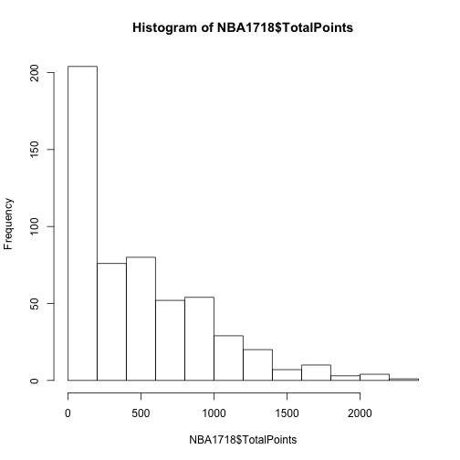
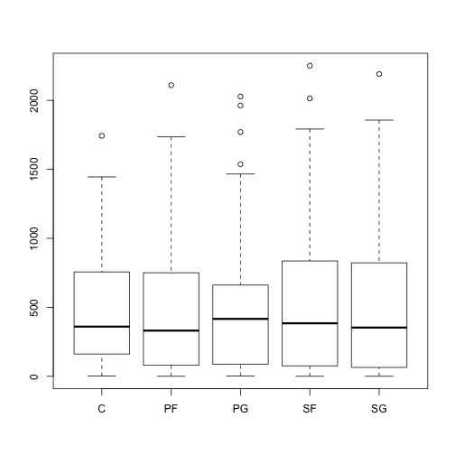
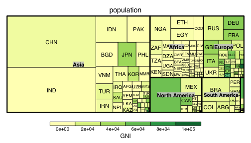

R快速上手
========================================================
author: 曾意儒 Yi-Ju Tseng
autosize: true
font-family: 'Microsoft JhengHei'
navigation: slide

在分析之前
========================================================
- RStudio怎麼用？[對應書本章節](https://yijutseng.github.io/DataScienceRBook/install.html#rstudio)
- R基本語法: [對應書本章節](https://yijutseng.github.io/DataScienceRBook/intro.html)
- R資料結構: [對應書本章節](https://yijutseng.github.io/DataScienceRBook/RDataStructure.html)


RStudio Interface
========================================================
left: 30%
共有四個區塊，分別為：

- 程式碼編輯區 Source editor
- 執行視窗 Console
- 環境/物件
- 檔案/圖表/說明文件

***


RStudio 使用步驟
========================================================
- New Project (如果原本沒有的話)
- New R Script (如果原本沒有的話)
- 在左上方**程式碼編輯區 Source editor**撰寫程式碼
- 將需要執行的程式碼反白，點選**Run**，執行程式碼
- 將游標移至需要執行的程式碼，點選**Run** 也可執行該行程式碼
- 程式碼會在左下方Console視窗執行，顯示結果
- 如果有畫圖，會出現在右下方視窗
- 可在右上方視窗檢查所有變數

Console視窗
========================================================
- 可直譯的語言
- 可在執行視窗(Console)直接打程式碼
- `>` : 輸入指令
- `+` : 表示前面的程式碼還沒打完
    - 鍵入完整的程式碼
    - **Esc**跳出

RStudio hands-on
====================================
type:alert
incremental:true

- 打開RStudio
- 左上角**File**->**New Project** (如果原本沒有的話)
- 左上角**File**->**New File**->**R Script** (如果原本沒有的話)
- 在Console輸入1+，按Enter
- 試著跳出打不完的程式碼，變回輸入模式`>`

R = Base + Other Packages
========================================================
- 安裝套件Package的方法如下：

```r
install.packages("套件名稱")
```

- 套件名稱需要加上雙引號

```r
install.packages("ggplot2")
```

- 載入**已安裝**的套件：

```r
library(ggplot2)
```

- **不用**在套件名稱前後加雙引號

Help
========================================================
- R語言與套件均有完整的文件與範例可以參考
- 輸入`?函數名稱`或`?套件名稱`

```r
?ggplot2
?ymd
```

- Google
- [Stack Overflow](http://stackoverflow.com/)也有許多問答

資料分析步驟
========================================================
type:sub-section 
- 資料匯入
- 資料清洗處理並轉換為Tidy data
- 資料分析
- 資料呈現與視覺化

資料分析步驟
========================================================
type:sub-section 
- **資料匯入** 
- 資料清洗處理並轉換為Tidy data
- 資料分析
- 資料呈現與視覺化

資料匯入
====================================
- 從檔案匯入
- 從網路匯入
- 從Facebook匯入

從檔案匯入
====================================
type:section
- **Import Dataset功能 (RStudio)**
- R物件 .rds
- R程式 .R
- 純文字資料 (無分隔)
- 其他格式

Import Dataset功能 (RStudio)
====================================
選取RStudio四分割視窗右上角的Environment標籤，選擇**Import Dataset**


Import Dataset功能 (RStudio)
====================================
- 選取`From CSV`
- 點選`Browse`按鈕開啟檔案選取器


Import Dataset功能 (RStudio)
====================================
- 利用下方`Import Options`的選項微調參數
    - `Delimiter`分隔符號
    - `First Row as Names`首列是否為欄位名稱
    


Import Dataset功能 (RStudio)
====================================
type:alert
incremental:true

- 操作[範例檔案](https://raw.githubusercontent.com/CGUIM-BigDataAnalysis/BigDataCGUIM/master/104/POLIO_Incidence.csv)
- 若匯入的檔案為**tab分隔文字檔**? 該如何調整參數？

從網路匯入
====================================
type:section

- Open Data
- XML 可延伸標記式語言
- **API (Application programming interfaces)**
- **網頁爬蟲 Webscraping**
- JSON格式檔案


API
====================================
type:sub-section
- 應用程式介面
- **A**pplication **P**rogramming **I**nterfaces
- 為了讓第三方的開發者可以額外開發應用程式來強化他們的產品，推出可以與系統溝通的介面
- 有API輔助可將資料擷取過程自動化
    -  以下載Open Data為例，若檔案更新頻繁，使用手動下載相當耗時
- [維基百科](https://zh.wikipedia.org/zh-tw/%E5%BA%94%E7%94%A8%E7%A8%8B%E5%BA%8F%E6%8E%A5%E5%8F%A3)

API - Open Data
====================================
- [桃園公共自行車即時服務資料](http://data.tycg.gov.tw/opendata/datalist/datasetMeta?oid=5ca2bfc7-9ace-4719-88ae-4034b9a5a55c)資料
- 每日更新
- 不可能每日手動下載
- 提供透過**API**下載的服務
- 透過API下載的資料格式: **JSON格式**

***

- [桃園公共自行車即時服務資料API資訊](http://data.tycg.gov.tw/opendata/datalist/datasetMeta/outboundDesc?id=5ca2bfc7-9ace-4719-88ae-4034b9a5a55c&rid=a1b4714b-3b75-4ff8-a8f2-cc377e4eaa0f)
    - **資料集ID**: 紀錄資料的基本參數，如包含欄位、更新頻率等
    - **資料RID**: 資料集
    - 擷取範例


JSON檔案匯入
====================================
- `jsonlite` package (套件使用前必須安裝)
- `fromJSON()`函數載入JSON資料
- 如果API網址為**https**，則需使用 `httr` package
    - 使用`GET()`函數處理資料擷取網址
- API網址參考[桃園公共自行車即時服務資料API資訊](http://data.tycg.gov.tw/opendata/datalist/datasetMeta/outboundDesc?id=5ca2bfc7-9ace-4719-88ae-4034b9a5a55c&rid=a1b4714b-3b75-4ff8-a8f2-cc377e4eaa0f)

```r
library(jsonlite)
library(RCurl)
APIData<-fromJSON("http://data.tycg.gov.tw/api/v1/rest/datastore/a1b4714b-3b75-4ff8-a8f2-cc377e4eaa0f?format=json")
```

JSON檔案匯入
====================================
- 轉存為`列表list`的型態
- 兩個子元素(success, result)
- result中records子元素的類別為資料框data.frame

```r
str(APIData)
```

```
List of 2
 $ success: logi TRUE
 $ result :List of 5
  ..$ resource_id: chr "a1b4714b-3b75-4ff8-a8f2-cc377e4eaa0f"
  ..$ fields     :'data.frame':	15 obs. of  2 variables:
  .. ..$ type: chr [1:15] "int4" "text" "text" "text" ...
  .. ..$ id  : chr [1:15] "_id" "sno" "sna" "tot" ...
  ..$ records    :'data.frame':	100 obs. of  15 variables:
  .. ..$ _id    : int [1:100] 1 2 3 4 5 6 7 8 9 10 ...
  .. ..$ sarea  : chr [1:100] "中壢區" "中壢區" "中壢區" "中壢區" ...
  .. ..$ sareaen: chr [1:100] "Zhongli Dist." "Zhongli Dist." "Zhongli Dist." "Zhongli Dist." ...
  .. ..$ sna    : chr [1:100] "中央大學圖書館" "中壢高中" "中正公園(中美路)" "中壢火車站(前站)" ...
  .. ..$ aren   : chr [1:100] "No.300, Zhongda Rd." "No.215, Sec. 2, Zhongyang W. Rd. (opposite)" "No.101 to No.113, Zhongmei Rd. (opposite)" "No.139, Zhonghe Rd. (opposite)" ...
  .. ..$ sno    : chr [1:100] "2001" "2002" "2003" "2004" ...
  .. ..$ tot    : chr [1:100] "60" "52" "54" "106" ...
  .. ..$ snaen  : chr [1:100] "National Central University Library" "Jhungli Senior High School" "Zhongzheng Park" "TRA Zhongli Station (Front)" ...
  .. ..$ bemp   : chr [1:100] "29" "39" "16" "95" ...
  .. ..$ ar     : chr [1:100] "中大路300號(中央大學校內圖書館前)" "中央西路二段215號對面人行道" "中美路101號-113號對面人行道" "中和路139號對面圓環" ...
  .. ..$ act    : chr [1:100] "1" "1" "1" "1" ...
  .. ..$ lat    : chr [1:100] "24.968128" "24.960815" "24.959113" "24.953874" ...
  .. ..$ lng    : chr [1:100] "121.194666" "121.212038" "121.224805" "121.2256" ...
  .. ..$ sbi    : chr [1:100] "29" "13" "38" "8" ...
  .. ..$ mday   : chr [1:100] "20180927022640" "20180927022624" "20180927022622" "20180927022634" ...
  ..$ total      : int 233
  ..$ limit      : int 100
```

JSON檔案解析
====================================
- 使用`$`符號截取元素與子元素

```r
head(APIData$result$records)
```

| _id|sarea  |sareaen       |sna              |aren                                             |sno  |tot |snaen                                    |bemp |
|---:|:------|:-------------|:----------------|:------------------------------------------------|:----|:---|:----------------------------------------|:----|
|   1|中壢區 |Zhongli Dist. |中央大學圖書館   |No.300, Zhongda Rd.                              |2001 |60  |National Central University Library      |29   |
|   2|中壢區 |Zhongli Dist. |中壢高中         |No.215, Sec. 2, Zhongyang W. Rd. (opposite)      |2002 |52  |Jhungli Senior High School               |39   |
|   3|中壢區 |Zhongli Dist. |中正公園(中美路) |No.101 to No.113, Zhongmei Rd. (opposite)        |2003 |54  |Zhongzheng Park                          |16   |
|   4|中壢區 |Zhongli Dist. |中壢火車站(前站) |No.139, Zhonghe Rd. (opposite)                   |2004 |106 |TRA Zhongli Station (Front)              |95   |
|   5|中壢區 |Zhongli Dist. |中原大學         |No.200, Zhongbei Rd.                             |2005 |82  |Chung Yuan Christian University          |20   |
|   6|中壢區 |Zhongli Dist. |銀河廣場         |No.48, Jiuhe 1st St. (opposite)                  |2006 |58  |Galaxy Square                            |16   |
|   7|中壢區 |Zhongli Dist. |中壢區公所       |No.380, Huanbei Rd.                              |2007 |40  |Civil Affairs Office of Zhongli District |6    |
|   8|中壢區 |Zhongli Dist. |新明橋           |No.269 to No.373, Sec. 2, Yuanhua Rd. (opposite) |2008 |58  |Xinming Bridge                           |44   |

JSON檔案解析
====================================
分析各項**地區**車站數

```r
table(APIData$result$records$sarea)
```

|Var1   | Freq|
|:------|----:|
|八德區 |    5|
|大溪區 |    2|
|大園區 |    2|
|龜山區 |   10|
|蘆竹區 |    7|
|平鎮區 |    7|
|桃園區 |   32|
|中壢區 |   35|
分析可知中壢區車站較多


JSON檔案匯入練習
====================================
type:alert
incremental:true

- 練習用資料：[「臺北市今日施工資訊」API存取](http://data.taipei/opendata/datalist/apiAccess?scope=datasetMetadataSearch&q=id:4d29818c-a3ee-425d-b88a-22ac0c24c712)
- 使用匯入**範例**，將資料匯入R中
    - 提示：**fromJSON**
- 使用str()函數觀察匯入的資料
- 請問今日施工資料有幾筆觀察值？幾個欄位？


網頁爬蟲 Webscraping
====================================
type:sub-section

- 不是每個網站都提供API
- 人工複製貼上?!
- 程式化的方式擷取網頁資料: **網頁爬蟲（Webscraping）**（[Webscraping Wiki](http://en.wikipedia.org/wiki/Web_scraping)）
- 可能耗費很多網頁流量和資源 －很可能被鎖IP
- 在R的處理辦法
    - 當作XML檔案處理分析
    - 使用`rvest` package輔助

網頁爬蟲 Webscraping-rvest
====================================

載入[rvest](https://github.com/hadley/rvest)套件後，經由以下步驟進行網站解析：

- 使用`read_html(“欲擷取的網站網址”)`函數讀取網頁
- 使用`html_nodes()`函數擷取所需內容 (條件為CSS或xpath標籤)
- 使用`html_text()`函數處理/清洗擷取內容，留下需要的資料
- 使用`html_attr()`函數擷取資料參數（如連結url）


網頁爬蟲 Webscraping-rvest
====================================
- 擷取條件的撰寫會因網頁語法不同而有差異
- 使用**Google Chrome開發工具**輔助觀察擷取資料的條件
    - 或使用**SelectorGadget**輔助
    - 或使用**xpath-helper**輔助xpath標籤的擷取
- 觀察需要擷取的資料所在HTML片段
    - css class

網頁爬蟲 DCard實作 -1
====================================

```r
library(rvest) ##(爬蟲結果不代表本人意見)
DCardMCTU<-"https://www.dcard.tw/f/mcut"
DCardContent<-read_html(DCardMCTU)
post_title <- DCardContent %>% html_nodes(".PostEntry_title_H5o4d") %>% html_text()
post_contentShort<- DCardContent %>% html_nodes(".PostEntry_excerpt_2eHlN") %>% html_text()
post_author<- DCardContent %>% html_nodes(".PostAuthor_root_3vAJf") %>% html_text()
```

網頁爬蟲 DCard實作 -2
====================================

```r
##(爬蟲結果不代表本人意見)
post_like<- DCardContent %>% html_nodes(".Like_counter_1enlP") %>% html_text()
post_url <- DCardContent %>% html_nodes(".PostEntry_root_V6g0r") %>% html_attr("href")
DCardMCTU_posts <- 
    data.frame(title = post_title,
               author=post_author, 
               content=post_contentShort, 
               likeN=post_like,
               url=paste0("https://www.dcard.tw",post_url))
```

網頁爬蟲 DCard實作 -3
====================================

```r
DCardMCTU_posts[1:10,c("title","author","likeN")]
```

|title            |author                  |likeN |
|:----------------|:-----------------------|:-----|
|明志又拿第一     |明志科技大學            |16    |
|機車鑰匙沒拔     |明志科技大學            |9     |
|女宿？？？？？   |明志科技大學            |8     |
|學餐飲料！？     |明志科技大學 機械工程系 |5     |
|想被退宿         |明志科技大學 經營管理系 |4     |
|只有中華沒有距離 |明志科技大學            |4     |
|素質？           |明志科技大學            |3     |
|冷氣卡           |明志科技大學            |2     |
|訂書！           |明志科技大學            |0     |
|學餐真理串       |明志科技大學            |0     |

    
爬蟲練習
====================================
type:alert

- [Ptt Tech_Job 版](https://www.ptt.cc/bbs/Tech_Job/index.html)
- 試著爬出所有**標題**
- 爬出的第三個標題是？


從Facebook匯入
====================================
type:section
- Graph API in R
- Rfacebook package

Graph API in R
====================================
type:sub-section

- [Graph API](https://developers.facebook.com/docs/graph-api?locale=zh_TW)
    - 根據篩選條件，回傳JSON格式的資料
- [Graph API Explorer](https://developers.facebook.com/tools/explorer/)
    - 測試資料撈取方法和結果
- 必須要取得自己的**access token** (存取權杖)
    - 可在[Graph API Explorer](https://developers.facebook.com/tools/explorer/)視窗右上角的**Get Token**按鈕取得
    - [官方文件](https://developers.facebook.com/docs/facebook-login/access-tokens/?locale=zh_TW)


Rfacebook package
====================================
type:sub-section

使用 Rfacebook 取得 `tsaiingwen` 粉絲頁的資料

```r
library(Rfacebook) #初次使用須先安裝
token<-"your token" #將token複製到此處 
getPage("tsaiingwen", token,n = 5)
```
課堂操作

```
4 posts       from_id           from_name
1 46251501064 蔡英文 Tsai Ing-wen
2 46251501064 蔡英文 Tsai Ing-wen
3 46251501064 蔡英文 Tsai Ing-wen
4 46251501064 蔡英文 Tsai Ing-wen
```

Rfacebook package練習
====================================
type:alert
incremental:true
- 取得Facebook access token
- 使用Rfacebook package取得**台灣人工智慧學校**粉絲頁面的前五筆資料
- 第一筆資料的likes_count是多少?
- 第二筆資料的shares_count是多少?

資料分析步驟
========================================================
type:sub-section 
- 資料匯入
- **資料清洗處理**並轉換為Tidy data
- 資料分析
- 資料呈現與視覺化

Tidy Data
====================================

Each column is a variable. Each row is an observation.

- 一個欄位（Column）內只有一個數值，最好要有凡人看得懂的Column Name
- 不同的觀察值應該要在不同行（Row）
- 一張表裡面，有所有分析需要的資料
- 如果一定要多張表，中間一定要有index可以把表串起來
- One file, one table

資料分析步驟
========================================================
type:sub-section 
- 資料匯入
- 資料清洗處理並轉換為Tidy data
- **資料分析**
- 資料呈現與視覺化

量化的分析方式: 單變量-集中趨勢
====================================

```r
mean(iris$Sepal.Length)
```

```
[1] 5.843333
```

```r
median(iris$Sepal.Length)
```

```
[1] 5.8
```

```r
table(iris$Species)
```

```

    setosa versicolor  virginica 
        50         50         50 
```

量化的分析方式: 單變量-分散程度
====================================

```r
min(iris$Sepal.Length)
```

```
[1] 4.3
```

```r
max(iris$Sepal.Length)
```

```
[1] 7.9
```

```r
range(iris$Sepal.Length)
```

```
[1] 4.3 7.9
```

量化的分析方式: 單變量-分散程度
====================================

```r
quantile(iris$Sepal.Length)
```

```
  0%  25%  50%  75% 100% 
 4.3  5.1  5.8  6.4  7.9 
```

```r
var(iris$Sepal.Length)
```

```
[1] 0.6856935
```

```r
sd(iris$Sepal.Length)
```

```
[1] 0.8280661
```

量化的分析方式 w/ R
====================================
- 大多可用R的內建函數完成計算
- 但是在探索式分析時，常常需要**資料分組**
    - 觀察**男性**和**女性**的血壓差異
    - **A隊**與**B隊**的三分球命中率差異
    - **中鋒**和**後衛**的助攻次數
    - ...等
- 若只用基本的內建函數計算，相當耗時
    - `data.table`和`dplyr` packages可以快速完成**分組分析**!


dplyr
====================================
type:sub-section 

- [Hadley Wickham](http://hadley.nz/)開發
- 使用以下函數分析整理資料：
    - `select()`: 選要分析的欄位，欄位子集 (Column)
    - `filter()`: 選要分析的觀察值，觀察值子集 (Row)
    - `mutate()`: 增加新欄位
    - `summarise()`: 計算統計值

dplyr
====================================
type:sub-section 

- 使用以下函數分析整理資料：
    - `group_by()`: 分組依據
    - `arrange()`: 觀察值排序
    - `rename()`: 欄位重新命名
    - `%>%`: the “pipe” operator 連結上數函式，將所有函式計算串在一起執行

dplyr
====================================

如要使用必須安裝並載入`dplyr` package

```r
install.packages("dplyr") ##安裝
```

```r
library(dplyr) ##載入
```

以NBA資料為例，首先先讀入資料

```r
library(SportsAnalytics)
NBA1718<-fetch_NBAPlayerStatistics("17-18")
```

欄位(Column)子集 select() 
====================================
- 針對欄位 (Column)做子集
- `select(資料名稱,欄位條件1,欄位條件2,...)`
- 條件1與條件2是使用**或**的連結概念

欄位(Column)子集 select() 
====================================
篩選欄位名稱為`Name`、開頭是`Threes`或是開頭是`FieldGoals`的欄位

```r
select1<-
    select(NBA1718,Name,starts_with("Threes"),
            starts_with("FieldGoals"))
head(select1)
```

|Name         | ThreesMade| ThreesAttempted| FieldGoalsMade| FieldGoalsAttempted|
|:------------|----------:|---------------:|--------------:|-------------------:|
|Alex Abrines |         84|             221|            115|                 291|

欄位(Column)子集 select() 
====================================

若想篩選欄位`Name`到欄位`FieldGoalsMade`間的所有欄位，但不想要`GamesPlayed`欄位
- 用`:`串連欄位名稱
- 用`-`去除不要的欄位

```r
##等同於NBA1718[,c(2:4,612)]
select3<-
    select(NBA1718,Name:FieldGoalsMade,-GamesPlayed)
head(select3,3)
```

|Name         |Team |Position | TotalMinutesPlayed| FieldGoalsMade|
|:------------|:----|:--------|------------------:|--------------:|
|Alex Abrines |OKL  |SG       |               1134|            115|
|Quincy Acy   |BRO  |SF       |               1361|            130|
|Steven Adams |OKL  |C        |               2486|            448|

觀察值(Row)子集 filter()
====================================
- 是針對列 (Row)做子集
- `filter(資料名稱,篩選條件1,篩選條件2)`篩選條件們是用**且**的邏輯串連
- **出場分鐘數超過2850分鐘**的球員資料，可輸入下列指令

```r
##等於NBA1718[NBA1718$TotalMinutesPlayed>2850,]
filter(NBA1718,TotalMinutesPlayed>2850)
```

|League |Name             |Team |Position | GamesPlayed| TotalMinutesPlayed| FieldGoalsMade| FieldGoalsAttempted| ThreesMade| ThreesAttempted| FreeThrowsMade| FreeThrowsAttempted| OffensiveRebounds| TotalRebounds| Assists| Steals| Turnovers| Blocks| PersonalFouls| Disqualifications| TotalPoints| Technicals| Ejections| FlagrantFouls| GamesStarted|
|:------|:----------------|:----|:--------|-----------:|------------------:|--------------:|-------------------:|----------:|---------------:|--------------:|-------------------:|-----------------:|-------------:|-------:|------:|---------:|------:|-------------:|-----------------:|-----------:|----------:|---------:|-------------:|------------:|
|NBA    |Bradley Beal     |WAS  |SG       |          82|               2977|            683|                1484|        199|             530|            292|                 369|                61|           362|     373|     97|       214|     35|           160|                 1|        1857|          3|         0|             0|           82|
|NBA    |Paul George      |OKL  |SF       |          79|               2892|            576|                1340|        244|             609|            338|                 411|                73|           448|     263|    161|       212|     39|           232|                 1|        1734|          6|         0|             0|           79|
|NBA    |Jrue Holiday     |NOR  |PG       |          81|               2924|            615|                1244|        120|             356|            187|                 238|                62|           365|     486|    122|       216|     64|           201|                 1|        1537|          0|         0|             0|           81|
|NBA    |Lebron James     |CLE  |SF       |          82|               3024|            857|                1580|        149|             406|            388|                 531|                97|           711|     747|    117|       348|     71|           135|                 0|        2251|          6|         0|             0|           82|
|NBA    |Cj Mccollum      |POR  |SG       |          81|               2922|            667|                1504|        189|             476|            209|                 250|                53|           321|     272|     77|       152|     35|           168|                 0|        1732|          1|         0|             0|           81|
|NBA    |Khris Middleton  |MIL  |SF       |          82|               2980|            593|                1271|        146|             406|            320|                 362|                45|           427|     328|    118|       191|     21|           270|                 1|        1652|          4|         0|             0|           82|
|NBA    |Karl-antho Towns |MIN  |C        |          82|               2920|            639|                1171|        120|             285|            345|                 402|               241|          1015|     199|     64|       160|    116|           285|                 3|        1743|          4|         0|             0|           82|
|NBA    |Russel Westbrook |OKL  |PG       |          80|               2916|            757|                1687|         97|             326|            417|                 566|               151|           806|     819|    148|       381|     20|           200|                 1|        2028|         14|         0|             0|           80|
|NBA    |Andrew Wiggins   |MIN  |SG       |          82|               2979|            569|                1300|        112|             338|            202|                 314|                81|           357|     160|     91|       138|     52|           163|                 1|        1452|          0|         0|             0|           82|

觀察值(Row)子集 filter()
====================================
也可選擇隊伍名稱為"BOS"或"SAN"的球員資料

```r
##等於NBA1718[NBA1718$Team %in% c("BOS","SAN"),]
filter(NBA1718,Team %in% c("BOS","SAN"))
```

|League |Name             |Team |Position | GamesPlayed| TotalMinutesPlayed| FieldGoalsMade| FieldGoalsAttempted| ThreesMade| ThreesAttempted| FreeThrowsMade| FreeThrowsAttempted| OffensiveRebounds| TotalRebounds| Assists| Steals| Turnovers| Blocks| PersonalFouls| Disqualifications| TotalPoints| Technicals| Ejections| FlagrantFouls| GamesStarted|
|:------|:----------------|:----|:--------|-----------:|------------------:|--------------:|-------------------:|----------:|---------------:|--------------:|-------------------:|-----------------:|-------------:|-------:|------:|---------:|------:|-------------:|-----------------:|-----------:|----------:|---------:|-------------:|------------:|
|NBA    |Lamarcu Aldridge |SAN  |PF       |          75|               2512|            687|                1347|         27|              92|            334|                 399|               245|           634|     152|     43|       112|     89|           161|                 1|        1735|          3|         0|             0|           75|
|NBA    |Kadeem Allen     |BOS  |SG       |          11|                106|              6|                  22|          0|              11|              7|                   9|                 4|            11|      12|      3|         9|      2|            14|                 0|          19|          0|         0|             0|            1|
|NBA    |Kyle Anderson    |SAN  |SG       |          74|               1977|            231|                 438|         19|              57|            104|                 146|                84|           395|     202|    116|        94|     60|           114|                 0|         585|          0|         0|             0|           67|
|NBA    |Aron Baynes      |BOS  |C        |          81|               1487|            210|                 446|          3|              21|             59|                  78|               129|           433|      93|     22|        80|     51|           200|                 0|         482|          0|         0|             0|           67|
|NBA    |Davis Bertans    |SAN  |SF       |          76|               1085|            161|                 365|         94|             251|             40|                  49|                18|           153|      74|     27|        36|     29|            93|                 0|         456|          0|         0|             0|           10|
|NBA    |Jabari Bird      |BOS  |SG       |          11|                115|             15|                  26|          3|               7|              6|                  12|                 6|            19|       8|      3|         8|      1|             7|                 0|          39|          0|         0|             0|            1|


觀察值(Row)子集 filter()
====================================
也可使用 `&` 和 `|`等符號串連邏輯

```r
filter(NBA1718,
       FieldGoalsMade/FieldGoalsAttempted>0.7
           &GamesPlayed>30)
```

|League |Name       |Team |Position | GamesPlayed| TotalMinutesPlayed| FieldGoalsMade| FieldGoalsAttempted| ThreesMade| ThreesAttempted| FreeThrowsMade| FreeThrowsAttempted| OffensiveRebounds| TotalRebounds| Assists| Steals| Turnovers| Blocks| PersonalFouls| Disqualifications| TotalPoints| Technicals| Ejections| FlagrantFouls| GamesStarted|
|:------|:----------|:----|:--------|-----------:|------------------:|--------------:|-------------------:|----------:|---------------:|--------------:|-------------------:|-----------------:|-------------:|-------:|------:|---------:|------:|-------------:|-----------------:|-----------:|----------:|---------:|-------------:|------------:|
|NBA    |Ante Zizic |CLE  |PF       |          31|                217|             49|                  67|          0|               0|             21|                  29|                24|            60|       5|      2|        11|     13|            30|                 0|         119|          0|         0|             0|            2|

dplyr 子集練習
====================================
type:alert
incremental:true

- 讀入NBA資料

```r
library(SportsAnalytics)
library(dplyr)
NBA1718<-fetch_NBAPlayerStatistics("17-18")
```
- 試著用dplyr語法篩選出所有**助攻數(Assists)超過100**且**抄截數大於20**的球員資料
- 只留下Name Team Position GamesPlayed TotalMinutesPlayed Assists Steals 七個欄位


計算統計值 summarise() 
====================================
- **球員個數**、**不重複的隊伍數**以及**不重複的守備位置數**等
- n(), n_distinct()

```r
summarise(NBA1718,
          nPlayer=n(),
          nTeam=n_distinct(Team),
          nPos=n_distinct(Position))
```

```
  nPlayer nTeam nPos
1     540    33    6
```

計算統計值 summarise() 
====================================
- 通常會與其他功能合併使用
- 計算**出場分鐘數大於2500分鐘**的**球員個數**、**平均投進的兩分球數**以及**平均投出的兩分球數**

```r
filter1<-filter(NBA1718,TotalMinutesPlayed>2500)
summarise(filter1,
          nPlayer=n(),
          meanFGMade=mean(FieldGoalsMade),
          meanFGAtt=mean(FieldGoalsAttempted))
```

```
  nPlayer meanFGMade meanFGAtt
1      33   568.5758  1207.667
```

dplyr filter()+summarise() 練習
====================================
type:alert
incremental:true

- 讀入NBA資料

```r
library(SportsAnalytics)
library(dplyr)
NBA1718<-fetch_NBAPlayerStatistics("17-18")
```
- 試著用dplyr語法篩選出所有**助攻數(Assists)超過100**且**抄截數大於20**的球員資料
- 計算這些球員的**平均出場數GamesPlayed**，**平均出場分鐘數TotalMinutesPlayed**

pipe %>%
====================================
- 直接用**pipe**符號`%>%`將指令串連，減少暫存物件（filter1）的生成

```r
filter(NBA1718,TotalMinutesPlayed>2500) %>%
    summarise(nPlayer=n(),
        meanFGMade=mean(FieldGoalsMade),
        meanFGAtt=mean(FieldGoalsAttempted))
```

```
  nPlayer meanFGMade meanFGAtt
1      33   568.5758  1207.667
```

分組 group_by()
====================================
- 設定分組依據
- 與`summarise()`函式合併使用
- 計算各**隊**（以Team作為分組依據）的**球員數**、**平均投進的兩分球數**以及**平均投出的兩分球數**

```r
group_by(NBA1718,Team)%>%
    summarise(nPlayer=n(),
        meanFGMade=mean(FieldGoalsMade),
        meanFGAtt=mean(FieldGoalsAttempted))
```

|Team | nPlayer| meanFGMade| meanFGAtt|
|:----|-------:|----------:|---------:|
|ATL  |      19|   140.3684|  313.8421|
|BOS  |      19|   171.2632|  376.8947|
|BRO  |      18|   167.3889|  382.3333|
|CHA  |      17|   190.9412|  422.7059|

分組 group_by()
====================================
- 可設定**多個**分組依據
- 計算各**隊**各**守備位置**（以Team和Position作為分組依據）的**球員數**、**平均投進的兩分球數**以及**平均投出的兩分球數**

```r
group_by(NBA1718,Team,Position)%>%
  summarise(nPlayer=n(),
        meanFGMade=mean(FieldGoalsMade),
        meanFGAtt=mean(FieldGoalsAttempted))
```

|Team |Position | nPlayer| meanFGMade| meanFGAtt|
|:----|:--------|-------:|----------:|---------:|
|ATL  |C        |       2|   177.5000|     328.5|
|ATL  |PF       |       3|   174.6667|     337.0|
|ATL  |PG       |       4|   196.7500|     466.5|

排序 arrange()
====================================
排序功能，預設為**遞增排序**

```r
arrange(NBA1718,TotalMinutesPlayed)
```

|League |Name             |Team |Position | GamesPlayed| TotalMinutesPlayed| FieldGoalsMade| FieldGoalsAttempted| ThreesMade| ThreesAttempted| FreeThrowsMade| FreeThrowsAttempted| OffensiveRebounds| TotalRebounds| Assists| Steals| Turnovers| Blocks| PersonalFouls| Disqualifications| TotalPoints| Technicals| Ejections| FlagrantFouls| GamesStarted|
|:------|:----------------|:----|:--------|-----------:|------------------:|--------------:|-------------------:|----------:|---------------:|--------------:|-------------------:|-----------------:|-------------:|-------:|------:|---------:|------:|-------------:|-----------------:|-----------:|----------:|---------:|-------------:|------------:|
|NBA    |Chris Boucher    |GSW  |PF       |           1|                  1|              0|                   1|          0|               1|              0|                   0|                 0|             1|       0|      0|         0|      0|             0|                 0|           0|          0|         0|             0|            0|
|NBA    |Trey Mckinney    |IND  |SG       |           1|                  1|              0|                   0|          0|               0|              0|                   0|                 0|             0|       0|      0|         0|      0|             0|                 0|           0|          0|         0|             0|            0|
|NBA    |Naza Mitrou-long |UTA  |PF       |           1|                  1|              1|                   1|          1|               1|              0|                   0|                 0|             0|       0|      0|         0|      0|             0|                 0|           3|          0|         0|             0|            0|
|NBA    |Minda Kuzminskas |NYK  |PF       |           1|                  2|              0|                   2|          0|               0|              0|                   0|                 0|             0|       0|      0|         0|      0|             0|                 0|           0|          0|         0|             0|            0|
|NBA    |Tyler Lydon      |DEN  |PF       |           1|                  2|              0|                   0|          0|               0|              0|                   0|                 0|             0|       0|      0|         0|      0|             0|                 0|           0|          0|         0|             0|            0|
|NBA    |Edmond Sumner    |IND  |PG       |           1|                  2|              1|                   1|          0|               0|              0|                   0|                 0|             1|       0|      0|         0|      0|             1|                 0|           2|          0|         0|             0|            0|

遞減排序 arrange()
====================================
使用`desc()`將要**遞減排序**的變數包起來，就可以遞減排序

```r
arrange(NBA1718,
        desc(TotalMinutesPlayed),
        desc(GamesPlayed))
```

|League |Name            |Team |Position | GamesPlayed| TotalMinutesPlayed| FieldGoalsMade| FieldGoalsAttempted| ThreesMade| ThreesAttempted| FreeThrowsMade| FreeThrowsAttempted| OffensiveRebounds| TotalRebounds| Assists| Steals| Turnovers| Blocks| PersonalFouls| Disqualifications| TotalPoints| Technicals| Ejections| FlagrantFouls| GamesStarted|
|:------|:---------------|:----|:--------|-----------:|------------------:|--------------:|-------------------:|----------:|---------------:|--------------:|-------------------:|-----------------:|-------------:|-------:|------:|---------:|------:|-------------:|-----------------:|-----------:|----------:|---------:|-------------:|------------:|
|NBA    |Lebron James    |CLE  |SF       |          82|               3024|            857|                1580|        149|             406|            388|                 531|                97|           711|     747|    117|       348|     71|           135|                 0|        2251|          6|         0|             0|           82|
|NBA    |Khris Middleton |MIL  |SF       |          82|               2980|            593|                1271|        146|             406|            320|                 362|                45|           427|     328|    118|       191|     21|           270|                 1|        1652|          4|         0|             0|           82|
|NBA    |Andrew Wiggins  |MIN  |SG       |          82|               2979|            569|                1300|        112|             338|            202|                 314|                81|           357|     160|     91|       138|     52|           163|                 1|        1452|          0|         0|             0|           82|

dplyr綜合範例
====================================
- 結合`group_by()`、`summarise()`、`arrange()`，可完成一連串的資料分析
- 計算各**隊**各**守備**位置（以Team和Position作為分組依據）的球員數、平均投進的兩分球數以及平均投出的兩分球數，並依平均投進的兩分球數**由大到小排序**

```r
group_by(NBA1718,Team,Position) %>%
  summarise(nPlayer=n(),
    meanFGMade=mean(FieldGoalsMade),
    meanFGAtt=mean(FieldGoalsAttempted)) %>%
  arrange(desc(meanFGMade))
```

|Team |Position | nPlayer| meanFGMade| meanFGAtt|
|:----|:--------|-------:|----------:|---------:|
|PHI  |C        |       1|        510| 1053.0000|
|MIA  |PG       |       1|        484| 1075.0000|
|MIL  |SF       |       3|        473|  953.6667|

dplyr 綜合練習
====================================
type:alert
incremental:true

- 讀入NBA資料

```r
library(SportsAnalytics)
library(dplyr)
NBA1718<-fetch_NBAPlayerStatistics("17-18")
```
- 試著用dplyr語法篩選出所有**助攻數(Assists)超過100**且**抄截數大於20**的球員資料
- 依**守備位置**Position分組，計算球員的平均**出場數**GamesPlayed，平均**出場分鐘數**TotalMinutesPlayed
- 依平均出場數GamesPlayed**由大到小**排序
- 用pipe **%>%**

dplyr 參考文件與資源
====================================
- [Introduction to dplyr](https://cran.rstudio.com/web/packages/dplyr/vignettes/introduction.html)
- DataCamp互動式教學課程 [Data Manipulation in R with dplyr](https://www.datacamp.com/courses/dplyr-data-manipulation-r-tutorial)

資料分析步驟
========================================================
type:sub-section 
- 資料匯入
- 資料清洗處理並轉換為Tidy data
- 資料分析
- **資料呈現與視覺化**


常用的畫圖套件
====================================
type:sub-section 

- 基本功能(Base)：可自學
- `lattice`：可自學
- `ggplot2`

得分分佈
====================================

```r
library(SportsAnalytics)
NBA1718<-fetch_NBAPlayerStatistics("17-18")
hist(NBA1718$TotalPoints)
```



不同守備位置的得分分佈
====================================

```r
boxplot(TotalPoints~Position,NBA1718)
```



ggplot2簡介
====================================
type:sub-section 

- Dr. Leland Wilkinson [Grammar of Graphics](http://www.springer.com/us/book/9780387245447)

“In brief, the grammar tells us that a statistical graphic is a `mapping` from data to `aesthetic` attributes (colour, shape, size) of `geometric` objects (points, lines, bars). The plot may also contain statistical transformations of the data and is drawn on a specific coordinate system”

-from `ggplot2` book

ggplot2簡介
====================================
- [Hadley Wickham](http://hadley.nz/)開發
- 一直是最熱門的R packages之一
- [ggplot2 GitHub](https://github.com/tidyverse/ggplot2)

ggplot2 參考資料
====================================
- [ggplot2 官網](http://ggplot2.tidyverse.org/)
- [ggplot2 package source code](https://github.com/tidyverse/ggplot2)
- [ggplot2 cheat sheet](https://www.rstudio.com/wp-content/uploads/2015/03/ggplot2-cheatsheet.pdf)
- [ggplot2 doc](http://docs.ggplot2.org/)


Treemap
====================================
type:sub-section 
- Treemap(矩形式樹狀結構繪圖法)
- 以二維平面的方式展示包含階層結構（hierarchical）形式的統計資訊
- `treemap` packages

treemap() data
====================================

```r
library(treemap)
data(GNI2014)
knitr::kable(head(GNI2014))
```


|   |iso3 |country          |continent     | population|    GNI|
|:--|:----|:----------------|:-------------|----------:|------:|
|3  |BMU  |Bermuda          |North America |      67837| 106140|
|4  |NOR  |Norway           |Europe        |    4676305| 103630|
|5  |QAT  |Qatar            |Asia          |     833285|  92200|
|6  |CHE  |Switzerland      |Europe        |    7604467|  88120|
|7  |MAC  |Macao SAR, China |Asia          |     559846|  76270|
|8  |LUX  |Luxembourg       |Europe        |     491775|  75990|

treemap()
====================================

```r
library(treemap)
data(GNI2014)
treemap(GNI2014,
       index=c("continent", "iso3"), #分組依據
       vSize="population", #區塊大小
       vColor="GNI", #顏色深淺
       type="value")
```



互動式資料呈現
====================================

- [互動式資料呈現](http://yijutseng.github.io/DataScienceRBook/InteractiveGraphics.html)
- [ggvis](http://yijutseng.github.io/DataScienceRBook/InteractiveGraphics.html#ggvis)
- [googleVis](http://yijutseng.github.io/DataScienceRBook/InteractiveGraphics.html#googlevis)
- [Plot.ly](http://yijutseng.github.io/DataScienceRBook/InteractiveGraphics.html#plot.ly)

ggplot2與資料視覺化參考資料
====================================
type:sub-section 

- 官方網站[文件](http://docs.ggplot2.org/current/)
- RStudio製作的[ggplot cheat sheet](https://www.rstudio.com/wp-content/uploads/2016/11/ggplot2-cheatsheet-2.1.pdf)
- [每個人心中都有一碗巷口的牛肉湯](http://tequila1979.blogspot.tw/2017/01/blog-post.html)

