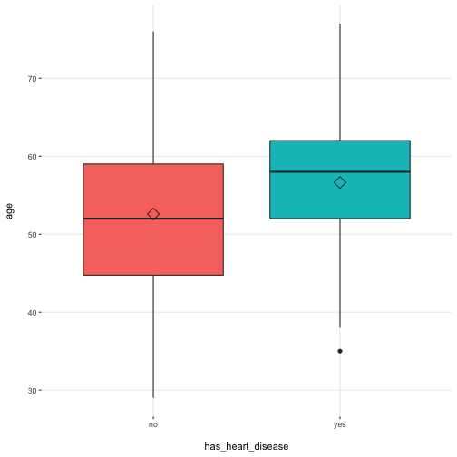

探索式資料分析
========================================================
author: 曾意儒 Yi-Ju Tseng
autosize: true
font-family: 'Microsoft JhengHei'
navigation: slide


對應書本章節
========================================================
[7 探索式資料分析](http://yijutseng.github.io/DataScienceRBook/eda.html)

大綱
====================================
type:sub-section 

- 什麼是探索式資料分析
- 量化的分析方式
- dplyr
- data.table


什麼是探索式資料分析
====================================
type:sub-section 

- 探索式資料分析 (**E**xploratory **D**ata **A**nalysis)
- 在資料量 大/雜/髒 的時候，探索式資料分析非常重要
- 運用**視覺化**、**基本的統計**等工具，反覆的探索**資料特性**，獲取資料所包含的資訊、結構和特點
- 在進行複雜或嚴謹的分析之前，必須要對資料有更多認識，才能訂定**對的資料分析方向**
- 通常**不需要**嚴謹的假設和細節呈現


探索式資料分析
====================================
- 分析各變數間的**關聯性**，看是否有預料之外的有趣發現
- 觀察資料內容是否符合預期，若否，檢查資料**是否有誤**
- 檢查資料是否符合分析前的假設

透過探索性分析來**調整分析的方向**，減少因分析方向錯誤所造成的時間浪費。

探索式資料分析 - 快速查看
====================================
首先安裝`funModeling`套件

```r
install.packages("funModeling")
```
並載入

```r
library(funModeling)
```

探索式資料分析 - 快速查看
====================================
用`df_status()`快速查看資料的完整程度，以內建的`heart_disease`資料為例：

```r
df_status(heart_disease)
```

```
                 variable q_zeros p_zeros q_na p_na q_inf p_inf    type
1                     age       0    0.00    0 0.00     0     0 integer
2                  gender       0    0.00    0 0.00     0     0  factor
3              chest_pain       0    0.00    0 0.00     0     0  factor
4  resting_blood_pressure       0    0.00    0 0.00     0     0 integer
5       serum_cholestoral       0    0.00    0 0.00     0     0 integer
6     fasting_blood_sugar     258   85.15    0 0.00     0     0  factor
7         resting_electro     151   49.83    0 0.00     0     0  factor
8          max_heart_rate       0    0.00    0 0.00     0     0 integer
9             exer_angina     204   67.33    0 0.00     0     0 integer
10                oldpeak      99   32.67    0 0.00     0     0 numeric
11                  slope       0    0.00    0 0.00     0     0 integer
12      num_vessels_flour     176   58.09    4 1.32     0     0 integer
13                   thal       0    0.00    2 0.66     0     0  factor
14 heart_disease_severity     164   54.13    0 0.00     0     0 integer
15           exter_angina     204   67.33    0 0.00     0     0  factor
16      has_heart_disease       0    0.00    0 0.00     0     0  factor
   unique
1      41
2       2
3       4
4      50
5     152
6       2
7       3
8      91
9       2
10     40
11      3
12      4
13      3
14      5
15      2
16      2
```


|variable               | q_zeros| p_zeros| q_na| p_na| q_inf| p_inf|type    | unique|
|:----------------------|-------:|-------:|----:|----:|-----:|-----:|:-------|------:|
|age                    |       0|    0.00|    0| 0.00|     0|     0|integer |     41|
|gender                 |       0|    0.00|    0| 0.00|     0|     0|factor  |      2|
|chest_pain             |       0|    0.00|    0| 0.00|     0|     0|factor  |      4|
|resting_blood_pressure |       0|    0.00|    0| 0.00|     0|     0|integer |     50|
|serum_cholestoral      |       0|    0.00|    0| 0.00|     0|     0|integer |    152|
|fasting_blood_sugar    |     258|   85.15|    0| 0.00|     0|     0|factor  |      2|
|resting_electro        |     151|   49.83|    0| 0.00|     0|     0|factor  |      3|
|max_heart_rate         |       0|    0.00|    0| 0.00|     0|     0|integer |     91|
|exer_angina            |     204|   67.33|    0| 0.00|     0|     0|integer |      2|
|oldpeak                |      99|   32.67|    0| 0.00|     0|     0|numeric |     40|
|slope                  |       0|    0.00|    0| 0.00|     0|     0|integer |      3|
|num_vessels_flour      |     176|   58.09|    4| 1.32|     0|     0|integer |      4|
|thal                   |       0|    0.00|    2| 0.66|     0|     0|factor  |      3|
|heart_disease_severity |     164|   54.13|    0| 0.00|     0|     0|integer |      5|
|exter_angina           |     204|   67.33|    0| 0.00|     0|     0|factor  |      2|
|has_heart_disease      |       0|    0.00|    0| 0.00|     0|     0|factor  |      2|

探索式資料分析 - 快速查看
====================================
用`plot_num()`快速畫直方圖，查看數值資料的分佈

```r
plot_num(heart_disease)
```


探索式資料分析 - 快速查看
====================================
用`profiling_num()`快速查看資料的統計數字

```r
profiling_num(heart_disease)
```

```
                variable   mean std_dev variation_coef p_01 p_05 p_25
1                    age  54.44    9.04           0.17   35   40   48
2 resting_blood_pressure 131.69   17.60           0.13  100  108  120
3      serum_cholestoral 246.69   51.78           0.21  149  175  211
4         max_heart_rate 149.61   22.88           0.15   95  108  134
5            exer_angina   0.33    0.47           1.44    0    0    0
6                oldpeak   1.04    1.16           1.12    0    0    0
7                  slope   1.60    0.62           0.38    1    1    1
8      num_vessels_flour   0.67    0.94           1.39    0    0    0
9 heart_disease_severity   0.94    1.23           1.31    0    0    0
   p_50  p_75  p_95  p_99 skewness kurtosis  iqr        range_98
1  56.0  61.0  68.0  71.0    -0.21      2.5 13.0        [35, 71]
2 130.0 140.0 160.0 180.0     0.70      3.8 20.0      [100, 180]
3 241.0 275.0 326.9 406.7     1.13      7.4 64.0   [149, 406.74]
4 153.0 166.0 181.9 192.0    -0.53      2.9 32.5 [95.02, 191.96]
5   0.0   1.0   1.0   1.0     0.74      1.5  1.0          [0, 1]
6   0.8   1.6   3.4   4.2     1.26      4.5  1.6        [0, 4.2]
7   2.0   2.0   3.0   3.0     0.51      2.4  1.0          [1, 3]
8   0.0   1.0   3.0   3.0     1.18      3.2  1.0          [0, 3]
9   0.0   2.0   3.0   4.0     1.05      2.8  2.0          [0, 4]
        range_80
1       [42, 66]
2     [110, 152]
3 [188.8, 308.8]
4   [116, 176.6]
5         [0, 1]
6       [0, 2.8]
7         [1, 2]
8         [0, 2]
9         [0, 3]
```


|variable               |   mean| std_dev| variation_coef| p_01| p_05| p_25|  p_50|  p_75|  p_95|  p_99| skewness| kurtosis|  iqr|range_98        |range_80       |
|:----------------------|------:|-------:|--------------:|----:|----:|----:|-----:|-----:|-----:|-----:|--------:|--------:|----:|:---------------|:--------------|
|age                    |  54.44|    9.04|           0.17|   35|   40|   48|  56.0|  61.0|  68.0|  71.0|    -0.21|      2.5| 13.0|[35, 71]        |[42, 66]       |
|resting_blood_pressure | 131.69|   17.60|           0.13|  100|  108|  120| 130.0| 140.0| 160.0| 180.0|     0.70|      3.9| 20.0|[100, 180]      |[110, 152]     |
|serum_cholestoral      | 246.69|   51.78|           0.21|  149|  175|  211| 241.0| 275.0| 326.9| 406.7|     1.13|      7.4| 64.0|[149, 406.74]   |[188.8, 308.8] |
|max_heart_rate         | 149.61|   22.88|           0.15|   95|  108|  134| 153.0| 166.0| 181.9| 192.0|    -0.53|      2.9| 32.5|[95.02, 191.96] |[116, 176.6]   |
|exer_angina            |   0.33|    0.47|           1.44|    0|    0|    0|   0.0|   1.0|   1.0|   1.0|     0.74|      1.6|  1.0|[0, 1]          |[0, 1]         |
|oldpeak                |   1.04|    1.16|           1.12|    0|    0|    0|   0.8|   1.6|   3.4|   4.2|     1.26|      4.5|  1.6|[0, 4.2]        |[0, 2.8]       |
|slope                  |   1.60|    0.62|           0.38|    1|    1|    1|   2.0|   2.0|   3.0|   3.0|     0.51|      2.4|  1.0|[1, 3]          |[1, 2]         |
|num_vessels_flour      |   0.67|    0.94|           1.39|    0|    0|    0|   0.0|   1.0|   3.0|   3.0|     1.18|      3.2|  1.0|[0, 3]          |[0, 2]         |
|heart_disease_severity |   0.94|    1.23|           1.31|    0|    0|    0|   0.0|   2.0|   3.0|   4.0|     1.05|      2.8|  2.0|[0, 4]          |[0, 3]         |

探索式資料分析 - 快速查看
====================================
用`cross_plot()`快速查看某欄位（類別）與某連續變項（年齡）的關係

```r
cross_plot(heart_disease, 
           input=c("age"),
           target="has_heart_disease")
```


探索式資料分析 - 快速查看
====================================
用`plotar()`快速查看某欄位（類別）與某連續變項（年齡）的關係

```r
plotar(data=heart_disease, input = c("age"),
       target="has_heart_disease", 
       plot_type="boxplot")
```




探索式資料分析
====================================

- 圖形化Graphical
    - 單變量Univariate
    - 雙變量Bivariate
    - 多變量Multivariate
    
- 量化Quantitative
    - 單變量Univariate
    - 雙變量Bivariate
    - 多變量Multivariate

圖形化的分析
====================================
包括做圖與列表，將會在下章節介紹，本章節著重於量化的分析方式。


量化的分析方式: 單變量
====================================
資料初步統計，量化的分析方式可包含

- 計算集中趨勢
    - 平均值 Mean `mean()`
    - 中位數 Median `median()`
    - 眾數 Mode，R無內建函數，可直接用`table()`找出現次數最多的資料
    
量化的分析方式: 單變量-集中趨勢
====================================

```r
mean(iris$Sepal.Length)
```

```
[1] 5.8
```

```r
median(iris$Sepal.Length)
```

```
[1] 5.8
```

```r
table(iris$Species)
```

```

    setosa versicolor  virginica 
        50         50         50 
```
    
量化的分析方式: 單變量
====================================
資料初步統計，量化的分析方式可包含

- 計算資料分散程度
    - 最小值 Min `min()`
    - 最大值 Max `max()`
    - 範圍 Range `range()`
    - 四分位差 Quartiles `quantile()`
    - 變異數 Variance `var()`
    - 標準差 Standard deviation `sd()`
    
量化的分析方式: 單變量-分散程度
====================================

```r
min(iris$Sepal.Length)
```

```
[1] 4.3
```

```r
max(iris$Sepal.Length)
```

```
[1] 7.9
```

```r
range(iris$Sepal.Length)
```

```
[1] 4.3 7.9
```

量化的分析方式: 單變量
====================================

```r
quantile(iris$Sepal.Length)
```

```
  0%  25%  50%  75% 100% 
 4.3  5.1  5.8  6.4  7.9 
```

```r
var(iris$Sepal.Length)
```

```
[1] 0.69
```

```r
sd(iris$Sepal.Length)
```

```
[1] 0.83
```

單變量分析練習
====================================
type:alert
incremental:true

- 在mtcars資料集中，車子馬力(hp)的平均值？標準差？
- 在mtcars資料集中，幾個汽缸(cyl)的車子最多？
- 在mtcars資料集中，油耗(mpg)的四分位數是多少？

量化的分析方式: 雙變量
====================================
- 列聯表 Crosstabs `table()`, `prop.table()`
- 共變異數 Covariance `cov()` 用於衡量兩個變量的總體誤差，[維基百科](https://zh.wikipedia.org/wiki/%E5%8D%8F%E6%96%B9%E5%B7%AE)
- 相關性 Correlation `cor()`

量化的分析方式: 雙變量-列聯表
====================================
汽缸的數目與自手排的關係

```r
table(mtcars$cyl,mtcars$am)
```

```
   
     0  1
  4  3  8
  6  4  3
  8 12  2
```

量化的分析方式: 雙變量-列聯表
====================================

```r
mtTable<-table(mtcars$cyl,mtcars$am)
prop.table(mtTable)
```

```
   
        0     1
  4 0.094 0.250
  6 0.125 0.094
  8 0.375 0.062
```

量化的分析方式: 雙變量-列聯表
====================================

```r
prop.table(mtTable,margin = 1)
```

```
   
       0    1
  4 0.27 0.73
  6 0.57 0.43
  8 0.86 0.14
```

```r
prop.table(mtTable,margin = 2)
```

```
   
       0    1
  4 0.16 0.62
  6 0.21 0.23
  8 0.63 0.15
```

量化的分析方式: 雙變量-共變異數
====================================

```r
cov(mtcars)
```

|     |  mpg|   cyl|  disp|   hp|  drat|    wt|  qsec|    vs|    am|  gear| carb|
|:----|----:|-----:|-----:|----:|-----:|-----:|-----:|-----:|-----:|-----:|----:|
|mpg  |   36|  -9.2|  -633| -321|   2.2|  -5.1|   4.5|   2.0|   1.8|   2.1| -5.4|
|cyl  |   -9|   3.2|   200|  102|  -0.7|   1.4|  -1.9|  -0.7|  -0.5|  -0.6|  1.5|
|disp | -633| 199.7| 15361| 6721| -47.1| 107.7| -96.1| -44.4| -36.6| -50.8| 79.1|
|hp   | -321| 101.9|  6721| 4701| -16.5|  44.2| -86.8| -25.0|  -8.3|  -6.4| 83.0|
|drat |    2|  -0.7|   -47|  -16|   0.3|  -0.4|   0.1|   0.1|   0.2|   0.3| -0.1|
|wt   |   -5|   1.4|   108|   44|  -0.4|   1.0|  -0.3|  -0.3|  -0.3|  -0.4|  0.7|
|qsec |    4|  -1.9|   -96|  -87|   0.1|  -0.3|   3.2|   0.7|  -0.2|  -0.3| -1.9|
|vs   |    2|  -0.7|   -44|  -25|   0.1|  -0.3|   0.7|   0.3|   0.0|   0.1| -0.5|
|am   |    2|  -0.5|   -37|   -8|   0.2|  -0.3|  -0.2|   0.0|   0.2|   0.3|  0.0|
|gear |    2|  -0.6|   -51|   -6|   0.3|  -0.4|  -0.3|   0.1|   0.3|   0.5|  0.3|
|carb |   -5|   1.5|    79|   83|  -0.1|   0.7|  -1.9|  -0.5|   0.0|   0.3|  2.6|

量化的分析方式: 雙變量-相關性
====================================
油耗跟馬力的關聯性（相關係數）

```r
cor(mtcars$mpg,mtcars$hp)
```

```
[1] -0.8
```

雙變量分析練習
====================================
type:alert
incremental:true

- 在airquality資料集中，氣溫Temp和臭氧濃度Ozone的相關係數是多少？
- 在mtcars資料集中，各汽缸數cyl中，各類前進檔數gear的比例是多少

量化的分析方式 w/ R
====================================
- 大多可用R的內建函數完成計算
- 但是在探索式分析時，常常需要**資料分組**
    - 觀察**男性**和**女性**的血壓差異
    - **A隊**與**B隊**的三分球命中率差異
    - **中鋒**和**後衛**的助攻次數
    - ...等
- 若只用基本的內建函數計算，相當耗時
    - `data.table`和`dplyr` packages可以快速完成**分組分析**!


dplyr
====================================
type:sub-section 

- [Hadley Wickham](http://hadley.nz/)開發
- 使用以下函數分析整理資料：
    - `select()`: 選要分析的欄位，欄位子集 (Column)
    - `filter()`: 選要分析的觀察值，觀察值子集 (Row)
    - `mutate()`: 增加新欄位
    - `summarise()`: 計算統計值

dplyr
====================================
type:sub-section 

- 使用以下函數分析整理資料：
    - `group_by()`: 分組依據
    - `arrange()`: 觀察值排序
    - `rename()`: 欄位重新命名
    - `%>%`: the “pipe” operator 連結上數函式，將所有函式計算串在一起執行

dplyr
====================================

如要使用必須安裝並載入`dplyr` package

```r
install.packages("dplyr") ##安裝
```

```r
library(dplyr) ##載入
```

以NBA資料為例，首先先讀入資料

```r
library(SportsAnalytics)
NBA1718<-fetch_NBAPlayerStatistics("17-18")
```

增加新欄位 mutate()
====================================
- 新增新欄位`FGRate`，欄位值為`FieldGoalsMade/FieldGoalsAttempted`

```r
mutate1<-
    mutate(NBA1718,
           FGRate=FieldGoalsMade/FieldGoalsAttempted)
mutate1$FGRate[1:5]
```

```
[1] 0.4 0.4 0.6 0.5 0.4
```

計算統計值 summarise() 
====================================
- **球員個數**、**不重複的隊伍數**以及**不重複的守備位置數**等
- n(), n_distinct()

```r
summarise(NBA1718,
          nPlayer=n(),
          nTeam=n_distinct(Team),
          nPos=n_distinct(Position))
```

```
  nPlayer nTeam nPos
1     540    33    6
```

計算統計值 summarise() 
====================================
- 通常會與其他功能合併使用
- 計算**出場分鐘數大於2500分鐘**的**球員個數**、**平均投進的兩分球數**以及**平均投出的兩分球數**

```r
filter1<-filter(NBA1718,TotalMinutesPlayed>2500)
summarise(filter1,
          nPlayer=n(),
          meanFGMade=mean(FieldGoalsMade),
          meanFGAtt=mean(FieldGoalsAttempted))
```

```
  nPlayer meanFGMade meanFGAtt
1      33        569      1208
```

dplyr filter()+summarise() 練習
====================================
type:alert
incremental:true

- 讀入NBA資料

```r
library(SportsAnalytics)
library(dplyr)
NBA1718<-fetch_NBAPlayerStatistics("17-18")
```
- 試著用dplyr語法篩選出所有**助攻數(Assists)超過100**且**抄截數大於20**的球員資料
- 計算這些球員的**平均出場數GamesPlayed**，**平均出場分鐘數TotalMinutesPlayed**

pipe %>%
====================================
- 直接用**pipe**符號`%>%`將指令串連，減少暫存物件（filter1）的生成

```r
filter(NBA1718,TotalMinutesPlayed>2500) %>%
    summarise(nPlayer=n(),
        meanFGMade=mean(FieldGoalsMade),
        meanFGAtt=mean(FieldGoalsAttempted))
```

```
  nPlayer meanFGMade meanFGAtt
1      33        569      1208
```

dplyr pipe %>% 練習
====================================
type:alert
incremental:true

- 讀入NBA資料

```r
library(SportsAnalytics)
NBA1718<-fetch_NBAPlayerStatistics("17-18")
library(dplyr)
```
- 試著用dplyr語法篩選出所有**助攻數(Assists)超過100**且**抄截數大於20**的球員資料
- 計算這些球員的**平均出場數GamesPlayed**，**平均出場分鐘數TotalMinutesPlayed**
- 用pipe **%>%**

分組 group_by()
====================================
- 設定分組依據
- 與`summarise()`函式合併使用
- 計算各**隊**（以Team作為分組依據）的**球員數**、**平均投進的兩分球數**以及**平均投出的兩分球數**

```r
group_by(NBA1718,Team)%>%
    summarise(nPlayer=n(),
        meanFGMade=mean(FieldGoalsMade),
        meanFGAtt=mean(FieldGoalsAttempted))
```

|Team | nPlayer| meanFGMade| meanFGAtt|
|:----|-------:|----------:|---------:|
|ATL  |      19|        140|       314|
|BOS  |      19|        171|       377|
|BRO  |      18|        167|       382|
|CHA  |      17|        191|       423|

分組 group_by()
====================================
- 可設定**多個**分組依據
- 計算各**隊**各**守備位置**（以Team和Position作為分組依據）的**球員數**、**平均投進的兩分球數**以及**平均投出的兩分球數**

```r
group_by(NBA1718,Team,Position)%>%
  summarise(nPlayer=n(),
        meanFGMade=mean(FieldGoalsMade),
        meanFGAtt=mean(FieldGoalsAttempted))
```

|Team |Position | nPlayer| meanFGMade| meanFGAtt|
|:----|:--------|-------:|----------:|---------:|
|ATL  |C        |       2|        178|       328|
|ATL  |PF       |       3|        175|       337|
|ATL  |PG       |       4|        197|       466|

排序 arrange()
====================================
排序功能，預設為**遞增排序**

```r
arrange(NBA1718,TotalMinutesPlayed)
```

|League |Name             |Team |Position | GamesPlayed| TotalMinutesPlayed| FieldGoalsMade| FieldGoalsAttempted| ThreesMade| ThreesAttempted| FreeThrowsMade| FreeThrowsAttempted| OffensiveRebounds| TotalRebounds| Assists| Steals| Turnovers| Blocks| PersonalFouls| Disqualifications| TotalPoints| Technicals| Ejections| FlagrantFouls| GamesStarted|
|:------|:----------------|:----|:--------|-----------:|------------------:|--------------:|-------------------:|----------:|---------------:|--------------:|-------------------:|-----------------:|-------------:|-------:|------:|---------:|------:|-------------:|-----------------:|-----------:|----------:|---------:|-------------:|------------:|
|NBA    |Chris Boucher    |GSW  |PF       |           1|                  1|              0|                   1|          0|               1|              0|                   0|                 0|             1|       0|      0|         0|      0|             0|                 0|           0|          0|         0|             0|            0|
|NBA    |Trey Mckinney    |IND  |SG       |           1|                  1|              0|                   0|          0|               0|              0|                   0|                 0|             0|       0|      0|         0|      0|             0|                 0|           0|          0|         0|             0|            0|
|NBA    |Naza Mitrou-long |UTA  |PF       |           1|                  1|              1|                   1|          1|               1|              0|                   0|                 0|             0|       0|      0|         0|      0|             0|                 0|           3|          0|         0|             0|            0|
|NBA    |Minda Kuzminskas |NYK  |PF       |           1|                  2|              0|                   2|          0|               0|              0|                   0|                 0|             0|       0|      0|         0|      0|             0|                 0|           0|          0|         0|             0|            0|
|NBA    |Tyler Lydon      |DEN  |PF       |           1|                  2|              0|                   0|          0|               0|              0|                   0|                 0|             0|       0|      0|         0|      0|             0|                 0|           0|          0|         0|             0|            0|
|NBA    |Edmond Sumner    |IND  |PG       |           1|                  2|              1|                   1|          0|               0|              0|                   0|                 0|             1|       0|      0|         0|      0|             1|                 0|           2|          0|         0|             0|            0|

遞減排序 arrange()
====================================
使用`desc()`將要**遞減排序**的變數包起來，就可以遞減排序

```r
arrange(NBA1718,
        desc(TotalMinutesPlayed),
        desc(GamesPlayed))
```

|League |Name            |Team |Position | GamesPlayed| TotalMinutesPlayed| FieldGoalsMade| FieldGoalsAttempted| ThreesMade| ThreesAttempted| FreeThrowsMade| FreeThrowsAttempted| OffensiveRebounds| TotalRebounds| Assists| Steals| Turnovers| Blocks| PersonalFouls| Disqualifications| TotalPoints| Technicals| Ejections| FlagrantFouls| GamesStarted|
|:------|:---------------|:----|:--------|-----------:|------------------:|--------------:|-------------------:|----------:|---------------:|--------------:|-------------------:|-----------------:|-------------:|-------:|------:|---------:|------:|-------------:|-----------------:|-----------:|----------:|---------:|-------------:|------------:|
|NBA    |Lebron James    |CLE  |SF       |          82|               3024|            857|                1580|        149|             406|            388|                 531|                97|           711|     747|    117|       348|     71|           135|                 0|        2251|          6|         0|             0|           82|
|NBA    |Khris Middleton |MIL  |SF       |          82|               2980|            593|                1271|        146|             406|            320|                 362|                45|           427|     328|    118|       191|     21|           270|                 1|        1652|          4|         0|             0|           82|
|NBA    |Andrew Wiggins  |MIN  |SG       |          82|               2979|            569|                1300|        112|             338|            202|                 314|                81|           357|     160|     91|       138|     52|           163|                 1|        1452|          0|         0|             0|           82|

dplyr綜合範例
====================================
- 結合`group_by()`、`summarise()`、`arrange()`，可完成一連串的資料分析
- 計算各**隊**各**守備**位置（以Team和Position作為分組依據）的球員數、平均投進的兩分球數以及平均投出的兩分球數，並依平均投進的兩分球數**由大到小排序**

```r
group_by(NBA1718,Team,Position) %>%
  summarise(nPlayer=n(),
    meanFGMade=mean(FieldGoalsMade),
    meanFGAtt=mean(FieldGoalsAttempted)) %>%
  arrange(desc(meanFGMade))
```

|Team |Position | nPlayer| meanFGMade| meanFGAtt|
|:----|:--------|-------:|----------:|---------:|
|PHI  |C        |       1|        510|      1053|
|MIA  |PG       |       1|        484|      1075|
|MIL  |SF       |       3|        473|       954|


修改欄位名稱 rename()
====================================
`新名稱=舊名稱`

```r
rename1<-rename(NBA1718,Po=Position)
rename1[1:5,1:5]
```

```
  League          Name Team Po GamesPlayed
1    NBA  Alex Abrines  OKL SG          74
2    NBA    Quincy Acy  BRO SF          70
3    NBA  Steven Adams  OKL  C          76
4    NBA   Bam Adebayo  MIA PF          69
5    NBA Arron Afflalo  ORL SG          52
```

dplyr 綜合練習
====================================
type:alert
incremental:true

- 讀入NBA資料

```r
library(SportsAnalytics)
library(dplyr)
NBA1718<-fetch_NBAPlayerStatistics("17-18")
```
- 試著用dplyr語法篩選出所有**助攻數(Assists)超過100**且**抄截數大於20**的球員資料
- 依**守備位置**Position分組，計算球員的平均**出場數**GamesPlayed，平均**出場分鐘數**TotalMinutesPlayed
- 依平均出場數GamesPlayed**由大到小**排序
- 用pipe **%>%**

dplyr 參考文件與資源
====================================
- [Introduction to dplyr](https://cran.rstudio.com/web/packages/dplyr/vignettes/introduction.html)
- DataCamp互動式教學課程 [Data Manipulation in R with dplyr](https://www.datacamp.com/courses/dplyr-data-manipulation-r-tutorial)


